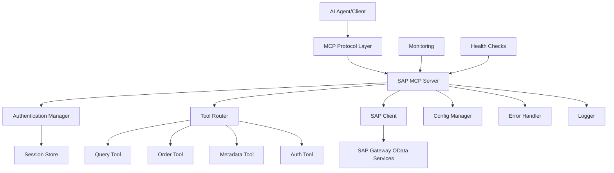
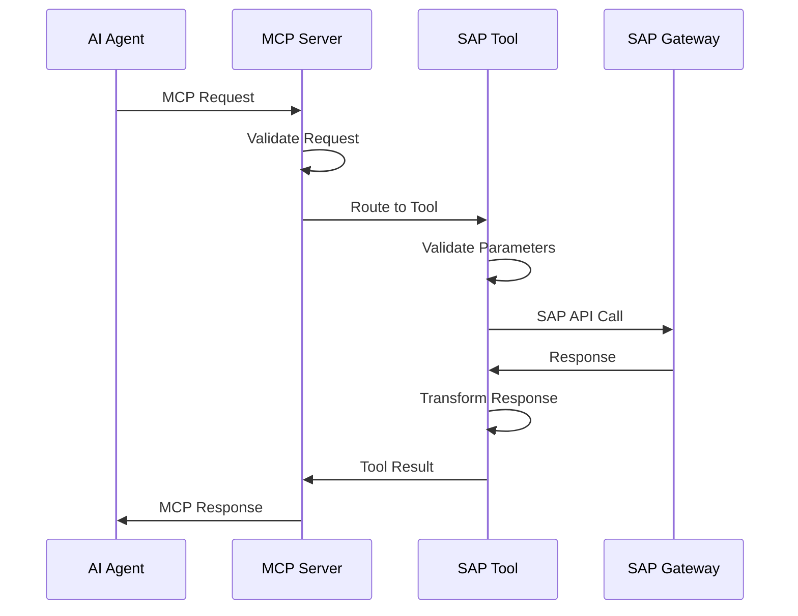
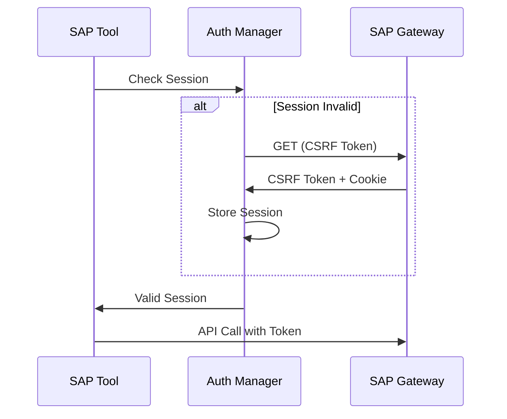
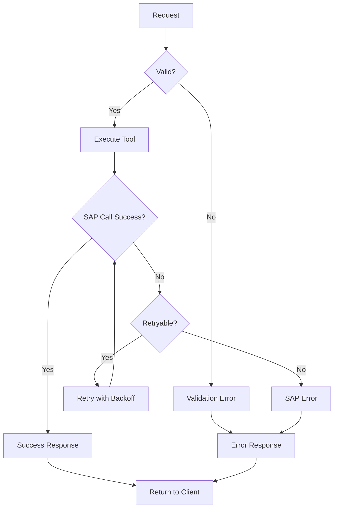

# SAP Gateway MCP Server - Technical Architecture

## System Overview



## Architecture Principles

### 1. Modularity
- **Separation of Concerns**: Clear boundaries between MCP protocol, SAP integration, and business logic
- **Plugin Architecture**: Extensible tool system for adding new SAP operations
- **Service Layer**: Abstract SAP complexity behind clean service interfaces

### 2. Scalability
- **Stateless Design**: No server-side session state for horizontal scaling
- **Connection Pooling**: Efficient SAP connection management
- **Async Processing**: Non-blocking I/O for high concurrency

### 3. Reliability
- **Circuit Breaker**: Prevent cascading failures
- **Retry Logic**: Intelligent retry with exponential backoff
- **Health Monitoring**: Continuous health assessment

### 4. Security
- **Credential Isolation**: Secure credential storage and management
- **Request Validation**: Input sanitization and validation
- **Audit Logging**: Complete audit trail for compliance

## Component Architecture

### 1. MCP Protocol Layer

```python
# src/sap_mcp/protocol/
├── server.py          # MCP server implementation
├── tools.py           # Tool registration and discovery
├── schemas.py         # JSON Schema definitions
└── handlers.py        # Request/response handlers
```

**Responsibilities**:
- MCP protocol compliance
- Tool registration and discovery
- Request routing and validation
- Response formatting and error handling

**Key Classes**:
```python
class MCPServer:
    """Main MCP server implementation"""
    async def handle_request(self, request: MCPRequest) -> MCPResponse
    async def register_tools(self) -> None
    async def get_tool_schema(self, tool_name: str) -> dict

class ToolRegistry:
    """Manages available tools and their schemas"""
    def register(self, tool: Tool) -> None
    def get_tool(self, name: str) -> Tool
    def list_tools(self) -> List[str]
```

### 2. SAP Integration Layer

```python
# src/sap_mcp/sap/
├── client.py          # SAP OData client
├── auth.py            # Authentication management  
├── models.py          # SAP data models
├── exceptions.py      # SAP-specific exceptions
└── utils.py           # Utility functions
```

**Responsibilities**:
- SAP Gateway connectivity
- OData protocol handling
- Authentication and session management
- Data transformation (JSON ↔ XML)

**Key Classes**:
```python
class SAPClient:
    """Main SAP Gateway client"""
    async def authenticate(self, credentials: SAPCredentials) -> SAPSession
    async def query(self, service: str, entity: str, filters: dict) -> dict
    async def create(self, service: str, entity: str, data: dict) -> dict
    async def get_metadata(self, service: str) -> dict

class AuthManager:
    """Handles SAP authentication and session management"""
    async def get_csrf_token(self) -> str
    async def refresh_session(self) -> None
    def is_session_valid(self) -> bool

class ODATAParser:
    """Handles OData protocol specifics"""
    def build_query_url(self, base_url: str, filters: dict) -> str
    def parse_xml_response(self, xml_data: str) -> dict
    def format_entity_data(self, data: dict) -> dict
```

### 3. Tool Implementation Layer

```python
# src/sap_mcp/tools/
├── __init__.py
├── auth.py            # Authentication tool
├── query.py           # Query tool
├── orders.py          # Order management tools
├── metadata.py        # Metadata tools
└── discovery.py       # Service discovery tools
```

**Tool Base Class**:
```python
from abc import ABC, abstractmethod
from typing import Dict, Any

class SAPTool(ABC):
    """Base class for all SAP tools"""
    
    @property
    @abstractmethod
    def name(self) -> str:
        """Tool name for MCP registration"""
        pass
    
    @property
    @abstractmethod
    def description(self) -> str:
        """Tool description"""
        pass
    
    @property
    @abstractmethod
    def input_schema(self) -> Dict[str, Any]:
        """JSON Schema for tool inputs"""
        pass
    
    @abstractmethod
    async def execute(self, params: Dict[str, Any]) -> Dict[str, Any]:
        """Execute the tool with given parameters"""
        pass
```

### 4. Configuration Management

```python
# src/sap_mcp/config/
├── __init__.py
├── settings.py        # Configuration models
├── loader.py          # Configuration loading
└── validation.py      # Configuration validation
```

**Configuration Structure**:
```python
from pydantic import BaseSettings, Field
from typing import Dict, Optional

class SAPConnectionConfig(BaseSettings):
    host: str
    port: int = 44300
    client: str = "100"
    verify_ssl: bool = True
    timeout: int = 30
    retry_attempts: int = 3

class MCPServerConfig(BaseSettings):
    host: str = "0.0.0.0"
    port: int = 8000
    log_level: str = "INFO"
    max_workers: int = 10

class SecurityConfig(BaseSettings):
    session_timeout: int = 3600
    max_concurrent_sessions: int = 100
    rate_limit_per_minute: int = 60

class AppConfig(BaseSettings):
    sap: SAPConnectionConfig
    server: MCPServerConfig
    security: SecurityConfig
    
    class Config:
        env_file = ".env"
        env_nested_delimiter = "__"
```

## Data Flow Architecture

### 1. Request Processing Flow



### 2. Authentication Flow



### 3. Error Handling Flow



## Security Architecture

### 1. Authentication & Authorization

```python
# Security Layers
class SecurityManager:
    """Centralized security management"""
    
    async def validate_request(self, request: MCPRequest) -> bool:
        """Validate incoming requests"""
        pass
    
    async def get_sap_credentials(self, context: str) -> SAPCredentials:
        """Retrieve SAP credentials securely"""
        pass
    
    def audit_log(self, event: AuditEvent) -> None:
        """Log security events"""
        pass

# Credential Management
class CredentialStore:
    """Secure credential storage"""
    
    def get_credentials(self, key: str) -> Optional[str]:
        """Get credentials from secure store"""
        pass
    
    def encrypt_sensitive_data(self, data: str) -> str:
        """Encrypt sensitive data"""
        pass
```

### 2. Network Security

```yaml
# Network Security Configuration
network_security:
  tls:
    min_version: "1.2"
    cipher_suites: ["ECDHE-RSA-AES256-GCM-SHA384", "ECDHE-RSA-AES128-GCM-SHA256"]
  
  firewall:
    inbound:
      - port: 8000
        protocol: "HTTPS"
        source: "0.0.0.0/0"
    outbound:
      - port: 44300
        protocol: "HTTPS"
        destination: "sap-servers"
  
  rate_limiting:
    requests_per_minute: 60
    burst_size: 10
    block_duration: 300
```

### 3. Data Protection

```python
# Data Protection Measures
class DataProtection:
    """Data protection and privacy"""
    
    @staticmethod
    def sanitize_logs(data: dict) -> dict:
        """Remove sensitive data from logs"""
        sensitive_fields = ["password", "token", "session_id"]
        return {k: "***" if k in sensitive_fields else v 
                for k, v in data.items()}
    
    @staticmethod
    def encrypt_at_rest(data: str) -> str:
        """Encrypt data at rest"""
        pass
    
    @staticmethod
    def mask_pii(data: dict) -> dict:
        """Mask personally identifiable information"""
        pass
```

## Performance Architecture

### 1. Connection Management

```python
class ConnectionPool:
    """SAP connection pool management"""
    
    def __init__(self, min_size: int = 1, max_size: int = 10):
        self.min_size = min_size
        self.max_size = max_size
        self.pool: List[SAPConnection] = []
        self.in_use: Set[SAPConnection] = set()
    
    async def get_connection(self) -> SAPConnection:
        """Get connection from pool"""
        pass
    
    async def return_connection(self, conn: SAPConnection) -> None:
        """Return connection to pool"""
        pass
    
    async def health_check(self) -> None:
        """Check connection health"""
        pass
```

### 2. Caching Strategy

```python
from typing import Optional
import asyncio
from datetime import datetime, timedelta

class CacheManager:
    """Response caching for performance"""
    
    def __init__(self, default_ttl: int = 300):
        self.default_ttl = default_ttl
        self.cache: Dict[str, CacheEntry] = {}
    
    async def get(self, key: str) -> Optional[Any]:
        """Get cached value"""
        pass
    
    async def set(self, key: str, value: Any, ttl: Optional[int] = None) -> None:
        """Set cached value"""
        pass
    
    async def invalidate(self, pattern: str) -> None:
        """Invalidate cache entries"""
        pass

# Cache Strategy
cache_strategy = {
    "metadata": {"ttl": 3600, "strategy": "write-through"},
    "service_list": {"ttl": 1800, "strategy": "write-through"},
    "sessions": {"ttl": 300, "strategy": "write-around"},
    "query_results": {"ttl": 60, "strategy": "cache-aside"}
}
```

### 3. Monitoring & Metrics

```python
from prometheus_client import Counter, Histogram, Gauge

# Performance Metrics
request_count = Counter("sap_mcp_requests_total", "Total requests", ["tool", "status"])
request_duration = Histogram("sap_mcp_request_duration_seconds", "Request duration")
active_connections = Gauge("sap_mcp_active_connections", "Active SAP connections")
session_count = Gauge("sap_mcp_active_sessions", "Active SAP sessions")

class MetricsCollector:
    """Collect and expose metrics"""
    
    def record_request(self, tool: str, status: str, duration: float) -> None:
        """Record request metrics"""
        request_count.labels(tool=tool, status=status).inc()
        request_duration.observe(duration)
    
    def update_connection_count(self, count: int) -> None:
        """Update active connection count"""
        active_connections.set(count)
```

## Deployment Architecture

### 1. Container Architecture

```dockerfile
# Multi-stage build for optimization
FROM python:3.11-slim as builder
WORKDIR /app
COPY requirements.txt .
RUN pip install --user --no-cache-dir -r requirements.txt

FROM python:3.11-slim
WORKDIR /app
COPY --from=builder /root/.local /root/.local
COPY src/ .
ENV PATH=/root/.local/bin:$PATH
EXPOSE 8000
HEALTHCHECK --interval=30s --timeout=10s --start-period=5s --retries=3 \
    CMD curl -f http://localhost:8000/health || exit 1
CMD ["python", "-m", "sap_mcp.server"]
```

### 2. Cloud Run Configuration

```yaml
apiVersion: serving.knative.dev/v1
kind: Service
metadata:
  name: sap-mcp-server
  annotations:
    run.googleapis.com/ingress: all
spec:
  template:
    metadata:
      annotations:
        autoscaling.knative.dev/maxScale: "10"
        autoscaling.knative.dev/minScale: "1"
        run.googleapis.com/cpu-throttling: "false"
        run.googleapis.com/memory: "1Gi"
        run.googleapis.com/cpu: "1000m"
    spec:
      containers:
      - image: gcr.io/project/sap-mcp-server:latest
        ports:
        - containerPort: 8000
        env:
        - name: SAP_HOST
          valueFrom:
            secretKeyRef:
              name: sap-credentials
              key: host
        resources:
          limits:
            memory: "1Gi"
            cpu: "1000m"
        livenessProbe:
          httpGet:
            path: /health
            port: 8000
          initialDelaySeconds: 10
          periodSeconds: 30
```

### 3. VM Deployment

```bash
#!/bin/bash
# VM Deployment Script

# System service configuration
cat > /etc/systemd/system/sap-mcp.service << EOF
[Unit]
Description=SAP MCP Server
After=network.target

[Service]
Type=simple
User=sapmcp
Group=sapmcp
WorkingDirectory=/opt/sap-mcp
Environment=PATH=/opt/sap-mcp/venv/bin
ExecStart=/opt/sap-mcp/venv/bin/python -m sap_mcp.server
Restart=always
RestartSec=5
StandardOutput=journal
StandardError=journal

[Install]
WantedBy=multi-user.target
EOF

# Enable and start service
systemctl enable sap-mcp
systemctl start sap-mcp
```

## Testing Architecture

### 1. Test Structure

```python
# tests/
├── unit/
│   ├── test_tools/
│   ├── test_sap/
│   └── test_protocol/
├── integration/
│   ├── test_sap_integration.py
│   └── test_mcp_protocol.py
├── e2e/
│   └── test_complete_workflows.py
└── fixtures/
    ├── sap_responses.json
    └── mock_data.py
```

### 2. Testing Strategy

```python
import pytest
from unittest.mock import AsyncMock, patch
from sap_mcp.tools.orders import CreateOrderTool

class TestCreateOrderTool:
    """Test suite for order creation tool"""
    
    @pytest.fixture
    async def mock_sap_client(self):
        """Mock SAP client for testing"""
        client = AsyncMock()
        client.create.return_value = {"success": True, "order_id": "12345"}
        return client
    
    @pytest.mark.asyncio
    async def test_create_order_success(self, mock_sap_client):
        """Test successful order creation"""
        tool = CreateOrderTool(sap_client=mock_sap_client)
        
        params = {
            "order_data": {
                "Auart": "OR",
                "Vkorg": "1000",
                "Vtweg": "10",
                "Spart": "00",
                "Kunnr": "100001"
            }
        }
        
        result = await tool.execute(params)
        
        assert result["success"] is True
        assert "order_id" in result
        mock_sap_client.create.assert_called_once()
    
    @pytest.mark.asyncio
    async def test_create_order_validation_error(self):
        """Test validation error handling"""
        tool = CreateOrderTool()
        
        params = {"order_data": {}}  # Missing required fields
        
        with pytest.raises(ValidationError):
            await tool.execute(params)
```

This architecture provides a solid foundation for building a production-ready SAP Gateway MCP server with proper separation of concerns, security, scalability, and maintainability.