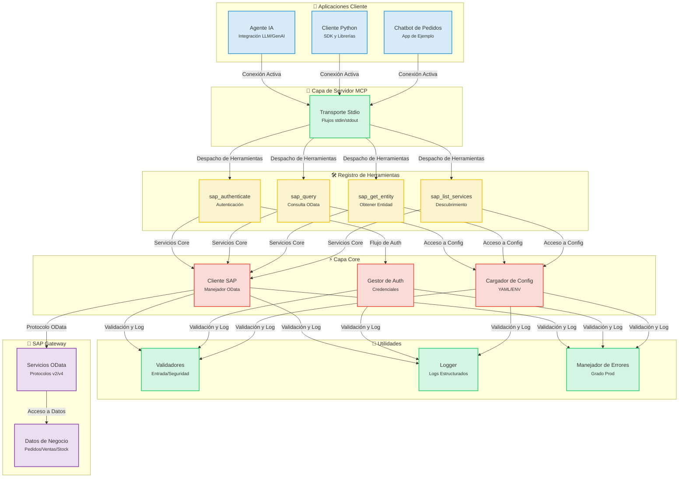
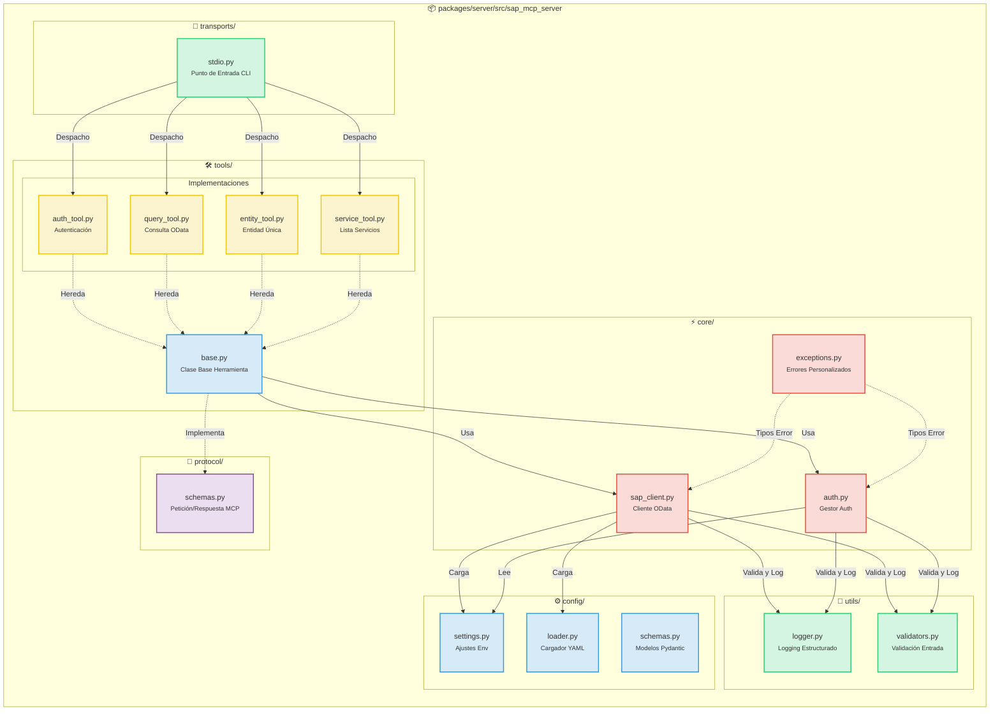
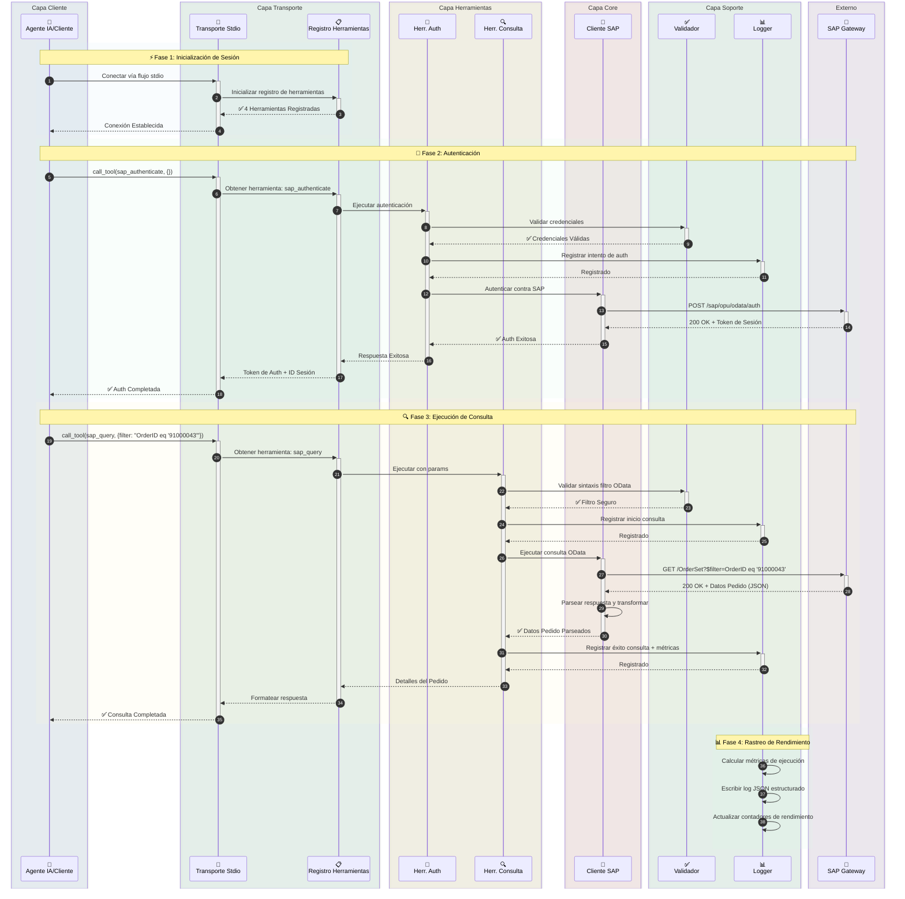
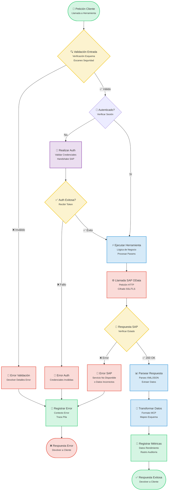
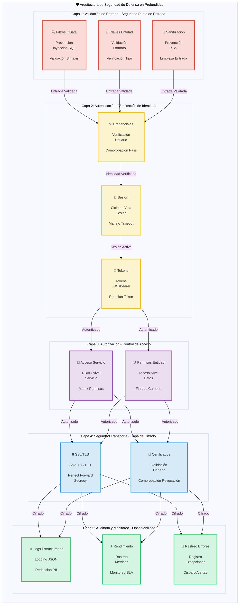

# SAP MCP - Integración de SAP Gateway vía Model Context Protocol

Servidor MCP completo para la integración de SAP Gateway, proporcionando herramientas modulares para agentes de IA y operaciones SAP OData.

<div align="center">

[](https://www.python.org/downloads/)
[](LICENSE)
[]()
[]()
[]()

</div>

---
## 📑 Tabla de Contenidos

- [🎯 Resumen del Proyecto](#-resumen-del-proyecto)
- [📋 Preparación](#-preparación)
- [📐 Arquitectura](#-arquitectura)
  - [Visión General del Sistema](#visión-general-del-sistema)
  - [Detalles de Componentes](#detalles-de-componentes)
  - [Flujo de Datos](#flujo-de-datos-ejemplo-de-consulta-de-pedidos)
  - [Flujo de Ejecución de Herramientas](#flujo-de-ejecución-de-herramientas)
  - [Arquitectura de Seguridad](#arquitectura-de-seguridad)
- [📦 Estructura del Repositorio](#-estructura-del-repositorio)
- [✨ Características](#-características)
- [🎓 Escenario de Demostración SAP SFLIGHT](#-escenario-de-demostración-sap-sflight)
  - [Resumen del Escenario](#resumen-del-escenario)
  - [Guía de Creación de Servicio OData](#guía-de-creación-de-servicio-odata)
- [🚀 Inicio Rápido](#-inicio-rápido)
  - [Requisitos Previos del Servidor MCP](#requisitos-previos-del-servidor-mcp)
  - [Instalación](#1-instalación)
  - [Configuración](#2-configuración)
  - [Ejecución del Servidor](#3-ejecución-del-servidor)
- [🤖 Integración con Gemini CLI](#-integración-con-gemini-cli)
  - [Requisitos Previos](#requisitos-previos)
  - [Instalación de Gemini CLI](#1-instalación-de-gemini-cli)
  - [Autenticación de Gemini CLI](#2-autenticación-de-gemini-cli)
  - [Registro del Servidor SAP MCP](#3-registro-del-servidor-sap-mcp)
  - [Comenzar a Usar](#4-comenzar-a-usar-sap-mcp-en-gemini-cli)
  - [Configuración Avanzada](#configuración-avanzada)
  - [Solución de Problemas](#solución-de-problemas)
  - [Herramientas Disponibles](#herramientas-sap-disponibles-en-gemini-cli)
  - [Ejemplos de Flujo de Trabajo](#ejemplos-de-flujo-de-trabajo)
- [🔧 Herramientas Disponibles](#-herramientas-disponibles)
  - [Autenticación SAP (sap_authenticate)](#1-autenticación-sap-sap_authenticate)
  - [Consulta SAP (sap_query)](#2-consulta-sap-sap_query)
  - [Obtener Entidad SAP (sap_get_entity)](#3-obtener-entidad-sap-sap_get_entity)
  - [Listar Servicios SAP (sap_list_services)](#4-listar-servicios-sap-sap_list_services)
  - [Añadir Nuevas Herramientas](#5-añadir-nuevas-herramientas)
- [📚 Ejemplos de Uso](#-ejemplos-de-uso)
- [🔒 Seguridad](#-seguridad)
- [📖 Documentación](#-documentación)
- [📝 Licencia](#-licencia)
- [🙏 Agradecimientos](#-agradecimientos)

---


## 🎯 Resumen del Proyecto

Este es un servidor Model Context Protocol (MCP) listo para producción, diseñado para permitir que los agentes de IA y las aplicaciones interactúen con los sistemas SAP Gateway a través de una arquitectura clara y modular. Construido para confiabilidad, seguridad y experiencia del desarrollador.

**Estado Actual**: ✅ **Listo para Producción** (Las 5 fases completadas)

### Características Clave

- 🔐 **Integración Segura con SAP**: Autenticación de nivel empresarial y soporte SSL/TLS
- 🛠️ **4 Herramientas Modulares**: Autenticación, Consulta, Obtención de Entidades y Descubrimiento de Servicios
- 🚀 **Transporte Stdio**: Servidor MCP de grado de producción
- 📊 **Logging Estructurado**: Formatos JSON y Consola con métricas de rendimiento
- ✅ **Entrada Validada**: Validación integral de OData y seguridad
- 🧪 **Totalmente Probado**: 56% de cobertura, 44/45 pruebas aprobadas (98% de tasa de éxito)

---

---

## 📋 Preparación

Comience con SAP MCP en 5 minutos:

```bash
# 1. Clonar y entrar
git clone <repository-url>
cd sap-mcp

# 2. Crear venv e instalar
python3 -m venv .venv
source .venv/bin/activate  # Windows: .venv\Scripts\activate
cd packages/server
pip install -e .

# 3. Configurar conexión SAP
cd ../..
cp .env.server.example .env.server
# Editar .env.server con sus credenciales de SAP

# 4. Configurar servicios
cp packages/server/config/services.yaml.example packages/server/config/services.yaml
# Editar services.yaml para configurar sus servicios SAP

# 5. Ejecutar servidor
sap-mcp-server-stdio
```

**Siguientes Pasos:**
- 📖 Para instrucciones detalladas de instalación, vea [Inicio Rápido](#-inicio-rápido).
- 🤖 Para conectar agentes de IA, verifique [Integración con Gemini CLI](#-integración-con-gemini-cli).
- 🔧 Para documentación de API, explore [Herramientas Disponibles](#-herramientas-disponibles).

## 📐 Arquitectura

### Visión General del Sistema

<details>
<summary>📊 Ver Diagrama de Visión General del Sistema (Clic para expandir)</summary>



</details>

### Detalles de Componentes

<details>
<summary>🔧 Ver Diagrama de Detalles de Componentes (Clic para expandir)</summary>



</details>

### Flujo de Datos: Ejemplo de Consulta de Pedidos

<details>
<summary>🔄 Ver Diagrama de Flujo de Datos (Clic para expandir)</summary>



</details>

### Flujo de Ejecución de Herramientas

<details>
<summary>⚡ Ver Diagrama de Flujo de Ejecución de Herramientas (Clic para expandir)</summary>



</details>

### Arquitectura de Seguridad

<details>
<summary>🔒 Ver Diagrama de Arquitectura de Seguridad (Clic para expandir)</summary>



</details>

---

## 📦 Estructura del Repositorio

```
sap-mcp/
├── packages/
│   └── server/                          ✅ Servidor MCP Listo para Producción
│       ├── src/sap_mcp_server/
│       │   ├── core/                    # Cliente SAP y Auth (4 archivos)
│       │   │   ├── __init__.py          # Init Módulo
│       │   │   ├── sap_client.py        # Operaciones OData
│       │   │   ├── auth.py              # Gestión Credenciales
│       │   │   └── exceptions.py        # Excepciones Personalizadas
│       │   ├── config/                  # Configuración (4 archivos)
│       │   │   ├── __init__.py          # Init Módulo
│       │   │   ├── settings.py          # Ajustes Env
│       │   │   ├── loader.py            # Cargador YAML
│       │   │   └── schemas.py           # Modelos Pydantic
│       │   ├── protocol/                # Protocolo MCP (2 archivos)
│       │   │   ├── __init__.py          # Init Módulo
│       │   │   └── schemas.py           # Esquemas Req/Res
│       │   ├── tools/                   # 4 Herramientas SAP Modulares (6 archivos)
│       │   │   ├── __init__.py          # Registro Herramientas
│       │   │   ├── base.py              # Clase Base Herramienta
│       │   │   ├── auth_tool.py         # Autenticación
│       │   │   ├── query_tool.py        # Consulta OData
│       │   │   ├── entity_tool.py       # Obtener Entidad
│       │   │   └── service_tool.py      # Descubrimiento Servicios
│       │   ├── transports/              # Capa Transporte (2 archivos)
│       │   │   ├── __init__.py          # Init Módulo
│       │   │   └── stdio.py             # Transporte Stdio ✅
│       │   ├── utils/                   # Utilidades (3 archivos)
│       │   │   ├── __init__.py          # Init Módulo
│       │   │   ├── logger.py            # Logging Estructurado
│       │   │   └── validators.py        # Validación Entrada
│       │   └── __init__.py              # Init Paquete
│       ├── config/                      # Configuración Servidor
│       │   ├── services.yaml            # Config Servicios SAP
│       │   └── services.yaml.example    # Plantilla Config
│       ├── tests/                       # Suite de Pruebas (7 archivos, 56% cobertura)
│       │   ├── __init__.py              # Init Paquete Pruebas
│       │   ├── conftest.py              # Fixtures Pytest
│       │   ├── unit/                    # Pruebas Unitarias
│       │   │   ├── __init__.py          # Paquete Pruebas Unitarias
│       │   │   ├── test_base.py         # Pruebas Herramienta Base
│       │   │   └── test_validators.py   # Pruebas Validadores
│       │   └── integration/             # Pruebas Integración
│       │       ├── __init__.py          # Paquete Pruebas Integración
│       │       └── test_tool_integration.py  # Pruebas Integración Herramientas
│       ├── pyproject.toml               # Config Paquete
│       └── README.md                    # Documentación Paquete Servidor
│
├── docs/                                # Documentación
│   ├── architecture/                    # Documentos Arquitectura
│   │   └── server.md                    # Arquitectura Servidor
│   └── guides/                          # Guías Usuario
│       ├── configuration.md             # Guía Configuración
│       ├── deployment.md                # Guía Despliegue
│       ├── troubleshooting.md           # Guía Solución Problemas
│       ├── odata-service-creation-flight-demo.md  # Creación Servicio OData
│       └── sfight-demo-guide.md         # Guía Demo SFLIGHT
│
├── examples/                            # Aplicaciones Ejemplo
│   ├── basic/                           # Ejemplos Básicos
│   │   └── stdio_client.py              # Ejemplo Cliente Stdio
│   ├── chatbot/                         # Ejemplo Chatbot
│   │   └── order_inquiry_chatbot.py     # Chatbot Consulta Pedidos
│   └── README.md                        # Documentación Ejemplos
│
├── scripts/                             # Scripts Desarrollo
│   ├── create_structure.sh              # Creación Estructura Proyecto
│   ├── migrate_code.sh                  # Script Migración Código
│   └── update_imports.py                # Script Actualización Imports
│
├── .env.server.example                  # Plantilla Entorno
├── README.md                            # Documentación Principal (Inglés)
├── README.ja.md                         # Documentación Japonés
├── README.ko.md                         # Documentación Coreano
├── README.th.md                         # Documentación Tailandés
├── README.zh-TW.md                      # Documentación Chino Tradicional
└── README.zh-CN.md                      # Documentación Chino Simplificado
```

---

## ✨ Características

### Capacidades Principales

<table>
<tr>
<td width="50%">

#### 🛠️ Herramientas
- ✅ **sap_authenticate**: Autenticación segura SAP
- ✅ **sap_query**: Consulta OData con filtros
- ✅ **sap_get_entity**: Obtención de entidad única
- ✅ **sap_list_services**: Descubrimiento de servicios

</td>
<td width="50%">

#### 🚀 Transporte
- ✅ **Stdio**: stdin/stdout listo para producción

</td>
</tr>
<tr>
<td>

#### 📊 Logging y Monitoreo
- ✅ **Logs Estructurados**: JSON + Consola
- ✅ **Métricas Rendimiento**: Tiempos de petición
- ✅ **Rastreo Errores**: Contexto completo
- ✅ **Rastro Auditoría**: Eventos de seguridad

</td>
<td>

#### 🔒 Seguridad
- ✅ **Validación Entrada**: OData y Seguridad
- ✅ **Soporte SSL/TLS**: Conexiones seguras
- ✅ **Gestión Credenciales**: .env.server
- ✅ **Manejo Errores**: Grado producción

</td>
</tr>
</table>

### Experiencia del Desarrollador

- ✅ **Arquitectura Modular**: Un archivo por herramienta
- ✅ **Seguridad de Tipos**: Type hints completos
- ✅ **Documentación**: Guías completas
- ✅ **Configuración Fácil**: `pip install -e .`
- ✅ **Recarga en Caliente**: Modo desarrollo
- ✅ **Apps Ejemplo**: 3 ejemplos funcionales

---

## 🎓 Escenario de Demostración SAP SFLIGHT

### Resumen del Escenario

Para facilitar el acceso, este proyecto se basa en el conjunto de datos de demostración SAP SFLIGHT.

El conjunto de datos SFLIGHT es una base de datos de ejemplo estándar proporcionada por SAP que contiene datos de horarios de vuelos, aerolíneas, aeropuertos y reservas. Es un recurso excelente para probar y demostrar el modelado de datos y la creación de servicios.

Esta guía asume que tiene un servicio OData que expone este conjunto de datos. El objetivo es conectar el servidor SAP MCP a este servicio e interactuar con él utilizando un agente de IA u otro cliente.

**Documentación Oficial de SAP:**
- [SAP Documentation - Flight Model](https://help.sap.com/SAPhelp_nw73/helpdata/en/cf/21f304446011d189700000e8322d00/frameset.htm)
- [SAP Help Portal - Flight Model](https://help.sap.com/docs/SAP_NETWEAVER_702/ff5206fc6c551014a1d28b076487e7df/cf21f304446011d189700000e8322d00.html)

---

### Guía de Creación de Servicio OData

Esta guía le llevará a través de la creación de un servicio OData en su sistema SAP utilizando el SAP Gateway Service Builder (`SEGW`) para exponer los datos del escenario Flight, que típicamente está disponible en las ediciones SAP S/4HANA Fully Activated Appliance (FAA).

#### Resumen del Escenario

* **Objetivo:** Exponer horarios de vuelos, reservas y datos maestros relacionados a través de un servicio OData.
* **Requisitos de Datos del Escenario:** Horarios de vuelos, fechas, horas, detalles de aeropuertos, detalles de aerolíneas, detalles de pasajeros, precios, etc.
* **Tablas SAP Relevantes:** `SFLIGHT`, `SPFLI`, `SCARR`, `SAIRPORT`, `SBOOK`, `SCUSTOM`.

---

#### Pasos para Crear el Servicio OData en SEGW

##### 1. Acceder a SAP Gateway Service Builder

Vaya al código de transacción SAP `SEGW`.

##### 2. Crear un Nuevo Proyecto

1. Haga clic en el botón "Create Project".
2. **Project Name:** Asigne un nombre (ej. `Z_TRAVEL_RECOMMENDATIONS_SRV`).
3. **Description:** Ingrese una descripción significativa.
4. **Package:** Asigne a un paquete (ej. `$TMP` para desarrollo local o un paquete transportable).

##### 3. Importar Modelo de Datos desde Estructura DDIC

Este paso define las entidades OData basadas en las tablas SAP subyacentes.

1. Haga clic derecho en la carpeta "Data Model" en su proyecto.
2. Seleccione **"Import" -> "DDIC Structure"**.
3. Repita el proceso de importación para cada tabla requerida, especificando el **Entity Type Name** y seleccionando los campos requeridos.

***Acción Requerida:*** Asegúrese de marcar correctamente los campos clave durante la importación.

| Estructura DDIC | Nombre Tipo Entidad | Campos Clave Sugeridos | Campos Payload Relevantes (Ejemplo) |
| :---- | :---- | :---- | :---- |
| `SFLIGHT` | **Flight** | `CARRID`, `CONNID`, `FLDATE` | `PRICE`, `CURRENCY`, `PLANETYPE`, `SEATSMAX`, `SEATSOCC` |
| `SPFLI` | **Connection** | `CARRID`, `CONNID` | `COUNTRYFR`, `CITYFROM`, `AIRPFROM`, `COUNTRYTO`, `CITYTO`, `AIRPTO`, `DEPTIME`, `ARRTIME`, `DISTANCE` |
| `SCARR` | **Airline** | `CARRID` | `CARRNAME`, `CURRCODE`, `URL` |
| `SAIRPORT` | **Airport** | `ID` | `NAME`, `CITY`, `COUNTRY` |
| `SBOOK` | **Booking** | `CARRID`, `CONNID`, `FLDATE`, `BOOKID` | `CUSTOMID`, `CUSTTYPE`, `SMOKER`, `LUGGWEIGHT`, `WUNIT`, `INVOICE`, `CLASS`, `FORCURAM`, `ORDER_DATE` |
| `SCUSTOM` | **Passenger** | `ID` | `NAME`, `FORM`, `STREET`, `POSTCODE`, `CITY`, `COUNTRY`, `PHONE` |

##### 4. Definir Asociaciones y Propiedades de Navegación

Las asociaciones vinculan entidades basadas en campos clave. Las propiedades de navegación permiten a las aplicaciones cliente atravesar estas relaciones fácilmente (ej. usando `$expand`).

**Relaciones Lógicas:**

* **1:N:** Aerolínea <-> Vuelos, Aerolínea <-> Conexiones, Conexión <-> Vuelos, Vuelo <-> Reservas, Pasajero <-> Reservas.
* **N:1:** Conexión <-> Aeropuerto Origen, Conexión <-> Aeropuerto Destino.

**Pasos para Crear Asociaciones:**

1. Haga clic derecho en "Data Model" -> **"Create" -> "Association"**.
2. Defina **Association Name**, **Principal Entity** (lado '1'), **Dependent Entity** (lado 'muchos'), y **Cardinality** (ej. 1:N).
3. En la siguiente pantalla, haga el **Specify Key Mapping** emparejando los campos clave entre las entidades Principal y Dependiente.

**Asociaciones Específicas a Crear:**

| No. | Nombre Asociación | Principal:Dependiente | Cardinalidad | Mapeo Clave |
| :---- | :---- | :---- | :---- | :---- |
| 1 | `Assoc_Airline_Flights` | `Airline` : `Flight` | 1:N | `Airline.CARRID` <-> `Flight.CARRID` |
| 2 | `Assoc_Airline_Connections` | `Airline` : `Connection` | 1:N | `Airline.CARRID` <-> `Connection.CARRID` |
| 3 | `Assoc_Connection_Flights` | `Connection` : `Flight` | 1:N | `CARRID` & `CONNID` (ambos) |
| 4 | `Assoc_Flight_Bookings` | `Flight` : `Booking` | 1:N | `CARRID`, `CONNID`, `FLDATE` (los 3) |
| 5 | `Assoc_Passenger_Bookings` | `Passenger` : `Booking` | 1:N | `Passenger.ID` <-> `Booking.CUSTOMID` |
| 6 | `Assoc_Connection_OriginAirport` | `Connection` : `Airport` | N:1 | `Connection.AIRPFROM` <-> `Airport.ID` |
| 7 | `Assoc_Connection_DestAirport` | `Connection` : `Airport` | N:1 | `Connection.AIRPTO` <-> `Airport.ID` |

**Propiedades de Navegación a Crear:**

| Entidad | Nombre Propiedad Navegación | Entidad Destino | Asociación Usada |
| :---- | :---- | :---- | :---- |
| **Airline** | `ToFlights`, `ToConnections` | `Flight`, `Connection` | `Assoc_Airline_Flights`, `Assoc_Airline_Connections` |
| **Flight** | `ToAirline`, `ToConnection`, `ToBookings` | `Airline`, `Connection`, `Booking` | `Assoc_Airline_Flights`, `Assoc_Connection_Flights`, `Assoc_Flight_Bookings` |
| **Connection** | `ToAirline`, `ToFlights`, `ToOriginAirport`, `ToDestinationAirport` | `Airline`, `Flight`, `Airport`, `Airport` | `Assoc_Airline_Connections`, `Assoc_Connection_Flights`, `Assoc_Connection_OriginAirport`, `Assoc_Connection_DestAirport` |
| **Booking** | `ToFlight`, `ToPassenger` | `Flight`, `Passenger` | `Assoc_Flight_Bookings`, `Assoc_Passenger_Bookings` |
| **Passenger** | `ToBookings` | `Booking` | `Assoc_Passenger_Bookings` |

##### 5. Generar Objetos de Tiempo de Ejecución

1. Haga clic en el botón **"Generate Runtime Objects"** (icono de varita mágica).
2. Esto generará la Clase Proveedor de Modelo (MPC) y la Clase Proveedor de Datos (DPC), que son clases ABAP.
3. Acepte los nombres de clase predeterminados o ajústelos.

##### 6. Implementar Métodos de Clase Proveedor de Datos (DPC)

La clase de extensión DPC generada (ej. `ZCL_Z_TRAVEL_RECOM_DPC_EXT`) es donde va su lógica personalizada.

* Si el mapeo directo de tablas es suficiente, la implementación base podría bastar.
* Para filtrado personalizado, uniones, cálculos u operaciones complejas de lectura/creación/actualización/eliminación (CRUD), necesitará redefinir métodos como `*_GET_ENTITY` (registro único) y `*_GET_ENTITYSET` (colección) en la clase de extensión DPC.

Ejemplo para el método AIRLINESET_GET_ENTITYSET:

```abap
METHOD airlineset_get_entityset.
  DATA: lt_airlines TYPE TABLE OF scarr,
        ls_airline TYPE scarr,
        lv_filter_string TYPE string.

  TRY.
      lv_filter_string = io_tech_request_context->get_filter( )->get_filter_string( ).
    CATCH cx_sy_itab_line_not_found.
      CLEAR lv_filter_string.
  ENDTRY.

  " TODO: Apply filtering based on lv_filter_string"
  IF lv_filter_string IS NOT INITIAL.
    SELECT * FROM scarr INTO TABLE lt_airlines WHERE (lv_filter_string).
  ELSE.
    SELECT * FROM scarr INTO TABLE lt_airlines.
  ENDIF.

  LOOP AT lt_airlines INTO ls_airline.
    APPEND ls_airline TO et_entityset.
  ENDLOOP.
ENDMETHOD.
```

##### 7. Registrar el Servicio

1. Vaya a la transacción `/IWFND/MAINT_SERVICE`.
2. Haga clic en **"Add Service"**.
3. Ingrese el **System Alias** de su sistema backend (ej. `LOCAL`).
4. Busque el **Technical Service Name** (ej. `Z_TRAVEL_RECOMMENDATIONS_SRV`).
5. Seleccione el servicio y haga clic en **"Add Selected Services"**.
6. Asigne un paquete y confirme.

##### 8. Activar y Probar el Servicio

1. En `/IWFND/MAINT_SERVICE`, encuentre su servicio recién registrado.
2. Asegúrese de que el **ICF Node is Active** (luz verde). Si no, seleccione el servicio y vaya a **"ICF Node" -> "Activate"**.
3. Seleccione el servicio y haga clic en el botón **"SAP Gateway Client"**.
4. **Pruebe en Gateway Client:**
   * Pruebe la obtención de colección de entidades: Haga clic en **"EntitySets"**, seleccione un EntitySet (ej. `AirlineCollection`) y haga clic en **"Execute"**.
   * Pruebe características OData: Intente opciones de consulta como `$filter` y especialmente verifique si las propiedades de navegación funcionan usando **`$expand`** (ej. `/FlightSet(key)?$expand=ToAirline`).

##### 9. Verificar URL del Servicio

La URL final del servicio OData se puede ver en el Gateway Client. Típicamente sigue esta estructura:

`/sap/opu/odata/sap/Z_TRAVEL_RECOMMENDATIONS_SRV/.` Esta es la URL que su aplicación cliente (como Fiori o app móvil personalizada) usará para consumir los datos SFLIGHT.

---

## 🚀 Inicio Rápido

### Requisitos Previos del Servidor MCP

#### Requisitos del Sistema

- **Python 3.11 o superior**
- **pip** (instalador de paquetes de Python)
- **Git** (para clonar el repositorio)
- Credenciales de acceso a SAP Gateway
- Soporte para entorno virtual

#### Instalación de Python

<details>
<summary><b>🪟 Windows</b></summary>

**Opción 1: Microsoft Store (Recomendado para Windows 10/11)**
```powershell
# Busque "Python 3.11" o "Python 3.12" en Microsoft Store
# O descargue desde python.org
```

**Opción 2: Instalador de Python.org**
1. Descargue desde [python.org/downloads](https://www.python.org/downloads/)
2. Ejecute el instalador
3. ✅ **Marque "Add Python to PATH"**
4. Haga clic en "Install Now"

**Verificar Instalación:**
```powershell
python --version
# Salida: Python 3.11.x o superior

pip --version
# Salida: pip 23.x.x o superior
```

**Problemas Comunes:**
- Si no se encuentra el comando `python`, intente `python3` o `py`
- Si no se encuentra `pip`, instálelo: `python -m ensurepip --upgrade`

</details>

<details>
<summary><b>🍎 macOS</b></summary>

**Opción 1: Homebrew (Recomendado)**
```bash
# Instalar Homebrew si no está presente
/bin/bash -c "$(curl -fsSL https://raw.githubusercontent.com/Homebrew/install/HEAD/install.sh)"

# Instalar Python
brew install python@3.11
# O
brew install python@3.12
```

**Opción 2: Instalador de Python.org**
1. Descargue desde [python.org/downloads/macos](https://www.python.org/downloads/macos/)
2. Abra el archivo `.pkg`
3. Siga el asistente de instalación

**Verificar Instalación:**
```bash
python3 --version
# Salida: Python 3.11.x o superior

pip3 --version
# Salida: pip 23.x.x o superior
```

**Nota:** macOS puede venir con Python 2.7 preinstalado. Siempre use los comandos `python3` y `pip3`.

</details>

<details>
<summary><b>🐧 Linux</b></summary>

**Ubuntu/Debian:**
```bash
# Actualizar lista de paquetes
sudo apt update

# Instalar Python 3.11+
sudo apt install python3.11 python3.11-venv python3-pip

# O para el último Python
sudo apt install python3 python3-venv python3-pip
```

**Fedora/RHEL/CentOS:**
```bash
# Instalar Python 3.11+
sudo dnf install python3.11 python3-pip

# O
sudo yum install python3 python3-pip
```

**Arch Linux:**
```bash
sudo pacman -S python python-pip
```

**Verificar Instalación:**
```bash
python3 --version
# Salida: Python 3.11.x o superior

pip3 --version
# Salida: pip 23.x.x o superior
```

</details>

---

### 1. Instalación

#### Instalación Paso a Paso

<details open>
<summary><b>🪟 Windows (PowerShell/Símbolo del sistema)</b></summary>

```powershell
# Clonar el repositorio
git clone <repository-url>
cd sap-mcp

# Crear entorno virtual
python -m venv .venv

# Activar entorno virtual
.venv\Scripts\activate
# O en PowerShell:
# .venv\Scripts\Activate.ps1

# Si PowerShell da error de política de ejecución:
# Set-ExecutionPolicy -ExecutionPolicy RemoteSigned -Scope CurrentUser

# Verificar activación (debería ver (.venv) en el prompt)
# (.venv) PS C:\path\to\sap-mcp>

# Instalar paquete del servidor
cd packages\server
pip install -e .

# Instalar dependencias de desarrollo (Opcional)
pip install -e ".[dev]"

# Verificar instalación
sap-mcp-server-stdio --help
```

**Problemas Comunes en Windows:**
- **`python` no encontrado**: Intente `python3` o `py`
- **Permiso denegado**: Ejecute PowerShell como Administrador
- **Política de ejecución**: Ejecute `Set-ExecutionPolicy -ExecutionPolicy RemoteSigned -Scope CurrentUser`
- **Soporte de rutas largas**: Habilite rutas largas en Windows (Configuración > Sistema > Acerca de > Configuración avanzada del sistema)

</details>

<details>
<summary><b>🍎 macOS (Terminal)</b></summary>

```bash
# Clonar el repositorio
git clone <repository-url>
cd sap-mcp

# Crear entorno virtual
python3 -m venv .venv

# Activar entorno virtual
source .venv/bin/activate

# Verificar activación (debería ver (.venv) en el prompt)
# (.venv) user@macbook sap-mcp %

# Instalar paquete del servidor
cd packages/server
pip install -e .

# Instalar dependencias de desarrollo (Opcional)
pip install -e ".[dev]"

# Verificar instalación
sap-mcp-server-stdio --help

# Comprobar ruta de instalación (útil para config de Gemini CLI)
which sap-mcp-server-stdio
# Salida ejemplo: /Users/username/sap-mcp/.venv/bin/sap-mcp-server-stdio
```

**Problemas Comunes en macOS:**
- **`python` no encontrado**: Use `python3` en su lugar
- **`pip` no encontrado**: Use `pip3` en su lugar
- **Permiso denegado**: No use `sudo` dentro del entorno virtual
- **Comando no encontrado tras instalar**: Asegúrese de que el entorno virtual esté activado

</details>

<details>
<summary><b>🐧 Linux (Bash/Zsh)</b></summary>

```bash
# Clonar el repositorio
git clone <repository-url>
cd sap-mcp

# Crear entorno virtual
python3 -m venv .venv

# Activar entorno virtual
source .venv/bin/activate

# Verificar activación (debería ver (.venv) en el prompt)
# (.venv) user@linux:~/sap-mcp$

# Instalar paquete del servidor
cd packages/server
pip install -e .

# Instalar dependencias de desarrollo (Opcional)
pip install -e ".[dev]"

# Verificar instalación
sap-mcp-server-stdio --help

# Comprobar ruta de instalación (útil para config de Gemini CLI)
which sap-mcp-server-stdio
# Salida ejemplo: /home/username/sap-mcp/.venv/bin/sap-mcp-server-stdio
```

**Problemas Comunes en Linux:**
- **`python3-venv` no encontrado**: Instálelo `sudo apt install python3-venv`
- **Permiso denegado**: No use `sudo` dentro del entorno virtual
- **Errores SSL**: Instale certificados: `sudo apt install ca-certificates`
- **Faltan dependencias de construcción**: Instale `sudo apt install build-essential python3-dev`

</details>

---

### 2. Configuración

El servidor SAP MCP requiere dos archivos de configuración:
1. **`.env.server`**: Credenciales de conexión SAP (Sistema SAP Único)
2. **`services.yaml`**: Configuración de servicios SAP Gateway y autenticación

#### 2.1. Configuración de Conexión SAP (`.env.server`)

> **⚠️ IMPORTANTE**: Desde v0.2.0, `.env.server` se ha consolidado en la **raíz del proyecto**. La ubicación anterior `packages/server/.env.server` ya no es compatible.

**Ubicación del Archivo**: `.env.server` DEBE estar en la **raíz del proyecto**.

```
sap-mcp/
├── .env.server              ← Archivo Config (ÚNICA ubicación - CREAR AQUÍ)
├── .env.server.example      ← Plantilla Config
├── packages/
│   └── server/
└── README.md
```

**Pasos de Configuración**:

<details open>
<summary><b>🪟 Windows (PowerShell/Símbolo del sistema)</b></summary>

```powershell
# Ir a la raíz del proyecto
cd C:\path\to\sap-mcp

# Copiar plantilla de entorno
copy .env.server.example .env.server

# Editar credenciales SAP con Notepad
notepad .env.server

# O usar su editor preferido:
# code .env.server (VS Code)
# notepad++ .env.server (Notepad++)

# Nota: La gestión de permisos de archivos en Windows es diferente
# Asegúrese de que el archivo no esté en una carpeta pública
# Clic derecho en .env.server > Propiedades > Seguridad para restringir acceso
```

**Notas Específicas de Windows:**
- Use barras invertidas (`\`) para rutas
- La política de ejecución de PowerShell podría bloquear scripts (ver sección instalación)
- Guarde `.env.server` en una carpeta de usuario restringida
- Si el antivirus bloquea el archivo, use exclusiones de Windows Defender

</details>

<details>
<summary><b>🍎 macOS (Terminal)</b></summary>

```bash
# Ir a la raíz del proyecto
cd /path/to/your/sap-mcp

# Copiar plantilla de entorno
cp .env.server.example .env.server

# Editar config con credenciales SAP
nano .env.server
# O usar su editor preferido:
# vim .env.server
# code .env.server (VS Code)
# open -a TextEdit .env.server

# Establecer permisos apropiados (Recomendado por seguridad)
chmod 600 .env.server

# Verificar permisos
ls -la .env.server
# Resultado: -rw------- (solo lectura/escritura para el propietario)
```

**Notas Específicas de macOS:**
- Permisos de archivo basados en Unix (igual que Linux)
- `chmod 600` asegura que solo su usuario pueda leer/escribir el archivo
- macOS podría solicitar avisos de seguridad adicionales en el primer acceso
- Guardar en su directorio home para mejor seguridad

</details>

<details>
<summary><b>🐧 Linux (Bash/Zsh)</b></summary>

```bash
# Ir a la raíz del proyecto
cd /path/to/your/sap-mcp

# Copiar plantilla de entorno
cp .env.server.example .env.server

# Editar config con credenciales SAP
nano .env.server
# O usar su editor preferido:
# vim .env.server
# code .env.server (VS Code)
# gedit .env.server (GNOME)

# Establecer permisos apropiados (Obligatorio por seguridad)
chmod 600 .env.server

# Verificar permisos
ls -la .env.server
# Resultado: -rw------- (solo lectura/escritura para el propietario)

# Opcional: Asegurar que el archivo no sea legible por todos
stat .env.server
```

**Notas Específicas de Linux:**
- `chmod 600` es crítico para la seguridad (solo accesible por el propietario)
- SELinux/AppArmor podrían requerir configuración adicional
- El archivo debe ser propiedad del usuario que ejecuta el servidor
- No use `sudo` para editar o ejecutar este archivo

</details>

---

**Variables de Entorno Requeridas**:
```bash
# Conexión Sistema SAP (Sistema SAP Único)
SAP_HOST=your-sap-host.com          # Nombre de host SAP Gateway
SAP_PORT=443                         # Puerto HTTPS (típicamente 443 o 8443)
SAP_USERNAME=your-username           # ID Usuario SAP
SAP_PASSWORD=your-password           # Contraseña SAP
SAP_CLIENT=100                       # Número Cliente SAP (ej. 100, 800)

# Ajustes de Seguridad
SAP_VERIFY_SSL=false                 # Habilitar verificación certificado SSL (Recomendado)
SAP_TIMEOUT=30                       # Tiempo espera petición (segundos)

# Opcional: Pooling de Conexiones
SAP_MAX_CONNECTIONS=10               # Conexiones concurrentes máx (Opcional)
SAP_RETRY_ATTEMPTS=3                 # Intentos reintento fallo (Opcional)
```

**Mejores Prácticas de Seguridad**:
- ✅ NO confirme `.env.server` en control de versiones (ya en `.gitignore`)
- ✅ Use una contraseña fuerte y única
- ✅ Habilite verificación SSL en producción (`SAP_VERIFY_SSL=true`)
- ✅ Restrinja permisos de archivo: `chmod 600 .env.server`

#### 2.2. Configuración de Servicios SAP Gateway (`services.yaml`)

Configure a qué servicios SAP Gateway (servicios OData) puede acceder el servidor MCP.

**Ubicación**: `packages/server/config/services.yaml`

```bash
# Copiar configuración de ejemplo
cp packages/server/config/services.yaml.example packages/server/config/services.yaml

# Editar configuración de servicios
vim packages/server/config/services.yaml
```

**Ejemplo de Configuración Básica**:

```yaml
# Configuración URL Gateway
gateway:
  # Patrón URL base para servicios OData
  base_url_pattern: "https://{host}:{port}/sap/opu/odata"

  # Sufijo endpoint metadatos
  metadata_suffix: "/$metadata"

  # Ruta catálogo servicios
  service_catalog_path: "/sap/opu/odata/IWFND/CATALOGSERVICE;v=2/ServiceCollection"

  # Configuración endpoint autenticación
  auth_endpoint:
    # Recomendado: Usar metadatos catálogo (funciona sin servicio específico)
    use_catalog_metadata: true

    # Opcional: Usar servicio específico para auth (si catálogo no disponible)
    # use_catalog_metadata: false
    # service_id: Z_TRAVEL_RECOMMENDATIONS_SRV
    # entity_name: AirlineSet

# Servicios SAP OData
services:
  # Servicio Demo SFLIGHT (Recomendaciones Viaje)
  - id: Z_TRAVEL_RECOMMENDATIONS_SRV
    name: "Travel Recommendations Service (SFLIGHT)"
    path: "/SAP/Z_TRAVEL_RECOMMENDATIONS_SRV"
    version: v2
    description: "OData service for the SFLIGHT demo dataset."
    entities:
      - name: AirlineSet
        key_field: CARRID
        description: "Airlines (e.g., LH, AA)"
        default_select:
          - CARRID
          - CARRNAME
          - CURRCODE
          - URL
      - name: AirportSet
        key_field: ID
        description: "Airports (e.g., FRA, JFK)"
        default_select:
          - ID
          - NAME
          - CITY
          - COUNTRY
      - name: FlightSet
        key_field: "CARRID='{CARRID}',CONNID='{CONNID}',FLDATE=datetime'{FLDATE}'"
        description: "Specific flights on a given date"
      - name: BookingSet
        key_field: "CARRID='{CARRID}',CONNID='{CONNID}',FLDATE=datetime'{FLDATE}',BOOKID='{BOOKID}'"
        description: "Individual flight bookings"

    # Opcional: Cabeceras personalizadas para este servicio
    custom_headers: {}
```

#### 2.3. Opciones de Endpoint de Autenticación

El ajuste `auth_endpoint` controla cómo se autentica el servidor MCP contra SAP.

**Opción 1: Metadatos de Catálogo (Recomendado)**

```yaml
gateway:
  auth_endpoint:
    use_catalog_metadata: true
```

**Pros**:
- ✅ Funciona sin requerir un servicio SAP Gateway específico
- ✅ Altamente flexible y portable entre sistemas SAP
- ✅ La autenticación está desacoplada de los servicios
- ✅ Sin dependencia en el despliegue de servicios personalizados

**Flujo de Autenticación**:
- Token CSRF: `/sap/opu/odata/IWFND/CATALOGSERVICE;v=2/ServiceCollection`
- Validación: `/sap/opu/odata/IWFND/CATALOGSERVICE;v=2/$metadata`

---

**Opción 2: Autenticación Específica de Servicio**

```yaml
gateway:
  auth_endpoint:
    use_catalog_metadata: false
    service_id: Z_TRAVEL_RECOMMENDATIONS_SRV    # DEBE coincidir con un ID de servicio abajo
    entity_name: AirlineSet                     # DEBE ser una entidad de ese servicio
```

**Pros**:
- ✅ Autenticación explícita basada en servicio
- ✅ Funciona si el servicio de catálogo no está disponible (raro)

**Contras**:
- ❌ Requiere que el servicio especificado esté desplegado
- ❌ Menos flexible si los servicios cambian
- ❌ Requiere actualización de config si el nombre del servicio cambia

**Flujo de Autenticación**:
- Token CSRF: `/SAP/Z_TRAVEL_RECOMMENDATIONS_SRV/AirlineSet`
- Validación: `/sap/opu/odata/IWFND/CATALOGSERVICE;v=2/$metadata`

---

**Recomendación**: Use **Opción 1 (Metadatos de Catálogo)** a menos que tenga una razón específica para autenticarse contra un servicio particular.

### 3. Ejecución del Servidor

<details open>
<summary><b>🪟 Windows (PowerShell/Símbolo del sistema)</b></summary>

```powershell
# Activar entorno virtual
.venv\Scripts\activate
# O en PowerShell:
# .venv\Scripts\Activate.ps1

# Ejecutar servidor stdio (Recomendado)
sap-mcp-server-stdio

# O ejecutar con python directamente
python -m sap_mcp_server.transports.stdio

# Desactivar cuando termine
deactivate
```

**Notas Específicas de Windows:**
- Use barras invertidas (`\`) para rutas
- Podría necesitar cambiar la política de ejecución de PowerShell
- El servidor se ejecuta en la ventana actual de terminal
- Presione `Ctrl+C` para detener el servidor

</details>

<details>
<summary><b>🍎 macOS (Terminal)</b></summary>

```bash
# Activar entorno virtual
source .venv/bin/activate

# Ejecutar servidor stdio (Recomendado)
sap-mcp-server-stdio

# O ejecutar con python directamente
python3 -m sap_mcp_server.transports.stdio

# Desactivar cuando termine
deactivate
```

**Notas Específicas de macOS:**
- Use `python3` en lugar de `python`
- El servidor se ejecuta en la sesión actual de terminal
- Presione `Cmd+C` o `Ctrl+C` para detener el servidor
- Debe mantener la terminal abierta mientras el servidor se ejecuta

</details>

<details>
<summary><b>🐧 Linux (Bash/Zsh)</b></summary>

```bash
# Activar entorno virtual
source .venv/bin/activate

# Ejecutar servidor stdio (Recomendado)
sap-mcp-server-stdio

# O ejecutar con python directamente
python3 -m sap_mcp_server.transports.stdio

# Desactivar cuando termine
deactivate
```

**Notas Específicas de Linux:**
- Use `python3` en lugar de `python`
- El servidor se ejecuta en la sesión actual de terminal
- Presione `Ctrl+C` para detener el servidor
- Puede ejecutarse en segundo plano usando `nohup` o servicio `systemd`

</details>

---

## 🤖 Integración con Gemini CLI

> **📖 Documentación Oficial**: Para más información sobre Gemini CLI, visite <a href="https://geminicli.com/" target="_blank">https://geminicli.com/</a>.

### Requisitos Previos

- Node.js 18+ y npm instalados
- Servidor SAP MCP instalado (ver sección instalación arriba)
- Cuenta de Google para acceso a API Gemini

### 1. Instalación de Gemini CLI

```bash
# Instalar Gemini CLI globalmente
npm install -g @google/gemini-cli

# Verificar instalación
gemini --version
```

### 2. Autenticación de Gemini CLI

**Opción A: Usando Clave API Gemini (Recomendado para empezar)**

1. Obtenga una clave API desde [Google AI Studio](https://aistudio.google.com/apikey)
2. Establezca la variable de entorno:

```bash
export GEMINI_API_KEY="your-api-key-here"
```

**Opción B: Usando Google Cloud (Para producción)**

```bash
# Instalar Google Cloud CLI primero
gcloud auth application-default login

# Establecer proyecto
export GOOGLE_CLOUD_PROJECT="your-project-id"
export GOOGLE_CLOUD_LOCATION="us-central1"
```

### 3. Registro del Servidor SAP MCP

**Método A: Usando Ruta Absoluta (Recomendado para entornos virtuales)**

Si instaló el servidor en un entorno virtual, use la ruta absoluta al ejecutable:

1. **Encontrar ruta absoluta**:
```bash
# Ir al directorio SAP MCP
cd /path/to/your/sap-mcp

# Obtener ruta completa
pwd
# Salida ejemplo: /path/to/your/sap-mcp
```

2. **Editar `~/.gemini/settings.json`**:
```json
{
  "mcpServers": {
    "sap-server": {
      "command": "/path/to/your/sap-mcp/.venv/bin/sap-mcp-server-stdio",
      "cwd": "/path/to/your/sap-mcp",
      "description": "SAP Gateway MCP Server for OData integration",
      "timeout": 30000,
      "trust": false
    }
  }
}
```

**Reemplace `/path/to/your/sap-mcp` con su ruta real del proyecto.**

> **📝 NOTA**: El parámetro `cwd` (directorio de trabajo actual) es **CRÍTICO** para localizar el archivo `.env.server`. **DEBE** establecerlo a la raíz del proyecto (ej. `/Users/username/projects/sap-mcp`). Si se omite o es incorrecto, el servidor fallará al cargar credenciales.

3. **Verificar ruta**:
```bash
# Probar si el comando funciona
/path/to/your/sap-mcp/.venv/bin/sap-mcp-server-stdio --help

# Verificar registro
gemini mcp list
# Resultado esperado: ✓ sap-server: ... (stdio) - Connected
```

---

**Método B: Usando Comando CLI (Si está instalado globalmente)**

Si `sap-mcp-server-stdio` está en su PATH del sistema:

```bash
# Registrar servidor
gemini mcp add sap-server sap-mcp-server-stdio

# Verificar registro
gemini mcp list
```

**Nota**: Esto solo funciona si ha añadido el entorno virtual a su PATH o instalado el paquete globalmente.

---

**Método C: Usando Ruta de Módulo Python**

Alternativa usando el módulo python:

```json
{
  "mcpServers": {
    "sap-server": {
      "command": "/path/to/your/sap-mcp/.venv/bin/python",
      "args": ["-m", "sap_mcp_server.transports.stdio"],
      "cwd": "/path/to/your/sap-mcp/packages/server",
      "description": "SAP Gateway MCP Server",
      "timeout": 30000,
      "trust": false
    }
  }
}
```

### 4. Comenzar a Usar SAP MCP en Gemini CLI

```bash
# Iniciar Gemini CLI
gemini

# Comprobar estado servidor MCP
> /mcp

# Listar herramientas SAP disponibles
> /mcp desc

# Ejemplo: Consultar aerolíneas SAP
> Use the SAP tools to authenticate and show me all airlines

# Ejemplo: Listar servicios SAP disponibles
> What SAP services are available?

# Ejemplo: Obtener detalles aeropuerto
> Retrieve details for Frankfurt airport (FRA)
```

### Configuración Avanzada

**Habilitar Aprobación Automática para Servidores de Confianza**

```json
{
  "mcpServers": {
    "sap-server": {
      "command": "/path/to/your/sap-mcp/.venv/bin/sap-mcp-server-stdio",
      "trust": true,
      "timeout": 30000
    }
  }
}
```

**Nota**: Establezca `"trust": true` para omitir el aviso de aprobación para cada llamada a herramienta. Solo habilite para servidores en los que confíe.

---

**Filtrar Herramientas Específicas**

```json
{
  "mcpServers": {
    "sap-server": {
      "command": "/path/to/your/sap-mcp/.venv/bin/sap-mcp-server-stdio",
      "includeTools": ["sap_authenticate", "sap_query"],
      "excludeTools": ["sap_list_services"],
      "timeout": 30000
    }
  }
}
```

**Casos de Uso**:
- `includeTools`: Solo permitir herramientas específicas (lista blanca)
- `excludeTools`: Bloquear herramientas específicas (lista negra)
- No se pueden usar ambos juntos

---

**Añadir Variables de Entorno (Opcional)**

```json
{
  "mcpServers": {
    "sap-server": {
      "command": "/path/to/your/sap-mcp/.venv/bin/sap-mcp-server-stdio",
      "env": {
        "SAP_HOST": "${SAP_HOST}",
        "SAP_USERNAME": "${SAP_USERNAME}",
        "SAP_PASSWORD": "${SAP_PASSWORD}"
      },
      "timeout": 30000
    }
  }
}
```

**Nota**: Las variables de entorno en `settings.json` anulan los valores en `.env.server`. No recomendado por razones de seguridad - prefiera usar el archivo `.env.server`.

---

**Aumentar Timeout para Redes Lentas**

```json
{
  "mcpServers": {
    "sap-server": {
      "command": "/path/to/your/sap-mcp/.venv/bin/sap-mcp-server-stdio",
      "timeout": 60000,  // 60 segundos (Por defecto: 30000)
      "trust": false
    }
  }
}
```

**Cuándo Aumentar**:
- Conexiones de red lentas
- Consultas de datos grandes
- Operaciones SAP complejas
- Errores de timeout frecuentes

### Solución de Problemas

**Problema: El servidor muestra estado "Disconnected"**

```bash
# Comprobar estado servidor MCP
gemini mcp list
# Muestra: ✗ sap-server: sap-mcp-server-stdio (stdio) - Disconnected
```

**Solución 1: Usar Rutas Absolutas (Más Común)**

El comando podría estar dentro de un entorno virtual. Actualice `~/.gemini/settings.json`:

```json
{
  "mcpServers": {
    "sap-server": {
      "command": "/path/to/your/sap-mcp/.venv/bin/sap-mcp-server-stdio",
      "description": "SAP Gateway MCP Server",
      "timeout": 30000,
      "trust": false
    }
  }
}
```

**Encontrar Ruta Absoluta**:
```bash
# Ir al directorio SAP MCP
cd /path/to/your/sap-mcp

# Obtener ruta completa
pwd
# Ejemplo: /path/to/your/sap-mcp

# Verificar existencia comando
ls -la .venv/bin/sap-mcp-server-stdio
```

---

**Problema: Comando no encontrado en PATH**

```bash
# Probar servidor directamente
sap-mcp-server-stdio
# Error: command not found

# Comprobar ubicación comando
which sap-mcp-server-stdio
# Devuelve: command not found
```

**Solución 2: Comprobar Entorno Virtual**

```bash
# Comprobar si venv existe
ls -la .venv/bin/sap-mcp-server-stdio

# Si existe, use ruta absoluta en settings.json
# Si no existe, reinstalar:
cd packages/server
pip install -e .
```

---

**Problema: Error de Autenticación o `.env.server` no encontrado**

```bash
# Comprobar si .env.server está en la raíz del proyecto (NO packages/server/)
cat .env.server

# Campos requeridos:
# SAP_HOST=your-host
# SAP_PORT=443
# SAP_USERNAME=your-username
# SAP_PASSWORD=your-password
# SAP_CLIENT=100
```

**Solución 3: Verificar Ubicación de Archivo y Credenciales**

```bash
# 1. Verificar .env.server en raíz del proyecto
ls -la .env.server
# Debería estar en: /path/to/sap-mcp/.env.server

# 2. Comprobar si settings.json de Gemini CLI tiene parámetro "cwd"
cat ~/.gemini/settings.json
# Debería contener: "cwd": "/path/to/sap-mcp"

# 3. Probar autenticación manualmente
source .venv/bin/activate
python -c "from sap_mcp_server.config.settings import get_connection_config; print(get_connection_config())"
```

**Problemas Comunes**:

1. **Error "Field required"**: `.env.server` no cargado. Comprobar:
   - Archivo en raíz del proyecto: `/path/to/your/sap-mcp/.env.server`
   - Gemini CLI `settings.json` tiene parámetro `cwd` correcto
   - Archivo tiene permisos apropiados: `chmod 600 .env.server`

2. **Error 401 Unauthorized**: Corregido en v0.2.1 (2025-01-22)
   - **Problema Anterior**: SAP Gateway rechazaba peticiones sin parámetro `sap-client`
   - **Estado Actual**: Manejado automáticamente - todas las peticiones incluyen parámetro `sap-client`
   - **Verificación**: Asegúrese de haber actualizado a v0.2.1 o superior
   - **Comprobación Manual**: La autenticación debería tener éxito con credenciales válidas

---

**Problema: Necesidad de Re-registrar Servidor**

```bash
# Eliminar configuración servidor existente
rm ~/.gemini/settings.json

# O editar manualmente y eliminar entrada sap-server
```

**Solución 4: Re-registro Limpio**

```bash
# Método 1: Editar ajustes directamente
vim ~/.gemini/settings.json

# Método 2: Usar ruta absoluta (Recomendado)
# Siga sección 3 "Método A: Usando Ruta Absoluta" arriba
```

---

**Pasos de Diagnóstico Rápido**

1. **Comprobar ejecutable servidor**:
```bash
/path/to/sap-mcp/.venv/bin/sap-mcp-server-stdio --help
# Debería mostrar mensaje inicio servidor
```

2. **Comprobar ajustes Gemini CLI**:
```bash
cat ~/.gemini/settings.json | grep -A 5 "sap-server"
# Verificar ruta "command" correcta
```

3. **Probar conexión**:
```bash
gemini mcp list
# Muestra: ✓ sap-server: ... - Connected
```

4. **Probar en Gemini CLI**:
```bash
gemini
> /mcp
> /mcp desc
# Debería listar herramientas SAP
```

### Herramientas SAP Disponibles en Gemini CLI

Una vez registrado, puede usar las siguientes herramientas SAP a través de lenguaje natural:

| Herramienta | Descripción | Prompt Ejemplo |
|------|-------------|----------------|
| **sap_authenticate** | Autenticar en sistema SAP Gateway | "Authenticate with SAP" |
| **sap_query** | Consultar entidades SAP usando filtros OData | "Use the travel recommendations service to show me all airlines" |
| **sap_get_entity** | Obtener entidad específica por clave | "Retrieve details for Frankfurt airport (FRA)" |
| **sap_list_services** | Listar servicios SAP disponibles | "What SAP services are available?" |

### Ejemplos de Flujo de Trabajo

**1. Flujo de Consulta de Vuelos**

```bash
gemini

> Connect to SAP and find all Lufthansa flights
# Gemini ejecutará:
# 1. Llamar sap_authenticate
# 2. Llamar sap_query para FlightSet con filtro "CARRID eq 'LH'"
# 3. Formatear y mostrar resultados
```

**2. Análisis de Aeropuerto**

```bash
> Get details for Frankfurt airport and show me available connections
# Gemini ejecutará:
# 1. Autenticar
# 2. Llamar sap_get_entity para AirportSet con clave 'FRA'
# 3. Llamar sap_query para ConnectionSet
# 4. Presentar insights
```

**3. Descubrimiento de Servicios**

```bash
> What SAP services and entity sets are available in the system?
# Gemini ejecutará:
# 1. Llamar sap_list_services
# 2. Formatear catálogo de servicios
```

---

## 🔧 Herramientas Disponibles

### 1. Autenticación SAP (sap_authenticate)

Autentica contra el sistema SAP Gateway usando credenciales de `.env.server`.

**Petición**:
```json
{
  "name": "sap_authenticate",
  "arguments": {}
}
```

**Respuesta**:
```json
{
  "success": true,
  "session_id": "abc123...",
  "message": "Successfully authenticated with SAP Gateway",
  "host": "example.sap.corp",
  "client": "100"
}
```

---

### 2. Consulta SAP (sap_query)

Consulta entidades SAP usando filtros OData, selección y paginación.

**Petición**:
```json
{
  "name": "sap_query",
  "arguments": {
    "service": "Z_TRAVEL_RECOMMENDATIONS_SRV",
    "entity_set": "AirlineSet",
    "filter": "CARRID eq 'LH'",
    "select": "CARRID,CARRNAME,CURRCODE",
    "top": 10,
    "skip": 0
  }
}
```

**Respuesta**:
```json
{
  "d": {
    "results": [
      {
        "CARRID": "LH",
        "CARRNAME": "Lufthansa",
        "CURRCODE": "EUR"
      }
    ]
  }
}
```

---

### 3. Obtener Entidad SAP (sap_get_entity)

Recupera una entidad específica por clave.

**Petición**:
```json
{
  "name": "sap_get_entity",
  "arguments": {
    "service": "Z_TRAVEL_RECOMMENDATIONS_SRV",
    "entity_set": "AirportSet",
    "entity_key": "'FRA'"
  }
}
```

**Respuesta**:
```json
{
  "success": true,
  "service": "Z_TRAVEL_RECOMMENDATIONS_SRV",
  "entity_set": "AirportSet",
  "entity_key": "'FRA'",
  "key_field": "ID",
  "data": {
    "d": {
      "ID": "FRA",
      "NAME": "Frankfurt International",
      "CITY": "Frankfurt",
      "COUNTRY": "DE",
      "TIME_ZONE": "CET"
    }
  }
}
```

---

### 4. Listar Servicios SAP (sap_list_services)

Lista todos los servicios SAP disponibles desde la configuración.

**Petición**:
```json
{
  "name": "sap_list_services",
  "arguments": {}
}
```

**Respuesta**:
```json
{
  "success": true,
  "count": 1,
  "services": [
    {
      "id": "Z_TRAVEL_RECOMMENDATIONS_SRV",
      "name": "Travel Recommendations Service (SFLIGHT)",
      "path": "/SAP/Z_TRAVEL_RECOMMENDATIONS_SRV",
      "version": "v2",
      "description": "OData service for the SFLIGHT demo dataset.",
      "entities": [
        {
          "name": "AirlineSet",
          "key_field": "CARRID",
          "description": "Airlines (e.g., LH, AA)"
        },
        {
          "name": "AirportSet",
          "key_field": "ID",
          "description": "Airports (e.g., FRA, JFK)"
        }
      ]
    }
  ],
  "source": "services.yaml configuration"
}
```

---

### 5. Añadir Nuevas Herramientas

1. **Crear archivo de herramienta**: `packages/server/src/sap_mcp_server/tools/my_tool.py`

```python
from .base import MCPTool

class MyNewTool(MCPTool):
    @property
    def name(self) -> str:
        return "my_new_tool"

    @property
    def description(self) -> str:
        return "Description of my new tool"

    @property
    def input_schema(self) -> dict:
        return {
            "type": "object",
            "properties": {
                "param": {"type": "string"}
            },
            "required": ["param"]
        }

    async def execute(self, params: dict) -> dict:
        # Implementation
        return {"result": "success"}
```

2. **Registrar herramienta**: Actualizar `packages/server/src/sap_mcp_server/tools/__init__.py`

```python
from .my_tool import MyNewTool

# Add to registry
tool_registry.register(MyNewTool())
```

3. **Añadir pruebas**: `tests/unit/test_my_tool.py`

```python
import pytest
from sap_mcp_server.tools.my_tool import MyNewTool

@pytest.mark.asyncio
async def test_my_tool():
    tool = MyNewTool()
    result = await tool.execute({"param": "value"})
    assert result["result"] == "success"
```

---

## 📚 Ejemplos de Uso

### Usando el Registro de Herramientas

```python
from sap_mcp_server.tools import tool_registry
from sap_mcp_server.protocol.schemas import ToolCallRequest

# Listar herramientas disponibles
tools = tool_registry.list_tools()
for tool in tools:
    print(f"- {tool.name}: {tool.description}")

# Llamar herramienta
request = ToolCallRequest(
    name="sap_list_services",
    arguments={}
)
result = await tool_registry.call_tool(request)
print(result)
```

### Ejemplo Cliente MCP

```python
from mcp import StdioServerParameters
from mcp.client.session import ClientSession
from mcp.client.stdio import stdio_client

async def main():
    # Conectar a servidor MCP
    server_params = StdioServerParameters(
        command="python",
        args=["-m", "sap_mcp_server.transports.stdio"]
    )

    async with stdio_client(server_params) as (read, write):
        async with ClientSession(read, write) as session:
            # Inicializar sesión
            await session.initialize()

            # Autenticar
            auth_result = await session.call_tool("sap_authenticate", {})

            # Consultar aerolíneas
            entity_result = await session.call_tool(
                "sap_query",
                {
                    "service": "Z_TRAVEL_RECOMMENDATIONS_SRV",
                    "entity_set": "AirlineSet",
                    "filter": "CARRID eq 'LH'"
                }
            )
            print(entity_result)
```

### Logging Estructurado

```python
from sap_mcp_server.utils.logger import setup_logging, get_logger

# Producción (Logs JSON)
setup_logging(level="INFO", json_logs=True)

# Desarrollo (Consola Coloreada)
setup_logging(level="DEBUG", json_logs=False)

# Usar logger
logger = get_logger(__name__)
logger.info("Server started", port=8080, transport="stdio")
logger.error("Query failed", error=str(e), query=params)
```

### Validación de Entrada

```python
from sap_mcp_server.utils.validators import (
    validate_odata_filter,
    validate_entity_key,
    sanitize_input
)

# Validar filtro OData
if validate_odata_filter("CARRID eq 'LH'"):
    # Ejecutar seguro
    pass

# Sanitizar entrada usuario
safe_input = sanitize_input(user_data, max_length=1000)

# Validar clave entidad
if validate_entity_key(key):
    # Obtener entidad
    pass
```

---

## 🔒 Seguridad

### Defensa en Profundidad

| Capa | Implementación | Estado |
|-------|---------------|--------|
| **Validación Entrada** | Sintaxis OData, Prevención Inyección SQL | ✅ |
| **Autenticación** | Verificación Credenciales, Gestión Sesión | ✅ |
| **Autorización** | Control Acceso Servicio | ✅ |
| **Seguridad Transporte** | SSL/TLS, Verificación Certificado | ✅ |
| **Logs Auditoría** | Logs Estructurados, Sin Datos Sensibles | ✅ |

### Mejores Prácticas

1. **Credenciales**: Almacenar en `.env.server`, nunca confirmar en git
2. **SSL/TLS**: Siempre habilitar en producción (`SAP_VERIFY_SSL=true`)
3. **Validación**: Validar toda entrada antes de llamadas SAP
4. **Logging**: Excluir datos sensibles de logs
5. **Manejo Errores**: Proporcionar mensajes de error genéricos a clientes

---

---

## 📖 Documentación

### 📚 Guías

- **[Guía de Configuración](./docs/guides/configuration.md)**: Guía completa de configuración YAML y entorno
- **[Guía de Despliegue](./docs/guides/deployment.md)**: Mejores prácticas para despliegue en producción
- **[Guía de Solución de Problemas](./docs/guides/troubleshooting.md)**: Problemas comunes y soluciones
- **[Guía de Creación de Servicio OData](./docs/guides/odata-service-creation-flight-demo.md)**: Guía paso a paso para crear servicio OData SFLIGHT
- **[Guía de Demo SFLIGHT](./docs/guides/sfight-demo-guide.md)**: Uso del escenario de demostración SFLIGHT

### 🏗️ Arquitectura

- **[Arquitectura del Servidor](./docs/architecture/server.md)**: Arquitectura detallada del sistema y patrones de diseño

### 📦 Documentación de Paquetes

- **[README del Paquete Servidor](./packages/server/README.md)**: Documentación específica del paquete servidor

### 🌐 Soporte Multilingüe

- **[English](./README.md)**: Documentación Principal (Este documento)
- **[日本語 (Japanese)](./README.ja.md)**: Documentación en Japonés
- **[한국어 (Korean)](./README.ko.md)**: Documentación en Coreano
- **[ไทย (Thai)](./README.th.md)**: Documentación en Tailandés
- **[繁體中文 (Traditional Chinese)](./README.zh-TW.md)**: Documentación en Chino Tradicional
- **[简体中文 (Simplified Chinese)](./README.zh-CN.md)**: Documentación en Chino Simplificado
- **[Español (Spanish)](./README.es.md)**: Documentación en Español

---

## 📝 Licencia

Licencia MIT - vea el archivo [LICENSE](LICENSE) para más detalles.

---

## 🙏 Agradecimientos

- **Protocolo MCP**: Model Context Protocol de Anthropic
- **SAP Gateway**: Integración OData v2/v4
- **Comunidad**: Contribuidores y testers

---

<div align="center">

**Built with ❤️ for SAP integration via Model Context Protocol**

[]()
[]()
[]()

**Production Ready** | **56% Coverage** | **98% Test Success**

</div>

