# SAP MCP - Integración de SAP Gateway a través del Protocolo de Contexto de Modelo

Un servidor MCP completo para la integración de SAP Gateway, que proporciona herramientas modulares para que los agentes de IA ejecuten operaciones SAP OData.

<div align="center">

[](https://www.python.org/downloads/)
[](LICENSE)
[]()
[]()
[]()

</div>

---

## 🎯 Descripción General del Proyecto

Un servidor de Protocolo de Contexto de Modelo (MCP) listo para producción que permite a los agentes de IA y aplicaciones interactuar con sistemas SAP Gateway a través de una arquitectura limpia y modular. Construido para confiabilidad, seguridad y experiencia del desarrollador.

**Estado Actual**: ✅ **Listo para Producción** (Las 5 fases completadas)

### Puntos Destacados

- 🔐 **Integración Segura con SAP**: Autenticación de nivel empresarial y soporte SSL/TLS
- 🛠️ **4 Herramientas Modulares**: Autenticación, Consulta, Recuperación de Entidades, Descubrimiento de Servicios
- 🚀 **Transporte Stdio**: Servidor MCP listo para producción
- 📊 **Registro Estructurado**: Formatos JSON y consola con métricas de rendimiento
- ✅ **Validación**: Validación integral de OData y seguridad
- 🧪 **Bien Probado**: 56% de cobertura, 44/45 pruebas aprobadas (98% de tasa de éxito)

---

## 📐 Arquitectura

### Descripción General del Sistema

<details>
<summary>📊 Haga clic para ver el diagrama de descripción general del sistema</summary>


</details>

### Detalles de Componentes

<details>
<summary>🔧 Haga clic para ver el diagrama de detalles de componentes</summary>


</details>

### Flujo de Datos: Ejemplo de Consulta de Pedido

```mermaid
sequenceDiagram
    autonumber
    box rgba(214, 234, 248, 0.3) Client Layer
        participant Client as 🤖<br/>AI Agent/Client
    end
    box rgba(213, 245, 227, 0.3) Transport Layer
        participant Transport as 📡<br/>Stdio Transport
        participant Registry as 📋<br/>Tool Registry
    end
    box rgba(252, 243, 207, 0.3) Tool Layer
        participant AuthTool as 🔐<br/>Auth Tool
        participant QueryTool as 🔍<br/>Query Tool
    end
    box rgba(250, 219, 216, 0.3) Core Layer
        participant SAPClient as 🔧<br/>SAP Client
    end
    box rgba(213, 245, 227, 0.3) Support Layer
        participant Validator as ✅<br/>Validator
        participant Logger as 📊<br/>Logger
    end
    box rgba(235, 222, 240, 0.3) External
        participant SAP as 🏢<br/>SAP Gateway
    end

    rect rgba(214, 234, 248, 0.15)
        Note over Client,Registry: ⚡ Phase 1: Session Initialization
        Client->>+Transport: Connect via stdio stream
        Transport->>+Registry: Initialize tool registry
        Registry-->>-Transport: ✅ 4 tools registered
        Transport-->>-Client: Connection established
    end

    rect rgba(213, 245, 227, 0.15)
        Note over Client,SAP: 🔐 Phase 2: Authentication
        Client->>+Transport: call_tool(sap_authenticate, {})
        Transport->>+Registry: Get tool: sap_authenticate
        Registry->>+AuthTool: Execute authentication
        AuthTool->>+Validator: Validate credentials
        Validator-->>-AuthTool: ✅ Credentials valid
        AuthTool->>+Logger: Log authentication attempt
        Logger-->>-AuthTool: Logged
        AuthTool->>+SAPClient: Authenticate with SAP
        SAPClient->>+SAP: POST /sap/opu/odata/auth
        SAP-->>-SAPClient: 200 OK + Session token
        SAPClient-->>-AuthTool: ✅ Authenticated successfully
        AuthTool-->>-Registry: Success response
        Registry-->>-Transport: Auth token + session ID
        Transport-->>-Client: ✅ Authentication complete
    end

    rect rgba(252, 243, 207, 0.15)
        Note over Client,SAP: 🔍 Phase 3: Query Execution
        Client->>+Transport: call_tool(sap_query, {filter: "OrderID eq '91000043'"})
        Transport->>+Registry: Get tool: sap_query
        Registry->>+QueryTool: Execute with parameters
        QueryTool->>+Validator: Validate OData filter syntax
        Validator-->>-QueryTool: ✅ Filter is safe
        QueryTool->>+Logger: Log query start
        Logger-->>-QueryTool: Logged
        QueryTool->>+SAPClient: Execute OData query
        SAPClient->>+SAP: GET /OrderSet?$filter=OrderID eq '91000043'
        SAP-->>-SAPClient: 200 OK + Order data (JSON)
        SAPClient->>SAPClient: Parse & transform response
        SAPClient-->>-QueryTool: ✅ Parsed order data
        QueryTool->>+Logger: Log query success + metrics
        Logger-->>-QueryTool: Logged
        QueryTool-->>-Registry: Order details
        Registry-->>-Transport: Formatted response
        Transport-->>-Client: ✅ Query complete
    end

    rect rgba(213, 245, 227, 0.15)
        Note over Logger: 📊 Phase 4: Performance Tracking
        Logger->>Logger: Calculate execution metrics
        Logger->>Logger: Write structured JSON log
        Logger->>Logger: Update performance counters
    end
```

<details>
<summary>🔄 Haga clic para ver el diagrama de flujo de datos</summary>



</details>

### Flujo de Ejecución de Herramientas

```mermaid
flowchart TD
    Start([🚀 Client Request<br/><small>Tool invocation</small>])

    Start --> Validate{🔍 Validate Input<br/><small>Schema check</small><br/><small>Security scan</small>}

    Validate -->|❌ Invalid| Error1[🚫 Validation Error<br/><small>Return error details</small>]
    Validate -->|✅ Valid| Auth{🔐 Authenticated?<br/><small>Session check</small>}

    Auth -->|No| DoAuth[🔑 Execute Auth<br/><small>Credential validation</small><br/><small>SAP handshake</small>]
    DoAuth --> AuthCheck{✅ Auth Success?<br/><small>Token received</small>}

    AuthCheck -->|❌ Failed| Error2[🚫 Auth Error<br/><small>Invalid credentials</small>]
    AuthCheck -->|✅ Success| Execute

    Auth -->|Yes| Execute[⚡ Execute Tool<br/><small>Business logic</small><br/><small>Parameter processing</small>]

    Execute --> SAPCall[🌐 SAP OData Call<br/><small>HTTP request</small><br/><small>SSL/TLS encrypted</small>]

    SAPCall --> SAPCheck{📡 SAP Response<br/><small>Status check</small>}

    SAPCheck -->|❌ Error| Error3[🚫 SAP Error<br/><small>Service unavailable</small><br/><small>or data error</small>]
    SAPCheck -->|✅ 200 OK| Parse[📊 Parse Response<br/><small>XML/JSON parsing</small><br/><small>Data extraction</small>]

    Parse --> Transform[🔄 Transform Data<br/><small>MCP format</small><br/><small>Schema mapping</small>]

    Transform --> Log[📝 Log Metrics<br/><small>Performance data</small><br/><small>Audit trail</small>]

    Log --> Success([✅ Success Response<br/><small>Return to client</small>])

    Error1 & Error2 & Error3 --> LogError[📝 Log Error<br/><small>Error context</small><br/><small>Stack trace</small>]

    LogError --> End([❌ Error Response<br/><small>Return to client</small>])

    classDef startNode fill:#D5F5E3,stroke:#2ECC71,stroke-width:2px,padding:18px
    classDef decisionNode fill:#FCF3CF,stroke:#F1C40F,stroke-width:2px,padding:18px
    classDef authNode fill:#EBDEF0,stroke:#8E44AD,stroke-width:2px,padding:18px
    classDef processNode fill:#D6EAF8,stroke:#3498DB,stroke-width:2px,padding:18px
    classDef sapNode fill:#FADBD8,stroke:#E74C3C,stroke-width:2px,padding:18px
    classDef errorNode fill:#FADBD8,stroke:#E74C3C,stroke-width:2px,padding:18px
    classDef logNode fill:#D5F5E3,stroke:#2ECC71,stroke-width:2px,padding:18px
    classDef successNode fill:#D5F5E3,stroke:#2ECC71,stroke-width:2px,padding:18px
    classDef endNode fill:#FADBD8,stroke:#E74C3C,stroke-width:2px,padding:18px

    class Start startNode
    class Validate,SAPCheck,AuthCheck decisionNode
    class DoAuth authNode
    class Execute,Parse,Transform processNode
    class SAPCall sapNode
    class Error1,Error2,Error3 errorNode
    class Log,LogError logNode
    class Success successNode
    class End endNode
```

<details>
<summary>⚡ Haga clic para ver el diagrama de flujo de ejecución de herramientas</summary>



</details>

### Arquitectura de Seguridad

```mermaid
%%{init: {'theme':'base', 'themeVariables': {'fontSize':'14px', 'fontFamily':'arial'}}}%%
graph TB
    subgraph security["🛡️ Defense in Depth Security Architecture"]
        direction TB

        subgraph layer1["Layer 1: Input Validation - Entry Point Security"]
            direction LR
            L1A["🔍 OData Filter<br/><br/>SQL injection<br/>prevention<br/><br/>Syntax validation"]
            L1B["🔑 Entity Key<br/><br/>Format<br/>validation<br/><br/>Type checking"]
            L1C["🧹 Sanitization<br/><br/>XSS<br/>prevention<br/><br/>Input cleaning"]
        end

        subgraph layer2["Layer 2: Authentication - Identity Verification"]
            direction LR
            L2A["✅ Credentials<br/><br/>User<br/>validation<br/><br/>Password checks"]
            L2B["🎫 Sessions<br/><br/>Session<br/>lifecycle<br/><br/>Timeout handling"]
            L2C["🔐 Tokens<br/><br/>JWT/Bearer<br/>tokens<br/><br/>Token rotation"]
        end

        subgraph layer3["Layer 3: Authorization - Access Control"]
            direction LR
            L3A["🚦 Service Access<br/><br/>Service-level<br/>RBAC<br/><br/>Permission matrix"]
            L3B["📋 Entity Permissions<br/><br/>Data-level<br/>access<br/><br/>Field filtering"]
        end

        subgraph layer4["Layer 4: Transport Security - Encryption Layer"]
            direction LR
            L4A["🔒 SSL/TLS<br/><br/>TLS 1.2+ only<br/><br/>Perfect forward<br/>secrecy"]
            L4B["📜 Certificates<br/><br/>Chain<br/>validation<br/><br/>Revocation check"]
        end

        subgraph layer5["Layer 5: Audit & Monitoring - Observability"]
            direction LR
            L5A["📊 Structured Logs<br/><br/>JSON logging<br/><br/>PII exclusion"]
            L5B["⚡ Performance<br/><br/>Metrics<br/>tracking<br/><br/>SLA monitoring"]
            L5C["🚨 Error Tracking<br/><br/>Exception<br/>logging<br/><br/>Alert triggers"]
        end
    end

    L1A & L1B & L1C -->|Validated Input| L2A
    L2A -->|Identity Verified| L2B
    L2B -->|Session Active| L2C
    L2C -->|Authenticated| L3A & L3B
    L3A & L3B -->|Authorized| L4A & L4B
    L4A & L4B -->|Encrypted| L5A & L5B & L5C

    classDef inputNode fill:#FADBD8,stroke:#E74C3C,stroke-width:3px,padding:25px
    classDef authNode fill:#FCF3CF,stroke:#F1C40F,stroke-width:3px,padding:25px
    classDef authzNode fill:#EBDEF0,stroke:#8E44AD,stroke-width:3px,padding:25px
    classDef transportNode fill:#D6EAF8,stroke:#3498DB,stroke-width:3px,padding:25px
    classDef auditNode fill:#D5F5E3,stroke:#2ECC71,stroke-width:3px,padding:25px

    class L1A,L1B,L1C inputNode
    class L2A,L2B,L2C authNode
    class L3A,L3B authzNode
    class L4A,L4B transportNode
    class L5A,L5B,L5C auditNode
```

<details>
<summary>🔒 Haga clic para ver el diagrama de arquitectura de seguridad</summary>



</details>

---

## 📦 Estructura del Repositorio

```
sap-mcp/
├── packages/
│   └── server/                          ✅ Production-Ready MCP Server
│       ├── src/sap_mcp_server/
│       │   ├── core/                    # SAP client & auth (4 files)
│       │   │   ├── __init__.py          # Module initialization
│       │   │   ├── sap_client.py        # OData operations
│       │   │   ├── auth.py              # Credential management
│       │   │   └── exceptions.py        # Custom exceptions
│       │   ├── config/                  # Configuration (4 files)
│       │   │   ├── __init__.py          # Module initialization
│       │   │   ├── settings.py          # Environment config
│       │   │   ├── loader.py            # YAML loader
│       │   │   └── schemas.py           # Pydantic models
│       │   ├── protocol/                # MCP protocol (2 files)
│       │   │   ├── __init__.py          # Module initialization
│       │   │   └── schemas.py           # Request/Response schemas
│       │   ├── tools/                   # 4 modular SAP tools (6 files)
│       │   │   ├── __init__.py          # Tool registry
│       │   │   ├── base.py              # Tool base class
│       │   │   ├── auth_tool.py         # Authentication
│       │   │   ├── query_tool.py        # OData queries
│       │   │   ├── entity_tool.py       # Entity retrieval
│       │   │   └── service_tool.py      # Service discovery
│       │   ├── transports/              # Transport layer (2 files)
│       │   │   ├── __init__.py          # Module initialization
│       │   │   └── stdio.py             # Stdio transport ✅
│       │   ├── utils/                   # Utilities (3 files)
│       │   │   ├── __init__.py          # Module initialization
│       │   │   ├── logger.py            # Structured logging
│       │   │   └── validators.py        # Input validation
│       │   └── __init__.py              # Package initialization
│       ├── config/                      # Server configuration
│       │   ├── services.yaml            # SAP services config
│       │   └── services.yaml.example    # Configuration template
│       ├── tests/                       # Test suite (7 files, 56% coverage)
│       │   ├── __init__.py              # Test package initialization
│       │   ├── conftest.py              # Pytest fixtures
│       │   ├── unit/                    # Unit tests
│       │   │   ├── __init__.py          # Unit test package
│       │   │   ├── test_base.py         # Base tool tests
│       │   │   └── test_validators.py   # Validator tests
│       │   └── integration/             # Integration tests
│       │       ├── __init__.py          # Integration test package
│       │       └── test_tool_integration.py  # Tool integration tests
│       ├── pyproject.toml               # Package configuration
│       └── README.md                    # Server package documentation
│
├── docs/                                # Documentation
│   ├── architecture/                    # Architecture documentation
│   │   └── server.md                    # Server architecture
│   └── guides/                          # User guides
│       ├── configuration.md             # Configuration guide
│       ├── deployment.md                # Deployment guide
│       ├── troubleshooting.md           # Troubleshooting guide
│       ├── odata-service-creation-flight-demo.md  # OData service creation
│       └── sfight-demo-guide.md         # SFLIGHT demo guide
│
├── examples/                            # Example applications
│   ├── basic/                           # Basic examples
│   │   └── stdio_client.py              # Stdio client example
│   ├── chatbot/                         # Chatbot examples
│   │   └── order_inquiry_chatbot.py     # Order inquiry chatbot
│   └── README.md                        # Examples documentation
│
├── scripts/                             # Development scripts
│   ├── create_structure.sh              # Project structure creation
│   ├── migrate_code.sh                  # Code migration script
│   └── update_imports.py                # Import update script
│
├── .claude/                             # Claude Code configuration
│   └── settings.local.json              # Local settings
│
├── .env.server.example                  # Environment template
├── .gitignore                           # Git ignore rules
├── README.md                            # Main documentation (English)
├── README.ja.md                         # Japanese documentation
├── README.ko.md                         # Korean documentation
├── README.th.md                         # Thai documentation
├── README.zh-TW.md                      # Traditional Chinese documentation
├── README.zh-CN.md                      # Simplified Chinese documentation
└── README.es.md                         # Spanish documentation
```

---

## ✨ Características

### Capacidades Principales

<table>
<tr>
<td width="50%">

#### 🛠️ Herramientas
- ✅ **sap_authenticate**: Autenticación segura de SAP
- ✅ **sap_query**: Consultas OData con filtros
- ✅ **sap_get_entity**: Recuperación de entidad única
- ✅ **sap_list_services**: Descubrimiento de servicios

</td>
<td width="50%">

#### 🚀 Transporte
- ✅ **Stdio**: stdin/stdout listo para producción

</td>
</tr>
<tr>
<td>

#### 📊 Registro y Monitoreo
- ✅ **Registro Estructurado**: JSON + Consola
- ✅ **Métricas de Rendimiento**: Tiempos de solicitud
- ✅ **Rastreo de Errores**: Contexto completo
- ✅ **Pista de Auditoría**: Eventos de seguridad

</td>
<td>

#### 🔒 Seguridad
- ✅ **Validación de Entrada**: OData y seguridad
- ✅ **Soporte SSL/TLS**: Conexiones seguras
- ✅ **Gestión de Credenciales**: .env.server
- ✅ **Manejo de Errores**: Grado de producción

</td>
</tr>
</table>

### Experiencia del Desarrollador

- ✅ **Arquitectura Modular**: Una herramienta por archivo
- ✅ **Seguridad de Tipos**: Sugerencias de tipo completas
- ✅ **Documentación**: Guías completas
- ✅ **Fácil Instalación**: `pip install -e .`
- ✅ **Recarga en Caliente**: Modo de desarrollo
- ✅ **Aplicaciones de Ejemplo**: 3 ejemplos funcionales

---

## 🚀 Inicio Rápido

### Requisitos Previos

#### Requisitos del Sistema

- **Python 3.11 o superior**
- **pip** (Instalador de paquetes de Python)
- **Git** (Para clonar el repositorio)
- Credenciales de acceso a SAP Gateway
- Soporte de entorno virtual

#### Instalación de Python

<details>
<summary><b>🪟 Windows</b></summary>

**Opción 1: Microsoft Store (Recomendado para Windows 10/11)**
```powershell
# Busque "Python 3.11" o "Python 3.12" en Microsoft Store
# O descargue desde python.org
```

**Opción 2: Instalador de Python.org**
1. Descargue desde [python.org/downloads](https://www.python.org/downloads/)
2. Ejecute el instalador
3. ✅ **Marque "Add Python to PATH"**
4. Haga clic en "Install Now"

**Verificar instalación:**
```powershell
python --version
# Debería mostrar: Python 3.11.x or higher

pip --version
# Debería mostrar: pip 23.x.x or higher
```

**Problemas comunes:**
- Si no se encuentra el comando `python`, intente `python3` o `py`
- Si falta `pip`, instálelo con: `python -m ensurepip --upgrade`

</details>

<details>
<summary><b>🍎 macOS</b></summary>

**Opción 1: Homebrew (Recomendado)**
```bash
# Instalar Homebrew si no está instalado
/bin/bash -c "$(curl -fsSL https://raw.githubusercontent.com/Homebrew/install/HEAD/install.sh)"

# Instalar Python
brew install python@3.11
# O
brew install python@3.12
```

**Opción 2: Instalador de Python.org**
1. Descargue desde [python.org/downloads/macos](https://www.python.org/downloads/macos/)
2. Abra el archivo `.pkg`
3. Siga el asistente de instalación

**Verificar instalación:**
```bash
python3 --version
# Debería mostrar: Python 3.11.x or higher

pip3 --version
# Debería mostrar: pip 23.x.x or higher
```

**Nota:** macOS puede tener Python 2.7 preinstalado. Use siempre los comandos `python3` y `pip3`.

</details>

<details>
<summary><b>🐧 Linux</b></summary>

**Ubuntu/Debian:**
```bash
# Actualizar lista de paquetes
sudo apt update

# Instalar Python 3.11+
sudo apt install python3.11 python3.11-venv python3-pip

# O para el Python más reciente
sudo apt install python3 python3-venv python3-pip
```

**Fedora/RHEL/CentOS:**
```bash
# Instalar Python 3.11+
sudo dnf install python3.11 python3-pip

# O
sudo yum install python3 python3-pip
```

**Arch Linux:**
```bash
sudo pacman -S python python-pip
```

**Verificar instalación:**
```bash
python3 --version
# Debería mostrar: Python 3.11.x or higher

pip3 --version
# Debería mostrar: pip 23.x.x or higher
```

</details>

---

### 1. Instalación

#### Instalación Paso a Paso

<details open>
<summary><b>🪟 Windows (PowerShell/Command Prompt)</b></summary>

```powershell
# Clonar el repositorio
git clone <repository-url>
cd sap-mcp

# Crear entorno virtual
python -m venv .venv

# Activar entorno virtual
.venv\Scripts\activate
# O en PowerShell:
# .venv\Scripts\Activate.ps1

# Si obtiene un error de política de ejecución en PowerShell:
# Set-ExecutionPolicy -ExecutionPolicy RemoteSigned -Scope CurrentUser

# Verificar activación (debería ver (.venv) en el prompt)
# (.venv) PS C:\path\to\sap-mcp>

# Instalar paquete del servidor
cd packages\server
pip install -e .

# Instalar dependencias de desarrollo (Opcional)
pip install -e ".[dev]"

# Verificar instalación
sap-mcp-server-stdio --help
```

**Problemas comunes en Windows:**
- **No se encuentra `python`**: Intente `python3` o `py`
- **Acceso denegado**: Ejecute PowerShell como Administrador
- **Política de ejecución**: Ejecute `Set-ExecutionPolicy -ExecutionPolicy RemoteSigned -Scope CurrentUser`
- **Soporte de rutas largas**: Habilite rutas largas en Windows (Configuración > Sistema > Acerca de > Configuración avanzada del sistema)

</details>

<details>
<summary><b>🍎 macOS (Terminal)</b></summary>

```bash
# Clonar el repositorio
git clone <repository-url>
cd sap-mcp

# Crear entorno virtual
python3 -m venv .venv

# Activar entorno virtual
source .venv/bin/activate

# Verificar activación (debería ver (.venv) en el prompt)
# (.venv) user@macbook sap-mcp %

# Instalar paquete del servidor
cd packages/server
pip install -e .

# Instalar dependencias de desarrollo (Opcional)
pip install -e ".[dev]"

# Verificar instalación
sap-mcp-server-stdio --help

# Comprobar ruta de instalación (útil para configuración de Gemini CLI)
which sap-mcp-server-stdio
# Salida de ejemplo: /Users/username/sap-mcp/.venv/bin/sap-mcp-server-stdio
```

**Problemas comunes en macOS:**
- **No se encuentra `python`**: Use `python3` en su lugar
- **No se encuentra `pip`**: Use `pip3` en su lugar
- **Acceso denegado**: No use `sudo` con entornos virtuales
- **Comando no encontrado después de instalar**: Asegúrese de que el entorno virtual esté activado

</details>

<details>
<summary><b>🐧 Linux (Bash/Zsh)</b></summary>

```bash
# Clonar el repositorio
git clone <repository-url>
cd sap-mcp

# Crear entorno virtual
python3 -m venv .venv

# Activar entorno virtual
source .venv/bin/activate

# Verificar activación (debería ver (.venv) en el prompt)
# (.venv) user@linux:~/sap-mcp$

# Instalar paquete del servidor
cd packages/server
pip install -e .

# Instalar dependencias de desarrollo (Opcional)
pip install -e ".[dev]"

# Verificar instalación
sap-mcp-server-stdio --help

# Comprobar ruta de instalación (útil para configuración de Gemini CLI)
which sap-mcp-server-stdio
# Salida de ejemplo: /home/username/sap-mcp/.venv/bin/sap-mcp-server-stdio
```

**Problemas comunes en Linux:**
- **No se encuentra `python3-venv`**: Instale con `sudo apt install python3-venv`
- **Acceso denegado**: No use `sudo` con entornos virtuales
- **Error SSL**: Instale certificados: `sudo apt install ca-certificates`
- **Faltan dependencias de compilación**: Instale con `sudo apt install build-essential python3-dev`

</details>

---

### 2. Configuración

El servidor SAP MCP requiere dos archivos de configuración:
1. **`.env.server`**: Credenciales de conexión SAP (Sistema SAP único)
2. **`services.yaml`**: Configuración de servicios SAP Gateway y autenticación

#### 2.1. Configuración de Conexión SAP (`.env.server`)

> **⚠️ IMPORTANTE**: A partir de v0.2.0, `.env.server` se ha consolidado en el **directorio raíz del proyecto SOLAMENTE**. La ubicación anterior `packages/server/.env.server` ya no es compatible.

**Ubicación del archivo**: `.env.server` debe estar en el **directorio raíz del proyecto**.

```
sap-mcp/
├── .env.server              ← Archivo de configuración (Ubicación única - Crear aquí)
├── .env.server.example      ← Plantilla de ejemplo
├── packages/
│   └── server/
└── README.md
```

**Pasos de configuración**:

<details open>
<summary><b>🪟 Windows (PowerShell/Command Prompt)</b></summary>

```powershell
# Ir a la raíz del proyecto
cd C:\path\to\sap-mcp

# Copiar plantilla de entorno
copy .env.server.example .env.server

# Editar configuración con sus credenciales SAP usando Notepad
notepad .env.server

# O use su editor preferido:
# code .env.server (VS Code)
# notepad++ .env.server (Notepad++)

# Nota: Los permisos de archivo se manejan de manera diferente en Windows
# Asegúrese de que el archivo no esté en una carpeta pública
# Clic derecho en .env.server > Propiedades > Seguridad para restringir acceso
```

**Notas específicas de Windows:**
- Use barras invertidas (`\`) para rutas en Windows
- La política de ejecución de PowerShell puede bloquear scripts (ver sección de instalación)
- Guarde `.env.server` en una carpeta de usuario con acceso restringido
- Use exclusiones de Windows Defender si el antivirus bloquea el archivo

</details>

<details>
<summary><b>🍎 macOS (Terminal)</b></summary>

```bash
# Ir a la raíz del proyecto
cd /path/to/your/sap-mcp

# Copiar plantilla de entorno
cp .env.server.example .env.server

# Editar configuración con sus credenciales SAP
nano .env.server
# O use su editor preferido:
# vim .env.server
# code .env.server (VS Code)
# open -a TextEdit .env.server

# Establecer permisos adecuados (Recomendado por seguridad)
chmod 600 .env.server

# Verificar permisos
ls -la .env.server
# Debería mostrar: -rw------- (Solo lectura/escritura para el propietario)
```

**Notas específicas de macOS:**
- Los permisos de archivo son estilo Unix (igual que Linux)
- `chmod 600` asegura que solo su usuario pueda leer/escribir el archivo
- macOS puede tener avisos de seguridad adicionales para el primer acceso
- Guarde en su directorio de inicio para máxima seguridad

</details>

<details>
<summary><b>🐧 Linux (Bash/Zsh)</b></summary>

```bash
# Ir a la raíz del proyecto
cd /path/to/your/sap-mcp

# Copiar plantilla de entorno
cp .env.server.example .env.server

# Editar configuración con sus credenciales SAP
nano .env.server
# O use su editor preferido:
# vim .env.server
# code .env.server (VS Code)
# gedit .env.server (GNOME)

# Establecer permisos adecuados (Requerido por seguridad)
chmod 600 .env.server

# Verificar permisos
ls -la .env.server
# Debería mostrar: -rw------- (Solo lectura/escritura para el propietario)

# Opcional: Verificar que el archivo no sea legible por todos
stat .env.server
```

**Notas específicas de Linux:**
- `chmod 600` es crítico para la seguridad (solo acceso del propietario)
- SELinux/AppArmor pueden requerir configuración adicional
- El archivo debe pertenecer al usuario que ejecuta el servidor
- NUNCA use `sudo` para editar o ejecutar con este archivo

</details>

---

**Variables de entorno requeridas**:
```bash
# SAP System Connection (Single SAP System)
SAP_HOST=your-sap-host.com          # SAP Gateway hostname
SAP_PORT=443                         # HTTPS port (usually 443 or 8443)
SAP_USERNAME=your-username           # SAP user ID
SAP_PASSWORD=your-password           # SAP password
SAP_CLIENT=100                       # SAP client number (e.g., 100, 800)

# Security Settings
SAP_VERIFY_SSL=true                  # Enable SSL certificate verification (recommended)
SAP_TIMEOUT=30                       # Request timeout in seconds

# Optional: Connection Pooling
SAP_MAX_CONNECTIONS=10               # Maximum concurrent connections (optional)
SAP_RETRY_ATTEMPTS=3                 # Number of retry attempts on failure (optional)
```

**Mejores prácticas de seguridad**:
- ✅ NUNCA confirme `.env.server` en el control de versiones (ya está en `.gitignore`)
- ✅ Use una contraseña fuerte y única
- ✅ Habilite la verificación SSL en producción (`SAP_VERIFY_SSL=true`)
- ✅ Restrinja los permisos del archivo: `chmod 600 .env.server`

#### 2.2. Configuración de Servicios SAP Gateway (`services.yaml`)

Configure los servicios SAP Gateway (servicios OData) a los que el servidor MCP puede acceder.

**Ubicación**: `packages/server/config/services.yaml`

```bash
# Copiar configuración de ejemplo
cp packages/server/config/services.yaml.example packages/server/config/services.yaml

# Editar configuración de servicios
vim packages/server/config/services.yaml
```

**Ejemplo de configuración básica**:

```yaml
# Gateway URL configuration
gateway:
  # Base URL pattern for OData services
  base_url_pattern: "https://{host}:{port}/sap/opu/odata"

  # Metadata endpoint suffix
  metadata_suffix: "/$metadata"

  # Service catalog path
  service_catalog_path: "/sap/opu/odata/IWFND/CATALOGSERVICE;v=2/ServiceCollection"

  # Authentication endpoint configuration
  auth_endpoint:
    # RECOMMENDED: Use catalog metadata (works without specific service)
    use_catalog_metadata: true

    # Optional: Use specific service for authentication (if catalog unavailable)
    # use_catalog_metadata: false
    # service_id: Z_TRAVEL_RECOMMENDATIONS_SRV
    # entity_name: AirlineSet

# SAP OData Services
services:
  # SFLIGHT Demo Service (Travel Recommendations)
  - id: Z_TRAVEL_RECOMMENDATIONS_SRV
    name: "Travel Recommendations Service (SFLIGHT)"
    path: "/SAP/Z_TRAVEL_RECOMMENDATIONS_SRV"
    version: v2
    description: "OData service for the SFLIGHT demo dataset."
    entities:
      - name: AirlineSet
        key_field: CARRID
        description: "Airlines (e.g., LH, AA)"
        default_select:
          - CARRID
          - CARRNAME
          - CURRCODE
          - URL
      - name: AirportSet
        key_field: ID
        description: "Airports (e.g., FRA, JFK)"
        default_select:
          - ID
          - NAME
          - CITY
          - COUNTRY
      - name: FlightSet
        key_field: "CARRID='{CARRID}',CONNID='{CONNID}',FLDATE=datetime'{FLDATE}'"
        description: "Specific flights on a given date"
      - name: BookingSet
        key_field: "CARRID='{CARRID}',CONNID='{CONNID}',FLDATE=datetime'{FLDATE}',BOOKID='{BOOKID}'"
        description: "Individual flight bookings"

    # Optional: Custom headers for this service
    custom_headers: {}
```

#### 2.3. Opciones de Endpoint de Autenticación

La configuración `auth_endpoint` controla cómo el servidor MCP se autentica con SAP.

**Opción 1: Metadatos del Catálogo (Recomendado)**

```yaml
gateway:
  auth_endpoint:
    use_catalog_metadata: true
```

**Ventajas**:
- ✅ Funciona sin servicios SAP Gateway específicos
- ✅ Más resistente y portátil entre sistemas SAP
- ✅ Autenticación independiente del servicio
- ✅ Sin dependencia de despliegue de servicios personalizados

**Flujo de autenticación**:
- CSRF Token: `/sap/opu/odata/IWFND/CATALOGSERVICE;v=2/ServiceCollection`
- Validation: `/sap/opu/odata/IWFND/CATALOGSERVICE;v=2/$metadata`

---

**Opción 2: Autenticación Específica del Servicio**

```yaml
gateway:
  auth_endpoint:
    use_catalog_metadata: false
    service_id: Z_TRAVEL_RECOMMENDATIONS_SRV    # Debe coincidir con el ID del servicio abajo
    entity_name: AirlineSet                     # Debe ser una entidad en ese servicio
```

**Ventajas**:
- ✅ Autenticación explícita basada en servicio
- ✅ Funciona cuando el servicio de catálogo no está disponible (raro)

**Desventajas**:
- ❌ Requiere que el servicio específico esté desplegado
- ❌ Menos flexible si el servicio cambia
- ❌ Requiere actualización de configuración si el nombre del servicio cambia

**Flujo de autenticación**:
- CSRF Token: `/SAP/Z_TRAVEL_RECOMMENDATIONS_SRV/AirlineSet`
- Validation: `/sap/opu/odata/IWFND/CATALOGSERVICE;v=2/$metadata`

---

**Recomendación**: Use **Opción 1 (Metadatos del Catálogo)** a menos que tenga una razón específica para usar un servicio particular para la autenticación.

### 3. Ejecutar el Servidor

<details open>
<summary><b>🪟 Windows (PowerShell/Command Prompt)</b></summary>

```powershell
# Activar entorno virtual
.venv\Scripts\activate
# O en PowerShell:
# .venv\Scripts\Activate.ps1

# Ejecutar servidor stdio (Recomendado)
sap-mcp-server-stdio

# O directamente con Python
python -m sap_mcp_server.transports.stdio

# Para desactivar cuando termine
deactivate
```

**Notas específicas de Windows:**
- Use barras invertidas (`\`) para rutas
- PowerShell puede requerir cambios en la política de ejecución
- El servidor se ejecuta en la ventana de terminal actual
- Presione `Ctrl+C` para detener el servidor

</details>

<details>
<summary><b>🍎 macOS (Terminal)</b></summary>

```bash
# Activar entorno virtual
source .venv/bin/activate

# Ejecutar servidor stdio (Recomendado)
sap-mcp-server-stdio

# O directamente con Python
python3 -m sap_mcp_server.transports.stdio

# Para desactivar cuando termine
deactivate
```

**Notas específicas de macOS:**
- Use `python3` en lugar de `python`
- El servidor se ejecuta en la sesión de terminal actual
- Presione `Cmd+C` o `Ctrl+C` para detener el servidor
- La terminal debe permanecer abierta mientras el servidor se ejecuta

</details>

<details>
<summary><b>🐧 Linux (Bash/Zsh)</b></summary>

```bash
# Activar entorno virtual
source .venv/bin/activate

# Ejecutar servidor stdio (Recomendado)
sap-mcp-server-stdio

# O directamente con Python
python3 -m sap_mcp_server.transports.stdio

# Para desactivar cuando termine
deactivate
```

**Notas específicas de Linux:**
- Use `python3` en lugar de `python`
- El servidor se ejecuta en la sesión de terminal actual
- Presione `Ctrl+C` para detener el servidor
- Puede ejecutarse en segundo plano con `nohup` o servicio `systemd`

</details>

---

## 🤖 Integración con Gemini CLI

> **📖 Documentación Oficial**: Para más información sobre Gemini CLI, visite <a href="https://geminicli.com/" target="_blank">https://geminicli.com/</a>

### Requisitos Previos

- Node.js 18+ y npm instalados
- SAP MCP Server instalado (ver Inicio Rápido arriba)
- Cuenta de Google para acceso a Gemini API

### 1. Instalar Gemini CLI

```bash
# Instalar Gemini CLI globalmente
npm install -g @google/gemini-cli

# Verificar instalación
gemini --version
```

### 2. Autenticar Gemini CLI

**Opción A: Usando Gemini API Key (Recomendado para empezar)**

1. Obtenga su clave API desde [Google AI Studio](https://aistudio.google.com/apikey)
2. Establezca la variable de entorno:

```bash
export GEMINI_API_KEY="your-api-key-here"
```

**Opción B: Usando Google Cloud (Para producción)**

```bash
# Instalar Google Cloud CLI primero
gcloud auth application-default login

# Configurar su proyecto
export GOOGLE_CLOUD_PROJECT="your-project-id"
export GOOGLE_CLOUD_LOCATION="us-central1"
```

### 3. Registrar SAP MCP Server

**Método A: Usando Ruta Absoluta (Recomendado para entornos virtuales)**

Si instaló el servidor en un entorno virtual, use la ruta absoluta al ejecutable:

1. **Encontrar la ruta absoluta**:
```bash
# Ir a su directorio SAP MCP
cd /path/to/your/sap-mcp

# Obtener ruta completa
pwd
# Salida de ejemplo: /path/to/your/sap-mcp
```

2. **Editar `~/.gemini/settings.json`**:
```json
{
  "mcpServers": {
    "sap-server": {
      "command": "/path/to/your/sap-mcp/.venv/bin/sap-mcp-server-stdio",
      "cwd": "/path/to/your/sap-mcp",
      "description": "SAP Gateway MCP Server for OData integration",
      "timeout": 30000,
      "trust": false
    }
  }
}
```

**Reemplace `/path/to/your/sap-mcp` con su ruta de proyecto real**

> **📝 Nota**: El parámetro `cwd` (directorio de trabajo actual) es **CRÍTICO** para localizar el archivo `.env.server`. **DEBE** establecerlo en la raíz de su proyecto (por ejemplo, `/Users/username/projects/sap-mcp`). Si se omite o es incorrecto, el servidor no podrá cargar sus credenciales.

3. **Verificar la ruta**:
```bash
# Probar si el comando funciona
/path/to/your/sap-mcp/.venv/bin/sap-mcp-server-stdio --help

# Comprobar registro
gemini mcp list
# Esperado: ✓ sap-server: ... (stdio) - Connected
```

---

**Método B: Usando Comando CLI (Si está instalado globalmente)**

Si `sap-mcp-server-stdio` está en su PATH del sistema:

```bash
# Registrar servidor
gemini mcp add sap-server sap-mcp-server-stdio

# Comprobar registro
gemini mcp list
```

**Nota**: Este método solo funciona si agregó el entorno virtual al PATH o instaló el paquete globalmente.

---

**Método C: Usando Ruta de Módulo Python**

Enfoque alternativo usando el módulo de Python:

```json
{
  "mcpServers": {
    "sap-server": {
      "command": "/path/to/your/sap-mcp/.venv/bin/python",
      "args": ["-m", "sap_mcp_server.transports.stdio"],
      "cwd": "/path/to/your/sap-mcp/packages/server",
      "description": "SAP Gateway MCP Server",
      "timeout": 30000,
      "trust": false
    }
  }
}
```

### 4. Comenzar a usar SAP MCP con Gemini CLI

```bash
# Iniciar Gemini CLI
gemini

# Comprobar estado del servidor MCP
> /mcp

# Ver herramientas SAP disponibles
> /mcp desc

# Ejemplo: Consultar aerolíneas SAP
> Usa herramientas SAP para autenticar y muéstrame todas las aerolíneas

# Ejemplo: Listar servicios SAP disponibles
> ¿Qué servicios SAP están disponibles?

# Ejemplo: Obtener detalles del aeropuerto
> Obtén detalles para el aeropuerto de Frankfurt (FRA)
```

### Configuración Avanzada

**Habilitar Aprobación Automática para Servidores de Confianza**

```json
{
  "mcpServers": {
    "sap-server": {
      "command": "/path/to/your/sap-mcp/.venv/bin/sap-mcp-server-stdio",
      "trust": true,
      "timeout": 30000
    }
  }
}
```

**Nota**: Establezca `"trust": true` para omitir las solicitudes de aprobación para cada llamada a herramienta. Habilite solo para servidores de confianza.

---

**Filtrar Herramientas Específicas**

```json
{
  "mcpServers": {
    "sap-server": {
      "command": "/path/to/your/sap-mcp/.venv/bin/sap-mcp-server-stdio",
      "includeTools": ["sap_authenticate", "sap_query"],
      "excludeTools": ["sap_list_services"],
      "timeout": 30000
    }
  }
}
```

**Casos de uso**:
- `includeTools`: Permitir solo herramientas específicas (lista blanca)
- `excludeTools`: Bloquear herramientas específicas (lista negra)
- No se pueden usar ambos simultáneamente

---

**Inyectar Variables de Entorno (Opcional)**

```json
{
  "mcpServers": {
    "sap-server": {
      "command": "/path/to/your/sap-mcp/.venv/bin/sap-mcp-server-stdio",
      "env": {
        "SAP_HOST": "${SAP_HOST}",
        "SAP_USERNAME": "${SAP_USERNAME}",
        "SAP_PASSWORD": "${SAP_PASSWORD}"
      },
      "timeout": 30000
    }
  }
}
```

**Nota**: Las variables de entorno en `settings.json` anularán los valores de `.env.server`. No recomendado por razones de seguridad - prefiera el archivo `.env.server`.

---

**Aumentar Tiempo de Espera para Redes Lentas**

```json
{
  "mcpServers": {
    "sap-server": {
      "command": "/path/to/your/sap-mcp/.venv/bin/sap-mcp-server-stdio",
      "timeout": 60000,  // 60 segundos (predeterminado: 30000)
      "trust": false
    }
  }
}
```

**Cuándo aumentar**:
- Conexiones de red lentas
- Consultas de datos grandes
- Operaciones SAP complejas
- Errores de tiempo de espera frecuentes

### Solución de Problemas

**Problema: El servidor muestra estado "Disconnected"**

```bash
# Comprobar estado del servidor MCP
gemini mcp list
# Si ve: ✗ sap-server: sap-mcp-server-stdio (stdio) - Disconnected
```

**Solución 1: Usar Ruta Absoluta (Más común)**

El comando puede estar dentro de un entorno virtual. Actualice `~/.gemini/settings.json`:

```json
{
  "mcpServers": {
    "sap-server": {
      "command": "/path/to/your/sap-mcp/.venv/bin/sap-mcp-server-stdio",
      "description": "SAP Gateway MCP Server",
      "timeout": 30000,
      "trust": false
    }
  }
}
```

**Encontrar su ruta absoluta**:
```bash
# Ir al directorio SAP MCP
cd /path/to/your/sap-mcp

# Obtener ruta completa
pwd
# Ejemplo: /path/to/your/sap-mcp

# Comprobar si el comando existe
ls -la .venv/bin/sap-mcp-server-stdio
```

---

**Problema: Comando no encontrado en PATH**

```bash
# Probar servidor directamente
sap-mcp-server-stdio
# Error: command not found

# Comprobar si el comando existe
which sap-mcp-server-stdio
# Devuelve: command not found
```

**Solución 2: Comprobar Entorno Virtual**

```bash
# Comprobar si el entorno virtual existe
ls -la .venv/bin/sap-mcp-server-stdio

# Si existe, use ruta absoluta en settings.json
# Si no, reinstalar:
cd packages/server
pip install -e .
```

---

**Problema: Error de autenticación o `.env.server` no encontrado**

```bash
# Comprobar si .env.server existe en PROJECT ROOT (no en packages/server/)
cat .env.server

# Campos requeridos:
# SAP_HOST=your-host
# SAP_PORT=443
# SAP_USERNAME=your-username
# SAP_PASSWORD=your-password
# SAP_CLIENT=100
```

**Solución 3: Comprobar Ubicación de Archivo y Credenciales**

```bash
# 1. Comprobar si .env.server está en la raíz del proyecto
ls -la .env.server
# Debería existir en: /path/to/sap-mcp/.env.server

# 2. Comprobar si Gemini CLI settings.json tiene parámetro "cwd"
cat ~/.gemini/settings.json
# Debe incluir: "cwd": "/path/to/sap-mcp"

# 3. Probar autenticación manualmente
source .venv/bin/activate
python -c "from sap_mcp_server.config.settings import get_connection_config; print(get_connection_config())"
```

**Problemas Comunes**:

1. **Error "Field required"**: `.env.server` no se carga. Compruebe:
   - El archivo existe en la raíz del proyecto: `/path/to/your/sap-mcp/.env.server`
   - Gemini CLI `settings.json` tiene el parámetro `cwd` correcto
   - El archivo tiene permisos adecuados: `chmod 600 .env.server`

2. **Error 401 Unauthorized**: Corregido en v0.2.1 (2025-01-22)
   - **Problema anterior**: SAP Gateway rechazaba solicitudes sin parámetro `sap-client`
   - **Estado actual**: Manejado automáticamente - todas las solicitudes incluyen parámetro `sap-client`
   - **Verificación**: Asegúrese de haber actualizado a v0.2.1 o posterior
   - **Comprobación manual**: La autenticación debería tener éxito con credenciales correctas

---

**Problema: Necesidad de volver a registrar el servidor**

```bash
# Eliminar configuración de servidor existente
rm ~/.gemini/settings.json

# O editar manualmente para eliminar entrada sap-server
```

**Solución 4: Registro Limpio**

```bash
# Método 1: Editar configuración directamente
vim ~/.gemini/settings.json

# Método 2: Usar ruta absoluta (Recomendado)
# Seguir "Método A: Usando Ruta Absoluta" en la Sección 3 arriba
```

---

**Pasos de Diagnóstico Rápido**

1. **Comprobar ejecutable del servidor**:
```bash
/path/to/sap-mcp/.venv/bin/sap-mcp-server-stdio --help
# Debería mostrar mensaje de inicio del servidor
```

2. **Comprobar configuración de Gemini CLI**:
```bash
cat ~/.gemini/settings.json | grep -A 5 "sap-server"
# Verificar que la ruta "command" sea correcta
```

3. **Probar conexión**:
```bash
gemini mcp list
# Debería mostrar: ✓ sap-server: ... - Connected
```

4. **Probar en Gemini CLI**:
```bash
gemini
> /mcp
> /mcp desc
# Debería listar herramientas SAP
```

### Herramientas SAP Disponibles en Gemini CLI

Una vez registrado, puede usar estas herramientas SAP a través de lenguaje natural:

| Herramienta | Descripción | Ejemplo de Prompt |
|------|-------------|----------------|
| **sap_authenticate** | Autenticar con SAP Gateway | "Autenticar con SAP" |
| **sap_query** | Consultar entidades SAP con filtros OData | "Muéstrame todas las aerolíneas usando el servicio de recomendaciones de viaje" |
| **sap_get_entity** | Obtener entidad específica por clave | "Obtén detalles para el aeropuerto de Frankfurt (FRA)" |
| **sap_list_services** | Listar servicios SAP disponibles | "¿Qué servicios SAP están disponibles?" |

### Flujos de Trabajo de Ejemplo

**1. Flujo de Trabajo de Consulta de Vuelos**

```bash
gemini

> Conecta a SAP y encuentra todos los vuelos de Lufthansa
# Gemini hará:
# 1. Llamar a sap_authenticate
# 2. Llamar a sap_query en FlightSet con filtro "CARRID eq 'LH'"
# 3. Formatear y presentar resultados
```

**2. Análisis de Aeropuerto**

```bash
> Obtén detalles para el aeropuerto de Frankfurt y muéstrame las conexiones disponibles
# Gemini hará:
# 1. Autenticar
# 2. Llamar a sap_get_entity para 'FRA' en AirportSet
# 3. Llamar a sap_query en ConnectionSet
# 4. Presentar información
```

**3. Descubrimiento de Servicios**

```bash
> ¿Qué servicios SAP y conjuntos de entidades están disponibles en el sistema?
# Gemini hará:
# 1. Llamar a sap_list_services
# 2. Formatear catálogo de servicios
```

---

## 🔧 Herramientas Disponibles

### 1. SAP Authenticate

Autentica con el sistema SAP Gateway usando credenciales de `.env.server`.

**Solicitud**:
```json
{
  "name": "sap_authenticate",
  "arguments": {}
}
```

**Respuesta**:
```json
{
  "success": true,
  "session_id": "abc123...",
  "message": "Successfully authenticated with SAP Gateway",
  "host": "example.sap.corp",
  "client": "100"
}
```

---

### 2. SAP Query

Consulta entidades SAP con filtros OData, selección, paginación.

**Solicitud**:
```json
{
  "name": "sap_query",
  "arguments": {
    "service": "Z_TRAVEL_RECOMMENDATIONS_SRV",
    "entity_set": "AirlineSet",
    "filter": "CARRID eq 'LH'",
    "select": "CARRID,CARRNAME,CURRCODE",
    "top": 10,
    "skip": 0
  }
}
```

**Respuesta**:
```json
{
  "d": {
    "results": [
      {
        "CARRID": "LH",
        "CARRNAME": "Lufthansa",
        "CURRCODE": "EUR"
      }
    ]
  }
}
```

---

### 3. SAP Get Entity

Recupera una sola entidad específica por clave.

**Solicitud**:
```json
{
  "name": "sap_get_entity",
  "arguments": {
    "service": "Z_TRAVEL_RECOMMENDATIONS_SRV",
    "entity_set": "AirportSet",
    "entity_key": "'FRA'"
  }
}
```

**Respuesta**:
```json
{
  "success": true,
  "service": "Z_TRAVEL_RECOMMENDATIONS_SRV",
  "entity_set": "AirportSet",
  "entity_key": "'FRA'",
  "key_field": "ID",
  "data": {
    "d": {
      "ID": "FRA",
      "NAME": "Frankfurt International",
      "CITY": "Frankfurt",
      "COUNTRY": "DE",
      "TIME_ZONE": "CET"
    }
  }
}
```

---

### 4. SAP List Services

Lista todos los servicios SAP disponibles desde la configuración.

**Solicitud**:
```json
{
  "name": "sap_list_services",
  "arguments": {}
}
```

**Respuesta**:
```json
{
  "success": true,
  "count": 1,
  "services": [
    {
      "id": "Z_TRAVEL_RECOMMENDATIONS_SRV",
      "name": "Travel Recommendations Service (SFLIGHT)",
      "path": "/SAP/Z_TRAVEL_RECOMMENDATIONS_SRV",
      "version": "v2",
      "description": "OData service for the SFLIGHT demo dataset.",
      "entities": [
        {
          "name": "AirlineSet",
          "key_field": "CARRID",
          "description": "Airlines (e.g., LH, AA)"
        },
        {
          "name": "AirportSet",
          "key_field": "ID",
          "description": "Airports (e.g., FRA, JFK)"
        }
      ]
    }
  ],
  "source": "services.yaml configuration"
}
```

---

## 📚 Ejemplos de Uso

### Usando el Registro de Herramientas

```python
from sap_mcp_server.tools import tool_registry
from sap_mcp_server.protocol.schemas import ToolCallRequest

# Listar herramientas disponibles
tools = tool_registry.list_tools()
for tool in tools:
    print(f"- {tool.name}: {tool.description}")

# Llamar herramienta
request = ToolCallRequest(
    name="sap_list_services",
    arguments={}
)
result = await tool_registry.call_tool(request)
print(result)
```

### Ejemplo de Cliente MCP

```python
from mcp import StdioServerParameters
from mcp.client.session import ClientSession
from mcp.client.stdio import stdio_client

async def main():
    # Conectar al servidor MCP
    server_params = StdioServerParameters(
        command="python",
        args=["-m", "sap_mcp_server.transports.stdio"]
    )

    async with stdio_client(server_params) as (read, write):
        async with ClientSession(read, write) as session:
            # Inicializar sesión
            await session.initialize()

            # Autenticar
            auth_result = await session.call_tool("sap_authenticate", {})

            # Consultar aerolíneas
            entity_result = await session.call_tool(
                "sap_query",
                {
                    "service": "Z_TRAVEL_RECOMMENDATIONS_SRV",
                    "entity_set": "AirlineSet",
                    "filter": "CARRID eq 'LH'"
                }
            )
            print(entity_result)
```

### Registro Estructurado

```python
from sap_mcp_server.utils.logger import setup_logging, get_logger

# Producción (JSON logs)
setup_logging(level="INFO", json_logs=True)

# Desarrollo (colored console)
setup_logging(level="DEBUG", json_logs=False)

# Usar logger
logger = get_logger(__name__)
logger.info("Server started", port=8080, transport="stdio")
logger.error("Query failed", error=str(e), query=params)
```

### Validación de Entrada

```python
from sap_mcp_server.utils.validators import (
    validate_odata_filter,
    validate_entity_key,
    sanitize_input
)

# Validar filtro OData
if validate_odata_filter("CARRID eq 'LH'"):
    # Seguro para ejecutar
    pass

# Sanitizar entrada de usuario
safe_input = sanitize_input(user_data, max_length=1000)

# Validar clave de entidad
if validate_entity_key(key):
    # Obtener entidad
    pass
```

---

## 🔒 Seguridad

### Defensa en Profundidad

| Capa | Implementación | Estado |
|------|----------------|--------|
| **Input Validation** | Sintaxis OData, prevención inyección SQL | ✅ |
| **Authentication** | Validación de credenciales, gestión de sesión | ✅ |
| **Authorization** | Control de acceso a servicios | ✅ |
| **Transport Security** | SSL/TLS, validación de certificados | ✅ |
| **Audit Logging** | Registros estructurados, exclusión de PII | ✅ |

### Mejores Prácticas

1. **Credentials**: Almacenar en `.env.server`, NUNCA confirmar en git
2. **SSL/TLS**: Habilitar siempre en producción (`SAP_VERIFY_SSL=true`)
3. **Validation**: Validar todas las entradas antes de llamar a SAP
4. **Logging**: Datos sensibles excluidos de los registros
5. **Error Handling**: Mensajes de error genéricos para el cliente

---

## 🎓 Escenario de Demostración SAP SFLIGHT

### Descripción General del Escenario

El conjunto de datos SFLIGHT es una base de datos de ejemplo estándar proporcionada por SAP, que incluye datos para horarios de vuelos, aerolíneas, aeropuertos y reservas. Es un recurso excelente para probar y demostrar el modelado de datos y la creación de servicios.

Esta guía asume que tiene un servicio OData que expone este conjunto de datos. El objetivo es conectar nuestro servidor SAP MCP a este servicio e interactuar con él utilizando agentes de IA u otros clientes.

**Documentación Oficial de SAP:**
- [SAP Documentation - Flight Model](https://help.sap.com/SAPhelp_nw73/helpdata/en/cf/21f304446011d189700000e8322d00/frameset.htm)
- [SAP Help Portal - Flight Model](https://help.sap.com/docs/SAP_NETWEAVER_702/ff5206fc6c551014a1d28b076487e7df/cf21f304446011d189700000e8322d00.html)

---

### Requisitos Previos

1. **SAP MCP Server Instalado**: Necesita tener el servidor SAP MCP instalado y un entorno Python funcional. Para instrucciones completas, consulte la [Sección de Inicio Rápido](#-quick-start).

2. **Servicio OData SFLIGHT**: Un servicio OData activo que exponga el conjunto de datos SFLIGHT debe estar disponible en su sistema SAP Gateway.
   - Si necesita crear este servicio, puede seguir nuestra guía detallada: [OData Service Creation Guide: FLIGHT Demo Scenario](./docs/guides/odata-service-creation-flight-demo.md)
   - Para esta guía, asumiremos que el servicio se llama `Z_TRAVEL_RECOMMENDATIONS_SRV`, como se crea en la guía.

---

### Guía de Creación de Servicio OData

Esta guía proporciona instrucciones paso a paso para crear un servicio OData en un sistema SAP utilizando SAP Gateway Service Builder (`SEGW`) para exponer datos del escenario Flight disponible en la versión SAP S/4HANA Fully Activated Appliance (FAA).

#### Descripción General del Escenario

* **Objetivo:** Exponer horarios de vuelos, reservas y datos maestros relacionados a través de un servicio OData.
* **Necesidades de Datos del Escenario:** Horarios de vuelos, fechas, horas, detalles de aeropuertos, detalles de aerolíneas, detalles de pasajeros, precios, etc.
* **Tablas SAP Involucradas:** `SFLIGHT`, `SPFLI`, `SCARR`, `SAIRPORT`, `SBOOK`, `SCUSTOM`

---

#### Pasos para Crear Servicio OData en SEGW

##### 1. Acceder a SAP Gateway Service Builder

Vaya al código de transacción SAP `SEGW`.

##### 2. Crear un Nuevo Proyecto

1. Haga clic en el botón "Create Project".
2. **Project Name:** Asigne un nombre (por ejemplo, `Z_TRAVEL_RECOMMENDATIONS_SRV`).
3. **Description:** Proporcione una descripción significativa.
4. **Package:** Asigne a un paquete (por ejemplo, `$TMP` para desarrollo local o un paquete transportable).

##### 3. Importar Modelo de Datos desde Estructura DDIC

Este paso define sus entidades OData basadas en las tablas SAP subyacentes.

1. Haga clic derecho en la carpeta "Data Model" dentro de su proyecto.
2. Seleccione **"Import" -> "DDIC Structure"**.
3. Repita el proceso de importación para cada tabla requerida, especificando el **Entity Type Name** y seleccionando los campos necesarios.

***Acción Requerida:*** Asegúrese de que los campos clave estén marcados correctamente durante el proceso de importación.

| Estructura DDIC | Nombre Tipo Entidad | Campos Clave Sugeridos | Campos Payload Relevantes (Ejemplo) |
| :---- | :---- | :---- | :---- |
| `SFLIGHT` | **Flight** | `CARRID`, `CONNID`, `FLDATE` | `PRICE`, `CURRENCY`, `PLANETYPE`, `SEATSMAX`, `SEATSOCC` |
| `SPFLI` | **Connection** | `CARRID`, `CONNID` | `COUNTRYFR`, `CITYFROM`, `AIRPFROM`, `COUNTRYTO`, `CITYTO`, `AIRPTO`, `DEPTIME`, `ARRTIME`, `DISTANCE` |
| `SCARR` | **Airline** | `CARRID` | `CARRNAME`, `CURRCODE`, `URL` |
| `SAIRPORT` | **Airport** | `ID` | `NAME`, `CITY`, `COUNTRY` |
| `SBOOK` | **Booking** | `CARRID`, `CONNID`, `FLDATE`, `BOOKID` | `CUSTOMID`, `CUSTTYPE`, `SMOKER`, `LUGGWEIGHT`, `WUNIT`, `INVOICE`, `CLASS`, `FORCURAM`, `ORDER_DATE` |
| `SCUSTOM` | **Passenger** | `ID` | `NAME`, `FORM`, `STREET`, `POSTCODE`, `CITY`, `COUNTRY`, `PHONE` |

##### 4. Definir Asociaciones y Propiedades de Navegación

Las Asociaciones vinculan entidades basadas en campos clave. Las Propiedades de Navegación permiten a las aplicaciones cliente atravesar estas relaciones fácilmente (por ejemplo, usando `$expand`).

**Relaciones Lógicas:**

* **1:N:** Airline <-> Flights, Airline <-> Connections, Connection <-> Flights, Flight <-> Bookings, Passenger <-> Bookings
* **N:1:** Connection <-> Origin Airport, Connection <-> Destination Airport

**Pasos para Crear Asociación:**

1. Haga clic derecho en "Data Model" -> **"Create" -> "Association"**.
2. Defina **Association Name**, **Principal Entity** (lado 'uno'), **Dependent Entity** (lado 'muchos'), y **Cardinality** (por ejemplo, 1:N).
3. En la siguiente pantalla, **Specify Key Mapping**, mapeando los campos clave entre las entidades Principal y Dependiente.

**Asociaciones Específicas a Crear:**

| No. | Nombre Asociación | Principal:Dependent | Cardinalidad | Mapeo de Claves |
| :---- | :---- | :---- | :---- | :---- |
| 1 | `Assoc_Airline_Flights` | `Airline` : `Flight` | 1:N | `Airline.CARRID` <-> `Flight.CARRID` |
| 2 | `Assoc_Airline_Connections` | `Airline` : `Connection` | 1:N | `Airline.CARRID` <-> `Connection.CARRID` |
| 3 | `Assoc_Connection_Flights` | `Connection` : `Flight` | 1:N | `CARRID` & `CONNID` (ambos sentidos) |
| 4 | `Assoc_Flight_Bookings` | `Flight` : `Booking` | 1:N | `CARRID`, `CONNID`, `FLDATE` (tres sentidos) |
| 5 | `Assoc_Passenger_Bookings` | `Passenger` : `Booking` | 1:N | `Passenger.ID` <-> `Booking.CUSTOMID` |
| 6 | `Assoc_Connection_OriginAirport` | `Connection` : `Airport` | N:1 | `Connection.AIRPFROM` <-> `Airport.ID` |
| 7 | `Assoc_Connection_DestAirport` | `Connection` : `Airport` | N:1 | `Connection.AIRPTO` <-> `Airport.ID` |

**Propiedades de Navegación a Crear:**

| Entidad | Nombre Propiedad Navegación | Entidad Objetivo | Asociación Usada |
| :---- | :---- | :---- | :---- |
| **Airline** | `ToFlights`, `ToConnections` | `Flight`, `Connection` | `Assoc_Airline_Flights`, `Assoc_Airline_Connections` |
| **Flight** | `ToAirline`, `ToConnection`, `ToBookings` | `Airline`, `Connection`, `Booking` | `Assoc_Airline_Flights`, `Assoc_Connection_Flights`, `Assoc_Flight_Bookings` |
| **Connection** | `ToAirline`, `ToFlights`, `ToOriginAirport`, `ToDestinationAirport` | `Airline`, `Flight`, `Airport`, `Airport` | `Assoc_Airline_Connections`, `Assoc_Connection_Flights`, `Assoc_Connection_OriginAirport`, `Assoc_Connection_DestAirport` |
| **Booking** | `ToFlight`, `ToPassenger` | `Flight`, `Passenger` | `Assoc_Flight_Bookings`, `Assoc_Passenger_Bookings` |
| **Passenger** | `ToBookings` | `Booking` | `Assoc_Passenger_Bookings` |

##### 5. Generar Objetos de Tiempo de Ejecución

1. Haga clic en el botón **"Generate Runtime Objects"** (icono de varita mágica).
2. Esto creará clases ABAP: Model Provider Class (MPC) y Data Provider Class (DPC).
3. Acepte o ajuste los nombres de clase predeterminados.

##### 6. Implementar Métodos de Data Provider Class (DPC)

La clase de extensión DPC generada (por ejemplo, `ZCL_Z_TRAVEL_RECOM_DPC_EXT`) se utiliza para la lógica personalizada.

* Si el mapeo directo de tablas es suficiente, la implementación básica podría bastar.
* Para filtrado personalizado, uniones, cálculos u operaciones complejas de Read/Create/Update/Delete (CRUD), necesita redefinir métodos como `*_GET_ENTITY` (registro único) y `*_GET_ENTITYSET` (colección) en la clase de extensión DPC.

Aquí hay un ejemplo del método AIRLINESET_GET_ENTITYSET:

```abap
METHOD airlineset_get_entityset.
  DATA: lt_airlines TYPE TABLE OF scarr,
        ls_airline TYPE scarr,
        lv_filter_string TYPE string.

  TRY.
      lv_filter_string = io_tech_request_context->get_filter( )->get_filter_string( ).
    CATCH cx_sy_itab_line_not_found.
      CLEAR lv_filter_string.
  ENDTRY.

  " TODO: Apply filtering based on lv_filter_string"
  IF lv_filter_string IS NOT INITIAL.
    SELECT * FROM scarr INTO TABLE lt_airlines WHERE (lv_filter_string).
  ELSE.
    SELECT * FROM scarr INTO TABLE lt_airlines.
  ENDIF.

  LOOP AT lt_airlines INTO ls_airline.
    APPEND ls_airline TO et_entityset.
  ENDLOOP.
ENDMETHOD.
```

##### 7. Registrar Servicio

1. Vaya a la transacción `/IWFND/MAINT_SERVICE`.
2. Haga clic en **"Add Service"**.
3. Ingrese su **System Alias** para su sistema backend (por ejemplo, `LOCAL`).
4. Busque su servicio por **Technical Service Name** (por ejemplo, `Z_TRAVEL_RECOMMENDATIONS_SRV`).
5. Seleccione el servicio y haga clic en **"Add Selected Services"**.
6. Asigne paquete y confirme.

##### 8. Activar y Probar Servicio

1. En `/IWFND/MAINT_SERVICE`, encuentre su servicio recién registrado.
2. Asegúrese de que **ICF node is active** (luz verde). Si no, seleccione el servicio, vaya a **"ICF Node" -> "Activate"**.
3. Seleccione el servicio y haga clic en el botón **"SAP Gateway Client"**.
4. **Pruebas en Gateway Client:**
   * Pruebe la recuperación de colección de entidades: Haga clic en **"EntitySets"**, seleccione EntitySet (por ejemplo, `AirlineCollection`) y haga clic en **"Execute"**.
   * Pruebe características OData: Intente opciones de consulta como `$filter` y especialmente **`$expand`** para verificar que las propiedades de navegación funcionen (por ejemplo, `/FlightSet(key)?$expand=ToAirline`).

##### 9. Anotar URL del Servicio

La URL final del servicio OData se muestra en el Gateway Client. Típicamente sigue la estructura:

`/sap/opu/odata/sap/Z_TRAVEL_RECOMMENDATIONS_SRV/.` Esta URL es lo que las aplicaciones cliente (como Fiori o aplicaciones móviles personalizadas) usarán para consumir los datos SFLIGHT.

---

## 🛠️ Desarrollo

### Configuración del Proyecto

```bash
# Clonar y configurar
git clone <repository-url>
cd sap-mcp

# Crear entorno virtual
python3 -m venv .venv
source .venv/bin/activate

# Instalar en modo desarrollo
cd packages/server
pip install -e ".[dev]"
```

### Agregar Nueva Herramienta

1. **Crear archivo de herramienta**: `packages/server/src/sap_mcp_server/tools/my_tool.py`

```python
from .base import MCPTool

class MyNewTool(MCPTool):
    @property
    def name(self) -> str:
        return "my_new_tool"

    @property
    def description(self) -> str:
        return "Description of my new tool"

    @property
    def input_schema(self) -> dict:
        return {
            "type": "object",
            "properties": {
                "param": {"type": "string"}
            },
            "required": ["param"]
        }

    async def execute(self, params: dict) -> dict:
        # Implementación
        return {"result": "success"}
```

2. **Registrar herramienta**: Actualizar `packages/server/src/sap_mcp_server/tools/__init__.py`

```python
from .my_tool import MyNewTool

# Agregar al registro
tool_registry.register(MyNewTool())
```

3. **Agregar pruebas**: `tests/unit/test_my_tool.py`

```python
import pytest
from sap_mcp_server.tools.my_tool import MyNewTool

@pytest.mark.asyncio
async def test_my_tool():
    tool = MyNewTool()
    result = await tool.execute({"param": "value"})
    assert result["result"] == "success"
```


---

## 📖 Documentación

- **[Server Package README](./packages/server/README.md)**: Documentación detallada del servidor
- **[Configuration Guide](./docs/guides/configuration.md)**: Configuración YAML y entorno
- **[Deployment Guide](./docs/guides/deployment.md)**: Despliegue en producción
- **[Architecture Documentation](./docs/architecture/server.md)**: Detalles de arquitectura del sistema
- **[API Reference](./docs/api/)**: Documentación de herramientas y protocolo

---

## 📝 Licencia

Licencia MIT - Ver archivo [LICENSE](LICENSE) para detalles.

---

## 🙏 Agradecimientos

- **MCP Protocol**: Anthropic's Model Context Protocol
- **SAP Gateway**: Integración OData v2/v4
- **Community**: Colaboradores y probadores

---

<div align="center">

**Built with ❤️ for SAP integration via Model Context Protocol**

[]()
[]()
[]()

**Production Ready** | **56% Coverage** | **98% Test Success**

</div>

