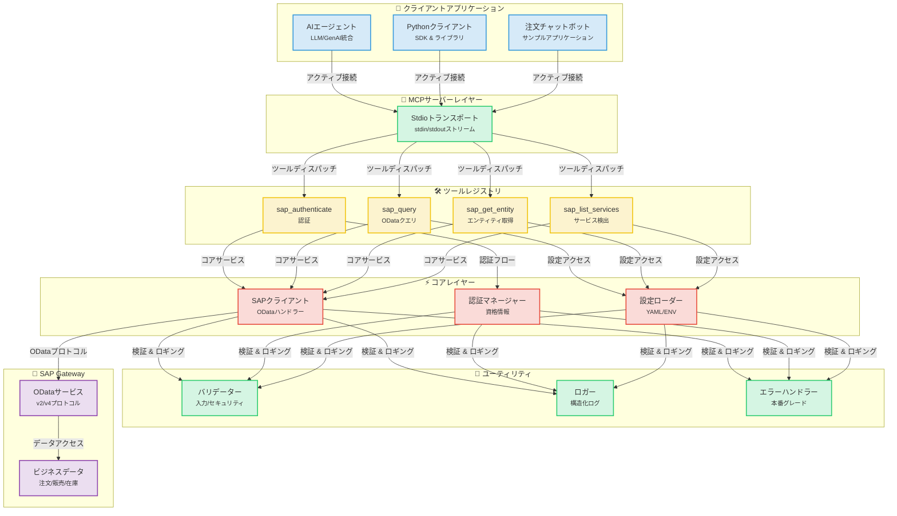
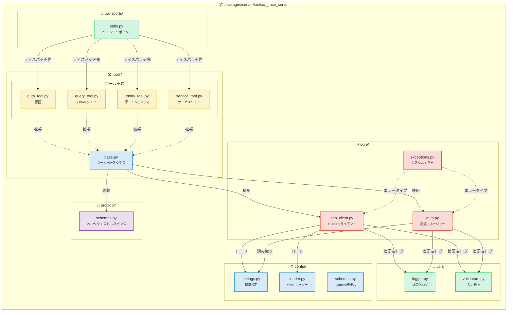
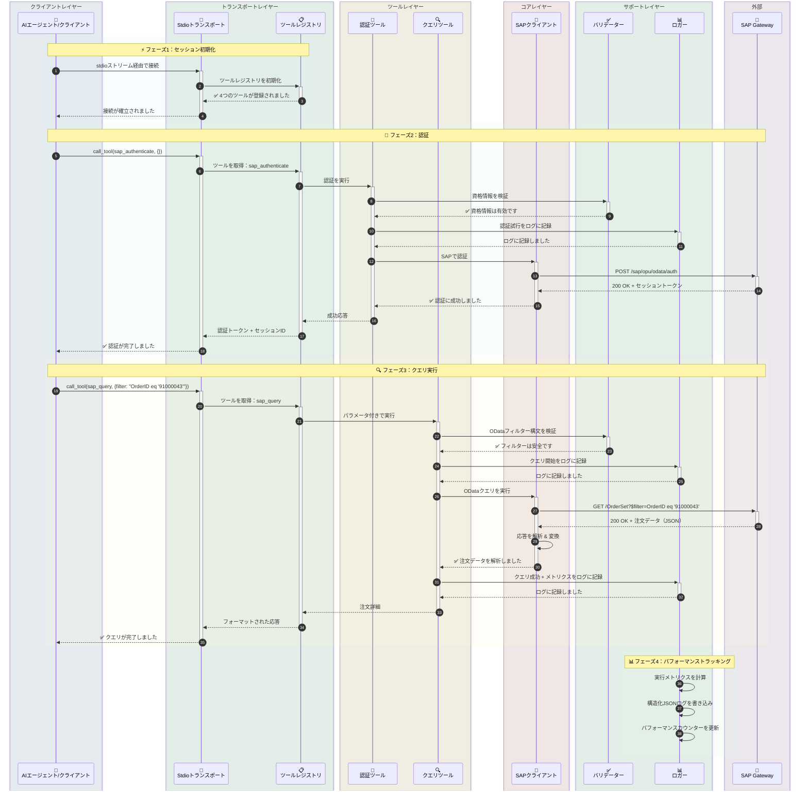
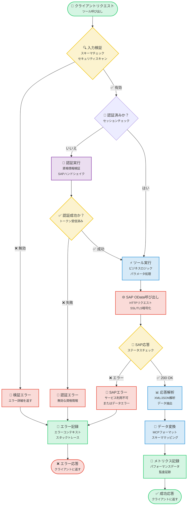
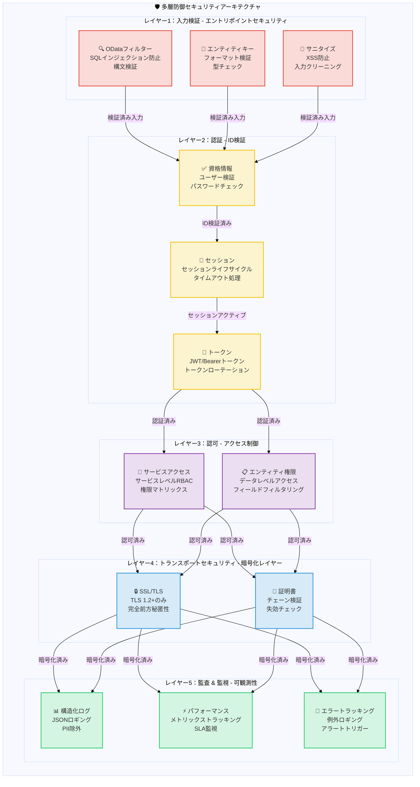

# SAP MCP - モデルコンテキストプロトコルによるSAP Gateway統合

AIエージェント向けのSAP OData操作のためのモジュール式ツールを提供する、SAP Gateway統合のための完全なMCPサーバーです。

<div align="center">

[](https://www.python.org/downloads/)
[](LICENSE)
[]()
[]()
[]()

</div>

---

## 🎯 プロジェクト概要

AIエージェントやアプリケーションが、クリーンでモジュール化されたアーキテクチャを通じてSAP Gatewayシステムと対話できるようにする、本番環境対応のMCP（モデルコンテキストプロトコル）サーバーです。信頼性、セキュリティ、開発者エクスペリエンスを考慮して構築されています。

**現在のステータス**: ✅ **本番環境対応**（全5フェーズ完了）

### 主なハイライト

- 🔐 **安全なSAP統合**: エンタープライズグレードの認証とSSL/TLSサポート
- 🛠️ **4つのモジュール式ツール**: 認証、クエリ、エンティティ取得、サービス検出
- 🚀 **Stdioトランスポート**: 本番環境対応のMCPサーバー
- 📊 **構造化ロギング**: パフォーマンスメトリクスを含むJSONおよびコンソール形式
- ✅ **検証済み入力**: 包括的なODataおよびセキュリティ検証
- 🧪 **十分なテスト**: 56%のカバレッジ、44/45のテストに合格（98%の成功率）

---

## 📐 アーキテクチャ

### システム概要



### コンポーネント詳細



### データフロー：注文クエリの例



### ツール実行フロー



### セキュリティアーキテクチャ



---

## 📦 リポジトリ構造

```
sap-mcp/
├── packages/
│   └── server/                          ✅ 本番環境対応MCPサーバー
│       ├── src/sap_mcp_server/
│       │   ├── core/                    # SAPクライアント & 認証（3ファイル）
│       │   │   ├── sap_client.py        # OData操作
│       │   │   ├── auth.py              # 資格情報管理
│       │   │   └── exceptions.py        # カスタム例外
│       │   ├── config/                  # 設定（4ファイル）
│       │   │   ├── settings.py          # 環境設定
│       │   │   ├── loader.py            # YAMLローダー
│       │   │   └── schemas.py           # Pydanticモデル
│       │   ├── protocol/                # MCPプロトコル（2ファイル）
│       │   │   └── schemas.py           # リクエスト/レスポンススキーマ
│       │   ├── tools/                   # 4つのモジュール式SAPツール
│       │   │   ├── base.py              # ツールベースクラス
│       │   │   ├── auth_tool.py         # 認証
│       │   │   ├── query_tool.py        # ODataクエリ
│       │   │   ├── entity_tool.py       # エンティティ取得
│       │   │   └── service_tool.py      # サービス検出
│       │   ├── transports/              # トランスポートレイヤー
│       │   │   └── stdio.py             # Stdioトランスポート ✅
│       │   └── utils/                   # ユーティリティ（3ファイル）
│       │       ├── logger.py            # 構造化ロギング
│       │       └── validators.py        # 入力検証
│       ├── config/                      # サーバー設定
│       │   ├── services.yaml            # SAPサービス設定
│       │   └── services.yaml.example    # 設定テンプレート
│       ├── tests/                       # 45テスト（56%カバレッジ）
│       │   ├── conftest.py              # 8フィクスチャ
│       │   ├── unit/                    # 高速分離テスト
│       │   └── integration/             # 統合テスト
│       └── pyproject.toml               # パッケージ設定
│
├── docs/                                # ドキュメント
│   ├── guides/                          # ユーザーガイド
│   └── api/                             # APIリファレンス
├── scripts/                             # 開発スクリプト
├── .env.server                          # サーバー設定
├── .env.server.example                  # 設定テンプレート
└── README.md                            # このファイル
```

---

## ✨ 機能

### コア機能

<table>
<tr>
<td width="50%">

#### 🛠️ ツール
- ✅ **sap_authenticate**: 安全なSAP認証
- ✅ **sap_query**: フィルター付きODataクエリ
- ✅ **sap_get_entity**: 単一エンティティ取得
- ✅ **sap_list_services**: サービス検出

</td>
<td width="50%">

#### 🚀 トランスポート
- ✅ **Stdio**: 本番環境対応のstdin/stdout

</td>
</tr>
<tr>
<td>

#### 📊 ロギング & 監視
- ✅ **構造化ロギング**: JSON + コンソール
- ✅ **パフォーマンスメトリクス**: リクエストタイミング
- ✅ **エラートラッキング**: 完全なコンテキスト
- ✅ **監査証跡**: セキュリティイベント

</td>
<td>

#### 🔒 セキュリティ
- ✅ **入力検証**: OData & セキュリティ
- ✅ **SSL/TLSサポート**: 安全な接続
- ✅ **資格情報管理**: .env.server
- ✅ **エラー処理**: 本番グレード

</td>
</tr>
</table>

### 品質 & テスト

| メトリクス | 値 | ステータス |
|--------|-------|--------|
| **テストカバレッジ** | 56% | 🟡 良好 |
| **テスト合格** | 44/45 (98%) | 🟢 優秀 |
| **テスト速度** | <0.2秒 | 🟢 高速 |
| **フィクスチャ** | 8つの包括的なもの | 🟢 完了 |
| **テストカテゴリ** | ユニット + 統合 | 🟢 完了 |

### 開発者エクスペリエンス

- ✅ **モジュール式アーキテクチャ**: ファイルごとに1つのツール
- ✅ **型安全性**: 完全な型ヒント
- ✅ **ドキュメント**: 包括的なガイド
- ✅ **簡単なセットアップ**: `pip install -e .`
- ✅ **ホットリロード**: 開発モード
- ✅ **サンプルアプリ**: 3つの動作例

---

## 🚀 クイックスタート

### 前提条件

#### システム要件

- **Python 3.11以上**
- **pip**（Pythonパッケージインストーラー）
- **Git**（リポジトリのクローン用）
- SAP Gatewayアクセス資格情報
- 仮想環境のサポート

#### Pythonのインストール

<details>
<summary><b>🪟 Windows</b></summary>

**オプション1：Microsoft Store（Windows 10/11推奨）**
```powershell
# Microsoft Storeで「Python 3.11」または「Python 3.12」を検索
# またはpython.orgからダウンロード
```

**オプション2：Python.orgインストーラー**
1. [python.org/downloads](https://www.python.org/downloads/)からダウンロード
2. インストーラーを実行
3. ✅ **「Add Python to PATH」をチェック**
4. 「Install Now」をクリック

**インストールの確認：**
```powershell
python --version
# Python 3.11.x以上が表示されるはずです

pip --version
# pip 23.x.x以上が表示されるはずです
```

**一般的な問題：**
- `python`コマンドが見つからない場合は、`python3`または`py`を使用してください
- `pip`が見つからない場合は、`python -m ensurepip --upgrade`でインストールしてください

</details>

<details>
<summary><b>🍎 macOS</b></summary>

**オプション1：Homebrew（推奨）**
```bash
# Homebrewがインストールされていない場合はインストール
/bin/bash -c "$(curl -fsSL https://raw.githubusercontent.com/Homebrew/install/HEAD/install.sh)"

# Pythonをインストール
brew install python@3.11
# または
brew install python@3.12
```

**オプション2：Python.orgインストーラー**
1. [python.org/downloads/macos](https://www.python.org/downloads/macos/)からダウンロード
2. `.pkg`ファイルを開く
3. インストールウィザードに従う

**インストールの確認：**
```bash
python3 --version
# Python 3.11.x以上が表示されるはずです

pip3 --version
# pip 23.x.x以上が表示されるはずです
```

**注意：** macOSにはPython 2.7がプリインストールされている場合があります。常に`python3`および`pip3`コマンドを使用してください。

</details>

<details>
<summary><b>🐧 Linux</b></summary>

**Ubuntu/Debian：**
```bash
# パッケージリストを更新
sudo apt update

# Python 3.11+をインストール
sudo apt install python3.11 python3.11-venv python3-pip

# または最新のPythonの場合
sudo apt install python3 python3-venv python3-pip
```

**Fedora/RHEL/CentOS：**
```bash
# Python 3.11+をインストール
sudo dnf install python3.11 python3-pip

# または
sudo yum install python3 python3-pip
```

**Arch Linux：**
```bash
sudo pacman -S python python-pip
```

**インストールの確認：**
```bash
python3 --version
# Python 3.11.x以上が表示されるはずです

pip3 --version
# pip 23.x.x以上が表示されるはずです
```

</details>

---

### 1. インストール

#### ステップバイステップのインストール

<details open>
<summary><b>🪟 Windows（PowerShell/コマンドプロンプト）</b></summary>

```powershell
# リポジトリをクローン
git clone <repository-url>
cd sap-mcp

# 仮想環境を作成
python -m venv .venv

# 仮想環境をアクティブ化
.venv\Scripts\activate
# またはPowerShellで：
# .venv\Scripts\Activate.ps1

# PowerShellで実行ポリシーエラーが発生した場合：
# Set-ExecutionPolicy -ExecutionPolicy RemoteSigned -Scope CurrentUser

# アクティブ化の確認（プロンプトに（.venv）が表示されるはずです）
# (.venv) PS C:\path\to\sap-mcp>

# サーバーパッケージをインストール
cd packages\server
pip install -e .

# 開発依存関係をインストール（オプション）
pip install -e ".[dev]"

# インストールの確認
sap-mcp-server-stdio --help
```

**Windowsの一般的な問題：**
- **`python`が見つからない**：`python3`または`py`を試してください
- **アクセスが拒否されました**：PowerShellを管理者として実行してください
- **実行ポリシー**：`Set-ExecutionPolicy -ExecutionPolicy RemoteSigned -Scope CurrentUser`を実行してください
- **長いパスのサポート**：Windowsで長いパスのサポートを有効にしてください（設定 > システム > バージョン情報 > システムの詳細設定）

</details>

<details>
<summary><b>🍎 macOS（ターミナル）</b></summary>

```bash
# リポジトリをクローン
git clone <repository-url>
cd sap-mcp

# 仮想環境を作成
python3 -m venv .venv

# 仮想環境をアクティブ化
source .venv/bin/activate

# アクティブ化の確認（プロンプトに（.venv）が表示されるはずです）
# (.venv) user@macbook sap-mcp %

# サーバーパッケージをインストール
cd packages/server
pip install -e .

# 開発依存関係をインストール（オプション）
pip install -e ".[dev]"

# インストールの確認
sap-mcp-server-stdio --help

# インストールパスを確認（Gemini CLIの設定に便利）
which sap-mcp-server-stdio
# 出力例：/Users/username/sap-mcp/.venv/bin/sap-mcp-server-stdio
```

**macOSの一般的な問題：**
- **`python`が見つからない**：代わりに`python3`を使用してください
- **`pip`が見つからない**：代わりに`pip3`を使用してください
- **アクセスが拒否されました**：仮想環境で`sudo`を使用しないでください
- **インストール後にコマンドが見つからない**：仮想環境がアクティブ化されていることを確認してください

</details>

<details>
<summary><b>🐧 Linux（Bash/Zsh）</b></summary>

```bash
# リポジトリをクローン
git clone <repository-url>
cd sap-mcp

# 仮想環境を作成
python3 -m venv .venv

# 仮想環境をアクティブ化
source .venv/bin/activate

# アクティブ化の確認（プロンプトに（.venv）が表示されるはずです）
# (.venv) user@linux:~/sap-mcp$

# サーバーパッケージをインストール
cd packages/server
pip install -e .

# 開発依存関係をインストール（オプション）
pip install -e ".[dev]"

# インストールの確認
sap-mcp-server-stdio --help

# インストールパスを確認（Gemini CLIの設定に便利）
which sap-mcp-server-stdio
# 出力例：/home/username/sap-mcp/.venv/bin/sap-mcp-server-stdio
```

**Linuxの一般的な問題：**
- **`python3-venv`が見つからない**：`sudo apt install python3-venv`でインストールしてください
- **アクセスが拒否されました**：仮想環境で`sudo`を使用しないでください
- **SSLエラー**：`sudo apt install ca-certificates`で証明書をインストールしてください
- **ビルド依存関係がありません**：`sudo apt install build-essential python3-dev`でインストールしてください

</details>

---

### 2. 設定

SAP MCPサーバーには2つの設定ファイルが必要です：
1. **`.env.server`**：SAP接続資格情報（1つのSAPシステム）
2. **`services.yaml`**：SAP Gatewayサービスと認証設定

#### 2.1. SAP接続設定（`.env.server`）

> **⚠️ 重要**：v0.2.0以降、`.env.server`は**プロジェクトルートディレクトリのみ**に統合されました。以前の`packages/server/.env.server`の場所はサポートされなくなりました。

**ファイルの場所**：`.env.server`は**プロジェクトルートディレクトリ**にある必要があります。

```
sap-mcp/
├── .env.server              ← 設定ファイル（唯一の場所 - ここに作成）
├── .env.server.example      ← サンプルテンプレート
├── packages/
│   └── server/
└── README.md
```

**設定手順**：

<details open>
<summary><b>🪟 Windows（PowerShell/コマンドプロンプト）</b></summary>

```powershell
# プロジェクトルートに移動
cd C:\path\to\sap-mcp

# 環境テンプレートをコピー
copy .env.server.example .env.server

# メモ帳でSAP資格情報を使用して設定を編集
notepad .env.server

# または、お好みのエディタを使用してください：
# code .env.server (VS Code)
# notepad++ .env.server (Notepad++)

# 注意：Windowsではファイル権限の管理方法が異なります
# ファイルがパブリックフォルダにないことを確認してください
# .env.serverを右クリック > プロパティ > セキュリティでアクセスを制限
```

**Windows固有の注意点：**
- Windowsではパスにバックスラッシュ（`\`）を使用してください
- PowerShellの実行ポリシーによりスクリプトがブロックされる場合があります（インストールセクションを参照）
- `.env.server`をアクセスが制限されたユーザーフォルダに保存してください
- ウイルス対策ソフトがファイルをブロックする場合は、Windows Defenderの除外設定を使用してください

</details>

<details>
<summary><b>🍎 macOS（ターミナル）</b></summary>

```bash
# プロジェクトルートに移動
cd /path/to/sap-mcp

# 環境テンプレートをコピー
cp .env.server.example .env.server

# SAP資格情報を使用して設定を編集
nano .env.server
# または、お好みのエディタを使用してください：
# vim .env.server
# code .env.server (VS Code)
# open -a TextEdit .env.server

# 適切な権限を設定（セキュリティ上推奨）
chmod 600 .env.server

# 権限を確認
ls -la .env.server
# -rw-------（所有者のみ読み書き可能）と表示されるはずです
```

**macOS固有の注意点：**
- ファイル権限はUnixベースです（Linuxと同じ）
- `chmod 600`により、自分だけがファイルを読み書きできるようになります
- macOSは初回アクセス時に追加のセキュリティプロンプトを表示する場合があります
- セキュリティを最大限に高めるために、ホームディレクトリに保存してください

</details>

<details>
<summary><b>🐧 Linux（Bash/Zsh）</b></summary>

```bash
# プロジェクトルートに移動
cd /path/to/sap-mcp

# 環境テンプレートをコピー
cp .env.server.example .env.server

# SAP資格情報を使用して設定を編集
nano .env.server
# または、お好みのエディタを使用してください：
# vim .env.server
# code .env.server (VS Code)
# gedit .env.server (GNOME)

# 適切な権限を設定（セキュリティ上必須）
chmod 600 .env.server

# 権限を確認
ls -la .env.server
# -rw-------（所有者のみ読み書き可能）と表示されるはずです

# オプション：ファイルがグローバルに読み取り可能でないことを確認
stat .env.server
```

**Linux固有の注意点：**
- `chmod 600`はセキュリティ上重要です（所有者のみアクセス可能）
- SELinux/AppArmorは追加の設定が必要な場合があります
- ファイルはサーバーを実行するユーザーが所有している必要があります
- このファイルで編集または実行するために`sudo`を使用しないでください

</details>

---

**必須の環境変数**：
```bash
# SAPシステム接続（単一SAPシステム）
SAP_HOST=your-sap-host.com          # SAP Gatewayホスト名
SAP_PORT=443                         # HTTPSポート（通常は443または8443）
SAP_USERNAME=your-username           # SAPユーザーID
SAP_PASSWORD=your-password           # SAPパスワード
SAP_CLIENT=100                       # SAPクライアント番号（例：100、800）

# セキュリティ設定
SAP_VERIFY_SSL=true                  # SSL証明書検証を有効にする（推奨）
SAP_TIMEOUT=30                       # リクエストタイムアウト（秒）

# オプション：接続プーリング
SAP_MAX_CONNECTIONS=10               # 最大同時接続数（オプション）
SAP_RETRY_ATTEMPTS=3                 # 失敗時の再試行回数（オプション）
```

**セキュリティのベストプラクティス**：
- ✅ `.env.server`をバージョン管理にコミットしないでください（`.gitignore`に既にあります）
- ✅ 強力でユニークなパスワードを使用してください
- ✅ 本番環境ではSSL検証を有効にしてください（`SAP_VERIFY_SSL=true`）
- ✅ ファイル権限を制限してください：`chmod 600 .env.server`

#### 2.2. SAP Gatewayサービス設定（`services.yaml`）

MCPサーバーがアクセスできるSAP Gatewayサービス（ODataサービス）を設定します。

**場所**：`packages/server/config/services.yaml`

```bash
# 設定例をコピー
cp packages/server/config/services.yaml.example packages/server/config/services.yaml

# サービス設定を編集
vim packages/server/config/services.yaml
```

**基本設定例**：

```yaml
# Gateway URL設定
gateway:
  # ODataサービスのベースURLパターン
  base_url_pattern: "https://{host}:{port}/sap/opu/odata"

  # メタデータエンドポイントのサフィックス
  metadata_suffix: "/$metadata"

  # サービスカタログパス
  service_catalog_path: "/sap/opu/odata/IWFND/CATALOGSERVICE;v=2/ServiceCollection"

  # 認証エンドポイント設定
  auth_endpoint:
    # 推奨：カタログメタデータを使用（特定のサービスなしで動作）
    use_catalog_metadata: true

    # オプション：認証に特定のサービスを使用（カタログが利用できない場合）
    # use_catalog_metadata: false
    # service_id: Z_SALES_ORDER_GENAI_SRV
    # entity_name: zsd004Set

# SAP ODataサービス
services:
  # 例：販売注文サービス
  - id: Z_SALES_ORDER_GENAI_SRV          # 一意のサービス識別子
    name: "Sales Order GenAI Service"     # 人間が読める名前
    path: "/SAP/Z_SALES_ORDER_GENAI_SRV"  # サービスパス
    version: v2                            # ODataバージョン（v2またはv4）
    description: "販売注文管理サービス"

    # このサービスのエンティティセット
    entities:
      - name: zsd004Set                    # エンティティセット名
        key_field: Vbeln                   # プライマリキーフィールド
        description: "販売注文"
        default_select:                    # デフォルトで選択するフィールド
          - Vbeln      # 販売注文番号
          - Erdat      # 作成日
          - Ernam      # 作成者
          - Netwr      # 正味価格
          - Waerk      # 通貨

    # オプション：このサービスのカスタムヘッダー
    custom_headers: {}
```

**複数サービスの追加**：

```yaml
services:
  # 販売注文サービス
  - id: Z_SALES_ORDER_GENAI_SRV
    name: "Sales Order Service"
    path: "/SAP/Z_SALES_ORDER_GENAI_SRV"
    version: v2
    entities:
      - name: zsd004Set
        key_field: Vbeln
        description: "販売注文"

  # 顧客マスターサービス
  - id: Z_CUSTOMER_SRV
    name: "Customer Master Service"
    path: "/SAP/Z_CUSTOMER_SRV"
    version: v2
    entities:
      - name: CustomerSet
        key_field: Kunnr
        description: "顧客マスターレコード"
        default_select:
          - Kunnr      # 顧客番号
          - Name1      # 名前
          - Land1      # 国

  # 品目マスターサービス
  - id: Z_MATERIAL_SRV
    name: "Material Master Service"
    path: "/SAP/Z_MATERIAL_SRV"
    version: v2
    entities:
      - name: MaterialSet
        key_field: Matnr
        description: "品目マスター"
```

#### 2.3. 認証エンドポイントオプション

`auth_endpoint`設定は、MCPサーバーがSAPと認証する方法を制御します。

**オプション1：カタログメタデータ（推奨）**

```yaml
gateway:
  auth_endpoint:
    use_catalog_metadata: true
```

**利点**：
- ✅ 特定のSAP Gatewayサービスを必要とせずに動作します
- ✅ SAPシステム間でより柔軟でポータブルです
- ✅ サービスに依存しない認証
- ✅ カスタムサービス展開への依存なし

**認証フロー**：
- CSRFトークン：`/sap/opu/odata/IWFND/CATALOGSERVICE;v=2/ServiceCollection`
- 検証：`/sap/opu/odata/IWFND/CATALOGSERVICE;v=2/$metadata`

---

**オプション2：サービス固有の認証**

```yaml
gateway:
  auth_endpoint:
    use_catalog_metadata: false
    service_id: Z_SALES_ORDER_GENAI_SRV    # 以下のサービスIDと一致する必要があります
    entity_name: zsd004Set                  # そのサービスのエンティティである必要があります
```

**利点**：
- ✅ 明示的なサービスベースの認証
- ✅ カタログサービスが利用できない場合に動作します（まれ）

**欠点**：
- ❌ 指定されたサービスが展開されている必要があります
- ❌ サービスが変更された場合の柔軟性が低い
- ❌ サービス名が変更された場合は設定を更新する必要があります

**認証フロー**：
- CSRFトークン：`/SAP/Z_SALES_ORDER_GENAI_SRV/zsd004Set`
- 検証：`/sap/opu/odata/IWFND/CATALOGSERVICE;v=2/$metadata`

---

**推奨事項**：認証に特定のサービスを使用する特別な理由がない限り、**オプション1（カタログメタデータ）**を使用してください。

### 3. サーバーの実行

<details open>
<summary><b>🪟 Windows（PowerShell/コマンドプロンプト）</b></summary>

```powershell
# 仮想環境をアクティブ化
.venv\Scripts\activate
# またはPowerShellで：
# .venv\Scripts\Activate.ps1

# stdioサーバーを実行（推奨）
sap-mcp-server-stdio

# またはPythonで直接実行
python -m sap_mcp_server.transports.stdio

# 完了したら非アクティブ化
deactivate
```

**Windows固有の注意点：**
- パスにはバックスラッシュ（`\`）を使用してください
- PowerShellは実行ポリシーの変更が必要な場合があります
- サーバーは現在のターミナルウィンドウで実行されます
- `Ctrl+C`を押してサーバーを停止します

</details>

<details>
<summary><b>🍎 macOS（ターミナル）</b></summary>

```bash
# 仮想環境をアクティブ化
source .venv/bin/activate

# stdioサーバーを実行（推奨）
sap-mcp-server-stdio

# またはPythonで直接実行
python3 -m sap_mcp_server.transports.stdio

# 完了したら非アクティブ化
deactivate
```

**macOS固有の注意点：**
- `python`の代わりに`python3`を使用してください
- サーバーは現在のターミナルセッションで実行されます
- `Cmd+C`または`Ctrl+C`を押してサーバーを停止します
- サーバーの実行中はターミナルを開いたままにしておく必要があります

</details>

<details>
<summary><b>🐧 Linux（Bash/Zsh）</b></summary>

```bash
# 仮想環境をアクティブ化
source .venv/bin/activate

# stdioサーバーを実行（推奨）
sap-mcp-server-stdio

# またはPythonで直接実行
python3 -m sap_mcp_server.transports.stdio

# 完了したら非アクティブ化
deactivate
```

**Linux固有の注意点：**
- `python`の代わりに`python3`を使用してください
- サーバーは現在のターミナルセッションで実行されます
- `Ctrl+C`を押してサーバーを停止します
- `nohup`または`systemd`サービスを使用してバックグラウンドで実行できます

</details>

---

### 4. インストールの確認

```bash
# テストを実行
cd packages/server
python -m pytest -v

# カバレッジレポート付き
python -m pytest --cov=sap_mcp_server --cov-report=term-missing

# 特定のテストカテゴリ
python -m pytest -m unit          # ユニットテストのみ
python -m pytest -m integration   # 統合テストのみ
```

---

## 🤖 Gemini CLIとの統合

> **📖 公式ドキュメント**：Gemini CLIの詳細については、<a href="https://geminicli.com/" target="_blank">https://geminicli.com/</a>をご覧ください。

### 前提条件

- Node.js 18+およびnpmがインストールされていること
- SAP MCPサーバーがインストールされていること（上記のクイックスタートを参照）
- Gemini APIアクセス用のGoogleアカウント

### 1. Gemini CLIのインストール

```bash
# Gemini CLIをグローバルにインストール
npm install -g @google/gemini-cli

# インストールの確認
gemini --version
```

### 2. Gemini CLIの認証

**オプションA：Gemini APIキーの使用（入門におすすめ）**

1. [Google AI Studio](https://aistudio.google.com/apikey)からAPIキーを取得します
2. 環境変数を設定します：

```bash
export GEMINI_API_KEY="your-api-key-here"
```

**オプションB：Google Cloudの使用（本番環境用）**

```bash
# まずGoogle Cloud CLIをインストール
gcloud auth application-default login

# プロジェクトを設定
export GOOGLE_CLOUD_PROJECT="your-project-id"
export GOOGLE_CLOUD_LOCATION="us-central1"
```

### 3. SAP MCPサーバーの登録

**方法A：絶対パスの使用（仮想環境におすすめ）**

仮想環境にサーバーをインストールした場合は、実行ファイルの絶対パスを使用します：

1. **絶対パスを見つける**：
```bash
# SAP MCPディレクトリに移動
cd /path/to/sap-mcp

# 絶対パスを取得
pwd
# 出力例：/Users/sanggyulee/my-project/python-project/sap-mcp
```

2. **`~/.gemini/settings.json`を編集**：
```json
{
  "mcpServers": {
    "sap-server": {
      "command": "/Users/sanggyulee/my-project/python-project/sap-mcp/.venv/bin/sap-mcp-server-stdio",
      "cwd": "/Users/sanggyulee/my-project/python-project/sap-mcp",
      "description": "OData統合用のSAP Gateway MCPサーバー",
      "timeout": 30000,
      "trust": false
    }
  }
}
```

**`/Users/sanggyulee/my-project/python-project/sap-mcp`を実際のプロジェクトパスに置き換えてください。**

> **📝 注意**：`cwd`（現在の作業ディレクトリ）パラメータは、`.env.server`ファイルの検出に**必須**です。これにより、サーバーが設定ファイルのあるプロジェクトルートディレクトリから実行されることが保証されます。

3. **パスの確認**：
```bash
# コマンドが機能するかテスト
/path/to/your/sap-mcp/.venv/bin/sap-mcp-server-stdio --help

# 登録の確認
gemini mcp list
# 期待される出力：✓ sap-server: ... (stdio) - 接続済み
```

---

**方法B：CLIコマンドの使用（グローバルにインストールされている場合）**

`sap-mcp-server-stdio`がシステムのPATHにある場合：

```bash
# サーバーを登録
gemini mcp add sap-server sap-mcp-server-stdio

# 登録の確認
gemini mcp list
```

**注意**：この方法は、仮想環境をPATHに追加した場合、またはパッケージをグローバルにインストールした場合にのみ機能します。

---

**方法C：Pythonモジュールパスの使用**

Pythonモジュールを使用する代替アプローチ：

```json
{
  "mcpServers": {
    "sap-server": {
      "command": "/path/to/sap-mcp/.venv/bin/python",
      "args": ["-m", "sap_mcp_server.transports.stdio"],
      "cwd": "/path/to/sap-mcp/packages/server",
      "description": "SAP Gateway MCPサーバー",
      "timeout": 30000,
      "trust": false
    }
  }
}
```

### 4. SAP MCPとGemini CLIの使用開始

```bash
# Gemini CLIを開始
gemini

# MCPサーバーのステータスを確認
> /mcp

# 利用可能なSAPツールを表示
> /mcp desc

# 例：SAPの注文をクエリ
> SAPツールを使用して認証し、注文番号91000043をクエリします

# 例：利用可能なSAPサービスを一覧表示
> どのようなSAPサービスが利用可能ですか？

# 例：顧客詳細を取得
> SAPから顧客CUST001の詳細を取得します
```

### 高度な設定

**信頼できるサーバーの自動承認を有効にする**

```json
{
  "mcpServers": {
    "sap-server": {
      "command": "/path/to/sap-mcp/.venv/bin/sap-mcp-server-stdio",
      "trust": true,
      "timeout": 30000
    }
  }
}
```

**注意**：各ツール呼び出しの承認プロンプトをスキップするには、`"trust": true`を設定します。信頼できるサーバーに対してのみ有効にしてください。

---

**特定のツールをフィルタリング**

```json
{
  "mcpServers": {
    "sap-server": {
      "command": "/path/to/sap-mcp/.venv/bin/sap-mcp-server-stdio",
      "includeTools": ["sap_authenticate", "sap_query"],
      "excludeTools": ["sap_list_services"],
      "timeout": 30000
    }
  }
}
```

**使用例**：
- `includeTools`：特定のツールのみを許可（ホワイトリスト）
- `excludeTools`：特定のツールをブロック（ブラックリスト）
- 両方を同時に使用することはできません

---

**環境変数を追加（オプション）**

```json
{
  "mcpServers": {
    "sap-server": {
      "command": "/path/to/sap-mcp/.venv/bin/sap-mcp-server-stdio",
      "env": {
        "SAP_HOST": "${SAP_HOST}",
        "SAP_USERNAME": "${SAP_USERNAME}",
        "SAP_PASSWORD": "${SAP_PASSWORD}"
      },
      "timeout": 30000
    }
  }
}
```

**注意**：`settings.json`の環境変数は`.env.server`の値を上書きします。セキュリティ上の理由から推奨されません。代わりに`.env.server`ファイルを使用してください。

---

**遅いネットワークのタイムアウトを増やす**

```json
{
  "mcpServers": {
    "sap-server": {
      "command": "/path/to/sap-mcp/.venv/bin/sap-mcp-server-stdio",
      "timeout": 60000,  // 60秒（デフォルト：30000）
      "trust": false
    }
  }
}
```

**増やす場合**：
- 遅いネットワーク接続
- 大規模なデータクエリ
- 複雑なSAP操作
- 頻繁なタイムアウトエラー

### トラブルシューティング

**問題：サーバーが「切断済み」ステータスを表示する**

```bash
# MCPサーバーのステータスを確認
gemini mcp list
# ✗ sap-server: sap-mcp-server-stdio (stdio) - 切断済みと表示された場合
```

**解決策1：絶対パスを使用する（最も一般的）**

コマンドは仮想環境にある可能性が高いです。`~/.gemini/settings.json`を更新してください：

```json
{
  "mcpServers": {
    "sap-server": {
      "command": "/full/path/to/sap-mcp/.venv/bin/sap-mcp-server-stdio",
      "description": "SAP Gateway MCPサーバー",
      "timeout": 30000,
      "trust": false
    }
  }
}
```

**絶対パスを見つける**：
```bash
# SAP MCPディレクトリに移動
cd /path/to/sap-mcp

# フルパスを取得
pwd
# 例：/Users/sanggyulee/my-project/python-project/sap-mcp

# コマンドが存在することを確認
ls -la .venv/bin/sap-mcp-server-stdio
```

---

**問題：PATHにコマンドが見つからない**

```bash
# サーバーを直接テスト
sap-mcp-server-stdio
# エラー：コマンドが見つかりません

# コマンドが存在するか確認
which sap-mcp-server-stdio
# 戻り値：コマンドが見つかりません
```

**解決策2：仮想環境を確認する**

```bash
# 仮想環境が存在するか確認
ls -la .venv/bin/sap-mcp-server-stdio

# 存在する場合は、settings.jsonで絶対パスを使用
# 存在しない場合は、再インストール：
cd packages/server
pip install -e .
```

---

**問題：認証エラーまたは`.env.server`が見つからない**

```bash
# .env.serverがPROJECT ROOTにあることを確認（packages/server/ではない）
cat .env.server

# 必須フィールド：
# SAP_HOST=your-host
# SAP_PORT=443
# SAP_USERNAME=your-username
# SAP_PASSWORD=your-password
# SAP_CLIENT=100
```

**解決策3：ファイルの場所と資格情報を確認する**

```bash
# 1. .env.serverがプロジェクトルートにあることを確認
ls -la .env.server
# /path/to/sap-mcp/.env.serverにあるはずです

# 2. Gemini CLIのsettings.jsonに「cwd」パラメータがあることを確認
cat ~/.gemini/settings.json
# 「cwd」: 「/path/to/sap-mcp」が含まれている必要があります

# 3. 手動で認証をテスト
source .venv/bin/activate
python -c "from sap_mcp_server.config.settings import get_connection_config; print(get_connection_config())"
```

**一般的な問題**：

1. **「フィールドが必要です」エラー**：`.env.server`がロードされていません。確認してください：
   - ファイルがプロジェクトルートに存在します：`/path/to/sap-mcp/.env.server`
   - Gemini CLIの`settings.json`に正しい`cwd`パラメータがあります
   - ファイルに適切な権限があります：`chmod 600 .env.server`

2. **401 Unauthorizedエラー**：v0.2.1（2025-01-22）で修正済み
   - **以前の問題**：SAP Gatewayが`sap-client`パラメータなしのリクエストを拒否していました
   - **現在のステータス**：自動的に処理されます - すべてのリクエストに`sap-client`パラメータが含まれます
   - **確認**：v0.2.1以降に更新したことを確認してください
   - **手動確認**：有効な資格情報で認証が成功するはずです

---

**問題：サーバーを再登録する必要がある**

```bash
# 既存のサーバー設定を削除
rm ~/.gemini/settings.json

# または手動で編集してsap-serverエントリを削除
```

**解決策4：クリーンな再登録**

```bash
# 方法1：設定を直接編集
vim ~/.gemini/settings.json

# 方法2：絶対パスを使用（推奨）
# 上記セクション3の「方法A：絶対パスの使用」に従ってください
```

---

**クイック診断手順**

1. **サーバー実行可能ファイルを確認**：
```bash
/path/to/sap-mcp/.venv/bin/sap-mcp-server-stdio --help
# サーバーの起動メッセージが表示されるはずです
```

2. **Gemini CLI設定を確認**：
```bash
cat ~/.gemini/settings.json | grep -A 5 "sap-server"
# 「command」パスが正しいことを確認
```

3. **接続をテスト**：
```bash
gemini mcp list
# ✓ sap-server: ... - 接続済みと表示されるはずです
```

4. **Gemini CLIでテスト**：
```bash
gemini
> /mcp
> /mcp desc
# SAPツールが一覧表示されるはずです
```

### Gemini CLIで利用可能なSAPツール

登録すると、自然言語を通じてこれらのSAPツールを使用できます：

| ツール | 説明 | プロンプト例 |
|------|-------------|----------------|
| **sap_authenticate** | SAP Gatewayで認証 | 「SAPで認証」 |
| **sap_query** | ODataフィルターでSAPエンティティをクエリ | 「顧客CUST001のすべての注文をクエリ」 |
| **sap_get_entity** | キーで特定のエンティティを取得 | 「注文91000043の詳細を取得」 |
| **sap_list_services** | 利用可能なSAPサービスを一覧表示 | 「利用可能なSAPサービスは何ですか？」 |

### ワークフロー例

**1. 注文照会ワークフロー**

```bash
gemini

> SAPに接続し、先週顧客CUST001が発注したすべての注文を検索します
# Geminiは：
# 1. sap_authenticateを呼び出します
# 2. 適切なフィルターでsap_queryを呼び出します
# 3. 結果をフォーマットして表示します
```

**2. 顧客分析**

```bash
> SAPデータを使用して、注文量で上位5社の顧客を分析します
# Geminiは：
# 1. 認証します
# 2. 顧客の注文をクエリします
# 3. データを集計して分析します
# 4. インサイトを提示します
```

**3. サービス検出**

```bash
> システムで利用可能なSAPサービスとエンティティセットは何ですか？
# Geminiは：
# 1. sap_list_servicesを呼び出します
# 2. サービスカタログをフォーマットします
```

---

## 🔧 利用可能なツール

### 1. SAP認証

`.env.server`の資格情報を使用してSAP Gatewayシステムで認証します。

**リクエスト**：
```json
{
  "name": "sap_authenticate",
  "arguments": {}
}
```

**レスポンス**：
```json
{
  "success": true,
  "session_id": "abc123...",
  "message": "SAPで正常に認証されました"
}
```

---

### 2. SAPクエリ

ODataフィルター、選択、ページネーションを使用してSAPエンティティをクエリします。

**リクエスト**：
```json
{
  "name": "sap_query",
  "arguments": {
    "service": "Z_SALES_ORDER_GENAI_SRV",
    "entity_set": "zsd004Set",
    "filter": "OrderID eq '91000043'",
    "select": "OrderID,Bstnk,Kunnr,Matnr",
    "top": 10,
    "skip": 0
  }
}
```

**レスポンス**：
```json
{
  "data": {
    "d": {
      "results": [
        {
          "OrderID": "91000043",
          "Bstnk": "PO-2024-001",
          "Kunnr": "CUST001",
          "Matnr": "MAT-12345"
        }
      ]
    }
  },
  "count": 1
}
```

---

### 3. SAPエンティティ取得

キーで特定のエンティティを取得します。

**リクエスト**：
```json
{
  "name": "sap_get_entity",
  "arguments": {
    "service": "Z_SALES_ORDER_GENAI_SRV",
    "entity_set": "zsd004Set",
    "entity_key": "91000043"
  }
}
```

**レスポンス**：
```json
{
  "data": {
    "d": {
      "OrderID": "91000043",
      "Bstnk": "PO-2024-001",
      "Kunnr": "CUST001",
      "Matnr": "MAT-12345",
      "Wmeng": "100",
      "Vkorg": "1000"
    }
  }
}
```

---

### 4. SAPサービス一覧

設定から利用可能なすべてのSAPサービスを一覧表示します。

**リクエスト**：
```json
{
  "name": "sap_list_services",
  "arguments": {}
}
```

**レスポンス**：
```json
{
  "services": [
    {
      "name": "Z_SALES_ORDER_GENAI_SRV",
      "description": "GenAI用販売注文サービス",
      "entity_sets": ["zsd004Set", "OrderHeaderSet"]
    }
  ],
  "count": 1
}
```

---

## 📚 使用例

### ツールレジストリの使用

```python
from sap_mcp_server.tools import tool_registry
from sap_mcp_server.protocol.schemas import ToolCallRequest

# 利用可能なツールを一覧表示
tools = tool_registry.list_tools()
for tool in tools:
    print(f"- {tool.name}: {tool.description}")

# ツールを呼び出す
request = ToolCallRequest(
    name="sap_list_services",
    arguments={}
)
result = await tool_registry.call_tool(request)
print(result)
```

### MCPクライアントの例

```python
from mcp import StdioServerParameters
from mcp.client.session import ClientSession
from mcp.client.stdio import stdio_client

async def main():
    # MCPサーバーに接続
    server_params = StdioServerParameters(
        command="python",
        args=["-m", "sap_mcp_server.transports.stdio"]
    )

    async with stdio_client(server_params) as (read, write):
        async with ClientSession(read, write) as session:
            # セッションを初期化
            await session.initialize()

            # 認証
            auth_result = await session.call_tool("sap_authenticate", {})

            # 注文をクエリ
            entity_result = await session.call_tool(
                "sap_get_entity",
                {
                    "service": "Z_SALES_ORDER_GENAI_SRV",
                    "entity_set": "zsd004Set",
                    "entity_key": "91000043"
                }
            )
            print(entity_result)
```

### 構造化ロギング

```python
from sap_mcp_server.utils.logger import setup_logging, get_logger

# 本番環境（JSONログ）
setup_logging(level="INFO", json_logs=True)

# 開発環境（色付きコンソール）
setup_logging(level="DEBUG", json_logs=False)

# ロガーを使用
logger = get_logger(__name__)
logger.info("サーバーが起動しました", port=8080, transport="stdio")
logger.error("クエリに失敗しました", error=str(e), query=params)
```

### 入力検証

```python
from sap_mcp_server.utils.validators import (
    validate_odata_filter,
    validate_entity_key,
    sanitize_input
)

# ODataフィルターを検証
if validate_odata_filter("OrderID eq '12345'"):
    # 実行しても安全
    pass

# ユーザー入力をサニタイズ
safe_input = sanitize_input(user_data, max_length=1000)

# エンティティキーを検証
if validate_entity_key(key):
    # エンティティを取得
    pass
```

---

## 🔒 セキュリティ

### 多層防御

| レイヤー | 実装 | ステータス |
|-------|---------------|--------|
| **入力検証** | OData構文、SQLインジェクション防止 | ✅ |
| **認証** | 資格情報検証、セッション管理 | ✅ |
| **認可** | サービスアクセス制御 | ✅ |
| **トランスポートセキュリティ** | SSL/TLS、証明書検証 | ✅ |
| **監査ロギング** | 構造化ログ、機密データなし | ✅ |

### ベストプラクティス

1. **資格情報**：`.env.server`に保存し、gitにコミットしないでください
2. **SSL/TLS**：本番環境では常に有効にしてください（`SAP_VERIFY_SSL=true`）
3. **検証**：SAP呼び出しの前にすべての入力を検証してください
4. **ロギング**：ログから機密データを除外してください
5. **エラー処理**：クライアントに一般的なエラーメッセージを返してください

---

## 🧪 テスト

### テスト構造

```
tests/
├── conftest.py              # 8つの包括的なフィクスチャ
├── unit/                    # 高速で分離されたテスト（40テスト）
│   ├── test_base.py        # ツールレジストリ（16テスト）
│   └── test_validators.py  # バリデーター（24テスト）
└── integration/             # 統合テスト（5テスト）
    └── test_tool_integration.py  # ツールシステムテスト
```

### テストの実行

```bash
# すべてのテストを詳細な出力で実行
python -m pytest -v

# カバレッジレポート付き
python -m pytest --cov=sap_mcp_server --cov-report=term-missing

# HTMLカバレッジレポート
python -m pytest --cov=sap_mcp_server --cov-report=html
open htmlcov/index.html

# 特定のテストカテゴリ
python -m pytest -m unit          # ユニットテストのみ
python -m pytest -m integration   # 統合テストのみ
python -m pytest -m sap           # SAP統合テスト

# 特定のテストファイル
python -m pytest tests/unit/test_validators.py -v

# ウォッチモード（pytest-watchが必要）
ptw -- -v
```

### カバレッジレポート

**現在：56%**（目標：70%以上）

| モジュール | カバレッジ | ステータス |
|--------|----------|--------|
| `tools/base.py` | 100% | 🟢 優秀 |
| `protocol/schemas.py` | 100% | 🟢 優秀 |
| `tools/service_tool.py` | 88% | 🟢 良好 |
| `config/settings.py` | 82% | 🟢 良好 |
| `utils/validators.py` | 80% | 🟢 良好 |
| `core/sap_client.py` | 45% | 🟡 要改善 |
| `transports/stdio.py` | 30% | 🟡 要改善 |

---

## 🛠️ 開発

### プロジェクトのセットアップ

```bash
# クローンとセットアップ
git clone <repository-url>
cd sap-mcp

# 仮想環境を作成
python3 -m venv .venv
source .venv/bin/activate

# 開発モードでインストール
cd packages/server
pip install -e ".[dev]"
```

### 新しいツールの追加

1. **ツールファイルの作成**：`packages/server/src/sap_mcp_server/tools/my_tool.py`

```python
from .base import MCPTool

class MyNewTool(MCPTool):
    @property
    def name(self) -> str:
        return "my_new_tool"

    @property
    def description(self) -> str:
        return "私の新しいツールの説明"

    @property
    def input_schema(self) -> dict:
        return {
            "type": "object",
            "properties": {
                "param": {"type": "string"}
            },
            "required": ["param"]
        }

    async def execute(self, params: dict) -> dict:
        # 実装
        return {"result": "success"}
```

2. **ツールの登録**：`packages/server/src/sap_mcp_server/tools/__init__.py`を更新

```python
from .my_tool import MyNewTool

# レジストリに追加
tool_registry.register(MyNewTool())
```

3. **テストの追加**：`tests/unit/test_my_tool.py`

```python
import pytest
from sap_mcp_server.tools.my_tool import MyNewTool

@pytest.mark.asyncio
async def test_my_tool():
    tool = MyNewTool()
    result = await tool.execute({"param": "value"})
    assert result["result"] == "success"
```

### コード品質

```bash
# コードのフォーマット
black packages/server/src

# インポートのソート
isort packages/server/src

# リント
flake8 packages/server/src

# 型チェック
mypy packages/server/src

# セキュリティスキャン
bandit -r packages/server/src

# すべての品質チェック
black . && isort . && flake8 . && mypy . && bandit -r src/
```

---

## 🗺️ ロードマップ

### ✅ 完了（v0.2.0）

- [x] フェーズ1：構造とコードの移行
- [x] フェーズ2：ツールの分割（4つのモジュール式ツール）
- [x] フェーズ3：トランスポートレイヤー（Stdio）
- [x] フェーズ4：ユーティリティとテスト（56%のカバレッジ）
- [x] フェーズ5：クリーンアップとドキュメント

### 📝 計画中（v0.3.0）

**高優先度**：
- [ ] テストカバレッジを70%以上に向上
- [ ] パフォーマンスベンチマーク
- [ ] APIドキュメント（Sphinx）

**中優先度**：
- [ ] Dockerデプロイガイド
- [ ] Kubernetesマニフェスト
- [ ] Prometheusメトリクス
- [ ] OpenTelemetry統合

**低優先度**：
- [ ] レート制限
- [ ] キャッシュレイヤー
- [ ] GraphQLサポート
- [ ] WebSocketトランスポート
- [ ] HTTP/RESTトランスポート

---

## 🤝 貢献

### はじめに

1. リポジトリをフォークする
2. 機能ブランチを作成する（`git checkout -b feature/amazing-feature`）
3. 変更を加えてテストを追加する
4. テストを実行する：`python -m pytest -v`
5. コード品質チェックを実行する：`black . && isort . && flake8 .`
6. 変更をコミットする（`git commit -m '素晴らしい機能を追加'`）
7. ブランチにプッシュする（`git push origin feature/amazing-feature`）
8. プルリクエストを開く

### コーディング標準

- **スタイル**：PEP 8スタイルガイドに従う
- **型**：すべての関数に型ヒントを追加する
- **ドキュメント**：包括的なdocstringを記述する
- **テスト**：カバレッジを50%以上に維持する
- **コミット**：従来のコミットメッセージを使用する

### プルリクエストチェックリスト

- [ ] テストが追加/更新され、合格している
- [ ] ドキュメントが更新されている
- [ ] コードが`black`でフォーマットされている
- [ ] インポートが`isort`でソートされている
- [ ] 型ヒントが追加されている
- [ ] カバレッジが維持/向上している
- [ ] 変更履歴が更新されている

---

## 📊 プロジェクトメトリクス

| メトリクス | 値 |
|--------|-------|
| **コード行数** | 927（本番コード） |
| **テストカバレッジ** | 56% |
| **テスト** | 45（44合格、98%成功率） |
| **Pythonモジュール** | 24 |
| **SAPツール** | 4 |
| **トランスポートレイヤー** | 1（Stdio） |
| **開発時間** | 約3時間（全5フェーズ） |
| **Pythonバージョン** | 3.11+ |
| **依存関係** | 11コア、9開発 |

---

## 📖 ドキュメント

- **[サーバーパッケージREADME](./packages/server/README.md)**：詳細なサーバードキュメント
- **[設定ガイド](./docs/guides/configuration.md)**：YAMLと環境設定
- **[デプロイガイド](./docs/guides/deployment.md)**：本番デプロイ
- **[アーキテクチャドキュメント](./docs/architecture/server.md)**：システムアーキテクチャの詳細
- **[APIリファレンス](./docs/api/)**：ツールとプロトコルのドキュメント

---

## 📝 ライセンス

MITライセンス - 詳細は[LICENSE](LICENSE)ファイルを参照してください。

---

## 🆘 サポート

- **問題**：[問題を作成](https://github.com/midasol/SAP-MCP-GCP/issues)
- **ドキュメント**：`docs/`ディレクトリを参照
- **サーバーパッケージ**：実装の詳細は`packages/server/`を参照
- **コミュニティ**：ディスカッションに参加してください

---

## 📜 バージョン履歴

### v0.2.2（現在） - 2025-11-10

**ドキュメントの更新**：
- 📚 **READMEの強化**：包括的なOS固有（Windows、macOS、Linux）のインストールおよび設定ガイドを追加
  - 各OSの詳細なPythonインストール手順を追加
  - OS固有の仮想環境設定およびアクティベーションコマンドを追加
  - 適切なファイル権限を持つOS固有の`.env.server`設定ガイドを追加
  - OS固有のサーバー実行手順を追加
  - Gemini CLI公式ドキュメントへのリンクを追加
- 🔧 **明確性の向上**：非推奨のファイルパス参照を削除
- ✨ **ユーザーエクスペリエンスの向上**：ドキュメントのナビゲーションを改善するための折りたたみ可能なセクションを追加

### v0.2.1 - 2025-01-22

**バグ修正**：
- 🐛 **重要な修正**：すべてのSAP Gateway APIリクエストに不足していた`sap-client`パラメータを追加
  - **問題**：401 Unauthorizedエラーで認証が失敗していました
  - **根本原因**：SAP Gatewayは、リクエストを正しいSAPクライアントにルーティングするために`sap-client`パラメータを必要とします
  - **解決策**：
    - CSRFトークンと認証URLに`sap-client`を含めるように`auth.py`を修正
    - すべてのAPIリクエストに`sap-client`パラメータを自動的に挿入するように`sap_client.py`を修正
  - **影響**：すべてのSAP Gateway操作が、適切なクライアントルーティングで正しく機能するようになりました

**技術的な詳細**：
- URLに`?sap-client={client}`を追加するように`SAPAuthenticator._get_csrf_token()`を更新
- URLに`?sap-client={client}`を追加するように`SAPAuthenticator._authenticate_session()`を更新
- リクエストパラメータに`sap-client`を自動的に追加するように`SAPClient._make_request()`を更新
- 設定変更は不要 - `.env.server`の既存の`SAP_CLIENT`を使用

### v0.2.0 - 2025-01-15

**主な機能**：
- ✅ 完全なモジュール式アーキテクチャ
- ✅ 4つの本番環境対応SAPツール
- ✅ MCPサーバー付きStdioトランスポート
- ✅ 構造化ロギングと検証
- ✅ 56%のテストカバレッジ（45テスト）
- ✅ 包括的なドキュメント

**改善点**：
- 非同期エントリポイントの問題を修正
- モジュールパスを更新
- エラー処理を強化
- セキュリティ検証を強化

**設定の変更**：
- ⚠️ **破壊的変更**：`.env.server`ファイルの場所が**プロジェクトルートのみ**に統合されました
  - 以前の場所`packages/server/.env.server`はサポートされなくなりました
  - 優先度ベースの検索でファイル検出ロジックを改善
  - 設定ファイルの場所のロギングを強化
- Gemini CLI統合には、`settings.json`に`cwd`パラメータが必要になりました
- 設定の問題に関する詳細なトラブルシューティングを含むREADMEを更新

### v0.1.0（初期） - 2024-12-01

- 基本的なSAP Gateway統合
- モノリシックな構造
- 限定的なテスト
- Stdioサーバーのみ

---

## 🙏 謝辞

- **MCPプロトコル**：Anthropicのモデルコンテキストプロトコル
- **SAP Gateway**：OData v2/v4統合
- **コミュニティ**：貢献者とテスター

---

<div align="center">

**モデルコンテキストプロトコルによるSAP統合のために❤️を込めて構築**

[]()
[]()
[]()

**本番環境対応** | **56%カバレッジ** | **98%テスト成功**

</div>