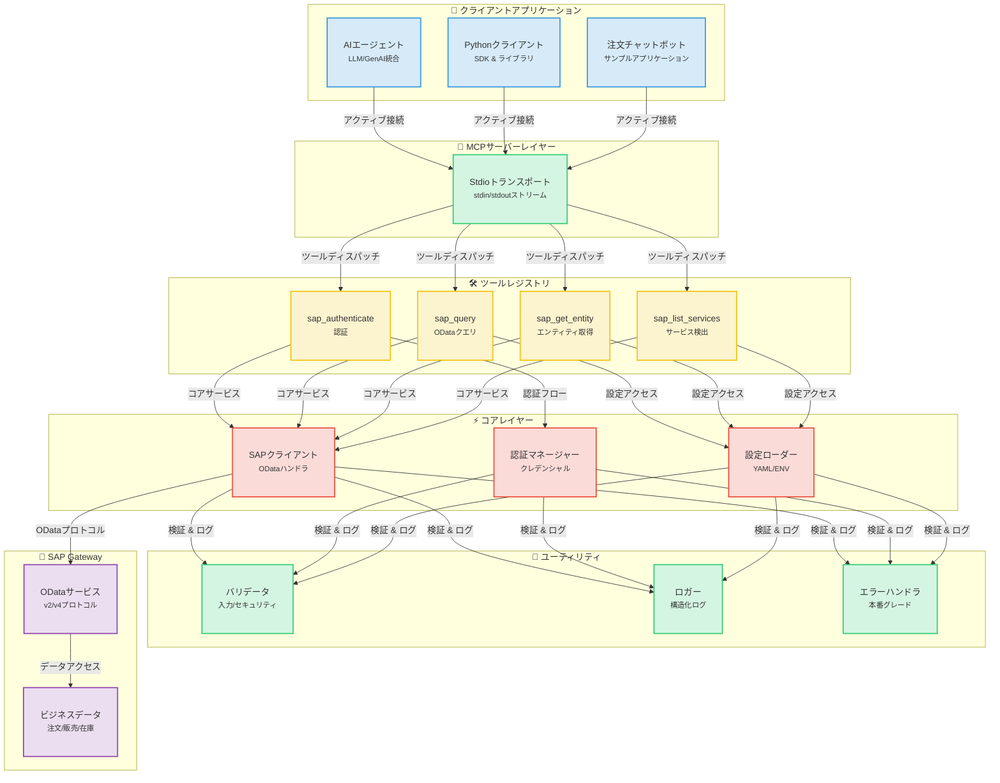
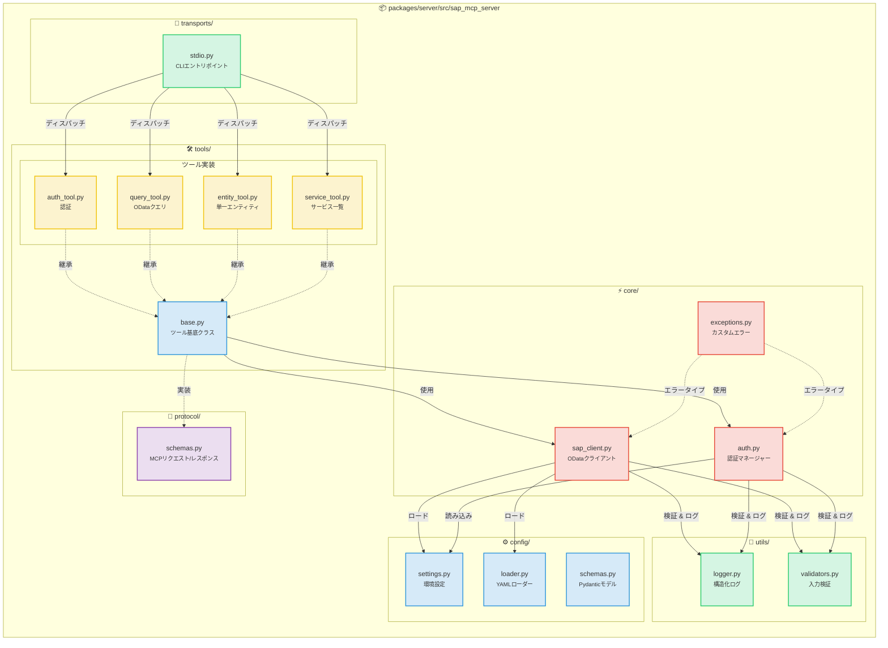
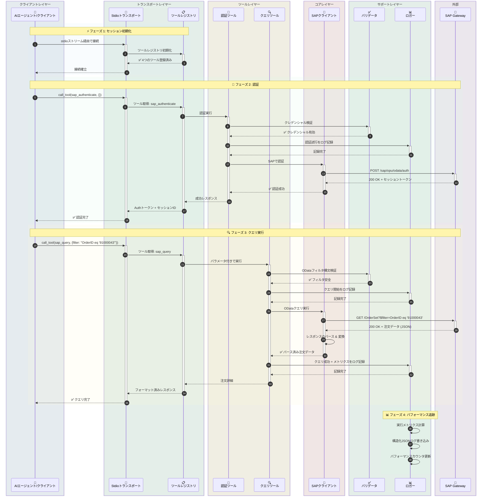
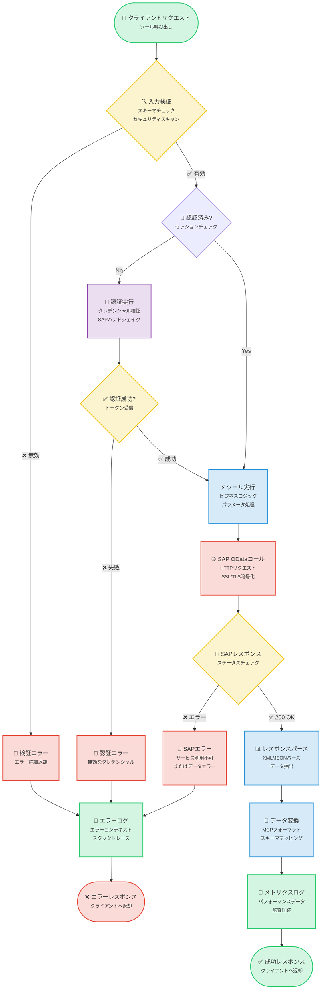
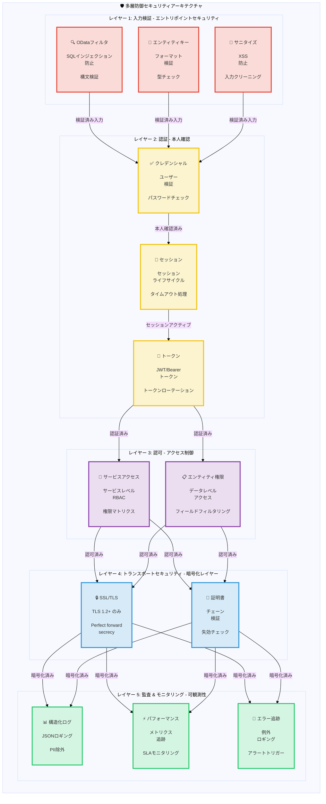

# SAP MCP - Model Context ProtocolによるSAP Gateway統合

AIエージェントによるSAP OData操作のためのモジュール式ツールを提供する、SAP Gateway統合のための完全なMCPサーバーです。

<div align="center">

[](https://www.python.org/downloads/)
[](LICENSE)
[]()
[]()
[]()

</div>

---

## 🎯 プロジェクト概要

AIエージェントやアプリケーションが、クリーンでモジュール化されたアーキテクチャを通じてSAP Gatewayシステムと対話できるようにする、本番環境対応のMCP（Model Context Protocol）サーバーです。信頼性、セキュリティ、開発者体験を重視して構築されています。

**現在のステータス**: ✅ **本番環境対応** (全5フェーズ完了)

### 主な特徴

- 🔐 **セキュアなSAP統合**: エンタープライズグレードの認証とSSL/TLSサポート
- 🛠️ **4つのモジュール式ツール**: 認証、クエリ、エンティティ取得、サービス検出
- 🚀 **Stdioトランスポート**: 本番対応MCPサーバー
- 📊 **構造化ロギング**: パフォーマンスメトリクスを含むJSONおよびコンソール形式
- ✅ **入力検証**: 包括的なODataおよびセキュリティ検証
- 🧪 **十分なテスト**: カバレッジ56%、44/45テスト合格 (成功率98%)

---

## 📐 アーキテクチャ

### システム概要

<details>
<summary>📊 システム概要図を表示するにはクリック</summary>



</details>

### コンポーネント詳細

<details>
<summary>🔧 コンポーネント詳細図を表示するにはクリック</summary>



</details>

### データフロー: 注文クエリの例

<details>
<summary>🔄 データフロー図を表示するにはクリック</summary>



</details>

### ツール実行フロー

<details>
<summary>⚡ ツール実行フロー図を表示するにはクリック</summary>



</details>

### セキュリティアーキテクチャ

<details>
<summary>🔒 セキュリティアーキテクチャ図を表示するにはクリック</summary>



</details>

---

## 📦 リポジトリ構造

```
sap-mcp/
├── packages/
│   └── server/                          ✅ 本番対応MCPサーバー
│       ├── src/sap_mcp_server/
│       │   ├── core/                    # SAPクライアント & 認証 (4ファイル)
│       │   │   ├── __init__.py          # モジュール初期化
│       │   │   ├── sap_client.py        # OData操作
│       │   │   ├── auth.py              # クレデンシャル管理
│       │   │   └── exceptions.py        # カスタム例外
│       │   ├── config/                  # 設定 (4ファイル)
│       │   │   ├── __init__.py          # モジュール初期化
│       │   │   ├── settings.py          # 環境設定
│       │   │   ├── loader.py            # YAMLローダー
│       │   │   └── schemas.py           # Pydanticモデル
│       │   ├── protocol/                # MCPプロトコル (2ファイル)
│       │   │   ├── __init__.py          # モジュール初期化
│       │   │   └── schemas.py           # リクエスト/レスポンススキーマ
│       │   ├── tools/                   # 4つのモジュール式SAPツール (6ファイル)
│       │   │   ├── __init__.py          # ツールレジストリ
│       │   │   ├── base.py              # ツール基底クラス
│       │   │   ├── auth_tool.py         # 認証
│       │   │   ├── query_tool.py        # ODataクエリ
│       │   │   ├── entity_tool.py       # エンティティ取得
│       │   │   └── service_tool.py      # サービス検出
│       │   ├── transports/              # トランスポートレイヤー (2ファイル)
│       │   │   ├── __init__.py          # モジュール初期化
│       │   │   └── stdio.py             # Stdioトランスポート ✅
│       │   ├── utils/                   # ユーティリティ (3ファイル)
│       │   │   ├── __init__.py          # モジュール初期化
│       │   │   ├── logger.py            # 構造化ロギング
│       │   │   └── validators.py        # 入力検証
│       │   └── __init__.py              # パッケージ初期化
│       ├── config/                      # サーバー設定
│       │   ├── services.yaml            # SAPサービス設定
│       │   └── services.yaml.example    # 設定テンプレート
│       ├── tests/                       # テストスイート (7ファイル, 56% カバレッジ)
│       │   ├── __init__.py              # テストパッケージ初期化
│       │   ├── conftest.py              # Pytestフィクスチャ
│       │   ├── unit/                    # ユニットテスト
│       │   │   ├── __init__.py          # ユニットテストパッケージ
│       │   │   ├── test_base.py         # 基底ツールテスト
│       │   │   └── test_validators.py   # バリデータテスト
│       │   └── integration/             # 統合テスト
│       │       ├── __init__.py          # 統合テストパッケージ
│       │       └── test_tool_integration.py  # ツール統合テスト
│       ├── pyproject.toml               # パッケージ設定
│       └── README.md                    # サーバーパッケージドキュメント
│
├── docs/                                # ドキュメント
│   ├── architecture/                    # アーキテクチャドキュメント
│   │   └── server.md                    # サーバーアーキテクチャ
│   └── guides/                          # ユーザーガイド
│       ├── configuration.md             # 設定ガイド
│       ├── deployment.md                # デプロイメントガイド
│       ├── troubleshooting.md           # トラブルシューティングガイド
│       ├── odata-service-creation-flight-demo.md  # ODataサービス作成
│       └── sfight-demo-guide.md         # SFLIGHTデモガイド
│
├── examples/                            # サンプルアプリケーション
│   ├── basic/                           # 基本サンプル
│   │   └── stdio_client.py              # Stdioクライアント例
│   ├── chatbot/                         # チャットボットサンプル
│   │   └── order_inquiry_chatbot.py     # 注文照会チャットボット
│   └── README.md                        # サンプルドキュメント
│
├── scripts/                             # 開発スクリプト
│   ├── create_structure.sh              # プロジェクト構造作成
│   ├── migrate_code.sh                  # コード移行スクリプト
│   └── update_imports.py                # インポート更新スクリプト
│
├── .claude/                             # Claude Code設定
│   └── settings.local.json              # ローカル設定
│
├── .env.server.example                  # 環境変数テンプレート
├── .gitignore                           # Git除外ルール
├── README.md                            # メインドキュメント (英語)
├── README.ja.md                         # 日本語ドキュメント
├── README.ko.md                         # 韓国語ドキュメント
├── README.th.md                         # タイ語ドキュメント
├── README.zh-TW.md                      # 繁体字中国語ドキュメント
└── README.zh-CN.md                      # 簡体字中国語ドキュメント
```

---

## ✨ 機能

### コア機能

<table>
<tr>
<td width="50%">

#### 🛠️ ツール
- ✅ **sap_authenticate**: セキュアなSAP認証
- ✅ **sap_query**: フィルタ付きODataクエリ
- ✅ **sap_get_entity**: 単一エンティティ取得
- ✅ **sap_list_services**: サービス検出

</td>
<td width="50%">

#### 🚀 トランスポート
- ✅ **Stdio**: 本番対応stdin/stdout

</td>
</tr>
<tr>
<td>

#### 📊 ロギング & モニタリング
- ✅ **構造化ロギング**: JSON + コンソール
- ✅ **パフォーマンスメトリクス**: リクエスト時間計測
- ✅ **エラー追跡**: 完全なコンテキスト
- ✅ **監査証跡**: セキュリティイベント

</td>
<td>

#### 🔒 セキュリティ
- ✅ **入力検証**: OData & セキュリティ
- ✅ **SSL/TLSサポート**: セキュアな接続
- ✅ **クレデンシャル管理**: .env.server
- ✅ **エラーハンドリング**: 本番グレード

</td>
</tr>
</table>

### 開発者体験

- ✅ **モジュール式アーキテクチャ**: 1ファイル1ツール
- ✅ **型安全性**: 完全な型ヒント
- ✅ **ドキュメント**: 包括的なガイド
- ✅ **簡単セットアップ**: `pip install -e .`
- ✅ **ホットリロード**: 開発モード
- ✅ **サンプルアプリ**: 3つの動作するサンプル

---

## 🚀 クイックスタート

### 前提条件

#### システム要件

- **Python 3.11 以上**
- **pip** (Pythonパッケージインストーラ)
- **Git** (リポジトリクローン用)
- SAP Gateway アクセスクレデンシャル
- 仮想環境のサポート

#### Pythonのインストール

<details>
<summary><b>🪟 Windows</b></summary>

**オプション 1: Microsoft Store (Windows 10/11推奨)**
```powershell
# Microsoft Storeで "Python 3.11" または "Python 3.12" を検索
# または python.org からダウンロード
```

**オプション 2: Python.org インストーラ**
1. [python.org/downloads](https://www.python.org/downloads/) からダウンロード
2. インストーラを実行
3. ✅ **"Add Python to PATH" をチェック**
4. "Install Now" をクリック

**インストール確認:**
```powershell
python --version
# 表示例: Python 3.11.x or higher

pip --version
# 表示例: pip 23.x.x or higher
```

**よくある問題:**
- `python` コマンドが見つからない場合は、`python3` または `py` を試してください
- `pip` が見つからない場合は、次でインストール: `python -m ensurepip --upgrade`

</details>

<details>
<summary><b>🍎 macOS</b></summary>

**オプション 1: Homebrew (推奨)**
```bash
# Homebrewが未インストールの場合
/bin/bash -c "$(curl -fsSL https://raw.githubusercontent.com/Homebrew/install/HEAD/install.sh)"

# Pythonインストール
brew install python@3.11
# または
brew install python@3.12
```

**オプション 2: Python.org インストーラ**
1. [python.org/downloads/macos](https://www.python.org/downloads/macos/) からダウンロード
2. `.pkg` ファイルを開く
3. インストールウィザードに従う

**インストール確認:**
```bash
python3 --version
# 表示例: Python 3.11.x or higher

pip3 --version
# 表示例: pip 23.x.x or higher
```

**注意:** macOSにはPython 2.7がプリインストールされている場合があります。常に `python3` と `pip3` コマンドを使用してください。

</details>

<details>
<summary><b>🐧 Linux</b></summary>

**Ubuntu/Debian:**
```bash
# パッケージリスト更新
sudo apt update

# Python 3.11+ インストール
sudo apt install python3.11 python3.11-venv python3-pip

# または最新のPython
sudo apt install python3 python3-venv python3-pip
```

**Fedora/RHEL/CentOS:**
```bash
# Python 3.11+ インストール
sudo dnf install python3.11 python3-pip

# または
sudo yum install python3 python3-pip
```

**Arch Linux:**
```bash
sudo pacman -S python python-pip
```

**インストール確認:**
```bash
python3 --version
# 表示例: Python 3.11.x or higher

pip3 --version
# 表示例: pip 23.x.x or higher
```

</details>

---

### 1. インストール

#### ステップバイステップ・インストール

<details open>
<summary><b>🪟 Windows (PowerShell/Command Prompt)</b></summary>

```powershell
# リポジトリをクローン
git clone <repository-url>
cd sap-mcp

# 仮想環境作成
python -m venv .venv

# 仮想環境アクティベート
.venv\Scripts\activate
# または PowerShell で:
# .venv\Scripts\Activate.ps1

# PowerShellで実行ポリシーエラーが出る場合:
# Set-ExecutionPolicy -ExecutionPolicy RemoteSigned -Scope CurrentUser

# アクティベーション確認 (プロンプトに (.venv) が表示されるはずです)
# (.venv) PS C:\path\to\sap-mcp>

# サーバーパッケージインストール
cd packages\server
pip install -e .

# 開発依存関係インストール (オプション)
pip install -e ".[dev]"

# インストール確認
sap-mcp-server-stdio --help
```

**Windowsのよくある問題:**
- **`python` が見つからない**: `python3` または `py` を試してください
- **アクセス拒否**: PowerShellを管理者として実行してください
- **実行ポリシー**: `Set-ExecutionPolicy -ExecutionPolicy RemoteSigned -Scope CurrentUser` を実行
- **長いパスのサポート**: Windowsで長いパスを有効化 (設定 > システム > バージョン情報 > システムの詳細設定)

</details>

<details>
<summary><b>🍎 macOS (Terminal)</b></summary>

```bash
# リポジトリをクローン
git clone <repository-url>
cd sap-mcp

# 仮想環境作成
python3 -m venv .venv

# 仮想環境アクティベート
source .venv/bin/activate

# アクティベーション確認 (プロンプトに (.venv) が表示されるはずです)
# (.venv) user@macbook sap-mcp %

# サーバーパッケージインストール
cd packages/server
pip install -e .

# 開発依存関係インストール (オプション)
pip install -e ".[dev]"

# インストール確認
sap-mcp-server-stdio --help

# インストールパス確認 (Gemini CLIセットアップに有用)
which sap-mcp-server-stdio
# 出力例: /Users/username/sap-mcp/.venv/bin/sap-mcp-server-stdio
```

**macOSのよくある問題:**
- **`python` が見つからない**: `python3` を代わりに使用してください
- **`pip` が見つからない**: `pip3` を代わりに使用してください
- **アクセス拒否**: 仮想環境では `sudo` を使用しないでください
- **インストール後にコマンドが見つからない**: 仮想環境がアクティベートされているか確認してください

</details>

<details>
<summary><b>🐧 Linux (Bash/Zsh)</b></summary>

```bash
# リポジトリをクローン
git clone <repository-url>
cd sap-mcp

# 仮想環境作成
python3 -m venv .venv

# 仮想環境アクティベート
source .venv/bin/activate

# アクティベーション確認 (プロンプトに (.venv) が表示されるはずです)
# (.venv) user@linux:~/sap-mcp$

# サーバーパッケージインストール
cd packages/server
pip install -e .

# 開発依存関係インストール (オプション)
pip install -e ".[dev]"

# インストール確認
sap-mcp-server-stdio --help

# インストールパス確認 (Gemini CLIセットアップに有用)
which sap-mcp-server-stdio
# 出力例: /home/username/sap-mcp/.venv/bin/sap-mcp-server-stdio
```

**Linuxのよくある問題:**
- **`python3-venv` が見つからない**: `sudo apt install python3-venv` でインストール
- **アクセス拒否**: 仮想環境では `sudo` を使用しないでください
- **SSLエラー**: 証明書をインストール: `sudo apt install ca-certificates`
- **ビルド依存関係不足**: `sudo apt install build-essential python3-dev` でインストール

</details>

---

### 2. 設定

SAP MCPサーバーには2つの設定ファイルが必要です:
1. **`.env.server`**: SAP接続クレデンシャル (単一SAPシステム)
2. **`services.yaml`**: SAP Gatewayサービスおよび認証設定

#### 2.1. SAP接続設定 (`.env.server`)

> **⚠️ 重要**: v0.2.0以降、`.env.server` は **プロジェクトルートディレクトリのみ** に統合されました。以前の `packages/server/.env.server` の場所はサポートされなくなりました。

**ファイル場所**: `.env.server` は **プロジェクトルートディレクトリ** にある必要があります。

```
sap-mcp/
├── .env.server              ← 設定ファイル (ここだけに作成)
├── .env.server.example      ← サンプルテンプレート
├── packages/
│   └── server/
└── README.md
```

**セットアップ手順**:

<details open>
<summary><b>🪟 Windows (PowerShell/Command Prompt)</b></summary>

```powershell
# プロジェクトルートへ移動
cd C:\path\to\sap-mcp

# 環境テンプレートをコピー
copy .env.server.example .env.server

# メモ帳でSAPクレデンシャルを設定編集
notepad .env.server

# またはお好みのエディタで:
# code .env.server (VS Code)
# notepad++ .env.server (Notepad++)

# 注意: Windowsではファイル権限管理が異なります
# ファイルがパブリックフォルダにないことを確認してください
# .env.server を右クリック > プロパティ > セキュリティ でアクセス制限
```

**Windows固有の注意点:**
- Windowsではパスにバックスラッシュ (`\`) を使用
- PowerShell実行ポリシーがスクリプトをブロックする可能性があります（インストールセクション参照）
- `.env.server` はアクセス制限されたユーザーフォルダに保存してください
- アンチウイルスがファイルをブロックする場合はWindows Defenderの除外を使用

</details>

<details>
<summary><b>🍎 macOS (Terminal)</b></summary>

```bash
# プロジェクトルートへ移動
cd /path/to/your/sap-mcp

# 環境テンプレートをコピー
cp .env.server.example .env.server

# SAPクレデンシャルを設定編集
nano .env.server
# またはお好みのエディタで:
# vim .env.server
# code .env.server (VS Code)
# open -a TextEdit .env.server

# 適切な権限を設定 (セキュリティ推奨)
chmod 600 .env.server

# 権限確認
ls -la .env.server
# 表示: -rw------- (所有者のみ読み書き可能)
```

**macOS固有の注意点:**
- ファイル権限はUnixベースです（Linuxと同じ）
- `chmod 600` はあなたのユーザーのみが読み書きできるようにします
- macOSは初回アクセス時に追加のセキュリティプロンプトを出す場合があります
- 最良のセキュリティのためにホームディレクトリに保存してください

</details>

<details>
<summary><b>🐧 Linux (Bash/Zsh)</b></summary>

```bash
# プロジェクトルートへ移動
cd /path/to/your/sap-mcp

# 環境テンプレートをコピー
cp .env.server.example .env.server

# SAPクレデンシャルを設定編集
nano .env.server
# またはお好みのエディタで:
# vim .env.server
# code .env.server (VS Code)
# gedit .env.server (GNOME)

# 適切な権限を設定 (セキュリティに必須)
chmod 600 .env.server

# 権限確認
ls -la .env.server
# 表示: -rw------- (所有者のみ読み書き可能)

# オプション: ファイルがワールドリーダブルでないことを確認
stat .env.server
```

**Linux固有の注意点:**
- `chmod 600` はセキュリティに重要です（所有者のみアクセス可能）
- SELinux/AppArmorは追加設定が必要な場合があります
- ファイルはサーバーを実行するユーザーが所有している必要があります
- このファイルの編集や実行に `sudo` を使用しないでください

</details>

---

**必須環境変数**:
```bash
# SAPシステム接続 (単一SAPシステム)
SAP_HOST=your-sap-host.com          # SAP Gatewayホスト名
SAP_PORT=443                         # HTTPSポート (通常 443 または 8443)
SAP_USERNAME=your-username           # SAPユーザーID
SAP_PASSWORD=your-password           # SAPパスワード
SAP_CLIENT=100                       # SAPクライアント番号 (例: 100, 800)

# セキュリティ設定
SAP_VERIFY_SSL=true                  # SSL証明書検証を有効化 (推奨)
SAP_TIMEOUT=30                       # リクエストタイムアウト (秒)

# オプション: 接続プーリング
SAP_MAX_CONNECTIONS=10               # 最大同時接続数 (オプション)
SAP_RETRY_ATTEMPTS=3                 # 失敗時の再試行回数 (オプション)
```

**セキュリティベストプラクティス**:
- ✅ `.env.server` をバージョン管理にコミットしないでください (すでに `.gitignore` に含まれています)
- ✅ 強力でユニークなパスワードを使用してください
- ✅ 本番環境ではSSL検証を有効にしてください (`SAP_VERIFY_SSL=true`)
- ✅ ファイル権限を制限してください: `chmod 600 .env.server`

#### 2.2. SAP Gatewayサービス設定 (`services.yaml`)

MCPサーバーがアクセスできるSAP Gatewayサービス (ODataサービス) を設定します。

**場所**: `packages/server/config/services.yaml`

```bash
# 設定サンプルをコピー
cp packages/server/config/services.yaml.example packages/server/config/services.yaml

# サービス設定を編集
vim packages/server/config/services.yaml
```

**基本設定例**:

```yaml
# Gateway URL設定
gateway:
  # ODataサービスのベースURLパターン
  base_url_pattern: "https://{host}:{port}/sap/opu/odata"

  # メタデータエンドポイントサフィックス
  metadata_suffix: "/$metadata"

  # サービスカタログパス
  service_catalog_path: "/sap/opu/odata/IWFND/CATALOGSERVICE;v=2/ServiceCollection"

  # 認証エンドポイント設定
  auth_endpoint:
    # 推奨: カタログメタデータを使用 (特定のサービスなしで動作)
    use_catalog_metadata: true

    # オプション: 認証に特定のサービスを使用 (カタログが利用不可の場合)
    # use_catalog_metadata: false
    # service_id: Z_TRAVEL_RECOMMENDATIONS_SRV
    # entity_name: AirlineSet

# SAP ODataサービス
services:
  # SFLIGHTデモサービス (旅行推奨)
  - id: Z_TRAVEL_RECOMMENDATIONS_SRV
    name: "Travel Recommendations Service (SFLIGHT)"
    path: "/SAP/Z_TRAVEL_RECOMMENDATIONS_SRV"
    version: v2
    description: "OData service for the SFLIGHT demo dataset."
    entities:
      - name: AirlineSet
        key_field: CARRID
        description: "Airlines (e.g., LH, AA)"
        default_select:
          - CARRID
          - CARRNAME
          - CURRCODE
          - URL
      - name: AirportSet
        key_field: ID
        description: "Airports (e.g., FRA, JFK)"
        default_select:
          - ID
          - NAME
          - CITY
          - COUNTRY
      - name: FlightSet
        key_field: "CARRID='{CARRID}',CONNID='{CONNID}',FLDATE=datetime'{FLDATE}'"
        description: "Specific flights on a given date"
      - name: BookingSet
        key_field: "CARRID='{CARRID}',CONNID='{CONNID}',FLDATE=datetime'{FLDATE}',BOOKID='{BOOKID}'"
        description: "Individual flight bookings"

    # オプション: このサービスのカスタムヘッダー
    custom_headers: {}
```

#### 2.3. 認証エンドポイントオプション

`auth_endpoint` 設定は、MCPサーバーがSAPで認証する方法を制御します。

**オプション 1: カタログメタデータ (推奨)**

```yaml
gateway:
  auth_endpoint:
    use_catalog_metadata: true
```

**利点**:
- ✅ 特定のSAP Gatewayサービスを必要とせずに動作
- ✅ SAPシステム間でより柔軟で移植性が高い
- ✅ サービスに依存しない認証
- ✅ カスタムサービスのデプロイに依存しない

**認証フロー**:
- CSRFトークン: `/sap/opu/odata/IWFND/CATALOGSERVICE;v=2/ServiceCollection`
- 検証: `/sap/opu/odata/IWFND/CATALOGSERVICE;v=2/$metadata`

---

**オプション 2: サービス固有の認証**

```yaml
gateway:
  auth_endpoint:
    use_catalog_metadata: false
    service_id: Z_TRAVEL_RECOMMENDATIONS_SRV    # 以下のサービスIDと一致する必要があります
    entity_name: AirlineSet                     # そのサービスのエンティティである必要があります
```

**利点**:
- ✅ 明示的なサービスベースの認証
- ✅ カタログサービスが利用できない場合に動作 (稀)

**欠点**:
- ❌ 指定されたサービスがデプロイされている必要がある
- ❌ サービスが変更された場合に柔軟性が低い
- ❌ サービス名が変更された場合に設定を更新する必要がある

**認証フロー**:
- CSRFトークン: `/SAP/Z_TRAVEL_RECOMMENDATIONS_SRV/AirlineSet`
- 検証: `/sap/opu/odata/IWFND/CATALOGSERVICE;v=2/$metadata`

---

**推奨**: 特定のサービスを認証に使用する特別な理由がない限り、**オプション 1 (カタログメタデータ)** を使用してください。

### 3. サーバー実行

<details open>
<summary><b>🪟 Windows (PowerShell/Command Prompt)</b></summary>

```powershell
# 仮想環境アクティベート
.venv\Scripts\activate
# または PowerShell で:
# .venv\Scripts\Activate.ps1

# stdioサーバー実行 (推奨)
sap-mcp-server-stdio

# またはPythonで直接実行
python -m sap_mcp_server.transports.stdio

# 終了時に非アクティブ化する場合
deactivate
```

**Windows固有の注意点:**
- パスにはバックスラッシュ (`\`) を使用
- PowerShellは実行ポリシーの変更が必要な場合があります
- サーバーは現在のターミナルウィンドウで実行されます
- サーバーを停止するには `Ctrl+C` を押します

</details>

<details>
<summary><b>🍎 macOS (Terminal)</b></summary>

```bash
# 仮想環境アクティベート
source .venv/bin/activate

# stdioサーバー実行 (推奨)
sap-mcp-server-stdio

# またはPythonで直接実行
python3 -m sap_mcp_server.transports.stdio

# 終了時に非アクティブ化する場合
deactivate
```

**macOS固有の注意点:**
- `python` の代わりに `python3` を使用
- サーバーは現在のターミナルセッションで実行されます
- サーバーを停止するには `Cmd+C` または `Ctrl+C` を押します
- サーバー実行中はターミナルを開いたままにする必要があります

</details>

<details>
<summary><b>🐧 Linux (Bash/Zsh)</b></summary>

```bash
# 仮想環境アクティベート
source .venv/bin/activate

# stdioサーバー実行 (推奨)
sap-mcp-server-stdio

# またはPythonで直接実行
python3 -m sap_mcp_server.transports.stdio

# 終了時に非アクティブ化する場合
deactivate
```

**Linux固有の注意点:**
- `python` の代わりに `python3` を使用
- サーバーは現在のターミナルセッションで実行されます
- サーバーを停止するには `Ctrl+C` を押します
- `nohup` や `systemd` サービスでバックグラウンド実行可能

</details>

---

## 🤖 Gemini CLIとの統合

> **📖 公式ドキュメント**: Gemini CLIの詳細については、<a href="https://geminicli.com/" target="_blank">https://geminicli.com/</a> をご覧ください。

### 前提条件

- Node.js 18+ および npm がインストールされていること
- SAP MCPサーバーがインストールされていること (上記のクイックスタート参照)
- Gemini APIアクセスのためのGoogleアカウント

### 1. Gemini CLIのインストール

```bash
# Gemini CLIをグローバルにインストール
npm install -g @google/gemini-cli

# インストール確認
gemini --version
```

### 2. Gemini CLIの認証

**オプション A: Gemini APIキーの使用 (開始に推奨)**

1. [Google AI Studio](https://aistudio.google.com/apikey) からAPIキーを取得
2. 環境変数を設定:

```bash
export GEMINI_API_KEY="your-api-key-here"
```

**オプション B: Google Cloudの使用 (本番用)**

```bash
# Google Cloud CLIを最初にインストール
gcloud auth application-default login

# プロジェクトを設定
export GOOGLE_CLOUD_PROJECT="your-project-id"
export GOOGLE_CLOUD_LOCATION="us-central1"
```

### 3. SAP MCPサーバーの登録

**方法 A: 絶対パスの使用 (仮想環境に推奨)**

サーバーを仮想環境にインストールした場合、実行可能ファイルへの絶対パスを使用します:

1. **絶対パスを見つける**:
```bash
# SAP MCPディレクトリへ移動
cd /path/to/your/sap-mcp

# 絶対パスを取得
pwd
# 出力例: /path/to/your/sap-mcp
```

2. **`~/.gemini/settings.json` を編集**:
```json
{
  "mcpServers": {
    "sap-server": {
      "command": "/path/to/your/sap-mcp/.venv/bin/sap-mcp-server-stdio",
      "cwd": "/path/to/your/sap-mcp",
      "description": "SAP Gateway MCP Server for OData integration",
      "timeout": 30000,
      "trust": false
    }
  }
}
```

**`/path/to/your/sap-mcp` を実際のプロジェクトパスに置き換えてください。**

> **📝 注意**: `cwd` (カレントワーキングディレクトリ) パラメータは、`.env.server` ファイル検出のために **絶対に重要** です。これをプロジェクトルートディレクトリ (例: `/Users/username/projects/sap-mcp`) に設定 **しなければなりません**。省略または誤っている場合、サーバーはクレデンシャルをロードできません。

3. **パスの確認**:
```bash
# コマンドが動作するかテスト
/path/to/your/sap-mcp/.venv/bin/sap-mcp-server-stdio --help

# 登録確認
gemini mcp list
# 期待される出力: ✓ sap-server: ... (stdio) - Connected
```

---

**方法 B: CLIコマンドの使用 (グローバルインストールの場合)**

`sap-mcp-server-stdio` がシステムPATHにある場合:

```bash
# サーバー登録
gemini mcp add sap-server sap-mcp-server-stdio

# 登録確認
gemini mcp list
```

**注意**: この方法は、仮想環境をPATHに追加したか、パッケージをグローバルにインストールした場合のみ機能します。

---

**方法 C: Pythonモジュールパスの使用**

Pythonモジュールを使用した代替アプローチ:

```json
{
  "mcpServers": {
    "sap-server": {
      "command": "/path/to/your/sap-mcp/.venv/bin/python",
      "args": ["-m", "sap_mcp_server.transports.stdio"],
      "cwd": "/path/to/your/sap-mcp/packages/server",
      "description": "SAP Gateway MCP Server",
      "timeout": 30000,
      "trust": false
    }
  }
}
```

### 4. Gemini CLIでSAP MCPの使用を開始

```bash
# Gemini CLI起動
gemini

# MCPサーバー状態確認
> /mcp

# 利用可能なSAPツール表示
> /mcp desc

# 例: SAP航空会社をクエリ
> SAPツールを使用して認証し、すべての航空会社を表示して

# 例: 利用可能なSAPサービス一覧
> どのようなSAPサービスが利用可能ですか？

# 例: 空港詳細取得
> フランクフルト空港 (FRA) の詳細を取得して
```

### 高度な設定

**信頼できるサーバーの自動承認を有効化**

```json
{
  "mcpServers": {
    "sap-server": {
      "command": "/path/to/your/sap-mcp/.venv/bin/sap-mcp-server-stdio",
      "trust": true,
      "timeout": 30000
    }
  }
}
```

**注意**: `"trust": true` を設定すると、各ツール呼び出しの承認プロンプトをスキップします。信頼できるサーバーに対してのみ有効にしてください。

---

**特定のツールをフィルタリング**

```json
{
  "mcpServers": {
    "sap-server": {
      "command": "/path/to/your/sap-mcp/.venv/bin/sap-mcp-server-stdio",
      "includeTools": ["sap_authenticate", "sap_query"],
      "excludeTools": ["sap_list_services"],
      "timeout": 30000
    }
  }
}
```

**ユースケース**:
- `includeTools`: 特定のツールのみ許可 (ホワイトリスト)
- `excludeTools`: 特定のツールをブロック (ブラックリスト)
- 両方を同時に使用することはできません

---

**環境変数の追加 (オプション)**

```json
{
  "mcpServers": {
    "sap-server": {
      "command": "/path/to/your/sap-mcp/.venv/bin/sap-mcp-server-stdio",
      "env": {
        "SAP_HOST": "${SAP_HOST}",
        "SAP_USERNAME": "${SAP_USERNAME}",
        "SAP_PASSWORD": "${SAP_PASSWORD}"
      },
      "timeout": 30000
    }
  }
}
```

**注意**: `settings.json` 内の環境変数は `.env.server` の値を上書きします。セキュリティ上の理由から推奨されません - 代わりに `.env.server` ファイルを使用することを推奨します。

---

**低速ネットワーク向けにタイムアウトを延長**

```json
{
  "mcpServers": {
    "sap-server": {
      "command": "/path/to/your/sap-mcp/.venv/bin/sap-mcp-server-stdio",
      "timeout": 60000,  // 60秒 (デフォルト: 30000)
      "trust": false
    }
  }
}
```

**延長すべき場合**:
- 低速なネットワーク接続
- 大規模なデータクエリ
- 複雑なSAP操作
- 頻繁なタイムアウトエラー

### トラブルシューティング

**問題: サーバーが "Disconnected" (切断) 状態を示す**

```bash
# MCPサーバー状態確認
gemini mcp list
# 表示: ✗ sap-server: sap-mcp-server-stdio (stdio) - Disconnected
```

**解決策 1: 絶対パスを使用 (最も一般的)**

コマンドが仮想環境内にある可能性があります。`~/.gemini/settings.json` を更新:

```json
{
  "mcpServers": {
    "sap-server": {
      "command": "/path/to/your/sap-mcp/.venv/bin/sap-mcp-server-stdio",
      "description": "SAP Gateway MCP Server",
      "timeout": 30000,
      "trust": false
    }
  }
}
```

**絶対パスを見つける**:
```bash
# SAP MCPディレクトリへ移動
cd /path/to/your/sap-mcp

# フルパス取得
pwd
# 例: /path/to/your/sap-mcp

# コマンド存在確認
ls -la .venv/bin/sap-mcp-server-stdio
```

---

**問題: コマンドがPATHに見つからない**

```bash
# サーバー直接テスト
sap-mcp-server-stdio
# エラー: command not found

# コマンド存在確認
which sap-mcp-server-stdio
# 戻り値: command not found
```

**解決策 2: 仮想環境を確認**

```bash
# 仮想環境が存在するか確認
ls -la .venv/bin/sap-mcp-server-stdio

# 存在する場合、settings.jsonで絶対パスを使用
# 存在しない場合、再インストール:
cd packages/server
pip install -e .
```

---

**問題: 認証エラーまたは `.env.server` が見つからない**

```bash
# .env.server がプロジェクトルート (packages/server/ ではない) に存在することを確認
cat .env.server

# 必須フィールド:
# SAP_HOST=your-host
# SAP_PORT=443
# SAP_USERNAME=your-username
# SAP_PASSWORD=your-password
# SAP_CLIENT=100
```

**解決策 3: ファイル場所とクレデンシャルを確認**

```bash
# 1. .env.server がプロジェクトルートにあるか確認
ls -la .env.server
# 存在するべき場所: /path/to/sap-mcp/.env.server

# 2. Gemini CLI settings.json に "cwd" パラメータがあるか確認
cat ~/.gemini/settings.json
# 含むべき: "cwd": "/path/to/sap-mcp"

# 3. 手動で認証テスト
source .venv/bin/activate
python -c "from sap_mcp_server.config.settings import get_connection_config; print(get_connection_config())"
```

**よくある問題**:

1. **"Field required" エラー**: `.env.server` がロードされていません。確認事項:
   - ファイルがプロジェクトルートに存在するか: `/path/to/your/sap-mcp/.env.server`
   - Gemini CLI `settings.json` が正しい `cwd` パラメータを持っているか
   - ファイルが適切な権限を持っているか: `chmod 600 .env.server`

2. **401 Unauthorized エラー**: v0.2.1 (2025-01-22) で修正済み
   - **以前の問題**: SAP Gatewayが `sap-client` パラメータなしのリクエストを拒否していた
   - **現在のステータス**: 自動的に処理 - すべてのリクエストに `sap-client` パラメータが含まれます
   - **確認**: v0.2.1以降に更新されていることを確認してください
   - **手動チェック**: 有効なクレデンシャルで認証が成功するはずです

---

**問題: サーバーの再登録が必要**

```bash
# 既存のサーバー設定を削除
rm ~/.gemini/settings.json

# または手動で編集して sap-server エントリを削除
```

**解決策 4: クリーン再登録**

```bash
# 方法 1: 設定を直接編集
vim ~/.gemini/settings.json

# 方法 2: 絶対パスを使用 (推奨)
# 上記セクション3の "方法 A: 絶対パスの使用" に従う
```

---

**クイック診断ステップ**

1. **サーバー実行ファイル確認**:
```bash
/path/to/sap-mcp/.venv/bin/sap-mcp-server-stdio --help
# サーバー起動メッセージが表示されるはずです
```

2. **Gemini CLI設定確認**:
```bash
cat ~/.gemini/settings.json | grep -A 5 "sap-server"
# "command" パスが正しいか確認
```

3. **接続テスト**:
```bash
gemini mcp list
# 表示: ✓ sap-server: ... - Connected
```

4. **Gemini CLIでテスト**:
```bash
gemini
> /mcp
> /mcp desc
# SAPツールが一覧表示されるはずです
```

### Gemini CLIで利用可能なSAPツール

登録後、自然言語を通じてこれらのSAPツールを使用できます:

| ツール | 説明 | プロンプト例 |
|------|-------------|----------------|
| **sap_authenticate** | SAP Gatewayで認証 | "SAPで認証して" |
| **sap_query** | ODataフィルタでSAPエンティティをクエリ | "旅行推奨サービスを使ってすべての航空会社を表示して" |
| **sap_get_entity** | キーで特定のエンティティを取得 | "フランクフルト空港 (FRA) の詳細を取得して" |
| **sap_list_services** | 利用可能なSAPサービスを一覧表示 | "どのようなSAPサービスが利用可能ですか？" |

### ワークフロー例

**1. フライト照会ワークフロー**

```bash
gemini

> SAPに接続してすべてのルフトハンザ便を見つけて
# Geminiの動作:
# 1. sap_authenticate を呼び出し
# 2. フィルタ "CARRID eq 'LH'" で FlightSet に対して sap_query を呼び出し
# 3. 結果をフォーマットして提示
```

**2. 空港分析**

```bash
> フランクフルト空港の詳細を取得し、利用可能な接続を表示して
# Geminiの動作:
# 1. 認証
# 2. AirportSet に対して 'FRA' で sap_get_entity を呼び出し
# 3. ConnectionSet に対して sap_query を呼び出し
# 4. インサイトを提示
```

**3. サービス検出**

```bash
> システムで利用可能なSAPサービスとエンティティセットは何ですか？
# Geminiの動作:
# 1. sap_list_services を呼び出し
# 2. サービスカタログをフォーマット
```

---

## 🔧 利用可能なツール

### 1. SAP Authenticate (認証)

`.env.server` のクレデンシャルを使用してSAP Gatewayシステムで認証します。

**リクエスト**:
```json
{
  "name": "sap_authenticate",
  "arguments": {}
}
```

**レスポンス**:
```json
{
  "success": true,
  "session_id": "abc123...",
  "message": "Successfully authenticated with SAP Gateway",
  "host": "example.sap.corp",
  "client": "100"
}
```

---

### 2. SAP Query (クエリ)

ODataフィルタ、選択、ページネーションを使用してSAPエンティティをクエリします。

**リクエスト**:
```json
{
  "name": "sap_query",
  "arguments": {
    "service": "Z_TRAVEL_RECOMMENDATIONS_SRV",
    "entity_set": "AirlineSet",
    "filter": "CARRID eq 'LH'",
    "select": "CARRID,CARRNAME,CURRCODE",
    "top": 10,
    "skip": 0
  }
}
```

**レスポンス**:
```json
{
  "d": {
    "results": [
      {
        "CARRID": "LH",
        "CARRNAME": "Lufthansa",
        "CURRCODE": "EUR"
      }
    ]
  }
}
```

---

### 3. SAP Get Entity (エンティティ取得)

キーによって特定のエンティティを取得します。

**リクエスト**:
```json
{
  "name": "sap_get_entity",
  "arguments": {
    "service": "Z_TRAVEL_RECOMMENDATIONS_SRV",
    "entity_set": "AirportSet",
    "entity_key": "'FRA'"
  }
}
```

**レスポンス**:
```json
{
  "success": true,
  "service": "Z_TRAVEL_RECOMMENDATIONS_SRV",
  "entity_set": "AirportSet",
  "entity_key": "'FRA'",
  "key_field": "ID",
  "data": {
    "d": {
      "ID": "FRA",
      "NAME": "Frankfurt International",
      "CITY": "Frankfurt",
      "COUNTRY": "DE",
      "TIME_ZONE": "CET"
    }
  }
}
```

---

### 4. SAP List Services (サービス一覧)

設定から利用可能なすべてのSAPサービスを一覧表示します。

**リクエスト**:
```json
{
  "name": "sap_list_services",
  "arguments": {}
}
```

**レスポンス**:
```json
{
  "success": true,
  "count": 1,
  "services": [
    {
      "id": "Z_TRAVEL_RECOMMENDATIONS_SRV",
      "name": "Travel Recommendations Service (SFLIGHT)",
      "path": "/SAP/Z_TRAVEL_RECOMMENDATIONS_SRV",
      "version": "v2",
      "description": "OData service for the SFLIGHT demo dataset.",
      "entities": [
        {
          "name": "AirlineSet",
          "key_field": "CARRID",
          "description": "Airlines (e.g., LH, AA)"
        },
        {
          "name": "AirportSet",
          "key_field": "ID",
          "description": "Airports (e.g., FRA, JFK)"
        }
      ]
    }
  ],
  "source": "services.yaml configuration"
}
```

---

## 📚 使用例

### ツールレジストリの使用

```python
from sap_mcp_server.tools import tool_registry
from sap_mcp_server.protocol.schemas import ToolCallRequest

# 利用可能なツールを一覧表示
tools = tool_registry.list_tools()
for tool in tools:
    print(f"- {tool.name}: {tool.description}")

# ツール呼び出し
request = ToolCallRequest(
    name="sap_list_services",
    arguments={}
)
result = await tool_registry.call_tool(request)
print(result)
```

### MCPクライアント例

```python
from mcp import StdioServerParameters
from mcp.client.session import ClientSession
from mcp.client.stdio import stdio_client

async def main():
    # MCPサーバーに接続
    server_params = StdioServerParameters(
        command="python",
        args=["-m", "sap_mcp_server.transports.stdio"]
    )

    async with stdio_client(server_params) as (read, write):
        async with ClientSession(read, write) as session:
            # セッション初期化
            await session.initialize()

            # 認証
            auth_result = await session.call_tool("sap_authenticate", {})

            # 航空会社クエリ
            entity_result = await session.call_tool(
                "sap_query",
                {
                    "service": "Z_TRAVEL_RECOMMENDATIONS_SRV",
                    "entity_set": "AirlineSet",
                    "filter": "CARRID eq 'LH'"
                }
            )
            print(entity_result)
```

### 構造化ロギング

```python
from sap_mcp_server.utils.logger import setup_logging, get_logger

# 本番 (JSONログ)
setup_logging(level="INFO", json_logs=True)

# 開発 (色付きコンソール)
setup_logging(level="DEBUG", json_logs=False)

# ロガー使用
logger = get_logger(__name__)
logger.info("Server started", port=8080, transport="stdio")
logger.error("Query failed", error=str(e), query=params)
```

### 入力検証

```python
from sap_mcp_server.utils.validators import (
    validate_odata_filter,
    validate_entity_key,
    sanitize_input
)

# ODataフィルタ検証
if validate_odata_filter("CARRID eq 'LH'"):
    # 実行しても安全
    pass

# ユーザー入力サニタイズ
safe_input = sanitize_input(user_data, max_length=1000)

# エンティティキー検証
if validate_entity_key(key):
    # エンティティ取得
    pass
```

---

## 🔒 セキュリティ

### 多層防御

| レイヤー | 実装 | ステータス |
|-------|---------------|--------|
| **入力検証** | OData構文, SQLインジェクション防止 | ✅ |
| **認証** | クレデンシャル検証, セッション管理 | ✅ |
| **認可** | サービスアクセス制御 | ✅ |
| **トランスポートセキュリティ** | SSL/TLS, 証明書検証 | ✅ |
| **監査ログ** | 構造化ログ, 機密データなし | ✅ |

### ベストプラクティス

1. **クレデンシャル**: `.env.server` に保存し、gitにコミットしない
2. **SSL/TLS**: 本番環境では常に有効化 (`SAP_VERIFY_SSL=true`)
3. **検証**: SAP呼び出し前にすべての入力を検証
4. **ロギング**: ログから機密データを除外
5. **エラーハンドリング**: クライアントへは一般的なエラーメッセージ

---

## 🎓 SAP SFLIGHT デモシナリオ

### シナリオ概要

SFLIGHTデータセットは、フライトスケジュール、航空会社、空港、予約のデータを含む、SAPが提供するサンプルデータベースです。データモデリングやサービス作成のテストやデモに最適なリソースです。

このガイドは、このデータセットを公開するODataサービスがあることを前提としています。目標は、SAP MCPサーバーをこのサービスに接続し、AIエージェントや他のクライアントを使用して対話することです。

**SAP公式ドキュメント:**
- [SAP Documentation - Flight Model](https://help.sap.com/SAPhelp_nw73/helpdata/en/cf/21f304446011d189700000e8322d00/frameset.htm)
- [SAP Help Portal - Flight Model](https://help.sap.com/docs/SAP_NETWEAVER_702/ff5206fc6c551014a1d28b076487e7df/cf21f304446011d189700000e8322d00.html)

---

### 前提条件

1. **SAP MCPサーバーのインストール**: SAP MCPサーバーがインストールされ、Python環境が動作している必要があります。詳細な手順については、[クイックスタートセクション](#-quick-start)を参照してください。

2. **SFLIGHT ODataサービス**: SFLIGHTデータセットを公開するアクティブなODataサービスがSAP Gatewayシステム上で利用可能である必要があります。
   - このサービスを作成する必要がある場合は、詳細ガイドに従ってください: [OData Service Creation Guide: FLIGHT Demo Scenario](./docs/guides/odata-service-creation-flight-demo.md)。
   - このガイドでは、ガイドで作成された `Z_TRAVEL_RECOMMENDATIONS_SRV` という名前のサービスを想定しています。

---

### ODataサービス作成ガイド

このガイドでは、SAP Gateway Service Builder (`SEGW`) を使用してSAPシステムでODataサービスを作成し、SAP S/4HANA Fully Activated Appliance (FAA) バージョンで利用可能なFlightシナリオデータを公開するためのステップバイステップのウォークスルーを提供します。

#### シナリオ概要

* **目標:** フライトスケジュール、予約、関連マスターデータをODataサービス経由で公開する。
* **シナリオデータニーズ:** フライトスケジュール、日付、時間、空港詳細、航空会社詳細、乗客詳細、価格設定など。
* **関連SAPテーブル:** `SFLIGHT`, `SPFLI`, `SCARR`, `SAIRPORT`, `SBOOK`, `SCUSTOM`.

---

#### SEGWでのODataサービス作成手順

##### 1. SAP Gateway Service Builderへのアクセス

SAPトランザクションコード `SEGW` に移動します。

##### 2. 新規プロジェクト作成

1. "Create Project" ボタンをクリック。
2. **Project Name:** 名前を割り当て (例: `Z_TRAVEL_RECOMMENDATIONS_SRV`)。
3. **Description:** 意味のある説明を入力。
4. **Package:** パッケージに割り当て (例: ローカル開発用の `$TMP` または移送可能なパッケージ)。

##### 3. DDIC構造からデータモデルをインポート

このステップでは、基礎となるSAPテーブルに基づいてODataエンティティを定義します。

1. プロジェクト内の "Data Model" フォルダを右クリック。
2. **"Import" -> "DDIC Structure"** を選択。
3. 必要な各テーブルについてインポートプロセスを繰り返し、**Entity Type Name** を指定し、必要なフィールドを選択します。

***必要なアクション:*** インポートプロセス中にキーフィールドが正しくマークされていることを確認してください。

| DDIC構造 | エンティティタイプ名 | 推奨キーフィールド | 関連ペイロードフィールド (例) |
| :---- | :---- | :---- | :---- |
| `SFLIGHT` | **Flight** | `CARRID`, `CONNID`, `FLDATE` | `PRICE`, `CURRENCY`, `PLANETYPE`, `SEATSMAX`, `SEATSOCC` |
| `SPFLI` | **Connection** | `CARRID`, `CONNID` | `COUNTRYFR`, `CITYFROM`, `AIRPFROM`, `COUNTRYTO`, `CITYTO`, `AIRPTO`, `DEPTIME`, `ARRTIME`, `DISTANCE` |
| `SCARR` | **Airline** | `CARRID` | `CARRNAME`, `CURRCODE`, `URL` |
| `SAIRPORT` | **Airport** | `ID` | `NAME`, `CITY`, `COUNTRY` |
| `SBOOK` | **Booking** | `CARRID`, `CONNID`, `FLDATE`, `BOOKID` | `CUSTOMID`, `CUSTTYPE`, `SMOKER`, `LUGGWEIGHT`, `WUNIT`, `INVOICE`, `CLASS`, `FORCURAM`, `ORDER_DATE` |
| `SCUSTOM` | **Passenger** | `ID` | `NAME`, `FORM`, `STREET`, `POSTCODE`, `CITY`, `COUNTRY`, `PHONE` |

##### 4. アソシエーションとナビゲーションプロパティの定義

アソシエーションはキーフィールドに基づいてエンティティをリンクします。ナビゲーションプロパティにより、クライアントアプリケーションはこれらの関係を簡単にトラバースできます (例: `$expand` を使用)。

**論理的関係:**

* **1:N:** 航空会社 <-> フライト, 航空会社 <-> 接続, 接続 <-> フライト, フライト <-> 予約, 乗客 <-> 予約。
* **N:1:** 接続 <-> 出発空港, 接続 <-> 到着空港。

**アソシエーション作成手順:**

1. "Data Model" を右クリック -> **"Create" -> "Association"**。
2. **Association Name**, **Principal Entity** ('1'側), **Dependent Entity** ('多'側), **Cardinality** (例: 1:N) を定義。
3. 次の画面で、PrincipalエンティティとDependentエンティティ間のキーフィールドを一致させて **Specify Key Mapping** を行います。

**作成する特定のアソシエーション:**

| No. | アソシエーション名 | Principal:Dependent | カーディナリティ | キーマッピング |
| :---- | :---- | :---- | :---- | :---- |
| 1 | `Assoc_Airline_Flights` | `Airline` : `Flight` | 1:N | `Airline.CARRID` <-> `Flight.CARRID` |
| 2 | `Assoc_Airline_Connections` | `Airline` : `Connection` | 1:N | `Airline.CARRID` <-> `Connection.CARRID` |
| 3 | `Assoc_Connection_Flights` | `Connection` : `Flight` | 1:N | `CARRID` & `CONNID` (双方向) |
| 4 | `Assoc_Flight_Bookings` | `Flight` : `Booking` | 1:N | `CARRID`, `CONNID`, `FLDATE` (全3方向) |
| 5 | `Assoc_Passenger_Bookings` | `Passenger` : `Booking` | 1:N | `Passenger.ID` <-> `Booking.CUSTOMID` |
| 6 | `Assoc_Connection_OriginAirport` | `Connection` : `Airport` | N:1 | `Connection.AIRPFROM` <-> `Airport.ID` |
| 7 | `Assoc_Connection_DestAirport` | `Connection` : `Airport` | N:1 | `Connection.AIRPTO` <-> `Airport.ID` |

**作成するナビゲーションプロパティ:**

| エンティティ | ナビゲーションプロパティ名 | ターゲットエンティティ | 使用アソシエーション |
| :---- | :---- | :---- | :---- |
| **Airline** | `ToFlights`, `ToConnections` | `Flight`, `Connection` | `Assoc_Airline_Flights`, `Assoc_Airline_Connections` |
| **Flight** | `ToAirline`, `ToConnection`, `ToBookings` | `Airline`, `Connection`, `Booking` | `Assoc_Airline_Flights`, `Assoc_Connection_Flights`, `Assoc_Flight_Bookings` |
| **Connection** | `ToAirline`, `ToFlights`, `ToOriginAirport`, `ToDestinationAirport` | `Airline`, `Flight`, `Airport`, `Airport` | `Assoc_Airline_Connections`, `Assoc_Connection_Flights`, `Assoc_Connection_OriginAirport`, `Assoc_Connection_DestAirport` |
| **Booking** | `ToFlight`, `ToPassenger` | `Flight`, `Passenger` | `Assoc_Flight_Bookings`, `Assoc_Passenger_Bookings` |
| **Passenger** | `ToBookings` | `Booking` | `Assoc_Passenger_Bookings` |

##### 5. ランタイムオブジェクトの生成

1. **"Generate Runtime Objects"** ボタン (魔法の杖アイコン) をクリック。
2. これによりABAPクラスが生成されます: Model Provider Class (MPC) と Data Provider Class (DPC)。
3. デフォルトのクラス名を受け入れるか調整します。

##### 6. Data Provider Class (DPC) メソッドの実装

生成されたDPC拡張クラス (例: `ZCL_Z_TRAVEL_RECOM_DPC_EXT`) はカスタムロジックに使用されます。

* 直接的なテーブルマッピングで十分な場合は、基本実装で十分な場合があります。
* カスタムフィルタリング、結合、計算、または複雑なRead/Create/Update/Delete (CRUD) 操作の場合、DPC拡張クラスで `*_GET_ENTITY` (単一レコード) や `*_GET_ENTITYSET` (コレクション) などのメソッドを再定義する必要があります。

AIRLINESET_GET_ENTITYSETメソッドの例:

```abap
METHOD airlineset_get_entityset.
  DATA: lt_airlines TYPE TABLE OF scarr,
        ls_airline TYPE scarr,
        lv_filter_string TYPE string.

  TRY.
      lv_filter_string = io_tech_request_context->get_filter( )->get_filter_string( ).
    CATCH cx_sy_itab_line_not_found.
      CLEAR lv_filter_string.
  ENDTRY.

  " TODO: Apply filtering based on lv_filter_string"
  IF lv_filter_string IS NOT INITIAL.
    SELECT * FROM scarr INTO TABLE lt_airlines WHERE (lv_filter_string).
  ELSE.
    SELECT * FROM scarr INTO TABLE lt_airlines.
  ENDIF.

  LOOP AT lt_airlines INTO ls_airline.
    APPEND ls_airline TO et_entityset.
  ENDLOOP.
ENDMETHOD.
```

##### 7. サービスの登録

1. トランザクション `/IWFND/MAINT_SERVICE` に移動。
2. **"Add Service"** をクリック。
3. バックエンドシステムの **System Alias** を入力 (例: `LOCAL`)。
4. **Technical Service Name** でサービスを検索 (例: `Z_TRAVEL_RECOMMENDATIONS_SRV`)。
5. サービスを選択し **"Add Selected Services"** をクリック。
6. パッケージを割り当てて確認。

##### 8. サービスの有効化とテスト

1. `/IWFND/MAINT_SERVICE` で、新しく登録したサービスを見つけます。
2. **ICF node is active** (緑色のライト) であることを確認。そうでない場合は、サービスを選択し **"ICF Node" -> "Activate"**。
3. サービスを選択し **"SAP Gateway Client"** ボタンをクリック。
4. **Gateway Clientでのテスト:**
   * エンティティコレクション取得テスト: **"EntitySets"** をクリックし、EntitySet (例: `AirlineCollection`) を選択して **"Execute"** をクリック。
   * OData機能テスト: `$filter` などのクエリオプションを試し、特に **`$expand`** を使用してナビゲーションプロパティが機能していることを確認 (例: `/FlightSet(key)?$expand=ToAirline`)。

##### 9. サービスURLをメモ

最終的なODataサービスURLはGateway Clientに表示されます。通常は以下の構造に従います:

`/sap/opu/odata/sap/Z_TRAVEL_RECOMMENDATIONS_SRV/.` このURLは、クライアントアプリケーション (Fioriやカスタムモバイルアプリなど) がSFLIGHTデータを消費するために使用するものです。

---

## 🛠️ 開発

### プロジェクトセットアップ

```bash
# クローンとセットアップ
git clone <repository-url>
cd sap-mcp

# 仮想環境作成
python3 -m venv .venv
source .venv/bin/activate

# 開発モードでインストール
cd packages/server
pip install -e ".[dev]"
```

### 新しいツールの追加

1. **ツールファイル作成**: `packages/server/src/sap_mcp_server/tools/my_tool.py`

```python
from .base import MCPTool

class MyNewTool(MCPTool):
    @property
    def name(self) -> str:
        return "my_new_tool"

    @property
    def description(self) -> str:
        return "Description of my new tool"

    @property
    def input_schema(self) -> dict:
        return {
            "type": "object",
            "properties": {
                "param": {"type": "string"}
            },
            "required": ["param"]
        }

    async def execute(self, params: dict) -> dict:
        # 実装
        return {"result": "success"}
```

2. **ツール登録**: `packages/server/src/sap_mcp_server/tools/__init__.py` を更新

```python
from .my_tool import MyNewTool

# レジストリに追加
tool_registry.register(MyNewTool())
```

3. **テスト追加**: `tests/unit/test_my_tool.py`

```python
import pytest
from sap_mcp_server.tools.my_tool import MyNewTool

@pytest.mark.asyncio
async def test_my_tool():
    tool = MyNewTool()
    result = await tool.execute({"param": "value"})
    assert result["result"] == "success"
```


---

## 📖 ドキュメント

- **[サーバーパッケージ README](./packages/server/README.md)**: 詳細なサーバー・ドキュメント
- **[設定ガイド](./docs/guides/configuration.md)**: YAMLおよび環境設定
- **[デプロイメントガイド](./docs/guides/deployment.md)**: 本番デプロイメント
- **[アーキテクチャドキュメント](./docs/architecture/server.md)**: システムアーキテクチャ詳細
- **[APIリファレンス](./docs/api/)**: ツールおよびプロトコル・ドキュメント

---

## 📝 ライセンス

MIT License - 詳細は [LICENSE](LICENSE) ファイルを参照してください。

---

## 🙏 謝辞

- **MCP Protocol**: AnthropicのModel Context Protocol
- **SAP Gateway**: OData v2/v4 統合
- **コミュニティ**: コントリビューターとテスター

---

<div align="center">

**Built with ❤️ for SAP integration via Model Context Protocol**

[]()
[]()
[]()

**Production Ready** | **56% Coverage** | **98% Test Success**

</div>