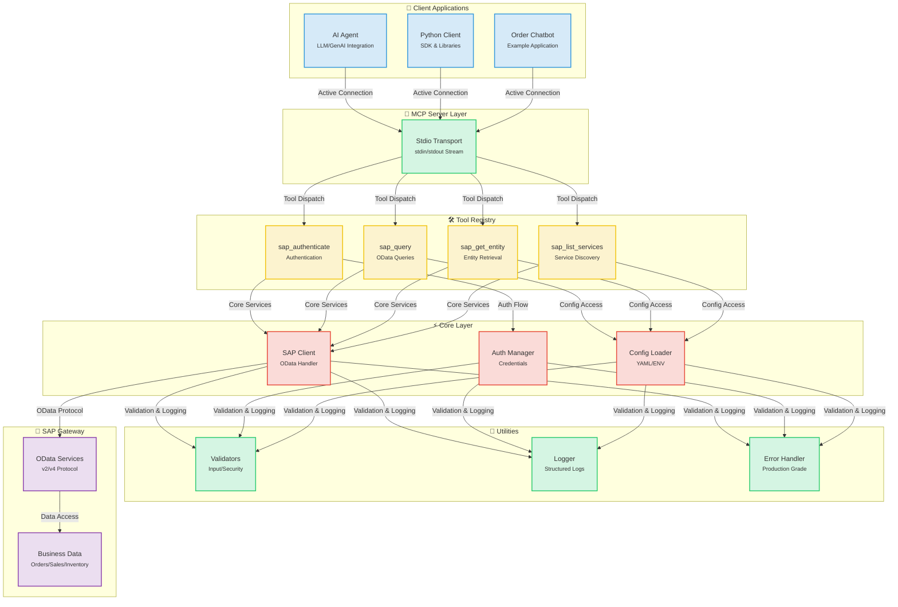
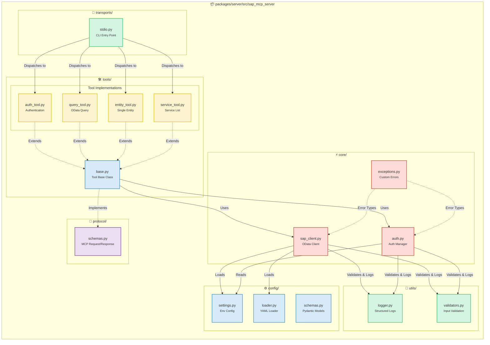
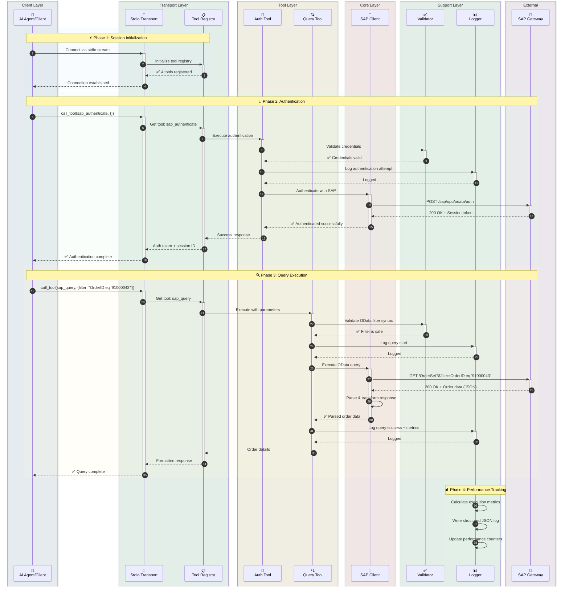
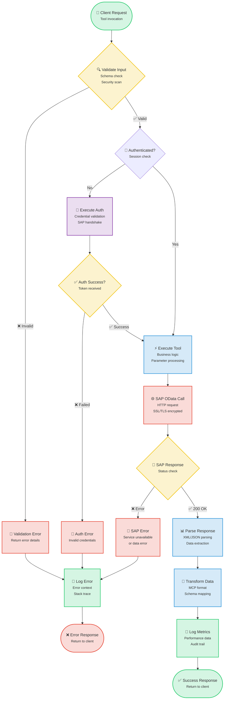
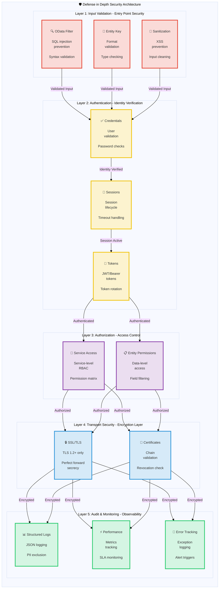

# SAP MCP - Model Context Protocol을 통한 SAP Gateway 통합

AI 에이전트와 애플리케이션이 깔끔한 모듈식 아키텍처를 통해 SAP Gateway 시스템과 상호 작용할 수 있도록 지원하는 프로덕션 등급의 MCP(Model Context Protocol) 서버입니다. 신뢰성, 보안 및 개발자 경험을 위해 구축되었습니다.

<div align="center">

[](https://www.python.org/downloads/)
[](LICENSE)
[]()
[]()
[]()

</div>

---

## 🎯 프로젝트 개요

AI 에이전트와 애플리케이션이 깔끔한 모듈식 아키텍처를 통해 SAP Gateway 시스템과 상호 작용할 수 있도록 지원하는 프로덕션 등급의 MCP(Model Context Protocol) 서버입니다. 신뢰성, 보안 및 개발자 경험을 위해 구축되었습니다.

**현재 상태**: ✅ **프로덕션 준비 완료** (5단계 모두 완료)

### 주요 특징

- 🔐 **안전한 SAP 통합**: 엔터프라이즈급 인증 및 SSL/TLS 지원
- 🛠️ **4가지 모듈식 도구**: 인증, 쿼리, 엔티티 조회, 서비스 검색
- 🚀 **Stdio 전송**: 프로덕션 등급 MCP 서버
- 📊 **구조화된 로깅**: 성능 지표를 포함한 JSON 및 콘솔 형식
- ✅ **검증된 입력**: 포괄적인 OData 및 보안 검증
- 🧪 **철저한 테스트**: 56% 커버리지, 44/45 테스트 통과 (98% 성공률)

---

## 📐 아키텍처

### 시스템 개요

<details>
<summary>📊 시스템 개요 다이어그램 보기 (클릭)</summary>



</details>

### 컴포넌트 상세

<details>
<summary>🔧 컴포넌트 상세 다이어그램 보기 (클릭)</summary>



</details>

### 데이터 흐름: 주문 조회 예시

<details>
<summary>🔄 데이터 흐름 다이어그램 보기 (클릭)</summary>



</details>

### 도구 실행 흐름

<details>
<summary>⚡ 도구 실행 흐름 다이어그램 보기 (클릭)</summary>



</details>

### 보안 아키텍처

<details>
<summary>🔒 보안 아키텍처 다이어그램 보기 (클릭)</summary>



</details>

---

## 📦 저장소 구조

```
sap-mcp/
├── packages/
│   └── server/                          ✅ Production-Ready MCP Server
│       ├── src/sap_mcp_server/
│       │   ├── core/                    # SAP client & auth (4 files)
│       │   │   ├── __init__.py          # Module initialization
│       │   │   ├── sap_client.py        # OData operations
│       │   │   ├── auth.py              # Credential management
│       │   │   └── exceptions.py        # Custom exceptions
│       │   ├── config/                  # Configuration (4 files)
│       │   │   ├── __init__.py          # Module initialization
│       │   │   ├── settings.py          # Environment config
│       │   │   ├── loader.py            # YAML loader
│       │   │   └── schemas.py           # Pydantic models
│       │   ├── protocol/                # MCP protocol (2 files)
│       │   │   ├── __init__.py          # Module initialization
│       │   │   └── schemas.py           # Request/Response schemas
│       │   ├── tools/                   # 4 modular SAP tools (6 files)
│       │   │   ├── __init__.py          # Tool registry
│       │   │   ├── base.py              # Tool base class
│       │   │   ├── auth_tool.py         # Authentication
│       │   │   ├── query_tool.py        # OData queries
│       │   │   ├── entity_tool.py       # Entity retrieval
│       │   │   └── service_tool.py      # Service discovery
│       │   ├── transports/              # Transport layer (2 files)
│       │   │   ├── __init__.py          # Module initialization
│       │   │   └── stdio.py             # Stdio transport ✅
│       │   ├── utils/                   # Utilities (3 files)
│       │   │   ├── __init__.py          # Module initialization
│       │   │   ├── logger.py            # Structured logging
│       │   │   └── validators.py        # Input validation
│       │   └── __init__.py              # Package initialization
│       ├── config/                      # Server configuration
│       │   ├── services.yaml            # SAP services config
│       │   └── services.yaml.example    # Configuration template
│       ├── tests/                       # Test suite (7 files, 56% coverage)
│       │   ├── __init__.py              # Test package initialization
│       │   ├── conftest.py              # Pytest fixtures
│       │   ├── unit/                    # Unit tests
│       │   │   ├── __init__.py          # Unit test package
│       │   │   ├── test_base.py         # Base tool tests
│       │   │   └── test_validators.py   # Validator tests
│       │   └── integration/             # Integration tests
│       │       ├── __init__.py          # Integration test package
│       │       └── test_tool_integration.py  # Tool integration tests
│       ├── pyproject.toml               # Package configuration
│       └── README.md                    # Server package documentation
│
├── docs/                                # Documentation
│   ├── architecture/                    # Architecture documentation
│   │   └── server.md                    # Server architecture
│   └── guides/                          # User guides
│       ├── configuration.md             # Configuration guide
│       ├── deployment.md                # Deployment guide
│       ├── troubleshooting.md           # Troubleshooting guide
│       ├── odata-service-creation-flight-demo.md  # OData service creation
│       └── sfight-demo-guide.md         # SFLIGHT demo guide
│
├── examples/                            # Example applications
│   ├── basic/                           # Basic examples
│   │   └── stdio_client.py              # Stdio client example
│   ├── chatbot/                         # Chatbot examples
│   │   └── order_inquiry_chatbot.py     # Order inquiry chatbot
│   └── README.md                        # Examples documentation
│
├── scripts/                             # Development scripts
│   ├── create_structure.sh              # Project structure creation
│   ├── migrate_code.sh                  # Code migration script
│   └── update_imports.py                # Import update script
│
├── .claude/                             # Claude Code configuration
│   └── settings.local.json              # Local settings
│
├── .env.server.example                  # Environment template
├── .gitignore                           # Git ignore rules
├── README.md                            # Main documentation (English)
├── README.ja.md                         # Japanese documentation
├── README.ko.md                         # Korean documentation
├── README.th.md                         # Thai documentation
├── README.zh-TW.md                      # Traditional Chinese documentation
└── README.zh-CN.md                      # Simplified Chinese documentation
```

---

## ✨ 기능

### 핵심 기능

<table>
<tr>
<td width="50%">

#### 🛠️ 도구
- ✅ **sap_authenticate**: 안전한 SAP 인증
- ✅ **sap_query**: 필터가 있는 OData 쿼리
- ✅ **sap_get_entity**: 단일 엔티티 조회
- ✅ **sap_list_services**: 서비스 검색

</td>
<td width="50%">

#### 🚀 전송
- ✅ **Stdio**: 프로덕션 등급 stdin/stdout

</td>
</tr>
<tr>
<td>

#### 📊 로깅 및 모니터링
- ✅ **구조화된 로깅**: JSON + 콘솔
- ✅ **성능 지표**: 요청 타이밍
- ✅ **오류 추적**: 전체 컨텍스트
- ✅ **감사 추적**: 보안 이벤트

</td>
<td>

#### 🔒 보안
- ✅ **입력 검증**: OData 및 보안
- ✅ **SSL/TLS 지원**: 안전한 연결
- ✅ **자격 증명 관리**: .env.server
- ✅ **오류 처리**: 프로덕션 등급

</td>
</tr>
</table>

### 개발자 경험

- ✅ **모듈식 아키텍처**: 파일당 하나의 도구
- ✅ **타입 안전성**: 전체 타입 힌트
- ✅ **문서화**: 포괄적인 가이드
- ✅ **쉬운 설정**: `pip install -e .`
- ✅ **핫 리로드**: 개발 모드
- ✅ **예제 앱**: 3개의 작동 예제

---

## 📋 Preparation

### Prerequisites for MCP Server

#### 시스템 요구 사항

- **Python 3.11 이상**
- **pip** (Python 패키지 설치 관리자)
- **Git** (저장소 복제용)
- SAP Gateway 액세스 자격 증명
- 가상 환경 지원

#### Python 설치

<details>
<summary><b>🪟 Windows</b></summary>

**옵션 1: Microsoft Store (Windows 10/11 권장)**
```powershell
# Microsoft Store에서 "Python 3.11" 또는 "Python 3.12" 검색
# 또는 python.org에서 다운로드
```

**옵션 2: Python.org 설치 관리자**
1. [python.org/downloads](https://www.python.org/downloads/)에서 다운로드
2. 설치 관리자 실행
3. ✅ **"Add Python to PATH" 체크**
4. "Install Now" 클릭

**설치 확인:**
```powershell
python --version
# 표시되어야 함: Python 3.11.x or higher

pip --version
# 표시되어야 함: pip 23.x.x or higher
```

**일반적인 문제:**
- `python` 명령을 찾을 수 없는 경우 `python3` 또는 `py` 시도
- `pip`를 찾을 수 없는 경우 설치: `python -m ensurepip --upgrade`

</details>

<details>
<summary><b>🍎 macOS</b></summary>

**옵션 1: Homebrew (권장)**
```bash
# Homebrew가 설치되지 않은 경우 설치
/bin/bash -c "$(curl -fsSL https://raw.githubusercontent.com/Homebrew/install/HEAD/install.sh)"

# Python 설치
brew install python@3.11
# 또는
brew install python@3.12
```

**옵션 2: Python.org 설치 관리자**
1. [python.org/downloads/macos](https://www.python.org/downloads/macos/)에서 다운로드
2. `.pkg` 파일 열기
3. 설치 마법사 따르기

**설치 확인:**
```bash
python3 --version
# 표시되어야 함: Python 3.11.x or higher

pip3 --version
# 표시되어야 함: pip 23.x.x or higher
```

**참고:** macOS에는 Python 2.7이 사전 설치되어 있을 수 있습니다. 항상 `python3` 및 `pip3` 명령을 사용하십시오.

</details>

<details>
<summary><b>🐧 Linux</b></summary>

**Ubuntu/Debian:**
```bash
# 패키지 목록 업데이트
sudo apt update

# Python 3.11+ 설치
sudo apt install python3.11 python3.11-venv python3-pip

# 또는 최신 Python 설치
sudo apt install python3 python3-venv python3-pip
```

**Fedora/RHEL/CentOS:**
```bash
# Python 3.11+ 설치
sudo dnf install python3.11 python3-pip

# 또는
sudo yum install python3 python3-pip
```

**Arch Linux:**
```bash
sudo pacman -S python python-pip
```

**설치 확인:**
```bash
python3 --version
# 표시되어야 함: Python 3.11.x or higher

pip3 --version
# 표시되어야 함: pip 23.x.x or higher
```

</details>

---

### 1. 설치

#### 단계별 설치

<details open>
<summary><b>🪟 Windows (PowerShell/명령 프롬프트)</b></summary>

```powershell
# 저장소 복제
git clone <repository-url>
cd sap-mcp

# 가상 환경 생성
python -m venv .venv

# 가상 환경 활성화
.venv\Scripts\activate
# 또는 PowerShell에서:
# .venv\Scripts\Activate.ps1

# PowerShell에서 실행 정책 오류가 발생하는 경우:
# Set-ExecutionPolicy -ExecutionPolicy RemoteSigned -Scope CurrentUser

# 활성화 확인 (프롬프트에 (.venv)가 표시되어야 함)
# (.venv) PS C:\path\to\sap-mcp>

# 서버 패키지 설치
cd packages\server
pip install -e .

# 개발 의존성 설치 (선택 사항)
pip install -e ".[dev]"

# 설치 확인
sap-mcp-server-stdio --help
```

**Windows 일반적인 문제:**
- **`python`을 찾을 수 없음**: `python3` 또는 `py` 시도
- **액세스 거부됨**: PowerShell을 관리자 권한으로 실행
- **실행 정책**: `Set-ExecutionPolicy -ExecutionPolicy RemoteSigned -Scope CurrentUser` 실행
- **긴 경로 지원**: Windows에서 긴 경로 활성화 (설정 > 시스템 > 정보 > 고급 시스템 설정)

</details>

<details>
<summary><b>🍎 macOS (터미널)</b></summary>

```bash
# 저장소 복제
git clone <repository-url>
cd sap-mcp

# 가상 환경 생성
python3 -m venv .venv

# 가상 환경 활성화
source .venv/bin/activate

# 활성화 확인 (프롬프트에 (.venv)가 표시되어야 함)
# (.venv) user@macbook sap-mcp %

# 서버 패키지 설치
cd packages/server
pip install -e .

# 개발 의존성 설치 (선택 사항)
pip install -e ".[dev]"

# 설치 확인
sap-mcp-server-stdio --help

# 설치 경로 확인 (Gemini CLI 설정에 유용)
which sap-mcp-server-stdio
# 예시 출력: /Users/username/sap-mcp/.venv/bin/sap-mcp-server-stdio
```

**macOS 일반적인 문제:**
- **`python`을 찾을 수 없음**: 대신 `python3` 사용
- **`pip`를 찾을 수 없음**: 대신 `pip3` 사용
- **액세스 거부됨**: 가상 환경에서 `sudo`를 사용하지 마십시오
- **설치 후 명령을 찾을 수 없음**: 가상 환경이 활성화되었는지 확인하십시오

</details>

<details>
<summary><b>🐧 Linux (Bash/Zsh)</b></summary>

```bash
# 저장소 복제
git clone <repository-url>
cd sap-mcp

# 가상 환경 생성
python3 -m venv .venv

# 가상 환경 활성화
source .venv/bin/activate

# 활성화 확인 (프롬프트에 (.venv)가 표시되어야 함)
# (.venv) user@linux:~/sap-mcp$

# 서버 패키지 설치
cd packages/server
pip install -e .

# 개발 의존성 설치 (선택 사항)
pip install -e ".[dev]"

# 설치 확인
sap-mcp-server-stdio --help

# 설치 경로 확인 (Gemini CLI 설정에 유용)
which sap-mcp-server-stdio
# 예시 출력: /home/username/sap-mcp/.venv/bin/sap-mcp-server-stdio
```

**Linux 일반적인 문제:**
- **`python3-venv`를 찾을 수 없음**: `sudo apt install python3-venv`로 설치
- **액세스 거부됨**: 가상 환경에서 `sudo`를 사용하지 마십시오
- **SSL 오류**: 인증서 설치: `sudo apt install ca-certificates`
- **빌드 의존성 누락**: `sudo apt install build-essential python3-dev`로 설치

</details>

---

### 2. 구성

SAP MCP 서버에는 두 개의 구성 파일이 필요합니다:
1. **`.env.server`**: SAP 연결 자격 증명 (단일 SAP 시스템)
2. **`services.yaml`**: SAP Gateway 서비스 및 인증 설정

#### 2.1. SAP 연결 구성 (`.env.server`)

> **⚠️ 중요**: v0.2.0부터 `.env.server`가 **프로젝트 루트 디렉토리**로 통합되었습니다. 이전 `packages/server/.env.server` 위치는 더 이상 지원되지 않습니다.

**파일 위치**: `.env.server`는 반드시 **프로젝트 루트 디렉토리**에 있어야 합니다.

```
sap-mcp/
├── .env.server              ← 구성 파일 (유일한 위치 - 여기에 생성)
├── .env.server.example      ← 예제 템플릿
├── packages/
├── server/
└── README.md
```

**설정 단계**:

<details open>
<summary><b>🪟 Windows (PowerShell/명령 프롬프트)</b></summary>

```powershell
# 프로젝트 루트로 이동
cd C:\path\to\sap-mcp

# 환경 템플릿 복사
copy .env.server.example .env.server

# 메모장으로 구성 편집 및 SAP 자격 증명 입력
notepad .env.server

# 또는 선호하는 편집기 사용:
# code .env.server (VS Code)
# notepad++ .env.server (Notepad++)

# 참고: Windows에서는 파일 권한이 다르게 관리됩니다
# 파일이 공용 폴더에 없는지 확인하십시오
# .env.server 우클릭 > 속성 > 보안에서 액세스 제한
```

**Windows 관련 참고 사항:**
- Windows 경로에는 백슬래시(`\`) 사용
- PowerShell 실행 정책이 스크립트를 차단할 수 있음 (설치 섹션 참조)
- `.env.server`를 액세스가 제한된 사용자 폴더에 저장
- 바이러스 백신이 파일을 차단하는 경우 Windows Defender 제외 사용

</details>

<details>
<summary><b>🍎 macOS (터미널)</b></summary>

```bash
# 프로젝트 루트로 이동
cd /path/to/your/sap-mcp

# 환경 템플릿 복사
cp .env.server.example .env.server

# 구성 편집 및 SAP 자격 증명 입력
nano .env.server
# 또는 선호하는 편집기 사용:
# vim .env.server
# code .env.server (VS Code)
# open -a TextEdit .env.server

# 적절한 권한 설정 (보안 권장)
chmod 600 .env.server

# 권한 확인
ls -la .env.server
# 표시되어야 함: -rw------- (소유자만 읽기/쓰기 가능)
```

**macOS 관련 참고 사항:**
- 파일 권한은 Unix 기반 (Linux와 동일)
- `chmod 600`은 사용자만 파일을 읽고 쓸 수 있도록 보장
- macOS는 처음 액세스할 때 추가 보안 프롬프트가 표시될 수 있음
- 최상의 보안을 위해 홈 디렉토리에 저장

</details>

<details>
<summary><b>🐧 Linux (Bash/Zsh)</b></summary>

```bash
# 프로젝트 루트로 이동
cd /path/to/your/sap-mcp

# 환경 템플릿 복사
cp .env.server.example .env.server

# 구성 편집 및 SAP 자격 증명 입력
nano .env.server
# 또는 선호하는 편집기 사용:
# vim .env.server
# code .env.server (VS Code)
# gedit .env.server (GNOME)

# 적절한 권한 설정 (보안 필수)
chmod 600 .env.server

# 권한 확인
ls -la .env.server
# 표시되어야 함: -rw------- (소유자만 읽기/쓰기 가능)

# 선택 사항: 파일이 전체 읽기 가능이 아닌지 확인
stat .env.server
```

**Linux 관련 참고 사항:**
- `chmod 600`은 보안에 중요 (소유자만 액세스 가능)
- SELinux/AppArmor에 추가 구성이 필요할 수 있음
- 파일은 서버를 실행하는 사용자가 소유해야 함
- 이 파일을 편집하거나 실행할 때 절대 `sudo`를 사용하지 마십시오

</details>

#### 2.2. 서비스 구성 (`services.yaml`)

`services.yaml` 파일은 SAP Gateway 서비스와 해당 인증 설정을 정의합니다.

**파일 위치**: `packages/server/config/services.yaml`

```yaml
# packages/server/config/services.yaml 예시

services:
  # 서비스 1: 비즈니스 파트너 (기본 인증)
  - name: "API_BUSINESS_PARTNER"
    path: "/sap/opu/odata/sap/API_BUSINESS_PARTNER"
    auth_config:
      auth_type: "basic"    # 사용자 이름/비밀번호 인증
      sap_client: "100"     # SAP 클라이언트 ID

  # 서비스 2: 판매 주문 (인증 없음/공개)
  - name: "API_SALES_ORDER_SRV"
    path: "/sap/opu/odata/sap/API_SALES_ORDER_SRV"
    auth_config:
      auth_type: "none"     # 인증 필요 없음

  # 서비스 3: 제품 마스터 (사용자 지정 클라이언트)
  - name: "API_PRODUCT_SRV"
    path: "/sap/opu/odata/sap/API_PRODUCT_SRV"
    auth_config:
      auth_type: "basic"
      sap_client: "200"     # 다른 클라이언트 ID
```

**구성 옵션:**
- `name`: 서비스의 고유 식별자 (도구 호출에 사용됨)
- `path`: SAP Gateway의 OData 서비스 경로
- `auth_config`:
  - `auth_type`: `basic` (사용자/비번) 또는 `none` (공개)
  - `sap_client`: (선택 사항) SAP 클라이언트 ID (예: 100, 200). 기본값은 `.env.server`의 설정입니다.

---

### 3. Gemini CLI 통합

Google Gemini CLI와 함께 SAP MCP 서버를 사용하여 AI 에이전트 기능을 활성화하십시오.

#### 구성 파일 (`gemini_config.yml`)

프로젝트 루트에 `gemini_config.yml` 파일을 생성하거나 업데이트하십시오:

<details open>
<summary><b>🪟 Windows (PowerShell)</b></summary>

```yaml
# gemini_config.yml
mcpServers:
  sap-mcp:
    command: "uv"
    args:
      - "run"
      - "--directory"
      - "C:\\path\\to\\sap-mcp\\packages\\server" # 절대 경로 사용
      - "sap-mcp-server-stdio"
    env:
      PYTHONPATH: "C:\\path\\to\\sap-mcp\\packages\\server\\src"
```

</details>

<details>
<summary><b>🍎 macOS / 🐧 Linux</b></summary>

```yaml
# gemini_config.yml
mcpServers:
  sap-mcp:
    command: "uv"
    args:
      - "run"
      - "--directory"
      - "/Users/username/sap-mcp/packages/server" # 절대 경로 사용
      - "sap-mcp-server-stdio"
    env:
      PYTHONPATH: "/Users/username/sap-mcp/packages/server/src"
```

</details>

**참고:** `uv`를 사용하지 않는 경우 `command`를 `python` 또는 `python3`로 변경하고 `args`를 조정하여 스크립트를 직접 실행하십시오. 하지만 의존성 관리를 위해 `uv`를 권장합니다.

---

### 4. 사용법

#### 사용 가능한 도구

| 도구 이름 | 설명 | 필수 매개변수 |
|-----------|-------------|---------------------|
| `sap_authenticate` | SAP Gateway 세션 설정 | 없음 (env의 자격 증명 사용) |
| `sap_query` | OData 쿼리 실행 (필터링, 선택) | `service_name`, `entity_set` |
| `sap_get_entity` | 키로 단일 엔티티 조회 | `service_name`, `entity_set`, `keys` |
| `sap_list_services` | 사용 가능한 SAP 서비스 나열 | 없음 |

#### 예시: AI 에이전트 프롬프트

Gemini CLI가 실행 중일 때 다음과 같이 자연어로 요청할 수 있습니다:

> "SAP에 로그인해서 비즈니스 파트너 목록을 보여줘."

> "주문 번호 1000의 상세 정보를 찾아줘."

> "제품 서비스에서 가격이 500 이상인 제품을 검색해줘."

#### 예시: Python 클라이언트

`examples/basic/stdio_client.py`를 참조하여 Python 코드에서 직접 MCP 서버와 통신하는 방법을 확인하십시오.

```python
# 클라이언트 초기화 및 연결
async with StdioServerParameters(command="...", args=[...]) as params:
    async with stdio_client(params) as (read, write):
        async with ClientSession(read, write) as session:
            # 1. 초기화
            await session.initialize()

            # 2. 도구 목록 조회
            tools = await session.list_tools()

            # 3. 인증 도구 호출
            await session.call_tool("sap_authenticate", {})

            # 4. 쿼리 도구 호출
            result = await session.call_tool("sap_query", {
                "service_name": "API_BUSINESS_PARTNER",
                "entity_set": "A_BusinessPartner",
                "top": 5
            })
```

---


---

## 📄 라이선스

이 프로젝트는 MIT 라이선스에 따라 라이선스가 부여됩니다 - 자세한 내용은 [LICENSE](LICENSE) 파일을 참조하십시오.

## 🙏 감사의 말

- [Model Context Protocol](https://modelcontextprotocol.io/) - 개방형 표준
- [SAP OData](https://www.sap.com/products/technology-platform/odata.html) - 표준 프로토콜