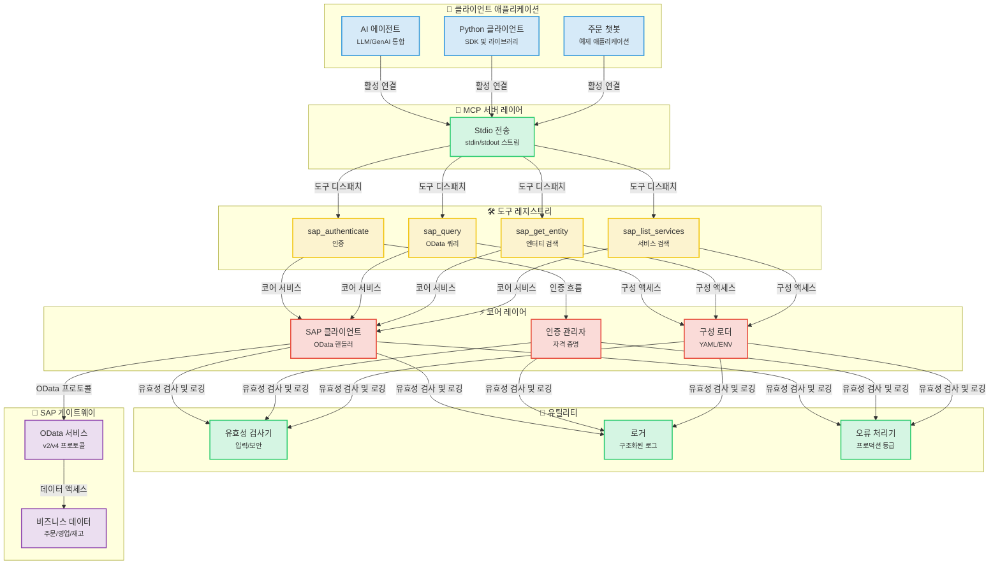
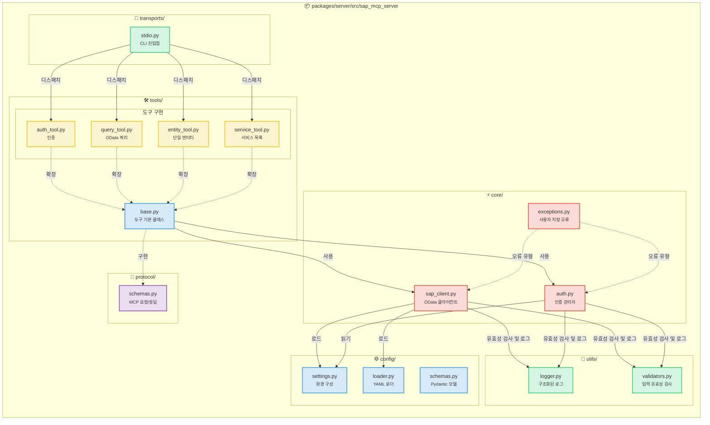
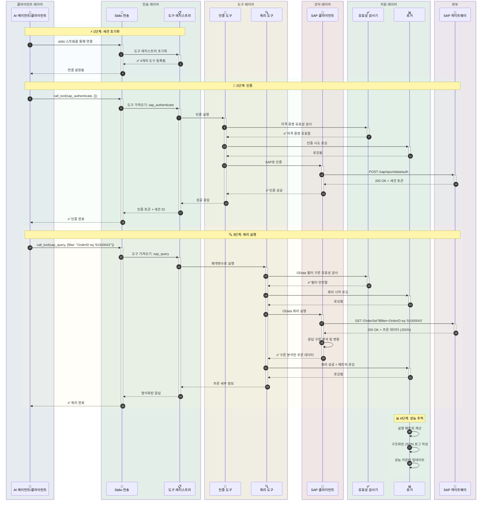
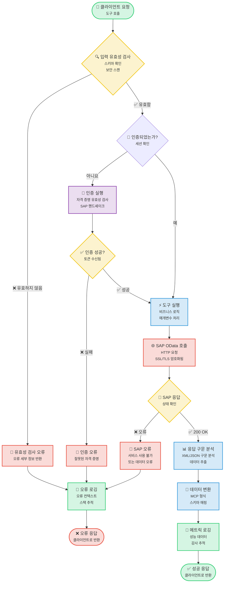
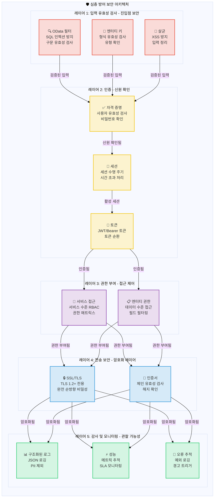

# SAP MCP - 모델 컨텍스트 프로토콜을 통한 SAP 게이트웨이 통합

AI 에이전트를 위한 SAP OData 작업을 위한 모듈식 도구를 제공하는 SAP 게이트웨이 통합을 위한 완전한 MCP 서버입니다.

<div align="center">

[](https://www.python.org/downloads/)
[](LICENSE)
[]()
[]()
[]()

</div>

---

## 🎯 프로젝트 개요

AI 에이전트 및 애플리케이션이 깔끔하고 모듈화된 아키텍처를 통해 SAP 게이트웨이 시스템과 상호 작용할 수 있도록 하는 프로덕션 준비가 완료된 MCP(모델 컨텍스트 프로토콜) 서버입니다. 신뢰성, 보안 및 개발자 경험을 위해 구축되었습니다.

**현재 상태**: ✅ **프로덕션 준비 완료** (5단계 모두 완료)

### 주요 특징

- 🔐 **안전한 SAP 통합**: 엔터프라이즈급 인증 및 SSL/TLS 지원
- 🛠️ **4개의 모듈식 도구**: 인증, 쿼리, 엔터티 검색, 서비스 검색
- 🚀 **Stdio 전송**: 프로덕션 준비가 완료된 MCP 서버
- 📊 **구조화된 로깅**: 성능 메트릭을 포함한 JSON 및 콘솔 형식
- ✅ **검증된 입력**: 포괄적인 OData 및 보안 유효성 검사
- 🧪 **충분한 테스트**: 56%의 커버리지, 44/45 테스트 통과 (98% 성공률)

---

## 📐 아키텍처

### 시스템 개요



### 구성 요소 세부 정보



### 데이터 흐름: 주문 조회 예제



### 도구 실행 흐름



### 보안 아키텍처



---

## 📦 리포지토리 구조

```
sap-mcp/
├── packages/
│   └── server/                          ✅ 프로덕션 준비 완료된 MCP 서버
│       ├── src/sap_mcp_server/
│       │   ├── core/                    # SAP 클라이언트 및 인증 (3개 파일)
│       │   │   ├── sap_client.py        # OData 작업
│       │   │   ├── auth.py              # 자격 증명 관리
│       │   │   └── exceptions.py        # 사용자 지정 예외
│       │   ├── config/                  # 구성 (4개 파일)
│       │   │   ├── settings.py          # 환경 구성
│       │   │   ├── loader.py            # YAML 로더
│       │   │   └── schemas.py           # Pydantic 모델
│       │   ├── protocol/                # MCP 프로토콜 (2개 파일)
│       │   │   └── schemas.py           # 요청/응답 스키마
│       │   ├── tools/                   # 4개의 모듈식 SAP 도구
│       │   │   ├── base.py              # 도구 기본 클래스
│       │   │   ├── auth_tool.py         # 인증
│       │   │   ├── query_tool.py        # OData 쿼리
│       │   │   ├── entity_tool.py       # 엔터티 검색
│       │   │   └── service_tool.py      # 서비스 검색
│       │   ├── transports/              # 전송 레이어
│       │   │   └── stdio.py             # Stdio 전송 ✅
│       │   └── utils/                   # 유틸리티 (3개 파일)
│       │       ├── logger.py            # 구조화된 로깅
│       │       └── validators.py        # 입력 유효성 검사
│       ├── config/                      # 서버 구성
│       │   ├── services.yaml            # SAP 서비스 구성
│       │   └── services.yaml.example    # 구성 템플릿
│       ├── tests/                       # 45개 테스트 (56% 커버리지)
│       │   ├── conftest.py              # 8개 픽스처
│       │   ├── unit/                    # 빠른 격리 테스트
│       │   └── integration/             # 통합 테스트
│       └── pyproject.toml               # 패키지 구성
│
├── docs/                                # 문서
│   ├── guides/                          # 사용자 가이드
│   └── api/                             # API 참조
├── scripts/                             # 개발 스크립트
├── .env.server                          # 서버 구성
├── .env.server.example                  # 구성 템플릿
└── README.md                            # 이 파일
```

---

## ✨ 기능

### 핵심 기능

<table>
<tr>
<td width="50%">

#### 🛠️ 도구
- ✅ **sap_authenticate**: 안전한 SAP 인증
- ✅ **sap_query**: 필터가 있는 OData 쿼리
- ✅ **sap_get_entity**: 단일 엔터티 검색
- ✅ **sap_list_services**: 서비스 검색

</td>
<td width="50%">

#### 🚀 전송
- ✅ **Stdio**: 프로덕션 준비 완료된 stdin/stdout

</td>
</tr>
<tr>
<td>

#### 📊 로깅 및 모니터링
- ✅ **구조화된 로깅**: JSON + 콘솔
- ✅ **성능 메트릭**: 요청 타이밍
- ✅ **오류 추적**: 전체 컨텍스트
- ✅ **감사 추적**: 보안 이벤트

</td>
<td>

#### 🔒 보안
- ✅ **입력 유효성 검사**: OData 및 보안
- ✅ **SSL/TLS 지원**: 안전한 연결
- ✅ **자격 증명 관리**: .env.server
- ✅ **오류 처리**: 프로덕션 등급

</td>
</tr>
</table>

### 품질 및 테스트

| 메트릭 | 값 | 상태 |
|--------|-------|--------|
| **테스트 커버리지** | 56% | 🟡 좋음 |
| **테스트 통과** | 44/45 (98%) | 🟢 우수 |
| **테스트 속도** | <0.2초 | 🟢 빠름 |
| **픽스처** | 8개 종합 | 🟢 완료 |
| **테스트 카테고리** | 단위 + 통합 | 🟢 완료 |

### 개발자 경험

- ✅ **모듈식 아키텍처**: 파일당 하나의 도구
- ✅ **타입 안전성**: 전체 타입 힌트
- ✅ **문서**: 포괄적인 가이드
- ✅ **쉬운 설정**: `pip install -e .`
- ✅ **핫 리로드**: 개발 모드
- ✅ **예제 앱**: 3개의 작동 예제

---

## 🚀 빠른 시작

### 사전 요구 사항

#### 시스템 요구 사항

- **Python 3.11 이상**
- **pip** (Python 패키지 설치 프로그램)
- **Git** (리포지토리 복제용)
- SAP 게이트웨이 액세스 자격 증명
- 가상 환경 지원

#### Python 설치

<details>
<summary><b>🪟 Windows</b></summary>

**옵션 1: Microsoft Store (Windows 10/11 권장)**
```powershell
# Microsoft Store에서 "Python 3.11" 또는 "Python 3.12" 검색
# 또는 python.org에서 다운로드
```

**옵션 2: Python.org 설치 프로그램**
1. [python.org/downloads](https://www.python.org/downloads/)에서 다운로드
2. 설치 프로그램 실행
3. ✅ **"Add Python to PATH" 선택**
4. "Install Now" 클릭

**설치 확인:**
```powershell
python --version
# Python 3.11.x 이상이어야 함

pip --version
# pip 23.x.x 이상이어야 함
```

**일반적인 문제:**
- `python` 명령을 찾을 수 없는 경우 `python3` 또는 `py` 사용
- `pip`를 찾을 수 없는 경우 `python -m ensurepip --upgrade`로 설치

</details>

<details>
<summary><b>🍎 macOS</b></summary>

**옵션 1: Homebrew (권장)**
```bash
# Homebrew가 설치되지 않은 경우 설치
/bin/bash -c "$(curl -fsSL https://raw.githubusercontent.com/Homebrew/install/HEAD/install.sh)"

# Python 설치
brew install python@3.11
# 또는
brew install python@3.12
```

**옵션 2: Python.org 설치 프로그램**
1. [python.org/downloads/macos](https://www.python.org/downloads/macos/)에서 다운로드
2. `.pkg` 파일 열기
3. 설치 마법사 따르기

**설치 확인:**
```bash
python3 --version
# Python 3.11.x 이상이어야 함

pip3 --version
# pip 23.x.x 이상이어야 함
```

**참고:** macOS에는 Python 2.7이 사전 설치되어 있을 수 있습니다. 항상 `python3` 및 `pip3` 명령을 사용하십시오.

</details>

<details>
<summary><b>🐧 Linux</b></summary>

**Ubuntu/Debian:**
```bash
# 패키지 목록 업데이트
sudo apt update

# Python 3.11+ 설치
sudo apt install python3.11 python3.11-venv python3-pip

# 또는 최신 Python의 경우
sudo apt install python3 python3-venv python3-pip
```

**Fedora/RHEL/CentOS:**
```bash
# Python 3.11+ 설치
sudo dnf install python3.11 python3-pip

# 또는
sudo yum install python3 python3-pip
```

**Arch Linux:**
```bash
sudo pacman -S python python-pip
```

**설치 확인:**
```bash
python3 --version
# Python 3.11.x 이상이어야 함

pip3 --version
# pip 23.x.x 이상이어야 함
```

</details>

---

### 1. 설치

#### 단계별 설치

<details open>
<summary><b>🪟 Windows (PowerShell/명령 프롬프트)</b></summary>

```powershell
# 리포지토리 복제
git clone <repository-url>
cd sap-mcp

# 가상 환경 생성
python -m venv .venv

# 가상 환경 활성화
.venv\Scripts\activate
# 또는 PowerShell에서:
# .venv\Scripts\Activate.ps1

# PowerShell에서 실행 정책 오류가 발생하는 경우:
# Set-ExecutionPolicy -ExecutionPolicy RemoteSigned -Scope CurrentUser

# 활성화 확인 (프롬프트에 (.venv)가 표시되어야 함)
# (.venv) PS C:\path\to\sap-mcp>

# 서버 패키지 설치
cd packages\server
pip install -e .

# 개발 종속성 설치 (선택 사항)
pip install -e ".[dev]"

# 설치 확인
sap-mcp-server-stdio --help
```

**Windows 일반적인 문제:**
- **`python`을 찾을 수 없음**: `python3` 또는 `py` 시도
- **권한 거부**: PowerShell을 관리자 권한으로 실행
- **실행 정책**: `Set-ExecutionPolicy -ExecutionPolicy RemoteSigned -Scope CurrentUser` 실행
- **긴 경로 지원**: Windows에서 긴 경로 지원 활성화 (설정 > 시스템 > 정보 > 고급 시스템 설정)

</details>

<details>
<summary><b>🍎 macOS (터미널)</b></summary>

```bash
# 리포지토리 복제
git clone <repository-url>
cd sap-mcp

# 가상 환경 생성
python3 -m venv .venv

# 가상 환경 활성화
source .venv/bin/activate

# 활성화 확인 (프롬프트에 (.venv)가 표시되어야 함)
# (.venv) user@macbook sap-mcp %

# 서버 패키지 설치
cd packages/server
pip install -e .

# 개발 종속성 설치 (선택 사항)
pip install -e ".[dev]"

# 설치 확인
sap-mcp-server-stdio --help

# 설치 경로 확인 (Gemini CLI 설정에 유용)
which sap-mcp-server-stdio
# 예제 출력: /Users/username/sap-mcp/.venv/bin/sap-mcp-server-stdio
```

**macOS 일반적인 문제:**
- **`python`을 찾을 수 없음**: 대신 `python3` 사용
- **`pip`를 찾을 수 없음**: 대신 `pip3` 사용
- **권한 거부**: 가상 환경에서 `sudo` 사용 안 함
- **설치 후 명령을 찾을 수 없음**: 가상 환경이 활성화되었는지 확인

</details>

<details>
<summary><b>🐧 Linux (Bash/Zsh)</b></summary>

```bash
# 리포지토리 복제
git clone <repository-url>
cd sap-mcp

# 가상 환경 생성
python3 -m venv .venv

# 가상 환경 활성화
source .venv/bin/activate

# 활성화 확인 (프롬프트에 (.venv)가 표시되어야 함)
# (.venv) user@linux:~/sap-mcp$

# 서버 패키지 설치
cd packages/server
pip install -e .

# 개발 종속성 설치 (선택 사항)
pip install -e ".[dev]"

# 설치 확인
sap-mcp-server-stdio --help

# 설치 경로 확인 (Gemini CLI 설정에 유용)
which sap-mcp-server-stdio
# 예제 출력: /home/username/sap-mcp/.venv/bin/sap-mcp-server-stdio
```

**Linux 일반적인 문제:**
- **`python3-venv`를 찾을 수 없음**: `sudo apt install python3-venv`로 설치
- **권한 거부**: 가상 환경에서 `sudo` 사용 안 함
- **SSL 오류**: `sudo apt install ca-certificates`로 인증서 설치
- **빌드 종속성 누락**: `sudo apt install build-essential python3-dev`로 설치

</details>

---

### 2. 구성

SAP MCP 서버에는 두 개의 구성 파일이 필요합니다:
1. **`.env.server`**: SAP 연결 자격 증명 (하나의 SAP 시스템)
2. **`services.yaml`**: SAP 게이트웨이 서비스 및 인증 설정

#### 2.1. SAP 연결 구성 (`.env.server`)

> **⚠️ 중요**: v0.2.0부터 `.env.server`는 **프로젝트 루트 디렉터리**로 통합되었습니다. 이전의 `packages/server/.env.server` 위치는 더 이상 지원되지 않습니다.

**파일 위치**: `.env.server`는 **프로젝트 루트 디렉터리**에 있어야 합니다.

```
sap-mcp/
├── .env.server              ← 구성 파일 (유일한 위치 - 여기에 생성)
├── .env.server.example      ← 예제 템플릿
├── packages/
│   └── server/
└── README.md
```

**설정 단계**:

<details open>
<summary><b>🪟 Windows (PowerShell/명령 프롬프트)</b></summary>

```powershell
# 프로젝트 루트로 이동
cd C:\path\to\sap-mcp

# 환경 템플릿 복사
copy .env.server.example .env.server

# 메모장으로 SAP 자격 증명으로 구성 편집
notepad .env.server

# 또는 선호하는 편집기 사용:
# code .env.server (VS Code)
# notepad++ .env.server (Notepad++)

# 참고: Windows에서는 파일 권한이 다르게 관리됩니다
# 파일이 공용 폴더에 있지 않은지 확인
# .env.server 마우스 오른쪽 버튼 클릭 > 속성 > 보안으로 액세스 제한
```

**Windows 관련 참고 사항:**
- Windows에서는 경로에 백슬래시(`\`) 사용
- PowerShell 실행 정책으로 인해 스크립트가 차단될 수 있음 (설치 섹션 참조)
- `.env.server`를 접근이 제한된 사용자 폴더에 저장
- 바이러스 백신이 파일을 차단하는 경우 Windows Defender 예외 사용

</details>

<details>
<summary><b>🍎 macOS (터미널)</b></summary>

```bash
# 프로젝트 루트로 이동
cd /path/to/sap-mcp

# 환경 템플릿 복사
cp .env.server.example .env.server

# SAP 자격 증명으로 구성 편집
nano .env.server
# 또는 선호하는 편집기 사용:
# vim .env.server
# code .env.server (VS Code)
# open -a TextEdit .env.server

# 적절한 권한 설정 (보안 권장)
chmod 600 .env.server

# 권한 확인
ls -la .env.server
# -rw------- (소유자만 읽기/쓰기 가능)가 표시되어야 함
```

**macOS 관련 참고 사항:**
- 파일 권한은 Unix 기반 (Linux와 동일)
- `chmod 600`은 사용자만 파일을 읽고 쓸 수 있도록 보장
- macOS는 최초 액세스 시 추가 보안 프롬프트를 표시할 수 있음
- 최상의 보안을 위해 홈 디렉터리에 저장

</details>

<details>
<summary><b>🐧 Linux (Bash/Zsh)</b></summary>

```bash
# 프로젝트 루트로 이동
cd /path/to/sap-mcp

# 환경 템플릿 복사
cp .env.server.example .env.server

# SAP 자격 증명으로 구성 편집
nano .env.server
# 또는 선호하는 편집기 사용:
# vim .env.server
# code .env.server (VS Code)
# gedit .env.server (GNOME)

# 적절한 권한 설정 (보안 필수)
chmod 600 .env.server

# 권한 확인
ls -la .env.server
# -rw------- (소유자만 읽기/쓰기 가능)가 표시되어야 함

# 선택 사항: 파일이 전역적으로 읽을 수 없는지 확인
stat .env.server
```

**Linux 관련 참고 사항:**
- `chmod 600`은 보안에 중요 (소유자만 액세스 가능)
- SELinux/AppArmor는 추가 구성이 필요할 수 있음
- 파일은 서버를 실행하는 사용자가 소유해야 함
- 이 파일로 편집하거나 실행할 때 `sudo`를 사용하지 마십시오

</details>

---

**필수 환경 변수**:
```bash
# SAP 시스템 연결 (단일 SAP 시스템)
SAP_HOST=your-sap-host.com          # SAP 게이트웨이 호스트 이름
SAP_PORT=443                         # HTTPS 포트 (일반적으로 443 또는 8443)
SAP_USERNAME=your-username           # SAP 사용자 ID
SAP_PASSWORD=your-password           # SAP 비밀번호
SAP_CLIENT=100                       # SAP 클라이언트 번호 (예: 100, 800)

# 보안 설정
SAP_VERIFY_SSL=true                  # SSL 인증서 확인 활성화 (권장)
SAP_TIMEOUT=30                       # 요청 시간 초과(초)

# 선택 사항: 연결 풀링
SAP_MAX_CONNECTIONS=10               # 최대 동시 연결 수 (선택 사항)
SAP_RETRY_ATTEMPTS=3                 # 실패 시 재시도 횟수 (선택 사항)
```

**보안 모범 사례**:
- ✅ `.env.server`를 버전 제어에 커밋하지 마십시오 (`.gitignore`에 이미 있음)
- ✅ 강력하고 고유한 비밀번호 사용
- ✅ 프로덕션에서 SSL 확인 활성화 (`SAP_VERIFY_SSL=true`)
- ✅ 파일 권한 제한: `chmod 600 .env.server`

#### 2.2. SAP 게이트웨이 서비스 구성 (`services.yaml`)

MCP 서버가 액세스할 수 있는 SAP 게이트웨이 서비스(OData 서비스)를 구성합니다.

**위치**: `packages/server/config/services.yaml`

```bash
# 예제 구성 복사
cp packages/server/config/services.yaml.example packages/server/config/services.yaml

# 서비스 구성 편집
vim packages/server/config/services.yaml
```

**기본 구성 예제**:

```yaml
# 게이트웨이 URL 구성
gateway:
  # OData 서비스의 기본 URL 패턴
  base_url_pattern: "https://{host}:{port}/sap/opu/odata"

  # 메타데이터 엔드포인트 접미사
  metadata_suffix: "/$metadata"

  # 서비스 카탈로그 경로
  service_catalog_path: "/sap/opu/odata/IWFND/CATALOGSERVICE;v=2/ServiceCollection"

  # 인증 엔드포인트 구성
  auth_endpoint:
    # 권장: 카탈로그 메타데이터 사용 (특정 서비스 없이 작동)
    use_catalog_metadata: true

    # 선택 사항: 인증에 특정 서비스 사용 (카탈로그를 사용할 수 없는 경우)
    # use_catalog_metadata: false
    # service_id: Z_SALES_ORDER_GENAI_SRV
    # entity_name: zsd004Set

# SAP OData 서비스
services:
  # 예제: 판매 주문 서비스
  - id: Z_SALES_ORDER_GENAI_SRV          # 고유 서비스 식별자
    name: "Sales Order GenAI Service"     # 사람이 읽을 수 있는 이름
    path: "/SAP/Z_SALES_ORDER_GENAI_SRV"  # 서비스 경로
    version: v2                            # OData 버전 (v2 또는 v4)
    description: "판매 주문 관리 서비스"

    # 이 서비스의 엔터티 집합
    entities:
      - name: zsd004Set                    # 엔터티 집합 이름
        key_field: Vbeln                   # 기본 키 필드
        description: "판매 주문"
        default_select:                    # 기본적으로 선택할 필드
          - Vbeln      # 판매 주문 번호
          - Erdat      # 생성 날짜
          - Ernam      # 생성자
          - Netwr      # 순 가치
          - Waerk      # 통화

    # 선택 사항: 이 서비스의 사용자 지정 헤더
    custom_headers: {}
```

**여러 서비스 추가**:

```yaml
services:
  # 판매 주문 서비스
  - id: Z_SALES_ORDER_GENAI_SRV
    name: "Sales Order Service"
    path: "/SAP/Z_SALES_ORDER_GENAI_SRV"
    version: v2
    entities:
      - name: zsd004Set
        key_field: Vbeln
        description: "판매 주문"

  # 고객 마스터 서비스
  - id: Z_CUSTOMER_SRV
    name: "Customer Master Service"
    path: "/SAP/Z_CUSTOMER_SRV"
    version: v2
    entities:
      - name: CustomerSet
        key_field: Kunnr
        description: "고객 마스터 레코드"
        default_select:
          - Kunnr      # 고객 번호
          - Name1      # 이름
          - Land1      # 국가

  # 자재 마스터 서비스
  - id: Z_MATERIAL_SRV
    name: "Material Master Service"
    path: "/SAP/Z_MATERIAL_SRV"
    version: v2
    entities:
      - name: MaterialSet
        key_field: Matnr
        description: "자재 마스터"
```

#### 2.3. 인증 엔드포인트 옵션

`auth_endpoint` 구성은 MCP 서버가 SAP와 인증하는 방법을 제어합니다.

**옵션 1: 카탈로그 메타데이터 (권장)**

```yaml
gateway:
  auth_endpoint:
    use_catalog_metadata: true
```

**장점**:
- ✅ 특정 SAP 게이트웨이 서비스 없이 작동
- ✅ SAP 시스템 간에 더 유연하고 이식 가능
- ✅ 서비스 독립적인 인증
- ✅ 사용자 지정 서비스 배포에 대한 종속성 없음

**인증 흐름**:
- CSRF 토큰: `/sap/opu/odata/IWFND/CATALOGSERVICE;v=2/ServiceCollection`
- 유효성 검사: `/sap/opu/odata/IWFND/CATALOGSERVICE;v=2/$metadata`

---

**옵션 2: 서비스별 인증**

```yaml
gateway:
  auth_endpoint:
    use_catalog_metadata: false
    service_id: Z_SALES_ORDER_GENAI_SRV    # 아래 서비스 ID와 일치해야 함
    entity_name: zsd004Set                  # 해당 서비스의 엔터티여야 함
```

**장점**:
- ✅ 명시적인 서비스 기반 인증
- ✅ 카탈로그 서비스를 사용할 수 없을 때 작동 (드묾)

**단점**:
- ❌ 지정된 서비스가 배포되어야 함
- ❌ 서비스가 변경되면 유연성이 떨어짐
- ❌ 서비스 이름이 변경되면 구성을 업데이트해야 함

**인증 흐름**:
- CSRF 토큰: `/SAP/Z_SALES_ORDER_GENAI_SRV/zsd004Set`
- 유효성 검사: `/sap/opu/odata/IWFND/CATALOGSERVICE;v=2/$metadata`

---

**권장 사항**: 인증에 특정 서비스를 사용해야 하는 특별한 이유가 없는 한 **옵션 1(카탈로그 메타데이터)**을 사용하십시오.

### 3. 서버 실행

<details open>
<summary><b>🪟 Windows (PowerShell/명령 프롬프트)</b></summary>

```powershell
# 가상 환경 활성화
.venv\Scripts\activate
# 또는 PowerShell에서:
# .venv\Scripts\Activate.ps1

# stdio 서버 실행 (권장)
sap-mcp-server-stdio

# 또는 Python으로 직접 실행
python -m sap_mcp_server.transports.stdio

# 완료 시 비활성화
deactivate
```

**Windows 관련 참고 사항:**
- 경로에 백슬래시(`\`) 사용
- PowerShell은 실행 정책 변경이 필요할 수 있음
- 서버는 현재 터미널 창에서 실행됨
- `Ctrl+C`를 눌러 서버 중지

</details>

<details>
<summary><b>🍎 macOS (터미널)</b></summary>

```bash
# 가상 환경 활성화
source .venv/bin/activate

# stdio 서버 실행 (권장)
sap-mcp-server-stdio

# 또는 Python으로 직접 실행
python3 -m sap_mcp_server.transports.stdio

# 완료 시 비활성화
deactivate
```

**macOS 관련 참고 사항:**
- `python` 대신 `python3` 사용
- 서버는 현재 터미널 세션에서 실행됨
- `Cmd+C` 또는 `Ctrl+C`를 눌러 서버 중지
- 서버가 실행되는 동안 터미널을 열어 두어야 함

</details>

<details>
<summary><b>🐧 Linux (Bash/Zsh)</b></summary>

```bash
# 가상 환경 활성화
source .venv/bin/activate

# stdio 서버 실행 (권장)
sap-mcp-server-stdio

# 또는 Python으로 직접 실행
python3 -m sap_mcp_server.transports.stdio

# 완료 시 비활성화
deactivate
```

**Linux 관련 참고 사항:**
- `python` 대신 `python3` 사용
- 서버는 현재 터미널 세션에서 실행됨
- `Ctrl+C`를 눌러 서버 중지
- `nohup` 또는 `systemd` 서비스로 백그라운드에서 실행 가능

</details>

---

### 4. 설치 확인

```bash
# 테스트 실행
cd packages/server
python -m pytest -v

# 커버리지 보고서 포함
python -m pytest --cov=sap_mcp_server --cov-report=term-missing

# 특정 테스트 카테고리
python -m pytest -m unit          # 단위 테스트만
python -m pytest -m integration   # 통합 테스트만
```

---

## 🤖 Gemini CLI와 통합

> **📖 공식 문서**: Gemini CLI에 대한 자세한 내용은 <a href="https://geminicli.com/" target="_blank">https://geminicli.com/</a>를 방문하십시오.

### 사전 요구 사항

- Node.js 18+ 및 npm 설치
- SAP MCP 서버 설치 (위의 빠른 시작 참조)
- Gemini API 액세스를 위한 Google 계정

### 1. Gemini CLI 설치

```bash
# Gemini CLI 전역 설치
npm install -g @google/gemini-cli

# 설치 확인
gemini --version
```

### 2. Gemini CLI 인증

**옵션 A: Gemini API 키 사용 (시작 권장)**

1. [Google AI Studio](https://aistudio.google.com/apikey)에서 API 키 받기
2. 환경 변수 설정:

```bash
export GEMINI_API_KEY="your-api-key-here"
```

**옵션 B: Google Cloud 사용 (프로덕션용)**

```bash
# 먼저 Google Cloud CLI 설치
gcloud auth application-default login

# 프로젝트 설정
export GOOGLE_CLOUD_PROJECT="your-project-id"
export GOOGLE_CLOUD_LOCATION="us-central1"
```

### 3. SAP MCP 서버 등록

**방법 A: 절대 경로 사용 (가상 환경 권장)**

가상 환경에 서버를 설치한 경우 실행 파일의 절대 경로를 사용하십시오:

1. **절대 경로 찾기**:
```bash
# SAP MCP 디렉터리로 이동
cd /path/to/sap-mcp

# 절대 경로 가져오기
pwd
# 예제 출력: /Users/sanggyulee/my-project/python-project/sap-mcp
```

2. **`~/.gemini/settings.json` 편집**:
```json
{
  "mcpServers": {
    "sap-server": {
      "command": "/Users/sanggyulee/my-project/python-project/sap-mcp/.venv/bin/sap-mcp-server-stdio",
      "cwd": "/Users/sanggyulee/my-project/python-project/sap-mcp",
      "description": "OData 통합을 위한 SAP 게이트웨이 MCP 서버",
      "timeout": 30000,
      "trust": false
    }
  }
}
```

**`/Users/sanggyulee/my-project/python-project/sap-mcp`를 실제 프로젝트 경로로 바꾸십시오.**

> **📝 참고**: `cwd`(현재 작업 디렉터리) 매개변수는 `.env.server` 파일 검색에 **필수**입니다. 서버가 구성 파일이 있는 프로젝트 루트 디렉터리에서 실행되도록 보장합니다.

3. **경로 확인**:
```bash
# 명령이 작동하는지 테스트
/path/to/your/sap-mcp/.venv/bin/sap-mcp-server-stdio --help

# 등록 확인
gemini mcp list
# 예상: ✓ sap-server: ... (stdio) - 연결됨
```

---

**방법 B: CLI 명령 사용 (전역적으로 설치된 경우)**

`sap-mcp-server-stdio`가 시스템 PATH에 있는 경우:

```bash
# 서버 등록
gemini mcp add sap-server sap-mcp-server-stdio

# 등록 확인
gemini mcp list
```

**참고**: 이 방법은 가상 환경을 PATH에 추가했거나 패키지를 전역적으로 설치한 경우에만 작동합니다.

---

**방법 C: Python 모듈 경로 사용**

Python 모듈을 사용하는 대체 방법:

```json
{
  "mcpServers": {
    "sap-server": {
      "command": "/path/to/sap-mcp/.venv/bin/python",
      "args": ["-m", "sap_mcp_server.transports.stdio"],
      "cwd": "/path/to/sap-mcp/packages/server",
      "description": "SAP 게이트웨이 MCP 서버",
      "timeout": 30000,
      "trust": false
    }
  }
}
```

### 4. SAP MCP와 Gemini CLI 사용 시작

```bash
# Gemini CLI 시작
gemini

# MCP 서버 상태 확인
> /mcp

# 사용 가능한 SAP 도구 보기
> /mcp desc

# 예제: SAP 주문 조회
> SAP 도구를 사용하여 인증하고 주문 번호 91000043을 조회하십시오.

# 예제: 사용 가능한 SAP 서비스 목록 보기
> 어떤 SAP 서비스를 사용할 수 있습니까?

# 예제: 고객 세부 정보 가져오기
> SAP에서 고객 CUST001의 세부 정보를 검색하십시오.
```

### 고급 구성

**신뢰할 수 있는 서버에 대한 자동 승인 활성화**

```json
{
  "mcpServers": {
    "sap-server": {
      "command": "/path/to/sap-mcp/.venv/bin/sap-mcp-server-stdio",
      "trust": true,
      "timeout": 30000
    }
  }
}
```

**참고**: 각 도구 호출에 대한 승인 프롬프트를 건너뛰려면 `"trust": true`로 설정하십시오. 신뢰할 수 있는 서버에 대해서만 활성화하십시오.

---

**특정 도구 필터링**

```json
{
  "mcpServers": {
    "sap-server": {
      "command": "/path/to/sap-mcp/.venv/bin/sap-mcp-server-stdio",
      "includeTools": ["sap_authenticate", "sap_query"],
      "excludeTools": ["sap_list_services"],
      "timeout": 30000
    }
  }
}
```

**사용 사례**:
- `includeTools`: 특정 도구만 허용 (화이트리스트)
- `excludeTools`: 특정 도구 차단 (블랙리스트)
- 동시에 둘 다 사용할 수 없음

---

**환경 변수 추가 (선택 사항)**

```json
{
  "mcpServers": {
    "sap-server": {
      "command": "/path/to/sap-mcp/.venv/bin/sap-mcp-server-stdio",
      "env": {
        "SAP_HOST": "${SAP_HOST}",
        "SAP_USERNAME": "${SAP_USERNAME}",
        "SAP_PASSWORD": "${SAP_PASSWORD}"
      },
      "timeout": 30000
    }
  }
}
```

**참고**: `settings.json`의 환경 변수는 `.env.server`의 값을 덮어씁니다. 보안상의 이유로 권장되지 않으며 대신 `.env.server` 파일을 사용하는 것이 좋습니다.

---

**느린 네트워크에 대한 시간 초과 늘리기**

```json
{
  "mcpServers": {
    "sap-server": {
      "command": "/path/to/sap-mcp/.venv/bin/sap-mcp-server-stdio",
      "timeout": 60000,  // 60초 (기본값: 30000)
      "trust": false
    }
  }
}
```

**늘려야 할 때**:
- 느린 네트워크 연결
- 대용량 데이터 쿼리
- 복잡한 SAP 작업
- 빈번한 시간 초과 오류

### 문제 해결

**문제: 서버가 "연결 끊김" 상태를 표시함**

```bash
# MCP 서버 상태 확인
gemini mcp list
# ✗ sap-server: sap-mcp-server-stdio (stdio) - 연결 끊김이 표시되는 경우
```

**해결책 1: 절대 경로 사용 (가장 일반적)**

명령이 가상 환경에 있을 가능성이 높습니다. `~/.gemini/settings.json`을 업데이트하십시오:

```json
{
  "mcpServers": {
    "sap-server": {
      "command": "/full/path/to/sap-mcp/.venv/bin/sap-mcp-server-stdio",
      "description": "SAP 게이트웨이 MCP 서버",
      "timeout": 30000,
      "trust": false
    }
  }
}
```

**절대 경로 찾기**:
```bash
# SAP MCP 디렉터리로 이동
cd /path/to/sap-mcp

# 전체 경로 가져오기
pwd
# 예제: /Users/sanggyulee/my-project/python-project/sap-mcp

# 명령이 있는지 확인
ls -la .venv/bin/sap-mcp-server-stdio
```

---

**문제: PATH에서 명령을 찾을 수 없음**

```bash
# 서버 직접 테스트
sap-mcp-server-stdio
# 오류: 명령을 찾을 수 없음

# 명령이 있는지 확인
which sap-mcp-server-stdio
# 반환: 명령을 찾을 수 없음
```

**해결책 2: 가상 환경 확인**

```bash
# 가상 환경이 있는지 확인
ls -la .venv/bin/sap-mcp-server-stdio

# 있는 경우 settings.json에서 절대 경로 사용
# 없는 경우 다시 설치:
cd packages/server
pip install -e .
```

---

**문제: 인증 오류 또는 `.env.server`를 찾을 수 없음**

```bash
# .env.server가 PROJECT ROOT에 있는지 확인 (packages/server/ 아님)
cat .env.server

# 필수 필드:
# SAP_HOST=your-host
# SAP_PORT=443
# SAP_USERNAME=your-username
# SAP_PASSWORD=your-password
# SAP_CLIENT=100
```

**해결책 3: 파일 위치 및 자격 증명 확인**

```bash
# 1. .env.server가 프로젝트 루트에 있는지 확인
ls -la .env.server
# /path/to/sap-mcp/.env.server에 있어야 함

# 2. Gemini CLI settings.json에 "cwd" 매개변수가 있는지 확인
cat ~/.gemini/settings.json
# "cwd": "/path/to/sap-mcp"가 포함되어야 함

# 3. 수동으로 인증 테스트
source .venv/bin/activate
python -c "from sap_mcp_server.config.settings import get_connection_config; print(get_connection_config())"
```

**일반적인 문제**:

1. **"필수 필드" 오류**: `.env.server`가 로드되지 않음. 확인:
   - 파일이 프로젝트 루트에 있음: `/path/to/sap-mcp/.env.server`
   - Gemini CLI `settings.json`에 올바른 `cwd` 매개변수가 있음
   - 파일에 적절한 권한이 있음: `chmod 600 .env.server`

2. **401 Unauthorized 오류**: v0.2.1 (2025-01-22)에서 수정됨
   - **이전 문제**: SAP 게이트웨이가 `sap-client` 매개변수 없이 요청을 거부함
   - **현재 상태**: 자동으로 처리됨 - 모든 요청에 `sap-client` 매개변수 포함
   - **확인**: v0.2.1 이상으로 업데이트했는지 확인
   - **수동 확인**: 유효한 자격 증명으로 인증이 성공해야 함

---

**문제: 서버를 다시 등록해야 함**

```bash
# 기존 서버 구성 제거
rm ~/.gemini/settings.json

# 또는 수동으로 편집하여 sap-server 항목 제거
```

**해결책 4: 깨끗한 재등록**

```bash
# 방법 1: 설정 직접 편집
vim ~/.gemini/settings.json

# 방법 2: 절대 경로 사용 (권장)
# 위 3절의 "방법 A: 절대 경로 사용" 따르기
```

---

**빠른 진단 단계**

1. **서버 실행 파일 확인**:
```bash
/path/to/sap-mcp/.venv/bin/sap-mcp-server-stdio --help
# 서버 시작 메시지가 표시되어야 함
```

2. **Gemini CLI 설정 확인**:
```bash
cat ~/.gemini/settings.json | grep -A 5 "sap-server"
# "command" 경로가 올바른지 확인
```

3. **연결 테스트**:
```bash
gemini mcp list
# ✓ sap-server: ... - 연결됨이 표시되어야 함
```

4. **Gemini CLI에서 테스트**:
```bash
gemini
> /mcp
> /mcp desc
# SAP 도구 목록이 표시되어야 함
```

### Gemini CLI에서 사용 가능한 SAP 도구

등록되면 자연어를 통해 다음 SAP 도구를 사용할 수 있습니다:

| 도구 | 설명 | 예제 프롬프트 |
|------|-------------|----------------|
| **sap_authenticate** | SAP 게이트웨이로 인증 | "SAP로 인증" |
| **sap_query** | OData 필터로 SAP 엔터티 조회 | "고객 CUST001의 모든 주문 조회" |
| **sap_get_entity** | 키로 특정 엔터티 검색 | "주문 91000043의 세부 정보 가져오기" |
| **sap_list_services** | 사용 가능한 SAP 서비스 목록 보기 | "어떤 SAP 서비스를 사용할 수 있습니까?" |

### 예제 워크플로

**1. 주문 조회 워크플로**

```bash
gemini

> SAP에 연결하고 지난 주에 고객 CUST001이 주문한 모든 주문을 찾으십시오.
# Gemini는 다음을 수행합니다:
# 1. sap_authenticate 호출
# 2. 적절한 필터로 sap_query 호출
# 3. 결과 형식화 및 제시
```

**2. 고객 분석**

```bash
> SAP 데이터를 사용하여 주문량 기준 상위 5명의 고객을 분석하십시오.
# Gemini는 다음을 수행합니다:
# 1. 인증
# 2. 고객 주문 조회
# 3. 데이터 집계 및 분석
# 4. 통찰력 제시
```

**3. 서비스 검색**

```bash
> 시스템에서 어떤 SAP 서비스 및 엔터티 집합을 사용할 수 있습니까?
# Gemini는 다음을 수행합니다:
# 1. sap_list_services 호출
# 2. 서비스 카탈로그 형식화
```

---

## 🔧 사용 가능한 도구

### 1. SAP 인증

`.env.server`의 자격 증명을 사용하여 SAP 게이트웨이 시스템으로 인증합니다.

**요청**:
```json
{
  "name": "sap_authenticate",
  "arguments": {}
}
```

**응답**:
```json
{
  "success": true,
  "session_id": "abc123...",
  "message": "SAP로 성공적으로 인증되었습니다"
}
```

---

### 2. SAP 쿼리

OData 필터, 선택, 페이지 매김으로 SAP 엔터티를 조회합니다.

**요청**:
```json
{
  "name": "sap_query",
  "arguments": {
    "service": "Z_SALES_ORDER_GENAI_SRV",
    "entity_set": "zsd004Set",
    "filter": "OrderID eq '91000043'",
    "select": "OrderID,Bstnk,Kunnr,Matnr",
    "top": 10,
    "skip": 0
  }
}
```

**응답**:
```json
{
  "data": {
    "d": {
      "results": [
        {
          "OrderID": "91000043",
          "Bstnk": "PO-2024-001",
          "Kunnr": "CUST001",
          "Matnr": "MAT-12345"
        }
      ]
    }
  },
  "count": 1
}
```

---

### 3. SAP 엔터티 가져오기

키로 특정 엔터티를 검색합니다.

**요청**:
```json
{
  "name": "sap_get_entity",
  "arguments": {
    "service": "Z_SALES_ORDER_GENAI_SRV",
    "entity_set": "zsd004Set",
    "entity_key": "91000043"
  }
}
```

**응답**:
```json
{
  "data": {
    "d": {
      "OrderID": "91000043",
      "Bstnk": "PO-2024-001",
      "Kunnr": "CUST001",
      "Matnr": "MAT-12345",
      "Wmeng": "100",
      "Vkorg": "1000"
    }
  }
}
```

---

### 4. SAP 서비스 목록

구성에서 사용 가능한 모든 SAP 서비스 목록을 표시합니다.

**요청**:
```json
{
  "name": "sap_list_services",
  "arguments": {}
}
```

**응답**:
```json
{
  "services": [
    {
      "name": "Z_SALES_ORDER_GENAI_SRV",
      "description": "GenAI용 판매 주문 서비스",
      "entity_sets": ["zsd004Set", "OrderHeaderSet"]
    }
  ],
  "count": 1
}
```

---

## 📚 사용 예제

### 도구 레지스트리 사용

```python
from sap_mcp_server.tools import tool_registry
from sap_mcp_server.protocol.schemas import ToolCallRequest

# 사용 가능한 도구 목록
tools = tool_registry.list_tools()
for tool in tools:
    print(f"- {tool.name}: {tool.description}")

# 도구 호출
request = ToolCallRequest(
    name="sap_list_services",
    arguments={}
)
result = await tool_registry.call_tool(request)
print(result)
```

### MCP 클라이언트 예제

```python
from mcp import StdioServerParameters
from mcp.client.session import ClientSession
from mcp.client.stdio import stdio_client

async def main():
    # MCP 서버에 연결
    server_params = StdioServerParameters(
        command="python",
        args=["-m", "sap_mcp_server.transports.stdio"]
    )

    async with stdio_client(server_params) as (read, write):
        async with ClientSession(read, write) as session:
            # 세션 초기화
            await session.initialize()

            # 인증
            auth_result = await session.call_tool("sap_authenticate", {})

            # 주문 조회
            entity_result = await session.call_tool(
                "sap_get_entity",
                {
                    "service": "Z_SALES_ORDER_GENAI_SRV",
                    "entity_set": "zsd004Set",
                    "entity_key": "91000043"
                }
            )
            print(entity_result)
```

### 구조화된 로깅

```python
from sap_mcp_server.utils.logger import setup_logging, get_logger

# 프로덕션 (JSON 로그)
setup_logging(level="INFO", json_logs=True)

# 개발 (색상 있는 콘솔)
setup_logging(level="DEBUG", json_logs=False)

# 로거 사용
logger = get_logger(__name__)
logger.info("서버 시작됨", port=8080, transport="stdio")
logger.error("쿼리 실패", error=str(e), query=params)
```

### 입력 유효성 검사

```python
from sap_mcp_server.utils.validators import (
    validate_odata_filter,
    validate_entity_key,
    sanitize_input
)

# OData 필터 유효성 검사
if validate_odata_filter("OrderID eq '12345'"):
    # 실행하기에 안전함
    pass

# 사용자 입력 살균
safe_input = sanitize_input(user_data, max_length=1000)

# 엔터티 키 유효성 검사
if validate_entity_key(key):
    # 엔터티 가져오기
    pass
```

---

## 🔒 보안

### 심층 방어

| 레이어 | 구현 | 상태 |
|-------|---------------|--------|
| **입력 유효성 검사** | OData 구문, SQL 인젝션 방지 | ✅ |
| **인증** | 자격 증명 유효성 검사, 세션 관리 | ✅ |
| **권한 부여** | 서비스 접근 제어 | ✅ |
| **전송 보안** | SSL/TLS, 인증서 확인 | ✅ |
| **감사 로깅** | 구조화된 로그, 민감한 데이터 없음 | ✅ |

### 모범 사례

1. **자격 증명**: `.env.server`에 저장하고 git에 커밋하지 마십시오
2. **SSL/TLS**: 프로덕션에서 항상 활성화 (`SAP_VERIFY_SSL=true`)
3. **유효성 검사**: SAP 호출 전에 모든 입력 유효성 검사
4. **로깅**: 로그에서 민감한 데이터 제외
5. **오류 처리**: 클라이언트에 일반 오류 메시지

---

## 🧪 테스트

### 테스트 구조

```
tests/
├── conftest.py              # 8개의 종합 픽스처
├── unit/                    # 빠르고 격리된 테스트 (40개 테스트)
│   ├── test_base.py        # 도구 레지스트리 (16개 테스트)
│   └── test_validators.py  # 유효성 검사기 (24개 테스트)
└── integration/             # 통합 테스트 (5개 테스트)
    └── test_tool_integration.py  # 도구 시스템 테스트
```

### 테스트 실행

```bash
# 자세한 출력으로 모든 테스트 실행
python -m pytest -v

# 커버리지 보고서 포함
python -m pytest --cov=sap_mcp_server --cov-report=term-missing

# HTML 커버리지 보고서
python -m pytest --cov=sap_mcp_server --cov-report=html
open htmlcov/index.html

# 특정 테스트 카테고리
python -m pytest -m unit          # 단위 테스트만
python -m pytest -m integration   # 통합 테스트만
python -m pytest -m sap           # SAP 통합 테스트

# 특정 테스트 파일
python -m pytest tests/unit/test_validators.py -v

# 감시 모드 (pytest-watch 필요)
ptw -- -v
```

### 커버리지 보고서

**현재: 56%** (목표: 70%+)

| 모듈 | 커버리지 | 상태 |
|--------|----------|--------|
| `tools/base.py` | 100% | 🟢 우수 |
| `protocol/schemas.py` | 100% | 🟢 우수 |
| `tools/service_tool.py` | 88% | 🟢 좋음 |
| `config/settings.py` | 82% | 🟢 좋음 |
| `utils/validators.py` | 80% | 🟢 좋음 |
| `core/sap_client.py` | 45% | 🟡 개선 필요 |
| `transports/stdio.py` | 30% | 🟡 개선 필요 |

---

## 🛠️ 개발

### 프로젝트 설정

```bash
# 복제 및 설정
git clone <repository-url>
cd sap-mcp

# 가상 환경 생성
python3 -m venv .venv
source .venv/bin/activate

# 개발 모드로 설치
cd packages/server
pip install -e ".[dev]"
```

### 새 도구 추가

1. **도구 파일 생성**: `packages/server/src/sap_mcp_server/tools/my_tool.py`

```python
from .base import MCPTool

class MyNewTool(MCPTool):
    @property
    def name(self) -> str:
        return "my_new_tool"

    @property
    def description(self) -> str:
        return "내 새 도구에 대한 설명"

    @property
    def input_schema(self) -> dict:
        return {
            "type": "object",
            "properties": {
                "param": {"type": "string"}
            },
            "required": ["param"]
        }

    async def execute(self, params: dict) -> dict:
        # 구현
        return {"result": "success"}
```

2. **도구 등록**: `packages/server/src/sap_mcp_server/tools/__init__.py` 업데이트

```python
from .my_tool import MyNewTool

# 레지스트리에 추가
tool_registry.register(MyNewTool())
```

3. **테스트 추가**: `tests/unit/test_my_tool.py`

```python
import pytest
from sap_mcp_server.tools.my_tool import MyNewTool

@pytest.mark.asyncio
async def test_my_tool():
    tool = MyNewTool()
    result = await tool.execute({"param": "value"})
    assert result["result"] == "success"
```

### 코드 품질

```bash
# 코드 포맷팅
black packages/server/src

# 가져오기 정렬
isort packages/server/src

# 린트
flake8 packages/server/src

# 타입 확인
mypy packages/server/src

# 보안 스캔
bandit -r packages/server/src

# 모든 품질 확인
black . && isort . && flake8 . && mypy . && bandit -r src/
```

---

## 🗺️ 로드맵

### ✅ 완료 (v0.2.0)

- [x] 1단계: 구조 및 코드 마이그레이션
- [x] 2단계: 도구 분할 (4개의 모듈식 도구)
- [x] 3단계: 전송 레이어 (Stdio)
- [x] 4단계: 유틸리티 및 테스트 (56% 커버리지)
- [x] 5단계: 정리 및 문서화

### 📝 계획 (v0.3.0)

**높은 우선순위**:
- [ ] 테스트 커버리지 70%+로 증가
- [ ] 성능 벤치마크
- [ ] API 문서 (Sphinx)

**중간 우선순위**:
- [ ] Docker 배포 가이드
- [ ] Kubernetes 매니페스트
- [ ] Prometheus 메트릭
- [ ] OpenTelemetry 통합

**낮은 우선순위**:
- [ ] 속도 제한
- [ ] 캐싱 레이어
- [ ] GraphQL 지원
- [ ] WebSocket 전송
- [ ] HTTP/REST 전송

---

## 🤝 기여

### 시작하기

1. 리포지토리 포크
2. 기능 브랜치 생성 (`git checkout -b feature/amazing-feature`)
3. 변경 사항 적용 및 테스트 추가
4. 테스트 실행: `python -m pytest -v`
5. 코드 품질 확인 실행: `black . && isort . && flake8 .`
6. 변경 사항 커밋 (`git commit -m '놀라운 기능 추가'`)
7. 브랜치에 푸시 (`git push origin feature/amazing-feature`)
8. 풀 리퀘스트 열기

### 코딩 표준

- **스타일**: PEP 8 스타일 가이드 준수
- **타입**: 모든 함수에 타입 힌트 추가
- **문서**: 포괄적인 독스트링 작성
- **테스트**: 50% 이상의 커버리지 유지
- **커밋**: 관례적인 커밋 메시지 사용

### 풀 리퀘스트 체크리스트

- [ ] 테스트 추가/업데이트 및 통과
- [ ] 문서 업데이트
- [ ] `black`으로 코드 포맷팅
- [ ] `isort`로 가져오기 정렬
- [ ] 타입 힌트 추가
- [ ] 커버리지 유지/개선
- [ ] 변경 로그 업데이트

---

## 📊 프로젝트 메트릭

| 메트릭 | 값 |
|--------|-------|
| **코드 라인 수** | 927 (프로덕션 코드) |
| **테스트 커버리지** | 56% |
| **테스트** | 45 (44개 통과, 98% 성공률) |
| **Python 모듈** | 24 |
| **SAP 도구** | 4 |
| **전송 레이어** | 1 (Stdio) |
| **개발 시간** | ~3시간 (5단계 모두) |
| **Python 버전** | 3.11+ |
| **종속성** | 11개 코어, 9개 개발 |

---

## 📖 문서

- **[서버 패키지 README](./packages/server/README.md)**: 자세한 서버 문서
- **[구성 가이드](./docs/guides/configuration.md)**: YAML 및 환경 설정
- **[배포 가이드](./docs/guides/deployment.md)**: 프로덕션 배포
- **[아키텍처 문서](./docs/architecture/server.md)**: 시스템 아키텍처 세부 정보
- **[API 참조](./docs/api/)**: 도구 및 프로토콜 문서

---

## 📝 라이선스

MIT 라이선스 - 자세한 내용은 [LICENSE](LICENSE) 파일을 참조하십시오.

---

## 🆘 지원

- **문제**: [문제 생성](https://github.com/midasol/SAP-MCP-GCP/issues)
- **문서**: `docs/` 디렉터리 참조
- **서버 패키지**: 구현 세부 정보는 `packages/server/` 참조
- **커뮤니티**: 토론에 참여하십시오

---

## 📜 버전 기록

### v0.2.2 (현재) - 2025-11-10

**문서 업데이트**:
- 📚 **향상된 README**: 포괄적인 OS별(Windows, macOS, Linux) 설치 및 구성 가이드 추가
  - 각 OS에 대한 자세한 Python 설치 지침 추가
  - OS별 가상 환경 설정 및 활성화 명령 추가
  - 적절한 파일 권한이 있는 OS별 `.env.server` 구성 가이드 추가
  - OS별 서버 실행 지침 추가
  - Gemini CLI 공식 문서 링크 추가
- 🔧 **향상된 명확성**: 더 이상 사용되지 않는 파일 경로 참조 제거
- ✨ **더 나은 사용자 경험**: 더 나은 문서 탐색을 위한 접을 수 있는 섹션 추가

### v0.2.1 - 2025-01-22

**버그 수정**:
- 🐛 **중요 수정**: 모든 SAP 게이트웨이 API 요청에 누락된 `sap-client` 매개변수 추가
  - **문제**: 401 Unauthorized 오류로 인증 실패
  - **근본 원인**: SAP 게이트웨이는 요청을 올바른 SAP 클라이언트로 라우팅하기 위해 `sap-client` 매개변수가 필요함
  - **해결책**:
    - CSRF 토큰 및 인증 URL에 `sap-client`를 포함하도록 `auth.py` 수정
    - 모든 API 요청에 `sap-client` 매개변수를 자동으로 삽입하도록 `sap_client.py` 수정
  - **영향**: 모든 SAP 게이트웨이 작업이 이제 올바른 클라이언트 라우팅으로 올바르게 작동함

**기술적 세부 정보**:
- URL에 `?sap-client={client}`를 추가하도록 `SAPAuthenticator._get_csrf_token()` 업데이트
- URL에 `?sap-client={client}`를 추가하도록 `SAPAuthenticator._authenticate_session()` 업데이트
- 요청 매개변수에 `sap-client`를 자동으로 추가하도록 `SAPClient._make_request()` 업데이트
- 구성 변경 필요 없음 - `.env.server`의 기존 `SAP_CLIENT` 사용

### v0.2.0 - 2025-01-15

**주요 기능**:
- ✅ 완전한 모듈식 아키텍처
- ✅ 4개의 프로덕션 준비 완료된 SAP 도구
- ✅ MCP 서버가 있는 Stdio 전송
- ✅ 구조화된 로깅 및 유효성 검사
- ✅ 56% 테스트 커버리지 (45개 테스트)
- ✅ 포괄적인 문서

**개선 사항**:
- 비동기 진입점 문제 수정
- 모듈 경로 업데이트
- 오류 처리 향상
- 보안 유효성 검사 향상

**구성 변경**:
- ⚠️ **호환성 주의**: `.env.server` 파일 위치가 **프로젝트 루트**로만 통합됨
  - 이전 위치 `packages/server/.env.server`는 더 이상 지원되지 않음
  - 우선순위 기반 검색으로 파일 검색 로직 개선
  - 구성 파일 위치에 대한 로깅 향상
- Gemini CLI 통합은 이제 `settings.json`에 `cwd` 매개변수가 필요함
- 구성 문제에 대한 자세한 문제 해결이 포함된 README 업데이트

### v0.1.0 (초기) - 2024-12-01

- 기본 SAP 게이트웨이 통합
- 모놀리식 구조
- 제한된 테스트
- Stdio 서버만

---

## 🙏 감사의 말

- **MCP 프로토콜**: Anthropic의 모델 컨텍스트 프로토콜
- **SAP 게이트웨이**: OData v2/v4 통합
- **커뮤니티**: 기여자 및 테스터

---

<div align="center">

**모델 컨텍스트 프로토콜을 통한 SAP 통합을 위해 ❤️로 제작**

[]()
[]()
[]()

**프로덕션 준비 완료** | **56% 커버리지** | **98% 테스트 성공**

</div>