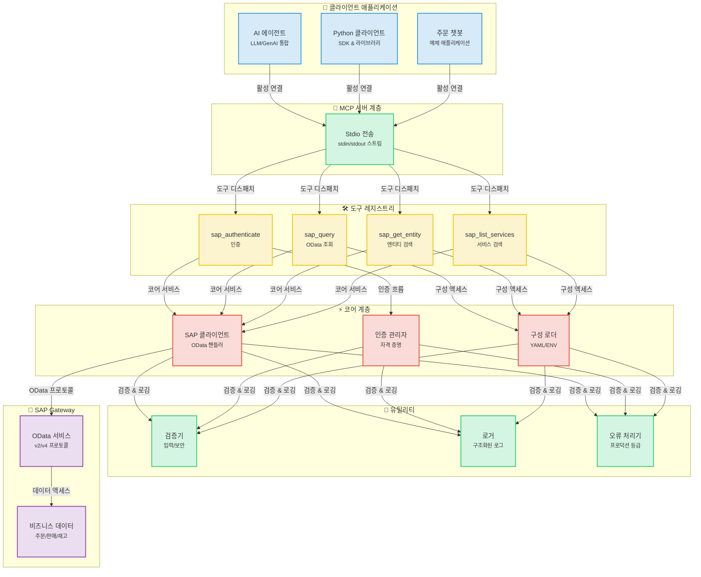
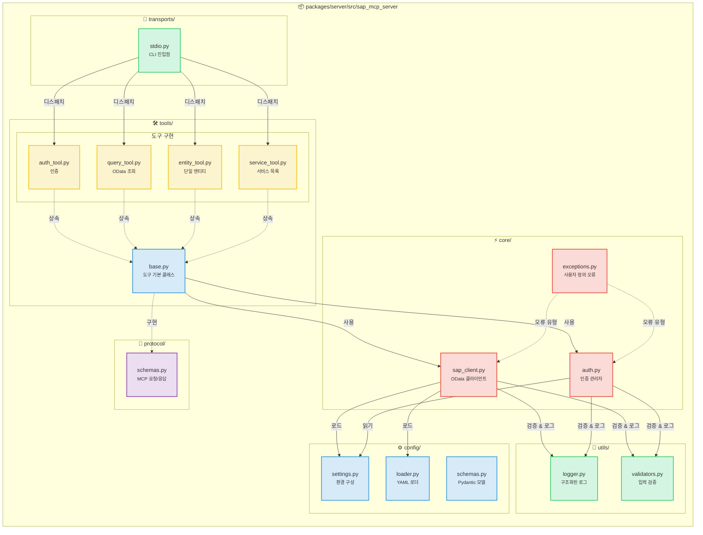
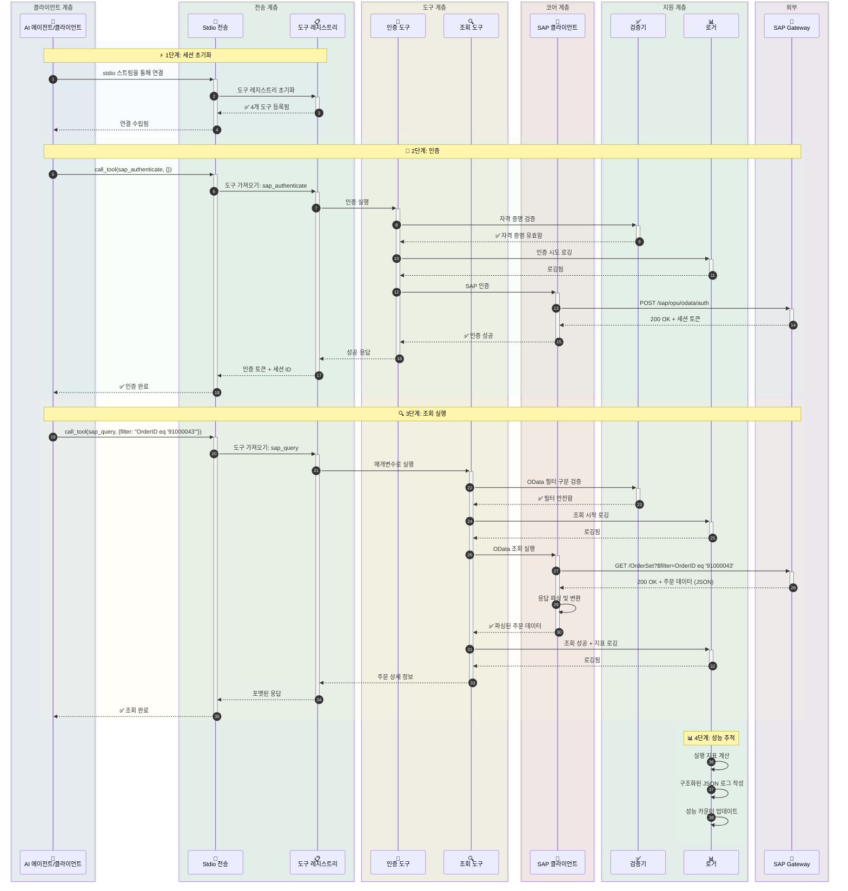
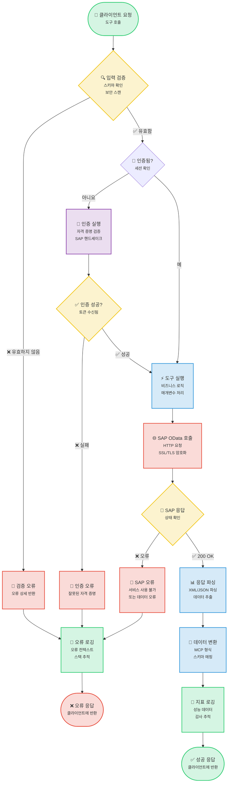
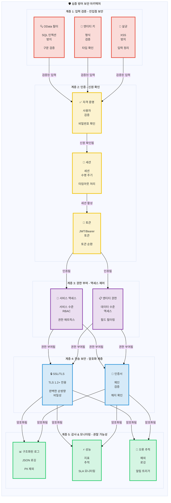

# SAP MCP - 모델 컨텍스트 프로토콜(MCP)을 통한 SAP Gateway 통합

AI 에이전트와 SAP OData 작업을 위한 모듈식 도구를 제공하는 SAP Gateway 통합용 완전한 MCP 서버입니다.

<div align="center">

[](https://www.python.org/downloads/)
[](LICENSE)
[]()
[]()
[]()

</div>

---
## 📑 목차

- [🎯 프로젝트 개요](#-프로젝트-개요)
- [📋 준비 사항](#-준비-사항)
- [📐 아키텍처](#-아키텍처)
  - [시스템 개요](#시스템-개요)
  - [컴포넌트 상세](#컴포넌트-상세)
  - [데이터 흐름](#데이터-흐름-주문-조회-예시)
  - [도구 실행 흐름](#도구-실행-흐름)
  - [보안 아키텍처](#보안-아키텍처)
- [📦 저장소 구조](#-저장소-구조)
- [✨ 주요 기능](#-주요-기능)
- [🎓 SAP SFLIGHT 데모 시나리오](#-sap-sflight-데모-시나리오)
  - [시나리오 개요](#시나리오-개요)
  - [OData 서비스 생성 가이드](#odata-서비스-생성-가이드)
- [🚀 시작하기](#-시작하기)
  - [MCP 서버 필수 조건](#mcp-서버-필수-조건)
  - [설치](#1-설치)
  - [구성](#2-구성)
  - [서버 실행](#3-서버-실행)
- [🤖 Gemini CLI 통합](#-gemini-cli-통합)
  - [필수 조건](#필수-조건)
  - [Gemini CLI 설치](#1-gemini-cli-설치)
  - [Gemini CLI 인증](#2-gemini-cli-인증)
  - [SAP MCP 서버 등록](#3-sap-mcp-서버-등록)
  - [사용 시작](#4-gemini-cli로-sap-mcp-사용-시작)
  - [고급 구성](#고급-구성)
  - [문제 해결](#문제-해결)
  - [사용 가능한 도구](#gemini-cli에서-사용-가능한-sap-도구)
  - [워크플로우 예시](#워크플로우-예시)
- [🔧 사용 가능한 도구](#-사용-가능한-도구)
  - [SAP 인증 (sap_authenticate)](#1-sap-인증-sap_authenticate)
  - [SAP 조회 (sap_query)](#2-sap-조회-sap_query)
  - [SAP 엔티티 가져오기 (sap_get_entity)](#3-sap-엔티티-가져오기-sap_get_entity)
  - [SAP 서비스 목록 (sap_list_services)](#4-sap-서비스-목록-sap_list_services)
  - [새 도구 추가](#5-새-도구-추가)
- [📚 사용 예시](#-사용-예시)
- [🔒 보안](#-보안)
- [📖 문서](#-문서)
- [📝 라이선스](#-라이선스)
- [🙏 감사의 글](#-감사의-글)

---


## 🎯 프로젝트 개요

AI 에이전트와 애플리케이션이 깔끔한 모듈식 아키텍처를 통해 SAP Gateway 시스템과 상호 작용할 수 있도록 지원하는 프로덕션 준비 완료된 MCP(Model Context Protocol) 서버입니다. 신뢰성, 보안 및 개발자 경험을 위해 구축되었습니다.

**현재 상태**: ✅ **프로덕션 준비 완료** (5단계 모두 완료)

### 주요 특징

- 🔐 **안전한 SAP 통합**: 엔터프라이즈급 인증 및 SSL/TLS 지원
- 🛠️ **4가지 모듈식 도구**: 인증, 조회, 엔티티 검색, 서비스 검색
- 🚀 **Stdio 전송**: 프로덕션 준비 완료된 MCP 서버
- 📊 **구조화된 로깅**: 성능 지표가 포함된 JSON 및 콘솔 형식
- ✅ **검증된 입력**: 포괄적인 OData 및 보안 검증
- 🧪 **철저한 테스트**: 56% 커버리지, 44/45 테스트 통과 (98% 성공률)

---

---

## 📋 준비 사항

5분 안에 SAP MCP를 시작하세요:

```bash
# 1. 프로젝트 복제 및 이동
git clone <repository-url>
cd sap-mcp

# 2. 가상 환경 생성 및 설치
python3 -m venv .venv
source .venv/bin/activate  # Windows의 경우: .venv\Scripts\activate
cd packages/server
pip install -e .

# 3. SAP 연결 구성
cd ../..
cp .env.server.example .env.server
# .env.server 파일을 SAP 자격 증명으로 편집

# 4. 서비스 구성
cp packages/server/config/services.yaml.example packages/server/config/services.yaml
# services.yaml 파일을 SAP 서비스로 편집

# 5. 서버 실행
sap-mcp-server-stdio
```

**다음 단계:**
- 📖 자세한 설치 지침은 [시작하기](#-시작하기)를 참조하세요.
- 🤖 AI 에이전트와 연결하려면 [Gemini CLI 통합](#-gemini-cli-통합)을 확인하세요.
- 🔧 API 문서는 [사용 가능한 도구](#-사용-가능한-도구)를 살펴보세요.

## 📐 아키텍처

### 시스템 개요

<details>
<summary>📊 시스템 개요 다이어그램 보기 (클릭)</summary>



</details>

### 컴포넌트 상세

<details>
<summary>🔧 컴포넌트 상세 다이어그램 보기 (클릭)</summary>



</details>

### 데이터 흐름: 주문 조회 예시

<details>
<summary>🔄 데이터 흐름 다이어그램 보기 (클릭)</summary>



</details>

### 도구 실행 흐름

<details>
<summary>⚡ 도구 실행 흐름 다이어그램 보기 (클릭)</summary>



</details>

### 보안 아키텍처

<details>
<summary>🔒 보안 아키텍처 다이어그램 보기 (클릭)</summary>



</details>

---

## 📦 저장소 구조

```
sap-mcp/
├── packages/
│   └── server/                          ✅ 프로덕션 준비 완료된 MCP 서버
│       ├── src/sap_mcp_server/
│       │   ├── core/                    # SAP 클라이언트 & 인증 (4개 파일)
│       │   │   ├── __init__.py          # 모듈 초기화
│       │   │   ├── sap_client.py        # OData 작업
│       │   │   ├── auth.py              # 자격 증명 관리
│       │   │   └── exceptions.py        # 사용자 정의 예외
│       │   ├── config/                  # 구성 (4개 파일)
│       │   │   ├── __init__.py          # 모듈 초기화
│       │   │   ├── settings.py          # 환경 구성
│       │   │   ├── loader.py            # YAML 로더
│       │   │   └── schemas.py           # Pydantic 모델
│       │   ├── protocol/                # MCP 프로토콜 (2개 파일)
│       │   │   ├── __init__.py          # 모듈 초기화
│       │   │   └── schemas.py           # 요청/응답 스키마
│       │   ├── tools/                   # 4가지 모듈식 SAP 도구 (6개 파일)
│       │   │   ├── __init__.py          # 도구 레지스트리
│       │   │   ├── base.py              # 도구 기본 클래스
│       │   │   ├── auth_tool.py         # 인증
│       │   │   ├── query_tool.py        # OData 조회
│       │   │   ├── entity_tool.py       # 엔티티 검색
│       │   │   └── service_tool.py      # 서비스 검색
│       │   ├── transports/              # 전송 계층 (2개 파일)
│       │   │   ├── __init__.py          # 모듈 초기화
│       │   │   └── stdio.py             # Stdio 전송 ✅
│       │   ├── utils/                   # 유틸리티 (3개 파일)
│       │   │   ├── __init__.py          # 모듈 초기화
│       │   │   ├── logger.py            # 구조화된 로깅
│       │   │   └── validators.py        # 입력 검증
│       │   └── __init__.py              # 패키지 초기화
│       ├── config/                      # 서버 구성
│       │   ├── services.yaml            # SAP 서비스 구성
│       │   └── services.yaml.example    # 구성 템플릿
│       ├── tests/                       # 테스트 모음 (7개 파일, 56% 커버리지)
│       │   ├── __init__.py              # 테스트 패키지 초기화
│       │   ├── conftest.py              # Pytest 픽스처
│       │   ├── unit/                    # 단위 테스트
│       │   │   ├── __init__.py          # 단위 테스트 패키지
│       │   │   ├── test_base.py         # 기본 도구 테스트
│       │   │   └── test_validators.py   # 검증기 테스트
│       │   └── integration/             # 통합 테스트
│       │       ├── __init__.py          # 통합 테스트 패키지
│       │       └── test_tool_integration.py  # 도구 통합 테스트
│       ├── pyproject.toml               # 패키지 구성
│       └── README.md                    # 서버 패키지 문서
│
├── docs/                                # 문서
│   ├── architecture/                    # 아키텍처 문서
│   │   └── server.md                    # 서버 아키텍처
│   └── guides/                          # 사용자 가이드
│       ├── configuration.md             # 구성 가이드
│       ├── deployment.md                # 배포 가이드
│       ├── troubleshooting.md           # 문제 해결 가이드
│       ├── odata-service-creation-flight-demo.md  # OData 서비스 생성
│       └── sfight-demo-guide.md         # SFLIGHT 데모 가이드
│
├── examples/                            # 예제 애플리케이션
│   ├── basic/                           # 기본 예제
│   │   └── stdio_client.py              # Stdio 클라이언트 예제
│   ├── chatbot/                         # 챗봇 예제
│   │   └── order_inquiry_chatbot.py     # 주문 조회 챗봇
│   └── README.md                        # 예제 문서
│
├── scripts/                             # 개발 스크립트
│   ├── create_structure.sh              # 프로젝트 구조 생성
│   ├── migrate_code.sh                  # 코드 마이그레이션 스크립트
│   └── update_imports.py                # import 업데이트 스크립트
│
├── .env.server.example                  # 환경 템플릿
├── README.md                            # 메인 문서 (영어)
├── README.ja.md                         # 일본어 문서
├── README.ko.md                         # 한국어 문서
├── README.th.md                         # 태국어 문서
├── README.zh-TW.md                      # 번체 중국어 문서
└── README.zh-CN.md                      # 간체 중국어 문서
```

---

## ✨ 주요 기능

### 핵심 기능

<table>
<tr>
<td width="50%">

#### 🛠️ 도구
- ✅ **sap_authenticate**: 안전한 SAP 인증
- ✅ **sap_query**: 필터가 포함된 OData 조회
- ✅ **sap_get_entity**: 단일 엔티티 검색
- ✅ **sap_list_services**: 서비스 검색

</td>
<td width="50%">

#### 🚀 전송
- ✅ **Stdio**: 프로덕션 준비 완료된 stdin/stdout

</td>
</tr>
<tr>
<td>

#### 📊 로깅 & 모니터링
- ✅ **구조화된 로깅**: JSON + 콘솔
- ✅ **성능 지표**: 요청 타이밍
- ✅ **오류 추적**: 전체 컨텍스트
- ✅ **감사 추적**: 보안 이벤트

</td>
<td>

#### 🔒 보안
- ✅ **입력 검증**: OData & 보안
- ✅ **SSL/TLS 지원**: 안전한 연결
- ✅ **자격 증명 관리**: .env.server
- ✅ **오류 처리**: 프로덕션 등급

</td>
</tr>
</table>

### 개발자 경험

- ✅ **모듈식 아키텍처**: 파일당 하나의 도구
- ✅ **타입 안전성**: 전체 타입 힌트
- ✅ **문서**: 포괄적인 가이드
- ✅ **쉬운 설정**: `pip install -e .`
- ✅ **핫 리로드**: 개발 모드
- ✅ **예제 앱**: 3개의 작동하는 예제

---

## 🎓 SAP SFLIGHT 데모 시나리오

### 시나리오 개요

편의를 위해 이 프로젝트는 SAP SFLIGHT 데모 데이터셋을 기반으로 합니다.

SFLIGHT 데이터셋은 항공편 일정, 항공사, 공항 및 예약 데이터를 포함하여 SAP에서 제공하는 샘플 데이터베이스입니다. 데이터 모델링 및 서비스 생성을 테스트하고 시연하는 데 훌륭한 리소스입니다.

이 가이드는 이 데이터셋을 노출하는 OData 서비스가 있다고 가정합니다. 목표는 SAP MCP 서버를 이 서비스에 연결하고 AI 에이전트 또는 다른 클라이언트를 사용하여 상호 작용하는 것입니다.

**공식 SAP 문서:**
- [SAP 문서 - Flight Model](https://help.sap.com/SAPhelp_nw73/helpdata/en/cf/21f304446011d189700000e8322d00/frameset.htm)
- [SAP Help Portal - Flight Model](https://help.sap.com/docs/SAP_NETWEAVER_702/ff5206fc6c551014a1d28b076487e7df/cf21f304446011d189700000e8322d00.html)

---

### OData 서비스 생성 가이드

이 가이드는 SAP S/4HANA Fully Activated Appliance (FAA) 버전에서 사용 가능한 Flight 시나리오 데이터를 노출하기 위해 SAP Gateway Service Builder (`SEGW`)를 사용하여 SAP 시스템에서 OData 서비스를 생성하는 단계별 워크스루를 제공합니다.

#### 시나리오 개요

* **목표:** OData 서비스를 통해 항공편 일정, 예약 및 관련 마스터 데이터를 노출합니다.
* **시나리오 데이터 요구 사항:** 항공편 일정, 날짜, 시간, 공항 상세 정보, 항공사 상세 정보, 승객 상세 정보, 가격 등.
* **관련 SAP 테이블:** `SFLIGHT`, `SPFLI`, `SCARR`, `SAIRPORT`, `SBOOK`, `SCUSTOM`.

---

#### SEGW에서 OData 서비스 생성 단계

##### 1. SAP Gateway Service Builder 접속

SAP 트랜잭션 코드 `SEGW`로 이동합니다.

##### 2. 새 프로젝트 생성

1. "Create Project" 버튼을 클릭합니다.
2. **Project Name:** 이름 지정 (예: `Z_TRAVEL_RECOMMENDATIONS_SRV`).
3. **Description:** 의미 있는 설명 제공.
4. **Package:** 패키지에 할당 (예: 로컬 개발의 경우 `$TMP` 또는 전송 가능한 패키지).

##### 3. DDIC 구조에서 데이터 모델 가져오기

이 단계는 기본 SAP 테이블을 기반으로 OData 엔티티를 정의합니다.

1. 프로젝트 내의 "Data Model" 폴더를 마우스 오른쪽 버튼으로 클릭합니다.
2. **"Import" -> "DDIC Structure"**를 선택합니다.
3. 필요한 각 테이블에 대해 가져오기 프로세스를 반복하여 **Entity Type Name**을 지정하고 필요한 필드를 선택합니다.

***조치 필요:*** 가져오기 프로세스 중에 키 필드가 올바르게 표시되었는지 확인하세요.

| DDIC 구조 | 엔티티 유형 이름 | 권장 키 필드 | 관련 페이로드 필드 (예시) |
| :---- | :---- | :---- | :---- |
| `SFLIGHT` | **Flight** | `CARRID`, `CONNID`, `FLDATE` | `PRICE`, `CURRENCY`, `PLANETYPE`, `SEATSMAX`, `SEATSOCC` |
| `SPFLI` | **Connection** | `CARRID`, `CONNID` | `COUNTRYFR`, `CITYFROM`, `AIRPFROM`, `COUNTRYTO`, `CITYTO`, `AIRPTO`, `DEPTIME`, `ARRTIME`, `DISTANCE` |
| `SCARR` | **Airline** | `CARRID` | `CARRNAME`, `CURRCODE`, `URL` |
| `SAIRPORT` | **Airport** | `ID` | `NAME`, `CITY`, `COUNTRY` |
| `SBOOK` | **Booking** | `CARRID`, `CONNID`, `FLDATE`, `BOOKID` | `CUSTOMID`, `CUSTTYPE`, `SMOKER`, `LUGGWEIGHT`, `WUNIT`, `INVOICE`, `CLASS`, `FORCURAM`, `ORDER_DATE` |
| `SCUSTOM` | **Passenger** | `ID` | `NAME`, `FORM`, `STREET`, `POSTCODE`, `CITY`, `COUNTRY`, `PHONE` |

##### 4. 연관 및 탐색 속성 정의

연관은 키 필드를 기반으로 엔티티를 연결합니다. 탐색 속성을 사용하면 클라이언트 애플리케이션이 이러한 관계를 쉽게 순회할 수 있습니다 (예: `$expand` 사용).

**논리적 관계:**

* **1:N:** 항공사 <-> 항공편, 항공사 <-> 연결편, 연결편 <-> 항공편, 항공편 <-> 예약, 승객 <-> 예약.
* **N:1:** 연결편 <-> 출발 공항, 연결편 <-> 도착 공항.

**연관 생성 단계:**

1. "Data Model" 마우스 오른쪽 버튼 클릭 -> **"Create" -> "Association"**.
2. **Association Name**, **Principal Entity** ('일' 측), **Dependent Entity** ('다' 측), **Cardinality** (예: 1:N)를 정의합니다.
3. 다음 화면에서 Principal 및 Dependent 엔티티 간의 키 필드를 일치시켜 **Specify Key Mapping**을 수행합니다.

**생성할 특정 연관:**

| 번호 | 연관 이름 | Principal:Dependent | 카디널리티 | 키 매핑 |
| :---- | :---- | :---- | :---- | :---- |
| 1 | `Assoc_Airline_Flights` | `Airline` : `Flight` | 1:N | `Airline.CARRID` <-> `Flight.CARRID` |
| 2 | `Assoc_Airline_Connections` | `Airline` : `Connection` | 1:N | `Airline.CARRID` <-> `Connection.CARRID` |
| 3 | `Assoc_Connection_Flights` | `Connection` : `Flight` | 1:N | `CARRID` & `CONNID` (양방향) |
| 4 | `Assoc_Flight_Bookings` | `Flight` : `Booking` | 1:N | `CARRID`, `CONNID`, `FLDATE` (세 가지 모두) |
| 5 | `Assoc_Passenger_Bookings` | `Passenger` : `Booking` | 1:N | `Passenger.ID` <-> `Booking.CUSTOMID` |
| 6 | `Assoc_Connection_OriginAirport` | `Connection` : `Airport` | N:1 | `Connection.AIRPFROM` <-> `Airport.ID` |
| 7 | `Assoc_Connection_DestAirport` | `Connection` : `Airport` | N:1 | `Connection.AIRPTO` <-> `Airport.ID` |

**생성할 탐색 속성:**

| 엔티티 | 탐색 속성 이름 | 대상 엔티티 | 사용된 연관 |
| :---- | :---- | :---- | :---- |
| **Airline** | `ToFlights`, `ToConnections` | `Flight`, `Connection` | `Assoc_Airline_Flights`, `Assoc_Airline_Connections` |
| **Flight** | `ToAirline`, `ToConnection`, `ToBookings` | `Airline`, `Connection`, `Booking` | `Assoc_Airline_Flights`, `Assoc_Connection_Flights`, `Assoc_Flight_Bookings` |
| **Connection** | `ToAirline`, `ToFlights`, `ToOriginAirport`, `ToDestinationAirport` | `Airline`, `Flight`, `Airport`, `Airport` | `Assoc_Airline_Connections`, `Assoc_Connection_Flights`, `Assoc_Connection_OriginAirport`, `Assoc_Connection_DestAirport` |
| **Booking** | `ToFlight`, `ToPassenger` | `Flight`, `Passenger` | `Assoc_Flight_Bookings`, `Assoc_Passenger_Bookings` |
| **Passenger** | `ToBookings` | `Booking` | `Assoc_Passenger_Bookings` |

##### 5. 런타임 객체 생성

1. **"Generate Runtime Objects"** 버튼(마술봉 아이콘)을 클릭합니다.
2. ABAP 클래스인 모델 제공자 클래스(MPC)와 데이터 제공자 클래스(DPC)가 생성됩니다.
3. 기본 클래스 이름을 수락하거나 조정합니다.

##### 6. 데이터 제공자 클래스(DPC) 메서드 구현

생성된 DPC 확장 클래스(예: `ZCL_Z_TRAVEL_RECOM_DPC_EXT`)는 사용자 정의 로직에 사용됩니다.

* 직접 테이블 매핑으로 충분한 경우 기본 구현으로 충분할 수 있습니다.
* 사용자 정의 필터링, 조인, 계산 또는 복잡한 읽기/생성/업데이트/삭제(CRUD) 작업의 경우 DPC 확장 클래스에서 `*_GET_ENTITY`(단일 레코드) 및 `*_GET_ENTITYSET`(컬렉션)과 같은 메서드를 재정의해야 합니다.

다음은 AIRLINESET_GET_ENTITYSET 메서드의 예입니다:

```abap
METHOD airlineset_get_entityset.
  DATA: lt_airlines TYPE TABLE OF scarr,
        ls_airline TYPE scarr,
        lv_filter_string TYPE string.

  TRY.
      lv_filter_string = io_tech_request_context->get_filter( )->get_filter_string( ).
    CATCH cx_sy_itab_line_not_found.
      CLEAR lv_filter_string.
  ENDTRY.

  " TODO: Apply filtering based on lv_filter_string"
  IF lv_filter_string IS NOT INITIAL.
    SELECT * FROM scarr INTO TABLE lt_airlines WHERE (lv_filter_string).
  ELSE.
    SELECT * FROM scarr INTO TABLE lt_airlines.
  ENDIF.

  LOOP AT lt_airlines INTO ls_airline.
    APPEND ls_airline TO et_entityset.
  ENDLOOP.
ENDMETHOD.
```

##### 7. 서비스 등록

1. 트랜잭션 `/IWFND/MAINT_SERVICE`로 이동합니다.
2. **"Add Service"**를 클릭합니다.
3. 백엔드 시스템의 **System Alias**를 입력합니다 (예: `LOCAL`).
4. **Technical Service Name**으로 서비스를 검색합니다 (예: `Z_TRAVEL_RECOMMENDATIONS_SRV`).
5. 서비스를 선택하고 **"Add Selected Services"**를 클릭합니다.
6. 패키지를 할당하고 확인합니다.

##### 8. 서비스 활성화 및 테스트

1. `/IWFND/MAINT_SERVICE`에서 새로 등록된 서비스를 찾습니다.
2. **ICF 노드가 활성 상태**인지 확인합니다 (녹색 불). 그렇지 않은 경우 서비스를 선택하고 **"ICF Node" -> "Activate"**로 이동합니다.
3. 서비스를 선택하고 **"SAP Gateway Client"** 버튼을 클릭합니다.
4. **Gateway Client에서 테스트:**
   * 엔티티 컬렉션 검색 테스트: **"EntitySets"**를 클릭하고 EntitySet(예: `AirlineCollection`)을 선택한 다음 **"Execute"**를 클릭합니다.
   * OData 기능 테스트: `$filter`와 같은 쿼리 옵션을 시도하고, 특히 **`$expand`**를 사용하여 탐색 속성이 작동하는지 확인합니다 (예: `/FlightSet(key)?$expand=ToAirline`).

##### 9. 서비스 URL 확인

최종 OData 서비스 URL은 Gateway Client에서 볼 수 있습니다. 일반적으로 다음 구조를 따릅니다:

`/sap/opu/odata/sap/Z_TRAVEL_RECOMMENDATIONS_SRV/.` 이 URL은 클라이언트 애플리케이션(Fiori 또는 사용자 정의 모바일 앱 등)이 SFLIGHT 데이터를 사용하는 데 사용됩니다.

---

## 🚀 시작하기

### MCP 서버 필수 조건

#### 시스템 요구 사항

- **Python 3.11 이상**
- **pip** (Python 패키지 설치 관리자)
- **Git** (저장소 복제용)
- SAP Gateway 액세스 자격 증명
- 가상 환경 지원

#### Python 설치

<details>
<summary><b>🪟 Windows</b></summary>

**옵션 1: Microsoft Store (Windows 10/11 권장)**
```powershell
# Microsoft Store에서 "Python 3.11" 또는 "Python 3.12" 검색
# 또는 python.org에서 다운로드
```

**옵션 2: Python.org 설치 관리자**
1. [python.org/downloads](https://www.python.org/downloads/)에서 다운로드
2. 설치 관리자 실행
3. ✅ **"Add Python to PATH" 체크**
4. "Install Now" 클릭

**설치 확인:**
```powershell
python --version
# 결과: Python 3.11.x 이상

pip --version
# 결과: pip 23.x.x 이상
```

**일반적인 문제:**
- `python` 명령을 찾을 수 없는 경우 `python3` 또는 `py` 사용
- `pip`를 찾을 수 없는 경우 설치: `python -m ensurepip --upgrade`

</details>

<details>
<summary><b>🍎 macOS</b></summary>

**옵션 1: Homebrew (권장)**
```bash
# Homebrew가 설치되지 않은 경우 설치
/bin/bash -c "$(curl -fsSL https://raw.githubusercontent.com/Homebrew/install/HEAD/install.sh)"

# Python 설치
brew install python@3.11
# 또는
brew install python@3.12
```

**옵션 2: Python.org 설치 관리자**
1. [python.org/downloads/macos](https://www.python.org/downloads/macos/)에서 다운로드
2. `.pkg` 파일 열기
3. 설치 마법사 따르기

**설치 확인:**
```bash
python3 --version
# 결과: Python 3.11.x 이상

pip3 --version
# 결과: pip 23.x.x 이상
```

**참고:** macOS에는 Python 2.7이 사전 설치되어 있을 수 있습니다. 항상 `python3` 및 `pip3` 명령을 사용하세요.

</details>

<details>
<summary><b>🐧 Linux</b></summary>

**Ubuntu/Debian:**
```bash
# 패키지 목록 업데이트
sudo apt update

# Python 3.11+ 설치
sudo apt install python3.11 python3.11-venv python3-pip

# 또는 최신 Python의 경우
sudo apt install python3 python3-venv python3-pip
```

**Fedora/RHEL/CentOS:**
```bash
# Python 3.11+ 설치
sudo dnf install python3.11 python3-pip

# 또는
sudo yum install python3 python3-pip
```

**Arch Linux:**
```bash
sudo pacman -S python python-pip
```

**설치 확인:**
```bash
python3 --version
# 결과: Python 3.11.x 이상

pip3 --version
# 결과: pip 23.x.x 이상
```

</details>

---

### 1. 설치

#### 단계별 설치

<details open>
<summary><b>🪟 Windows (PowerShell/명령 프롬프트)</b></summary>

```powershell
# 저장소 복제
git clone <repository-url>
cd sap-mcp

# 가상 환경 생성
python -m venv .venv

# 가상 환경 활성화
.venv\Scripts\activate
# 또는 PowerShell에서:
# .venv\Scripts\Activate.ps1

# PowerShell에서 실행 정책 오류가 발생하는 경우:
# Set-ExecutionPolicy -ExecutionPolicy RemoteSigned -Scope CurrentUser

# 활성화 확인 (프롬프트에 (.venv)가 표시되어야 함)
# (.venv) PS C:\path\to\sap-mcp>

# 서버 패키지 설치
cd packages\server
pip install -e .

# 개발 의존성 설치 (선택 사항)
pip install -e ".[dev]"

# 설치 확인
sap-mcp-server-stdio --help
```

**일반적인 Windows 문제:**
- **`python`을 찾을 수 없음**: `python3` 또는 `py` 시도
- **권한 거부**: 관리자 권한으로 PowerShell 실행
- **실행 정책**: `Set-ExecutionPolicy -ExecutionPolicy RemoteSigned -Scope CurrentUser` 실행
- **긴 경로 지원**: Windows에서 긴 경로 활성화 (설정 > 시스템 > 정보 > 고급 시스템 설정)

</details>

<details>
<summary><b>🍎 macOS (터미널)</b></summary>

```bash
# 저장소 복제
git clone <repository-url>
cd sap-mcp

# 가상 환경 생성
python3 -m venv .venv

# 가상 환경 활성화
source .venv/bin/activate

# 활성화 확인 (프롬프트에 (.venv)가 표시되어야 함)
# (.venv) user@macbook sap-mcp %

# 서버 패키지 설치
cd packages/server
pip install -e .

# 개발 의존성 설치 (선택 사항)
pip install -e ".[dev]"

# 설치 확인
sap-mcp-server-stdio --help

# 설치 경로 확인 (Gemini CLI 설정에 유용)
which sap-mcp-server-stdio
# 예시 출력: /Users/username/sap-mcp/.venv/bin/sap-mcp-server-stdio
```

**일반적인 macOS 문제:**
- **`python`을 찾을 수 없음**: 대신 `python3` 사용
- **`pip`를 찾을 수 없음**: 대신 `pip3` 사용
- **권한 거부**: 가상 환경에서 `sudo`를 사용하지 마세요
- **설치 후 명령을 찾을 수 없음**: 가상 환경이 활성화되어 있는지 확인하세요

</details>

<details>
<summary><b>🐧 Linux (Bash/Zsh)</b></summary>

```bash
# 저장소 복제
git clone <repository-url>
cd sap-mcp

# 가상 환경 생성
python3 -m venv .venv

# 가상 환경 활성화
source .venv/bin/activate

# 활성화 확인 (프롬프트에 (.venv)가 표시되어야 함)
# (.venv) user@linux:~/sap-mcp$

# 서버 패키지 설치
cd packages/server
pip install -e .

# 개발 의존성 설치 (선택 사항)
pip install -e ".[dev]"

# 설치 확인
sap-mcp-server-stdio --help

# 설치 경로 확인 (Gemini CLI 설정에 유용)
which sap-mcp-server-stdio
# 예시 출력: /home/username/sap-mcp/.venv/bin/sap-mcp-server-stdio
```

**일반적인 Linux 문제:**
- **`python3-venv`를 찾을 수 없음**: `sudo apt install python3-venv`로 설치
- **권한 거부**: 가상 환경에서 `sudo`를 사용하지 마세요
- **SSL 오류**: 인증서 설치: `sudo apt install ca-certificates`
- **빌드 의존성 누락**: `sudo apt install build-essential python3-dev`로 설치

</details>

---

### 2. 구성

SAP MCP 서버는 두 가지 구성 파일이 필요합니다:
1. **`.env.server`**: SAP 연결 자격 증명 (단일 SAP 시스템)
2. **`services.yaml`**: SAP Gateway 서비스 및 인증 설정

#### 2.1. SAP 연결 구성 (`.env.server`)

> **⚠️ 중요**: v0.2.0부터 `.env.server`는 **프로젝트 루트 디렉터리**로 통합되었습니다. 이전 `packages/server/.env.server` 위치는 더 이상 지원되지 않습니다.

**파일 위치**: `.env.server`는 반드시 **프로젝트 루트 디렉터리**에 있어야 합니다.

```
sap-mcp/
├── .env.server              ← 구성 파일 (유일한 위치 - 여기에 생성)
├── .env.server.example      ← 예제 템플릿
├── packages/
│   └── server/
└── README.md
```

**설정 단계**:

<details open>
<summary><b>🪟 Windows (PowerShell/명령 프롬프트)</b></summary>

```powershell
# 프로젝트 루트로 이동
cd C:\path\to\sap-mcp

# 환경 템플릿 복사
copy .env.server.example .env.server

# 메모장으로 SAP 자격 증명 편집
notepad .env.server

# 또는 선호하는 편집기 사용:
# code .env.server (VS Code)
# notepad++ .env.server (Notepad++)

# 참고: 파일 권한은 Windows에서 다르게 관리됩니다.
# 파일이 공용 폴더에 없는지 확인하세요.
# .env.server 우클릭 > 속성 > 보안에서 액세스 제한
```

**Windows 관련 참고 사항:**
- Windows 경로에는 백슬래시(`\`) 사용
- PowerShell 실행 정책이 스크립트를 차단할 수 있음 (설치 섹션 참조)
- `.env.server`를 액세스가 제한된 사용자 폴더에 저장
- 바이러스 백신이 파일을 차단하는 경우 Windows Defender 제외 사용

</details>

<details>
<summary><b>🍎 macOS (터미널)</b></summary>

```bash
# 프로젝트 루트로 이동
cd /path/to/your/sap-mcp

# 환경 템플릿 복사
cp .env.server.example .env.server

# SAP 자격 증명으로 구성 편집
nano .env.server
# 또는 선호하는 편집기 사용:
# vim .env.server
# code .env.server (VS Code)
# open -a TextEdit .env.server

# 적절한 권한 설정 (보안 권장 사항)
chmod 600 .env.server

# 권한 확인
ls -la .env.server
# 결과: -rw------- (소유자만 읽기/쓰기 가능)
```

**macOS 관련 참고 사항:**
- 파일 권한은 Unix 기반입니다 (Linux와 동일).
- `chmod 600`은 사용자만 파일을 읽고 쓸 수 있도록 보장합니다.
- macOS는 처음 액세스할 때 추가 보안 프롬프트가 표시될 수 있습니다.
- 최상의 보안을 위해 홈 디렉터리에 저장하세요.

</details>

<details>
<summary><b>🐧 Linux (Bash/Zsh)</b></summary>

```bash
# 프로젝트 루트로 이동
cd /path/to/your/sap-mcp

# 환경 템플릿 복사
cp .env.server.example .env.server

# SAP 자격 증명으로 구성 편집
nano .env.server
# 또는 선호하는 편집기 사용:
# vim .env.server
# code .env.server (VS Code)
# gedit .env.server (GNOME)

# 적절한 권한 설정 (보안 필수 사항)
chmod 600 .env.server

# 권한 확인
ls -la .env.server
# 결과: -rw------- (소유자만 읽기/쓰기 가능)

# 선택 사항: 파일이 누구나 읽을 수 없는지 확인
stat .env.server
```

**Linux 관련 참고 사항:**
- `chmod 600`은 보안에 매우 중요합니다 (소유자만 액세스 가능).
- SELinux/AppArmor는 추가 구성이 필요할 수 있습니다.
- 파일은 서버를 실행하는 사용자가 소유해야 합니다.
- 이 파일을 편집하거나 실행할 때 `sudo`를 사용하지 마세요.

</details>

---

**필수 환경 변수**:
```bash
# SAP 시스템 연결 (단일 SAP 시스템)
SAP_HOST=your-sap-host.com          # SAP Gateway 호스트 이름
SAP_PORT=443                         # HTTPS 포트 (보통 443 또는 8443)
SAP_USERNAME=your-username           # SAP 사용자 ID
SAP_PASSWORD=your-password           # SAP 비밀번호
SAP_CLIENT=100                       # SAP 클라이언트 번호 (예: 100, 800)

# 보안 설정
SAP_VERIFY_SSL=false                 # SSL 인증서 검증 활성화 (권장)
SAP_TIMEOUT=30                       # 요청 타임아웃 (초)

# 선택 사항: 연결 풀링
SAP_MAX_CONNECTIONS=10               # 최대 동시 연결 수 (선택 사항)
SAP_RETRY_ATTEMPTS=3                 # 실패 시 재시도 횟수 (선택 사항)
```

**보안 모범 사례**:
- ✅ `.env.server`를 버전 관리에 커밋하지 마세요 (이미 `.gitignore`에 있음).
- ✅ 강력하고 고유한 비밀번호를 사용하세요.
- ✅ 프로덕션에서 SSL 검증을 활성화하세요 (`SAP_VERIFY_SSL=true`).
- ✅ 파일 권한 제한: `chmod 600 .env.server`

#### 2.2. SAP Gateway 서비스 구성 (`services.yaml`)

MCP 서버가 액세스할 수 있는 SAP Gateway 서비스(OData 서비스)를 구성합니다.

**위치**: `packages/server/config/services.yaml`

```bash
# 예제 구성 복사
cp packages/server/config/services.yaml.example packages/server/config/services.yaml

# 서비스 구성 편집
vim packages/server/config/services.yaml
```

**기본 구성 예시**:

```yaml
# Gateway URL 구성
gateway:
  # OData 서비스의 기본 URL 패턴
  base_url_pattern: "https://{host}:{port}/sap/opu/odata"

  # 메타데이터 엔드포인트 접미사
  metadata_suffix: "/$metadata"

  # 서비스 카탈로그 경로
  service_catalog_path: "/sap/opu/odata/IWFND/CATALOGSERVICE;v=2/ServiceCollection"

  # 인증 엔드포인트 구성
  auth_endpoint:
    # 권장: 카탈로그 메타데이터 사용 (특정 서비스 없이 작동)
    use_catalog_metadata: true

    # 선택 사항: 인증에 특정 서비스 사용 (카탈로그를 사용할 수 없는 경우)
    # use_catalog_metadata: false
    # service_id: Z_TRAVEL_RECOMMENDATIONS_SRV
    # entity_name: AirlineSet

# SAP OData 서비스
services:
  # SFLIGHT 데모 서비스 (여행 추천)
  - id: Z_TRAVEL_RECOMMENDATIONS_SRV
    name: "Travel Recommendations Service (SFLIGHT)"
    path: "/SAP/Z_TRAVEL_RECOMMENDATIONS_SRV"
    version: v2
    description: "OData service for the SFLIGHT demo dataset."
    entities:
      - name: AirlineSet
        key_field: CARRID
        description: "Airlines (e.g., LH, AA)"
        default_select:
          - CARRID
          - CARRNAME
          - CURRCODE
          - URL
      - name: AirportSet
        key_field: ID
        description: "Airports (e.g., FRA, JFK)"
        default_select:
          - ID
          - NAME
          - CITY
          - COUNTRY
      - name: FlightSet
        key_field: "CARRID='{CARRID}',CONNID='{CONNID}',FLDATE=datetime'{FLDATE}'"
        description: "Specific flights on a given date"
      - name: BookingSet
        key_field: "CARRID='{CARRID}',CONNID='{CONNID}',FLDATE=datetime'{FLDATE}',BOOKID='{BOOKID}'"
        description: "Individual flight bookings"

    # 선택 사항: 이 서비스에 대한 사용자 정의 헤더
    custom_headers: {}
```

#### 2.3. 인증 엔드포인트 옵션

`auth_endpoint` 구성은 MCP 서버가 SAP에 인증하는 방식을 제어합니다.

**옵션 1: 카탈로그 메타데이터 (권장)**

```yaml
gateway:
  auth_endpoint:
    use_catalog_metadata: true
```

**장점**:
- ✅ 특정 SAP Gateway 서비스 없이 작동
- ✅ SAP 시스템 간에 더 유연하고 이식 가능
- ✅ 서비스 독립적 인증
- ✅ 사용자 정의 서비스 배포에 의존하지 않음

**인증 흐름**:
- CSRF 토큰: `/sap/opu/odata/IWFND/CATALOGSERVICE;v=2/ServiceCollection`
- 검증: `/sap/opu/odata/IWFND/CATALOGSERVICE;v=2/$metadata`

---

**옵션 2: 서비스별 인증**

```yaml
gateway:
  auth_endpoint:
    use_catalog_metadata: false
    service_id: Z_TRAVEL_RECOMMENDATIONS_SRV    # 아래 서비스 ID와 일치해야 함
    entity_name: AirlineSet                     # 해당 서비스의 엔티티여야 함
```

**장점**:
- ✅ 명시적인 서비스 기반 인증
- ✅ 카탈로그 서비스를 사용할 수 없을 때 작동 (드묾)

**단점**:
- ❌ 지정된 서비스가 배포되어 있어야 함
- ❌ 서비스 변경 시 유연성이 떨어짐
- ❌ 서비스 이름 변경 시 구성을 업데이트해야 함

**인증 흐름**:
- CSRF 토큰: `/SAP/Z_TRAVEL_RECOMMENDATIONS_SRV/AirlineSet`
- 검증: `/sap/opu/odata/IWFND/CATALOGSERVICE;v=2/$metadata`

---

**권장 사항**: 인증에 특정 서비스를 사용해야 하는 특별한 이유가 없다면 **옵션 1 (카탈로그 메타데이터)**을 사용하세요.

### 3. 서버 실행

<details open>
<summary><b>🪟 Windows (PowerShell/명령 프롬프트)</b></summary>

```powershell
# 가상 환경 활성화
.venv\Scripts\activate
# 또는 PowerShell에서:
# .venv\Scripts\Activate.ps1

# stdio 서버 실행 (권장)
sap-mcp-server-stdio

# 또는 Python으로 직접 실행
python -m sap_mcp_server.transports.stdio

# 완료 시 비활성화하려면
deactivate
```

**Windows 관련 참고 사항:**
- 경로에 백슬래시(`\`) 사용
- PowerShell 실행 정책 변경이 필요할 수 있음
- 서버는 현재 터미널 창에서 실행됨
- 서버를 중지하려면 `Ctrl+C`를 누르세요

</details>

<details>
<summary><b>🍎 macOS (터미널)</b></summary>

```bash
# 가상 환경 활성화
source .venv/bin/activate

# stdio 서버 실행 (권장)
sap-mcp-server-stdio

# 또는 Python으로 직접 실행
python3 -m sap_mcp_server.transports.stdio

# 완료 시 비활성화하려면
deactivate
```

**macOS 관련 참고 사항:**
- `python` 대신 `python3` 사용
- 서버는 현재 터미널 세션에서 실행됨
- 서버를 중지하려면 `Cmd+C` 또는 `Ctrl+C`를 누르세요
- 서버가 실행되는 동안 터미널을 열어 두어야 합니다

</details>

<details>
<summary><b>🐧 Linux (Bash/Zsh)</b></summary>

```bash
# 가상 환경 활성화
source .venv/bin/activate

# stdio 서버 실행 (권장)
sap-mcp-server-stdio

# 또는 Python으로 직접 실행
python3 -m sap_mcp_server.transports.stdio

# 완료 시 비활성화하려면
deactivate
```

**Linux 관련 참고 사항:**
- `python` 대신 `python3` 사용
- 서버는 현재 터미널 세션에서 실행됨
- 서버를 중지하려면 `Ctrl+C`를 누르세요
- `nohup` 또는 `systemd` 서비스로 백그라운드에서 실행 가능

</details>

---

## 🤖 Gemini CLI 통합

> **📖 공식 문서**: Gemini CLI에 대한 자세한 내용은 <a href="https://geminicli.com/" target="_blank">https://geminicli.com/</a>을 방문하세요.

### 필수 조건

- Node.js 18+ 및 npm 설치됨
- SAP MCP 서버 설치됨 (위의 시작하기 참조)
- Gemini API 액세스를 위한 Google 계정

### 1. Gemini CLI 설치

```bash
# Gemini CLI 전역 설치
npm install -g @google/gemini-cli

# 설치 확인
gemini --version
```

### 2. Gemini CLI 인증

**옵션 A: Gemini API 키 사용 (시작하기에 권장)**

1. [Google AI Studio](https://aistudio.google.com/apikey)에서 API 키 받기
2. 환경 변수 설정:

```bash
export GEMINI_API_KEY="your-api-key-here"
```

**옵션 B: Google Cloud 사용 (프로덕션용)**

```bash
# Google Cloud CLI 먼저 설치
gcloud auth application-default login

# 프로젝트 설정
export GOOGLE_CLOUD_PROJECT="your-project-id"
export GOOGLE_CLOUD_LOCATION="us-central1"
```

### 3. SAP MCP 서버 등록

**방법 A: 절대 경로 사용 (가상 환경에 권장)**

가상 환경에 서버를 설치한 경우 실행 파일의 절대 경로를 사용하세요:

1. **절대 경로 찾기**:
```bash
# SAP MCP 디렉터리로 이동
cd /path/to/your/sap-mcp

# 전체 경로 가져오기
pwd
# 예시 출력: /path/to/your/sap-mcp
```

2. **`~/.gemini/settings.json` 편집**:
```json
{
  "mcpServers": {
    "sap-server": {
      "command": "/path/to/your/sap-mcp/.venv/bin/sap-mcp-server-stdio",
      "cwd": "/path/to/your/sap-mcp",
      "description": "SAP Gateway MCP Server for OData integration",
      "timeout": 30000,
      "trust": false
    }
  }
}
```

**`/path/to/your/sap-mcp`를 실제 프로젝트 경로로 바꾸세요.**

> **📝 참고**: `cwd` (현재 작업 디렉터리) 매개변수는 `.env.server` 파일 검색에 **절대적으로 중요**합니다. 이를 **반드시** 프로젝트 루트 디렉터리(예: `/Users/username/projects/sap-mcp`)로 설정해야 합니다. 생략하거나 잘못되면 서버가 자격 증명을 로드하지 못합니다.

3. **경로 확인**:
```bash
# 명령 작동 테스트
/path/to/your/sap-mcp/.venv/bin/sap-mcp-server-stdio --help

# 등록 확인
gemini mcp list
# 예상 결과: ✓ sap-server: ... (stdio) - Connected
```

---

**방법 B: CLI 명령 사용 (전역으로 설치된 경우)**

`sap-mcp-server-stdio`가 시스템 PATH에 있는 경우:

```bash
# 서버 등록
gemini mcp add sap-server sap-mcp-server-stdio

# 등록 확인
gemini mcp list
```

**참고**: 이 방법은 가상 환경을 PATH에 추가했거나 패키지를 전역으로 설치한 경우에만 작동합니다.

---

**방법 C: Python 모듈 경로 사용**

Python 모듈을 사용하는 대체 접근 방식:

```json
{
  "mcpServers": {
    "sap-server": {
      "command": "/path/to/your/sap-mcp/.venv/bin/python",
      "args": ["-m", "sap_mcp_server.transports.stdio"],
      "cwd": "/path/to/your/sap-mcp/packages/server",
      "description": "SAP Gateway MCP Server",
      "timeout": 30000,
      "trust": false
    }
  }
}
```

### 4. Gemini CLI로 SAP MCP 사용 시작

```bash
# Gemini CLI 시작
gemini

# MCP 서버 상태 확인
> /mcp

# 사용 가능한 SAP 도구 보기
> /mcp desc

# 예시: SAP 항공사 조회
> Use the SAP tools to authenticate and show me all airlines

# 예시: 사용 가능한 SAP 서비스 목록
> What SAP services are available?

# 예시: 공항 상세 정보 가져오기
> Retrieve details for Frankfurt airport (FRA)
```

### 고급 구성

**신뢰할 수 있는 서버에 대한 자동 승인 활성화**

```json
{
  "mcpServers": {
    "sap-server": {
      "command": "/path/to/your/sap-mcp/.venv/bin/sap-mcp-server-stdio",
      "trust": true,
      "timeout": 30000
    }
  }
}
```

**참고**: 각 도구 호출에 대한 승인 프롬프트를 건너뛰려면 `"trust": true`를 설정하세요. 신뢰할 수 있는 서버에 대해서만 활성화하세요.

---

**특정 도구 필터링**

```json
{
  "mcpServers": {
    "sap-server": {
      "command": "/path/to/your/sap-mcp/.venv/bin/sap-mcp-server-stdio",
      "includeTools": ["sap_authenticate", "sap_query"],
      "excludeTools": ["sap_list_services"],
      "timeout": 30000
    }
  }
}
```

**사용 사례**:
- `includeTools`: 특정 도구만 허용 (화이트리스트)
- `excludeTools`: 특정 도구 차단 (블랙리스트)
- 동시에 사용할 수 없음

---

**환경 변수 추가 (선택 사항)**

```json
{
  "mcpServers": {
    "sap-server": {
      "command": "/path/to/your/sap-mcp/.venv/bin/sap-mcp-server-stdio",
      "env": {
        "SAP_HOST": "${SAP_HOST}",
        "SAP_USERNAME": "${SAP_USERNAME}",
        "SAP_PASSWORD": "${SAP_PASSWORD}"
      },
      "timeout": 30000
    }
  }
}
```

**참고**: `settings.json`의 환경 변수는 `.env.server`의 값을 덮어씁니다. 보안상의 이유로 권장되지 않습니다 - 대신 `.env.server` 파일을 사용하는 것을 선호하세요.

---

**느린 네트워크에 대한 타임아웃 증가**

```json
{
  "mcpServers": {
    "sap-server": {
      "command": "/path/to/your/sap-mcp/.venv/bin/sap-mcp-server-stdio",
      "timeout": 60000,  // 60초 (기본값: 30000)
      "trust": false
    }
  }
}
```

**증가해야 할 때**:
- 느린 네트워크 연결
- 대규모 데이터 쿼리
- 복잡한 SAP 작업
- 잦은 타임아웃 오류

### 문제 해결

**문제: 서버가 "Disconnected" 상태를 표시함**

```bash
# MCP 서버 상태 확인
gemini mcp list
# 결과: ✗ sap-server: sap-mcp-server-stdio (stdio) - Disconnected
```

**해결책 1: 절대 경로 사용 (가장 일반적)**

명령이 가상 환경에 있을 가능성이 높습니다. `~/.gemini/settings.json` 업데이트:

```json
{
  "mcpServers": {
    "sap-server": {
      "command": "/path/to/your/sap-mcp/.venv/bin/sap-mcp-server-stdio",
      "description": "SAP Gateway MCP Server",
      "timeout": 30000,
      "trust": false
    }
  }
}
```

**절대 경로 찾기**:
```bash
# SAP MCP 디렉터리로 이동
cd /path/to/your/sap-mcp

# 전체 경로 가져오기
pwd
# 예시: /path/to/your/sap-mcp

# 명령 존재 확인
ls -la .venv/bin/sap-mcp-server-stdio
```

---

**문제: PATH에서 명령을 찾을 수 없음**

```bash
# 서버 직접 테스트
sap-mcp-server-stdio
# 오류: command not found

# 명령 존재 확인
which sap-mcp-server-stdio
# 반환: command not found
```

**해결책 2: 가상 환경 확인**

```bash
# 가상 환경 존재 확인
ls -la .venv/bin/sap-mcp-server-stdio

# 존재하는 경우 settings.json에서 절대 경로 사용
# 존재하지 않는 경우 재설치:
cd packages/server
pip install -e .
```

---

**문제: 인증 오류 또는 `.env.server`를 찾을 수 없음**

```bash
# .env.server가 프로젝트 루트에 존재하는지 확인 (packages/server/ 아님)
cat .env.server

# 필수 필드:
# SAP_HOST=your-host
# SAP_PORT=443
# SAP_USERNAME=your-username
# SAP_PASSWORD=your-password
# SAP_CLIENT=100
```

**해결책 3: 파일 위치 및 자격 증명 확인**

```bash
# 1. .env.server가 프로젝트 루트에 있는지 확인
ls -la .env.server
# 다음 위치에 존재해야 함: /path/to/sap-mcp/.env.server

# 2. Gemini CLI settings.json에 "cwd" 매개변수가 있는지 확인
cat ~/.gemini/settings.json
# 포함해야 함: "cwd": "/path/to/sap-mcp"

# 3. 수동으로 인증 테스트
source .venv/bin/activate
python -c "from sap_mcp_server.config.settings import get_connection_config; print(get_connection_config())"
```

**일반적인 문제**:

1. **"Field required" 오류**: `.env.server`가 로드되지 않고 있습니다. 확인:
   - 파일이 프로젝트 루트에 존재: `/path/to/your/sap-mcp/.env.server`
   - Gemini CLI `settings.json`에 올바른 `cwd` 매개변수가 있음
   - 파일에 적절한 권한이 있음: `chmod 600 .env.server`

2. **401 Unauthorized 오류**: v0.2.1 (2025-01-22)에서 수정됨
   - **이전 문제**: SAP Gateway가 `sap-client` 매개변수 없이 요청을 거부함
   - **현재 상태**: 자동으로 처리됨 - 모든 요청에 `sap-client` 매개변수 포함
   - **확인**: v0.2.1 이상으로 업데이트했는지 확인
   - **수동 확인**: 유효한 자격 증명으로 인증이 성공해야 함

---

**문제: 서버를 다시 등록해야 함**

```bash
# 기존 서버 구성 제거
rm ~/.gemini/settings.json

# 또는 수동으로 편집하여 sap-server 항목 제거
```

**해결책 4: 깨끗한 재등록**

```bash
# 방법 1: 설정 직접 편집
vim ~/.gemini/settings.json

# 방법 2: 절대 경로 사용 (권장)
# 위의 3번 섹션의 "방법 A: 절대 경로 사용"을 따르세요
```

---

**빠른 진단 단계**

1. **서버 실행 파일 확인**:
```bash
/path/to/sap-mcp/.venv/bin/sap-mcp-server-stdio --help
# 서버 시작 메시지가 표시되어야 함
```

2. **Gemini CLI 설정 확인**:
```bash
cat ~/.gemini/settings.json | grep -A 5 "sap-server"
# "command" 경로가 올바른지 확인
```

3. **연결 테스트**:
```bash
gemini mcp list
# 결과: ✓ sap-server: ... - Connected
```

4. **Gemini CLI에서 테스트**:
```bash
gemini
> /mcp
> /mcp desc
# SAP 도구 목록 표시
```

### Gemini CLI에서 사용 가능한 SAP 도구

등록되면 자연어를 통해 다음 SAP 도구를 사용할 수 있습니다:

| 도구 | 설명 | 프롬프트 예시 |
|------|-------------|----------------|
| **sap_authenticate** | SAP Gateway 시스템 인증 | "SAP 인증해줘" |
| **sap_query** | OData 필터로 SAP 엔티티 조회 | "여행 추천 서비스를 사용하여 모든 항공사 보여줘" |
| **sap_get_entity** | 키로 특정 엔티티 검색 | "프랑크푸르트 공항(FRA) 상세 정보 가져와" |
| **sap_list_services** | 사용 가능한 SAP 서비스 목록 | "어떤 SAP 서비스를 사용할 수 있어?" |

### 워크플로우 예시

**1. 항공편 조회 워크플로우**

```bash
gemini

> SAP에 연결해서 모든 루프트한자 항공편 찾아줘
# Gemini가 수행할 작업:
# 1. sap_authenticate 호출
# 2. "CARRID eq 'LH'" 필터로 FlightSet에 대해 sap_query 호출
# 3. 결과 포맷 및 표시
```

**2. 공항 분석**

```bash
> 프랑크푸르트 공항 상세 정보 가져오고 사용 가능한 연결편 보여줘
# Gemini가 수행할 작업:
# 1. 인증
# 2. AirportSet에서 'FRA'에 대해 sap_get_entity 호출
# 3. ConnectionSet에 대해 sap_query 호출
# 4. 인사이트 제시
```

**3. 서비스 검색**

```bash
> 시스템에서 어떤 SAP 서비스와 엔티티 세트를 사용할 수 있어?
# Gemini가 수행할 작업:
# 1. sap_list_services 호출
# 2. 서비스 카탈로그 포맷
```

---

## 🔧 사용 가능한 도구

### 1. SAP 인증 (sap_authenticate)

`.env.server`의 자격 증명을 사용하여 SAP Gateway 시스템에 인증합니다.

**요청**:
```json
{
  "name": "sap_authenticate",
  "arguments": {}
}
```

**응답**:
```json
{
  "success": true,
  "session_id": "abc123...",
  "message": "Successfully authenticated with SAP Gateway",
  "host": "example.sap.corp",
  "client": "100"
}
```

---

### 2. SAP 조회 (sap_query)

OData 필터, 선택, 페이지네이션으로 SAP 엔티티를 조회합니다.

**요청**:
```json
{
  "name": "sap_query",
  "arguments": {
    "service": "Z_TRAVEL_RECOMMENDATIONS_SRV",
    "entity_set": "AirlineSet",
    "filter": "CARRID eq 'LH'",
    "select": "CARRID,CARRNAME,CURRCODE",
    "top": 10,
    "skip": 0,
    "format": "json_compact"
  }
}
```

**매개변수**:
| 매개변수 | 타입 | 필수 | 설명 |
|----------|------|------|------|
| `service` | string | ✅ | OData 서비스 이름 |
| `entity_set` | string | ✅ | 조회할 엔티티 세트 이름 |
| `filter` | string | ❌ | OData 필터 표현식 |
| `select` | string | ❌ | 쉼표로 구분된 필드 목록 |
| `top` | integer | ❌ | 반환할 최대 레코드 수 |
| `skip` | integer | ❌ | 건너뛸 레코드 수 |
| `format` | string | ❌ | 출력 형식: `json` 또는 `json_compact` (기본값: `json_compact`) |

**출력 형식 옵션**:

| 형식 | 설명 | 토큰 효율성 |
|------|------|-------------|
| `json` | 원본 SAP OData 응답 (메타데이터 포함) | 낮음 |
| `json_compact` | 메타데이터 및 deferred 링크 제거 | **~83% 절감** ✅ |

**응답** (`format: "json_compact"` - 기본값):
```json
{
  "results": [
    {
      "CARRID": "LH",
      "CARRNAME": "Lufthansa",
      "CURRCODE": "EUR"
    }
  ],
  "count": 1
}
```

**응답** (`format: "json"` - 원본):
```json
{
  "d": {
    "results": [
      {
        "__metadata": {
          "id": "...",
          "uri": "...",
          "type": "Z_TRAVEL_RECO_SRV.Airline"
        },
        "CARRID": "LH",
        "CARRNAME": "Lufthansa",
        "CURRCODE": "EUR",
        "ToFlight": { "__deferred": { "uri": "..." } }
      }
    ]
  }
}
```

> **💡 권장사항**: AI 에이전트 통합 시 `json_compact` 형식(기본값)을 사용하면 토큰 사용량을 크게 줄일 수 있습니다.

---

### 3. SAP 엔티티 가져오기 (sap_get_entity)

키로 특정 엔티티를 검색합니다.

**요청**:
```json
{
  "name": "sap_get_entity",
  "arguments": {
    "service": "Z_TRAVEL_RECOMMENDATIONS_SRV",
    "entity_set": "AirportSet",
    "entity_key": "'FRA'"
  }
}
```

**응답**:
```json
{
  "success": true,
  "service": "Z_TRAVEL_RECOMMENDATIONS_SRV",
  "entity_set": "AirportSet",
  "entity_key": "'FRA'",
  "key_field": "ID",
  "data": {
    "d": {
      "ID": "FRA",
      "NAME": "Frankfurt International",
      "CITY": "Frankfurt",
      "COUNTRY": "DE",
      "TIME_ZONE": "CET"
    }
  }
}
```

---

### 4. SAP 서비스 목록 (sap_list_services)

구성에서 사용 가능한 모든 SAP 서비스를 나열합니다.

**요청**:
```json
{
  "name": "sap_list_services",
  "arguments": {}
}
```

**응답**:
```json
{
  "success": true,
  "count": 1,
  "services": [
    {
      "id": "Z_TRAVEL_RECOMMENDATIONS_SRV",
      "name": "Travel Recommendations Service (SFLIGHT)",
      "path": "/SAP/Z_TRAVEL_RECOMMENDATIONS_SRV",
      "version": "v2",
      "description": "OData service for the SFLIGHT demo dataset.",
      "entities": [
        {
          "name": "AirlineSet",
          "key_field": "CARRID",
          "description": "Airlines (e.g., LH, AA)"
        },
        {
          "name": "AirportSet",
          "key_field": "ID",
          "description": "Airports (e.g., FRA, JFK)"
        }
      ]
    }
  ],
  "source": "services.yaml configuration"
}
```

---

### 5. 새 도구 추가

1. **도구 파일 생성**: `packages/server/src/sap_mcp_server/tools/my_tool.py`

```python
from .base import MCPTool

class MyNewTool(MCPTool):
    @property
    def name(self) -> str:
        return "my_new_tool"

    @property
    def description(self) -> str:
        return "Description of my new tool"

    @property
    def input_schema(self) -> dict:
        return {
            "type": "object",
            "properties": {
                "param": {"type": "string"}
            },
            "required": ["param"]
        }

    async def execute(self, params: dict) -> dict:
        # Implementation
        return {"result": "success"}
```

2. **도구 등록**: `packages/server/src/sap_mcp_server/tools/__init__.py` 업데이트

```python
from .my_tool import MyNewTool

# Add to registry
tool_registry.register(MyNewTool())
```

3. **테스트 추가**: `tests/unit/test_my_tool.py`

```python
import pytest
from sap_mcp_server.tools.my_tool import MyNewTool

@pytest.mark.asyncio
async def test_my_tool():
    tool = MyNewTool()
    result = await tool.execute({"param": "value"})
    assert result["result"] == "success"
```

---

## 📚 사용 예시

### 도구 레지스트리 사용

```python
from sap_mcp_server.tools import tool_registry
from sap_mcp_server.protocol.schemas import ToolCallRequest

# 사용 가능한 도구 목록
tools = tool_registry.list_tools()
for tool in tools:
    print(f"- {tool.name}: {tool.description}")

# 도구 호출
request = ToolCallRequest(
    name="sap_list_services",
    arguments={}
)
result = await tool_registry.call_tool(request)
print(result)
```

### MCP 클라이언트 예제

```python
from mcp import StdioServerParameters
from mcp.client.session import ClientSession
from mcp.client.stdio import stdio_client

async def main():
    # MCP 서버 연결
    server_params = StdioServerParameters(
        command="python",
        args=["-m", "sap_mcp_server.transports.stdio"]
    )

    async with stdio_client(server_params) as (read, write):
        async with ClientSession(read, write) as session:
            # 세션 초기화
            await session.initialize()

            # 인증
            auth_result = await session.call_tool("sap_authenticate", {})

            # 항공사 조회
            entity_result = await session.call_tool(
                "sap_query",
                {
                    "service": "Z_TRAVEL_RECOMMENDATIONS_SRV",
                    "entity_set": "AirlineSet",
                    "filter": "CARRID eq 'LH'"
                }
            )
            print(entity_result)
```

### 구조화된 로깅

```python
from sap_mcp_server.utils.logger import setup_logging, get_logger

# 프로덕션 (JSON 로그)
setup_logging(level="INFO", json_logs=True)

# 개발 (컬러 콘솔)
setup_logging(level="DEBUG", json_logs=False)

# 로거 사용
logger = get_logger(__name__)
logger.info("Server started", port=8080, transport="stdio")
logger.error("Query failed", error=str(e), query=params)
```

### 입력 검증

```python
from sap_mcp_server.utils.validators import (
    validate_odata_filter,
    validate_entity_key,
    sanitize_input
)

# OData 필터 검증
if validate_odata_filter("CARRID eq 'LH'"):
    # 실행 안전
    pass

# 사용자 입력 살균
safe_input = sanitize_input(user_data, max_length=1000)

# 엔티티 키 검증
if validate_entity_key(key):
    # 엔티티 가져오기
    pass
```

---

## 🔒 보안

### 심층 방어

| 계층 | 구현 | 상태 |
|-------|---------------|--------|
| **입력 검증** | OData 구문, SQL 인젝션 방지 | ✅ |
| **인증** | 자격 증명 검증, 세션 관리 | ✅ |
| **권한 부여** | 서비스 액세스 제어 | ✅ |
| **전송 보안** | SSL/TLS, 인증서 검증 | ✅ |
| **감사 로깅** | 구조화된 로그, 민감한 데이터 없음 | ✅ |

### 모범 사례

1. **자격 증명**: `.env.server`에 저장, git에 커밋 금지
2. **SSL/TLS**: 프로덕션에서 항상 활성화 (`SAP_VERIFY_SSL=true`)
3. **검증**: SAP 호출 전 모든 입력 검증
4. **로깅**: 로그에서 민감한 데이터 제외
5. **오류 처리**: 클라이언트에 일반적인 오류 메시지 제공

---

---

## 📖 문서

### 📚 가이드

- **[구성 가이드](./docs/guides/configuration.md)**: YAML 및 환경 구성을 위한 전체 가이드
- **[배포 가이드](./docs/guides/deployment.md)**: 프로덕션 배포 모범 사례
- **[문제 해결 가이드](./docs/guides/troubleshooting.md)**: 일반적인 문제 및 해결 방법
- **[OData 서비스 생성 가이드](./docs/guides/odata-service-creation-flight-demo.md)**: 단계별 SFLIGHT OData 서비스 생성
- **[SFLIGHT 데모 가이드](./docs/guides/sfight-demo-guide.md)**: SFLIGHT 데모 시나리오 작업

### 🏗️ 아키텍처

- **[서버 아키텍처](./docs/architecture/server.md)**: 상세 시스템 아키텍처 및 디자인 패턴

### 📦 패키지 문서

- **[서버 패키지 README](./packages/server/README.md)**: 서버 패키지별 문서

### 🌐 다국어 지원

- **[English](./README.md)**: 메인 문서 (이 파일)
- **[日本語 (Japanese)](./README.ja.md)**: 일본어 문서
- **[한국어 (Korean)](./README.ko.md)**: 한국어 문서
- **[ไทย (Thai)](./README.th.md)**: 태국어 문서
- **[繁體中文 (Traditional Chinese)](./README.zh-TW.md)**: 번체 중국어 문서
- **[简体中文 (Simplified Chinese)](./README.zh-CN.md)**: 간체 중국어 문서
- **[Español (Spanish)](./README.es.md)**: 스페인어 문서

---

## 📝 라이선스

MIT 라이선스 - 자세한 내용은 [LICENSE](LICENSE) 파일을 참조하세요.

---

## 🙏 감사의 글

- **MCP 프로토콜**: Anthropic의 Model Context Protocol
- **SAP Gateway**: OData v2/v4 통합
- **커뮤니티**: 기여자 및 테스터

---

<div align="center">

**Built with ❤️ for SAP integration via Model Context Protocol**

[]()
[]()
[]()

**Production Ready** | **56% Coverage** | **98% Test Success**

</div>