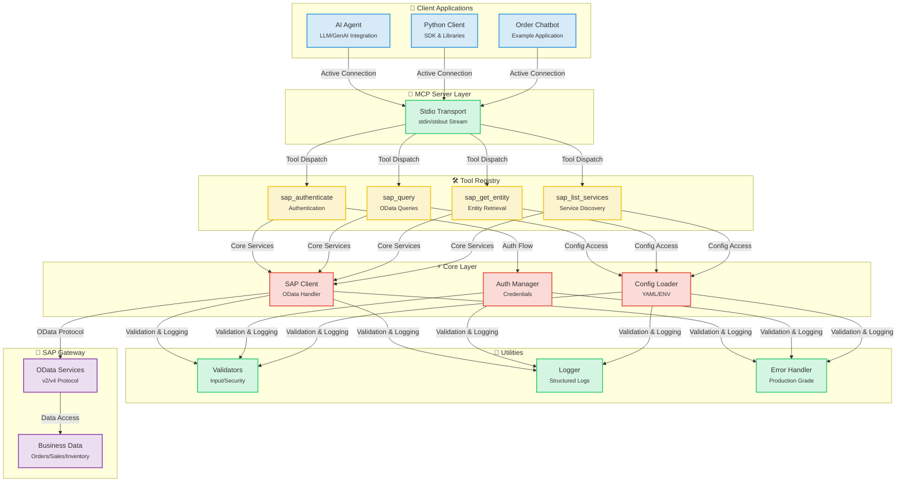
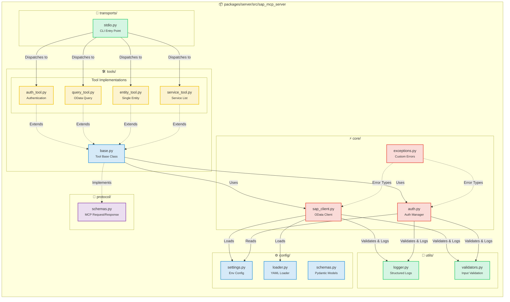
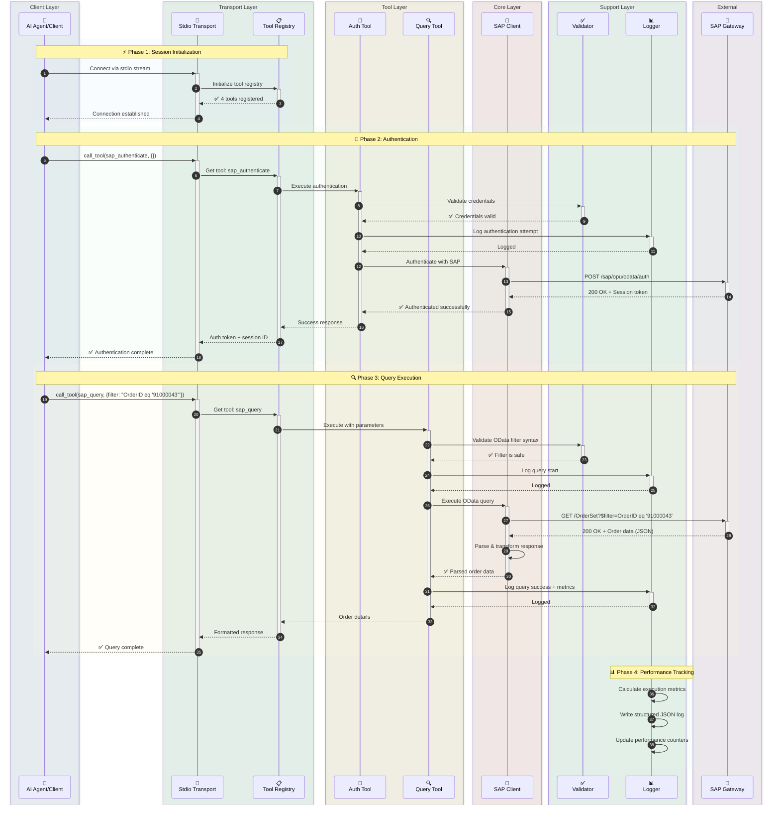
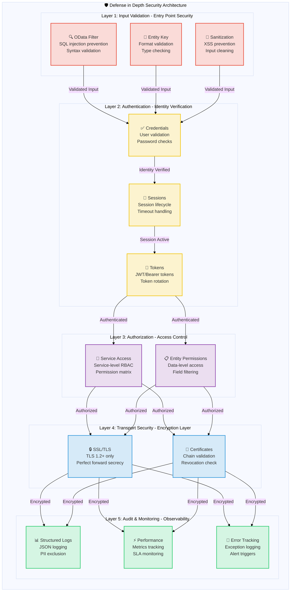

# SAP MCP - SAP Gateway Integration via Model Context Protocol

Complete MCP server for SAP Gateway integration, providing modular tools for SAP OData operations with AI agents.

<div align="center">

[](https://www.python.org/downloads/)
[](LICENSE)
[]()
[]()
[]()

</div>

---

## 🎯 Project Overview

Production-ready MCP (Model Context Protocol) server that enables AI agents and applications to interact with SAP Gateway systems through a clean, modular architecture. Built for reliability, security, and developer experience.

**Current Status**: ✅ **Production Ready** (All 5 phases completed)

### Key Highlights

- 🔐 **Secure SAP Integration**: Enterprise-grade authentication and SSL/TLS support
- 🛠️ **4 Modular Tools**: Authentication, query, entity retrieval, service discovery
- 🚀 **Stdio Transport**: Production-ready MCP server
- 📊 **Structured Logging**: JSON and console formats with performance metrics
- ✅ **Validated Inputs**: Comprehensive OData and security validation
- 🧪 **Well-Tested**: 56% coverage, 44/45 tests passing (98% success rate)

---

## 📐 Architecture

### System Overview



### Component Details



### Data Flow: Order Query Example



### Tool Execution Flow


### Security Architecture



---

## 📦 Repository Structure

```
sap-mcp/
├── packages/
│   └── server/                          ✅ Production-Ready MCP Server
│       ├── src/sap_mcp_server/
│       │   ├── core/                    # SAP client & auth (3 files)
│       │   │   ├── sap_client.py        # OData operations
│       │   │   ├── auth.py              # Credential management
│       │   │   └── exceptions.py        # Custom exceptions
│       │   ├── config/                  # Configuration (4 files)
│       │   │   ├── settings.py          # Environment config
│       │   │   ├── loader.py            # YAML loader
│       │   │   └── schemas.py           # Pydantic models
│       │   ├── protocol/                # MCP protocol (2 files)
│       │   │   └── schemas.py           # Request/Response schemas
│       │   ├── tools/                   # 4 modular SAP tools
│       │   │   ├── base.py              # Tool base class
│       │   │   ├── auth_tool.py         # Authentication
│       │   │   ├── query_tool.py        # OData queries
│       │   │   ├── entity_tool.py       # Entity retrieval
│       │   │   └── service_tool.py      # Service discovery
│       │   ├── transports/              # Transport layer
│       │   │   └── stdio.py             # Stdio transport ✅
│       │   └── utils/                   # Utilities (3 files)
│       │       ├── logger.py            # Structured logging
│       │       └── validators.py        # Input validation
│       ├── config/                      # Server configuration
│       │   ├── services.yaml            # SAP services config
│       │   └── services.yaml.example    # Configuration template
│       ├── tests/                       # 45 tests (56% coverage)
│       │   ├── conftest.py              # 8 fixtures
│       │   ├── unit/                    # Fast isolated tests
│       │   └── integration/             # Integration tests
│       └── pyproject.toml               # Package config
│
├── docs/                                # Documentation
│   ├── guides/                          # User guides
│   └── api/                             # API reference
├── scripts/                             # Development scripts
├── .env.server                          # Server configuration
├── .env.server.example                  # Configuration template
└── README.md                            # This file
```

---

## ✨ Features

### Core Capabilities

<table>
<tr>
<td width="50%">

#### 🛠️ Tools
- ✅ **sap_authenticate**: Secure SAP authentication
- ✅ **sap_query**: OData queries with filters
- ✅ **sap_get_entity**: Single entity retrieval
- ✅ **sap_list_services**: Service discovery

</td>
<td width="50%">

#### 🚀 Transport
- ✅ **Stdio**: Production-ready stdin/stdout

</td>
</tr>
<tr>
<td>

#### 📊 Logging & Monitoring
- ✅ **Structured Logging**: JSON + console
- ✅ **Performance Metrics**: Request timing
- ✅ **Error Tracking**: Full context
- ✅ **Audit Trail**: Security events

</td>
<td>

#### 🔒 Security
- ✅ **Input Validation**: OData & security
- ✅ **SSL/TLS Support**: Secure connections
- ✅ **Credential Management**: .env.server
- ✅ **Error Handling**: Production-grade

</td>
</tr>
</table>

### Quality & Testing

| Metric | Value | Status |
|--------|-------|--------|
| **Test Coverage** | 56% | 🟡 Good |
| **Tests Passing** | 44/45 (98%) | 🟢 Excellent |
| **Test Speed** | <0.2s | 🟢 Fast |
| **Fixtures** | 8 comprehensive | 🟢 Complete |
| **Test Categories** | Unit + Integration | 🟢 Complete |

### Developer Experience

- ✅ **Modular Architecture**: One tool per file
- ✅ **Type Safety**: Full type hints
- ✅ **Documentation**: Comprehensive guides
- ✅ **Easy Setup**: `pip install -e .`
- ✅ **Hot Reload**: Development mode
- ✅ **Example Apps**: 3 working examples

---

## 🚀 Quick Start

### Prerequisites

#### System Requirements

- **Python 3.11 or higher**
- **pip** (Python package installer)
- **Git** (for cloning repository)
- SAP Gateway access credentials
- Virtual environment support

#### Installing Python

<details>
<summary><b>🪟 Windows</b></summary>

**Option 1: Microsoft Store (Recommended for Windows 10/11)**
```powershell
# Search for "Python 3.11" or "Python 3.12" in Microsoft Store
# Or download from python.org
```

**Option 2: Python.org Installer**
1. Download from [python.org/downloads](https://www.python.org/downloads/)
2. Run installer
3. ✅ **Check "Add Python to PATH"**
4. Click "Install Now"

**Verify installation:**
```powershell
python --version
# Should show: Python 3.11.x or higher

pip --version
# Should show: pip 23.x.x or higher
```

**Common Issues:**
- If `python` command not found, use `python3` or `py`
- If `pip` not found, install with: `python -m ensurepip --upgrade`

</details>

<details>
<summary><b>🍎 macOS</b></summary>

**Option 1: Homebrew (Recommended)**
```bash
# Install Homebrew if not installed
/bin/bash -c "$(curl -fsSL https://raw.githubusercontent.com/Homebrew/install/HEAD/install.sh)"

# Install Python
brew install python@3.11
# or
brew install python@3.12
```

**Option 2: Python.org Installer**
1. Download from [python.org/downloads/macos](https://www.python.org/downloads/macos/)
2. Open the `.pkg` file
3. Follow installation wizard

**Verify installation:**
```bash
python3 --version
# Should show: Python 3.11.x or higher

pip3 --version
# Should show: pip 23.x.x or higher
```

**Note:** macOS may have Python 2.7 pre-installed. Always use `python3` and `pip3` commands.

</details>

<details>
<summary><b>🐧 Linux</b></summary>

**Ubuntu/Debian:**
```bash
# Update package list
sudo apt update

# Install Python 3.11+
sudo apt install python3.11 python3.11-venv python3-pip

# Or for latest Python
sudo apt install python3 python3-venv python3-pip
```

**Fedora/RHEL/CentOS:**
```bash
# Install Python 3.11+
sudo dnf install python3.11 python3-pip

# Or
sudo yum install python3 python3-pip
```

**Arch Linux:**
```bash
sudo pacman -S python python-pip
```

**Verify installation:**
```bash
python3 --version
# Should show: Python 3.11.x or higher

pip3 --version
# Should show: pip 23.x.x or higher
```

</details>

---

### 1. Installation

#### Step-by-Step Installation

<details open>
<summary><b>🪟 Windows (PowerShell/Command Prompt)</b></summary>

```powershell
# Clone repository
git clone <repository-url>
cd sap-mcp

# Create virtual environment
python -m venv .venv

# Activate virtual environment
.venv\Scripts\activate
# Or in PowerShell:
# .venv\Scripts\Activate.ps1

# If you get execution policy error in PowerShell:
# Set-ExecutionPolicy -ExecutionPolicy RemoteSigned -Scope CurrentUser

# Verify activation (you should see (.venv) in prompt)
# (.venv) PS C:\path\to\sap-mcp>

# Install server package
cd packages\server
pip install -e .

# Install development dependencies (optional)
pip install -e ".[dev]"

# Verify installation
sap-mcp-server-stdio --help
```

**Common Windows Issues:**
- **`python` not found**: Try `python3` or `py`
- **Permission denied**: Run PowerShell as Administrator
- **Execution policy**: Run `Set-ExecutionPolicy -ExecutionPolicy RemoteSigned -Scope CurrentUser`
- **Long path support**: Enable long paths in Windows (Settings > System > About > Advanced system settings)

</details>

<details>
<summary><b>🍎 macOS (Terminal)</b></summary>

```bash
# Clone repository
git clone <repository-url>
cd sap-mcp

# Create virtual environment
python3 -m venv .venv

# Activate virtual environment
source .venv/bin/activate

# Verify activation (you should see (.venv) in prompt)
# (.venv) user@macbook sap-mcp %

# Install server package
cd packages/server
pip install -e .

# Install development dependencies (optional)
pip install -e ".[dev]"

# Verify installation
sap-mcp-server-stdio --help

# Check installation path (useful for Gemini CLI setup)
which sap-mcp-server-stdio
# Example output: /Users/username/sap-mcp/.venv/bin/sap-mcp-server-stdio
```

**Common macOS Issues:**
- **`python` not found**: Use `python3` instead
- **`pip` not found**: Use `pip3` instead
- **Permission denied**: Don't use `sudo` with virtual environments
- **Command not found after install**: Ensure virtual environment is activated

</details>

<details>
<summary><b>🐧 Linux (Bash/Zsh)</b></summary>

```bash
# Clone repository
git clone <repository-url>
cd sap-mcp

# Create virtual environment
python3 -m venv .venv

# Activate virtual environment
source .venv/bin/activate

# Verify activation (you should see (.venv) in prompt)
# (.venv) user@linux:~/sap-mcp$

# Install server package
cd packages/server
pip install -e .

# Install development dependencies (optional)
pip install -e ".[dev]"

# Verify installation
sap-mcp-server-stdio --help

# Check installation path (useful for Gemini CLI setup)
which sap-mcp-server-stdio
# Example output: /home/username/sap-mcp/.venv/bin/sap-mcp-server-stdio
```

**Common Linux Issues:**
- **`python3-venv` not found**: Install with `sudo apt install python3-venv`
- **Permission denied**: Don't use `sudo` with virtual environments
- **SSL errors**: Install certificates: `sudo apt install ca-certificates`
- **Build dependencies missing**: Install with `sudo apt install build-essential python3-dev`

</details>

---

### 2. Configuration

The SAP MCP server requires two configuration files:
1. **`.env.server`**: SAP connection credentials (one SAP system)
2. **`services.yaml`**: SAP Gateway Services and authentication settings

#### 2.1. SAP Connection Configuration (`.env.server`)

> **⚠️ IMPORTANT**: As of v0.2.0, `.env.server` has been consolidated to the **project root directory only**. The previous `packages/server/.env.server` location is no longer supported.

**File Location**: `.env.server` must be in the **project root directory**.

```
sap-mcp/
├── .env.server              ← Configuration file (ONLY location - create here)
├── .env.server.example      ← Example template
├── packages/
│   └── server/
└── README.md
```

**Setup Steps**:

<details open>
<summary><b>🪟 Windows (PowerShell/Command Prompt)</b></summary>

```powershell
# Navigate to project root
cd C:\path\to\sap-mcp

# Copy environment template
copy .env.server.example .env.server

# Edit configuration with your SAP credentials using Notepad
notepad .env.server

# Or use your preferred editor:
# code .env.server (VS Code)
# notepad++ .env.server (Notepad++)

# Note: File permissions are managed differently on Windows
# Ensure the file is not in a public folder
# Right-click .env.server > Properties > Security to restrict access
```

**Windows-Specific Notes:**
- Use backslashes (`\`) for paths in Windows
- PowerShell execution policies may block scripts (see installation section)
- Store `.env.server` in a user folder with restricted access
- Use Windows Defender exclusions if antivirus blocks the file

</details>

<details>
<summary><b>🍎 macOS (Terminal)</b></summary>

```bash
# Navigate to project root
cd /path/to/sap-mcp

# Copy environment template
cp .env.server.example .env.server

# Edit configuration with your SAP credentials
nano .env.server
# Or use your preferred editor:
# vim .env.server
# code .env.server (VS Code)
# open -a TextEdit .env.server

# Set proper permissions (recommended for security)
chmod 600 .env.server

# Verify permissions
ls -la .env.server
# Should show: -rw------- (only owner can read/write)
```

**macOS-Specific Notes:**
- File permissions are Unix-based (same as Linux)
- `chmod 600` ensures only your user can read/write the file
- macOS may have additional security prompts for first-time access
- Store in your home directory for best security

</details>

<details>
<summary><b>🐧 Linux (Bash/Zsh)</b></summary>

```bash
# Navigate to project root
cd /path/to/sap-mcp

# Copy environment template
cp .env.server.example .env.server

# Edit configuration with your SAP credentials
nano .env.server
# Or use your preferred editor:
# vim .env.server
# code .env.server (VS Code)
# gedit .env.server (GNOME)

# Set proper permissions (REQUIRED for security)
chmod 600 .env.server

# Verify permissions
ls -la .env.server
# Should show: -rw------- (only owner can read/write)

# Optional: Verify file is not world-readable
stat .env.server
```

**Linux-Specific Notes:**
- `chmod 600` is critical for security (only owner can access)
- SELinux/AppArmor may require additional configuration
- File must be owned by the user running the server
- Never use `sudo` to edit or run with this file

</details>

---

**Required Environment Variables**:
```bash
# SAP System Connection (Single SAP System)
SAP_HOST=your-sap-host.com          # SAP Gateway hostname
SAP_PORT=443                         # HTTPS port (usually 443 or 8443)
SAP_USERNAME=your-username           # SAP user ID
SAP_PASSWORD=your-password           # SAP password
SAP_CLIENT=100                       # SAP client number (e.g., 100, 800)

# Security Settings
SAP_VERIFY_SSL=true                  # Enable SSL certificate verification (recommended)
SAP_TIMEOUT=30                       # Request timeout in seconds

# Optional: Connection Pooling
SAP_MAX_CONNECTIONS=10               # Maximum concurrent connections (optional)
SAP_RETRY_ATTEMPTS=3                 # Number of retry attempts on failure (optional)
```

**Security Best Practices**:
- ✅ Never commit `.env.server` to version control (already in `.gitignore`)
- ✅ Use strong, unique passwords
- ✅ Enable SSL verification in production (`SAP_VERIFY_SSL=true`)
- ✅ Restrict file permissions: `chmod 600 .env.server`

#### 2.2. SAP Gateway Services Configuration (`services.yaml`)

Configure SAP Gateway Services (OData services) that the MCP server can access.

**Location**: `packages/server/config/services.yaml`

```bash
# Copy example configuration
cp packages/server/config/services.yaml.example packages/server/config/services.yaml

# Edit service configuration
vim packages/server/config/services.yaml
```

**Basic Configuration Example**:

```yaml
# Gateway URL configuration
gateway:
  # Base URL pattern for OData services
  base_url_pattern: "https://{host}:{port}/sap/opu/odata"

  # Metadata endpoint suffix
  metadata_suffix: "/$metadata"

  # Service catalog path
  service_catalog_path: "/sap/opu/odata/IWFND/CATALOGSERVICE;v=2/ServiceCollection"

  # Authentication endpoint configuration
  auth_endpoint:
    # RECOMMENDED: Use catalog metadata (works without specific service)
    use_catalog_metadata: true

    # Optional: Use specific service for authentication (if catalog unavailable)
    # use_catalog_metadata: false
    # service_id: Z_TRAVEL_RECOMMENDATIONS_SRV
    # entity_name: AirlineSet

# SAP OData Services
services:
  # SFLIGHT Demo Service (Travel Recommendations)
  - id: Z_TRAVEL_RECOMMENDATIONS_SRV
    name: "Travel Recommendations Service (SFLIGHT)"
    path: "/SAP/Z_TRAVEL_RECOMMENDATIONS_SRV"
    version: v2
    description: "OData service for the SFLIGHT demo dataset."
    entities:
      - name: AirlineSet
        key_field: CARRID
        description: "Airlines (e.g., LH, AA)"
        default_select:
          - CARRID
          - CARRNAME
          - CURRCODE
          - URL
      - name: AirportSet
        key_field: ID
        description: "Airports (e.g., FRA, JFK)"
        default_select:
          - ID
          - NAME
          - CITY
          - COUNTRY
      - name: FlightSet
        key_field: "CARRID='{CARRID}',CONNID='{CONNID}',FLDATE=datetime'{FLDATE}'"
        description: "Specific flights on a given date"
      - name: BookingSet
        key_field: "CARRID='{CARRID}',CONNID='{CONNID}',FLDATE=datetime'{FLDATE}',BOOKID='{BOOKID}'"
        description: "Individual flight bookings"

    # Optional: Custom headers for this service
    custom_headers: {}
```

#### 2.3. Authentication Endpoint Options

The `auth_endpoint` configuration controls how the MCP server authenticates with SAP.

**Option 1: Catalog Metadata (Recommended)**

```yaml
gateway:
  auth_endpoint:
    use_catalog_metadata: true
```

**Advantages**:
- ✅ Works without requiring specific SAP Gateway Services
- ✅ More flexible and portable across SAP systems
- ✅ Service-independent authentication
- ✅ No dependency on custom service deployment

**Authentication Flow**:
- CSRF Token: `/sap/opu/odata/IWFND/CATALOGSERVICE;v=2/ServiceCollection`
- Validation: `/sap/opu/odata/IWFND/CATALOGSERVICE;v=2/$metadata`

---

**Option 2: Service-Specific Authentication**

```yaml
gateway:
  auth_endpoint:
    use_catalog_metadata: false
    service_id: Z_TRAVEL_RECOMMENDATIONS_SRV    # Must match a service ID below
    entity_name: AirlineSet                     # Must be an entity in that service
```

**Advantages**:
- ✅ Explicit service-based authentication
- ✅ Works when catalog service is unavailable (rare)

**Disadvantages**:
- ❌ Requires the specified service to be deployed
- ❌ Less flexible if service changes
- ❌ Must update config if service name changes

**Authentication Flow**:
- CSRF Token: `/SAP/Z_TRAVEL_RECOMMENDATIONS_SRV/AirlineSet`
- Validation: `/sap/opu/odata/IWFND/CATALOGSERVICE;v=2/$metadata`

---

**Recommendation**: Use **Option 1 (Catalog Metadata)** unless you have a specific reason to use a particular service for authentication.

### 3. Run Server

<details open>
<summary><b>🪟 Windows (PowerShell/Command Prompt)</b></summary>

```powershell
# Activate virtual environment
.venv\Scripts\activate
# Or in PowerShell:
# .venv\Scripts\Activate.ps1

# Run stdio server (recommended)
sap-mcp-server-stdio

# Or directly with Python
python -m sap_mcp_server.transports.stdio

# To deactivate when done
deactivate
```

**Windows-Specific Notes:**
- Use backslash (`\`) for paths
- PowerShell may require execution policy change
- Server runs in current terminal window
- Press `Ctrl+C` to stop the server

</details>

<details>
<summary><b>🍎 macOS (Terminal)</b></summary>

```bash
# Activate virtual environment
source .venv/bin/activate

# Run stdio server (recommended)
sap-mcp-server-stdio

# Or directly with Python
python3 -m sap_mcp_server.transports.stdio

# To deactivate when done
deactivate
```

**macOS-Specific Notes:**
- Use `python3` instead of `python`
- Server runs in current terminal session
- Press `Cmd+C` or `Ctrl+C` to stop the server
- Terminal must remain open while server runs

</details>

<details>
<summary><b>🐧 Linux (Bash/Zsh)</b></summary>

```bash
# Activate virtual environment
source .venv/bin/activate

# Run stdio server (recommended)
sap-mcp-server-stdio

# Or directly with Python
python3 -m sap_mcp_server.transports.stdio

# To deactivate when done
deactivate
```

**Linux-Specific Notes:**
- Use `python3` instead of `python`
- Server runs in current terminal session
- Press `Ctrl+C` to stop the server
- Can run in background with `nohup` or `systemd` service

</details>

---

## 🤖 Integration with Gemini CLI

> **📖 Official Documentation**: For more information about Gemini CLI, visit <a href="https://geminicli.com/" target="_blank">https://geminicli.com/</a>

### Prerequisites

- Node.js 18+ and npm installed
- SAP MCP Server installed (see Quick Start above)
- Google Account for Gemini API access

### 1. Install Gemini CLI

```bash
# Install Gemini CLI globally
npm install -g @google/gemini-cli

# Verify installation
gemini --version
```

### 2. Authenticate Gemini CLI

**Option A: Using Gemini API Key (Recommended for Getting Started)**

1. Get your API key from [Google AI Studio](https://aistudio.google.com/apikey)
2. Set the environment variable:

```bash
export GEMINI_API_KEY="your-api-key-here"
```

**Option B: Using Google Cloud (For Production)**

```bash
# Install Google Cloud CLI first
gcloud auth application-default login

# Set your project
export GOOGLE_CLOUD_PROJECT="your-project-id"
export GOOGLE_CLOUD_LOCATION="us-central1"
```

### 3. Register SAP MCP Server

**Method A: Using Absolute Path (Recommended for Virtual Environments)**

If you installed the server in a virtual environment, use the absolute path to the executable:

1. **Find the absolute path**:
```bash
# Navigate to your SAP MCP directory
cd /path/to/sap-mcp

# Get the absolute path
pwd
# Example output: /Users/sanggyulee/my-project/python-project/sap-mcp
```

2. **Edit `~/.gemini/settings.json`**:
```json
{
  "mcpServers": {
    "sap-server": {
      "command": "/Users/sanggyulee/my-project/python-project/sap-mcp/.venv/bin/sap-mcp-server-stdio",
      "cwd": "/Users/sanggyulee/my-project/python-project/sap-mcp",
      "description": "SAP Gateway MCP Server for OData integration",
      "timeout": 30000,
      "trust": false
    }
  }
}
```

**Replace `/Users/sanggyulee/my-project/python-project/sap-mcp` with your actual project path.**

> **📝 Note**: The `cwd` (current working directory) parameter is **ABSOLUTELY CRITICAL** for `.env.server` file discovery. You **MUST** set this to your project root directory (e.g., `/Users/username/projects/sap-mcp`). If omitted or incorrect, the server will fail to load your credentials.

3. **Verify the path**:
```bash
# Test the command works
/path/to/your/sap-mcp/.venv/bin/sap-mcp-server-stdio --help

# Verify registration
gemini mcp list
# Expected: ✓ sap-server: ... (stdio) - Connected
```

---

**Method B: Using CLI Command (If installed globally)**

If `sap-mcp-server-stdio` is in your system PATH:

```bash
# Register the server
gemini mcp add sap-server sap-mcp-server-stdio

# Verify registration
gemini mcp list
```

**Note**: This method only works if you added the virtual environment to your PATH or installed the package globally.

---

**Method C: Using Python Module Path**

Alternative approach using Python module:

```json
{
  "mcpServers": {
    "sap-server": {
      "command": "/path/to/sap-mcp/.venv/bin/python",
      "args": ["-m", "sap_mcp_server.transports.stdio"],
      "cwd": "/path/to/sap-mcp/packages/server",
      "description": "SAP Gateway MCP Server",
      "timeout": 30000,
      "trust": false
    }
  }
}
```

### 4. Start Using SAP MCP with Gemini CLI

```bash
# Start Gemini CLI
gemini

# Check MCP server status
> /mcp

# View available SAP tools
> /mcp desc

# Example: Query SAP airlines
> Use the SAP tools to authenticate and show me all airlines

# Example: List available SAP services
> What SAP services are available?

# Example: Get airport details
> Retrieve details for Frankfurt airport (FRA)
```

### Advanced Configuration

**Enable Auto-Approval for Trusted Server**

```json
{
  "mcpServers": {
    "sap-server": {
      "command": "/path/to/sap-mcp/.venv/bin/sap-mcp-server-stdio",
      "trust": true,
      "timeout": 30000
    }
  }
}
```

**Note**: Set `"trust": true` to skip approval prompts for each tool call. Only enable for trusted servers.

---

**Filter Specific Tools**

```json
{
  "mcpServers": {
    "sap-server": {
      "command": "/path/to/sap-mcp/.venv/bin/sap-mcp-server-stdio",
      "includeTools": ["sap_authenticate", "sap_query"],
      "excludeTools": ["sap_list_services"],
      "timeout": 30000
    }
  }
}
```

**Use Cases**:
- `includeTools`: Only allow specific tools (whitelist)
- `excludeTools`: Block specific tools (blacklist)
- Cannot use both simultaneously

---

**Add Environment Variables (Optional)**

```json
{
  "mcpServers": {
    "sap-server": {
      "command": "/path/to/sap-mcp/.venv/bin/sap-mcp-server-stdio",
      "env": {
        "SAP_HOST": "${SAP_HOST}",
        "SAP_USERNAME": "${SAP_USERNAME}",
        "SAP_PASSWORD": "${SAP_PASSWORD}"
      },
      "timeout": 30000
    }
  }
}
```

**Note**: Environment variables in `settings.json` override values from `.env.server`. Not recommended for security reasons - prefer using `.env.server` file instead.

---

**Increase Timeout for Slow Networks**

```json
{
  "mcpServers": {
    "sap-server": {
      "command": "/path/to/sap-mcp/.venv/bin/sap-mcp-server-stdio",
      "timeout": 60000,  // 60 seconds (default: 30000)
      "trust": false
    }
  }
}
```

**When to increase**:
- Slow network connections
- Large data queries
- Complex SAP operations
- Frequent timeout errors

### Troubleshooting

**Problem: Server shows "Disconnected" status**

```bash
# Check MCP server status
gemini mcp list
# If you see: ✗ sap-server: sap-mcp-server-stdio (stdio) - Disconnected
```

**Solution 1: Use absolute path (Most Common)**

The command is likely in a virtual environment. Update `~/.gemini/settings.json`:

```json
{
  "mcpServers": {
    "sap-server": {
      "command": "/full/path/to/sap-mcp/.venv/bin/sap-mcp-server-stdio",
      "description": "SAP Gateway MCP Server",
      "timeout": 30000,
      "trust": false
    }
  }
}
```

**Find your absolute path**:
```bash
# Navigate to SAP MCP directory
cd /path/to/sap-mcp

# Get full path
pwd
# Example: /Users/sanggyulee/my-project/python-project/sap-mcp

# Verify command exists
ls -la .venv/bin/sap-mcp-server-stdio
```

---

**Problem: Command not found in PATH**

```bash
# Test server directly
sap-mcp-server-stdio
# Error: command not found

# Check if command exists
which sap-mcp-server-stdio
# Returns: command not found
```

**Solution 2: Check virtual environment**

```bash
# Check if virtual environment exists
ls -la .venv/bin/sap-mcp-server-stdio

# If exists, use absolute path in settings.json
# If not exists, reinstall:
cd packages/server
pip install -e .
```

---

**Problem: Authentication Errors or `.env.server` not found**

```bash
# Verify .env.server exists in PROJECT ROOT (not in packages/server/)
cat .env.server

# Required fields:
# SAP_HOST=your-host
# SAP_PORT=443
# SAP_USERNAME=your-username
# SAP_PASSWORD=your-password
# SAP_CLIENT=100
```

**Solution 3: Verify file location and credentials**

```bash
# 1. Check if .env.server is in project root
ls -la .env.server
# Should exist in: /path/to/sap-mcp/.env.server

# 2. Ensure Gemini CLI settings.json has "cwd" parameter
cat ~/.gemini/settings.json
# Must include: "cwd": "/path/to/sap-mcp"

# 3. Test authentication manually
source .venv/bin/activate
python -c "from sap_mcp_server.config.settings import get_connection_config; print(get_connection_config())"
```

**Common Issues**:

1. **"Field required" errors**: `.env.server` is not being loaded. Verify:
   - File exists in project root: `/path/to/sap-mcp/.env.server`
   - Gemini CLI `settings.json` has correct `cwd` parameter
   - File has proper permissions: `chmod 600 .env.server`

2. **401 Unauthorized errors**: Fixed in v0.2.1 (2025-01-22)
   - **Previous Issue**: SAP Gateway was rejecting requests without `sap-client` parameter
   - **Current Status**: Automatically handled - all requests include `sap-client` parameter
   - **Verification**: Ensure you have updated to v0.2.1 or later
   - **Manual Check**: Authentication should now succeed with valid credentials

---

**Problem: Need to re-register server**

```bash
# Remove existing server configuration
rm ~/.gemini/settings.json

# Or edit manually to remove sap-server entry
```

**Solution 4: Clean re-registration**

```bash
# Method 1: Edit settings directly
vim ~/.gemini/settings.json

# Method 2: Use absolute path (recommended)
# Follow "Method A: Using Absolute Path" in section 3 above
```

---

**Quick Diagnostic Steps**

1. **Check server executable**:
```bash
/path/to/sap-mcp/.venv/bin/sap-mcp-server-stdio --help
# Should show server startup messages
```

2. **Check Gemini CLI settings**:
```bash
cat ~/.gemini/settings.json | grep -A 5 "sap-server"
# Verify "command" path is correct
```

3. **Test connection**:
```bash
gemini mcp list
# Should show: ✓ sap-server: ... - Connected
```

4. **Test in Gemini CLI**:
```bash
gemini
> /mcp
> /mcp desc
# Should list SAP tools
```

### Available SAP Tools in Gemini CLI

Once registered, you can use these SAP tools through natural language:

| Tool | Description | Example Prompt |
|------|-------------|----------------|
| **sap_authenticate** | Authenticate with SAP Gateway | "Authenticate with SAP" |
| **sap_query** | Query SAP entities with OData filters | "Show me all airlines using the travel recommendations service" |
| **sap_get_entity** | Retrieve specific entity by key | "Get details for Frankfurt airport (FRA)" |
| **sap_list_services** | List available SAP services | "What SAP services are available?" |

### Example Workflows

**1. Flight Inquiry Workflow**

```bash
gemini

> Connect to SAP and find all Lufthansa flights
# Gemini will:
# 1. Call sap_authenticate
# 2. Call sap_query on FlightSet with filter "CARRID eq 'LH'"
# 3. Format and present the results
```

**2. Airport Analysis**

```bash
> Get details for Frankfurt airport and show me available connections
# Gemini will:
# 1. Authenticate
# 2. Call sap_get_entity for 'FRA' on AirportSet
# 3. Call sap_query on ConnectionSet
# 4. Present insights
```

**3. Service Discovery**

```bash
> What SAP services and entity sets are available in the system?
# Gemini will:
# 1. Call sap_list_services
# 2. Format the service catalog
```

---

## 🔧 Available Tools

### 1. SAP Authenticate

Authenticate with SAP Gateway system using credentials from `.env.server`.

**Request**:
```json
{
  "name": "sap_authenticate",
  "arguments": {}
}
```

**Response**:
```json
{
  "success": true,
  "session_id": "abc123...",
  "message": "Successfully authenticated with SAP Gateway",
  "host": "example.sap.corp",
  "client": "100"
}
```

---

### 2. SAP Query

Query SAP entities with OData filters, selection, pagination.

**Request**:
```json
{
  "name": "sap_query",
  "arguments": {
    "service": "Z_TRAVEL_RECOMMENDATIONS_SRV",
    "entity_set": "AirlineSet",
    "filter": "CARRID eq 'LH'",
    "select": "CARRID,CARRNAME,CURRCODE",
    "top": 10,
    "skip": 0
  }
}
```

**Response**:
```json
{
  "d": {
    "results": [
      {
        "CARRID": "LH",
        "CARRNAME": "Lufthansa",
        "CURRCODE": "EUR"
      }
    ]
  }
}
```

---

### 3. SAP Get Entity

Retrieve a specific entity by key.

**Request**:
```json
{
  "name": "sap_get_entity",
  "arguments": {
    "service": "Z_TRAVEL_RECOMMENDATIONS_SRV",
    "entity_set": "AirportSet",
    "entity_key": "'FRA'"
  }
}
```

**Response**:
```json
{
  "success": true,
  "service": "Z_TRAVEL_RECOMMENDATIONS_SRV",
  "entity_set": "AirportSet",
  "entity_key": "'FRA'",
  "key_field": "ID",
  "data": {
    "d": {
      "ID": "FRA",
      "NAME": "Frankfurt International",
      "CITY": "Frankfurt",
      "COUNTRY": "DE",
      "TIME_ZONE": "CET"
    }
  }
}
```

---

### 4. SAP List Services

List all available SAP services from configuration.

**Request**:
```json
{
  "name": "sap_list_services",
  "arguments": {}
}
```

**Response**:
```json
{
  "success": true,
  "count": 1,
  "services": [
    {
      "id": "Z_TRAVEL_RECOMMENDATIONS_SRV",
      "name": "Travel Recommendations Service (SFLIGHT)",
      "path": "/SAP/Z_TRAVEL_RECOMMENDATIONS_SRV",
      "version": "v2",
      "description": "OData service for the SFLIGHT demo dataset.",
      "entities": [
        {
          "name": "AirlineSet",
          "key_field": "CARRID",
          "description": "Airlines (e.g., LH, AA)"
        },
        {
          "name": "AirportSet",
          "key_field": "ID",
          "description": "Airports (e.g., FRA, JFK)"
        }
      ]
    }
  ],
  "source": "services.yaml configuration"
}
```

---

## 📚 Usage Examples

### Using the Tool Registry

```python
from sap_mcp_server.tools import tool_registry
from sap_mcp_server.protocol.schemas import ToolCallRequest

# List available tools
tools = tool_registry.list_tools()
for tool in tools:
    print(f"- {tool.name}: {tool.description}")

# Call a tool
request = ToolCallRequest(
    name="sap_list_services",
    arguments={}
)
result = await tool_registry.call_tool(request)
print(result)
```

### MCP Client Example

```python
from mcp import StdioServerParameters
from mcp.client.session import ClientSession
from mcp.client.stdio import stdio_client

async def main():
    # Connect to MCP server
    server_params = StdioServerParameters(
        command="python",
        args=["-m", "sap_mcp_server.transports.stdio"]
    )

    async with stdio_client(server_params) as (read, write):
        async with ClientSession(read, write) as session:
            # Initialize session
            await session.initialize()

            # Authenticate
            auth_result = await session.call_tool("sap_authenticate", {})

            # Query airlines
            entity_result = await session.call_tool(
                "sap_query",
                {
                    "service": "Z_TRAVEL_RECOMMENDATIONS_SRV",
                    "entity_set": "AirlineSet",
                    "filter": "CARRID eq 'LH'"
                }
            )
            print(entity_result)
```

### Structured Logging

```python
from sap_mcp_server.utils.logger import setup_logging, get_logger

# Production (JSON logs)
setup_logging(level="INFO", json_logs=True)

# Development (colored console)
setup_logging(level="DEBUG", json_logs=False)

# Use logger
logger = get_logger(__name__)
logger.info("Server started", port=8080, transport="stdio")
logger.error("Query failed", error=str(e), query=params)
```

### Input Validation

```python
from sap_mcp_server.utils.validators import (
    validate_odata_filter,
    validate_entity_key,
    sanitize_input
)

# Validate OData filter
if validate_odata_filter("CARRID eq 'LH'"):
    # Safe to execute
    pass

# Sanitize user input
safe_input = sanitize_input(user_data, max_length=1000)

# Validate entity key
if validate_entity_key(key):
    # Fetch entity
    pass
```

---

## 🔒 Security

### Defense in Depth

| Layer | Implementation | Status |
|-------|---------------|--------|
| **Input Validation** | OData syntax, SQL injection prevention | ✅ |
| **Authentication** | Credential validation, session management | ✅ |
| **Authorization** | Service access control | ✅ |
| **Transport Security** | SSL/TLS, certificate verification | ✅ |
| **Audit Logging** | Structured logs, no sensitive data | ✅ |

### Best Practices

1. **Credentials**: Store in `.env.server`, never commit to git
2. **SSL/TLS**: Always enable in production (`SAP_VERIFY_SSL=true`)
3. **Validation**: All inputs validated before SAP calls
4. **Logging**: Sensitive data excluded from logs
5. **Error Handling**: Generic error messages to clients

---

## 🧪 Testing

### Test Structure

```
tests/
├── conftest.py              # 8 comprehensive fixtures
├── unit/                    # Fast, isolated tests (40 tests)
│   ├── test_base.py        # Tool registry (16 tests)
│   └── test_validators.py  # Validators (24 tests)
└── integration/             # Integration tests (5 tests)
    └── test_tool_integration.py  # Tool system tests
```

### Running Tests

```bash
# All tests with verbose output
python -m pytest -v

# With coverage report
python -m pytest --cov=sap_mcp_server --cov-report=term-missing

# HTML coverage report
python -m pytest --cov=sap_mcp_server --cov-report=html
open htmlcov/index.html

# Specific test categories
python -m pytest -m unit          # Unit tests only
python -m pytest -m integration   # Integration tests only
python -m pytest -m sap           # SAP integration tests

# Specific test file
python -m pytest tests/unit/test_validators.py -v

# Watch mode (requires pytest-watch)
ptw -- -v
```

### Coverage Report

**Current: 56%** (Target: 70%+)

| Module | Coverage | Status |
|--------|----------|--------|
| `tools/base.py` | 100% | 🟢 Excellent |
| `protocol/schemas.py` | 100% | 🟢 Excellent |
| `tools/service_tool.py` | 88% | 🟢 Good |
| `config/settings.py` | 82% | 🟢 Good |
| `utils/validators.py` | 80% | 🟢 Good |
| `core/sap_client.py` | 45% | 🟡 Needs Work |
| `transports/stdio.py` | 30% | 🟡 Needs Work |

---

## 🛠️ Development

### Project Setup

```bash
# Clone and setup
git clone <repository-url>
cd sap-mcp

# Create virtual environment
python3 -m venv .venv
source .venv/bin/activate

# Install in development mode
cd packages/server
pip install -e ".[dev]"
```

### Adding a New Tool

1. **Create Tool File**: `packages/server/src/sap_mcp_server/tools/my_tool.py`

```python
from .base import MCPTool

class MyNewTool(MCPTool):
    @property
    def name(self) -> str:
        return "my_new_tool"

    @property
    def description(self) -> str:
        return "Description of my new tool"

    @property
    def input_schema(self) -> dict:
        return {
            "type": "object",
            "properties": {
                "param": {"type": "string"}
            },
            "required": ["param"]
        }

    async def execute(self, params: dict) -> dict:
        # Implementation
        return {"result": "success"}
```

2. **Register Tool**: Update `packages/server/src/sap_mcp_server/tools/__init__.py`

```python
from .my_tool import MyNewTool

# Add to registry
tool_registry.register(MyNewTool())
```

3. **Add Tests**: `tests/unit/test_my_tool.py`

```python
import pytest
from sap_mcp_server.tools.my_tool import MyNewTool

@pytest.mark.asyncio
async def test_my_tool():
    tool = MyNewTool()
    result = await tool.execute({"param": "value"})
    assert result["result"] == "success"
```

### Code Quality

```bash
# Format code
black packages/server/src

# Sort imports
isort packages/server/src

# Lint
flake8 packages/server/src

# Type check
mypy packages/server/src

# Security scan
bandit -r packages/server/src

# All quality checks
black . && isort . && flake8 . && mypy . && bandit -r src/
```

---

## 🗺️ Roadmap

### ✅ Completed (v0.2.0)

- [x] Phase 1: Structure and code migration
- [x] Phase 2: Tools splitting (4 modular tools)
- [x] Phase 3: Transport layer (Stdio)
- [x] Phase 4: Utils and testing (56% coverage)
- [x] Phase 5: Cleanup and documentation

### 📝 Planned (v0.3.0)

**High Priority**:
- [ ] Increase test coverage to 70%+
- [ ] Performance benchmarks
- [ ] API documentation (Sphinx)

**Medium Priority**:
- [ ] Docker deployment guide
- [ ] Kubernetes manifests
- [ ] Prometheus metrics
- [ ] OpenTelemetry integration

**Low Priority**:
- [ ] Rate limiting
- [ ] Caching layer
- [ ] GraphQL support
- [ ] WebSocket transport
- [ ] HTTP/REST transport

---

## 🤝 Contributing

### Getting Started

1. Fork the repository
2. Create feature branch (`git checkout -b feature/amazing-feature`)
3. Make changes and add tests
4. Run tests: `python -m pytest -v`
5. Run code quality checks: `black . && isort . && flake8 .`
6. Commit changes (`git commit -m 'Add amazing feature'`)
7. Push to branch (`git push origin feature/amazing-feature`)
8. Open Pull Request

### Coding Standards

- **Style**: Follow PEP 8 style guide
- **Types**: Add type hints to all functions
- **Docs**: Write comprehensive docstrings
- **Tests**: Maintain coverage above 50%
- **Commits**: Use conventional commit messages

### Pull Request Checklist

- [ ] Tests added/updated and passing
- [ ] Documentation updated
- [ ] Code formatted with `black`
- [ ] Imports sorted with `isort`
- [ ] Type hints added
- [ ] Coverage maintained/improved
- [ ] Changelog updated

---

## 📊 Project Metrics

| Metric | Value |
|--------|-------|
| **Lines of Code** | 927 (production code) |
| **Test Coverage** | 56% |
| **Tests** | 45 (44 passing, 98% success rate) |
| **Python Modules** | 24 |
| **SAP Tools** | 4 |
| **Transport Layers** | 1 (Stdio) |
| **Development Time** | ~3 hours (all 5 phases) |
| **Python Version** | 3.11+ |
| **Dependencies** | 11 core, 9 dev |

---

## 📖 Documentation

- **[Server Package README](./packages/server/README.md)**: Detailed server documentation
- **[Configuration Guide](./docs/guides/configuration.md)**: YAML and environment setup
- **[Deployment Guide](./docs/guides/deployment.md)**: Production deployment
- **[Architecture Documentation](./docs/architecture/server.md)**: System architecture details
- **[API Reference](./docs/api/)**: Tool and protocol documentation

---

## 📝 License

MIT License - see [LICENSE](LICENSE) file for details.

---

## 🆘 Support

- **Issues**: [Create an issue](https://github.com/midasol/SAP-MCP-GCP/issues)
- **Documentation**: See `docs/` directory
- **Server Package**: See `packages/server/` for implementation details
- **Community**: Join our discussions

---

## 📜 Version History

### Unreleased

**Documentation Updates**:
- 📚 **Enhanced README**: Added comprehensive OS-specific (Windows, macOS, Linux) installation and configuration guides
- 🔧 **Improved Clarity**: Removed deprecated file path references
- ✨ **Better User Experience**: Added collapsible sections for better documentation navigation

**Bug Fixes**:
- 🐛 **Critical Fix**: Added missing `sap-client` parameter to all SAP Gateway API requests
  - **Issue**: Authentication was failing with 401 Unauthorized errors
  - **Solution**: Automatically inject `sap-client` parameter in all API requests

### v0.2.0 (Current) - 2025-01-15

**Major Features**:
- ✅ Complete modular architecture
- ✅ 4 production-ready SAP tools
- ✅ Stdio transport with MCP server
- ✅ Structured logging and validation
- ✅ 56% test coverage (45 tests)
- ✅ Comprehensive documentation

**Improvements**:
- Fixed async entry point issues
- Updated module paths
- Enhanced error handling
- Improved security validation

**Configuration Changes**:
- ⚠️ **BREAKING**: `.env.server` file location consolidated to **project root only**
  - Previous location `packages/server/.env.server` is no longer supported
  - Improved file discovery logic with priority-based search
  - Enhanced logging for configuration file location
- Gemini CLI integration now requires `cwd` parameter in `settings.json`
- Updated README with detailed troubleshooting for configuration issues

### v0.1.0 (Initial) - 2024-12-01

- Basic SAP Gateway integration
- Monolithic structure
- Limited testing
- Stdio server only

---

## 🙏 Acknowledgments

- **MCP Protocol**: Anthropic's Model Context Protocol
- **SAP Gateway**: OData v2/v4 integration
- **Community**: Contributors and testers

---

<div align="center">

**Built with ❤️ for SAP integration via Model Context Protocol**

[]()
[]()
[]()

**Production Ready** | **56% Coverage** | **98% Test Success**

</div>
