# SAP MCP - SAP Gateway Integration via Model Context Protocol

Complete MCP server for SAP Gateway integration, providing modular tools for SAP OData operations with AI agents.

<div align="center">

[](https://www.python.org/downloads/)
[](LICENSE)
[]()
[]()
[]()

</div>

---

## 🎯 Project Overview

Production-ready MCP (Model Context Protocol) server that enables AI agents and applications to interact with SAP Gateway systems through a clean, modular architecture. Built for reliability, security, and developer experience.

**Current Status**: ✅ **Production Ready** (All 5 phases completed)

### Key Highlights

- 🔐 **Secure SAP Integration**: Enterprise-grade authentication and SSL/TLS support
- 🛠️ **4 Modular Tools**: Authentication, query, entity retrieval, service discovery
- 🚀 **Stdio Transport**: Production-ready MCP server
- 📊 **Structured Logging**: JSON and console formats with performance metrics
- ✅ **Validated Inputs**: Comprehensive OData and security validation
- 🧪 **Well-Tested**: 56% coverage, 44/45 tests passing (98% success rate)

---

## 📐 Architecture

### System Overview


### Component Details


### Data Flow: Order Query Example

```mermaid
%%{init: {'theme':'base', 'themeVariables': { 'primaryColor':'#0066CC','primaryTextColor':'#1E293B','primaryBorderColor':'#004C99','lineColor':'#1E293B','fontSize':'14px','fontFamily':'system-ui, -apple-system, sans-serif','actorBkg':'#F8FAFC','actorBorder':'#CBD5E1','actorTextColor':'#1E293B','noteBkgColor':'#EFF6FF','noteBorderColor':'#3B82F6','noteTextColor':'#1E40AF','signalColor':'#1E293B','signalTextColor':'#1E293B','labelTextColor':'#1E293B'}}}%%
sequenceDiagram
    autonumber
    box rgba(59, 130, 246, 0.08) Client Layer
        participant Client as 🤖<br/><b>AI Agent/Client</b>
    end
    box rgba(16, 185, 129, 0.08) Transport Layer
        participant Transport as 📡<br/><b>Stdio Transport</b>
        participant Registry as 📋<br/><b>Tool Registry</b>
    end
    box rgba(139, 92, 246, 0.08) Tool Layer
        participant AuthTool as 🔐<br/><b>Auth Tool</b>
        participant QueryTool as 🔍<br/><b>Query Tool</b>
    end
    box rgba(236, 72, 153, 0.08) Core Layer
        participant SAPClient as 🔧<br/><b>SAP Client</b>
    end
    box rgba(245, 158, 11, 0.08) Support Layer
        participant Validator as ✅<br/><b>Validator</b>
        participant Logger as 📊<br/><b>Logger</b>
    end
    box rgba(239, 68, 68, 0.08) External
        participant SAP as 🏢<br/><b>SAP Gateway</b>
    end

    rect rgba(59, 130, 246, 0.05)
        Note over Client,Registry: <b>⚡ Phase 1: Session Initialization</b>
        Client->>+Transport: Connect via stdio stream
        Transport->>+Registry: Initialize tool registry
        Registry-->>-Transport: ✅ 4 tools registered
        Transport-->>-Client: Connection established
    end

    rect rgba(16, 185, 129, 0.05)
        Note over Client,SAP: <b>🔐 Phase 2: Authentication</b>
        Client->>+Transport: call_tool(sap_authenticate, {})
        Transport->>+Registry: Get tool: sap_authenticate
        Registry->>+AuthTool: Execute authentication
        AuthTool->>+Validator: Validate credentials
        Validator-->>-AuthTool: ✅ Credentials valid
        AuthTool->>+Logger: Log authentication attempt
        Logger-->>-AuthTool: Logged
        AuthTool->>+SAPClient: Authenticate with SAP
        SAPClient->>+SAP: POST /sap/opu/odata/auth
        SAP-->>-SAPClient: 200 OK + Session token
        SAPClient-->>-AuthTool: ✅ Authenticated successfully
        AuthTool-->>-Registry: Success response
        Registry-->>-Transport: Auth token + session ID
        Transport-->>-Client: ✅ Authentication complete
    end

    rect rgba(139, 92, 246, 0.05)
        Note over Client,SAP: <b>🔍 Phase 3: Query Execution</b>
        Client->>+Transport: call_tool(sap_query, {filter: "OrderID eq '91000043'"})
        Transport->>+Registry: Get tool: sap_query
        Registry->>+QueryTool: Execute with parameters
        QueryTool->>+Validator: Validate OData filter syntax
        Validator-->>-QueryTool: ✅ Filter is safe
        QueryTool->>+Logger: Log query start
        Logger-->>-QueryTool: Logged
        QueryTool->>+SAPClient: Execute OData query
        SAPClient->>+SAP: GET /OrderSet?$filter=OrderID eq '91000043'
        SAP-->>-SAPClient: 200 OK + Order data (JSON)
        SAPClient->>SAPClient: Parse & transform response
        SAPClient-->>-QueryTool: ✅ Parsed order data
        QueryTool->>+Logger: Log query success + metrics
        Logger-->>-QueryTool: Logged
        QueryTool-->>-Registry: Order details
        Registry-->>-Transport: Formatted response
        Transport-->>-Client: ✅ Query complete
    end

    rect rgba(245, 158, 11, 0.05)
        Note over Logger: <b>📊 Phase 4: Performance Tracking</b>
        Logger->>Logger: Calculate execution metrics
        Logger->>Logger: Write structured JSON log
        Logger->>Logger: Update performance counters
    end
```



### Tool Execution Flow

```mermaid
%%{init: {'theme':'base', 'themeVariables': { 'primaryColor':'#0066CC','primaryTextColor':'#FFFFFF','primaryBorderColor':'#004C99','lineColor':'#64748B','fontSize':'14px','fontFamily':'system-ui, -apple-system, sans-serif'}}}%%
flowchart TD
    Start([<b>🚀 Client Request</b><br/><small>Tool invocation</small>]):::startNode

    Start --> Validate{<b>🔍 Validate Input</b><br/><small>Schema check</small><br/><small>Security scan</small>}:::decisionNode

    Validate -->|"❌ Invalid"| Error1[<b>🚫 Validation Error</b><br/><small>Return error details</small>]:::errorNode
    Validate -->|"✅ Valid"| Auth{<b>🔐 Authenticated?</b><br/><small>Session check</small>}:::decisionNode

    Auth -->|"No"| DoAuth[<b>🔑 Execute Auth</b><br/><small>Credential validation</small><br/><small>SAP handshake</small>]:::authNode
    DoAuth --> AuthCheck{<b>✅ Auth Success?</b><br/><small>Token received</small>}:::decisionNode

    AuthCheck -->|"❌ Failed"| Error2[<b>🚫 Auth Error</b><br/><small>Invalid credentials</small>]:::errorNode
    AuthCheck -->|"✅ Success"| Execute

    Auth -->|"Yes"| Execute[<b>⚡ Execute Tool</b><br/><small>Business logic</small><br/><small>Parameter processing</small>]:::processNode

    Execute --> SAPCall[<b>🌐 SAP OData Call</b><br/><small>HTTP request</small><br/><small>SSL/TLS encrypted</small>]:::sapNode

    SAPCall --> SAPCheck{<b>📡 SAP Response</b><br/><small>Status check</small>}:::decisionNode

    SAPCheck -->|"❌ Error"| Error3[<b>🚫 SAP Error</b><br/><small>Service unavailable</small><br/><small>or data error</small>]:::errorNode
    SAPCheck -->|"✅ 200 OK"| Parse[<b>📊 Parse Response</b><br/><small>XML/JSON parsing</small><br/><small>Data extraction</small>]:::processNode

    Parse --> Transform[<b>🔄 Transform Data</b><br/><small>MCP format</small><br/><small>Schema mapping</small>]:::processNode

    Transform --> Log[<b>📝 Log Metrics</b><br/><small>Performance data</small><br/><small>Audit trail</small>]:::logNode

    Log --> Success([<b>✅ Success Response</b><br/><small>Return to client</small>]):::successNode

    Error1 & Error2 & Error3 --> LogError[<b>📝 Log Error</b><br/><small>Error context</small><br/><small>Stack trace</small>]:::logNode

    LogError --> End([<b>❌ Error Response</b><br/><small>Return to client</small>]):::endNode

    classDef startNode fill:#10B981,stroke:#059669,stroke-width:3px,color:#FFFFFF,rx:10,ry:10
    classDef decisionNode fill:#F59E0B,stroke:#D97706,stroke-width:2.5px,color:#1F2937,rx:8,ry:8
    classDef authNode fill:#8B5CF6,stroke:#7C3AED,stroke-width:2.5px,color:#FFFFFF,rx:8,ry:8
    classDef processNode fill:#0066CC,stroke:#004C99,stroke-width:2.5px,color:#FFFFFF,rx:8,ry:8
    classDef sapNode fill:#EC4899,stroke:#DB2777,stroke-width:2.5px,color:#FFFFFF,rx:8,ry:8
    classDef errorNode fill:#EF4444,stroke:#DC2626,stroke-width:2.5px,color:#FFFFFF,rx:8,ry:8
    classDef logNode fill:#06B6D4,stroke:#0891B2,stroke-width:2.5px,color:#FFFFFF,rx:8,ry:8
    classDef successNode fill:#10B981,stroke:#059669,stroke-width:3px,color:#FFFFFF,rx:10,ry:10
    classDef endNode fill:#EF4444,stroke:#DC2626,stroke-width:3px,color:#FFFFFF,rx:10,ry:10
```



### Security Architecture

```mermaid
%%{init: {'theme':'base', 'themeVariables': { 'primaryColor':'#0066CC','primaryTextColor':'#FFFFFF','primaryBorderColor':'#004C99','lineColor':'#64748B','fontSize':'14px','fontFamily':'system-ui, -apple-system, sans-serif'}}}%%
graph TB
    subgraph security["<b>🛡️ Defense in Depth Security Architecture</b>"]
        direction TB

        subgraph layer1["<b>Layer 1: Input Validation</b> <small>(Entry Point Security)</small>"]
            direction LR
            L1A["<b>🔍 OData Filter</b><br/><small>SQL injection prevention</small><br/><small>Syntax validation</small>"]:::inputNode
            L1B["<b>🔑 Entity Key</b><br/><small>Format validation</small><br/><small>Type checking</small>"]:::inputNode
            L1C["<b>🧹 Sanitization</b><br/><small>XSS prevention</small><br/><small>Input cleaning</small>"]:::inputNode
        end

        subgraph layer2["<b>Layer 2: Authentication</b> <small>(Identity Verification)</small>"]
            direction LR
            L2A["<b>✅ Credentials</b><br/><small>User validation</small><br/><small>Password checks</small>"]:::authNode
            L2B["<b>🎫 Sessions</b><br/><small>Session lifecycle</small><br/><small>Timeout handling</small>"]:::authNode
            L2C["<b>🔐 Tokens</b><br/><small>JWT/Bearer tokens</small><br/><small>Token rotation</small>"]:::authNode
        end

        subgraph layer3["<b>Layer 3: Authorization</b> <small>(Access Control)</small>"]
            direction LR
            L3A["<b>🚦 Service Access</b><br/><small>Service-level RBAC</small><br/><small>Permission matrix</small>"]:::authzNode
            L3B["<b>📋 Entity Permissions</b><br/><small>Data-level access</small><br/><small>Field filtering</small>"]:::authzNode
        end

        subgraph layer4["<b>Layer 4: Transport Security</b> <small>(Encryption Layer)</small>"]
            direction LR
            L4A["<b>🔒 SSL/TLS</b><br/><small>TLS 1.2+ only</small><br/><small>Perfect forward secrecy</small>"]:::transportNode
            L4B["<b>📜 Certificates</b><br/><small>Chain validation</small><br/><small>Revocation check</small>"]:::transportNode
        end

        subgraph layer5["<b>Layer 5: Audit & Monitoring</b> <small>(Observability)</small>"]
            direction LR
            L5A["<b>📊 Structured Logs</b><br/><small>JSON logging</small><br/><small>PII exclusion</small>"]:::auditNode
            L5B["<b>⚡ Performance</b><br/><small>Metrics tracking</small><br/><small>SLA monitoring</small>"]:::auditNode
            L5C["<b>🚨 Error Tracking</b><br/><small>Exception logging</small><br/><small>Alert triggers</small>"]:::auditNode
        end
    end

    L1A & L1B & L1C ==>|"Validated Input"| L2A
    L2A ==>|"Identity Verified"| L2B
    L2B ==>|"Session Active"| L2C
    L2C ==>|"Authenticated"| L3A & L3B
    L3A & L3B ==>|"Authorized"| L4A & L4B
    L4A & L4B ==>|"Encrypted"| L5A & L5B & L5C

    classDef inputNode fill:#EF4444,stroke:#DC2626,stroke-width:2.5px,color:#FFFFFF,rx:8,ry:8
    classDef authNode fill:#F59E0B,stroke:#D97706,stroke-width:2.5px,color:#1F2937,rx:8,ry:8
    classDef authzNode fill:#8B5CF6,stroke:#7C3AED,stroke-width:2.5px,color:#FFFFFF,rx:8,ry:8
    classDef transportNode fill:#EC4899,stroke:#DB2777,stroke-width:2.5px,color:#FFFFFF,rx:8,ry:8
    classDef auditNode fill:#06B6D4,stroke:#0891B2,stroke-width:2.5px,color:#FFFFFF,rx:8,ry:8
```



---

## 📦 Repository Structure

```
sap-mcp/
├── packages/
│   ├── server/                          ✅ Production-Ready MCP Server
│   │   ├── src/sap_mcp_server/
│   │   │   ├── core/                    # SAP client & auth (3 files)
│   │   │   │   ├── sap_client.py        # OData operations
│   │   │   │   ├── auth.py              # Credential management
│   │   │   │   └── exceptions.py        # Custom exceptions
│   │   │   ├── config/                  # Configuration (4 files)
│   │   │   │   ├── settings.py          # Environment config
│   │   │   │   ├── loader.py            # YAML loader
│   │   │   │   └── schemas.py           # Pydantic models
│   │   │   ├── protocol/                # MCP protocol (2 files)
│   │   │   │   └── schemas.py           # Request/Response schemas
│   │   │   ├── tools/                   # 4 modular SAP tools
│   │   │   │   ├── base.py              # Tool base class
│   │   │   │   ├── auth_tool.py         # Authentication
│   │   │   │   ├── query_tool.py        # OData queries
│   │   │   │   ├── entity_tool.py       # Entity retrieval
│   │   │   │   └── service_tool.py      # Service discovery
│   │   │   ├── transports/              # Transport layer (2 files)
│   │   │   │   ├── stdio.py             # Stdio transport ✅
│   │   │   │   └── sse.py               # SSE transport (planned)
│   │   │   └── utils/                   # Utilities (3 files)
│   │   │       ├── logger.py            # Structured logging
│   │   │       └── validators.py        # Input validation
│   │   ├── tests/                       # 45 tests (56% coverage)
│   │   │   ├── conftest.py              # 8 fixtures
│   │   │   ├── unit/                    # Fast isolated tests
│   │   │   └── integration/             # Integration tests
│   │   └── pyproject.toml               # Package config
│   │
│   └── client/                          📝 Client SDK & Examples
│       ├── examples/                    # Example applications
│       │   ├── stdio_client.py          # Basic MCP client
│       │   ├── order_inquiry_chatbot.py # AI chatbot example
│       │   └── genai-example.py         # Gemini integration
│       └── tests/                       # Client tests
│
├── examples/                            # Additional examples
├── docs/                                # Documentation
│   ├── guides/                          # User guides
│   └── api/                             # API reference
├── scripts/                             # Development scripts
├── .env.server                          # Server configuration
└── README.md                            # This file
```

---

## ✨ Features

### Core Capabilities

<table>
<tr>
<td width="50%">

#### 🛠️ Tools
- ✅ **sap_authenticate**: Secure SAP authentication
- ✅ **sap_query**: OData queries with filters
- ✅ **sap_get_entity**: Single entity retrieval
- ✅ **sap_list_services**: Service discovery

</td>
<td width="50%">

#### 🚀 Transport
- ✅ **Stdio**: Production-ready stdin/stdout
- 📝 **SSE**: Planned for browser clients
- 📝 **WebSocket**: Future implementation

</td>
</tr>
<tr>
<td>

#### 📊 Logging & Monitoring
- ✅ **Structured Logging**: JSON + console
- ✅ **Performance Metrics**: Request timing
- ✅ **Error Tracking**: Full context
- ✅ **Audit Trail**: Security events

</td>
<td>

#### 🔒 Security
- ✅ **Input Validation**: OData & security
- ✅ **SSL/TLS Support**: Secure connections
- ✅ **Credential Management**: .env.server
- ✅ **Error Handling**: Production-grade

</td>
</tr>
</table>

### Quality & Testing

| Metric | Value | Status |
|--------|-------|--------|
| **Test Coverage** | 56% | 🟡 Good |
| **Tests Passing** | 44/45 (98%) | 🟢 Excellent |
| **Test Speed** | <0.2s | 🟢 Fast |
| **Fixtures** | 8 comprehensive | 🟢 Complete |
| **Test Categories** | Unit + Integration | 🟢 Complete |

### Developer Experience

- ✅ **Modular Architecture**: One tool per file
- ✅ **Type Safety**: Full type hints
- ✅ **Documentation**: Comprehensive guides
- ✅ **Easy Setup**: `pip install -e .`
- ✅ **Hot Reload**: Development mode
- ✅ **Example Apps**: 3 working examples

---

## 🚀 Quick Start

### Prerequisites

- Python 3.11 or higher
- SAP Gateway access credentials
- Virtual environment (recommended)

### 1. Installation

```bash
# Clone repository
git clone <repository-url>
cd sap-mcp

# Create virtual environment
python3 -m venv .venv
source .venv/bin/activate  # On Windows: .venv\Scripts\activate

# Install server package
cd packages/server
pip install -e .

# Install development dependencies (optional)
pip install -e ".[dev]"
```

### 2. Configuration

```bash
# Copy environment template
cp .env.server.example .env.server

# Edit configuration with your SAP credentials
vim .env.server
```

**Required Environment Variables**:
```bash
SAP_HOST=your-sap-host.com
SAP_PORT=443
SAP_USERNAME=your-username
SAP_PASSWORD=your-password
SAP_CLIENT=100
SAP_VERIFY_SSL=true
SAP_TIMEOUT=30
```

### 3. Run Server

```bash
# Activate virtual environment
source .venv/bin/activate

# Run stdio server (recommended)
sap-mcp-server-stdio

# Or directly with Python
python -m sap_mcp_server.transports.stdio
```

### 4. Verify Installation

```bash
# Run tests
cd packages/server
python -m pytest -v

# With coverage report
python -m pytest --cov=sap_mcp_server --cov-report=term-missing

# Specific test categories
python -m pytest -m unit          # Unit tests only
python -m pytest -m integration   # Integration tests only
```

---

## 🔧 Available Tools

### 1. SAP Authenticate

Authenticate with SAP Gateway system using credentials from `.env.server`.

**Request**:
```json
{
  "name": "sap_authenticate",
  "arguments": {}
}
```

**Response**:
```json
{
  "success": true,
  "session_id": "abc123...",
  "message": "Successfully authenticated with SAP"
}
```

---

### 2. SAP Query

Query SAP entities with OData filters, selection, pagination.

**Request**:
```json
{
  "name": "sap_query",
  "arguments": {
    "service": "Z_SALES_ORDER_GENAI_SRV",
    "entity_set": "zsd004Set",
    "filter": "OrderID eq '91000043'",
    "select": "OrderID,Bstnk,Kunnr,Matnr",
    "top": 10,
    "skip": 0
  }
}
```

**Response**:
```json
{
  "data": {
    "d": {
      "results": [
        {
          "OrderID": "91000043",
          "Bstnk": "PO-2024-001",
          "Kunnr": "CUST001",
          "Matnr": "MAT-12345"
        }
      ]
    }
  },
  "count": 1
}
```

---

### 3. SAP Get Entity

Retrieve a specific entity by key.

**Request**:
```json
{
  "name": "sap_get_entity",
  "arguments": {
    "service": "Z_SALES_ORDER_GENAI_SRV",
    "entity_set": "zsd004Set",
    "entity_key": "91000043"
  }
}
```

**Response**:
```json
{
  "data": {
    "d": {
      "OrderID": "91000043",
      "Bstnk": "PO-2024-001",
      "Kunnr": "CUST001",
      "Matnr": "MAT-12345",
      "Wmeng": "100",
      "Vkorg": "1000"
    }
  }
}
```

---

### 4. SAP List Services

List all available SAP services from configuration.

**Request**:
```json
{
  "name": "sap_list_services",
  "arguments": {}
}
```

**Response**:
```json
{
  "services": [
    {
      "name": "Z_SALES_ORDER_GENAI_SRV",
      "description": "Sales Order Service for GenAI",
      "entity_sets": ["zsd004Set", "OrderHeaderSet"]
    }
  ],
  "count": 1
}
```

---

## 📚 Usage Examples

### Using the Tool Registry

```python
from sap_mcp_server.tools import tool_registry
from sap_mcp_server.protocol.schemas import ToolCallRequest

# List available tools
tools = tool_registry.list_tools()
for tool in tools:
    print(f"- {tool.name}: {tool.description}")

# Call a tool
request = ToolCallRequest(
    name="sap_list_services",
    arguments={}
)
result = await tool_registry.call_tool(request)
print(result)
```

### MCP Client Example

```python
from mcp import StdioServerParameters
from mcp.client.session import ClientSession
from mcp.client.stdio import stdio_client

async def main():
    # Connect to MCP server
    server_params = StdioServerParameters(
        command="python",
        args=["-m", "sap_mcp_server.transports.stdio"]
    )

    async with stdio_client(server_params) as (read, write):
        async with ClientSession(read, write) as session:
            # Initialize session
            await session.initialize()

            # Authenticate
            auth_result = await session.call_tool("sap_authenticate", {})

            # Query orders
            entity_result = await session.call_tool(
                "sap_get_entity",
                {
                    "service": "Z_SALES_ORDER_GENAI_SRV",
                    "entity_set": "zsd004Set",
                    "entity_key": "91000043"
                }
            )
            print(entity_result)
```

### AI Chatbot Example

```python
from sap_mcp_client import OrderInquiryChatbot

# Initialize chatbot with Gemini API
chatbot = OrderInquiryChatbot(
    gemini_api_key="your-api-key",
    sap_config={
        "service": "Z_SALES_ORDER_GENAI_SRV",
        "entity_set": "zsd004Set"
    }
)

# Natural language query
response = await chatbot.process_query(
    "Show me details for order 91000043"
)
print(response)
```

### Structured Logging

```python
from sap_mcp_server.utils.logger import setup_logging, get_logger

# Production (JSON logs)
setup_logging(level="INFO", json_logs=True)

# Development (colored console)
setup_logging(level="DEBUG", json_logs=False)

# Use logger
logger = get_logger(__name__)
logger.info("Server started", port=8080, transport="stdio")
logger.error("Query failed", error=str(e), query=params)
```

### Input Validation

```python
from sap_mcp_server.utils.validators import (
    validate_odata_filter,
    validate_entity_key,
    sanitize_input
)

# Validate OData filter
if validate_odata_filter("OrderID eq '12345'"):
    # Safe to execute
    pass

# Sanitize user input
safe_input = sanitize_input(user_data, max_length=1000)

# Validate entity key
if validate_entity_key(key):
    # Fetch entity
    pass
```

---

## 🔒 Security

### Defense in Depth

| Layer | Implementation | Status |
|-------|---------------|--------|
| **Input Validation** | OData syntax, SQL injection prevention | ✅ |
| **Authentication** | Credential validation, session management | ✅ |
| **Authorization** | Service access control | ✅ |
| **Transport Security** | SSL/TLS, certificate verification | ✅ |
| **Audit Logging** | Structured logs, no sensitive data | ✅ |

### Best Practices

1. **Credentials**: Store in `.env.server`, never commit to git
2. **SSL/TLS**: Always enable in production (`SAP_VERIFY_SSL=true`)
3. **Validation**: All inputs validated before SAP calls
4. **Logging**: Sensitive data excluded from logs
5. **Error Handling**: Generic error messages to clients

---

## 🧪 Testing

### Test Structure

```
tests/
├── conftest.py              # 8 comprehensive fixtures
├── unit/                    # Fast, isolated tests (40 tests)
│   ├── test_base.py        # Tool registry (16 tests)
│   └── test_validators.py  # Validators (24 tests)
└── integration/             # Integration tests (5 tests)
    └── test_tool_integration.py  # Tool system tests
```

### Running Tests

```bash
# All tests with verbose output
python -m pytest -v

# With coverage report
python -m pytest --cov=sap_mcp_server --cov-report=term-missing

# HTML coverage report
python -m pytest --cov=sap_mcp_server --cov-report=html
open htmlcov/index.html

# Specific test categories
python -m pytest -m unit          # Unit tests only
python -m pytest -m integration   # Integration tests only
python -m pytest -m sap           # SAP integration tests

# Specific test file
python -m pytest tests/unit/test_validators.py -v

# Watch mode (requires pytest-watch)
ptw -- -v
```

### Coverage Report

**Current: 56%** (Target: 70%+)

| Module | Coverage | Status |
|--------|----------|--------|
| `tools/base.py` | 100% | 🟢 Excellent |
| `protocol/schemas.py` | 100% | 🟢 Excellent |
| `tools/service_tool.py` | 88% | 🟢 Good |
| `config/settings.py` | 82% | 🟢 Good |
| `utils/validators.py` | 80% | 🟢 Good |
| `core/sap_client.py` | 45% | 🟡 Needs Work |
| `transports/stdio.py` | 30% | 🟡 Needs Work |

---

## 🛠️ Development

### Project Setup

```bash
# Clone and setup
git clone <repository-url>
cd sap-mcp

# Create virtual environment
python3 -m venv .venv
source .venv/bin/activate

# Install in development mode
cd packages/server
pip install -e ".[dev]"
```

### Adding a New Tool

1. **Create Tool File**: `packages/server/src/sap_mcp_server/tools/my_tool.py`

```python
from .base import MCPTool

class MyNewTool(MCPTool):
    @property
    def name(self) -> str:
        return "my_new_tool"

    @property
    def description(self) -> str:
        return "Description of my new tool"

    @property
    def input_schema(self) -> dict:
        return {
            "type": "object",
            "properties": {
                "param": {"type": "string"}
            },
            "required": ["param"]
        }

    async def execute(self, params: dict) -> dict:
        # Implementation
        return {"result": "success"}
```

2. **Register Tool**: Update `packages/server/src/sap_mcp_server/tools/__init__.py`

```python
from .my_tool import MyNewTool

# Add to registry
tool_registry.register(MyNewTool())
```

3. **Add Tests**: `tests/unit/test_my_tool.py`

```python
import pytest
from sap_mcp_server.tools.my_tool import MyNewTool

@pytest.mark.asyncio
async def test_my_tool():
    tool = MyNewTool()
    result = await tool.execute({"param": "value"})
    assert result["result"] == "success"
```

### Code Quality

```bash
# Format code
black packages/server/src

# Sort imports
isort packages/server/src

# Lint
flake8 packages/server/src

# Type check
mypy packages/server/src

# Security scan
bandit -r packages/server/src

# All quality checks
black . && isort . && flake8 . && mypy . && bandit -r src/
```

---

## 🗺️ Roadmap

### ✅ Completed (v0.2.0)

- [x] Phase 1: Structure and code migration
- [x] Phase 2: Tools splitting (4 modular tools)
- [x] Phase 3: Transport layer (Stdio)
- [x] Phase 4: Utils and testing (56% coverage)
- [x] Phase 5: Cleanup and documentation

### 📝 Planned (v0.3.0)

**High Priority**:
- [ ] SSE Transport implementation (browser clients)
- [ ] Increase test coverage to 70%+
- [ ] Performance benchmarks
- [ ] WebSocket transport

**Medium Priority**:
- [ ] Client library (`packages/client/src/`)
- [ ] API documentation (Sphinx)
- [ ] Docker deployment guide
- [ ] Kubernetes manifests

**Low Priority**:
- [ ] Prometheus metrics
- [ ] OpenTelemetry integration
- [ ] Rate limiting
- [ ] Caching layer
- [ ] GraphQL support

---

## 🤝 Contributing

### Getting Started

1. Fork the repository
2. Create feature branch (`git checkout -b feature/amazing-feature`)
3. Make changes and add tests
4. Run tests: `python -m pytest -v`
5. Run code quality checks: `black . && isort . && flake8 .`
6. Commit changes (`git commit -m 'Add amazing feature'`)
7. Push to branch (`git push origin feature/amazing-feature`)
8. Open Pull Request

### Coding Standards

- **Style**: Follow PEP 8 style guide
- **Types**: Add type hints to all functions
- **Docs**: Write comprehensive docstrings
- **Tests**: Maintain coverage above 50%
- **Commits**: Use conventional commit messages

### Pull Request Checklist

- [ ] Tests added/updated and passing
- [ ] Documentation updated
- [ ] Code formatted with `black`
- [ ] Imports sorted with `isort`
- [ ] Type hints added
- [ ] Coverage maintained/improved
- [ ] Changelog updated

---

## 📊 Project Metrics

| Metric | Value |
|--------|-------|
| **Lines of Code** | 927 (production code) |
| **Test Coverage** | 56% |
| **Tests** | 45 (44 passing, 98% success rate) |
| **Python Modules** | 24 |
| **SAP Tools** | 4 |
| **Transport Layers** | 1 (Stdio), 1 planned (SSE) |
| **Development Time** | ~3 hours (all 5 phases) |
| **Python Version** | 3.11+ |
| **Dependencies** | 11 core, 9 dev |

---

## 📖 Documentation

- **[Server Package README](./packages/server/README.md)**: Detailed server documentation
- **[Configuration Guide](./docs/guides/configuration.md)**: YAML and environment setup
- **[Deployment Guide](./docs/guides/deployment.md)**: Production deployment
- **[Development History](./CONVERSATION_SUMMARY.md)**: Complete development log
- **[Phase 4 Report](./PHASE4_UTILS_TESTING_COMPLETED.md)**: Utils and testing phase
- **[Phase 5 Report](./PHASE5_CLEANUP_COMPLETED.md)**: Cleanup phase
- **[Refactoring Guide](./REFACTORING_GUIDE.md)**: Architecture migration

---

## 📝 License

MIT License - see [LICENSE](LICENSE) file for details.

---

## 🆘 Support

- **Issues**: [Create an issue](https://github.com/company/sap-mcp/issues)
- **Documentation**: See `docs/` directory
- **Examples**: Check `packages/client/examples/` directory
- **Community**: Join our discussions

---

## 📜 Version History

### v0.2.0 (Current) - 2025-01-15

**Major Features**:
- ✅ Complete modular architecture
- ✅ 4 production-ready SAP tools
- ✅ Stdio transport with MCP server
- ✅ Structured logging and validation
- ✅ 56% test coverage (45 tests)
- ✅ Comprehensive documentation

**Improvements**:
- Fixed async entry point issues
- Updated module paths
- Enhanced error handling
- Improved security validation

### v0.1.0 (Initial) - 2024-12-01

- Basic SAP Gateway integration
- Monolithic structure
- Limited testing
- Stdio server only

---

## 🙏 Acknowledgments

- **MCP Protocol**: Anthropic's Model Context Protocol
- **SAP Gateway**: OData v2/v4 integration
- **Community**: Contributors and testers

---

<div align="center">

**Built with ❤️ for SAP integration via Model Context Protocol**

[]()
[]()
[]()

**Production Ready** | **56% Coverage** | **98% Test Success**

</div>
