# SAP MCP - SAP Gateway Integration via Model Context Protocol

Complete MCP server for SAP Gateway integration, providing modular tools for SAP OData operations with AI agents.

<div align="center">

[](https://www.python.org/downloads/)
[](LICENSE)
[]()
[]()
[]()

</div>

---

## 🎯 Project Overview

Production-ready MCP (Model Context Protocol) server that enables AI agents and applications to interact with SAP Gateway systems through a clean, modular architecture. Built for reliability, security, and developer experience.

**Current Status**: ✅ **Production Ready** (All 5 phases completed)

### Key Highlights

- 🔐 **Secure SAP Integration**: Enterprise-grade authentication and SSL/TLS support
- 🛠️ **4 Modular Tools**: Authentication, query, entity retrieval, service discovery
- 🚀 **Stdio Transport**: Production-ready MCP server
- 📊 **Structured Logging**: JSON and console formats with performance metrics
- ✅ **Validated Inputs**: Comprehensive OData and security validation
- 🧪 **Well-Tested**: 56% coverage, 44/45 tests passing (98% success rate)

---

## 📐 Architecture

### System Overview

```mermaid
graph TB
    subgraph clients["🎯 Client Applications"]
        direction TB
        A1["AI Agent<br/><small>LLM/GenAI Integration</small>"]
        A2["Python Client<br/><small>SDK & Libraries</small>"]
        A3["Order Chatbot<br/><small>Example Application</small>"]
    end

    subgraph transport["🚀 MCP Server Layer"]
        direction TB
        B1["Stdio Transport<br/><small>stdin/stdout Stream</small>"]
    end

    subgraph registry["🛠️ Tool Registry"]
        direction LR
        C1["sap_authenticate<br/><small>Authentication</small>"]
        C2["sap_query<br/><small>OData Queries</small>"]
        C3["sap_get_entity<br/><small>Entity Retrieval</small>"]
        C4["sap_list_services<br/><small>Service Discovery</small>"]
    end

    subgraph core["⚡ Core Layer"]
        direction LR
        D1["SAP Client<br/><small>OData Handler</small>"]
        D2["Auth Manager<br/><small>Credentials</small>"]
        D3["Config Loader<br/><small>YAML/ENV</small>"]
    end

    subgraph utils["🔧 Utilities"]
        direction LR
        E1["Validators<br/><small>Input/Security</small>"]
        E2["Logger<br/><small>Structured Logs</small>"]
        E3["Error Handler<br/><small>Production Grade</small>"]
    end

    subgraph sap["🏢 SAP Gateway"]
        direction TB
        F1["OData Services<br/><small>v2/v4 Protocol</small>"]
        F2["Business Data<br/><small>Orders/Sales/Inventory</small>"]
    end

    A1 & A2 & A3 -->|Active Connection| B1
    B1 -->|Tool Dispatch| C1 & C2 & C3 & C4
    C1 & C2 & C3 & C4 -->|Core Services| D1
    C1 -->|Auth Flow| D2
    C2 & C3 & C4 -->|Config Access| D3
    D1 & D2 & D3 -->|Validation & Logging| E1 & E2 & E3
    D1 -->|OData Protocol| F1
    F1 -->|Data Access| F2

    classDef clientNode fill:#D6EAF8,stroke:#3498DB,stroke-width:2px,padding:20px
    classDef transportNode fill:#D5F5E3,stroke:#2ECC71,stroke-width:2px,padding:20px
    classDef futureNode fill:#E8E8E8,stroke:#999999,stroke-width:2px,stroke-dasharray:5 5
    classDef toolNode fill:#FCF3CF,stroke:#F1C40F,stroke-width:2px,padding:20px
    classDef coreNode fill:#FADBD8,stroke:#E74C3C,stroke-width:2px,padding:20px
    classDef utilNode fill:#D5F5E3,stroke:#2ECC71,stroke-width:2px,padding:20px
    classDef sapNode fill:#EBDEF0,stroke:#8E44AD,stroke-width:2px,padding:20px

    class A1,A2,A3 clientNode
    class B1 transportNode
    class C1,C2,C3,C4 toolNode
    class D1,D2,D3 coreNode
    class E1,E2,E3 utilNode
    class F1,F2 sapNode
```

<details>
<summary>📊 Click to view System Overview Diagram</summary>



</details>

### Component Details

<details>
<summary>🔧 Click to view Component Details Diagram</summary>


</details>

### Data Flow: Order Query Example

```mermaid
sequenceDiagram
    autonumber
    box rgba(214, 234, 248, 0.3) Client Layer
        participant Client as 🤖<br/>AI Agent/Client
    end
    box rgba(213, 245, 227, 0.3) Transport Layer
        participant Transport as 📡<br/>Stdio Transport
        participant Registry as 📋<br/>Tool Registry
    end
    box rgba(252, 243, 207, 0.3) Tool Layer
        participant AuthTool as ğŸ”<br/>Auth Tool
        participant QueryTool as ğŸ”<br/>Query Tool
    end
    box rgba(250, 219, 216, 0.3) Core Layer
        participant SAPClient as 🔧<br/>SAP Client
    end
    box rgba(213, 245, 227, 0.3) Support Layer
        participant Validator as ✅<br/>Validator
        participant Logger as 📊<br/>Logger
    end
    box rgba(235, 222, 240, 0.3) External
        participant SAP as ğŸ¢<br/>SAP Gateway
    end

    rect rgba(214, 234, 248, 0.15)
        Note over Client,Registry: âš¡ Phase 1: Session Initialization
        Client->>+Transport: Connect via stdio stream
        Transport->>+Registry: Initialize tool registry
        Registry-->>-Transport: ✅ 4 tools registered
        Transport-->>-Client: Connection established
    end

    rect rgba(213, 245, 227, 0.15)
        Note over Client,SAP: 🔠Phase 2: Authentication
        Client->>+Transport: call_tool(sap_authenticate, {})
        Transport->>+Registry: Get tool: sap_authenticate
        Registry->>+AuthTool: Execute authentication
        AuthTool->>+Validator: Validate credentials
        Validator-->>-AuthTool: ✅ Credentials valid
        AuthTool->>+Logger: Log authentication attempt
        Logger-->>-AuthTool: Logged
        AuthTool->>+SAPClient: Authenticate with SAP
        SAPClient->>+SAP: POST /sap/opu/odata/auth
        SAP-->>-SAPClient: 200 OK + Session token
        SAPClient-->>-AuthTool: ✅ Authenticated successfully
        AuthTool-->>-Registry: Success response
        Registry-->>-Transport: Auth token + session ID
        Transport-->>-Client: ✅ Authentication complete
    end

    rect rgba(252, 243, 207, 0.15)
        Note over Client,SAP: 🔠Phase 3: Query Execution
        Client->>+Transport: call_tool(sap_query, {filter: "OrderID eq '91000043'"})
        Transport->>+Registry: Get tool: sap_query
        Registry->>+QueryTool: Execute with parameters
        QueryTool->>+Validator: Validate OData filter syntax
        Validator-->>-QueryTool: ✅ Filter is safe
        QueryTool->>+Logger: Log query start
        Logger-->>-QueryTool: Logged
        QueryTool->>+SAPClient: Execute OData query
        SAPClient->>+SAP: GET /OrderSet?$filter=OrderID eq '91000043'
        SAP-->>-SAPClient: 200 OK + Order data (JSON)
        SAPClient->>SAPClient: Parse & transform response
        SAPClient-->>-QueryTool: ✅ Parsed order data
        QueryTool->>+Logger: Log query success + metrics
        Logger-->>-QueryTool: Logged
        QueryTool-->>-Registry: Order details
        Registry-->>-Transport: Formatted response
        Transport-->>-Client: ✅ Query complete
    end

    rect rgba(213, 245, 227, 0.15)
        Note over Logger: 📊 Phase 4: Performance Tracking
        Logger->>Logger: Calculate execution metrics
        Logger->>Logger: Write structured JSON log
        Logger->>Logger: Update performance counters
    end
```

<details>
<summary>🔄 Click to view Data Flow Diagram</summary>



</details>

### Tool Execution Flow

```mermaid
flowchart TD
    Start([🚀 Client Request<br/><small>Tool invocation</small>])

    Start --> Validate{🔍 Validate Input<br/><small>Schema check</small><br/><small>Security scan</small>}

    Validate -->|❌ Invalid| Error1[🚫 Validation Error<br/><small>Return error details</small>]
    Validate -->|✅ Valid| Auth{🔐 Authenticated?<br/><small>Session check</small>}

    Auth -->|No| DoAuth[🔑 Execute Auth<br/><small>Credential validation</small><br/><small>SAP handshake</small>]
    DoAuth --> AuthCheck{✅ Auth Success?<br/><small>Token received</small>}

    AuthCheck -->|❌ Failed| Error2[🚫 Auth Error<br/><small>Invalid credentials</small>]
    AuthCheck -->|✅ Success| Execute

    Auth -->|Yes| Execute[⚡ Execute Tool<br/><small>Business logic</small><br/><small>Parameter processing</small>]

    Execute --> SAPCall[🌐 SAP OData Call<br/><small>HTTP request</small><br/><small>SSL/TLS encrypted</small>]

    SAPCall --> SAPCheck{📡 SAP Response<br/><small>Status check</small>}

    SAPCheck -->|❌ Error| Error3[🚫 SAP Error<br/><small>Service unavailable</small><br/><small>or data error</small>]
    SAPCheck -->|✅ 200 OK| Parse[📊 Parse Response<br/><small>XML/JSON parsing</small><br/><small>Data extraction</small>]

    Parse --> Transform[🔄 Transform Data<br/><small>MCP format</small><br/><small>Schema mapping</small>]

    Transform --> Log[📝 Log Metrics<br/><small>Performance data</small><br/><small>Audit trail</small>]

    Log --> Success([✅ Success Response<br/><small>Return to client</small>])

    Error1 & Error2 & Error3 --> LogError[📝 Log Error<br/><small>Error context</small><br/><small>Stack trace</small>]

    LogError --> End([❌ Error Response<br/><small>Return to client</small>])

    classDef startNode fill:#D5F5E3,stroke:#2ECC71,stroke-width:2px,padding:18px
    classDef decisionNode fill:#FCF3CF,stroke:#F1C40F,stroke-width:2px,padding:18px
    classDef authNode fill:#EBDEF0,stroke:#8E44AD,stroke-width:2px,padding:18px
    classDef processNode fill:#D6EAF8,stroke:#3498DB,stroke-width:2px,padding:18px
    classDef sapNode fill:#FADBD8,stroke:#E74C3C,stroke-width:2px,padding:18px
    classDef errorNode fill:#FADBD8,stroke:#E74C3C,stroke-width:2px,padding:18px
    classDef logNode fill:#D5F5E3,stroke:#2ECC71,stroke-width:2px,padding:18px
    classDef successNode fill:#D5F5E3,stroke:#2ECC71,stroke-width:2px,padding:18px
    classDef endNode fill:#FADBD8,stroke:#E74C3C,stroke-width:2px,padding:18px

    class Start startNode
    class Validate,SAPCheck,AuthCheck decisionNode
    class DoAuth authNode
    class Execute,Parse,Transform processNode
    class SAPCall sapNode
    class Error1,Error2,Error3 errorNode
    class Log,LogError logNode
    class Success successNode
    class End endNode
```

<details>
<summary>⚡ Click to view Tool Execution Flow Diagram</summary>



</details>

### Security Architecture

```mermaid
%%{init: {'theme':'base', 'themeVariables': {'fontSize':'14px', 'fontFamily':'arial'}}}%%
graph TB
    subgraph security["🛡️ Defense in Depth Security Architecture"]
        direction TB

        subgraph layer1["Layer 1: Input Validation - Entry Point Security"]
            direction LR
            L1A["🔍 OData Filter<br/><br/>SQL injection<br/>prevention<br/><br/>Syntax validation"]
            L1B["🔑 Entity Key<br/><br/>Format<br/>validation<br/><br/>Type checking"]
            L1C["🧹 Sanitization<br/><br/>XSS<br/>prevention<br/><br/>Input cleaning"]
        end

        subgraph layer2["Layer 2: Authentication - Identity Verification"]
            direction LR
            L2A["✅ Credentials<br/><br/>User<br/>validation<br/><br/>Password checks"]
            L2B["🎫 Sessions<br/><br/>Session<br/>lifecycle<br/><br/>Timeout handling"]
            L2C["🔐 Tokens<br/><br/>JWT/Bearer<br/>tokens<br/><br/>Token rotation"]
        end

        subgraph layer3["Layer 3: Authorization - Access Control"]
            direction LR
            L3A["🚦 Service Access<br/><br/>Service-level<br/>RBAC<br/><br/>Permission matrix"]
            L3B["📋 Entity Permissions<br/><br/>Data-level<br/>access<br/><br/>Field filtering"]
        end

        subgraph layer4["Layer 4: Transport Security - Encryption Layer"]
            direction LR
            L4A["🔒 SSL/TLS<br/><br/>TLS 1.2+ only<br/><br/>Perfect forward<br/>secrecy"]
            L4B["📜 Certificates<br/><br/>Chain<br/>validation<br/><br/>Revocation check"]
        end

        subgraph layer5["Layer 5: Audit & Monitoring - Observability"]
            direction LR
            L5A["📊 Structured Logs<br/><br/>JSON logging<br/><br/>PII exclusion"]
            L5B["⚡ Performance<br/><br/>Metrics<br/>tracking<br/><br/>SLA monitoring"]
            L5C["🚨 Error Tracking<br/><br/>Exception<br/>logging<br/><br/>Alert triggers"]
        end
    end

    L1A & L1B & L1C -->|Validated Input| L2A
    L2A -->|Identity Verified| L2B
    L2B -->|Session Active| L2C
    L2C -->|Authenticated| L3A & L3B
    L3A & L3B -->|Authorized| L4A & L4B
    L4A & L4B -->|Encrypted| L5A & L5B & L5C

    classDef inputNode fill:#FADBD8,stroke:#E74C3C,stroke-width:3px,padding:25px
    classDef authNode fill:#FCF3CF,stroke:#F1C40F,stroke-width:3px,padding:25px
    classDef authzNode fill:#EBDEF0,stroke:#8E44AD,stroke-width:3px,padding:25px
    classDef transportNode fill:#D6EAF8,stroke:#3498DB,stroke-width:3px,padding:25px
    classDef auditNode fill:#D5F5E3,stroke:#2ECC71,stroke-width:3px,padding:25px

    class L1A,L1B,L1C inputNode
    class L2A,L2B,L2C authNode
    class L3A,L3B authzNode
    class L4A,L4B transportNode
    class L5A,L5B,L5C auditNode
```

<details>
<summary>🔒 Click to view Security Architecture Diagram</summary>



</details>

---

## 📦 Repository Structure

```
sap-mcp/
├── packages/
│   └── server/                          ✅ Production-Ready MCP Server
│       ├── src/sap_mcp_server/
│       │   ├── core/                    # SAP client & auth (4 files)
│       │   │   ├── __init__.py          # Module initialization
│       │   │   ├── sap_client.py        # OData operations
│       │   │   ├── auth.py              # Credential management
│       │   │   └── exceptions.py        # Custom exceptions
│       │   ├── config/                  # Configuration (4 files)
│       │   │   ├── __init__.py          # Module initialization
│       │   │   ├── settings.py          # Environment config
│       │   │   ├── loader.py            # YAML loader
│       │   │   └── schemas.py           # Pydantic models
│       │   ├── protocol/                # MCP protocol (2 files)
│       │   │   ├── __init__.py          # Module initialization
│       │   │   └── schemas.py           # Request/Response schemas
│       │   ├── tools/                   # 4 modular SAP tools (6 files)
│       │   │   ├── __init__.py          # Tool registry
│       │   │   ├── base.py              # Tool base class
│       │   │   ├── auth_tool.py         # Authentication
│       │   │   ├── query_tool.py        # OData queries
│       │   │   ├── entity_tool.py       # Entity retrieval
│       │   │   └── service_tool.py      # Service discovery
│       │   ├── transports/              # Transport layer (2 files)
│       │   │   ├── __init__.py          # Module initialization
│       │   │   └── stdio.py             # Stdio transport ✅
│       │   ├── utils/                   # Utilities (3 files)
│       │   │   ├── __init__.py          # Module initialization
│       │   │   ├── logger.py            # Structured logging
│       │   │   └── validators.py        # Input validation
│       │   └── __init__.py              # Package initialization
│       ├── config/                      # Server configuration
│       │   ├── services.yaml            # SAP services config
│       │   └── services.yaml.example    # Configuration template
│       ├── tests/                       # Test suite (7 files, 56% coverage)
│       │   ├── __init__.py              # Test package initialization
│       │   ├── conftest.py              # Pytest fixtures
│       │   ├── unit/                    # Unit tests
│       │   │   ├── __init__.py          # Unit test package
│       │   │   ├── test_base.py         # Base tool tests
│       │   │   └── test_validators.py   # Validator tests
│       │   └── integration/             # Integration tests
│       │       ├── __init__.py          # Integration test package
│       │       └── test_tool_integration.py  # Tool integration tests
│       ├── pyproject.toml               # Package configuration
│       └── README.md                    # Server package documentation
│
├── docs/                                # Documentation
│   ├── architecture/                    # Architecture documentation
│   │   └── server.md                    # Server architecture
│   └── guides/                          # User guides
│       ├── configuration.md             # Configuration guide
│       ├── deployment.md                # Deployment guide
│       ├── troubleshooting.md           # Troubleshooting guide
│       ├── odata-service-creation-flight-demo.md  # OData service creation
│       └── sfight-demo-guide.md         # SFLIGHT demo guide
│
├── examples/                            # Example applications
│   ├── basic/                           # Basic examples
│   │   └── stdio_client.py              # Stdio client example
│   ├── chatbot/                         # Chatbot examples
│   │   └── order_inquiry_chatbot.py     # Order inquiry chatbot
│   └── README.md                        # Examples documentation
│
├── scripts/                             # Development scripts
│   ├── create_structure.sh              # Project structure creation
│   ├── migrate_code.sh                  # Code migration script
│   └── update_imports.py                # Import update script
│
├── .claude/                             # Claude Code configuration
│   └── settings.local.json              # Local settings
│
├── .env.server.example                  # Environment template
├── .gitignore                           # Git ignore rules
├── README.md                            # Main documentation (English)
├── README.ja.md                         # Japanese documentation
├── README.ko.md                         # Korean documentation
├── README.th.md                         # Thai documentation
├── README.zh-TW.md                      # Traditional Chinese documentation
└── README.zh-CN.md                      # Simplified Chinese documentation
```

---

## ✨ Features

### Core Capabilities

<table>
<tr>
<td width="50%">

#### 🛠️ Tools
- ✅ **sap_authenticate**: Secure SAP authentication
- ✅ **sap_query**: OData queries with filters
- ✅ **sap_get_entity**: Single entity retrieval
- ✅ **sap_list_services**: Service discovery

</td>
<td width="50%">

#### 🚀 Transport
- ✅ **Stdio**: Production-ready stdin/stdout

</td>
</tr>
<tr>
<td>

#### 📊 Logging & Monitoring
- ✅ **Structured Logging**: JSON + console
- ✅ **Performance Metrics**: Request timing
- ✅ **Error Tracking**: Full context
- ✅ **Audit Trail**: Security events

</td>
<td>

#### 🔒 Security
- ✅ **Input Validation**: OData & security
- ✅ **SSL/TLS Support**: Secure connections
- ✅ **Credential Management**: .env.server
- ✅ **Error Handling**: Production-grade

</td>
</tr>
</table>

### Developer Experience

- ✅ **Modular Architecture**: One tool per file
- ✅ **Type Safety**: Full type hints
- ✅ **Documentation**: Comprehensive guides
- ✅ **Easy Setup**: `pip install -e .`
- ✅ **Hot Reload**: Development mode
- ✅ **Example Apps**: 3 working examples

---

## 🎓 SAP SFLIGHT Demo Scenario

### Scenario Overview

For convenience, this project is based on the SAP SFLIGHT Demo dataset.

The SFLIGHT dataset is a sample database provided by SAP that includes data for flight schedules, airlines, airports, and bookings. It's an excellent resource for testing and demonstrating data modeling and service creation.

This guide assumes you have an OData service exposing this dataset. The goal is to connect our SAP MCP server to this service and interact with it using AI agents or other clients.

**Official SAP Documentation:**
- [SAP Documentation - Flight Model](https://help.sap.com/SAPhelp_nw73/helpdata/en/cf/21f304446011d189700000e8322d00/frameset.htm)
- [SAP Help Portal - Flight Model](https://help.sap.com/docs/SAP_NETWEAVER_702/ff5206fc6c551014a1d28b076487e7df/cf21f304446011d189700000e8322d00.html)

---

### Prerequisites

1. **SAP MCP Server Installed**: You must have the SAP MCP server installed and a working Python environment. For full instructions, please see the [Quick Start section](#-quick-start).

2. **SFLIGHT OData Service**: An active OData service exposing the SFLIGHT dataset must be available on your SAP Gateway system.
   - If you need to create this service, you can follow our detailed guide: [OData Service Creation Guide: FLIGHT Demo Scenario](./docs/guides/odata-service-creation-flight-demo.md).
   - For this guide, we will assume the service is named `Z_TRAVEL_RECOMMENDATIONS_SRV` as created in the guide.

---

### OData Service Creation Guide

This guide provides a step-by-step walkthrough for creating an OData service in an SAP system using the SAP Gateway Service Builder (`SEGW`) to expose the Flight scenario data available in SAP S/4HANA Fully Activated Appliance (FAA) version.

#### Scenario Overview

* **Goal:** Expose flight schedules, bookings, and related master data via an OData service.
* **Scenario Data Needs:** Flight schedules, dates, times, airport details, airline details, passenger details, pricing, etc.
* **SAP Tables Involved:** `SFLIGHT`, `SPFLI`, `SCARR`, `SAIRPORT`, `SBOOK`, `SCUSTOM`.

---

#### Steps to Create the OData Service in SEGW

##### 1. Access SAP Gateway Service Builder

Navigate to the SAP transaction code `SEGW`.

##### 2. Create a New Project

1. Click the "Create Project" button.
2. **Project Name:** Assign a name (e.g., `Z_TRAVEL_RECOMMENDATIONS_SRV`).
3. **Description:** Provide a meaningful description.
4. **Package:** Assign to a package (e.g., `$TMP` for local development or a transportable package).

##### 3. Import Data Model from DDIC Structures

This step defines your OData entities based on the underlying SAP tables.

1. Right-click on the "Data Model" folder within your project.
2. Select **"Import" -> "DDIC Structure"**.
3. Repeat the import process for each required table, specifying the **Entity Type Name** and selecting the necessary fields.

***Action Required:*** Ensure the Key fields are correctly marked during the import process.

| DDIC Structure | Entity Type Name | Recommended Key Fields | Relevant Payload Fields (Examples) |
| :---- | :---- | :---- | :---- |
| `SFLIGHT` | **Flight** | `CARRID`, `CONNID`, `FLDATE` | `PRICE`, `CURRENCY`, `PLANETYPE`, `SEATSMAX`, `SEATSOCC` |
| `SPFLI` | **Connection** | `CARRID`, `CONNID` | `COUNTRYFR`, `CITYFROM`, `AIRPFROM`, `COUNTRYTO`, `CITYTO`, `AIRPTO`, `DEPTIME`, `ARRTIME`, `DISTANCE` |
| `SCARR` | **Airline** | `CARRID` | `CARRNAME`, `CURRCODE`, `URL` |
| `SAIRPORT` | **Airport** | `ID` | `NAME`, `CITY`, `COUNTRY` |
| `SBOOK` | **Booking** | `CARRID`, `CONNID`, `FLDATE`, `BOOKID` | `CUSTOMID`, `CUSTTYPE`, `SMOKER`, `LUGGWEIGHT`, `WUNIT`, `INVOICE`, `CLASS`, `FORCURAM`, `ORDER_DATE` |
| `SCUSTOM` | **Passenger** | `ID` | `NAME`, `FORM`, `STREET`, `POSTCODE`, `CITY`, `COUNTRY`, `PHONE` |

##### 4. Define Associations and Navigation Properties

Associations link entities based on key fields. Navigation Properties allow client applications to easily traverse these relationships (e.g., using `$expand`).

**Logical Relationships:**

* **1:N:** Airline <-> Flights, Airline <-> Connections, Connection <-> Flights, Flight <-> Bookings, Passenger <-> Bookings.
* **N:1:** Connection <-> Origin Airport, Connection <-> Destination Airport.

**Steps to Create an Association:**

1. Right-click on "Data Model" -> **"Create" -> "Association"**.
2. Define the **Association Name**, **Principal Entity** (the 'one' side), **Dependent Entity** (the 'many' side), and **Cardinality** (e.g., 1:N).
3. On the next screen, **Specify Key Mapping** by matching the key fields between the Principal and Dependent entities.

**Specific Associations to Create:**

| No. | Association Name | Principal:Dependent | Cardinality | Key Mapping |
| :---- | :---- | :---- | :---- | :---- |
| 1 | `Assoc_Airline_Flights` | `Airline` : `Flight` | 1:N | `Airline.CARRID` <-> `Flight.CARRID` |
| 2 | `Assoc_Airline_Connections` | `Airline` : `Connection` | 1:N | `Airline.CARRID` <-> `Connection.CARRID` |
| 3 | `Assoc_Connection_Flights` | `Connection` : `Flight` | 1:N | `CARRID` & `CONNID` (both ways) |
| 4 | `Assoc_Flight_Bookings` | `Flight` : `Booking` | 1:N | `CARRID`, `CONNID`, `FLDATE` (all three ways) |
| 5 | `Assoc_Passenger_Bookings` | `Passenger` : `Booking` | 1:N | `Passenger.ID` <-> `Booking.CUSTOMID` |
| 6 | `Assoc_Connection_OriginAirport` | `Connection` : `Airport` | N:1 | `Connection.AIRPFROM` <-> `Airport.ID` |
| 7 | `Assoc_Connection_DestAirport` | `Connection` : `Airport` | N:1 | `Connection.AIRPTO` <-> `Airport.ID` |

**Navigation Properties to Create:**

| Entity | Navigation Property Name | Target Entity | Used Association |
| :---- | :---- | :---- | :---- |
| **Airline** | `ToFlights`, `ToConnections` | `Flight`, `Connection` | `Assoc_Airline_Flights`, `Assoc_Airline_Connections` |
| **Flight** | `ToAirline`, `ToConnection`, `ToBookings` | `Airline`, `Connection`, `Booking` | `Assoc_Airline_Flights`, `Assoc_Connection_Flights`, `Assoc_Flight_Bookings` |
| **Connection** | `ToAirline`, `ToFlights`, `ToOriginAirport`, `ToDestinationAirport` | `Airline`, `Flight`, `Airport`, `Airport` | `Assoc_Airline_Connections`, `Assoc_Connection_Flights`, `Assoc_Connection_OriginAirport`, `Assoc_Connection_DestAirport` |
| **Booking** | `ToFlight`, `ToPassenger` | `Flight`, `Passenger` | `Assoc_Flight_Bookings`, `Assoc_Passenger_Bookings` |
| **Passenger** | `ToBookings` | `Booking` | `Assoc_Passenger_Bookings` |

##### 5. Generate Runtime Objects

1. Click the **"Generate Runtime Objects"** button (magic wand icon).
2. This generates the ABAP classes: Model Provider Class (MPC) and Data Provider Class (DPC).
3. Accept or adjust the default class names.

##### 6. Implement Data Provider Class (DPC) Methods

The generated DPC extension class (e.g., `ZCL_Z_TRAVEL_RECOM_DPC_EXT`) is used for custom logic.

* If direct table mapping is sufficient, the base implementation may suffice.
* For custom filtering, joins, calculations, or complex Read/Create/Update/Delete (CRUD) operations, you must redefine methods like `*_GET_ENTITY` (single record) and `*_GET_ENTITYSET` (collection) in the DPC extension class.

Here is an example of method AIRLINESET_GET_ENTITYSET:

```abap
METHOD airlineset_get_entityset.
  DATA: lt_airlines TYPE TABLE OF scarr,
        ls_airline TYPE scarr,
        lv_filter_string TYPE string.

  TRY.
      lv_filter_string = io_tech_request_context->get_filter( )->get_filter_string( ).
    CATCH cx_sy_itab_line_not_found.
      CLEAR lv_filter_string.
  ENDTRY.

  " TODO: Apply filtering based on lv_filter_string"
  IF lv_filter_string IS NOT INITIAL.
    SELECT * FROM scarr INTO TABLE lt_airlines WHERE (lv_filter_string).
  ELSE.
    SELECT * FROM scarr INTO TABLE lt_airlines.
  ENDIF.

  LOOP AT lt_airlines INTO ls_airline.
    APPEND ls_airline TO et_entityset.
  ENDLOOP.
ENDMETHOD.
```

##### 7. Register the Service

1. Go to transaction `/IWFND/MAINT_SERVICE`.
2. Click **"Add Service"**.
3. Enter the **System Alias** for your backend system (e.g., `LOCAL`).
4. Search for your service by the **Technical Service Name** (e.g., `Z_TRAVEL_RECOMMENDATIONS_SRV`).
5. Select the service and click **"Add Selected Services"**.
6. Assign a package and confirm.

##### 8. Activate and Test the Service

1. In `/IWFND/MAINT_SERVICE`, find your newly registered service.
2. Ensure the **ICF node is active** (green light). If not, select the service, go to **"ICF Node" -> "Activate"**.
3. Select the service and click the **"SAP Gateway Client"** button.
4. **Testing in Gateway Client:**
   * Test entity collection retrieval: Click **"EntitySets"**, select an EntitySet (e.g., `AirlineCollection`), and click **"Execute"**.
   * Test OData features: Try query options like `$filter`, and especially **`$expand`** to verify the navigation properties are working (e.g., `/FlightSet(key)?$expand=ToAirline`).

##### 9. Note the Service URL

The final OData service URL will be visible in the Gateway Client. It typically follows the structure:

`/sap/opu/odata/sap/Z_TRAVEL_RECOMMENDATIONS_SRV/.` This URL is what client applications (like Fiori or custom mobile apps) will use to consume the SFLIGHT data.

---

## 📋 Preparation

### Prerequisites for MCP Server

#### System Requirements

- **Python 3.11 or higher**
- **pip** (Python package installer)
- **Git** (for cloning repository)
- SAP Gateway access credentials
- Virtual environment support

#### Installing Python

<details>
<summary><b>🪟 Windows</b></summary>

**Option 1: Microsoft Store (Recommended for Windows 10/11)**
```powershell
# Search for "Python 3.11" or "Python 3.12" in Microsoft Store
# Or download from python.org
```

**Option 2: Python.org Installer**
1. Download from [python.org/downloads](https://www.python.org/downloads/)
2. Run installer
3. ✅ **Check "Add Python to PATH"**
4. Click "Install Now"

**Verify installation:**
```powershell
python --version
# Should show: Python 3.11.x or higher

pip --version
# Should show: pip 23.x.x or higher
```

**Common Issues:**
- If `python` command not found, use `python3` or `py`
- If `pip` not found, install with: `python -m ensurepip --upgrade`

</details>

<details>
<summary><b>🍎 macOS</b></summary>

**Option 1: Homebrew (Recommended)**
```bash
# Install Homebrew if not installed
/bin/bash -c "$(curl -fsSL https://raw.githubusercontent.com/Homebrew/install/HEAD/install.sh)"

# Install Python
brew install python@3.11
# or
brew install python@3.12
```

**Option 2: Python.org Installer**
1. Download from [python.org/downloads/macos](https://www.python.org/downloads/macos/)
2. Open the `.pkg` file
3. Follow installation wizard

**Verify installation:**
```bash
python3 --version
# Should show: Python 3.11.x or higher

pip3 --version
# Should show: pip 23.x.x or higher
```

**Note:** macOS may have Python 2.7 pre-installed. Always use `python3` and `pip3` commands.

</details>

<details>
<summary><b>🐧 Linux</b></summary>

**Ubuntu/Debian:**
```bash
# Update package list
sudo apt update

# Install Python 3.11+
sudo apt install python3.11 python3.11-venv python3-pip

# Or for latest Python
sudo apt install python3 python3-venv python3-pip
```

**Fedora/RHEL/CentOS:**
```bash
# Install Python 3.11+
sudo dnf install python3.11 python3-pip

# Or
sudo yum install python3 python3-pip
```

**Arch Linux:**
```bash
sudo pacman -S python python-pip
```

**Verify installation:**
```bash
python3 --version
# Should show: Python 3.11.x or higher

pip3 --version
# Should show: pip 23.x.x or higher
```

</details>

---

### 1. Installation

#### Step-by-Step Installation

<details open>
<summary><b>🪟 Windows (PowerShell/Command Prompt)</b></summary>

```powershell
# Clone repository
git clone <repository-url>
cd sap-mcp

# Create virtual environment
python -m venv .venv

# Activate virtual environment
.venv\Scripts\activate
# Or in PowerShell:
# .venv\Scripts\Activate.ps1

# If you get execution policy error in PowerShell:
# Set-ExecutionPolicy -ExecutionPolicy RemoteSigned -Scope CurrentUser

# Verify activation (you should see (.venv) in prompt)
# (.venv) PS C:\path\to\sap-mcp>

# Install server package
cd packages\server
pip install -e .

# Install development dependencies (optional)
pip install -e ".[dev]"

# Verify installation
sap-mcp-server-stdio --help
```

**Common Windows Issues:**
- **`python` not found**: Try `python3` or `py`
- **Permission denied**: Run PowerShell as Administrator
- **Execution policy**: Run `Set-ExecutionPolicy -ExecutionPolicy RemoteSigned -Scope CurrentUser`
- **Long path support**: Enable long paths in Windows (Settings > System > About > Advanced system settings)

</details>

<details>
<summary><b>🍎 macOS (Terminal)</b></summary>

```bash
# Clone repository
git clone <repository-url>
cd sap-mcp

# Create virtual environment
python3 -m venv .venv

# Activate virtual environment
source .venv/bin/activate

# Verify activation (you should see (.venv) in prompt)
# (.venv) user@macbook sap-mcp %

# Install server package
cd packages/server
pip install -e .

# Install development dependencies (optional)
pip install -e ".[dev]"

# Verify installation
sap-mcp-server-stdio --help

# Check installation path (useful for Gemini CLI setup)
which sap-mcp-server-stdio
# Example output: /Users/username/sap-mcp/.venv/bin/sap-mcp-server-stdio
```

**Common macOS Issues:**
- **`python` not found**: Use `python3` instead
- **`pip` not found**: Use `pip3` instead
- **Permission denied**: Don't use `sudo` with virtual environments
- **Command not found after install**: Ensure virtual environment is activated

</details>

<details>
<summary><b>🐧 Linux (Bash/Zsh)</b></summary>

```bash
# Clone repository
git clone <repository-url>
cd sap-mcp

# Create virtual environment
python3 -m venv .venv

# Activate virtual environment
source .venv/bin/activate

# Verify activation (you should see (.venv) in prompt)
# (.venv) user@linux:~/sap-mcp$

# Install server package
cd packages/server
pip install -e .

# Install development dependencies (optional)
pip install -e ".[dev]"

# Verify installation
sap-mcp-server-stdio --help

# Check installation path (useful for Gemini CLI setup)
which sap-mcp-server-stdio
# Example output: /home/username/sap-mcp/.venv/bin/sap-mcp-server-stdio
```

**Common Linux Issues:**
- **`python3-venv` not found**: Install with `sudo apt install python3-venv`
- **Permission denied**: Don't use `sudo` with virtual environments
- **SSL errors**: Install certificates: `sudo apt install ca-certificates`
- **Build dependencies missing**: Install with `sudo apt install build-essential python3-dev`

</details>

---

### 2. Configuration

The SAP MCP server requires two configuration files:
1. **`.env.server`**: SAP connection credentials (one SAP system)
2. **`services.yaml`**: SAP Gateway Services and authentication settings

#### 2.1. SAP Connection Configuration (`.env.server`)

> **⚠️ IMPORTANT**: As of v0.2.0, `.env.server` has been consolidated to the **project root directory only**. The previous `packages/server/.env.server` location is no longer supported.

**File Location**: `.env.server` must be in the **project root directory**.

```
sap-mcp/
├── .env.server              ← Configuration file (ONLY location - create here)
├── .env.server.example      ← Example template
├── packages/
│   └── server/
└── README.md
```

**Setup Steps**:

<details open>
<summary><b>🪟 Windows (PowerShell/Command Prompt)</b></summary>

```powershell
# Navigate to project root
cd C:\path\to\sap-mcp

# Copy environment template
copy .env.server.example .env.server

# Edit configuration with your SAP credentials using Notepad
notepad .env.server

# Or use your preferred editor:
# code .env.server (VS Code)
# notepad++ .env.server (Notepad++)

# Note: File permissions are managed differently on Windows
# Ensure the file is not in a public folder
# Right-click .env.server > Properties > Security to restrict access
```

**Windows-Specific Notes:**
- Use backslashes (`\`) for paths in Windows
- PowerShell execution policies may block scripts (see installation section)
- Store `.env.server` in a user folder with restricted access
- Use Windows Defender exclusions if antivirus blocks the file

</details>

<details>
<summary><b>🍎 macOS (Terminal)</b></summary>

```bash
# Navigate to project root
cd /path/to/your/sap-mcp

# Copy environment template
cp .env.server.example .env.server

# Edit configuration with your SAP credentials
nano .env.server
# Or use your preferred editor:
# vim .env.server
# code .env.server (VS Code)
# open -a TextEdit .env.server

# Set proper permissions (recommended for security)
chmod 600 .env.server

# Verify permissions
ls -la .env.server
# Should show: -rw------- (only owner can read/write)
```

**macOS-Specific Notes:**
- File permissions are Unix-based (same as Linux)
- `chmod 600` ensures only your user can read/write the file
- macOS may have additional security prompts for first-time access
- Store in your home directory for best security

</details>

<details>
<summary><b>🐧 Linux (Bash/Zsh)</b></summary>

```bash
# Navigate to project root
cd /path/to/your/sap-mcp

# Copy environment template
cp .env.server.example .env.server

# Edit configuration with your SAP credentials
nano .env.server
# Or use your preferred editor:
# vim .env.server
# code .env.server (VS Code)
# gedit .env.server (GNOME)

# Set proper permissions (REQUIRED for security)
chmod 600 .env.server

# Verify permissions
ls -la .env.server
# Should show: -rw------- (only owner can read/write)

# Optional: Verify file is not world-readable
stat .env.server
```

**Linux-Specific Notes:**
- `chmod 600` is critical for security (only owner can access)
- SELinux/AppArmor may require additional configuration
- File must be owned by the user running the server
- Never use `sudo` to edit or run with this file

</details>

---

**Required Environment Variables**:
```bash
# SAP System Connection (Single SAP System)
SAP_HOST=your-sap-host.com          # SAP Gateway hostname
SAP_PORT=443                         # HTTPS port (usually 443 or 8443)
SAP_USERNAME=your-username           # SAP user ID
SAP_PASSWORD=your-password           # SAP password
SAP_CLIENT=100                       # SAP client number (e.g., 100, 800)

# Security Settings
SAP_VERIFY_SSL=true                  # Enable SSL certificate verification (recommended)
SAP_TIMEOUT=30                       # Request timeout in seconds

# Optional: Connection Pooling
SAP_MAX_CONNECTIONS=10               # Maximum concurrent connections (optional)
SAP_RETRY_ATTEMPTS=3                 # Number of retry attempts on failure (optional)
```

**Security Best Practices**:
- ✅ Never commit `.env.server` to version control (already in `.gitignore`)
- ✅ Use strong, unique passwords
- ✅ Enable SSL verification in production (`SAP_VERIFY_SSL=true`)
- ✅ Restrict file permissions: `chmod 600 .env.server`

#### 2.2. SAP Gateway Services Configuration (`services.yaml`)

Configure SAP Gateway Services (OData services) that the MCP server can access.

**Location**: `packages/server/config/services.yaml`

```bash
# Copy example configuration
cp packages/server/config/services.yaml.example packages/server/config/services.yaml

# Edit service configuration
vim packages/server/config/services.yaml
```

**Basic Configuration Example**:

```yaml
# Gateway URL configuration
gateway:
  # Base URL pattern for OData services
  base_url_pattern: "https://{host}:{port}/sap/opu/odata"

  # Metadata endpoint suffix
  metadata_suffix: "/$metadata"

  # Service catalog path
  service_catalog_path: "/sap/opu/odata/IWFND/CATALOGSERVICE;v=2/ServiceCollection"

  # Authentication endpoint configuration
  auth_endpoint:
    # RECOMMENDED: Use catalog metadata (works without specific service)
    use_catalog_metadata: true

    # Optional: Use specific service for authentication (if catalog unavailable)
    # use_catalog_metadata: false
    # service_id: Z_TRAVEL_RECOMMENDATIONS_SRV
    # entity_name: AirlineSet

# SAP OData Services
services:
  # SFLIGHT Demo Service (Travel Recommendations)
  - id: Z_TRAVEL_RECOMMENDATIONS_SRV
    name: "Travel Recommendations Service (SFLIGHT)"
    path: "/SAP/Z_TRAVEL_RECOMMENDATIONS_SRV"
    version: v2
    description: "OData service for the SFLIGHT demo dataset."
    entities:
      - name: AirlineSet
        key_field: CARRID
        description: "Airlines (e.g., LH, AA)"
        default_select:
          - CARRID
          - CARRNAME
          - CURRCODE
          - URL
      - name: AirportSet
        key_field: ID
        description: "Airports (e.g., FRA, JFK)"
        default_select:
          - ID
          - NAME
          - CITY
          - COUNTRY
      - name: FlightSet
        key_field: "CARRID='{CARRID}',CONNID='{CONNID}',FLDATE=datetime'{FLDATE}'"
        description: "Specific flights on a given date"
      - name: BookingSet
        key_field: "CARRID='{CARRID}',CONNID='{CONNID}',FLDATE=datetime'{FLDATE}',BOOKID='{BOOKID}'"
        description: "Individual flight bookings"

    # Optional: Custom headers for this service
    custom_headers: {}
```

#### 2.3. Authentication Endpoint Options

The `auth_endpoint` configuration controls how the MCP server authenticates with SAP.

**Option 1: Catalog Metadata (Recommended)**

```yaml
gateway:
  auth_endpoint:
    use_catalog_metadata: true
```

**Advantages**:
- ✅ Works without requiring specific SAP Gateway Services
- ✅ More flexible and portable across SAP systems
- ✅ Service-independent authentication
- ✅ No dependency on custom service deployment

**Authentication Flow**:
- CSRF Token: `/sap/opu/odata/IWFND/CATALOGSERVICE;v=2/ServiceCollection`
- Validation: `/sap/opu/odata/IWFND/CATALOGSERVICE;v=2/$metadata`

---

**Option 2: Service-Specific Authentication**

```yaml
gateway:
  auth_endpoint:
    use_catalog_metadata: false
    service_id: Z_TRAVEL_RECOMMENDATIONS_SRV    # Must match a service ID below
    entity_name: AirlineSet                     # Must be an entity in that service
```

**Advantages**:
- ✅ Explicit service-based authentication
- ✅ Works when catalog service is unavailable (rare)

**Disadvantages**:
- ❌ Requires the specified service to be deployed
- ❌ Less flexible if service changes
- ❌ Must update config if service name changes

**Authentication Flow**:
- CSRF Token: `/SAP/Z_TRAVEL_RECOMMENDATIONS_SRV/AirlineSet`
- Validation: `/sap/opu/odata/IWFND/CATALOGSERVICE;v=2/$metadata`

---

**Recommendation**: Use **Option 1 (Catalog Metadata)** unless you have a specific reason to use a particular service for authentication.

### 3. Run Server

<details open>
<summary><b>🪟 Windows (PowerShell/Command Prompt)</b></summary>

```powershell
# Activate virtual environment
.venv\Scripts\activate
# Or in PowerShell:
# .venv\Scripts\Activate.ps1

# Run stdio server (recommended)
sap-mcp-server-stdio

# Or directly with Python
python -m sap_mcp_server.transports.stdio

# To deactivate when done
deactivate
```

**Windows-Specific Notes:**
- Use backslash (`\`) for paths
- PowerShell may require execution policy change
- Server runs in current terminal window
- Press `Ctrl+C` to stop the server

</details>

<details>
<summary><b>🍎 macOS (Terminal)</b></summary>

```bash
# Activate virtual environment
source .venv/bin/activate

# Run stdio server (recommended)
sap-mcp-server-stdio

# Or directly with Python
python3 -m sap_mcp_server.transports.stdio

# To deactivate when done
deactivate
```

**macOS-Specific Notes:**
- Use `python3` instead of `python`
- Server runs in current terminal session
- Press `Cmd+C` or `Ctrl+C` to stop the server
- Terminal must remain open while server runs

</details>

<details>
<summary><b>🐧 Linux (Bash/Zsh)</b></summary>

```bash
# Activate virtual environment
source .venv/bin/activate

# Run stdio server (recommended)
sap-mcp-server-stdio

# Or directly with Python
python3 -m sap_mcp_server.transports.stdio

# To deactivate when done
deactivate
```

**Linux-Specific Notes:**
- Use `python3` instead of `python`
- Server runs in current terminal session
- Press `Ctrl+C` to stop the server
- Can run in background with `nohup` or `systemd` service

</details>

---

## 🤖 Integration with Gemini CLI

> **📖 Official Documentation**: For more information about Gemini CLI, visit <a href="https://geminicli.com/" target="_blank">https://geminicli.com/</a>

### Prerequisites

- Node.js 18+ and npm installed
- SAP MCP Server installed (see Quick Start above)
- Google Account for Gemini API access

### 1. Install Gemini CLI

```bash
# Install Gemini CLI globally
npm install -g @google/gemini-cli

# Verify installation
gemini --version
```

### 2. Authenticate Gemini CLI

**Option A: Using Gemini API Key (Recommended for Getting Started)**

1. Get your API key from [Google AI Studio](https://aistudio.google.com/apikey)
2. Set the environment variable:

```bash
export GEMINI_API_KEY="your-api-key-here"
```

**Option B: Using Google Cloud (For Production)**

```bash
# Install Google Cloud CLI first
gcloud auth application-default login

# Set your project
export GOOGLE_CLOUD_PROJECT="your-project-id"
export GOOGLE_CLOUD_LOCATION="us-central1"
```

### 3. Register SAP MCP Server

**Method A: Using Absolute Path (Recommended for Virtual Environments)**

If you installed the server in a virtual environment, use the absolute path to the executable:

1. **Find the absolute path**:
```bash
# Navigate to your SAP MCP directory
cd /path/to/your/sap-mcp

# Get the absolute path
pwd
# Example output: /path/to/your/sap-mcp
```

2. **Edit `~/.gemini/settings.json`**:
```json
{
  "mcpServers": {
    "sap-server": {
      "command": "/path/to/your/sap-mcp/.venv/bin/sap-mcp-server-stdio",
      "cwd": "/path/to/your/sap-mcp",
      "description": "SAP Gateway MCP Server for OData integration",
      "timeout": 30000,
      "trust": false
    }
  }
}
```

**Replace `/path/to/your/sap-mcp` with your actual project path.**

> **📝 Note**: The `cwd` (current working directory) parameter is **ABSOLUTELY CRITICAL** for `.env.server` file discovery. You **MUST** set this to your project root directory (e.g., `/Users/username/projects/sap-mcp`). If omitted or incorrect, the server will fail to load your credentials.

3. **Verify the path**:
```bash
# Test the command works
/path/to/your/sap-mcp/.venv/bin/sap-mcp-server-stdio --help

# Verify registration
gemini mcp list
# Expected: ✓ sap-server: ... (stdio) - Connected
```

---

**Method B: Using CLI Command (If installed globally)**

If `sap-mcp-server-stdio` is in your system PATH:

```bash
# Register the server
gemini mcp add sap-server sap-mcp-server-stdio

# Verify registration
gemini mcp list
```

**Note**: This method only works if you added the virtual environment to your PATH or installed the package globally.

---

**Method C: Using Python Module Path**

Alternative approach using Python module:

```json
{
  "mcpServers": {
    "sap-server": {
      "command": "/path/to/your/sap-mcp/.venv/bin/python",
      "args": ["-m", "sap_mcp_server.transports.stdio"],
      "cwd": "/path/to/your/sap-mcp/packages/server",
      "description": "SAP Gateway MCP Server",
      "timeout": 30000,
      "trust": false
    }
  }
}
```

### 4. Start Using SAP MCP with Gemini CLI

```bash
# Start Gemini CLI
gemini

# Check MCP server status
> /mcp

# View available SAP tools
> /mcp desc

# Example: Query SAP airlines
> Use the SAP tools to authenticate and show me all airlines

# Example: List available SAP services
> What SAP services are available?

# Example: Get airport details
> Retrieve details for Frankfurt airport (FRA)
```

### Advanced Configuration

**Enable Auto-Approval for Trusted Server**

```json
{
  "mcpServers": {
    "sap-server": {
      "command": "/path/to/your/sap-mcp/.venv/bin/sap-mcp-server-stdio",
      "trust": true,
      "timeout": 30000
    }
  }
}
```

**Note**: Set `"trust": true` to skip approval prompts for each tool call. Only enable for trusted servers.

---

**Filter Specific Tools**

```json
{
  "mcpServers": {
    "sap-server": {
      "command": "/path/to/your/sap-mcp/.venv/bin/sap-mcp-server-stdio",
      "includeTools": ["sap_authenticate", "sap_query"],
      "excludeTools": ["sap_list_services"],
      "timeout": 30000
    }
  }
}
```

**Use Cases**:
- `includeTools`: Only allow specific tools (whitelist)
- `excludeTools`: Block specific tools (blacklist)
- Cannot use both simultaneously

---

**Add Environment Variables (Optional)**

```json
{
  "mcpServers": {
    "sap-server": {
      "command": "/path/to/your/sap-mcp/.venv/bin/sap-mcp-server-stdio",
      "env": {
        "SAP_HOST": "${SAP_HOST}",
        "SAP_USERNAME": "${SAP_USERNAME}",
        "SAP_PASSWORD": "${SAP_PASSWORD}"
      },
      "timeout": 30000
    }
  }
}
```

**Note**: Environment variables in `settings.json` override values from `.env.server`. Not recommended for security reasons - prefer using `.env.server` file instead.

---

**Increase Timeout for Slow Networks**

```json
{
  "mcpServers": {
    "sap-server": {
      "command": "/path/to/your/sap-mcp/.venv/bin/sap-mcp-server-stdio",
      "timeout": 60000,  // 60 seconds (default: 30000)
      "trust": false
    }
  }
}
```

**When to increase**:
- Slow network connections
- Large data queries
- Complex SAP operations
- Frequent timeout errors

### Troubleshooting

**Problem: Server shows "Disconnected" status**

```bash
# Check MCP server status
gemini mcp list
# If you see: ✗ sap-server: sap-mcp-server-stdio (stdio) - Disconnected
```

**Solution 1: Use absolute path (Most Common)**

The command is likely in a virtual environment. Update `~/.gemini/settings.json`:

```json
{
  "mcpServers": {
    "sap-server": {
      "command": "/path/to/your/sap-mcp/.venv/bin/sap-mcp-server-stdio",
      "description": "SAP Gateway MCP Server",
      "timeout": 30000,
      "trust": false
    }
  }
}
```

**Find your absolute path**:
```bash
# Navigate to SAP MCP directory
cd /path/to/your/sap-mcp

# Get full path
pwd
# Example: /path/to/your/sap-mcp

# Verify command exists
ls -la .venv/bin/sap-mcp-server-stdio
```

---

**Problem: Command not found in PATH**

```bash
# Test server directly
sap-mcp-server-stdio
# Error: command not found

# Check if command exists
which sap-mcp-server-stdio
# Returns: command not found
```

**Solution 2: Check virtual environment**

```bash
# Check if virtual environment exists
ls -la .venv/bin/sap-mcp-server-stdio

# If exists, use absolute path in settings.json
# If not exists, reinstall:
cd packages/server
pip install -e .
```

---

**Problem: Authentication Errors or `.env.server` not found**

```bash
# Verify .env.server exists in PROJECT ROOT (not in packages/server/)
cat .env.server

# Required fields:
# SAP_HOST=your-host
# SAP_PORT=443
# SAP_USERNAME=your-username
# SAP_PASSWORD=your-password
# SAP_CLIENT=100
```

**Solution 3: Verify file location and credentials**

```bash
# 1. Check if .env.server is in project root
ls -la .env.server
# Should exist in: /path/to/sap-mcp/.env.server

# 2. Ensure Gemini CLI settings.json has "cwd" parameter
cat ~/.gemini/settings.json
# Must include: "cwd": "/path/to/sap-mcp"

# 3. Test authentication manually
source .venv/bin/activate
python -c "from sap_mcp_server.config.settings import get_connection_config; print(get_connection_config())"
```

**Common Issues**:

1. **"Field required" errors**: `.env.server` is not being loaded. Verify:
   - File exists in project root: `/path/to/your/sap-mcp/.env.server`
   - Gemini CLI `settings.json` has correct `cwd` parameter
   - File has proper permissions: `chmod 600 .env.server`

2. **401 Unauthorized errors**: Fixed in v0.2.1 (2025-01-22)
   - **Previous Issue**: SAP Gateway was rejecting requests without `sap-client` parameter
   - **Current Status**: Automatically handled - all requests include `sap-client` parameter
   - **Verification**: Ensure you have updated to v0.2.1 or later
   - **Manual Check**: Authentication should now succeed with valid credentials

---

**Problem: Need to re-register server**

```bash
# Remove existing server configuration
rm ~/.gemini/settings.json

# Or edit manually to remove sap-server entry
```

**Solution 4: Clean re-registration**

```bash
# Method 1: Edit settings directly
vim ~/.gemini/settings.json

# Method 2: Use absolute path (recommended)
# Follow "Method A: Using Absolute Path" in section 3 above
```

---

**Quick Diagnostic Steps**

1. **Check server executable**:
```bash
/path/to/sap-mcp/.venv/bin/sap-mcp-server-stdio --help
# Should show server startup messages
```

2. **Check Gemini CLI settings**:
```bash
cat ~/.gemini/settings.json | grep -A 5 "sap-server"
# Verify "command" path is correct
```

3. **Test connection**:
```bash
gemini mcp list
# Should show: ✓ sap-server: ... - Connected
```

4. **Test in Gemini CLI**:
```bash
gemini
> /mcp
> /mcp desc
# Should list SAP tools
```

### Available SAP Tools in Gemini CLI

Once registered, you can use these SAP tools through natural language:

| Tool | Description | Example Prompt |
|------|-------------|----------------|
| **sap_authenticate** | Authenticate with SAP Gateway | "Authenticate with SAP" |
| **sap_query** | Query SAP entities with OData filters | "Show me all airlines using the travel recommendations service" |
| **sap_get_entity** | Retrieve specific entity by key | "Get details for Frankfurt airport (FRA)" |
| **sap_list_services** | List available SAP services | "What SAP services are available?" |

### Example Workflows

**1. Flight Inquiry Workflow**

```bash
gemini

> Connect to SAP and find all Lufthansa flights
# Gemini will:
# 1. Call sap_authenticate
# 2. Call sap_query on FlightSet with filter "CARRID eq 'LH'"
# 3. Format and present the results
```

**2. Airport Analysis**

```bash
> Get details for Frankfurt airport and show me available connections
# Gemini will:
# 1. Authenticate
# 2. Call sap_get_entity for 'FRA' on AirportSet
# 3. Call sap_query on ConnectionSet
# 4. Present insights
```

**3. Service Discovery**

```bash
> What SAP services and entity sets are available in the system?
# Gemini will:
# 1. Call sap_list_services
# 2. Format the service catalog
```

---

## 🔧 Available Tools

### 1. SAP Authenticate

Authenticate with SAP Gateway system using credentials from `.env.server`.

**Request**:
```json
{
  "name": "sap_authenticate",
  "arguments": {}
}
```

**Response**:
```json
{
  "success": true,
  "session_id": "abc123...",
  "message": "Successfully authenticated with SAP Gateway",
  "host": "example.sap.corp",
  "client": "100"
}
```

---

### 2. SAP Query

Query SAP entities with OData filters, selection, pagination.

**Request**:
```json
{
  "name": "sap_query",
  "arguments": {
    "service": "Z_TRAVEL_RECOMMENDATIONS_SRV",
    "entity_set": "AirlineSet",
    "filter": "CARRID eq 'LH'",
    "select": "CARRID,CARRNAME,CURRCODE",
    "top": 10,
    "skip": 0
  }
}
```

**Response**:
```json
{
  "d": {
    "results": [
      {
        "CARRID": "LH",
        "CARRNAME": "Lufthansa",
        "CURRCODE": "EUR"
      }
    ]
  }
}
```

---

### 3. SAP Get Entity

Retrieve a specific entity by key.

**Request**:
```json
{
  "name": "sap_get_entity",
  "arguments": {
    "service": "Z_TRAVEL_RECOMMENDATIONS_SRV",
    "entity_set": "AirportSet",
    "entity_key": "'FRA'"
  }
}
```

**Response**:
```json
{
  "success": true,
  "service": "Z_TRAVEL_RECOMMENDATIONS_SRV",
  "entity_set": "AirportSet",
  "entity_key": "'FRA'",
  "key_field": "ID",
  "data": {
    "d": {
      "ID": "FRA",
      "NAME": "Frankfurt International",
      "CITY": "Frankfurt",
      "COUNTRY": "DE",
      "TIME_ZONE": "CET"
    }
  }
}
```

---

### 4. SAP List Services

List all available SAP services from configuration.

**Request**:
```json
{
  "name": "sap_list_services",
  "arguments": {}
}
```

**Response**:
```json
{
  "success": true,
  "count": 1,
  "services": [
    {
      "id": "Z_TRAVEL_RECOMMENDATIONS_SRV",
      "name": "Travel Recommendations Service (SFLIGHT)",
      "path": "/SAP/Z_TRAVEL_RECOMMENDATIONS_SRV",
      "version": "v2",
      "description": "OData service for the SFLIGHT demo dataset.",
      "entities": [
        {
          "name": "AirlineSet",
          "key_field": "CARRID",
          "description": "Airlines (e.g., LH, AA)"
        },
        {
          "name": "AirportSet",
          "key_field": "ID",
          "description": "Airports (e.g., FRA, JFK)"
        }
      ]
    }
  ],
  "source": "services.yaml configuration"
}
```

---

### 5. Adding a New Tool

1. **Create Tool File**: `packages/server/src/sap_mcp_server/tools/my_tool.py`

```python
from .base import MCPTool

class MyNewTool(MCPTool):
    @property
    def name(self) -> str:
        return "my_new_tool"

    @property
    def description(self) -> str:
        return "Description of my new tool"

    @property
    def input_schema(self) -> dict:
        return {
            "type": "object",
            "properties": {
                "param": {"type": "string"}
            },
            "required": ["param"]
        }

    async def execute(self, params: dict) -> dict:
        # Implementation
        return {"result": "success"}
```

2. **Register Tool**: Update `packages/server/src/sap_mcp_server/tools/__init__.py`

```python
from .my_tool import MyNewTool

# Add to registry
tool_registry.register(MyNewTool())
```

3. **Add Tests**: `tests/unit/test_my_tool.py`

```python
import pytest
from sap_mcp_server.tools.my_tool import MyNewTool

@pytest.mark.asyncio
async def test_my_tool():
    tool = MyNewTool()
    result = await tool.execute({"param": "value"})
    assert result["result"] == "success"
```

---

## 📚 Usage Examples

### Using the Tool Registry

```python
from sap_mcp_server.tools import tool_registry
from sap_mcp_server.protocol.schemas import ToolCallRequest

# List available tools
tools = tool_registry.list_tools()
for tool in tools:
    print(f"- {tool.name}: {tool.description}")

# Call a tool
request = ToolCallRequest(
    name="sap_list_services",
    arguments={}
)
result = await tool_registry.call_tool(request)
print(result)
```

### MCP Client Example

```python
from mcp import StdioServerParameters
from mcp.client.session import ClientSession
from mcp.client.stdio import stdio_client

async def main():
    # Connect to MCP server
    server_params = StdioServerParameters(
        command="python",
        args=["-m", "sap_mcp_server.transports.stdio"]
    )

    async with stdio_client(server_params) as (read, write):
        async with ClientSession(read, write) as session:
            # Initialize session
            await session.initialize()

            # Authenticate
            auth_result = await session.call_tool("sap_authenticate", {})

            # Query airlines
            entity_result = await session.call_tool(
                "sap_query",
                {
                    "service": "Z_TRAVEL_RECOMMENDATIONS_SRV",
                    "entity_set": "AirlineSet",
                    "filter": "CARRID eq 'LH'"
                }
            )
            print(entity_result)
```

### Structured Logging

```python
from sap_mcp_server.utils.logger import setup_logging, get_logger

# Production (JSON logs)
setup_logging(level="INFO", json_logs=True)

# Development (colored console)
setup_logging(level="DEBUG", json_logs=False)

# Use logger
logger = get_logger(__name__)
logger.info("Server started", port=8080, transport="stdio")
logger.error("Query failed", error=str(e), query=params)
```

### Input Validation

```python
from sap_mcp_server.utils.validators import (
    validate_odata_filter,
    validate_entity_key,
    sanitize_input
)

# Validate OData filter
if validate_odata_filter("CARRID eq 'LH'"):
    # Safe to execute
    pass

# Sanitize user input
safe_input = sanitize_input(user_data, max_length=1000)

# Validate entity key
if validate_entity_key(key):
    # Fetch entity
    pass
```

---

## 🔒 Security

### Defense in Depth

| Layer | Implementation | Status |
|-------|---------------|--------|
| **Input Validation** | OData syntax, SQL injection prevention | ✅ |
| **Authentication** | Credential validation, session management | ✅ |
| **Authorization** | Service access control | ✅ |
| **Transport Security** | SSL/TLS, certificate verification | ✅ |
| **Audit Logging** | Structured logs, no sensitive data | ✅ |

### Best Practices

1. **Credentials**: Store in `.env.server`, never commit to git
2. **SSL/TLS**: Always enable in production (`SAP_VERIFY_SSL=true`)
3. **Validation**: All inputs validated before SAP calls
4. **Logging**: Sensitive data excluded from logs
5. **Error Handling**: Generic error messages to clients

---

---

## 📖 Documentation

- **[Server Package README](./packages/server/README.md)**: Detailed server documentation
- **[Configuration Guide](./docs/guides/configuration.md)**: YAML and environment setup
- **[Deployment Guide](./docs/guides/deployment.md)**: Production deployment
- **[Architecture Documentation](./docs/architecture/server.md)**: System architecture details
- **[API Reference](./docs/api/)**: Tool and protocol documentation

---

## 📝 License

MIT License - see [LICENSE](LICENSE) file for details.

---

## 🙏 Acknowledgments

- **MCP Protocol**: Anthropic's Model Context Protocol
- **SAP Gateway**: OData v2/v4 integration
- **Community**: Contributors and testers

---

<div align="center">

**Built with ❤️ for SAP integration via Model Context Protocol**

[]()
[]()
[]()

**Production Ready** | **56% Coverage** | **98% Test Success**

</div>
