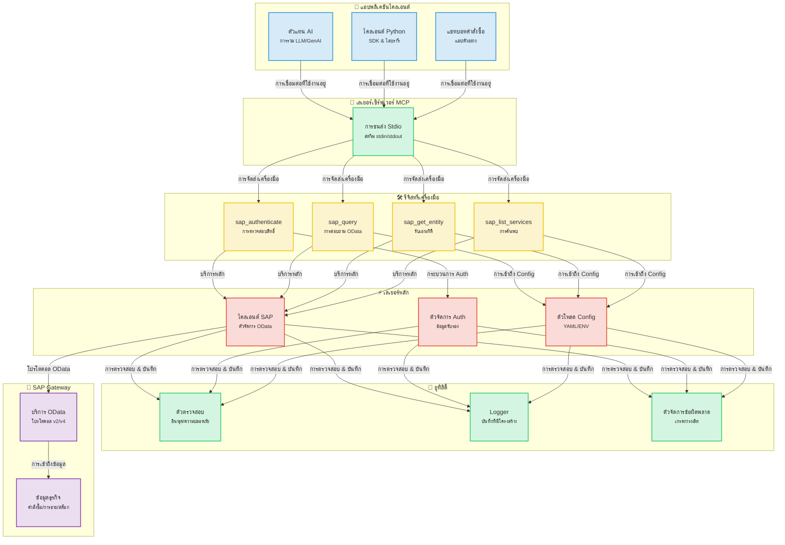
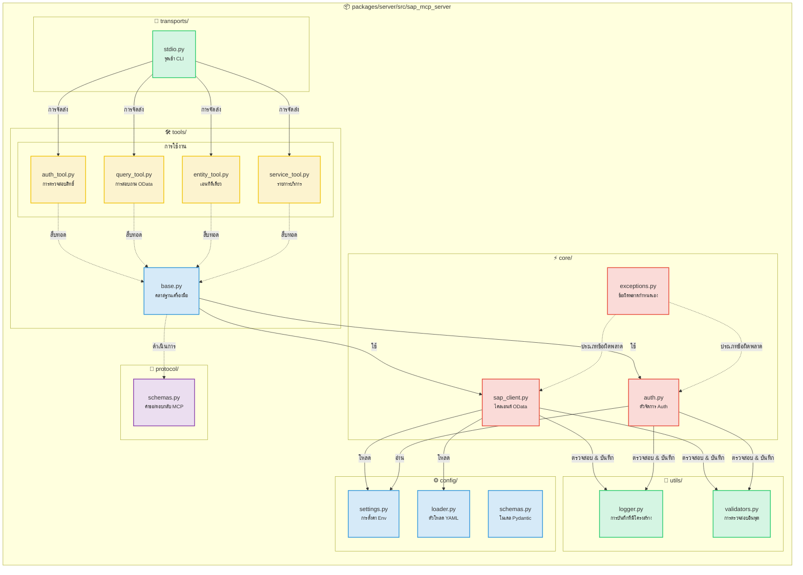
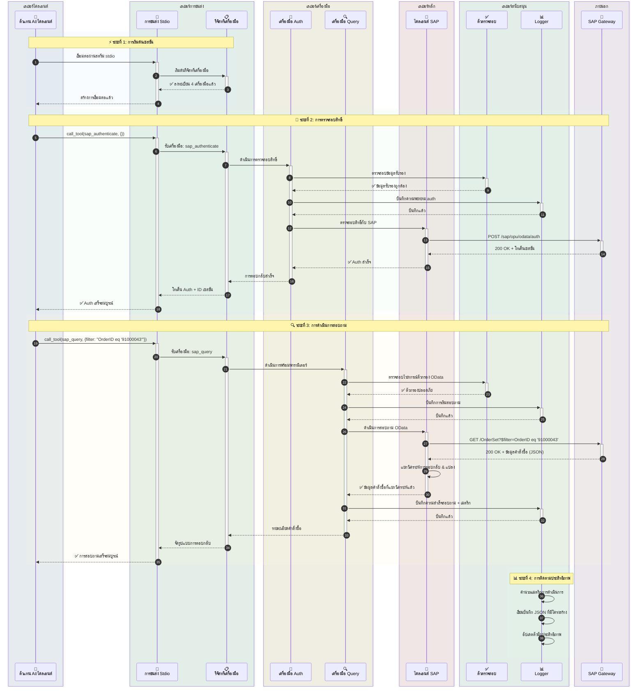
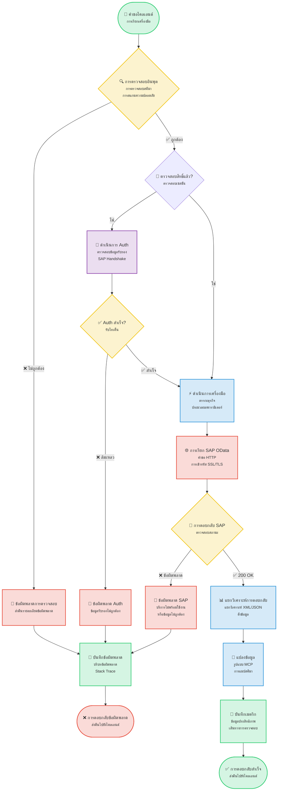
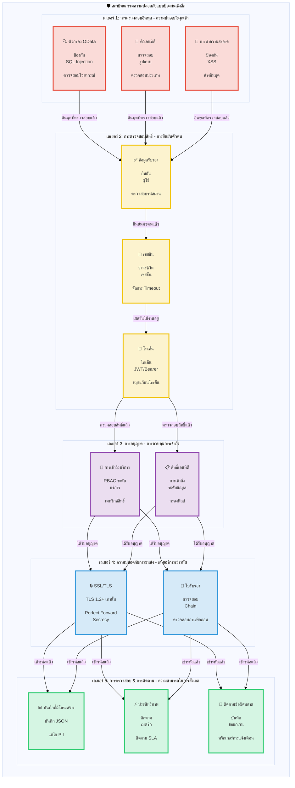

# SAP MCP - การรวม SAP Gateway ผ่าน Model Context Protocol

เซิร์ฟเวอร์ MCP ที่สมบูรณ์สำหรับการรวม SAP Gateway ให้เครื่องมือแบบแยกส่วนสำหรับตัวแทน AI และการดำเนินงาน SAP OData

<div align="center">

[](https://www.python.org/downloads/)
[](LICENSE)
[]()
[]()
[]()

</div>

---
## 📑 สารบัญ

- [🎯 ภาพรวมโครงการ](#-ภาพรวมโครงการ)
- [📋 การเตรียมการ](#-การเตรียมการ)
- [📐 สถาปัตยกรรม](#-สถาปัตยกรรม)
  - [ภาพรวมระบบ](#ภาพรวมระบบ)
  - [รายละเอียดส่วนประกอบ](#รายละเอียดส่วนประกอบ)
  - [การไหลของข้อมูล](#การไหลของข้อมูล-ตัวอย่างการสอบถามคำสั่งซื้อ)
  - [การไหลของการทำงานของเครื่องมือ](#การไหลของการทำงานของเครื่องมือ)
  - [สถาปัตยกรรมความปลอดภัย](#สถาปัตยกรรมความปลอดภัย)
- [📦 โครงสร้างที่เก็บข้อมูล](#-โครงสร้างที่เก็บข้อมูล)
- [✨ คุณสมบัติ](#-คุณสมบัติ)
- [🎓 สถานการณ์สาธิต SAP SFLIGHT](#-สถานการณ์สาธิต-sap-sflight)
  - [ภาพรวมสถานการณ์](#ภาพรวมสถานการณ์)
  - [คู่มือการสร้างบริการ OData](#คู่มือการสร้างบริการ-odata)
- [🚀 เริ่มต้นอย่างรวดเร็ว](#-เริ่มต้นอย่างรวดเร็ว)
  - [ข้อกำหนดเบื้องต้นของเซิร์ฟเวอร์ MCP](#ข้อกำหนดเบื้องต้นของเซิร์ฟเวอร์-mcp)
  - [การติดตั้ง](#1-การติดตั้ง)
  - [การกำหนดค่า](#2-การกำหนดค่า)
  - [การรันเซิร์ฟเวอร์](#3-การรันเซิร์ฟเวอร์)
- [🤖 การรวมกับ Gemini CLI](#-การรวมกับ-gemini-cli)
  - [ข้อกำหนดเบื้องต้น](#ข้อกำหนดเบื้องต้น)
  - [การติดตั้ง Gemini CLI](#1-การติดตั้ง-gemini-cli)
  - [การตรวจสอบสิทธิ์ Gemini CLI](#2-การตรวจสอบสิทธิ์-gemini-cli)
  - [การลงทะเบียนเซิร์ฟเวอร์ SAP MCP](#3-การลงทะเบียนเซิร์ฟเวอร์-sap-mcp)
  - [เริ่มใช้งาน](#4-เริ่มใช้งาน-sap-mcp-ใน-gemini-cli)
  - [การกำหนดค่าขั้นสูง](#การกำหนดค่าขั้นสูง)
  - [การแก้ไขปัญหา](#การแก้ไขปัญหา)
  - [เครื่องมือที่มีให้](#เครื่องมือ-sap-ที่มีให้ใน-gemini-cli)
  - [ตัวอย่างเวิร์กโฟลว์](#ตัวอย่างเวิร์กโฟลว์)
- [🔧 เครื่องมือที่มีให้](#-เครื่องมือที่มีให้)
  - [การตรวจสอบสิทธิ์ SAP (sap_authenticate)](#1-การตรวจสอบสิทธิ์-sap-sap_authenticate)
  - [การสอบถาม SAP (sap_query)](#2-การสอบถาม-sap-sap_query)
  - [รับเอนทิตี SAP (sap_get_entity)](#3-รับเอนทิตี-sap-sap_get_entity)
  - [รายการบริการ SAP (sap_list_services)](#4-รายการบริการ-sap-sap_list_services)
  - [การเพิ่มเครื่องมือใหม่](#5-การเพิ่มเครื่องมือใหม่)
- [📚 ตัวอย่างการใช้งาน](#-ตัวอย่างการใช้งาน)
- [🔒 ความปลอดภัย](#-ความปลอดภัย)
- [📖 เอกสารประกอบ](#-เอกสารประกอบ)
- [📝 ใบอนุญาต](#-ใบอนุญาต)
- [🙏 กิตติกรรมประกาศ](#-กิตติกรรมประกาศ)

---


## 🎯 ภาพรวมโครงการ

นี่คือเซิร์ฟเวอร์ Model Context Protocol (MCP) ที่พร้อมสำหรับการใช้งานจริง ออกแบบมาเพื่อให้ตัวแทน AI และแอปพลิเคชันสามารถโต้ตอบกับระบบ SAP Gateway ผ่านสถาปัตยกรรมที่ชัดเจนและเป็นโมดูล สร้างขึ้นเพื่อความน่าเชื่อถือ ความปลอดภัย และประสบการณ์ของนักพัฒนา

**สถานะปัจจุบัน**: ✅ **พร้อมสำหรับการใช้งานจริง** (เสร็จสิ้นทั้ง 5 ระยะ)

### คุณสมบัติหลัก

- 🔐 **การรวม SAP ที่ปลอดภัย**: การตรวจสอบสิทธิ์ระดับองค์กรและการรองรับ SSL/TLS
- 🛠️ **4 เครื่องมือแบบโมดูล**: การตรวจสอบสิทธิ์, การสอบถาม, การรับเอนทิตี และการค้นพบบริการ
- 🚀 **การขนส่ง Stdio**: เซิร์ฟเวอร์ MCP เกรดการผลิต
- 📊 **การบันทึกที่มีโครงสร้าง**: รูปแบบ JSON และคอนโซลพร้อมเมตริกประสิทธิภาพ
- ✅ **อินพุตที่ผ่านการตรวจสอบ**: การตรวจสอบ OData และความปลอดภัยที่ครอบคลุม
- 🧪 **ทดสอบอย่างเต็มที่**: ความครอบคลุม 56%, ผ่านการทดสอบ 44/45 (อัตราความสำเร็จ 98%)

---

---

## 📋 การเตรียมการ

เริ่มต้นกับ SAP MCP ใน 5 นาที:

```bash
# 1. โคลนและเข้าสู่
git clone <repository-url>
cd sap-mcp

# 2. สร้าง venv และติดตั้ง
python3 -m venv .venv
source .venv/bin/activate  # Windows: .venv\Scripts\activate
cd packages/server
pip install -e .

# 3. กำหนดค่าการเชื่อมต่อ SAP
cd ../..
cp .env.server.example .env.server
# แก้ไข .env.server ด้วยข้อมูลรับรอง SAP ของคุณ

# 4. กำหนดค่าบริการ
cp packages/server/config/services.yaml.example packages/server/config/services.yaml
# แก้ไข services.yaml เพื่อกำหนดค่าบริการ SAP ของคุณ

# 5. รันเซิร์ฟเวอร์
sap-mcp-server-stdio
```

**ขั้นตอนถัดไป:**
- 📖 สำหรับคำแนะนำการติดตั้งโดยละเอียด ดู [เริ่มต้นอย่างรวดเร็ว](#-เริ่มต้นอย่างรวดเร็ว)
- 🤖 เพื่อเชื่อมต่อตัวแทน AI ตรวจสอบ [การรวมกับ Gemini CLI](#-การรวมกับ-gemini-cli)
- 🔧 สำหรับเอกสาร API สำรวจ [เครื่องมือที่มีให้](#-เครื่องมือที่มีให้)

## 📐 สถาปัตยกรรม

### ภาพรวมระบบ

<details>
<summary>📊 ดูแผนภาพภาพรวมระบบ (คลิกเพื่อขยาย)</summary>



</details>

### รายละเอียดส่วนประกอบ

<details>
<summary>🔧 ดูแผนภาพรายละเอียดส่วนประกอบ (คลิกเพื่อขยาย)</summary>



</details>

### การไหลของข้อมูล: ตัวอย่างการสอบถามคำสั่งซื้อ

<details>
<summary>🔄 ดูแผนภาพการไหลของข้อมูล (คลิกเพื่อขยาย)</summary>



</details>

### การไหลของการทำงานของเครื่องมือ

<details>
<summary>⚡ ดูแผนภาพการไหลของการทำงานของเครื่องมือ (คลิกเพื่อขยาย)</summary>



</details>

### สถาปัตยกรรมความปลอดภัย

<details>
<summary>🔒 ดูแผนภาพสถาปัตยกรรมความปลอดภัย (คลิกเพื่อขยาย)</summary>



</details>

---

## 📦 โครงสร้างที่เก็บข้อมูล

```
sap-mcp/
├── packages/
│   └── server/                          ✅ เซิร์ฟเวอร์ MCP พร้อมใช้งานจริง
│       ├── src/sap_mcp_server/
│       │   ├── core/                    # ไคลเอนต์ SAP & Auth (4 ไฟล์)
│       │   │   ├── __init__.py          # Init โมดูล
│       │   │   ├── sap_client.py        # การดำเนินการ OData
│       │   │   ├── auth.py              # การจัดการข้อมูลรับรอง
│       │   │   └── exceptions.py        # ข้อยกเว้นกำหนดเอง
│       │   ├── config/                  # การกำหนดค่า (4 ไฟล์)
│       │   │   ├── __init__.py          # Init โมดูล
│       │   │   ├── settings.py          # การตั้งค่า Env
│       │   │   ├── loader.py            # ตัวโหลด YAML
│       │   │   └── schemas.py           # โมเดล Pydantic
│       │   ├── protocol/                # โปรโตคอล MCP (2 ไฟล์)
│       │   │   ├── __init__.py          # Init โมดูล
│       │   │   └── schemas.py           # สคีมา Req/Res
│       │   ├── tools/                   # 4 เครื่องมือ SAP แบบโมดูล (6 ไฟล์)
│       │   │   ├── __init__.py          # รีจิสทรีเครื่องมือ
│       │   │   ├── base.py              # คลาสฐานเครื่องมือ
│       │   │   ├── auth_tool.py         # การตรวจสอบสิทธิ์
│       │   │   ├── query_tool.py        # การสอบถาม OData
│       │   │   ├── entity_tool.py       # รับเอนทิตี
│       │   │   └── service_tool.py      # การค้นพบบริการ
│       │   ├── transports/              # เลเยอร์การขนส่ง (2 ไฟล์)
│       │   │   ├── __init__.py          # Init โมดูล
│       │   │   └── stdio.py             # การขนส่ง Stdio ✅
│       │   ├── utils/                   # ยูทิลิตี้ (3 ไฟล์)
│       │   │   ├── __init__.py          # Init โมดูล
│       │   │   ├── logger.py            # การบันทึกที่มีโครงสร้าง
│       │   │   └── validators.py        # การตรวจสอบอินพุต
│       │   └── __init__.py              # Init แพ็คเกจ
│       ├── config/                      # การกำหนดค่าเซิร์ฟเวอร์
│       │   ├── services.yaml            # Config บริการ SAP
│       │   └── services.yaml.example    # เทมเพลต Config
│       ├── tests/                       # ชุดทดสอบ (7 ไฟล์, ความครอบคลุม 56%)
│       │   ├── __init__.py              # Init แพ็คเกจทดสอบ
│       │   ├── conftest.py              # Pytest fixtures
│       │   ├── unit/                    # การทดสอบหน่วย
│       │   │   ├── __init__.py          # แพ็คเกจทดสอบหน่วย
│       │   │   ├── test_base.py         # การทดสอบเครื่องมือฐาน
│       │   │   └── test_validators.py   # การทดสอบตัวตรวจสอบ
│       │   └── integration/             # การทดสอบการรวม
│       │       ├── __init__.py          # แพ็คเกจทดสอบการรวม
│       │       └── test_tool_integration.py  # การทดสอบการรวมเครื่องมือ
│       ├── pyproject.toml               # Config แพ็คเกจ
│       └── README.md                    # เอกสารแพ็คเกจเซิร์ฟเวอร์
│
├── docs/                                # เอกสารประกอบ
│   ├── architecture/                    # เอกสารสถาปัตยกรรม
│   │   └── server.md                    # สถาปัตยกรรมเซิร์ฟเวอร์
│   └── guides/                          # คู่มือผู้ใช้
│       ├── configuration.md             # คู่มือการกำหนดค่า
│       ├── deployment.md                # คู่มือการปรับใช้
│       ├── troubleshooting.md           # คู่มือการแก้ไขปัญหา
│       ├── odata-service-creation-flight-demo.md  # การสร้างบริการ OData
│       └── sfight-demo-guide.md         # คู่มือสาธิต SFLIGHT
│
├── examples/                            # แอปพลิเคชันตัวอย่าง
│   ├── basic/                           # ตัวอย่างพื้นฐาน
│   │   └── stdio_client.py              # ตัวอย่างไคลเอนต์ Stdio
│   ├── chatbot/                         # ตัวอย่างแชทบอท
│   │   └── order_inquiry_chatbot.py     # แชทบอทสอบถามคำสั่งซื้อ
│   └── README.md                        # เอกสารตัวอย่าง
│
├── scripts/                             # สคริปต์การพัฒนา
│   ├── create_structure.sh              # การสร้างโครงสร้างโครงการ
│   ├── migrate_code.sh                  # สคริปต์ย้ายโค้ด
│   └── update_imports.py                # สคริปต์อัปเดตการนำเข้า
│
├── .env.server.example                  # เทมเพลตสภาพแวดล้อม
├── README.md                            # เอกสารหลัก (ภาษาอังกฤษ)
├── README.ja.md                         # เอกสารภาษาญี่ปุ่น
├── README.ko.md                         # เอกสารภาษาเกาหลี
├── README.th.md                         # เอกสารภาษาไทย
├── README.zh-TW.md                      # เอกสารภาษาจีนตัวเต็ม
└── README.zh-CN.md                      # เอกสารภาษาจีนตัวย่อ
```

---

## ✨ คุณสมบัติ

### ความสามารถหลัก

<table>
<tr>
<td width="50%">

#### 🛠️ เครื่องมือ
- ✅ **sap_authenticate**: การตรวจสอบสิทธิ์ SAP ที่ปลอดภัย
- ✅ **sap_query**: การสอบถาม OData พร้อมตัวกรอง
- ✅ **sap_get_entity**: การรับเอนทิตีเดียว
- ✅ **sap_list_services**: การค้นพบบริการ

</td>
<td width="50%">

#### 🚀 การขนส่ง
- ✅ **Stdio**: stdin/stdout พร้อมใช้งานจริง

</td>
</tr>
<tr>
<td>

#### 📊 การบันทึกและการติดตาม
- ✅ **บันทึกที่มีโครงสร้าง**: JSON + คอนโซล
- ✅ **เมตริกประสิทธิภาพ**: เวลาคำขอ
- ✅ **ติดตามข้อผิดพลาด**: บริบทเต็มรูปแบบ
- ✅ **เส้นทางการตรวจสอบ**: เหตุการณ์ความปลอดภัย

</td>
<td>

#### 🔒 ความปลอดภัย
- ✅ **การตรวจสอบอินพุต**: OData & ความปลอดภัย
- ✅ **รองรับ SSL/TLS**: การเชื่อมต่อที่ปลอดภัย
- ✅ **การจัดการข้อมูลรับรอง**: .env.server
- ✅ **การจัดการข้อผิดพลาด**: เกรดการผลิต

</td>
</tr>
</table>

### ประสบการณ์ของนักพัฒนา

- ✅ **สถาปัตยกรรมโมดูลาร์**: หนึ่งไฟล์ต่อเครื่องมือ
- ✅ **ความปลอดภัยของประเภท**: Type hints เต็มรูปแบบ
- ✅ **เอกสารประกอบ**: คู่มือที่ครอบคลุม
- ✅ **ติดตั้งง่าย**: `pip install -e .`
- ✅ **โหลดซ้ำร้อน**: โหมดการพัฒนา
- ✅ **แอปตัวอย่าง**: 3 ตัวอย่างที่ใช้งานได้

---

## 🎓 สถานการณ์สาธิต SAP SFLIGHT

### ภาพรวมสถานการณ์

เพื่อความสะดวกในการเข้าถึง โครงการนี้อิงตามชุดข้อมูลสาธิต SAP SFLIGHT

ชุดข้อมูล SFLIGHT เป็นฐานข้อมูลตัวอย่างมาตรฐานที่ SAP จัดเตรียมไว้ ซึ่งประกอบด้วยตารางเวลาเที่ยวบิน สายการบิน สนามบิน และข้อมูลการจอง เป็นแหล่งข้อมูลที่ยอดเยี่ยมสำหรับการทดสอบและสาธิตการสร้างแบบจำลองข้อมูลและการสร้างบริการ

คู่มือนี้ถือว่าคุณมีบริการ OData ที่เปิดเผยชุดข้อมูลนี้ เป้าหมายคือการเชื่อมต่อเซิร์ฟเวอร์ SAP MCP กับบริการนี้และโต้ตอบกับมันโดยใช้ตัวแทน AI หรือไคลเอนต์อื่น ๆ

**เอกสารอย่างเป็นทางการของ SAP:**
- [SAP Documentation - Flight Model](https://help.sap.com/SAPhelp_nw73/helpdata/en/cf/21f304446011d189700000e8322d00/frameset.htm)
- [SAP Help Portal - Flight Model](https://help.sap.com/docs/SAP_NETWEAVER_702/ff5206fc6c551014a1d28b076487e7df/cf21f304446011d189700000e8322d00.html)

---

### คู่มือการสร้างบริการ OData

คู่มือนี้จะแนะนำคุณเกี่ยวกับการสร้างบริการ OData ในระบบ SAP ของคุณโดยใช้ SAP Gateway Service Builder (`SEGW`) เพื่อเปิดเผยข้อมูลสถานการณ์ Flight ซึ่งโดยทั่วไปจะมีอยู่ในรุ่น SAP S/4HANA Fully Activated Appliance (FAA)

#### ภาพรวมสถานการณ์

* **เป้าหมาย:** เปิดเผยตารางเวลาเที่ยวบิน การจอง และข้อมูลหลักที่เกี่ยวข้องผ่านบริการ OData
* **ข้อกำหนดข้อมูลสถานการณ์:** ตารางเวลาเที่ยวบิน, วันที่, เวลา, รายละเอียดสนามบิน, รายละเอียดสายการบิน, รายละเอียดผู้โดยสาร, ราคา, ฯลฯ
* **ตาราง SAP ที่เกี่ยวข้อง:** `SFLIGHT`, `SPFLI`, `SCARR`, `SAIRPORT`, `SBOOK`, `SCUSTOM`

---

#### ขั้นตอนในการสร้างบริการ OData ใน SEGW

##### 1. เข้าถึง SAP Gateway Service Builder

ไปที่รหัสธุรกรรม SAP `SEGW`

##### 2. สร้างโครงการใหม่

1. คลิกปุ่ม "Create Project"
2. **Project Name:** กำหนดชื่อ (เช่น `Z_TRAVEL_RECOMMENDATIONS_SRV`)
3. **Description:** ป้อนคำอธิบายที่มีความหมาย
4. **Package:** กำหนดให้กับแพ็คเกจ (เช่น `$TMP` สำหรับการพัฒนาในเครื่องหรือแพ็คเกจที่ขนส่งได้)

##### 3. นำเข้าแบบจำลองข้อมูลจากโครงสร้าง DDIC

ขั้นตอนนี้กำหนดเอนทิตี OData ตามตาราง SAP พื้นฐาน

1. คลิกขวาที่โฟลเดอร์ "Data Model" ในโครงการของคุณ
2. เลือก **"Import" -> "DDIC Structure"**
3. ทำซ้ำกระบวนการนำเข้าสำหรับแต่ละตารางที่ต้องการ โดยระบุ **Entity Type Name** และเลือกฟิลด์ที่ต้องการ

***การดำเนินการที่จำเป็น:*** ตรวจสอบให้แน่ใจว่าได้ทำเครื่องหมายฟิลด์คีย์อย่างถูกต้องระหว่างการนำเข้า

| โครงสร้าง DDIC | ชื่อประเภทเอนทิตี | ฟิลด์คีย์ที่แนะนำ | ฟิลด์ Payload ที่เกี่ยวข้อง (ตัวอย่าง) |
| :---- | :---- | :---- | :---- |
| `SFLIGHT` | **Flight** | `CARRID`, `CONNID`, `FLDATE` | `PRICE`, `CURRENCY`, `PLANETYPE`, `SEATSMAX`, `SEATSOCC` |
| `SPFLI` | **Connection** | `CARRID`, `CONNID` | `COUNTRYFR`, `CITYFROM`, `AIRPFROM`, `COUNTRYTO`, `CITYTO`, `AIRPTO`, `DEPTIME`, `ARRTIME`, `DISTANCE` |
| `SCARR` | **Airline** | `CARRID` | `CARRNAME`, `CURRCODE`, `URL` |
| `SAIRPORT` | **Airport** | `ID` | `NAME`, `CITY`, `COUNTRY` |
| `SBOOK` | **Booking** | `CARRID`, `CONNID`, `FLDATE`, `BOOKID` | `CUSTOMID`, `CUSTTYPE`, `SMOKER`, `LUGGWEIGHT`, `WUNIT`, `INVOICE`, `CLASS`, `FORCURAM`, `ORDER_DATE` |
| `SCUSTOM` | **Passenger** | `ID` | `NAME`, `FORM`, `STREET`, `POSTCODE`, `CITY`, `COUNTRY`, `PHONE` |

##### 4. กำหนดความสัมพันธ์และคุณสมบัติการนำทาง

ความสัมพันธ์เชื่อมโยงเอนทิตีตามฟิลด์คีย์ คุณสมบัติการนำทางช่วยให้แอปพลิเคชันไคลเอนต์สามารถข้ามความสัมพันธ์เหล่านี้ได้อย่างง่ายดาย (เช่น การใช้ `$expand`)

**ความสัมพันธ์เชิงตรรกะ:**

* **1:N:** สายการบิน <-> เที่ยวบิน, สายการบิน <-> การเชื่อมต่อ, การเชื่อมต่อ <-> เที่ยวบิน, เที่ยวบิน <-> การจอง, ผู้โดยสาร <-> การจอง
* **N:1:** การเชื่อมต่อ <-> สนามบินต้นทาง, การเชื่อมต่อ <-> สนามบินปลายทาง

**ขั้นตอนในการสร้างความสัมพันธ์:**

1. คลิกขวาที่ "Data Model" -> **"Create" -> "Association"**
2. กำหนด **Association Name**, **Principal Entity** (ฝั่ง '1'), **Dependent Entity** (ฝั่ง 'หลาย'), และ **Cardinality** (เช่น 1:N)
3. ในหน้าจอถัดไป ทำ **Specify Key Mapping** โดยจับคู่ฟิลด์คีย์ระหว่างเอนทิตีหลักและเอนทิตีที่ขึ้นต่อกัน

**ความสัมพันธ์เฉพาะที่จะสร้าง:**

| ลำดับ | ชื่อความสัมพันธ์ | หลัก:ขึ้นต่อกัน | คาร์ดินาลิตี้ | การแมปคีย์ |
| :---- | :---- | :---- | :---- | :---- |
| 1 | `Assoc_Airline_Flights` | `Airline` : `Flight` | 1:N | `Airline.CARRID` <-> `Flight.CARRID` |
| 2 | `Assoc_Airline_Connections` | `Airline` : `Connection` | 1:N | `Airline.CARRID` <-> `Connection.CARRID` |
| 3 | `Assoc_Connection_Flights` | `Connection` : `Flight` | 1:N | `CARRID` & `CONNID` (ทั้งคู่) |
| 4 | `Assoc_Flight_Bookings` | `Flight` : `Booking` | 1:N | `CARRID`, `CONNID`, `FLDATE` (ทั้ง 3) |
| 5 | `Assoc_Passenger_Bookings` | `Passenger` : `Booking` | 1:N | `Passenger.ID` <-> `Booking.CUSTOMID` |
| 6 | `Assoc_Connection_OriginAirport` | `Connection` : `Airport` | N:1 | `Connection.AIRPFROM` <-> `Airport.ID` |
| 7 | `Assoc_Connection_DestAirport` | `Connection` : `Airport` | N:1 | `Connection.AIRPTO` <-> `Airport.ID` |

**คุณสมบัติการนำทางที่จะสร้าง:**

| เอนทิตี | ชื่อคุณสมบัติการนำทาง | เอนทิตีเป้าหมาย | ความสัมพันธ์ที่ใช้ |
| :---- | :---- | :---- | :---- |
| **Airline** | `ToFlights`, `ToConnections` | `Flight`, `Connection` | `Assoc_Airline_Flights`, `Assoc_Airline_Connections` |
| **Flight** | `ToAirline`, `ToConnection`, `ToBookings` | `Airline`, `Connection`, `Booking` | `Assoc_Airline_Flights`, `Assoc_Connection_Flights`, `Assoc_Flight_Bookings` |
| **Connection** | `ToAirline`, `ToFlights`, `ToOriginAirport`, `ToDestinationAirport` | `Airline`, `Flight`, `Airport`, `Airport` | `Assoc_Airline_Connections`, `Assoc_Connection_Flights`, `Assoc_Connection_OriginAirport`, `Assoc_Connection_DestAirport` |
| **Booking** | `ToFlight`, `ToPassenger` | `Flight`, `Passenger` | `Assoc_Flight_Bookings`, `Assoc_Passenger_Bookings` |
| **Passenger** | `ToBookings` | `Booking` | `Assoc_Passenger_Bookings` |

##### 5. สร้างออบเจกต์รันไทม์

1. คลิกปุ่ม **"Generate Runtime Objects"** (ไอคอนไม้กายสิทธิ์)
2. สิ่งนี้จะสร้าง Model Provider Class (MPC) และ Data Provider Class (DPC) ซึ่งเป็นคลาส ABAP
3. ยอมรับชื่อคลาสเริ่มต้นหรือปรับเปลี่ยน

##### 6. ใช้เมธอด Data Provider Class (DPC)

คลาสส่วนขยาย DPC ที่สร้างขึ้น (เช่น `ZCL_Z_TRAVEL_RECOM_DPC_EXT`) คือที่ที่ตรรกะกำหนดเองของคุณอยู่

* หากการแมปตารางโดยตรงเพียงพอ การใช้งานพื้นฐานอาจเพียงพอ
* สำหรับการกรองที่กำหนดเอง การเข้าร่วม การคำนวณ หรือการดำเนินการอ่าน/สร้าง/อัปเดต/ลบ (CRUD) ที่ซับซ้อน คุณจะต้องกำหนดเมธอดใหม่ เช่น `*_GET_ENTITY` (ระเบียนเดียว) และ `*_GET_ENTITYSET` (คอลเลกชัน) ในคลาสส่วนขยาย DPC

ตัวอย่างสำหรับเมธอด AIRLINESET_GET_ENTITYSET:

```abap
METHOD airlineset_get_entityset.
  DATA: lt_airlines TYPE TABLE OF scarr,
        ls_airline TYPE scarr,
        lv_filter_string TYPE string.

  TRY.
      lv_filter_string = io_tech_request_context->get_filter( )->get_filter_string( ).
    CATCH cx_sy_itab_line_not_found.
      CLEAR lv_filter_string.
  ENDTRY.

  " TODO: Apply filtering based on lv_filter_string"
  IF lv_filter_string IS NOT INITIAL.
    SELECT * FROM scarr INTO TABLE lt_airlines WHERE (lv_filter_string).
  ELSE.
    SELECT * FROM scarr INTO TABLE lt_airlines.
  ENDIF.

  LOOP AT lt_airlines INTO ls_airline.
    APPEND ls_airline TO et_entityset.
  ENDLOOP.
ENDMETHOD.
```

##### 7. ลงทะเบียนบริการ

1. ไปที่ธุรกรรม `/IWFND/MAINT_SERVICE`
2. คลิก **"Add Service"**
3. ป้อน **System Alias** ของระบบแบ็กเอนด์ของคุณ (เช่น `LOCAL`)
4. ค้นหา **Technical Service Name** (เช่น `Z_TRAVEL_RECOMMENDATIONS_SRV`)
5. เลือกบริการและคลิก **"Add Selected Services"**
6. กำหนดแพ็คเกจและยืนยัน

##### 8. เปิดใช้งานและทดสอบบริการ

1. ใน `/IWFND/MAINT_SERVICE` ค้นหาบริการที่ลงทะเบียนใหม่ของคุณ
2. ตรวจสอบให้แน่ใจว่า **ICF Node is Active** (ไฟเขียว) หากไม่ ให้เลือกบริการและไปที่ **"ICF Node" -> "Activate"**
3. เลือกบริการและคลิกปุ่ม **"SAP Gateway Client"**
4. **ทดสอบใน Gateway Client:**
   * ทดสอบการดึงคอลเลกชันเอนทิตี: คลิก **"EntitySets"** เลือก EntitySet (เช่น `AirlineCollection`) และคลิก **"Execute"**
   * ทดสอบคุณสมบัติ OData: ลองใช้ตัวเลือกการสอบถามเช่น `$filter` และตรวจสอบโดยเฉพาะว่าคุณสมบัติการนำทางทำงานหรือไม่โดยใช้ **`$expand`** (เช่น `/FlightSet(key)?$expand=ToAirline`)

##### 9. ตรวจสอบ URL ของบริการ

URL ของบริการ OData สุดท้ายสามารถดูได้ใน Gateway Client โดยทั่วไปจะเป็นโครงสร้างดังนี้:

`/sap/opu/odata/sap/Z_TRAVEL_RECOMMENDATIONS_SRV/.` นี่คือ URL ที่แอปพลิเคชันไคลเอนต์ของคุณ (เช่น Fiori หรือแอปมือถือที่กำหนดเอง) จะใช้เพื่อใช้ข้อมูล SFLIGHT

---

## 🚀 เริ่มต้นอย่างรวดเร็ว

### ข้อกำหนดเบื้องต้นของเซิร์ฟเวอร์ MCP

#### ความต้องการของระบบ

- **Python 3.11 หรือสูงกว่า**
- **pip** (ตัวติดตั้งแพ็คเกจ Python)
- **Git** (สำหรับการโคลนที่เก็บข้อมูล)
- ข้อมูลรับรองการเข้าถึง SAP Gateway
- การสนับสนุนสภาพแวดล้อมเสมือน

#### การติดตั้ง Python

<details>
<summary><b>🪟 Windows</b></summary>

**ตัวเลือก 1: Microsoft Store (แนะนำสำหรับ Windows 10/11)**
```powershell
# ค้นหา "Python 3.11" หรือ "Python 3.12" ใน Microsoft Store
# หรือดาวน์โหลดจาก python.org
```

**ตัวเลือก 2: ตัวติดตั้ง Python.org**
1. ดาวน์โหลดจาก [python.org/downloads](https://www.python.org/downloads/)
2. เรียกใช้ตัวติดตั้ง
3. ✅ **ทำเครื่องหมาย "Add Python to PATH"**
4. คลิก "Install Now"

**ตรวจสอบการติดตั้ง:**
```powershell
python --version
# ผลลัพธ์: Python 3.11.x หรือสูงกว่า

pip --version
# ผลลัพธ์: pip 23.x.x หรือสูงกว่า
```

**ปัญหาทั่วไป:**
- หากไม่พบคำสั่ง `python` ให้ลอง `python3` หรือ `py`
- หากไม่พบ `pip` ให้ติดตั้ง: `python -m ensurepip --upgrade`

</details>

<details>
<summary><b>🍎 macOS</b></summary>

**ตัวเลือก 1: Homebrew (แนะนำ)**
```bash
# ติดตั้ง Homebrew หากยังไม่มี
/bin/bash -c "$(curl -fsSL https://raw.githubusercontent.com/Homebrew/install/HEAD/install.sh)"

# ติดตั้ง Python
brew install python@3.11
# หรือ
brew install python@3.12
```

**ตัวเลือก 2: ตัวติดตั้ง Python.org**
1. ดาวน์โหลดจาก [python.org/downloads/macos](https://www.python.org/downloads/macos/)
2. เปิดไฟล์ `.pkg`
3. ทำตามวิซาร์ดการติดตั้ง

**ตรวจสอบการติดตั้ง:**
```bash
python3 --version
# ผลลัพธ์: Python 3.11.x หรือสูงกว่า

pip3 --version
# ผลลัพธ์: pip 23.x.x หรือสูงกว่า
```

**หมายเหตุ:** macOS อาจมาพร้อมกับ Python 2.7 ที่ติดตั้งไว้ล่วงหน้า ใช้คำสั่ง `python3` และ `pip3` เสมอ

</details>

<details>
<summary><b>🐧 Linux</b></summary>

**Ubuntu/Debian:**
```bash
# อัปเดตรายการแพ็คเกจ
sudo apt update

# ติดตั้ง Python 3.11+
sudo apt install python3.11 python3.11-venv python3-pip

# หรือสำหรับ Python ล่าสุด
sudo apt install python3 python3-venv python3-pip
```

**Fedora/RHEL/CentOS:**
```bash
# ติดตั้ง Python 3.11+
sudo dnf install python3.11 python3-pip

# หรือ
sudo yum install python3 python3-pip
```

**Arch Linux:**
```bash
sudo pacman -S python python-pip
```

**ตรวจสอบการติดตั้ง:**
```bash
python3 --version
# ผลลัพธ์: Python 3.11.x หรือสูงกว่า

pip3 --version
# ผลลัพธ์: pip 23.x.x หรือสูงกว่า
```

</details>

---

### 1. การติดตั้ง

#### การติดตั้งทีละขั้นตอน

<details open>
<summary><b>🪟 Windows (PowerShell/Command Prompt)</b></summary>

```powershell
# โคลนที่เก็บข้อมูล
git clone <repository-url>
cd sap-mcp

# สร้างสภาพแวดล้อมเสมือน
python -m venv .venv

# เปิดใช้งานสภาพแวดล้อมเสมือน
.venv\Scripts\activate
# หรือใน PowerShell:
# .venv\Scripts\Activate.ps1

# หาก PowerShell ให้ข้อผิดพลาดนโยบายการดำเนินการ:
# Set-ExecutionPolicy -ExecutionPolicy RemoteSigned -Scope CurrentUser

# ตรวจสอบการเปิดใช้งาน (ควรเห็น (.venv) ในพรอมต์)
# (.venv) PS C:\path\to\sap-mcp>

# ติดตั้งแพ็คเกจเซิร์ฟเวอร์
cd packages\server
pip install -e .

# ติดตั้งการพึ่งพาการพัฒนา (ทางเลือก)
pip install -e ".[dev]"

# ตรวจสอบการติดตั้ง
sap-mcp-server-stdio --help
```

**ปัญหาทั่วไปใน Windows:**
- **ไม่พบ `python`**: ลอง `python3` หรือ `py`
- **การอนุญาตถูกปฏิเสธ**: เรียกใช้ PowerShell ในฐานะผู้ดูแลระบบ
- **นโยบายการดำเนินการ**: เรียกใช้ `Set-ExecutionPolicy -ExecutionPolicy RemoteSigned -Scope CurrentUser`
- **การรองรับเส้นทางยาว**: เปิดใช้งานเส้นทางยาวใน Windows (การตั้งค่า > ระบบ > เกี่ยวกับ > การตั้งค่าระบบขั้นสูง)

</details>

<details>
<summary><b>🍎 macOS (Terminal)</b></summary>

```bash
# โคลนที่เก็บข้อมูล
git clone <repository-url>
cd sap-mcp

# สร้างสภาพแวดล้อมเสมือน
python3 -m venv .venv

# เปิดใช้งานสภาพแวดล้อมเสมือน
source .venv/bin/activate

# ตรวจสอบการเปิดใช้งาน (ควรเห็น (.venv) ในพรอมต์)
# (.venv) user@macbook sap-mcp %

# ติดตั้งแพ็คเกจเซิร์ฟเวอร์
cd packages/server
pip install -e .

# ติดตั้งการพึ่งพาการพัฒนา (ทางเลือก)
pip install -e ".[dev]"

# ตรวจสอบการติดตั้ง
sap-mcp-server-stdio --help

# ตรวจสอบเส้นทางการติดตั้ง (มีประโยชน์สำหรับ config ของ Gemini CLI)
which sap-mcp-server-stdio
# ตัวอย่างผลลัพธ์: /Users/username/sap-mcp/.venv/bin/sap-mcp-server-stdio
```

**ปัญหาทั่วไปใน macOS:**
- **ไม่พบ `python`**: ใช้ `python3` แทน
- **ไม่พบ `pip`**: ใช้ `pip3` แทน
- **การอนุญาตถูกปฏิเสธ**: อย่าใช้ `sudo` ภายในสภาพแวดล้อมเสมือน
- **ไม่พบคำสั่งหลังการติดตั้ง**: ตรวจสอบให้แน่ใจว่าเปิดใช้งานสภาพแวดล้อมเสมือนแล้ว

</details>

<details>
<summary><b>🐧 Linux (Bash/Zsh)</b></summary>

```bash
# โคลนที่เก็บข้อมูล
git clone <repository-url>
cd sap-mcp

# สร้างสภาพแวดล้อมเสมือน
python3 -m venv .venv

# เปิดใช้งานสภาพแวดล้อมเสมือน
source .venv/bin/activate

# ตรวจสอบการเปิดใช้งาน (ควรเห็น (.venv) ในพรอมต์)
# (.venv) user@linux:~/sap-mcp$

# ติดตั้งแพ็คเกจเซิร์ฟเวอร์
cd packages/server
pip install -e .

# ติดตั้งการพึ่งพาการพัฒนา (ทางเลือก)
pip install -e ".[dev]"

# ตรวจสอบการติดตั้ง
sap-mcp-server-stdio --help

# ตรวจสอบเส้นทางการติดตั้ง (มีประโยชน์สำหรับ config ของ Gemini CLI)
which sap-mcp-server-stdio
# ตัวอย่างผลลัพธ์: /home/username/sap-mcp/.venv/bin/sap-mcp-server-stdio
```

**ปัญหาทั่วไปใน Linux:**
- **ไม่พบ `python3-venv`**: ติดตั้ง `sudo apt install python3-venv`
- **การอนุญาตถูกปฏิเสธ**: อย่าใช้ `sudo` ภายในสภาพแวดล้อมเสมือน
- **ข้อผิดพลาด SSL**: ติดตั้งใบรับรอง: `sudo apt install ca-certificates`
- **ขาดการพึ่งพาการสร้าง**: ติดตั้ง `sudo apt install build-essential python3-dev`

</details>

---

### 2. การกำหนดค่า

เซิร์ฟเวอร์ SAP MCP ต้องการไฟล์การกำหนดค่าสองไฟล์:
1. **`.env.server`**: ข้อมูลรับรองการเชื่อมต่อ SAP (ระบบ SAP เดียว)
2. **`services.yaml`**: การกำหนดค่าบริการ SAP Gateway และการตรวจสอบสิทธิ์

#### 2.1. การกำหนดค่าการเชื่อมต่อ SAP (`.env.server`)

> **⚠️ สำคัญ**: ตั้งแต่ v0.2.0, `.env.server` ได้ถูกรวมไว้ที่ **รากของโครงการ** ตำแหน่งเดิม `packages/server/.env.server` ไม่ได้รับการสนับสนุนอีกต่อไป

**ตำแหน่งไฟล์**: `.env.server` ต้องอยู่ที่ **รากของโครงการ**

```
sap-mcp/
├── .env.server              ← ไฟล์ Config (ตำแหน่งเดียว - สร้างที่นี่)
├── .env.server.example      ← เทมเพลต Config
├── packages/
│   └── server/
└── README.md
```

**ขั้นตอนการกำหนดค่า**:

<details open>
<summary><b>🪟 Windows (PowerShell/Command Prompt)</b></summary>

```powershell
# ไปที่รากของโครงการ
cd C:\path\to\sap-mcp

# คัดลอกเทมเพลตสภาพแวดล้อม
copy .env.server.example .env.server

# แก้ไขข้อมูลรับรอง SAP ด้วย Notepad
notepad .env.server

# หรือใช้โปรแกรมแก้ไขที่คุณต้องการ:
# code .env.server (VS Code)
# notepad++ .env.server (Notepad++)

# หมายเหตุ: การจัดการสิทธิ์ไฟล์ใน Windows แตกต่างกัน
# ตรวจสอบให้แน่ใจว่าไฟล์ไม่ได้อยู่ในโฟลเดอร์สาธารณะ
# คลิกขวาที่ .env.server > Properties > Security เพื่อจำกัดการเข้าถึง
```

**หมายเหตุเฉพาะของ Windows:**
- ใช้ backslashes (`\`) สำหรับเส้นทาง
- นโยบายการดำเนินการของ PowerShell อาจบล็อกสคริปต์ (ดูส่วนการติดตั้ง)
- บันทึก `.env.server` ในโฟลเดอร์ผู้ใช้ที่ถูกจำกัด
- หากโปรแกรมป้องกันไวรัสบล็อกไฟล์ ให้ใช้ข้อยกเว้นของ Windows Defender

</details>

<details>
<summary><b>🍎 macOS (Terminal)</b></summary>

```bash
# ไปที่รากของโครงการ
cd /path/to/your/sap-mcp

# คัดลอกเทมเพลตสภาพแวดล้อม
cp .env.server.example .env.server

# แก้ไข config ด้วยข้อมูลรับรอง SAP
nano .env.server
# หรือใช้โปรแกรมแก้ไขที่คุณต้องการ:
# vim .env.server
# code .env.server (VS Code)
# open -a TextEdit .env.server

# ตั้งค่าสิทธิ์ที่เหมาะสม (แนะนำเพื่อความปลอดภัย)
chmod 600 .env.server

# ตรวจสอบสิทธิ์
ls -la .env.server
# ผลลัพธ์: -rw------- (อ่าน/เขียนสำหรับเจ้าของเท่านั้น)
```

**หมายเหตุเฉพาะของ macOS:**
- สิทธิ์ไฟล์แบบ Unix (เหมือน Linux)
- `chmod 600` ช่วยให้มั่นใจว่ามีเพียงผู้ใช้ของคุณเท่านั้นที่สามารถอ่าน/เขียนไฟล์ได้
- macOS อาจขอแจ้งเตือนความปลอดภัยเพิ่มเติมในการเข้าถึงครั้งแรก
- บันทึกในไดเรกทอรี home ของคุณเพื่อความปลอดภัยที่ดีขึ้น

</details>

<details>
<summary><b>🐧 Linux (Bash/Zsh)</b></summary>

```bash
# ไปที่รากของโครงการ
cd /path/to/your/sap-mcp

# คัดลอกเทมเพลตสภาพแวดล้อม
cp .env.server.example .env.server

# แก้ไข config ด้วยข้อมูลรับรอง SAP
nano .env.server
# หรือใช้โปรแกรมแก้ไขที่คุณต้องการ:
# vim .env.server
# code .env.server (VS Code)
# gedit .env.server (GNOME)

# ตั้งค่าสิทธิ์ที่เหมาะสม (บังคับเพื่อความปลอดภัย)
chmod 600 .env.server

# ตรวจสอบสิทธิ์
ls -la .env.server
# ผลลัพธ์: -rw------- (อ่าน/เขียนสำหรับเจ้าของเท่านั้น)

# ทางเลือก: ตรวจสอบให้แน่ใจว่าไฟล์ไม่สามารถอ่านได้โดยทุกคน
stat .env.server
```

**หมายเหตุเฉพาะของ Linux:**
- `chmod 600` มีความสำคัญต่อความปลอดภัย (เข้าถึงได้โดยเจ้าของเท่านั้น)
- SELinux/AppArmor อาจต้องการการกำหนดค่าเพิ่มเติม
- ไฟล์ต้องเป็นของผู้ใช้ที่รันเซิร์ฟเวอร์
- อย่าใช้ `sudo` เพื่อแก้ไขหรือรันไฟล์นี้

</details>

---

**ตัวแปรสภาพแวดล้อมที่จำเป็น**:
```bash
# การเชื่อมต่อระบบ SAP (ระบบ SAP เดียว)
SAP_HOST=your-sap-host.com          # ชื่อโฮสต์ SAP Gateway
SAP_PORT=443                         # พอร์ต HTTPS (โดยทั่วไป 443 หรือ 8443)
SAP_USERNAME=your-username           # ID ผู้ใช้ SAP
SAP_PASSWORD=your-password           # รหัสผ่าน SAP
SAP_CLIENT=100                       # หมายเลขไคลเอนต์ SAP (เช่น 100, 800)

# การตั้งค่าความปลอดภัย
SAP_VERIFY_SSL=false                 # เปิดใช้งานการตรวจสอบใบรับรอง SSL (แนะนำ)
SAP_TIMEOUT=30                       # หมดเวลาคำขอ (วินาที)

# ทางเลือก: การรวมการเชื่อมต่อ
SAP_MAX_CONNECTIONS=10               # การเชื่อมต่อพร้อมกันสูงสุด (ทางเลือก)
SAP_RETRY_ATTEMPTS=3                 # ความพยายามลองใหม่เมื่อล้มเหลว (ทางเลือก)
```

**แนวทางปฏิบัติที่ดีที่สุดด้านความปลอดภัย**:
- ✅ อย่า commit `.env.server` ในการควบคุมเวอร์ชัน (อยู่ใน `.gitignore` แล้ว)
- ✅ ใช้รหัสผ่านที่รัดกุมและไม่ซ้ำกัน
- ✅ เปิดใช้งานการตรวจสอบ SSL ในการใช้งานจริง (`SAP_VERIFY_SSL=true`)
- ✅ จำกัดสิทธิ์ไฟล์: `chmod 600 .env.server`

#### 2.2. การกำหนดค่าบริการ SAP Gateway (`services.yaml`)

กำหนดค่าบริการ SAP Gateway (บริการ OData) ที่เซิร์ฟเวอร์ MCP สามารถเข้าถึงได้

**ตำแหน่ง**: `packages/server/config/services.yaml`

```bash
# คัดลอกการกำหนดค่าตัวอย่าง
cp packages/server/config/services.yaml.example packages/server/config/services.yaml

# แก้ไขการกำหนดค่าบริการ
vim packages/server/config/services.yaml
```

**ตัวอย่างการกำหนดค่าพื้นฐาน**:

```yaml
# การกำหนดค่า URL Gateway
gateway:
  # รูปแบบ URL พื้นฐานสำหรับบริการ OData
  base_url_pattern: "https://{host}:{port}/sap/opu/odata"

  # คำต่อท้ายจุดสิ้นสุดข้อมูลเมตา
  metadata_suffix: "/$metadata"

  # เส้นทางแคตตาล็อกบริการ
  service_catalog_path: "/sap/opu/odata/IWFND/CATALOGSERVICE;v=2/ServiceCollection"

  # การกำหนดค่าจุดสิ้นสุดการตรวจสอบสิทธิ์
  auth_endpoint:
    # แนะนำ: ใช้ข้อมูลเมตาแคตตาล็อก (ทำงานโดยไม่มีบริการเฉพาะ)
    use_catalog_metadata: true

    # ทางเลือก: ใช้บริการเฉพาะสำหรับ auth (หากแคตตาล็อกไม่พร้อมใช้งาน)
    # use_catalog_metadata: false
    # service_id: Z_TRAVEL_RECOMMENDATIONS_SRV
    # entity_name: AirlineSet

# บริการ SAP OData
services:
  # บริการสาธิต SFLIGHT (คำแนะนำการเดินทาง)
  - id: Z_TRAVEL_RECOMMENDATIONS_SRV
    name: "Travel Recommendations Service (SFLIGHT)"
    path: "/SAP/Z_TRAVEL_RECOMMENDATIONS_SRV"
    version: v2
    description: "OData service for the SFLIGHT demo dataset."
    entities:
      - name: AirlineSet
        key_field: CARRID
        description: "Airlines (e.g., LH, AA)"
        default_select:
          - CARRID
          - CARRNAME
          - CURRCODE
          - URL
      - name: AirportSet
        key_field: ID
        description: "Airports (e.g., FRA, JFK)"
        default_select:
          - ID
          - NAME
          - CITY
          - COUNTRY
      - name: FlightSet
        key_field: "CARRID='{CARRID}',CONNID='{CONNID}',FLDATE=datetime'{FLDATE}'"
        description: "Specific flights on a given date"
      - name: BookingSet
        key_field: "CARRID='{CARRID}',CONNID='{CONNID}',FLDATE=datetime'{FLDATE}',BOOKID='{BOOKID}'"
        description: "Individual flight bookings"

    # ทางเลือก: ส่วนหัวที่กำหนดเองสำหรับบริการนี้
    custom_headers: {}
```

#### 2.3. ตัวเลือกจุดสิ้นสุดการตรวจสอบสิทธิ์

การตั้งค่า `auth_endpoint` ควบคุมวิธีการตรวจสอบสิทธิ์ของเซิร์ฟเวอร์ MCP กับ SAP

**ตัวเลือก 1: ข้อมูลเมตาแคตตาล็อก (แนะนำ)**

```yaml
gateway:
  auth_endpoint:
    use_catalog_metadata: true
```

**ข้อดี**:
- ✅ ทำงานโดยไม่ต้องใช้บริการ SAP Gateway เฉพาะ
- ✅ ยืดหยุ่นสูงและพกพาได้ระหว่างระบบ SAP
- ✅ การตรวจสอบสิทธิ์ถูกแยกออกจากบริการ
- ✅ ไม่มีการพึ่งพาการปรับใช้บริการที่กำหนดเอง

**การไหลของการตรวจสอบสิทธิ์**:
- โทเค็น CSRF: `/sap/opu/odata/IWFND/CATALOGSERVICE;v=2/ServiceCollection`
- การตรวจสอบ: `/sap/opu/odata/IWFND/CATALOGSERVICE;v=2/$metadata`

---

**ตัวเลือก 2: การตรวจสอบสิทธิ์เฉพาะบริการ**

```yaml
gateway:
  auth_endpoint:
    use_catalog_metadata: false
    service_id: Z_TRAVEL_RECOMMENDATIONS_SRV    # ต้องตรงกับ ID บริการด้านล่าง
    entity_name: AirlineSet                     # ต้องเป็นเอนทิตีของบริการนั้น
```

**ข้อดี**:
- ✅ การตรวจสอบสิทธิ์ที่ชัดเจนตามบริการ
- ✅ ทำงานหากบริการแคตตาล็อกไม่พร้อมใช้งาน (หายาก)

**ข้อเสีย**:
- ❌ ต้องการให้บริการที่ระบุถูกปรับใช้
- ❌ ยืดหยุ่นน้อยลงหากบริการเปลี่ยนแปลง
- ❌ ต้องการอัปเดต config หากชื่อบริการเปลี่ยน

**การไหลของการตรวจสอบสิทธิ์**:
- โทเค็น CSRF: `/SAP/Z_TRAVEL_RECOMMENDATIONS_SRV/AirlineSet`
- การตรวจสอบ: `/sap/opu/odata/IWFND/CATALOGSERVICE;v=2/$metadata`

---

**คำแนะนำ**: ใช้ **ตัวเลือก 1 (ข้อมูลเมตาแคตตาล็อก)** เว้นแต่คุณจะมีเหตุผลเฉพาะในการตรวจสอบสิทธิ์กับบริการเฉพาะ

### 3. การรันเซิร์ฟเวอร์

<details open>
<summary><b>🪟 Windows (PowerShell/Command Prompt)</b></summary>

```powershell
# เปิดใช้งานสภาพแวดล้อมเสมือน
.venv\Scripts\activate
# หรือใน PowerShell:
# .venv\Scripts\Activate.ps1

# รันเซิร์ฟเวอร์ stdio (แนะนำ)
sap-mcp-server-stdio

# หรือรันด้วย python โดยตรง
python -m sap_mcp_server.transports.stdio

# ปิดใช้งานเมื่อเสร็จสิ้น
deactivate
```

**หมายเหตุเฉพาะของ Windows:**
- ใช้ backslashes (`\`) สำหรับเส้นทาง
- อาจต้องเปลี่ยนนโยบายการดำเนินการของ PowerShell
- เซิร์ฟเวอร์รันในหน้าต่างเทอร์มินัลปัจจุบัน
- กด `Ctrl+C` เพื่อหยุดเซิร์ฟเวอร์

</details>

<details>
<summary><b>🍎 macOS (Terminal)</b></summary>

```bash
# เปิดใช้งานสภาพแวดล้อมเสมือน
source .venv/bin/activate

# รันเซิร์ฟเวอร์ stdio (แนะนำ)
sap-mcp-server-stdio

# หรือรันด้วย python โดยตรง
python3 -m sap_mcp_server.transports.stdio

# ปิดใช้งานเมื่อเสร็จสิ้น
deactivate
```

**หมายเหตุเฉพาะของ macOS:**
- ใช้ `python3` แทน `python`
- เซิร์ฟเวอร์รันในเซสชันเทอร์มินัลปัจจุบัน
- กด `Cmd+C` หรือ `Ctrl+C` เพื่อหยุดเซิร์ฟเวอร์
- ต้องเปิดเทอร์มินัลไว้ในขณะที่เซิร์ฟเวอร์ทำงาน

</details>

<details>
<summary><b>🐧 Linux (Bash/Zsh)</b></summary>

```bash
# เปิดใช้งานสภาพแวดล้อมเสมือน
source .venv/bin/activate

# รันเซิร์ฟเวอร์ stdio (แนะนำ)
sap-mcp-server-stdio

# หรือรันด้วย python โดยตรง
python3 -m sap_mcp_server.transports.stdio

# ปิดใช้งานเมื่อเสร็จสิ้น
deactivate
```

**หมายเหตุเฉพาะของ Linux:**
- ใช้ `python3` แทน `python`
- เซิร์ฟเวอร์รันในเซสชันเทอร์มินัลปัจจุบัน
- กด `Ctrl+C` เพื่อหยุดเซิร์ฟเวอร์
- สามารถรันในพื้นหลังโดยใช้ `nohup` หรือบริการ `systemd`

</details>

---

## 🤖 การรวมกับ Gemini CLI

> **📖 เอกสารอย่างเป็นทางการ**: สำหรับข้อมูลเพิ่มเติมเกี่ยวกับ Gemini CLI เยี่ยมชม <a href="https://geminicli.com/" target="_blank">https://geminicli.com/</a>

### ข้อกำหนดเบื้องต้น

- ติดตั้ง Node.js 18+ และ npm แล้ว
- ติดตั้งเซิร์ฟเวอร์ SAP MCP แล้ว (ดูส่วนการติดตั้งด้านบน)
- บัญชี Google สำหรับการเข้าถึง Gemini API

### 1. การติดตั้ง Gemini CLI

```bash
# ติดตั้ง Gemini CLI ทั่วโลก
npm install -g @google/gemini-cli

# ตรวจสอบการติดตั้ง
gemini --version
```

### 2. การตรวจสอบสิทธิ์ Gemini CLI

**ตัวเลือก A: การใช้คีย์ API ของ Gemini (แนะนำสำหรับการเริ่มต้น)**

1. รับคีย์ API จาก [Google AI Studio](https://aistudio.google.com/apikey)
2. ตั้งค่าตัวแปรสภาพแวดล้อม:

```bash
export GEMINI_API_KEY="your-api-key-here"
```

**ตัวเลือก B: การใช้ Google Cloud (สำหรับการใช้งานจริง)**

```bash
# ติดตั้ง Google Cloud CLI ก่อน
gcloud auth application-default login

# ตั้งค่าโครงการ
export GOOGLE_CLOUD_PROJECT="your-project-id"
export GOOGLE_CLOUD_LOCATION="us-central1"
```

### 3. การลงทะเบียนเซิร์ฟเวอร์ SAP MCP

**วิธี A: การใช้เส้นทางสัมบูรณ์ (แนะนำสำหรับสภาพแวดล้อมเสมือน)**

หากคุณติดตั้งเซิร์ฟเวอร์ในสภาพแวดล้อมเสมือน ให้ใช้เส้นทางสัมบูรณ์ไปยังไฟล์เรียกทำงาน:

1. **ค้นหาเส้นทางสัมบูรณ์**:
```bash
# ไปที่ไดเรกทอรี SAP MCP
cd /path/to/your/sap-mcp

# รับเส้นทางเต็ม
pwd
# ตัวอย่างผลลัพธ์: /path/to/your/sap-mcp
```

2. **แก้ไข `~/.gemini/settings.json`**:
```json
{
  "mcpServers": {
    "sap-server": {
      "command": "/path/to/your/sap-mcp/.venv/bin/sap-mcp-server-stdio",
      "cwd": "/path/to/your/sap-mcp",
      "description": "SAP Gateway MCP Server for OData integration",
      "timeout": 30000,
      "trust": false
    }
  }
}
```

**แทนที่ `/path/to/your/sap-mcp` ด้วยเส้นทางโครงการจริงของคุณ**

> **📝 หมายเหตุ**: พารามิเตอร์ `cwd` (ไดเรกทอรีการทำงานปัจจุบัน) **สำคัญ** สำหรับการค้นหาไฟล์ `.env.server` **ต้อง** ตั้งค่าเป็นรากของโครงการ (เช่น `/Users/username/projects/sap-mcp`) หากละเว้นหรือไม่ถูกต้อง เซิร์ฟเวอร์จะล้มเหลวในการโหลดข้อมูลรับรอง

3. **ตรวจสอบเส้นทาง**:
```bash
# ทดสอบว่าคำสั่งทำงานหรือไม่
/path/to/your/sap-mcp/.venv/bin/sap-mcp-server-stdio --help

# ตรวจสอบการลงทะเบียน
gemini mcp list
# ผลลัพธ์ที่คาดหวัง: ✓ sap-server: ... (stdio) - Connected
```

---

**วิธี B: การใช้คำสั่ง CLI (หากติดตั้งทั่วโลก)**

หาก `sap-mcp-server-stdio` อยู่ใน PATH ระบบของคุณ:

```bash
# ลงทะเบียนเซิร์ฟเวอร์
gemini mcp add sap-server sap-mcp-server-stdio

# ตรวจสอบการลงทะเบียน
gemini mcp list
```

**หมายเหตุ**: วิธีนี้ใช้ได้เฉพาะเมื่อคุณเพิ่มสภาพแวดล้อมเสมือนลงใน PATH หรือติดตั้งแพ็คเกจทั่วโลก

---

**วิธี C: การใช้เส้นทางโมดูล Python**

ทางเลือกโดยใช้โมดูล python:

```json
{
  "mcpServers": {
    "sap-server": {
      "command": "/path/to/your/sap-mcp/.venv/bin/python",
      "args": ["-m", "sap_mcp_server.transports.stdio"],
      "cwd": "/path/to/your/sap-mcp/packages/server",
      "description": "SAP Gateway MCP Server",
      "timeout": 30000,
      "trust": false
    }
  }
}
```

### 4. เริ่มใช้งาน SAP MCP ใน Gemini CLI

```bash
# เริ่ม Gemini CLI
gemini

# ตรวจสอบสถานะเซิร์ฟเวอร์ MCP
> /mcp

# รายการเครื่องมือ SAP ที่มีให้
> /mcp desc

# ตัวอย่าง: สอบถามสายการบิน SAP
> Use the SAP tools to authenticate and show me all airlines

# ตัวอย่าง: รายการบริการ SAP ที่มีให้
> What SAP services are available?

# ตัวอย่าง: รับรายละเอียดสนามบิน
> Retrieve details for Frankfurt airport (FRA)
```

### การกำหนดค่าขั้นสูง

**เปิดใช้งานการอนุมัติอัตโนมัติสำหรับเซิร์ฟเวอร์ที่เชื่อถือได้**

```json
{
  "mcpServers": {
    "sap-server": {
      "command": "/path/to/your/sap-mcp/.venv/bin/sap-mcp-server-stdio",
      "trust": true,
      "timeout": 30000
    }
  }
}
```

**หมายเหตุ**: ตั้งค่า `"trust": true` เพื่อข้ามพรอมต์การอนุมัติสำหรับการเรียกเครื่องมือแต่ละครั้ง เปิดใช้งานเฉพาะสำหรับเซิร์ฟเวอร์ที่คุณเชื่อถือเท่านั้น

---

**กรองเครื่องมือเฉพาะ**

```json
{
  "mcpServers": {
    "sap-server": {
      "command": "/path/to/your/sap-mcp/.venv/bin/sap-mcp-server-stdio",
      "includeTools": ["sap_authenticate", "sap_query"],
      "excludeTools": ["sap_list_services"],
      "timeout": 30000
    }
  }
}
```

**กรณีการใช้งาน**:
- `includeTools`: อนุญาตเฉพาะเครื่องมือที่ระบุ (รายการที่อนุญาต)
- `excludeTools`: บล็อกเครื่องมือที่ระบุ (รายการที่ถูกบล็อก)
- ไม่สามารถใช้ทั้งสองอย่างร่วมกันได้

---

**เพิ่มตัวแปรสภาพแวดล้อม (ทางเลือก)**

```json
{
  "mcpServers": {
    "sap-server": {
      "command": "/path/to/your/sap-mcp/.venv/bin/sap-mcp-server-stdio",
      "env": {
        "SAP_HOST": "${SAP_HOST}",
        "SAP_USERNAME": "${SAP_USERNAME}",
        "SAP_PASSWORD": "${SAP_PASSWORD}"
      },
      "timeout": 30000
    }
  }
}
```

**หมายเหตุ**: ตัวแปรสภาพแวดล้อมใน `settings.json` จะแทนที่ค่าใน `.env.server` ไม่แนะนำด้วยเหตุผลด้านความปลอดภัย - ควรใช้ไฟล์ `.env.server`

---

**เพิ่ม Timeout สำหรับเครือข่ายช้า**

```json
{
  "mcpServers": {
    "sap-server": {
      "command": "/path/to/your/sap-mcp/.venv/bin/sap-mcp-server-stdio",
      "timeout": 60000,  // 60 วินาที (ค่าเริ่มต้น: 30000)
      "trust": false
    }
  }
}
```

**เมื่อใดควรเพิ่ม**:
- การเชื่อมต่อเครือข่ายช้า
- การสอบถามข้อมูลขนาดใหญ่
- การดำเนินการ SAP ที่ซับซ้อน
- ข้อผิดพลาด timeout บ่อยครั้ง

### การแก้ไขปัญหา

**ปัญหา: เซิร์ฟเวอร์แสดงสถานะ "Disconnected"**

```bash
# ตรวจสอบสถานะเซิร์ฟเวอร์ MCP
gemini mcp list
# แสดง: ✗ sap-server: sap-mcp-server-stdio (stdio) - Disconnected
```

**วิธีแก้ปัญหา 1: ใช้เส้นทางสัมบูรณ์ (พบบ่อยที่สุด)**

คำสั่งอาจอยู่ภายในสภาพแวดล้อมเสมือน อัปเดต `~/.gemini/settings.json`:

```json
{
  "mcpServers": {
    "sap-server": {
      "command": "/path/to/your/sap-mcp/.venv/bin/sap-mcp-server-stdio",
      "description": "SAP Gateway MCP Server",
      "timeout": 30000,
      "trust": false
    }
  }
}
```

**ค้นหาเส้นทางสัมบูรณ์**:
```bash
# ไปที่ไดเรกทอรี SAP MCP
cd /path/to/your/sap-mcp

# รับเส้นทางเต็ม
pwd
# ตัวอย่าง: /path/to/your/sap-mcp

# ตรวจสอบการมีอยู่ของคำสั่ง
ls -la .venv/bin/sap-mcp-server-stdio
```

---

**ปัญหา: ไม่พบคำสั่งใน PATH**

```bash
# ทดสอบเซิร์ฟเวอร์โดยตรง
sap-mcp-server-stdio
# ข้อผิดพลาด: command not found

# ตรวจสอบตำแหน่งคำสั่ง
which sap-mcp-server-stdio
# ส่งคืน: command not found
```

**วิธีแก้ปัญหา 2: ตรวจสอบสภาพแวดล้อมเสมือน**

```bash
# ตรวจสอบว่า venv มีอยู่หรือไม่
ls -la .venv/bin/sap-mcp-server-stdio

# หากมี ให้ใช้เส้นทางสัมบูรณ์ใน settings.json
# หากไม่มี ให้ติดตั้งใหม่:
cd packages/server
pip install -e .
```

---

**ปัญหา: ข้อผิดพลาดการตรวจสอบสิทธิ์ หรือไม่พบ `.env.server`**

```bash
# ตรวจสอบว่า .env.server อยู่ที่รากของโครงการ (ไม่ใช่ packages/server/)
cat .env.server

# ฟิลด์ที่จำเป็น:
# SAP_HOST=your-host
# SAP_PORT=443
# SAP_USERNAME=your-username
# SAP_PASSWORD=your-password
# SAP_CLIENT=100
```

**วิธีแก้ปัญหา 3: ตรวจสอบตำแหน่งไฟล์และข้อมูลรับรอง**

```bash
# 1. ตรวจสอบ .env.server ที่รากของโครงการ
ls -la .env.server
# ควรอยู่ที่: /path/to/sap-mcp/.env.server

# 2. ตรวจสอบว่า settings.json ของ Gemini CLI มีพารามิเตอร์ "cwd" หรือไม่
cat ~/.gemini/settings.json
# ควรมี: "cwd": "/path/to/sap-mcp"

# 3. ทดสอบการตรวจสอบสิทธิ์ด้วยตนเอง
source .venv/bin/activate
python -c "from sap_mcp_server.config.settings import get_connection_config; print(get_connection_config())"
```

**ปัญหาทั่วไป**:

1. **ข้อผิดพลาด "Field required"**: ไม่ได้โหลด `.env.server` ตรวจสอบ:
   - ไฟล์ที่รากของโครงการ: `/path/to/your/sap-mcp/.env.server`
   - Gemini CLI `settings.json` มีพารามิเตอร์ `cwd` ที่ถูกต้อง
   - ไฟล์มีสิทธิ์ที่เหมาะสม: `chmod 600 .env.server`

2. **ข้อผิดพลาด 401 Unauthorized**: แก้ไขแล้วใน v0.2.1 (2025-01-22)
   - **ปัญหาก่อนหน้า**: SAP Gateway ปฏิเสธคำขอที่ไม่มีพารามิเตอร์ `sap-client`
   - **สถานะปัจจุบัน**: จัดการโดยอัตโนมัติ - คำขอทั้งหมดรวมพารามิเตอร์ `sap-client`
   - **การตรวจสอบ**: ตรวจสอบให้แน่ใจว่าคุณได้อัปเดตเป็น v0.2.1 หรือสูงกว่า
   - **การตรวจสอบด้วยตนเอง**: การตรวจสอบสิทธิ์ควรสำเร็จด้วยข้อมูลรับรองที่ถูกต้อง

---

**ปัญหา: ความจำเป็นในการลงทะเบียนเซิร์ฟเวอร์ใหม่**

```bash
# ลบการกำหนดค่าเซิร์ฟเวอร์ที่มีอยู่
rm ~/.gemini/settings.json

# หรือแก้ไขด้วยตนเองและลบรายการ sap-server
```

**วิธีแก้ปัญหา 4: การลงทะเบียนใหม่แบบสะอาด**

```bash
# วิธี 1: แก้ไขการตั้งค่าโดยตรง
vim ~/.gemini/settings.json

# วิธี 2: ใช้เส้นทางสัมบูรณ์ (แนะนำ)
# ทำตามส่วนที่ 3 "วิธี A: การใช้เส้นทางสัมบูรณ์" ด้านบน
```

---

**ขั้นตอนการวินิจฉัยด่วน**

1. **ตรวจสอบไฟล์เรียกทำงานเซิร์ฟเวอร์**:
```bash
/path/to/sap-mcp/.venv/bin/sap-mcp-server-stdio --help
# ควรแสดงข้อความเริ่มต้นเซิร์ฟเวอร์
```

2. **ตรวจสอบการตั้งค่า Gemini CLI**:
```bash
cat ~/.gemini/settings.json | grep -A 5 "sap-server"
# ตรวจสอบเส้นทาง "command" ที่ถูกต้อง
```

3. **ทดสอบการเชื่อมต่อ**:
```bash
gemini mcp list
# แสดง: ✓ sap-server: ... - Connected
```

4. **ทดสอบใน Gemini CLI**:
```bash
gemini
> /mcp
> /mcp desc
# ควรแสดงรายการเครื่องมือ SAP
```

### เครื่องมือ SAP ที่มีให้ใน Gemini CLI

เมื่อลงทะเบียนแล้ว คุณสามารถใช้เครื่องมือ SAP ต่อไปนี้ผ่านภาษาธรรมชาติ:

| เครื่องมือ | คำอธิบาย | ตัวอย่าง Prompt |
|------|-------------|----------------|
| **sap_authenticate** | ตรวจสอบสิทธิ์ในระบบ SAP Gateway | "Authenticate with SAP" |
| **sap_query** | สอบถามเอนทิตี SAP โดยใช้ตัวกรอง OData | "Use the travel recommendations service to show me all airlines" |
| **sap_get_entity** | รับเอนทิตีเฉพาะตามคีย์ | "Retrieve details for Frankfurt airport (FRA)" |
| **sap_list_services** | รายการบริการ SAP ที่มีให้ | "What SAP services are available?" |

### ตัวอย่างเวิร์กโฟลว์

**1. เวิร์กโฟลว์การสอบถามเที่ยวบิน**

```bash
gemini

> Connect to SAP and find all Lufthansa flights
# Gemini จะดำเนินการ:
# 1. เรียก sap_authenticate
# 2. เรียก sap_query สำหรับ FlightSet พร้อมตัวกรอง "CARRID eq 'LH'"
# 3. จัดรูปแบบและแสดงผลลัพธ์
```

**2. การวิเคราะห์สนามบิน**

```bash
> Get details for Frankfurt airport and show me available connections
# Gemini จะดำเนินการ:
# 1. ตรวจสอบสิทธิ์
# 2. เรียก sap_get_entity สำหรับ AirportSet พร้อมคีย์ 'FRA'
# 3. เรียก sap_query สำหรับ ConnectionSet
# 4. นำเสนอข้อมูลเชิงลึก
```

**3. การค้นพบบริการ**

```bash
> What SAP services and entity sets are available in the system?
# Gemini จะดำเนินการ:
# 1. เรียก sap_list_services
# 2. จัดรูปแบบแคตตาล็อกบริการ
```

---

## 🔧 เครื่องมือที่มีให้

### 1. การตรวจสอบสิทธิ์ SAP (sap_authenticate)

ตรวจสอบสิทธิ์กับระบบ SAP Gateway โดยใช้ข้อมูลรับรองจาก `.env.server`

**คำขอ**:
```json
{
  "name": "sap_authenticate",
  "arguments": {}
}
```

**การตอบกลับ**:
```json
{
  "success": true,
  "session_id": "abc123...",
  "message": "Successfully authenticated with SAP Gateway",
  "host": "example.sap.corp",
  "client": "100"
}
```

---

### 2. การสอบถาม SAP (sap_query)

สอบถามเอนทิตี SAP โดยใช้ตัวกรอง OData, การเลือก และการแบ่งหน้า

**คำขอ**:
```json
{
  "name": "sap_query",
  "arguments": {
    "service": "Z_TRAVEL_RECOMMENDATIONS_SRV",
    "entity_set": "AirlineSet",
    "filter": "CARRID eq 'LH'",
    "select": "CARRID,CARRNAME,CURRCODE",
    "top": 10,
    "skip": 0
  }
}
```

**การตอบกลับ**:
```json
{
  "d": {
    "results": [
      {
        "CARRID": "LH",
        "CARRNAME": "Lufthansa",
        "CURRCODE": "EUR"
      }
    ]
  }
}
```

---

### 3. รับเอนทิตี SAP (sap_get_entity)

ดึงเอนทิตีเฉพาะตามคีย์

**คำขอ**:
```json
{
  "name": "sap_get_entity",
  "arguments": {
    "service": "Z_TRAVEL_RECOMMENDATIONS_SRV",
    "entity_set": "AirportSet",
    "entity_key": "'FRA'"
  }
}
```

**การตอบกลับ**:
```json
{
  "success": true,
  "service": "Z_TRAVEL_RECOMMENDATIONS_SRV",
  "entity_set": "AirportSet",
  "entity_key": "'FRA'",
  "key_field": "ID",
  "data": {
    "d": {
      "ID": "FRA",
      "NAME": "Frankfurt International",
      "CITY": "Frankfurt",
      "COUNTRY": "DE",
      "TIME_ZONE": "CET"
    }
  }
}
```

---

### 4. รายการบริการ SAP (sap_list_services)

รายการบริการ SAP ทั้งหมดที่มีให้จากการกำหนดค่า

**คำขอ**:
```json
{
  "name": "sap_list_services",
  "arguments": {}
}
```

**การตอบกลับ**:
```json
{
  "success": true,
  "count": 1,
  "services": [
    {
      "id": "Z_TRAVEL_RECOMMENDATIONS_SRV",
      "name": "Travel Recommendations Service (SFLIGHT)",
      "path": "/SAP/Z_TRAVEL_RECOMMENDATIONS_SRV",
      "version": "v2",
      "description": "OData service for the SFLIGHT demo dataset.",
      "entities": [
        {
          "name": "AirlineSet",
          "key_field": "CARRID",
          "description": "Airlines (e.g., LH, AA)"
        },
        {
          "name": "AirportSet",
          "key_field": "ID",
          "description": "Airports (e.g., FRA, JFK)"
        }
      ]
    }
  ],
  "source": "services.yaml configuration"
}
```

---

### 5. การเพิ่มเครื่องมือใหม่

1. **สร้างไฟล์เครื่องมือ**: `packages/server/src/sap_mcp_server/tools/my_tool.py`

```python
from .base import MCPTool

class MyNewTool(MCPTool):
    @property
    def name(self) -> str:
        return "my_new_tool"

    @property
    def description(self) -> str:
        return "Description of my new tool"

    @property
    def input_schema(self) -> dict:
        return {
            "type": "object",
            "properties": {
                "param": {"type": "string"}
            },
            "required": ["param"]
        }

    async def execute(self, params: dict) -> dict:
        # Implementation
        return {"result": "success"}
```

2. **ลงทะเบียนเครื่องมือ**: อัปเดต `packages/server/src/sap_mcp_server/tools/__init__.py`

```python
from .my_tool import MyNewTool

# Add to registry
tool_registry.register(MyNewTool())
```

3. **เพิ่มการทดสอบ**: `tests/unit/test_my_tool.py`

```python
import pytest
from sap_mcp_server.tools.my_tool import MyNewTool

@pytest.mark.asyncio
async def test_my_tool():
    tool = MyNewTool()
    result = await tool.execute({"param": "value"})
    assert result["result"] == "success"
```

---

## 📚 ตัวอย่างการใช้งาน

### การใช้รีจิสทรีเครื่องมือ

```python
from sap_mcp_server.tools import tool_registry
from sap_mcp_server.protocol.schemas import ToolCallRequest

# รายการเครื่องมือที่มีให้
tools = tool_registry.list_tools()
for tool in tools:
    print(f"- {tool.name}: {tool.description}")

# เรียกเครื่องมือ
request = ToolCallRequest(
    name="sap_list_services",
    arguments={}
)
result = await tool_registry.call_tool(request)
print(result)
```

### ตัวอย่างไคลเอนต์ MCP

```python
from mcp import StdioServerParameters
from mcp.client.session import ClientSession
from mcp.client.stdio import stdio_client

async def main():
    # เชื่อมต่อกับเซิร์ฟเวอร์ MCP
    server_params = StdioServerParameters(
        command="python",
        args=["-m", "sap_mcp_server.transports.stdio"]
    )

    async with stdio_client(server_params) as (read, write):
        async with ClientSession(read, write) as session:
            # เริ่มต้นเซสชัน
            await session.initialize()

            # ตรวจสอบสิทธิ์
            auth_result = await session.call_tool("sap_authenticate", {})

            # สอบถามสายการบิน
            entity_result = await session.call_tool(
                "sap_query",
                {
                    "service": "Z_TRAVEL_RECOMMENDATIONS_SRV",
                    "entity_set": "AirlineSet",
                    "filter": "CARRID eq 'LH'"
                }
            )
            print(entity_result)
```

### การบันทึกที่มีโครงสร้าง

```python
from sap_mcp_server.utils.logger import setup_logging, get_logger

# การใช้งานจริง (บันทึก JSON)
setup_logging(level="INFO", json_logs=True)

# การพัฒนา (คอนโซลสี)
setup_logging(level="DEBUG", json_logs=False)

# ใช้ logger
logger = get_logger(__name__)
logger.info("Server started", port=8080, transport="stdio")
logger.error("Query failed", error=str(e), query=params)
```

### การตรวจสอบอินพุต

```python
from sap_mcp_server.utils.validators import (
    validate_odata_filter,
    validate_entity_key,
    sanitize_input
)

# ตรวจสอบตัวกรอง OData
if validate_odata_filter("CARRID eq 'LH'"):
    # ดำเนินการอย่างปลอดภัย
    pass

# ทำความสะอาดอินพุตผู้ใช้
safe_input = sanitize_input(user_data, max_length=1000)

# ตรวจสอบคีย์เอนทิตี
if validate_entity_key(key):
    # รับเอนทิตี
    pass
```

---

## 🔒 ความปลอดภัย

### การป้องกันเชิงลึก

| เลเยอร์ | การดำเนินการ | สถานะ |
|-------|---------------|--------|
| **การตรวจสอบอินพุต** | ไวยากรณ์ OData, ป้องกัน SQL Injection | ✅ |
| **การตรวจสอบสิทธิ์** | ตรวจสอบข้อมูลรับรอง, จัดการเซสชัน | ✅ |
| **การอนุญาต** | ควบคุมการเข้าถึงบริการ | ✅ |
| **ความปลอดภัยการขนส่ง** | SSL/TLS, ตรวจสอบใบรับรอง | ✅ |
| **บันทึกการตรวจสอบ** | บันทึกที่มีโครงสร้าง, ไม่มีข้อมูลที่ละเอียดอ่อน | ✅ |

### แนวทางปฏิบัติที่ดีที่สุด

1. **ข้อมูลรับรอง**: จัดเก็บใน `.env.server` อย่า commit ใน git
2. **SSL/TLS**: เปิดใช้งานเสมอในการใช้งานจริง (`SAP_VERIFY_SSL=true`)
3. **การตรวจสอบ**: ตรวจสอบอินพุตทั้งหมดก่อนเรียก SAP
4. **การบันทึก**: ยกเว้นข้อมูลที่ละเอียดอ่อนจากบันทึก
5. **การจัดการข้อผิดพลาด**: ให้ข้อความข้อผิดพลาดทั่วไปแก่ไคลเอนต์

---

---

## 📖 เอกสารประกอบ

### 📚 คู่มือ

- **[คู่มือการกำหนดค่า](./docs/guides/configuration.md)**: คู่มือการกำหนดค่า YAML และสภาพแวดล้อมที่สมบูรณ์
- **[คู่มือการปรับใช้](./docs/guides/deployment.md)**: แนวทางปฏิบัติที่ดีที่สุดสำหรับการปรับใช้ในการใช้งานจริง
- **[คู่มือการแก้ไขปัญหา](./docs/guides/troubleshooting.md)**: ปัญหาทั่วไปและวิธีแก้ไข
- **[คู่มือการสร้างบริการ OData](./docs/guides/odata-service-creation-flight-demo.md)**: คู่มือทีละขั้นตอนสำหรับการสร้างบริการ OData SFLIGHT
- **[คู่มือสาธิต SFLIGHT](./docs/guides/sfight-demo-guide.md)**: การใช้สถานการณ์สาธิต SFLIGHT

### 🏗️ สถาปัตยกรรม

- **[สถาปัตยกรรมเซิร์ฟเวอร์](./docs/architecture/server.md)**: สถาปัตยกรรมระบบโดยละเอียดและรูปแบบการออกแบบ

### 📦 เอกสารแพ็คเกจ

- **[README ของแพ็คเกจเซิร์ฟเวอร์](./packages/server/README.md)**: เอกสารเฉพาะของแพ็คเกจเซิร์ฟเวอร์

### 🌐 การสนับสนุนหลายภาษา

- **[English](./README.md)**: เอกสารหลัก (เอกสารนี้)
- **[日本語 (Japanese)](./README.ja.md)**: เอกสารภาษาญี่ปุ่น
- **[한국어 (Korean)](./README.ko.md)**: เอกสารภาษาเกาหลี
- **[ไทย (Thai)](./README.th.md)**: เอกสารภาษาไทย
- **[繁體中文 (Traditional Chinese)](./README.zh-TW.md)**: เอกสารภาษาจีนตัวเต็ม
- **[简体中文 (Simplified Chinese)](./README.zh-CN.md)**: เอกสารภาษาจีนตัวย่อ
- **[Español (Spanish)](./README.es.md)**: เอกสารภาษาสเปน

---

## 📝 ใบอนุญาต

ใบอนุญาต MIT - ดูไฟล์ [LICENSE](LICENSE) สำหรับรายละเอียดเพิ่มเติม

---

## 🙏 กิตติกรรมประกาศ

- **โปรโตคอล MCP**: Model Context Protocol ของ Anthropic
- **SAP Gateway**: การรวม OData v2/v4
- **ชุมชน**: ผู้สนับสนุนและผู้ทดสอบ

---

<div align="center">

**Built with ❤️ for SAP integration via Model Context Protocol**

[]()
[]()
[]()

**Production Ready** | **56% Coverage** | **98% Test Success**

</div>