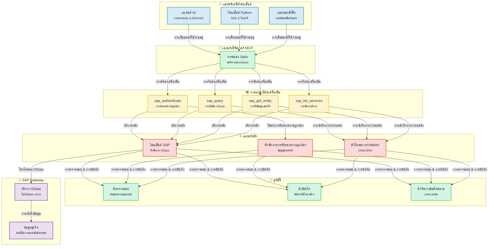
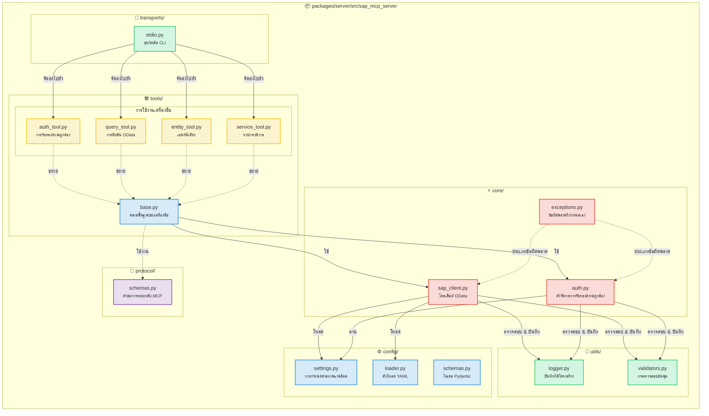
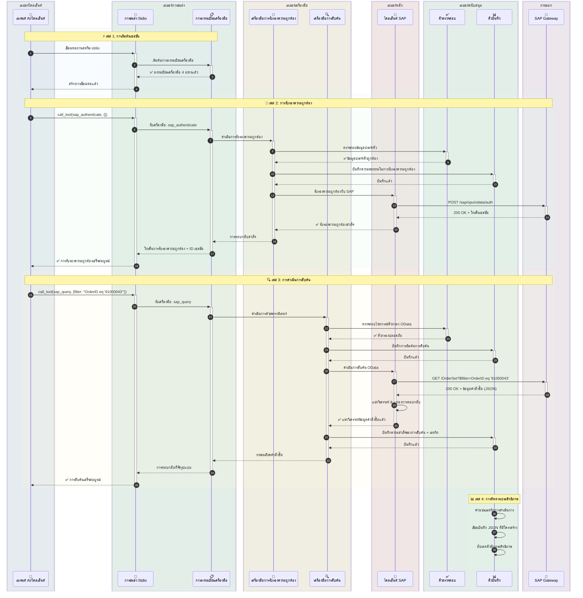
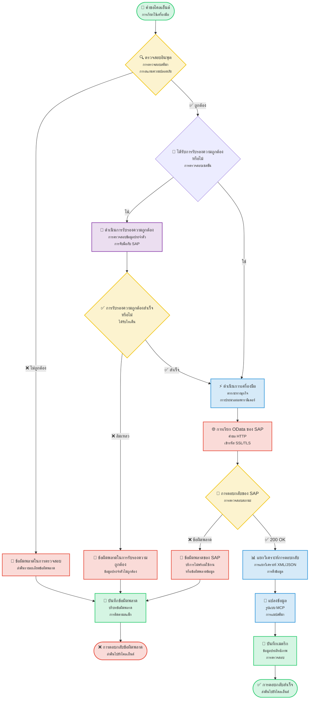
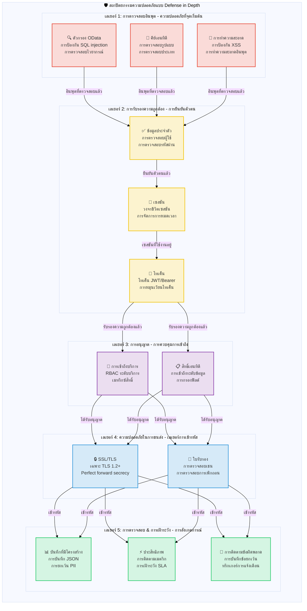

# SAP MCP - การผสานรวม SAP Gateway ผ่าน Model Context Protocol

เซิร์ฟเวอร์ MCP ที่สมบูรณ์สำหรับการผสานรวม SAP Gateway ซึ่งมีเครื่องมือแบบโมดูลสำหรับการดำเนินการ SAP OData กับเอเจนต์ AI

<div align="center">

[](https://www.python.org/downloads/)
[](LICENSE)
[]()
[]()
[]()

</div>

---

## 🎯 ภาพรวมโครงการ

เซิร์ฟเวอร์ MCP (Model Context Protocol) ที่พร้อมใช้งานจริง ซึ่งช่วยให้เอเจนต์ AI และแอปพลิเคชันสามารถโต้ตอบกับระบบ SAP Gateway ผ่านสถาปัตยกรรมที่สะอาดและเป็นโมดูล สร้างขึ้นเพื่อความน่าเชื่อถือ ความปลอดภัย และประสบการณ์ของนักพัฒนา

**สถานะปัจจุบัน**: ✅ **พร้อมใช้งานจริง** (เสร็จสิ้นทั้ง 5 เฟส)

### จุดเด่นที่สำคัญ

- 🔐 **การผสานรวม SAP ที่ปลอดภัย**: การรับรองความถูกต้องระดับองค์กรและการสนับสนุน SSL/TLS
- 🛠️ **เครื่องมือโมดูล 4 อย่าง**: การรับรองความถูกต้อง, การสืบค้น, การดึงข้อมูลเอนทิตี, การค้นหาบริการ
- 🚀 **การขนส่ง Stdio**: เซิร์ฟเวอร์ MCP ที่พร้อมใช้งานจริง
- 📊 **การบันทึกที่มีโครงสร้าง**: รูปแบบ JSON และคอนโซลพร้อมเมตริกประสิทธิภาพ
- ✅ **อินพุตที่ตรวจสอบแล้ว**: การตรวจสอบ OData และความปลอดภัยที่ครอบคลุม
- 🧪 **ทดสอบอย่างดี**: ครอบคลุม 56%, ผ่านการทดสอบ 44/45 (อัตราความสำเร็จ 98%)

---

## 📐 สถาปัตยกรรม

### ภาพรวมของระบบ



### รายละเอียดส่วนประกอบ



### โฟลว์ข้อมูล: ตัวอย่างการสืบค้นคำสั่งซื้อ



### โฟลว์การดำเนินการเครื่องมือ



### สถาปัตยกรรมความปลอดภัย



---

## 📦 โครงสร้างที่เก็บ

```
sap-mcp/
├── packages/
│   └── server/                          ✅ เซิร์ฟเวอร์ MCP ที่พร้อมใช้งานจริง
│       ├── src/sap_mcp_server/
│       │   ├── core/                    # ไคลเอ็นต์ SAP & การรับรองความถูกต้อง (3 ไฟล์)
│       │   │   ├── sap_client.py        # การดำเนินการ OData
│       │   │   ├── auth.py              # การจัดการข้อมูลประจำตัว
│       │   │   └── exceptions.py        # ข้อยกเว้นที่กำหนดเอง
│       │   ├── config/                  # การกำหนดค่า (4 ไฟล์)
│       │   │   ├── settings.py          # การกำหนดค่าสภาพแวดล้อม
│       │   │   ├── loader.py            # ตัวโหลด YAML
│       │   │   └── schemas.py           # โมเดล Pydantic
│       │   ├── protocol/                # โปรโตคอล MCP (2 ไฟล์)
│       │   │   └── schemas.py           # สคีมาคำขอ/การตอบกลับ
│       │   ├── tools/                   # เครื่องมือ SAP แบบโมดูล 4 อย่าง
│       │   │   ├── base.py              # คลาสพื้นฐานของเครื่องมือ
│       │   │   ├── auth_tool.py         # การรับรองความถูกต้อง
│       │   │   ├── query_tool.py        # การสืบค้น OData
│       │   │   ├── entity_tool.py       # การดึงข้อมูลเอนทิตี
│       │   │   └── service_tool.py      # การค้นหาบริการ
│       │   ├── transports/              # เลเยอร์การขนส่ง
│       │   │   └── stdio.py             # การขนส่ง Stdio ✅
│       │   └── utils/                   # ยูทิลิตี้ (3 ไฟล์)
│       │       ├── logger.py            # การบันทึกที่มีโครงสร้าง
│       │       └── validators.py        # การตรวจสอบอินพุต
│       ├── config/                      # การกำหนดค่าเซิร์ฟเวอร์
│       │   ├── services.yaml            # การกำหนดค่าบริการ SAP
│       │   └── services.yaml.example    # เทมเพลตการกำหนดค่า
│       ├── tests/                       # 45 การทดสอบ (ครอบคลุม 56%)
│       │   ├── conftest.py              # 8 ฟิกซ์เจอร์
│       │   ├── unit/                    # การทดสอบแบบแยกส่วนที่รวดเร็ว
│       │   └── integration/             # การทดสอบการผสานรวม
│       └── pyproject.toml               # การกำหนดค่าแพ็คเกจ
│
├── docs/                                # เอกสาร
│   ├── guides/                          # คู่มือผู้ใช้
│   └── api/                             # การอ้างอิง API
├── scripts/                             # สคริปต์การพัฒนา
├── .env.server                          # การกำหนดค่าเซิร์ฟเวอร์
├── .env.server.example                  # เทมเพลตการกำหนดค่า
└── README.md                            # ไฟล์นี้
```

---

## ✨ คุณสมบัติ

### ความสามารถหลัก

<table>
<tr>
<td width="50%">

#### 🛠️ เครื่องมือ
- ✅ **sap_authenticate**: การรับรองความถูกต้องของ SAP ที่ปลอดภัย
- ✅ **sap_query**: การสืบค้น OData พร้อมตัวกรอง
- ✅ **sap_get_entity**: การดึงข้อมูลเอนทิตีเดียว
- ✅ **sap_list_services**: การค้นหาบริการ

</td>
<td width="50%">

#### 🚀 การขนส่ง
- ✅ **Stdio**: stdin/stdout ที่พร้อมใช้งานจริง

</td>
</tr>
<tr>
<td>

#### 📊 การบันทึก & การเฝ้าระวัง
- ✅ **การบันทึกที่มีโครงสร้าง**: JSON + คอนโซล
- ✅ **เมตริกประสิทธิภาพ**: การจับเวลาคำขอ
- ✅ **การติดตามข้อผิดพลาด**: บริบทเต็มรูปแบบ
- ✅ **การตรวจสอบ**: เหตุการณ์ความปลอดภัย

</td>
<td>

#### 🔒 ความปลอดภัย
- ✅ **การตรวจสอบอินพุต**: OData & ความปลอดภัย
- ✅ **การสนับสนุน SSL/TLS**: การเชื่อมต่อที่ปลอดภัย
- ✅ **การจัดการข้อมูลประจำตัว**: .env.server
- ✅ **การจัดการข้อผิดพลาด**: เกรดการผลิต

</td>
</tr>
</table>

### คุณภาพ & การทดสอบ

| เมตริก | ค่า | สถานะ |
|--------|-------|--------|
| **ความครอบคลุมของการทดสอบ** | 56% | 🟡 ดี |
| **การทดสอบที่ผ่าน** | 44/45 (98%) | 🟢 ยอดเยี่ยม |
| **ความเร็วในการทดสอบ** | <0.2s | 🟢 เร็ว |
| **ฟิกซ์เจอร์** | 8 อย่างครอบคลุม | 🟢 สมบูรณ์ |
| **หมวดหมู่การทดสอบ** | หน่วย + การผสานรวม | 🟢 สมบูรณ์ |

### ประสบการณ์ของนักพัฒนา

- ✅ **สถาปัตยกรรมแบบโมดูล**: หนึ่งเครื่องมือต่อไฟล์
- ✅ **ความปลอดภัยของประเภท**: คำแนะนำประเภทเต็มรูปแบบ
- ✅ **เอกสาร**: คู่มือที่ครอบคลุม
- ✅ **การตั้งค่าง่าย**: `pip install -e .`
- ✅ **การโหลดซ้ำแบบร้อน**: โหมดการพัฒนา
- ✅ **แอปตัวอย่าง**: 3 ตัวอย่างที่ใช้งานได้

---

## 🚀 เริ่มต้นอย่างรวดเร็ว

### ข้อกำหนดเบื้องต้น

#### ความต้องการของระบบ

- **Python 3.11 หรือสูงกว่า**
- **pip** (ตัวติดตั้งแพ็คเกจ Python)
- **Git** (สำหรับโคลนที่เก็บ)
- ข้อมูลประจำตัวการเข้าถึง SAP Gateway
- การสนับสนุนสภาพแวดล้อมเสมือน

#### การติดตั้ง Python

<details>
<summary><b>🪟 Windows</b></summary>

**ตัวเลือกที่ 1: Microsoft Store (แนะนำสำหรับ Windows 10/11)**
```powershell
# ค้นหา "Python 3.11" หรือ "Python 3.12" ใน Microsoft Store
# หรือดาวน์โหลดจาก python.org
```

**ตัวเลือกที่ 2: ตัวติดตั้งจาก Python.org**
1. ดาวน์โหลดจาก [python.org/downloads](https://www.python.org/downloads/)
2. เรียกใช้ตัวติดตั้ง
3. ✅ **เลือก "Add Python to PATH"**
4. คลิก "Install Now"

**ตรวจสอบการติดตั้ง:**
```powershell
python --version
# ควรแสดง: Python 3.11.x หรือสูงกว่า

pip --version
# ควรแสดง: pip 23.x.x หรือสูงกว่า
```

**ปัญหาที่พบบ่อย:**
- หากไม่พบคำสั่ง `python` ให้ใช้ `python3` หรือ `py`
- หากไม่พบ `pip` ให้ติดตั้งด้วย: `python -m ensurepip --upgrade`

</details>

<details>
<summary><b>🍎 macOS</b></summary>

**ตัวเลือกที่ 1: Homebrew (แนะนำ)**
```bash
# ติดตั้ง Homebrew หากยังไม่ได้ติดตั้ง
/bin/bash -c "$(curl -fsSL https://raw.githubusercontent.com/Homebrew/install/HEAD/install.sh)"

# ติดตั้ง Python
brew install python@3.11
# หรือ
brew install python@3.12
```

**ตัวเลือกที่ 2: ตัวติดตั้งจาก Python.org**
1. ดาวน์โหลดจาก [python.org/downloads/macos](https://www.python.org/downloads/macos/)
2. เปิดไฟล์ `.pkg`
3. ทำตามวิซาร์ดการติดตั้ง

**ตรวจสอบการติดตั้ง:**
```bash
python3 --version
# ควรแสดง: Python 3.11.x หรือสูงกว่า

pip3 --version
# ควรแสดง: pip 23.x.x หรือสูงกว่า
```

**หมายเหตุ:** macOS อาจมี Python 2.7 ติดตั้งไว้ล่วงหน้า ใช้คำสั่ง `python3` และ `pip3` เสมอ

</details>

<details>
<summary><b>🐧 Linux</b></summary>

**Ubuntu/Debian:**
```bash
# อัปเดตรายการแพ็คเกจ
sudo apt update

# ติดตั้ง Python 3.11+
sudo apt install python3.11 python3.11-venv python3-pip

# หรือสำหรับ Python ล่าสุด
sudo apt install python3 python3-venv python3-pip
```

**Fedora/RHEL/CentOS:**
```bash
# ติดตั้ง Python 3.11+
sudo dnf install python3.11 python3-pip

# หรือ
sudo yum install python3 python3-pip
```

**Arch Linux:**
```bash
sudo pacman -S python python-pip
```

**ตรวจสอบการติดตั้ง:**
```bash
python3 --version
# ควรแสดง: Python 3.11.x หรือสูงกว่า

pip3 --version
# ควรแสดง: pip 23.x.x หรือสูงกว่า
```

</details>

---

### 1. การติดตั้ง

#### การติดตั้งทีละขั้นตอน

<details open>
<summary><b>🪟 Windows (PowerShell/Command Prompt)</b></summary>

```powershell
# โคลนที่เก็บ
git clone <repository-url>
cd sap-mcp

# สร้างสภาพแวดล้อมเสมือน
python -m venv .venv

# เปิดใช้งานสภาพแวดล้อมเสมือน
.venv\Scripts\activate
# หรือใน PowerShell:
# .venv\Scripts\Activate.ps1

# หากคุณได้รับข้อผิดพลาดเกี่ยวกับนโยบายการดำเนินการใน PowerShell:
# Set-ExecutionPolicy -ExecutionPolicy RemoteSigned -Scope CurrentUser

# ตรวจสอบการเปิดใช้งาน (คุณควรเห็น (.venv) ในพรอมต์)
# (.venv) PS C:\path\to\sap-mcp>

# ติดตั้งแพ็คเกจเซิร์ฟเวอร์
cd packages\server
pip install -e .

# ติดตั้งการพึ่งพาการพัฒนา (ทางเลือก)
pip install -e ".[dev]"

# ตรวจสอบการติดตั้ง
sap-mcp-server-stdio --help
```

**ปัญหาที่พบบ่อยใน Windows:**
- **ไม่พบ `python`**: ลอง `python3` หรือ `py`
- **การอนุญาตถูกปฏิเสธ**: เรียกใช้ PowerShell ในฐานะผู้ดูแลระบบ
- **นโยบายการดำเนินการ**: เรียกใช้ `Set-ExecutionPolicy -ExecutionPolicy RemoteSigned -Scope CurrentUser`
- **การสนับสนุนเส้นทางยาว**: เปิดใช้งานเส้นทางยาวใน Windows (Settings > System > About > Advanced system settings)

</details>

<details>
<summary><b>🍎 macOS (Terminal)</b></summary>

```bash
# โคลนที่เก็บ
git clone <repository-url>
cd sap-mcp

# สร้างสภาพแวดล้อมเสมือน
python3 -m venv .venv

# เปิดใช้งานสภาพแวดล้อมเสมือน
source .venv/bin/activate

# ตรวจสอบการเปิดใช้งาน (คุณควรเห็น (.venv) ในพรอมต์)
# (.venv) user@macbook sap-mcp %

# ติดตั้งแพ็คเกจเซิร์ฟเวอร์
cd packages/server
pip install -e .

# ติดตั้งการพึ่งพาการพัฒนา (ทางเลือก)
pip install -e ".[dev]"

# ตรวจสอบการติดตั้ง
sap-mcp-server-stdio --help

# ตรวจสอบเส้นทางการติดตั้ง (มีประโยชน์สำหรับการตั้งค่า Gemini CLI)
which sap-mcp-server-stdio
# ผลลัพธ์ตัวอย่าง: /Users/username/sap-mcp/.venv/bin/sap-mcp-server-stdio
```

**ปัญหาที่พบบ่อยใน macOS:**
- **ไม่พบ `python`**: ใช้ `python3` แทน
- **ไม่พบ `pip`**: ใช้ `pip3` แทน
- **การอนุญาตถูกปฏิเสธ**: อย่าใช้ `sudo` กับสภาพแวดล้อมเสมือน
- **ไม่พบคำสั่งหลังการติดตั้ง**: ตรวจสอบให้แน่ใจว่าสภาพแวดล้อมเสมือนเปิดใช้งานอยู่

</details>

<details>
<summary><b>🐧 Linux (Bash/Zsh)</b></summary>

```bash
# โคลนที่เก็บ
git clone <repository-url>
cd sap-mcp

# สร้างสภาพแวดล้อมเสมือน
python3 -m venv .venv

# เปิดใช้งานสภาพแวดล้อมเสมือน
source .venv/bin/activate

# ตรวจสอบการเปิดใช้งาน (คุณควรเห็น (.venv) ในพรอมต์)
# (.venv) user@linux:~/sap-mcp$

# ติดตั้งแพ็คเกจเซิร์ฟเวอร์
cd packages/server
pip install -e .

# ติดตั้งการพึ่งพาการพัฒนา (ทางเลือก)
pip install -e ".[dev]"

# ตรวจสอบการติดตั้ง
sap-mcp-server-stdio --help

# ตรวจสอบเส้นทางการติดตั้ง (มีประโยชน์สำหรับการตั้งค่า Gemini CLI)
which sap-mcp-server-stdio
# ผลลัพธ์ตัวอย่าง: /home/username/sap-mcp/.venv/bin/sap-mcp-server-stdio
```

**ปัญหาที่พบบ่อยใน Linux:**
- **ไม่พบ `python3-venv`**: ติดตั้งด้วย `sudo apt install python3-venv`
- **การอนุญาตถูกปฏิเสธ**: อย่าใช้ `sudo` กับสภาพแวดล้อมเสมือน
- **ข้อผิดพลาด SSL**: ติดตั้งใบรับรอง: `sudo apt install ca-certificates`
- **การพึ่งพาการสร้างที่ขาดหายไป**: ติดตั้งด้วย `sudo apt install build-essential python3-dev`

</details>

---

### 2. การกำหนดค่า

เซิร์ฟเวอร์ SAP MCP ต้องการไฟล์การกำหนดค่าสองไฟล์:
1. **`.env.server`**: ข้อมูลประจำตัวการเชื่อมต่อ SAP (หนึ่งระบบ SAP)
2. **`services.yaml`**: บริการ SAP Gateway และการตั้งค่าการรับรองความถูกต้อง

#### 2.1. การกำหนดค่าการเชื่อมต่อ SAP (`.env.server`)

> **⚠️ สำคัญ**: ณ v0.2.0, `.env.server` ได้ถูกรวมไว้ที่ **ไดเรกทอรีรากของโครงการเท่านั้น** ไม่รองรับตำแหน่ง `packages/server/.env.server` ก่อนหน้านี้อีกต่อไป

**ตำแหน่งไฟล์**: `.env.server` ต้องอยู่ใน **ไดเรกทอรีรากของโครงการ**

```
sap-mcp/
├── .env.server              ← ไฟล์การกำหนดค่า (ตำแหน่งเดียวเท่านั้น - สร้างที่นี่)
├── .env.server.example      ← เทมเพลตตัวอย่าง
├── packages/
│   └── server/
└── README.md
```

**ขั้นตอนการตั้งค่า**:

<details open>
<summary><b>🪟 Windows (PowerShell/Command Prompt)</b></summary>

```powershell
# นำทางไปยังรากของโครงการ
cd C:\path\to\sap-mcp

# คัดลอกเทมเพลตสภาพแวดล้อม
copy .env.server.example .env.server

# แก้ไขการกำหนดค่าด้วยข้อมูลประจำตัว SAP ของคุณโดยใช้ Notepad
notepad .env.server

# หรือใช้โปรแกรมแก้ไขที่คุณต้องการ:
# code .env.server (VS Code)
# notepad++ .env.server (Notepad++)

# หมายเหตุ: การอนุญาตไฟล์บน Windows จัดการแตกต่างกัน
# ตรวจสอบให้แน่ใจว่าไฟล์ไม่ได้อยู่ในโฟลเดอร์สาธารณะ
# คลิกขวาที่ .env.server > Properties > Security เพื่อจำกัดการเข้าถึง
```

**หมายเหตุเฉพาะสำหรับ Windows:**
- ใช้แบ็กสแลช (`\`) สำหรับเส้นทางใน Windows
- นโยบายการดำเนินการของ PowerShell อาจบล็อกสคริปต์ (ดูส่วนการติดตั้ง)
- จัดเก็บ `.env.server` ในโฟลเดอร์ผู้ใช้ที่มีการเข้าถึงที่จำกัด
- ใช้การยกเว้นของ Windows Defender หากโปรแกรมป้องกันไวรัสบล็อกไฟล์

</details>

<details>
<summary><b>🍎 macOS (Terminal)</b></summary>

```bash
# นำทางไปยังรากของโครงการ
cd /path/to/sap-mcp

# คัดลอกเทมเพลตสภาพแวดล้อม
cp .env.server.example .env.server

# แก้ไขการกำหนดค่าด้วยข้อมูลประจำตัว SAP ของคุณ
nano .env.server
# หรือใช้โปรแกรมแก้ไขที่คุณต้องการ:
# vim .env.server
# code .env.server (VS Code)
# open -a TextEdit .env.server

# ตั้งค่าการอนุญาตที่เหมาะสม (แนะนำเพื่อความปลอดภัย)
chmod 600 .env.server

# ตรวจสอบการอนุญาต
ls -la .env.server
# ควรแสดง: -rw------- (เจ้าของเท่านั้นที่สามารถอ่าน/เขียนได้)
```

**หมายเหตุเฉพาะสำหรับ macOS:**
- การอนุญาตไฟล์เป็นแบบ Unix (เหมือนกับ Linux)
- `chmod 600` ทำให้แน่ใจว่ามีเพียงผู้ใช้ของคุณเท่านั้นที่สามารถอ่าน/เขียนไฟล์ได้
- macOS อาจมีพรอมต์ความปลอดภัยเพิ่มเติมสำหรับการเข้าถึงครั้งแรก
- จัดเก็บในไดเรกทอรีโฮมของคุณเพื่อความปลอดภัยสูงสุด

</details>

<details>
<summary><b>🐧 Linux (Bash/Zsh)</b></summary>

```bash
# นำทางไปยังรากของโครงการ
cd /path/to/sap-mcp

# คัดลอกเทมเพลตสภาพแวดล้อม
cp .env.server.example .env.server

# แก้ไขการกำหนดค่าด้วยข้อมูลประจำตัว SAP ของคุณ
nano .env.server
# หรือใช้โปรแกรมแก้ไขที่คุณต้องการ:
# vim .env.server
# code .env.server (VS Code)
# gedit .env.server (GNOME)

# ตั้งค่าการอนุญาตที่เหมาะสม (จำเป็นเพื่อความปลอดภัย)
chmod 600 .env.server

# ตรวจสอบการอนุญาต
ls -la .env.server
# ควรแสดง: -rw------- (เจ้าของเท่านั้นที่สามารถอ่าน/เขียนได้)

# ทางเลือก: ตรวจสอบว่าไฟล์ไม่สามารถอ่านได้ทั่วโลก
stat .env.server
```

**หมายเหตุเฉพาะสำหรับ Linux:**
- `chmod 600` มีความสำคัญต่อความปลอดภัย (เจ้าของเท่านั้นที่สามารถเข้าถึงได้)
- SELinux/AppArmor อาจต้องการการกำหนดค่าเพิ่มเติม
- ไฟล์ต้องเป็นของผู้ใช้ที่เรียกใช้เซิร์ฟเวอร์
- อย่าใช้ `sudo` เพื่อแก้ไขหรือเรียกใช้ด้วยไฟล์นี้

</details>

---

**ตัวแปรสภาพแวดล้อมที่จำเป็น**:
```bash
# การเชื่อมต่อระบบ SAP (ระบบ SAP เดียว)
SAP_HOST=your-sap-host.com          # ชื่อโฮสต์ SAP Gateway
SAP_PORT=443                         # พอร์ต HTTPS (ปกติคือ 443 หรือ 8443)
SAP_USERNAME=your-username           # ID ผู้ใช้ SAP
SAP_PASSWORD=your-password           # รหัสผ่าน SAP
SAP_CLIENT=100                       # หมายเลขไคลเอ็นต์ SAP (เช่น 100, 800)

# การตั้งค่าความปลอดภัย
SAP_VERIFY_SSL=true                  # เปิดใช้งานการตรวจสอบใบรับรอง SSL (แนะนำ)
SAP_TIMEOUT=30                       # เวลาหมดเวลาของคำขอเป็นวินาที

# ทางเลือก: การรวมการเชื่อมต่อ
SAP_MAX_CONNECTIONS=10               # จำนวนการเชื่อมต่อพร้อมกันสูงสุด (ทางเลือก)
SAP_RETRY_ATTEMPTS=3                 # จำนวนครั้งที่พยายามใหม่เมื่อล้มเหลว (ทางเลือก)
```

**แนวทางปฏิบัติที่ดีที่สุดด้านความปลอดภัย**:
- ✅ อย่าคอมมิต `.env.server` ไปยังการควบคุมเวอร์ชัน (มีอยู่แล้วใน `.gitignore`)
- ✅ ใช้รหัสผ่านที่รัดกุมและไม่ซ้ำกัน
- ✅ เปิดใช้งานการตรวจสอบ SSL ในการผลิต (`SAP_VERIFY_SSL=true`)
- ✅ จำกัดการอนุญาตไฟล์: `chmod 600 .env.server`

#### 2.2. การกำหนดค่าบริการ SAP Gateway (`services.yaml`)

กำหนดค่าบริการ SAP Gateway (บริการ OData) ที่เซิร์ฟเวอร์ MCP สามารถเข้าถึงได้

**ตำแหน่ง**: `packages/server/config/services.yaml`

```bash
# คัดลอกการกำหนดค่าตัวอย่าง
cp packages/server/config/services.yaml.example packages/server/config/services.yaml

# แก้ไขการกำหนดค่าบริการ
vim packages/server/config/services.yaml
```

**ตัวอย่างการกำหนดค่าพื้นฐาน**:

```yaml
# การกำหนดค่า URL ของ Gateway
gateway:
  # รูปแบบ URL พื้นฐานสำหรับบริการ OData
  base_url_pattern: "https://{host}:{port}/sap/opu/odata"

  # ส่วนต่อท้ายของจุดสิ้นสุดเมตาดาต้า
  metadata_suffix: "/$metadata"

  # เส้นทางแคตตาล็อกบริการ
  service_catalog_path: "/sap/opu/odata/IWFND/CATALOGSERVICE;v=2/ServiceCollection"

  # การกำหนดค่าจุดสิ้นสุดการรับรองความถูกต้อง
  auth_endpoint:
    # แนะนำ: ใช้เมตาดาต้าของแคตตาล็อก (ทำงานได้โดยไม่ต้องมีบริการเฉพาะ)
    use_catalog_metadata: true

    # ทางเลือก: ใช้บริการเฉพาะสำหรับการรับรองความถูกต้อง (หากแคตตาล็อกไม่พร้อมใช้งาน)
    # use_catalog_metadata: false
    # service_id: Z_SALES_ORDER_GENAI_SRV
    # entity_name: zsd004Set

# บริการ SAP OData
services:
  # ตัวอย่าง: บริการใบสั่งขาย
  - id: Z_SALES_ORDER_GENAI_SRV          # ตัวระบุบริการที่ไม่ซ้ำกัน
    name: "Sales Order GenAI Service"     # ชื่อที่มนุษย์อ่านได้
    path: "/SAP/Z_SALES_ORDER_GENAI_SRV"  # เส้นทางบริการ
    version: v2                            # เวอร์ชัน OData (v2 หรือ v4)
    description: "บริการจัดการใบสั่งขาย"

    # ชุดเอนทิตีในบริการนี้
    entities:
      - name: zsd004Set                    # ชื่อชุดเอนทิตี
        key_field: Vbeln                   # ฟิลด์คีย์หลัก
        description: "ใบสั่งขาย"
        default_select:                    # ฟิลด์เริ่มต้นที่จะเลือก
          - Vbeln      # หมายเลขใบสั่งขาย
          - Erdat      # วันที่สร้าง
          - Ernam      # สร้างโดย
          - Netwr      # มูลค่าสุทธิ
          - Waerk      # สกุลเงิน

    # ทางเลือก: ส่วนหัวที่กำหนดเองสำหรับบริการนี้
    custom_headers: {}
```

**การเพิ่มบริการหลายรายการ**:

```yaml
services:
  # บริการใบสั่งขาย
  - id: Z_SALES_ORDER_GENAI_SRV
    name: "Sales Order Service"
    path: "/SAP/Z_SALES_ORDER_GENAI_SRV"
    version: v2
    entities:
      - name: zsd004Set
        key_field: Vbeln
        description: "ใบสั่งขาย"

  # บริการข้อมูลหลักของลูกค้า
  - id: Z_CUSTOMER_SRV
    name: "Customer Master Service"
    path: "/SAP/Z_CUSTOMER_SRV"
    version: v2
    entities:
      - name: CustomerSet
        key_field: Kunnr
        description: "บันทึกข้อมูลหลักของลูกค้า"
        default_select:
          - Kunnr      # หมายเลขลูกค้า
          - Name1      # ชื่อ
          - Land1      # ประเทศ

  # บริการข้อมูลหลักของวัสดุ
  - id: Z_MATERIAL_SRV
    name: "Material Master Service"
    path: "/SAP/Z_MATERIAL_SRV"
    version: v2
    entities:
      - name: MaterialSet
        key_field: Matnr
        description: "ข้อมูลหลักของวัสดุ"
```

#### 2.3. ตัวเลือกจุดสิ้นสุดการรับรองความถูกต้อง

การกำหนดค่า `auth_endpoint` ควบคุมวิธีที่เซิร์ฟเวอร์ MCP รับรองความถูกต้องกับ SAP

**ตัวเลือกที่ 1: เมตาดาต้าของแคตตาล็อก (แนะนำ)**

```yaml
gateway:
  auth_endpoint:
    use_catalog_metadata: true
```

**ข้อดี**:
- ✅ ทำงานได้โดยไม่ต้องการบริการ SAP Gateway ที่เฉพาะเจาะจง
- ✅ มีความยืดหยุ่นและสามารถพกพาได้มากขึ้นในระบบ SAP ต่างๆ
- ✅ การรับรองความถูกต้องที่ไม่ขึ้นกับบริการ
- ✅ ไม่มีการพึ่งพาการปรับใช้บริการที่กำหนดเอง

**โฟลว์การรับรองความถูกต้อง**:
- โทเค็น CSRF: `/sap/opu/odata/IWFND/CATALOGSERVICE;v=2/ServiceCollection`
- การตรวจสอบ: `/sap/opu/odata/IWFND/CATALOGSERVICE;v=2/$metadata`

---

**ตัวเลือกที่ 2: การรับรองความถูกต้องเฉพาะบริการ**

```yaml
gateway:
  auth_endpoint:
    use_catalog_metadata: false
    service_id: Z_SALES_ORDER_GENAI_SRV    # ต้องตรงกับ ID บริการด้านล่าง
    entity_name: zsd004Set                  # ต้องเป็นเอนทิตีในบริการนั้น
```

**ข้อดี**:
- ✅ การรับรองความถูกต้องตามบริการที่ชัดเจน
- ✅ ทำงานได้เมื่อบริการแคตตาล็อกไม่พร้อมใช้งาน (หายาก)

**ข้อเสีย**:
- ❌ ต้องการให้ปรับใช้บริการที่ระบุ
- ❌ มีความยืดหยุ่นน้อยลงหากบริการเปลี่ยนแปลง
- ❌ ต้องอัปเดตการกำหนดค่าหากชื่อบริการเปลี่ยนแปลง

**โฟลว์การรับรองความถูกต้อง**:
- โทเค็น CSRF: `/SAP/Z_SALES_ORDER_GENAI_SRV/zsd004Set`
- การตรวจสอบ: `/sap/opu/odata/IWFND/CATALOGSERVICE;v=2/$metadata`

---

**คำแนะนำ**: ใช้ **ตัวเลือกที่ 1 (เมตาดาต้าของแคตตาล็อก)** เว้นแต่คุณมีเหตุผลเฉพาะที่จะใช้บริการเฉพาะสำหรับการรับรองความถูกต้อง

### 3. เรียกใช้เซิร์ฟเวอร์

<details open>
<summary><b>🪟 Windows (PowerShell/Command Prompt)</b></summary>

```powershell
# เปิดใช้งานสภาพแวดล้อมเสมือน
.venv\Scripts\activate
# หรือใน PowerShell:
# .venv\Scripts\Activate.ps1

# เรียกใช้เซิร์ฟเวอร์ stdio (แนะนำ)
sap-mcp-server-stdio

# หรือโดยตรงด้วย Python
python -m sap_mcp_server.transports.stdio

# เพื่อปิดใช้งานเมื่อเสร็จสิ้น
deactivate
```

**หมายเหตุเฉพาะสำหรับ Windows:**
- ใช้แบ็กสแลช (`\`) สำหรับเส้นทาง
- PowerShell อาจต้องการการเปลี่ยนแปลงนโยบายการดำเนินการ
- เซิร์ฟเวอร์ทำงานในหน้าต่างเทอร์มินัลปัจจุบัน
- กด `Ctrl+C` เพื่อหยุดเซิร์ฟเวอร์

</details>

<details>
<summary><b>🍎 macOS (Terminal)</b></summary>

```bash
# เปิดใช้งานสภาพแวดล้อมเสมือน
source .venv/bin/activate

# เรียกใช้เซิร์ฟเวอร์ stdio (แนะนำ)
sap-mcp-server-stdio

# หรือโดยตรงด้วย Python
python3 -m sap_mcp_server.transports.stdio

# เพื่อปิดใช้งานเมื่อเสร็จสิ้น
deactivate
```

**หมายเหตุเฉพาะสำหรับ macOS:**
- ใช้ `python3` แทน `python`
- เซิร์ฟเวอร์ทำงานในเซสชันเทอร์มินัลปัจจุบัน
- กด `Cmd+C` หรือ `Ctrl+C` เพื่อหยุดเซิร์ฟเวอร์
- เทอร์มินัลต้องเปิดอยู่ขณะที่เซิร์ฟเวอร์ทำงาน

</details>

<details>
<summary><b>🐧 Linux (Bash/Zsh)</b></summary>

```bash
# เปิดใช้งานสภาพแวดล้อมเสมือน
source .venv/bin/activate

# เรียกใช้เซิร์ฟเวอร์ stdio (แนะนำ)
sap-mcp-server-stdio

# หรือโดยตรงด้วย Python
python3 -m sap_mcp_server.transports.stdio

# เพื่อปิดใช้งานเมื่อเสร็จสิ้น
deactivate
```

**หมายเหตุเฉพาะสำหรับ Linux:**
- ใช้ `python3` แทน `python`
- เซิร์ฟเวอร์ทำงานในเซสชันเทอร์มินัลปัจจุบัน
- กด `Ctrl+C` เพื่อหยุดเซิร์ฟเวอร์
- สามารถทำงานในพื้นหลังด้วยบริการ `nohup` หรือ `systemd`

</details>

---

### 4. ตรวจสอบการติดตั้ง

```bash
# เรียกใช้การทดสอบ
cd packages/server
python -m pytest -v

# พร้อมรายงานความครอบคลุม
python -m pytest --cov=sap_mcp_server --cov-report=term-missing

# หมวดหมู่การทดสอบเฉพาะ
python -m pytest -m unit          # การทดสอบหน่วยเท่านั้น
python -m pytest -m integration   # การทดสอบการผสานรวมเท่านั้น
```

---

## 🤖 การผสานรวมกับ Gemini CLI

> **📖 เอกสารอย่างเป็นทางการ**: สำหรับข้อมูลเพิ่มเติมเกี่ยวกับ Gemini CLI โปรดไปที่ <a href="https://geminicli.com/" target="_blank">https://geminicli.com/</a>

### ข้อกำหนดเบื้องต้น

- ติดตั้ง Node.js 18+ และ npm
- ติดตั้ง SAP MCP Server (ดูเริ่มต้นอย่างรวดเร็วด้านบน)
- บัญชี Google สำหรับการเข้าถึง Gemini API

### 1. ติดตั้ง Gemini CLI

```bash
# ติดตั้ง Gemini CLI ทั่วโลก
npm install -g @google/gemini-cli

# ตรวจสอบการติดตั้ง
gemini --version
```

### 2. รับรองความถูกต้องของ Gemini CLI

**ตัวเลือก A: การใช้คีย์ Gemini API (แนะนำสำหรับการเริ่มต้น)**

1. รับคีย์ API ของคุณจาก [Google AI Studio](https://aistudio.google.com/apikey)
2. ตั้งค่าตัวแปรสภาพแวดล้อม:

```bash
export GEMINI_API_KEY="your-api-key-here"
```

**ตัวเลือก B: การใช้ Google Cloud (สำหรับการผลิต)**

```bash
# ติดตั้ง Google Cloud CLI ก่อน
gcloud auth application-default login

# ตั้งค่าโครงการของคุณ
export GOOGLE_CLOUD_PROJECT="your-project-id"
export GOOGLE_CLOUD_LOCATION="us-central1"
```

### 3. ลงทะเบียนเซิร์ฟเวอร์ SAP MCP

**วิธี A: การใช้เส้นทางสัมบูรณ์ (แนะนำสำหรับสภาพแวดล้อมเสมือน)**

หากคุณติดตั้งเซิร์ฟเวอร์ในสภาพแวดล้อมเสมือน ให้ใช้เส้นทางสัมบูรณ์ไปยังไฟล์ปฏิบัติการ:

1. **ค้นหาเส้นทางสัมบูรณ์**:
```bash
# นำทางไปยังไดเรกทอรี SAP MCP ของคุณ
cd /path/to/sap-mcp

# รับเส้นทางสัมบูรณ์
pwd
# ผลลัพธ์ตัวอย่าง: /Users/sanggyulee/my-project/python-project/sap-mcp
```

2. **แก้ไข `~/.gemini/settings.json`**:
```json
{
  "mcpServers": {
    "sap-server": {
      "command": "/Users/sanggyulee/my-project/python-project/sap-mcp/.venv/bin/sap-mcp-server-stdio",
      "cwd": "/Users/sanggyulee/my-project/python-project/sap-mcp",
      "description": "เซิร์ฟเวอร์ SAP Gateway MCP สำหรับการผสานรวม OData",
      "timeout": 30000,
      "trust": false
    }
  }
}
```

**แทนที่ `/Users/sanggyulee/my-project/python-project/sap-mcp` ด้วยเส้นทางโครงการจริงของคุณ**

> **📝 หมายเหตุ**: พารามิเตอร์ `cwd` (ไดเรกทอรีการทำงานปัจจุบัน) **จำเป็น** สำหรับการค้นหาไฟล์ `.env.server` ทำให้แน่ใจว่าเซิร์ฟเวอร์ทำงานจากไดเรกทอรีรากของโครงการซึ่งเป็นที่ตั้งของไฟล์การกำหนดค่า

3. **ตรวจสอบเส้นทาง**:
```bash
# ทดสอบว่าคำสั่งทำงานได้
/path/to/your/sap-mcp/.venv/bin/sap-mcp-server-stdio --help

# ตรวจสอบการลงทะเบียน
gemini mcp list
# คาดว่า: ✓ sap-server: ... (stdio) - เชื่อมต่อแล้ว
```

---

**วิธี B: การใช้คำสั่ง CLI (หากติดตั้งทั่วโลก)**

หาก `sap-mcp-server-stdio` อยู่ใน PATH ของระบบของคุณ:

```bash
# ลงทะเบียนเซิร์ฟเวอร์
gemini mcp add sap-server sap-mcp-server-stdio

# ตรวจสอบการลงทะเบียน
gemini mcp list
```

**หมายเหตุ**: วิธีนี้ใช้ได้เฉพาะเมื่อคุณเพิ่มสภาพแวดล้อมเสมือนลงใน PATH หรือติดตั้งแพ็คเกจทั่วโลก

---

**วิธี C: การใช้เส้นทางโมดูล Python**

วิธีทางเลือกโดยใช้โมดูล Python:

```json
{
  "mcpServers": {
    "sap-server": {
      "command": "/path/to/sap-mcp/.venv/bin/python",
      "args": ["-m", "sap_mcp_server.transports.stdio"],
      "cwd": "/path/to/sap-mcp/packages/server",
      "description": "เซิร์ฟเวอร์ SAP Gateway MCP",
      "timeout": 30000,
      "trust": false
    }
  }
}
```

### 4. เริ่มใช้ SAP MCP กับ Gemini CLI

```bash
# เริ่ม Gemini CLI
gemini

# ตรวจสอบสถานะเซิร์ฟเวอร์ MCP
> /mcp

# ดูเครื่องมือ SAP ที่มีอยู่
> /mcp desc

# ตัวอย่าง: การสืบค้นคำสั่งซื้อ SAP
> ใช้เครื่องมือ SAP เพื่อรับรองความถูกต้องและสืบค้นหมายเลขคำสั่งซื้อ 91000043

# ตัวอย่าง: การแสดงรายการบริการ SAP ที่มีอยู่
> มีบริการ SAP ใดบ้างที่พร้อมใช้งาน

# ตัวอย่าง: การรับรายละเอียดลูกค้า
> ดึงรายละเอียดสำหรับลูกค้า CUST001 จาก SAP
```

### การกำหนดค่าขั้นสูง

**เปิดใช้งานการอนุมัติอัตโนมัติสำหรับเซิร์ฟเวอร์ที่เชื่อถือได้**

```json
{
  "mcpServers": {
    "sap-server": {
      "command": "/path/to/sap-mcp/.venv/bin/sap-mcp-server-stdio",
      "trust": true,
      "timeout": 30000
    }
  }
}
```

**หมายเหตุ**: ตั้งค่า `"trust": true` เพื่อข้ามพรอมต์การอนุมัติสำหรับการเรียกใช้เครื่องมือแต่ละครั้ง เปิดใช้งานสำหรับเซิร์ฟเวอร์ที่เชื่อถือได้เท่านั้น

---

**กรองเครื่องมือเฉพาะ**

```json
{
  "mcpServers": {
    "sap-server": {
      "command": "/path/to/sap-mcp/.venv/bin/sap-mcp-server-stdio",
      "includeTools": ["sap_authenticate", "sap_query"],
      "excludeTools": ["sap_list_services"],
      "timeout": 30000
    }
  }
}
```

**กรณีการใช้งาน**:
- `includeTools`: อนุญาตเฉพาะเครื่องมือที่ระบุ (รายการที่อนุญาต)
- `excludeTools`: บล็อกเครื่องมือที่ระบุ (รายการที่ไม่อนุญาต)
- ไม่สามารถใช้ทั้งสองอย่างพร้อมกันได้

---

**เพิ่มตัวแปรสภาพแวดล้อม (ทางเลือก)**

```json
{
  "mcpServers": {
    "sap-server": {
      "command": "/path/to/sap-mcp/.venv/bin/sap-mcp-server-stdio",
      "env": {
        "SAP_HOST": "${SAP_HOST}",
        "SAP_USERNAME": "${SAP_USERNAME}",
        "SAP_PASSWORD": "${SAP_PASSWORD}"
      },
      "timeout": 30000
    }
  }
}
```

**หมายเหตุ**: ตัวแปรสภาพแวดล้อมใน `settings.json` จะแทนที่ค่าจาก `.env.server` ไม่แนะนำด้วยเหตุผลด้านความปลอดภัย - ควรใช้ไฟล์ `.env.server` แทน

---

**เพิ่มเวลาหมดเวลาสำหรับเครือข่ายที่ช้า**

```json
{
  "mcpServers": {
    "sap-server": {
      "command": "/path/to/sap-mcp/.venv/bin/sap-mcp-server-stdio",
      "timeout": 60000,  // 60 วินาที (ค่าเริ่มต้น: 30000)
      "trust": false
    }
  }
}
```

**เมื่อใดควรเพิ่ม**:
- การเชื่อมต่อเครือข่ายที่ช้า
- การสืบค้นข้อมูลขนาดใหญ่
- การดำเนินการ SAP ที่ซับซ้อน
- ข้อผิดพลาดหมดเวลาบ่อยครั้ง

### การแก้ไขปัญหา

**ปัญหา: เซิร์ฟเวอร์แสดงสถานะ "ตัดการเชื่อมต่อ"**

```bash
# ตรวจสอบสถานะเซิร์ฟเวอร์ MCP
gemini mcp list
# หากคุณเห็น: ✗ sap-server: sap-mcp-server-stdio (stdio) - ตัดการเชื่อมต่อ
```

**วิธีแก้ไข 1: ใช้เส้นทางสัมบูรณ์ (พบบ่อยที่สุด)**

คำสั่งน่าจะอยู่ในสภาพแวดล้อมเสมือน อัปเดต `~/.gemini/settings.json`:

```json
{
  "mcpServers": {
    "sap-server": {
      "command": "/full/path/to/sap-mcp/.venv/bin/sap-mcp-server-stdio",
      "description": "เซิร์ฟเวอร์ SAP Gateway MCP",
      "timeout": 30000,
      "trust": false
    }
  }
}
```

**ค้นหาเส้นทางสัมบูรณ์ของคุณ**:
```bash
# นำทางไปยังไดเรกทอรี SAP MCP
cd /path/to/sap-mcp

# รับเส้นทางเต็ม
pwd
# ตัวอย่าง: /Users/sanggyulee/my-project/python-project/sap-mcp

# ตรวจสอบว่าคำสั่งมีอยู่
ls -la .venv/bin/sap-mcp-server-stdio
```

---

**ปัญหา: ไม่พบคำสั่งใน PATH**

```bash
# ทดสอบเซิร์ฟเวอร์โดยตรง
sap-mcp-server-stdio
# ข้อผิดพลาด: ไม่พบคำสั่ง

# ตรวจสอบว่าคำสั่งมีอยู่
which sap-mcp-server-stdio
# ส่งคืน: ไม่พบคำสั่ง
```

**วิธีแก้ไข 2: ตรวจสอบสภาพแวดล้อมเสมือน**

```bash
# ตรวจสอบว่าสภาพแวดล้อมเสมือนมีอยู่
ls -la .venv/bin/sap-mcp-server-stdio

# หากมีอยู่ ให้ใช้เส้นทางสัมบูรณ์ใน settings.json
# หากไม่มีอยู่ ให้ติดตั้งใหม่:
cd packages/server
pip install -e .
```

---

**ปัญหา: ข้อผิดพลาดในการรับรองความถูกต้องหรือไม่พบ `.env.server`**

```bash
# ตรวจสอบว่า .env.server มีอยู่ใน PROJECT ROOT (ไม่ได้อยู่ใน packages/server/)
cat .env.server

# ฟิลด์ที่จำเป็น:
# SAP_HOST=your-host
# SAP_PORT=443
# SAP_USERNAME=your-username
# SAP_PASSWORD=your-password
# SAP_CLIENT=100
```

**วิธีแก้ไข 3: ตรวจสอบตำแหน่งไฟล์และข้อมูลประจำตัว**

```bash
# 1. ตรวจสอบว่า .env.server อยู่ในรากของโครงการ
ls -la .env.server
# ควรมีอยู่ใน: /path/to/sap-mcp/.env.server

# 2. ตรวจสอบให้แน่ใจว่า settings.json ของ Gemini CLI มีพารามิเตอร์ "cwd"
cat ~/.gemini/settings.json
# ต้องมี: "cwd": "/path/to/sap-mcp"

# 3. ทดสอบการรับรองความถูกต้องด้วยตนเอง
source .venv/bin/activate
python -c "from sap_mcp_server.config.settings import get_connection_config; print(get_connection_config())"
```

**ปัญหาที่พบบ่อย**:

1. **ข้อผิดพลาด "ฟิลด์ที่จำเป็น"**: ไม่ได้โหลด `.env.server` ตรวจสอบ:
   - ไฟล์มีอยู่ในรากของโครงการ: `/path/to/sap-mcp/.env.server`
   - `settings.json` ของ Gemini CLI มีพารามิเตอร์ `cwd` ที่ถูกต้อง
   - ไฟล์มีสิทธิ์ที่เหมาะสม: `chmod 600 .env.server`

2. **ข้อผิดพลาด 401 Unauthorized**: แก้ไขใน v0.2.1 (2025-01-22)
   - **ปัญหาก่อนหน้า**: SAP Gateway ปฏิเสธคำขอที่ไม่มีพารามิเตอร์ `sap-client`
   - **สถานะปัจจุบัน**: จัดการโดยอัตโนมัติ - คำขอทั้งหมดมีพารามิเตอร์ `sap-client`
   - **การตรวจสอบ**: ตรวจสอบให้แน่ใจว่าคุณได้อัปเดตเป็น v0.2.1 หรือใหม่กว่า
   - **การตรวจสอบด้วยตนเอง**: การรับรองความถูกต้องควรจะสำเร็จด้วยข้อมูลประจำตัวที่ถูกต้อง

---

**ปัญหา: ต้องลงทะเบียนเซิร์ฟเวอร์ใหม่**

```bash
# ลบการกำหนดค่าเซิร์ฟเวอร์ที่มีอยู่
rm ~/.gemini/settings.json

# หรือแก้ไขด้วยตนเองเพื่อลบรายการ sap-server
```

**วิธีแก้ไข 4: การลงทะเบียนใหม่ที่สะอาด**

```bash
# วิธีที่ 1: แก้ไขการตั้งค่าโดยตรง
vim ~/.gemini/settings.json

# วิธีที่ 2: ใช้เส้นทางสัมบูรณ์ (แนะนำ)
# ทำตาม "วิธี A: การใช้เส้นทางสัมบูรณ์" ในส่วนที่ 3 ด้านบน
```

---

**ขั้นตอนการวินิจฉัยอย่างรวดเร็ว**

1. **ตรวจสอบไฟล์ปฏิบัติการของเซิร์ฟเวอร์**:
```bash
/path/to/sap-mcp/.venv/bin/sap-mcp-server-stdio --help
# ควรแสดงข้อความเริ่มต้นของเซิร์ฟเวอร์
```

2. **ตรวจสอบการตั้งค่า Gemini CLI**:
```bash
cat ~/.gemini/settings.json | grep -A 5 "sap-server"
# ตรวจสอบว่าเส้นทาง "command" ถูกต้อง
```

3. **ทดสอบการเชื่อมต่อ**:
```bash
gemini mcp list
# ควรแสดง: ✓ sap-server: ... - เชื่อมต่อแล้ว
```

4. **ทดสอบใน Gemini CLI**:
```bash
gemini
> /mcp
> /mcp desc
# ควรแสดงรายการเครื่องมือ SAP
```

### เครื่องมือ SAP ที่มีอยู่ใน Gemini CLI

เมื่อลงทะเบียนแล้ว คุณสามารถใช้เครื่องมือ SAP เหล่านี้ผ่านภาษาธรรมชาติ:

| เครื่องมือ | คำอธิบาย | พรอมต์ตัวอย่าง |
|------|-------------|----------------|
| **sap_authenticate** | รับรองความถูกต้องกับ SAP Gateway | "รับรองความถูกต้องกับ SAP" |
| **sap_query** | สืบค้นเอนทิตี SAP ด้วยตัวกรอง OData | "สืบค้นคำสั่งซื้อทั้งหมดสำหรับลูกค้า CUST001" |
| **sap_get_entity** | ดึงข้อมูลเอนทิตีเฉพาะตามคีย์ | "รับรายละเอียดสำหรับคำสั่งซื้อ 91000043" |
| **sap_list_services** | แสดงรายการบริการ SAP ที่มีอยู่ | "มีบริการ SAP ใดบ้างที่พร้อมใช้งาน" |

### เวิร์กโฟลว์ตัวอย่าง

**1. เวิร์กโฟลว์การสอบถามคำสั่งซื้อ**

```bash
gemini

> เชื่อมต่อกับ SAP และค้นหาคำสั่งซื้อทั้งหมดที่สั่งในสัปดาห์ที่แล้วสำหรับลูกค้า CUST001
# Gemini จะ:
# 1. เรียก sap_authenticate
# 2. เรียก sap_query พร้อมตัวกรองที่เหมาะสม
# 3. จัดรูปแบบและนำเสนอผลลัพธ์
```

**2. การวิเคราะห์ลูกค้า**

```bash
> วิเคราะห์ลูกค้ายอดนิยม 5 อันดับแรกตามปริมาณการสั่งซื้อโดยใช้ข้อมูล SAP
# Gemini จะ:
# 1. รับรองความถูกต้อง
# 2. สืบค้นคำสั่งซื้อของลูกค้า
# 3. รวบรวมและวิเคราะห์ข้อมูล
# 4. นำเสนอข้อมูลเชิงลึก
```

**3. การค้นหาบริการ**

```bash
> มีบริการและชุดเอนทิตี SAP ใดบ้างที่พร้อมใช้งานในระบบ
# Gemini จะ:
# 1. เรียก sap_list_services
# 2. จัดรูปแบบแคตตาล็อกบริการ
```

---

## 🔧 เครื่องมือที่มีอยู่

### 1. SAP Authenticate

รับรองความถูกต้องกับระบบ SAP Gateway โดยใช้ข้อมูลประจำตัวจาก `.env.server`

**คำขอ**:
```json
{
  "name": "sap_authenticate",
  "arguments": {}
}
```

**การตอบกลับ**:
```json
{
  "success": true,
  "session_id": "abc123...",
  "message": "รับรองความถูกต้องกับ SAP สำเร็จ"
}
```

---

### 2. SAP Query

สืบค้นเอนทิตี SAP ด้วยตัวกรอง OData, การเลือก, การแบ่งหน้า

**คำขอ**:
```json
{
  "name": "sap_query",
  "arguments": {
    "service": "Z_SALES_ORDER_GENAI_SRV",
    "entity_set": "zsd004Set",
    "filter": "OrderID eq '91000043'",
    "select": "OrderID,Bstnk,Kunnr,Matnr",
    "top": 10,
    "skip": 0
  }
}
```

**การตอบกลับ**:
```json
{
  "data": {
    "d": {
      "results": [
        {
          "OrderID": "91000043",
          "Bstnk": "PO-2024-001",
          "Kunnr": "CUST001",
          "Matnr": "MAT-12345"
        }
      ]
    }
  },
  "count": 1
}
```

---

### 3. SAP Get Entity

ดึงข้อมูลเอนทิตีเฉพาะตามคีย์

**คำขอ**:
```json
{
  "name": "sap_get_entity",
  "arguments": {
    "service": "Z_SALES_ORDER_GENAI_SRV",
    "entity_set": "zsd004Set",
    "entity_key": "91000043"
  }
}
```

**การตอบกลับ**:
```json
{
  "data": {
    "d": {
      "OrderID": "91000043",
      "Bstnk": "PO-2024-001",
      "Kunnr": "CUST001",
      "Matnr": "MAT-12345",
      "Wmeng": "100",
      "Vkorg": "1000"
    }
  }
}
```

---

### 4. SAP List Services

แสดงรายการบริการ SAP ที่มีอยู่ทั้งหมดจากการกำหนดค่า

**คำขอ**:
```json
{
  "name": "sap_list_services",
  "arguments": {}
}
```

**การตอบกลับ**:
```json
{
  "services": [
    {
      "name": "Z_SALES_ORDER_GENAI_SRV",
      "description": "บริการใบสั่งขายสำหรับ GenAI",
      "entity_sets": ["zsd004Set", "OrderHeaderSet"]
    }
  ],
  "count": 1
}
```

---

## 📚 ตัวอย่างการใช้งาน

### การใช้การลงทะเบียนเครื่องมือ

```python
from sap_mcp_server.tools import tool_registry
from sap_mcp_server.protocol.schemas import ToolCallRequest

# แสดงรายการเครื่องมือที่มีอยู่
tools = tool_registry.list_tools()
for tool in tools:
    print(f"- {tool.name}: {tool.description}")

# เรียกใช้เครื่องมือ
request = ToolCallRequest(
    name="sap_list_services",
    arguments={}
)
result = await tool_registry.call_tool(request)
print(result)
```

### ตัวอย่างไคลเอ็นต์ MCP

```python
from mcp import StdioServerParameters
from mcp.client.session import ClientSession
from mcp.client.stdio import stdio_client

async def main():
    # เชื่อมต่อกับเซิร์ฟเวอร์ MCP
    server_params = StdioServerParameters(
        command="python",
        args=["-m", "sap_mcp_server.transports.stdio"]
    )

    async with stdio_client(server_params) as (read, write):
        async with ClientSession(read, write) as session:
            # เริ่มต้นเซสชัน
            await session.initialize()

            # รับรองความถูกต้อง
            auth_result = await session.call_tool("sap_authenticate", {})

            # สืบค้นคำสั่งซื้อ
            entity_result = await session.call_tool(
                "sap_get_entity",
                {
                    "service": "Z_SALES_ORDER_GENAI_SRV",
                    "entity_set": "zsd004Set",
                    "entity_key": "91000043"
                }
            )
            print(entity_result)
```

### การบันทึกที่มีโครงสร้าง

```python
from sap_mcp_server.utils.logger import setup_logging, get_logger

# การผลิต (บันทึก JSON)
setup_logging(level="INFO", json_logs=True)

# การพัฒนา (คอนโซลสี)
setup_logging(level="DEBUG", json_logs=False)

# ใช้ตัวบันทึก
logger = get_logger(__name__)
logger.info("เซิร์ฟเวอร์เริ่มต้น", port=8080, transport="stdio")
logger.error("การสืบค้นล้มเหลว", error=str(e), query=params)
```

### การตรวจสอบอินพุต

```python
from sap_mcp_server.utils.validators import (
    validate_odata_filter,
    validate_entity_key,
    sanitize_input
)

# ตรวจสอบตัวกรอง OData
if validate_odata_filter("OrderID eq '12345'"):
    # ปลอดภัยที่จะดำเนินการ
    pass

# ทำความสะอาดอินพุตของผู้ใช้
safe_input = sanitize_input(user_data, max_length=1000)

# ตรวจสอบคีย์เอนทิตี
if validate_entity_key(key):
    # ดึงข้อมูลเอนทิตี
    pass
```

---

## 🔒 ความปลอดภัย

### Defense in Depth

| เลเยอร์ | การใช้งาน | สถานะ |
|-------|---------------|--------|
| **การตรวจสอบอินพุต** | ไวยากรณ์ OData, การป้องกัน SQL injection | ✅ |
| **การรับรองความถูกต้อง** | การตรวจสอบข้อมูลประจำตัว, การจัดการเซสชัน | ✅ |
| **การอนุญาต** | การควบคุมการเข้าถึงบริการ | ✅ |
| **ความปลอดภัยในการขนส่ง** | SSL/TLS, การตรวจสอบใบรับรอง | ✅ |
| **การบันทึกการตรวจสอบ** | บันทึกที่มีโครงสร้าง, ไม่มีข้อมูลที่ละเอียดอ่อน | ✅ |

### แนวทางปฏิบัติที่ดีที่สุด

1. **ข้อมูลประจำตัว**: จัดเก็บใน `.env.server`, อย่าคอมมิตไปยัง git
2. **SSL/TLS**: เปิดใช้งานเสมอในการผลิต (`SAP_VERIFY_SSL=true`)
3. **การตรวจสอบ**: อินพุตทั้งหมดจะถูกตรวจสอบก่อนการเรียก SAP
4. **การบันทึก**: ข้อมูลที่ละเอียดอ่อนจะถูกยกเว้นจากบันทึก
5. **การจัดการข้อผิดพลาด**: ข้อความแสดงข้อผิดพลาดทั่วไปไปยังไคลเอ็นต์

---

## 🧪 การทดสอบ

### โครงสร้างการทดสอบ

```
tests/
├── conftest.py              # 8 ฟิกซ์เจอร์ที่ครอบคลุม
├── unit/                    # การทดสอบแบบแยกส่วนที่รวดเร็ว (40 การทดสอบ)
│   ├── test_base.py        # การลงทะเบียนเครื่องมือ (16 การทดสอบ)
│   └── test_validators.py  # ตัวตรวจสอบ (24 การทดสอบ)
└── integration/             # การทดสอบการผสานรวม (5 การทดสอบ)
    └── test_tool_integration.py  # การทดสอบระบบเครื่องมือ
```

### การเรียกใช้การทดสอบ

```bash
# การทดสอบทั้งหมดพร้อมผลลัพธ์แบบละเอียด
python -m pytest -v

# พร้อมรายงานความครอบคลุม
python -m pytest --cov=sap_mcp_server --cov-report=term-missing

# รายงานความครอบคลุม HTML
python -m pytest --cov=sap_mcp_server --cov-report=html
open htmlcov/index.html

# หมวดหมู่การทดสอบเฉพาะ
python -m pytest -m unit          # การทดสอบหน่วยเท่านั้น
python -m pytest -m integration   # การทดสอบการผสานรวมเท่านั้น
python -m pytest -m sap           # การทดสอบการผสานรวม SAP

# ไฟล์ทดสอบเฉพาะ
python -m pytest tests/unit/test_validators.py -v

# โหมดเฝ้าระวัง (ต้องการ pytest-watch)
ptw -- -v
```

### รายงานความครอบคลุม

**ปัจจุบัน: 56%** (เป้าหมาย: 70%+)

| โมดูล | ความครอบคลุม | สถานะ |
|--------|----------|--------|
| `tools/base.py` | 100% | 🟢 ยอดเยี่ยม |
| `protocol/schemas.py` | 100% | 🟢 ยอดเยี่ยม |
| `tools/service_tool.py` | 88% | 🟢 ดี |
| `config/settings.py` | 82% | 🟢 ดี |
| `utils/validators.py` | 80% | 🟢 ดี |
| `core/sap_client.py` | 45% | 🟡 ต้องการการปรับปรุง |
| `transports/stdio.py` | 30% | 🟡 ต้องการการปรับปรุง |

---

## 🛠️ การพัฒนา

### การตั้งค่าโครงการ

```bash
# โคลนและตั้งค่า
git clone <repository-url>
cd sap-mcp

# สร้างสภาพแวดล้อมเสมือน
python3 -m venv .venv
source .venv/bin/activate

# ติดตั้งในโหมดการพัฒนา
cd packages/server
pip install -e ".[dev]"
```

### การเพิ่มเครื่องมือใหม่

1. **สร้างไฟล์เครื่องมือ**: `packages/server/src/sap_mcp_server/tools/my_tool.py`

```python
from .base import MCPTool

class MyNewTool(MCPTool):
    @property
    def name(self) -> str:
        return "my_new_tool"

    @property
    def description(self) -> str:
        return "คำอธิบายของเครื่องมือใหม่ของฉัน"

    @property
    def input_schema(self) -> dict:
        return {
            "type": "object",
            "properties": {
                "param": {"type": "string"}
            },
            "required": ["param"]
        }

    async def execute(self, params: dict) -> dict:
        # การใช้งาน
        return {"result": "success"}
```

2. **ลงทะเบียนเครื่องมือ**: อัปเดต `packages/server/src/sap_mcp_server/tools/__init__.py`

```python
from .my_tool import MyNewTool

# เพิ่มไปยังการลงทะเบียน
tool_registry.register(MyNewTool())
```

3. **เพิ่มการทดสอบ**: `tests/unit/test_my_tool.py`

```python
import pytest
from sap_mcp_server.tools.my_tool import MyNewTool

@pytest.mark.asyncio
async def test_my_tool():
    tool = MyNewTool()
    result = await tool.execute({"param": "value"})
    assert result["result"] == "success"
```

### คุณภาพของโค้ด

```bash
# จัดรูปแบบโค้ด
black packages/server/src

# จัดเรียงการนำเข้า
isort packages/server/src

# ตรวจสอบโค้ด
flake8 packages/server/src

# ตรวจสอบประเภท
mypy packages/server/src

# สแกนความปลอดภัย
bandit -r packages/server/src

# การตรวจสอบคุณภาพทั้งหมด
black . && isort . && flake8 . && mypy . && bandit -r src/
```

---

## 🗺️ แผนงาน

### ✅ เสร็จสิ้น (v0.2.0)

- [x] เฟส 1: โครงสร้างและการย้ายโค้ด
- [x] เฟส 2: การแยกเครื่องมือ (4 เครื่องมือโมดูล)
- [x] เฟส 3: เลเยอร์การขนส่ง (Stdio)
- [x] เฟส 4: ยูทิลิตี้และการทดสอบ (ครอบคลุม 56%)
- [x] เฟส 5: การทำความสะอาดและเอกสาร

### 📝 วางแผน (v0.3.0)

**ลำดับความสำคัญสูง**:
- [ ] เพิ่มความครอบคลุมของการทดสอบเป็น 70%+
- [ ] เกณฑ์มาตรฐานประสิทธิภาพ
- [ ] เอกสาร API (Sphinx)

**ลำดับความสำคัญปานกลาง**:
- [ ] คู่มือการปรับใช้ Docker
- [ ] รายการ Kubernetes
- [ ] เมตริก Prometheus
- [ ] การผสานรวม OpenTelemetry

**ลำดับความสำคัญต่ำ**:
- [ ] การจำกัดอัตรา
- [ ] เลเยอร์การแคช
- [ ] การสนับสนุน GraphQL
- [ ] การขนส่ง WebSocket
- [ ] การขนส่ง HTTP/REST

---

## 🤝 การมีส่วนร่วม

### การเริ่มต้น

1. ฟอร์กที่เก็บ
2. สร้างสาขาคุณสมบัติ (`git checkout -b feature/amazing-feature`)
3. ทำการเปลี่ยนแปลงและเพิ่มการทดสอบ
4. เรียกใช้การทดสอบ: `python -m pytest -v`
5. เรียกใช้การตรวจสอบคุณภาพของโค้ด: `black . && isort . && flake8 .`
6. คอมมิตการเปลี่ยนแปลง (`git commit -m 'เพิ่มคุณสมบัติที่น่าทึ่ง'`)
7. พุชไปยังสาขา (`git push origin feature/amazing-feature`)
8. เปิด Pull Request

### มาตรฐานการเขียนโค้ด

- **สไตล์**: ปฏิบัติตามคู่มือสไตล์ PEP 8
- **ประเภท**: เพิ่มคำแนะนำประเภทให้กับฟังก์ชันทั้งหมด
- **เอกสาร**: เขียน docstrings ที่ครอบคลุม
- **การทดสอบ**: รักษาความครอบคลุมไว้ที่ 50% ขึ้นไป
- **คอมมิต**: ใช้ข้อความคอมมิตแบบเดิม

### รายการตรวจสอบ Pull Request

- [ ] เพิ่ม/อัปเดตการทดสอบและผ่าน
- [ ] อัปเดตเอกสาร
- [ ] จัดรูปแบบโค้ดด้วย `black`
- [ ] จัดเรียงการนำเข้าด้วย `isort`
- [ ] เพิ่มคำแนะนำประเภท
- [ ] รักษา/ปรับปรุงความครอบคลุม
- [ ] อัปเดตบันทึกการเปลี่ยนแปลง

---

## 📊 เมตริกโครงการ

| เมตริก | ค่า |
|--------|-------|
| **บรรทัดของโค้ด** | 927 (โค้ดการผลิต) |
| **ความครอบคลุมของการทดสอบ** | 56% |
| **การทดสอบ** | 45 (ผ่าน 44, อัตราความสำเร็จ 98%) |
| **โมดูล Python** | 24 |
| **เครื่องมือ SAP** | 4 |
| **เลเยอร์การขนส่ง** | 1 (Stdio) |
| **เวลาในการพัฒนา** | ~3 ชั่วโมง (ทั้ง 5 เฟส) |
| **เวอร์ชัน Python** | 3.11+ |
| **การพึ่งพา** | 11 หลัก, 9 การพัฒนา |

---

## 📖 เอกสาร

- **[Server Package README](./packages/server/README.md)**: เอกสารเซิร์ฟเวอร์โดยละเอียด
- **[Configuration Guide](./docs/guides/configuration.md)**: การตั้งค่า YAML และสภาพแวดล้อม
- **[Deployment Guide](./docs/guides/deployment.md)**: การปรับใช้ในการผลิต
- **[Architecture Documentation](./docs/architecture/server.md)**: รายละเอียดสถาปัตยกรรมของระบบ
- **[API Reference](./docs/api/)**: เอกสารเครื่องมือและโปรโตคอล

---

## 📝 ใบอนุญาต

ใบอนุญาต MIT - ดูไฟล์ [LICENSE](LICENSE) สำหรับรายละเอียด

---

## 🆘 การสนับสนุน

- **ปัญหา**: [สร้างปัญหา](https://github.com/midasol/SAP-MCP-GCP/issues)
- **เอกสาร**: ดูไดเรกทอรี `docs/`
- **แพ็คเกจเซิร์ฟเวอร์**: ดู `packages/server/` สำหรับรายละเอียดการใช้งาน
- **ชุมชน**: เข้าร่วมการสนทนาของเรา

---

## 📜 ประวัติเวอร์ชัน

### v0.2.2 (ปัจจุบัน) - 2025-11-10

**การอัปเดตเอกสาร**:
- 📚 **ปรับปรุง README**: เพิ่มคู่มือการติดตั้งและการกำหนดค่าเฉพาะระบบปฏิบัติการ (Windows, macOS, Linux) ที่ครอบคลุม
  - เพิ่มคำแนะนำการติดตั้ง Python โดยละเอียดสำหรับแต่ละระบบปฏิบัติการ
  - เพิ่มคำสั่งการตั้งค่าและการเปิดใช้งานสภาพแวดล้อมเสมือนเฉพาะระบบปฏิบัติการ
  - เพิ่มคู่มือการกำหนดค่า `.env.server` เฉพาะระบบปฏิบัติการพร้อมการอนุญาตไฟล์ที่เหมาะสม
  - เพิ่มคำแนะนำการดำเนินการเซิร์ฟเวอร์เฉพาะระบบปฏิบัติการ
  - เพิ่มลิงก์เอกสารอย่างเป็นทางการของ Gemini CLI
- 🔧 **ความชัดเจนที่ดีขึ้น**: ลบการอ้างอิงเส้นทางไฟล์ที่เลิกใช้แล้ว
- ✨ **ประสบการณ์ผู้ใช้ที่ดีขึ้น**: เพิ่มส่วนที่ยุบได้เพื่อการนำทางเอกสารที่ดีขึ้น

### v0.2.1 - 2025-01-22

**การแก้ไขข้อบกพร่อง**:
- 🐛 **การแก้ไขที่สำคัญ**: เพิ่มพารามิเตอร์ `sap-client` ที่ขาดหายไปในคำขอ API ของ SAP Gateway ทั้งหมด
  - **ปัญหา**: การรับรองความถูกต้องล้มเหลวด้วยข้อผิดพลาด 401 Unauthorized
  - **สาเหตุ**: SAP Gateway ต้องการพารามิเตอร์ `sap-client` เพื่อกำหนดเส้นทางคำขอไปยังไคลเอ็นต์ SAP ที่ถูกต้อง
  - **วิธีแก้ไข**:
    - แก้ไข `auth.py` เพื่อรวม `sap-client` ในโทเค็น CSRF และ URL การรับรองความถูกต้อง
    - แก้ไข `sap_client.py` เพื่อแทรกพารามิเตอร์ `sap-client` โดยอัตโนมัติในคำขอ API ทั้งหมด
  - **ผลกระทบ**: การดำเนินการ SAP Gateway ทั้งหมดทำงานได้อย่างถูกต้องกับการกำหนดเส้นทางไคลเอ็นต์ที่เหมาะสม

**รายละเอียดทางเทคนิค**:
- อัปเดต `SAPAuthenticator._get_csrf_token()` เพื่อต่อท้าย `?sap-client={client}` ไปยัง URL
- อัปเดต `SAPAuthenticator._authenticate_session()` เพื่อต่อท้าย `?sap-client={client}` ไปยัง URL
- อัปเดต `SAPClient._make_request()` เพื่อเพิ่ม `sap-client` โดยอัตโนมัติไปยังพารามิเตอร์คำขอ
- ไม่จำเป็นต้องเปลี่ยนแปลงการกำหนดค่า - ใช้ `SAP_CLIENT` ที่มีอยู่จาก `.env.server`

### v0.2.0 - 2025-01-15

**คุณสมบัติหลัก**:
- ✅ สถาปัตยกรรมแบบโมดูลที่สมบูรณ์
- ✅ เครื่องมือ SAP ที่พร้อมใช้งานจริง 4 อย่าง
- ✅ การขนส่ง Stdio พร้อมเซิร์ฟเวอร์ MCP
- ✅ การบันทึกและการตรวจสอบที่มีโครงสร้าง
- ✅ ความครอบคลุมของการทดสอบ 56% (45 การทดสอบ)
- ✅ เอกสารที่ครอบคลุม

**การปรับปรุง**:
- แก้ไขปัญหาจุดเริ่มต้น async
- อัปเดตเส้นทางโมดูล
- ปรับปรุงการจัดการข้อผิดพลาด
- ปรับปรุงการตรวจสอบความปลอดภัย

**การเปลี่ยนแปลงการกำหนดค่า**:
- ⚠️ **การเปลี่ยนแปลงที่เข้ากันไม่ได้**: ตำแหน่งไฟล์ `.env.server` ถูกรวมไว้ที่ **รากของโครงการเท่านั้น**
  - ไม่รองรับตำแหน่ง `packages/server/.env.server` ก่อนหน้านี้อีกต่อไป
  - ปรับปรุงตรรกะการค้นหาไฟล์ด้วยการค้นหาตามลำดับความสำคัญ
  - ปรับปรุงการบันทึกสำหรับตำแหน่งไฟล์การกำหนดค่า
- การผสานรวม Gemini CLI ตอนนี้ต้องการพารามิเตอร์ `cwd` ใน `settings.json`
- อัปเดต README พร้อมการแก้ไขปัญหาโดยละเอียดสำหรับปัญหาการกำหนดค่า

### v0.1.0 (เริ่มต้น) - 2024-12-01

- การผสานรวม SAP Gateway พื้นฐาน
- โครงสร้างแบบเสาหิน
- การทดสอบที่จำกัด
- เซิร์ฟเวอร์ Stdio เท่านั้น

---

## 🙏 การยอมรับ

- **โปรโตคอล MCP**: Model Context Protocol ของ Anthropic
- **SAP Gateway**: การผสานรวม OData v2/v4
- **ชุมชน**: ผู้มีส่วนร่วมและผู้ทดสอบ

---

<div align="center">

**สร้างด้วย ❤️ สำหรับการผสานรวม SAP ผ่าน Model Context Protocol**

[]()
[]()
[]()

**พร้อมใช้งานจริง** | **ครอบคลุม 56%** | **ความสำเร็จในการทดสอบ 98%**

</div>