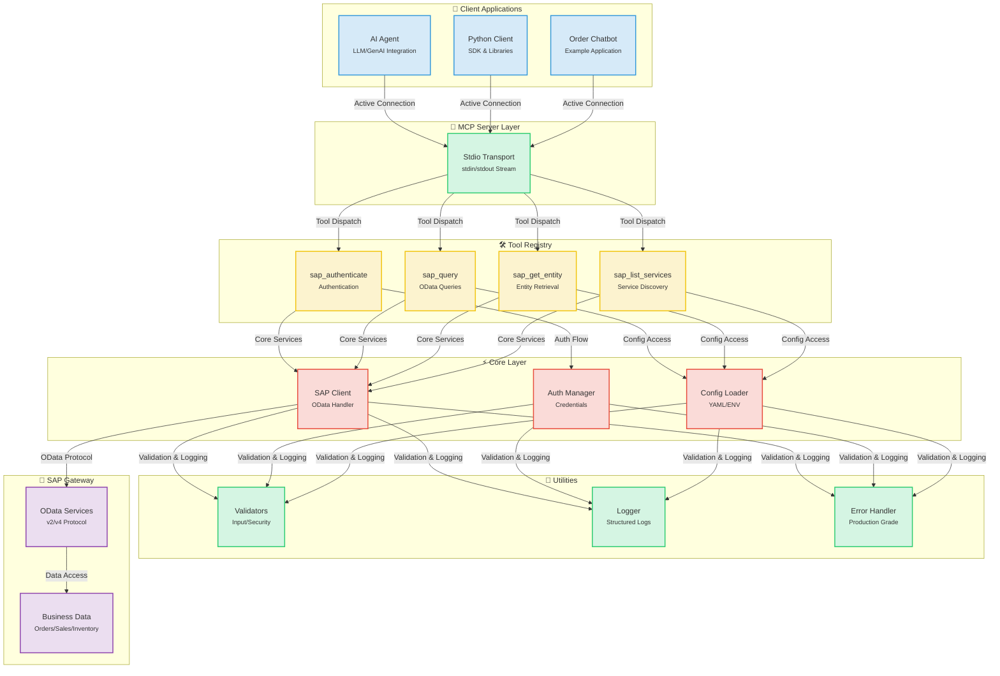
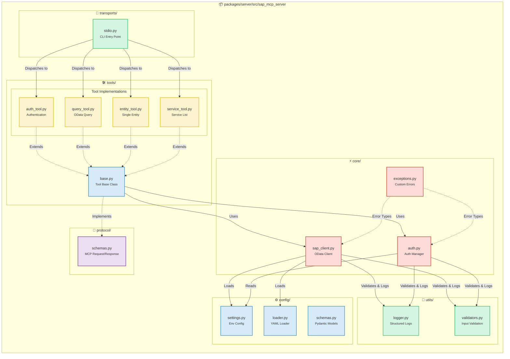
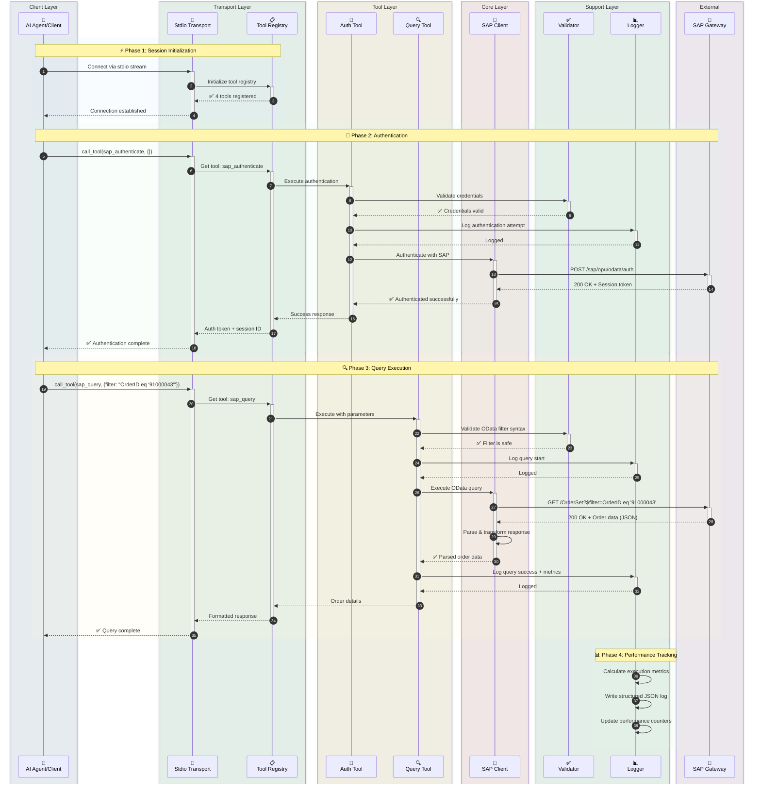
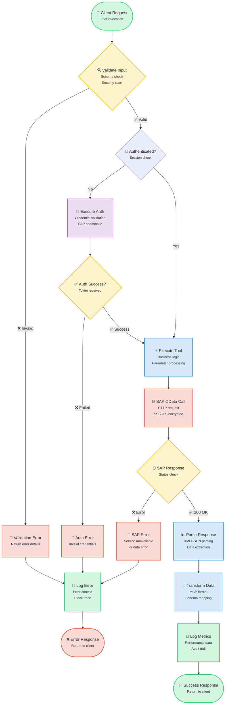
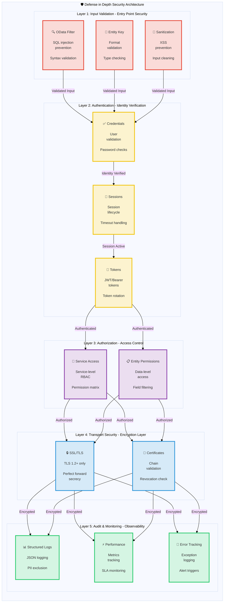

# SAP MCP - 通过模型上下文协议集成 SAP Gateway

用于 SAP Gateway 集成的完整 MCP 服务器，为 AI 代理提供用于 SAP OData 操作的模块化工具。

<div align="center">

[](https://www.python.org/downloads/)
[](LICENSE)
[]()
[]()
[]()

</div>

---

## 🎯 项目概览

生产级 MCP (Model Context Protocol) 服务器，使 AI 代理和应用程序能够通过简洁、模块化的架构与 SAP Gateway 系统进行交互。专为可靠性、安全性和开发者体验而构建。

**当前状态**: ✅ **生产就绪** (所有 5 个阶段已完成)

### 主要亮点

- 🔐 **安全的 SAP 集成**: 企业级身份验证和 SSL/TLS 支持
- 🛠️ **4 个模块化工具**: 身份验证、查询、实体检索、服务发现
- 🚀 **Stdio 传输**: 生产级 MCP 服务器
- 📊 **结构化日志**: JSON 和控制台格式，包含性能指标
- ✅ **经过验证的输入**: 全面的 OData 和安全验证
- 🧪 **经过充分测试**: 56% 覆盖率，44/45 测试通过 (98% 成功率)

---

## 📐 架构

### 系统概览

<details>
<summary>📊 点击查看系统概览图</summary>



</details>

### 组件详情

<details>
<summary>🔧 点击查看组件详情图</summary>



</details>

### 数据流：订单查询示例

<details>
<summary>🔄 点击查看数据流图</summary>



</details>

### 工具执行流程

<details>
<summary>⚡ 点击查看工具执行流程图</summary>



</details>

### 安全架构

<details>
<summary>🔒 点击查看安全架构图</summary>



</details>

---

## 📦 仓库结构

```
sap-mcp/
├── packages/
│   └── server/                          ✅ Production-Ready MCP Server
│       ├── src/sap_mcp_server/
│       │   ├── core/                    # SAP client & auth (4 files)
│       │   │   ├── __init__.py          # Module initialization
│       │   │   ├── sap_client.py        # OData operations
│       │   │   ├── auth.py              # Credential management
│       │   │   └── exceptions.py        # Custom exceptions
│       │   ├── config/                  # Configuration (4 files)
│       │   │   ├── __init__.py          # Module initialization
│       │   │   ├── settings.py          # Environment config
│       │   │   ├── loader.py            # YAML loader
│       │   │   └── schemas.py           # Pydantic models
│       │   ├── protocol/                # MCP protocol (2 files)
│       │   │   ├── __init__.py          # Module initialization
│       │   │   └── schemas.py           # Request/Response schemas
│       │   ├── tools/                   # 4 modular SAP tools (6 files)
│       │   │   ├── __init__.py          # Tool registry
│       │   │   ├── base.py              # Tool base class
│       │   │   ├── auth_tool.py         # Authentication
│       │   │   ├── query_tool.py        # OData queries
│       │   │   ├── entity_tool.py       # Entity retrieval
│       │   │   └── service_tool.py      # Service discovery
│       │   ├── transports/              # Transport layer (2 files)
│       │   │   ├── __init__.py          # Module initialization
│       │   │   └── stdio.py             # Stdio transport ✅
│       │   ├── utils/                   # Utilities (3 files)
│       │   │   ├── __init__.py          # Module initialization
│       │   │   ├── logger.py            # Structured logging
│       │   │   └── validators.py        # Input validation
│       │   └── __init__.py              # Package initialization
│       ├── config/                      # Server configuration
│       │   ├── services.yaml            # SAP services config
│       │   └── services.yaml.example    # Configuration template
│       ├── tests/                       # Test suite (7 files, 56% coverage)
│       │   ├── __init__.py              # Test package initialization
│       │   ├── conftest.py              # Pytest fixtures
│       │   ├── unit/                    # Unit tests
│       │   │   ├── __init__.py          # Unit test package
│       │   │   ├── test_base.py         # Base tool tests
│       │   │   └── test_validators.py   # Validator tests
│       │   └── integration/             # Integration tests
│       │       ├── __init__.py          # Integration test package
│       │       └── test_tool_integration.py  # Tool integration tests
│       ├── pyproject.toml               # Package configuration
│       └── README.md                    # Server package documentation
│
├── docs/                                # Documentation
│   ├── architecture/                    # Architecture documentation
│   │   └── server.md                    # Server architecture
│   └── guides/                          # User guides
│       ├── configuration.md             # Configuration guide
│       ├── deployment.md                # Deployment guide
│       ├── troubleshooting.md           # Troubleshooting guide
│       ├── odata-service-creation-flight-demo.md  # OData service creation
│       └── sfight-demo-guide.md         # SFLIGHT demo guide
│
├── examples/                            # Example applications
│   ├── basic/                           # Basic examples
│   │   └── stdio_client.py              # Stdio client example
│   ├── chatbot/                         # Chatbot examples
│   │   └── order_inquiry_chatbot.py     # Order inquiry chatbot
│   └── README.md                        # Examples documentation
│
├── scripts/                             # Development scripts
│   ├── create_structure.sh              # Project structure creation
│   ├── migrate_code.sh                  # Code migration script
│   └── update_imports.py                # Import update script
│
├── .claude/                             # Claude Code configuration
│   └── settings.local.json              # Local settings
│
├── .env.server.example                  # Environment template
├── .gitignore                           # Git ignore rules
├── README.md                            # Main documentation (English)
├── README.ja.md                         # Japanese documentation
├── README.ko.md                         # Korean documentation
├── README.th.md                         # Thai documentation
├── README.zh-TW.md                      # Traditional Chinese documentation
└── README.zh-CN.md                      # Simplified Chinese documentation
```

---

## ✨ 功能

### 核心能力

<table>
<tr>
<td width="50%">

#### 🛠️ 工具
- ✅ **sap_authenticate**: 安全的 SAP 身份验证
- ✅ **sap_query**: 带过滤器的 OData 查询
- ✅ **sap_get_entity**: 单一实体检索
- ✅ **sap_list_services**: 服务发现

</td>
<td width="50%">

#### 🚀 传输
- ✅ **Stdio**: 生产级 stdin/stdout

</td>
</tr>
<tr>
<td>

#### 📊 日志与监控
- ✅ **结构化日志**: JSON + 控制台
- ✅ **性能指标**: 请求计时
- ✅ **错误追踪**: 完整上下文
- ✅ **审计追踪**: 安全事件

</td>
<td>

#### 🔒 安全
- ✅ **输入验证**: OData 和安全
- ✅ **SSL/TLS 支持**: 安全连接
- ✅ **凭证管理**: .env.server
- ✅ **错误处理**: 生产级

</td>
</tr>
</table>

### 开发者体验

- ✅ **模块化架构**: 每个文件一个工具
- ✅ **类型安全**: 完整的类型提示
- ✅ **文档**: 全面的指南
- ✅ **简易安装**: `pip install -e .`
- ✅ **热重载**: 开发模式
- ✅ **示例应用**: 3 个可运行的示例

---

## 🚀 快速开始

### 先决条件

#### 系统要求

- **Python 3.11 或更高版本**
- **pip** (Python 包安装程序)
- **Git** (用于克隆仓库)
- SAP Gateway 访问凭证
- 虚拟环境支持

#### 安装 Python

<details>
<summary><b>🪟 Windows</b></summary>

**选项 1: Microsoft Store (推荐用于 Windows 10/11)**
```powershell
# 在 Microsoft Store 中搜索 "Python 3.11" 或 "Python 3.12"
# 或者从 python.org 下载
```

**选项 2: Python.org 安装程序**
1. 从 [python.org/downloads](https://www.python.org/downloads/) 下载
2. 运行安装程序
3. ✅ **勾选 "Add Python to PATH"**
4. 点击 "Install Now"

**验证安装:**
```powershell
python --version
# 应显示: Python 3.11.x or higher

pip --version
# 应显示: pip 23.x.x or higher
```

**常见问题:**
- 如果找不到 `python` 命令，请尝试 `python3` 或 `py`
- 如果找不到 `pip`，请安装: `python -m ensurepip --upgrade`

</details>

<details>
<summary><b>🍎 macOS</b></summary>

**选项 1: Homebrew (推荐)**
```bash
# 如果未安装 Homebrew，请先安装
/bin/bash -c "$(curl -fsSL https://raw.githubusercontent.com/Homebrew/install/HEAD/install.sh)"

# 安装 Python
brew install python@3.11
# 或
brew install python@3.12
```

**选项 2: Python.org 安装程序**
1. 从 [python.org/downloads/macos](https://www.python.org/downloads/macos/) 下载
2. 打开 `.pkg` 文件
3. 按照安装向导操作

**验证安装:**
```bash
python3 --version
# 应显示: Python 3.11.x or higher

pip3 --version
# 应显示: pip 23.x.x or higher
```

**注意:** macOS 可能预装了 Python 2.7。请始终使用 `python3` 和 `pip3` 命令。

</details>

<details>
<summary><b>🐧 Linux</b></summary>

**Ubuntu/Debian:**
```bash
# 更新包列表
sudo apt update

# 安装 Python 3.11+
sudo apt install python3.11 python3.11-venv python3-pip

# 或安装最新 Python
sudo apt install python3 python3-venv python3-pip
```

**Fedora/RHEL/CentOS:**
```bash
# 安装 Python 3.11+
sudo dnf install python3.11 python3-pip

# 或
sudo yum install python3 python3-pip
```

**Arch Linux:**
```bash
sudo pacman -S python python-pip
```

**验证安装:**
```bash
python3 --version
# 应显示: Python 3.11.x or higher

pip3 --version
# 应显示: pip 23.x.x or higher
```

</details>

---

### 1. 安装

#### 分步安装

<details open>
<summary><b>🪟 Windows (PowerShell/Command Prompt)</b></summary>

```powershell
# 克隆仓库
git clone <repository-url>
cd sap-mcp

# 创建虚拟环境
python -m venv .venv

# 激活虚拟环境
.venv\Scripts\activate
# 或在 PowerShell 中:
# .venv\Scripts\Activate.ps1

# 如果在 PowerShell 中遇到执行策略错误:
# Set-ExecutionPolicy -ExecutionPolicy RemoteSigned -Scope CurrentUser

# 验证激活 (你应该在提示符中看到 (.venv))
# (.venv) PS C:\path\to\sap-mcp>

# 安装服务器包
cd packages\server
pip install -e .

# 安装开发依赖 (可选)
pip install -e ".[dev]"

# 验证安装
sap-mcp-server-stdio --help
```

**Windows 常见问题:**
- **找不到 `python`**: 尝试 `python3` 或 `py`
- **拒绝访问**: 以管理员身份运行 PowerShell
- **执行策略**: 运行 `Set-ExecutionPolicy -ExecutionPolicy RemoteSigned -Scope CurrentUser`
- **长路径支持**: 在 Windows 中启用长路径 (设置 > 系统 > 关于 > 高级系统设置)

</details>

<details>
<summary><b>🍎 macOS (Terminal)</b></summary>

```bash
# 克隆仓库
git clone <repository-url>
cd sap-mcp

# 创建虚拟环境
python3 -m venv .venv

# 激活虚拟环境
source .venv/bin/activate

# 验证激活 (你应该在提示符中看到 (.venv))
# (.venv) user@macbook sap-mcp %

# 安装服务器包
cd packages/server
pip install -e .

# 安装开发依赖 (可选)
pip install -e ".[dev]"

# 验证安装
sap-mcp-server-stdio --help

# 检查安装路径 (对 Gemini CLI 设置很有用)
which sap-mcp-server-stdio
# 示例输出: /Users/username/sap-mcp/.venv/bin/sap-mcp-server-stdio
```

**macOS 常见问题:**
- **找不到 `python`**: 请使用 `python3`
- **找不到 `pip`**: 请使用 `pip3`
- **拒绝访问**: 不要在虚拟环境中使用 `sudo`
- **安装后找不到命令**: 确保已激活虚拟环境

</details>

<details>
<summary><b>🐧 Linux (Bash/Zsh)</b></summary>

```bash
# 克隆仓库
git clone <repository-url>
cd sap-mcp

# 创建虚拟环境
python3 -m venv .venv

# 激活虚拟环境
source .venv/bin/activate

# 验证激活 (你应该在提示符中看到 (.venv))
# (.venv) user@linux:~/sap-mcp$

# 安装服务器包
cd packages/server
pip install -e .

# 安装开发依赖 (可选)
pip install -e ".[dev]"

# 验证安装
sap-mcp-server-stdio --help

# 检查安装路径 (对 Gemini CLI 设置很有用)
which sap-mcp-server-stdio
# 示例输出: /home/username/sap-mcp/.venv/bin/sap-mcp-server-stdio
```

**Linux 常见问题:**
- **找不到 `python3-venv`**: 使用 `sudo apt install python3-venv` 安装
- **拒绝访问**: 不要在虚拟环境中使用 `sudo`
- **SSL 错误**: 安装证书: `sudo apt install ca-certificates`
- **缺少构建依赖**: 使用 `sudo apt install build-essential python3-dev` 安装

</details>

---

### 2. 配置

SAP MCP 服务器需要两个配置文件：
1. **`.env.server`**: SAP 连接凭证 (单个 SAP 系统)
2. **`services.yaml`**: SAP Gateway 服务和身份验证设置

#### 2.1. SAP 连接配置 (`.env.server`)

> **⚠️ 重要**: 从 v0.2.0 开始，`.env.server` 已合并到 **仅项目根目录**。不再支持以前的 `packages/server/.env.server` 位置。

**文件位置**: `.env.server` 必须位于 **项目根目录**。

```
sap-mcp/
├── .env.server              ← 配置文件 (唯一位置 - 在此创建)
├── .env.server.example      ← 示例模板
├── packages/
├── server/
└── README.md
```

**设置步骤**:

<details open>
<summary><b>🪟 Windows (PowerShell/Command Prompt)</b></summary>

```powershell
# 导航到项目根目录
cd C:\path\to\sap-mcp

# 复制环境模板
copy .env.server.example .env.server

# 使用记事本编辑配置，填入你的 SAP 凭证
notepad .env.server

# 或使用你喜欢的编辑器:
# code .env.server (VS Code)
# notepad++ .env.server (Notepad++)

# 注意: Windows 中的文件权限管理方式不同
# 确保文件不在公共文件夹中
# 右键点击 .env.server > 属性 > 安全 以限制访问
```

**Windows 特别说明:**
- Windows 路径使用反斜杠 (`\`)
- PowerShell 执行策略可能会阻止脚本 (见安装部分)
- 将 `.env.server` 存储在具有限制访问权限的用户文件夹中
- 如果防病毒软件阻止文件，请使用 Windows Defender 排除项

</details>

<details>
<summary><b>🍎 macOS (Terminal)</b></summary>

```bash
# 导航到项目根目录
cd /path/to/your/sap-mcp

# 复制环境模板
cp .env.server.example .env.server

# 编辑配置，填入你的 SAP 凭证
nano .env.server
# 或使用你喜欢的编辑器:
# vim .env.server
# code .env.server (VS Code)
# open -a TextEdit .env.server

# 设置适当的权限 (推荐用于安全)
chmod 600 .env.server

# 验证权限
ls -la .env.server
# 应显示: -rw------- (仅所有者可读写)
```

**macOS 特别说明:**
- 文件权限基于 Unix (与 Linux 相同)
- `chmod 600` 确保只有你的用户可以读写文件
- macOS 在首次访问时可能会有额外的安全提示
- 为了最大安全性，请存储在你的主目录中

</details>

<details>
<summary><b>🐧 Linux (Bash/Zsh)</b></summary>

```bash
# 导航到项目根目录
cd /path/to/your/sap-mcp

# 复制环境模板
cp .env.server.example .env.server

# 编辑配置，填入你的 SAP 凭证
nano .env.server
# 或使用你喜欢的编辑器:
# vim .env.server
# code .env.server (VS Code)
# gedit .env.server (GNOME)

# 设置适当的权限 (安全必需)
chmod 600 .env.server

# 验证权限
ls -la .env.server
# 应显示: -rw------- (仅所有者可读写)

# 可选: 验证文件不可被所有人读取
stat .env.server
```

**Linux 特别说明:**
- `chmod 600` 对安全至关重要 (仅所有者可访问)
- SELinux/AppArmor 可能需要额外配置
- 文件必须由运行服务器的用户拥有
- 切勿使用 `sudo` 编辑或运行此文件

</details>

---

**必需的环境变量**:
```bash
# SAP 系统连接 (单个 SAP 系统)
SAP_HOST=your-sap-host.com          # SAP Gateway 主机名
SAP_PORT=443                         # HTTPS 端口 (通常为 443 或 8443)
SAP_USERNAME=your-username           # SAP 用户 ID
SAP_PASSWORD=your-password           # SAP 密码
SAP_CLIENT=100                       # SAP 客户端编号 (例如 100, 800)

# 安全设置
SAP_VERIFY_SSL=true                  # 启用 SSL 证书验证 (推荐)
SAP_TIMEOUT=30                       # 请求超时时间 (秒)

# 可选: 连接池
SAP_MAX_CONNECTIONS=10               # 最大并发连接数 (可选)
SAP_RETRY_ATTEMPTS=3                 # 失败重试次数 (可选)
```

**安全最佳实践**:
- ✅ 切勿将 `.env.server` 提交到版本控制 (已在 `.gitignore` 中)
- ✅ 使用强且唯一的密码
- ✅ 在生产环境中启用 SSL 验证 (`SAP_VERIFY_SSL=true`)
- ✅ 限制文件权限: `chmod 600 .env.server`

#### 2.2. SAP Gateway 服务配置 (`services.yaml`)

配置 MCP 服务器可以访问的 SAP Gateway 服务 (OData 服务)。

**位置**: `packages/server/config/services.yaml`

```bash
# 复制示例配置
cp packages/server/config/services.yaml.example packages/server/config/services.yaml

# 编辑服务配置
vim packages/server/config/services.yaml
```

**基本配置示例**:

```yaml
# Gateway URL 配置
gateway:
  # OData 服务的基本 URL 模式
  base_url_pattern: "https://{host}:{port}/sap/opu/odata"

  # 元数据端点后缀
  metadata_suffix: "/$metadata"

  # 服务目录路径
  service_catalog_path: "/sap/opu/odata/IWFND/CATALOGSERVICE;v=2/ServiceCollection"

  # 身份验证端点配置
  auth_endpoint:
    # 推荐: 使用目录元数据 (无需特定服务即可工作)
    use_catalog_metadata: true

    # 可选: 使用特定服务进行身份验证 (如果目录不可用)
    # use_catalog_metadata: false
    # service_id: Z_TRAVEL_RECOMMENDATIONS_SRV
    # entity_name: AirlineSet

# SAP OData 服务
services:
  # SFLIGHT 演示服务 (旅行建议)
  - id: Z_TRAVEL_RECOMMENDATIONS_SRV
    name: "Travel Recommendations Service (SFLIGHT)"
    path: "/SAP/Z_TRAVEL_RECOMMENDATIONS_SRV"
    version: v2
    description: "OData service for the SFLIGHT demo dataset."
    entities:
      - name: AirlineSet
        key_field: CARRID
        description: "Airlines (e.g., LH, AA)"
        default_select:
          - CARRID
          - CARRNAME
          - CURRCODE
          - URL
      - name: AirportSet
        key_field: ID
        description: "Airports (e.g., FRA, JFK)"
        default_select:
          - ID
          - NAME
          - CITY
          - COUNTRY
      - name: FlightSet
        key_field: "CARRID='{CARRID}',CONNID='{CONNID}',FLDATE=datetime'{FLDATE}'"
        description: "Specific flights on a given date"
      - name: BookingSet
        key_field: "CARRID='{CARRID}',CONNID='{CONNID}',FLDATE=datetime'{FLDATE}',BOOKID='{BOOKID}'"
        description: "Individual flight bookings"

    # 可选: 此服务的自定义标头
    custom_headers: {}
```

#### 2.3. 身份验证端点选项

`auth_endpoint` 配置控制 MCP 服务器如何向 SAP 进行身份验证。

**选项 1: 目录元数据 (推荐)**

```yaml
gateway:
  auth_endpoint:
    use_catalog_metadata: true
```

**优势**:
- ✅ 无需特定的 SAP Gateway 服务即可工作
- ✅ 在不同 SAP 系统间更灵活、更便携
- ✅ 独立于服务的身份验证
- ✅ 不依赖于自定义服务部署

**身份验证流程**:
- CSRF 令牌: `/sap/opu/odata/IWFND/CATALOGSERVICE;v=2/ServiceCollection`
- 验证: `/sap/opu/odata/IWFND/CATALOGSERVICE;v=2/$metadata`

---

**选项 2: 特定服务身份验证**

```yaml
gateway:
  auth_endpoint:
    use_catalog_metadata: false
    service_id: Z_TRAVEL_RECOMMENDATIONS_SRV    # 必须匹配下面的服务 ID
    entity_name: AirlineSet                     # 必须是该服务中的实体
```

**优势**:
- ✅ 显式的基于服务的身份验证
- ✅ 当目录服务不可用时工作 (罕见)

**劣势**:
- ❌ 需要部署指定的服务
- ❌ 如果服务变更，灵活性较差
- ❌ 如果服务名称变更，必须更新配置

**身份验证流程**:
- CSRF 令牌: `/SAP/Z_TRAVEL_RECOMMENDATIONS_SRV/AirlineSet`
- 验证: `/sap/opu/odata/IWFND/CATALOGSERVICE;v=2/$metadata`

---

**建议**: 除非你有特定原因使用特定服务进行身份验证，否则请使用 **选项 1 (目录元数据)**。

### 3. 运行服务器

<details open>
<summary><b>🪟 Windows (PowerShell/Command Prompt)</b></summary>

```powershell
# 激活虚拟环境
.venv\Scripts\activate
# 或在 PowerShell 中:
# .venv\Scripts\Activate.ps1

# 运行 stdio 服务器 (推荐)
sap-mcp-server-stdio

# 或直接使用 Python
python -m sap_mcp_server.transports.stdio

# 完成后停用
deactivate
```

**Windows 特别说明:**
- 路径使用反斜杠 (`\`)
- PowerShell 可能需要更改执行策略
- 服务器在当前终端窗口中运行
- 按 `Ctrl+C` 停止服务器

</details>

<details>
<summary><b>🍎 macOS (Terminal)</b></summary>

```bash
# 激活虚拟环境
source .venv/bin/activate

# 运行 stdio 服务器 (推荐)
sap-mcp-server-stdio

# 或直接使用 Python
python3 -m sap_mcp_server.transports.stdio

# 完成后停用
deactivate
```

**macOS 特别说明:**
- 使用 `python3` 代替 `python`
- 服务器在当前终端会话中运行
- 按 `Cmd+C` 或 `Ctrl+C` 停止服务器
- 服务器运行时必须保持终端开启

</details>

<details>
<summary><b>🐧 Linux (Bash/Zsh)</b></summary>

```bash
# 激活虚拟环境
source .venv/bin/activate

# 运行 stdio 服务器 (推荐)
sap-mcp-server-stdio

# 或直接使用 Python
python3 -m sap_mcp_server.transports.stdio

# 完成后停用
deactivate
```

**Linux 特别说明:**
- 使用 `python3` 代替 `python`
- 服务器在当前终端会话中运行
- 按 `Ctrl+C` 停止服务器
- 可以使用 `nohup` 或 `systemd` 服务在后台运行

</details>

---

## 🤖 与 Gemini CLI 集成

> **📖 官方文档**: 有关 Gemini CLI 的更多信息，请访问 <a href="https://geminicli.com/" target="_blank">https://geminicli.com/</a>

### 先决条件

- 已安装 Node.js 18+ 和 npm
- 已安装 SAP MCP 服务器 (见上文快速开始)
- 用于 Gemini API 访问的 Google 帐户

### 1. 安装 Gemini CLI

```bash
# 全局安装 Gemini CLI
npm install -g @google/gemini-cli

# 验证安装
gemini --version
```

### 2. 验证 Gemini CLI

**选项 A: 使用 Gemini API 密钥 (推荐用于入门)**

1. 从 [Google AI Studio](https://aistudio.google.com/apikey) 获取你的 API 密钥
2. 设置环境变量:

```bash
export GEMINI_API_KEY="your-api-key-here"
```

**选项 B: 使用 Google Cloud (用于生产环境)**

```bash
# 首先安装 Google Cloud CLI
gcloud auth application-default login

# 设置你的项目
export GOOGLE_CLOUD_PROJECT="your-project-id"
export GOOGLE_CLOUD_LOCATION="us-central1"
```

### 3. 注册 SAP MCP 服务器

**方法 A: 使用绝对路径 (推荐用于虚拟环境)**

如果你在虚拟环境中安装了服务器，请使用可执行文件的绝对路径:

1. **查找绝对路径**:
```bash
# 导航到你的 SAP MCP 目录
cd /path/to/your/sap-mcp

# 获取绝对路径
pwd
# 示例输出: /path/to/your/sap-mcp
```

2. **编辑 `~/.gemini/settings.json`**:
```json
{
  "mcpServers": {
    "sap-server": {
      "command": "/path/to/your/sap-mcp/.venv/bin/sap-mcp-server-stdio",
      "cwd": "/path/to/your/sap-mcp",
      "description": "SAP Gateway MCP Server for OData integration",
      "timeout": 30000,
      "trust": false
    }
  }
}
```

**将 `/path/to/your/sap-mcp` 替换为你的实际项目路径。**

> **📝 注意**: `cwd` (当前工作目录) 参数对于 `.env.server` 文件的发现 **至关重要**。你 **必须** 将其设置为你的项目根目录 (例如 `/Users/username/projects/sap-mcp`)。如果省略或不正确，服务器将无法加载你的凭证。

3. **验证路径**:
```bash
# 测试命令是否工作
/path/to/your/sap-mcp/.venv/bin/sap-mcp-server-stdio --help

# 验证注册
gemini mcp list
# 预期输出: ✓ sap-server: ... (stdio) - Connected
```

---

**方法 B: 使用 CLI 命令 (如果已全局安装)**

如果 `sap-mcp-server-stdio` 在你的系统 PATH 中:

```bash
# 注册服务器
gemini mcp add sap-server sap-mcp-server-stdio

# 验证注册
gemini mcp list
```

**注意**: 此方法仅在你将虚拟环境添加到 PATH 或全局安装了包时有效。

---

**方法 C: 使用 Python 模块路径**

使用 Python 模块的替代方法:

```json
{
  "mcpServers": {
    "sap-server": {
      "command": "/path/to/your/sap-mcp/.venv/bin/python",
      "args": ["-m", "sap_mcp_server.transports.stdio"],
      "cwd": "/path/to/your/sap-mcp/packages/server",
      "description": "SAP Gateway MCP Server",
      "timeout": 30000,
      "trust": false
    }
  }
}
```

### 4. 开始使用 SAP MCP 与 Gemini CLI

```bash
# 启动 Gemini CLI
gemini

# 检查 MCP 服务器状态
> /mcp

# 查看可用的 SAP 工具
> /mcp desc

# 示例: 查询 SAP 航空公司
> Use the SAP tools to authenticate and show me all airlines

# 示例: 列出可用的 SAP 服务
> What SAP services are available?

# 示例: 获取机场详情
> Retrieve details for Frankfurt airport (FRA)
```

### 高级配置

**启用受信任服务器的自动批准**

```json
{
  "mcpServers": {
    "sap-server": {
      "command": "/path/to/your/sap-mcp/.venv/bin/sap-mcp-server-stdio",
      "trust": true,
      "timeout": 30000
    }
  }
}
```

**注意**: 设置 `"trust": true` 以跳过每个工具调用的批准提示。仅对受信任的服务器启用。

---

**过滤特定工具**

```json
{
  "mcpServers": {
    "sap-server": {
      "command": "/path/to/your/sap-mcp/.venv/bin/sap-mcp-server-stdio",
      "includeTools": ["sap_authenticate", "sap_query"],
      "excludeTools": ["sap_list_services"],
      "timeout": 30000
    }
  }
}
```

**用例**:
- `includeTools`: 仅允许特定工具 (白名单)
- `excludeTools`: 阻止特定工具 (黑名单)
- 不能同时使用两者

---

**添加环境变量 (可选)**

```json
{
  "mcpServers": {
    "sap-server": {
      "command": "/path/to/your/sap-mcp/.venv/bin/sap-mcp-server-stdio",
      "env": {
        "SAP_HOST": "${SAP_HOST}",
        "SAP_USERNAME": "${SAP_USERNAME}",
        "SAP_PASSWORD": "${SAP_PASSWORD}"
      },
      "timeout": 30000
    }
  }
}
```

**注意**: `settings.json` 中的环境变量会覆盖 `.env.server` 中的值。出于安全原因不推荐 - 最好使用 `.env.server` 文件。

---

**为慢速网络增加超时时间**

```json
{
  "mcpServers": {
    "sap-server": {
      "command": "/path/to/your/sap-mcp/.venv/bin/sap-mcp-server-stdio",
      "timeout": 60000,  // 60 秒 (默认: 30000)
      "trust": false
    }
  }
}
```

**何时增加**:
- 网络连接慢
- 大数据查询
- 复杂的 SAP 操作
- 频繁的超时错误

### 故障排除

**问题: 服务器显示 "Disconnected" 状态**

```bash
# 检查 MCP 服务器状态
gemini mcp list
# 如果你看到: ✗ sap-server: sap-mcp-server-stdio (stdio) - Disconnected
```

**解决方案 1: 使用绝对路径 (最常见)**

命令可能在虚拟环境中。更新 `~/.gemini/settings.json`:

```json
{
  "mcpServers": {
    "sap-server": {
      "command": "/path/to/your/sap-mcp/.venv/bin/sap-mcp-server-stdio",
      "description": "SAP Gateway MCP Server",
      "timeout": 30000,
      "trust": false
    }
  }
}
```

**查找你的绝对路径**:
```bash
# 导航到 SAP MCP 目录
cd /path/to/your/sap-mcp

# 获取完整路径
pwd
# 示例: /path/to/your/sap-mcp

# 验证命令是否存在
ls -la .venv/bin/sap-mcp-server-stdio
```

---

**问题: PATH 中找不到命令**

```bash
# 直接测试服务器
sap-mcp-server-stdio
# 错误: command not found

# 检查命令是否存在
which sap-mcp-server-stdio
# 返回: command not found
```

**解决方案 2: 检查虚拟环境**

```bash
# 检查虚拟环境是否存在
ls -la .venv/bin/sap-mcp-server-stdio

# 如果存在，在 settings.json 中使用绝对路径
# 如果不存在，重新安装:
cd packages/server
pip install -e .
```

---

**问题: 身份验证错误或找不到 `.env.server`**

```bash
# 验证 .env.server 是否存在于项目根目录 (不在 packages/server/ 中)
cat .env.server

# 必需字段:
# SAP_HOST=your-host
# SAP_PORT=443
# SAP_USERNAME=your-username
# SAP_PASSWORD=your-password
# SAP_CLIENT=100
```

**解决方案 3: 验证文件位置和凭证**

```bash
# 1. 检查 .env.server 是否在项目根目录
ls -la .env.server
# 应存在于: /path/to/sap-mcp/.env.server

# 2. 确保 Gemini CLI settings.json 具有 "cwd" 参数
cat ~/.gemini/settings.json
# 必须包含: "cwd": "/path/to/sap-mcp"

# 3. 手动测试身份验证
source .venv/bin/activate
python -c "from sap_mcp_server.config.settings import get_connection_config; print(get_connection_config())"
```

**常见问题**:

1. **"Field required" 错误**: `.env.server` 未加载。验证:
   - 文件存在于项目根目录: `/path/to/your/sap-mcp/.env.server`
   - Gemini CLI `settings.json` 具有正确的 `cwd` 参数
   - 文件具有适当的权限: `chmod 600 .env.server`

2. **401 Unauthorized 错误**: 在 v0.2.1 (2025-01-22) 中已修复
   - **以前的问题**: SAP Gateway 拒绝没有 `sap-client` 参数的请求
   - **当前状态**: 自动处理 - 所有请求都包含 `sap-client` 参数
   - **验证**: 确保你已更新到 v0.2.1 或更高版本
   - **手动检查**: 使用有效凭证进行身份验证现在应该成功

---

**问题: 需要重新注册服务器**

```bash
# 删除现有的服务器配置
rm ~/.gemini/settings.json

# 或手动编辑以删除 sap-server 条目
```

**解决方案 4: 清除并重新注册**

```bash
# 方法 1: 直接编辑设置
vim ~/.gemini/settings.json

# 方法 2: 使用绝对路径 (推荐)
# 遵循上面第 3 节中的 "方法 A: 使用绝对路径"
```

---

**快速诊断步骤**

1. **检查服务器可执行文件**:
```bash
/path/to/sap-mcp/.venv/bin/sap-mcp-server-stdio --help
# 应显示服务器启动消息
```

2. **检查 Gemini CLI 设置**:
```bash
cat ~/.gemini/settings.json | grep -A 5 "sap-server"
# 验证 "command" 路径是否正确
```

3. **测试连接**:
```bash
gemini mcp list
# 应显示: ✓ sap-server: ... - Connected
```

4. **在 Gemini CLI 中测试**:
```bash
gemini
> /mcp
> /mcp desc
# 应列出 SAP 工具
```

### Gemini CLI 中可用的 SAP 工具

注册后，你可以通过自然语言使用这些 SAP 工具:

| 工具 | 描述 | 示例提示 |
|------|-------------|----------------|
| **sap_authenticate** | 向 SAP Gateway 系统进行身份验证 | "Authenticate with SAP" |
| **sap_query** | 使用 OData 过滤器查询 SAP 实体 | "Show me all airlines using the travel recommendations service" |
| **sap_get_entity** | 按键检索特定实体 | "Get details for Frankfurt airport (FRA)" |
| **sap_list_services** | 列出可用的 SAP 服务 | "What SAP services are available?" |

### 示例工作流

**1. 航班查询工作流**

```bash
gemini

> Connect to SAP and find all Lufthansa flights
# Gemini 将:
# 1. 调用 sap_authenticate
# 2. 在 FlightSet 上调用 sap_query，过滤器为 "CARRID eq 'LH'"
# 3. 格式化并展示结果
```

**2. 机场分析**

```bash
> Get details for Frankfurt airport and show me available connections
# Gemini 将:
# 1. 身份验证
# 2. 对 AirportSet 调用 sap_get_entity 获取 'FRA'
# 3. 对 ConnectionSet 调用 sap_query
# 4. 展示见解
```

**3. 服务发现**

```bash
> What SAP services and entity sets are available in the system?
# Gemini 将:
# 1. 调用 sap_list_services
# 2. 格式化服务目录
```

---

## 🔧 可用工具

### 1. SAP Authenticate

使用 `.env.server` 中的凭证向 SAP Gateway 系统进行身份验证。

**请求**:
```json
{
  "name": "sap_authenticate",
  "arguments": {}
}
```

**响应**:
```json
{
  "success": true,
  "session_id": "abc123...",
  "message": "Successfully authenticated with SAP Gateway",
  "host": "example.sap.corp",
  "client": "100"
}
```

---

### 2. SAP Query

使用 OData 过滤器、选择、分页查询 SAP 实体。

**请求**:
```json
{
  "name": "sap_query",
  "arguments": {
    "service": "Z_TRAVEL_RECOMMENDATIONS_SRV",
    "entity_set": "AirlineSet",
    "filter": "CARRID eq 'LH'",
    "select": "CARRID,CARRNAME,CURRCODE",
    "top": 10,
    "skip": 0
  }
}
```

**响应**:
```json
{
  "d": {
    "results": [
      {
        "CARRID": "LH",
        "CARRNAME": "Lufthansa",
        "CURRCODE": "EUR"
      }
    ]
  }
}
```

---

### 3. SAP Get Entity

按键检索特定实体。

**请求**:
```json
{
  "name": "sap_get_entity",
  "arguments": {
    "service": "Z_TRAVEL_RECOMMENDATIONS_SRV",
    "entity_set": "AirportSet",
    "entity_key": "'FRA'"
  }
}
```

**响应**:
```json
{
  "success": true,
  "service": "Z_TRAVEL_RECOMMENDATIONS_SRV",
  "entity_set": "AirportSet",
  "entity_key": "'FRA'",
  "key_field": "ID",
  "data": {
    "d": {
      "ID": "FRA",
      "NAME": "Frankfurt International",
      "CITY": "Frankfurt",
      "COUNTRY": "DE",
      "TIME_ZONE": "CET"
    }
  }
}
```

---

### 4. SAP List Services

列出配置中所有可用的 SAP 服务。

**请求**:
```json
{
  "name": "sap_list_services",
  "arguments": {}
}
```

**响应**:
```json
{
  "success": true,
  "count": 1,
  "services": [
    {
      "id": "Z_TRAVEL_RECOMMENDATIONS_SRV",
      "name": "Travel Recommendations Service (SFLIGHT)",
      "path": "/SAP/Z_TRAVEL_RECOMMENDATIONS_SRV",
      "version": "v2",
      "description": "OData service for the SFLIGHT demo dataset.",
      "entities": [
        {
          "name": "AirlineSet",
          "key_field": "CARRID",
          "description": "Airlines (e.g., LH, AA)"
        },
        {
          "name": "AirportSet",
          "key_field": "ID",
          "description": "Airports (e.g., FRA, JFK)"
        }
      ]
    }
  ],
  "source": "services.yaml configuration"
}
```

---

### 5. 添加新工具

1. **创建工具文件**: `packages/server/src/sap_mcp_server/tools/my_tool.py`

```python
from .base import MCPTool

class MyNewTool(MCPTool):
    @property
    def name(self) -> str:
        return "my_new_tool"

    @property
    def description(self) -> str:
        return "Description of my new tool"

    @property
    def input_schema(self) -> dict:
        return {
            "type": "object",
            "properties": {
                "param": {"type": "string"}
            },
            "required": ["param"]
        }

    async def execute(self, params: dict) -> dict:
        # Implementation
        return {"result": "success"}
```

2. **注册工具**: 更新 `packages/server/src/sap_mcp_server/tools/__init__.py`

```python
from .my_tool import MyNewTool

# Add to registry
tool_registry.register(MyNewTool())
```

3. **添加测试**: `tests/unit/test_my_tool.py`

```python
import pytest
from sap_mcp_server.tools.my_tool import MyNewTool

@pytest.mark.asyncio
async def test_my_tool():
    tool = MyNewTool()
    result = await tool.execute({"param": "value"})
    assert result["result"] == "success"
```

---

## 📚 使用示例

### 使用工具注册表

```python
from sap_mcp_server.tools import tool_registry
from sap_mcp_server.protocol.schemas import ToolCallRequest

# 列出可用工具
tools = tool_registry.list_tools()
for tool in tools:
    print(f"- {tool.name}: {tool.description}")

# 调用工具
request = ToolCallRequest(
    name="sap_list_services",
    arguments={}
)
result = await tool_registry.call_tool(request)
print(result)
```

### MCP 客户端示例

```python
from mcp import StdioServerParameters
from mcp.client.session import ClientSession
from mcp.client.stdio import stdio_client

async def main():
    # 连接到 MCP 服务器
    server_params = StdioServerParameters(
        command="python",
        args=["-m", "sap_mcp_server.transports.stdio"]
    )

    async with stdio_client(server_params) as (read, write):
        async with ClientSession(read, write) as session:
            # 初始化会话
            await session.initialize()

            # 身份验证
            auth_result = await session.call_tool("sap_authenticate", {})

            # 查询航空公司
            entity_result = await session.call_tool(
                "sap_query",
                {
                    "service": "Z_TRAVEL_RECOMMENDATIONS_SRV",
                    "entity_set": "AirlineSet",
                    "filter": "CARRID eq 'LH'"
                }
            )
            print(entity_result)
```

### 结构化日志

```python
from sap_mcp_server.utils.logger import setup_logging, get_logger

# 生产环境 (JSON 日志)
setup_logging(level="INFO", json_logs=True)

# 开发环境 (彩色控制台)
setup_logging(level="DEBUG", json_logs=False)

# 使用日志记录器
logger = get_logger(__name__)
logger.info("Server started", port=8080, transport="stdio")
logger.error("Query failed", error=str(e), query=params)
```

### 输入验证

```python
from sap_mcp_server.utils.validators import (
    validate_odata_filter,
    validate_entity_key,
    sanitize_input
)

# 验证 OData 过滤器
if validate_odata_filter("CARRID eq 'LH'"):
    # 安全执行
    pass

# 消毒用户输入
safe_input = sanitize_input(user_data, max_length=1000)

# 验证实体键
if validate_entity_key(key):
    # 获取实体
    pass
```

---

## 🔒 安全

### 纵深防御

| 层级 | 实现 | 状态 |
|-------|---------------|--------|
| **输入验证** | OData 语法, SQL 注入预防 | ✅ |
| **身份验证** | 凭证验证, 会话管理 | ✅ |
| **授权** | 服务访问控制 | ✅ |
| **传输安全** | SSL/TLS, 证书验证 | ✅ |
| **审计日志** | 结构化日志, 无敏感数据 | ✅ |

### 最佳实践

1. **凭证**: 存储在 `.env.server` 中，切勿提交到 git
2. **SSL/TLS**: 在生产环境中始终启用 (`SAP_VERIFY_SSL=true`)
3. **验证**: 所有输入在 SAP 调用前进行验证
4. **日志**: 敏感数据从日志中排除
5. **错误处理**: 向客户端发送通用错误消息

---

## 🎓 SAP SFLIGHT 演示场景

### 场景概览

SFLIGHT 数据集是 SAP 提供的示例数据库，包含航班时刻表、航空公司、机场和预订数据。它是测试和演示数据建模及服务创建的绝佳资源。

本指南假设你有一个公开此数据集的 OData 服务。目标是将我们的 SAP MCP 服务器连接到此服务，并使用 AI 代理或其他客户端与其交互。

**官方 SAP 文档:**
- [SAP Documentation - Flight Model](https://help.sap.com/SAPhelp_nw73/helpdata/en/cf/21f304446011d189700000e8322d00/frameset.htm)
- [SAP Help Portal - Flight Model](https://help.sap.com/docs/SAP_NETWEAVER_702/ff5206fc6c551014a1d28b076487e7df/cf21f304446011d189700000e8322d00.html)

---

### 先决条件

1. **已安装 SAP MCP 服务器**: 你必须安装 SAP MCP 服务器并拥有可用的 Python 环境。有关完整说明，请参阅 [快速开始部分](#-quick-start)。

2. **SFLIGHT OData 服务**: 你的 SAP Gateway 系统上必须有一个公开 SFLIGHT 数据集的活动 OData 服务。
   - 如果你需要创建此服务，可以按照我们的详细指南操作: [OData Service Creation Guide: FLIGHT Demo Scenario](./docs/guides/odata-service-creation-flight-demo.md)。
   - 在本指南中，我们将假设服务名为 `Z_TRAVEL_RECOMMENDATIONS_SRV`，如指南中所创建。

---

### OData 服务创建指南

本指南提供了在 SAP 系统中使用 SAP Gateway Service Builder (`SEGW`) 创建 OData 服务的逐步演练，以公开 SAP S/4HANA Fully Activated Appliance (FAA) 版本中可用的 Flight 场景数据。

#### 场景概览

* **目标:** 通过 OData 服务公开航班时刻表、预订和相关主数据。
* **场景数据需求:** 航班时刻表、日期、时间、机场详情、航空公司详情、乘客详情、定价等。
* **涉及的 SAP 表:** `SFLIGHT`, `SPFLI`, `SCARR`, `SAIRPORT`, `SBOOK`, `SCUSTOM`.

---

#### 在 SEGW 中创建 OData 服务的步骤

##### 1. 访问 SAP Gateway Service Builder

导航到 SAP 事务代码 `SEGW`。

##### 2. 创建新项目

1. 点击 "Create Project" 按钮。
2. **Project Name:** 分配一个名称 (例如 `Z_TRAVEL_RECOMMENDATIONS_SRV`)。
3. **Description:** 提供有意义的描述。
4. **Package:** 分配到一个包 (例如 `$TMP` 用于本地开发或可传输的包)。

##### 3. 从 DDIC 结构导入数据模型

此步骤根据底层 SAP 表定义你的 OData 实体。

1. 右键点击项目中的 "Data Model" 文件夹。
2. 选择 **"Import" -> "DDIC Structure"**。
3. 对每个所需的表重复导入过程，指定 **Entity Type Name** 并选择必要的字段。

***所需操作:*** 确保在导入过程中正确标记键字段。

| DDIC 结构 | 实体类型名称 | 推荐键字段 | 相关有效载荷字段 (示例) |
| :---- | :---- | :---- | :---- |
| `SFLIGHT` | **Flight** | `CARRID`, `CONNID`, `FLDATE` | `PRICE`, `CURRENCY`, `PLANETYPE`, `SEATSMAX`, `SEATSOCC` |
| `SPFLI` | **Connection** | `CARRID`, `CONNID` | `COUNTRYFR`, `CITYFROM`, `AIRPFROM`, `COUNTRYTO`, `CITYTO`, `AIRPTO`, `DEPTIME`, `ARRTIME`, `DISTANCE` |
| `SCARR` | **Airline** | `CARRID` | `CARRNAME`, `CURRCODE`, `URL` |
| `SAIRPORT` | **Airport** | `ID` | `NAME`, `CITY`, `COUNTRY` |
| `SBOOK` | **Booking** | `CARRID`, `CONNID`, `FLDATE`, `BOOKID` | `CUSTOMID`, `CUSTTYPE`, `SMOKER`, `LUGGWEIGHT`, `WUNIT`, `INVOICE`, `CLASS`, `FORCURAM`, `ORDER_DATE` |
| `SCUSTOM` | **Passenger** | `ID` | `NAME`, `FORM`, `STREET`, `POSTCODE`, `CITY`, `COUNTRY`, `PHONE` |

##### 4. 定义关联和导航属性

关联基于键字段链接实体。导航属性允许客户端应用程序轻松遍历这些关系 (例如，使用 `$expand`)。

**逻辑关系:**

* **1:N:** Airline <-> Flights, Airline <-> Connections, Connection <-> Flights, Flight <-> Bookings, Passenger <-> Bookings.
* **N:1:** Connection <-> Origin Airport, Connection <-> Destination Airport.

**创建关联的步骤:**

1. 右键点击 "Data Model" -> **"Create" -> "Association"**。
2. 定义 **Association Name**, **Principal Entity** ('一'端), **Dependent Entity** ('多'端), 和 **Cardinality** (例如 1:N)。
3. 在下一个屏幕上，通过匹配主实体和从属实体之间的键字段来 **Specify Key Mapping**。

**要创建的具体关联:**

| No. | 关联名称 | 主:从 | 基数 | 键映射 |
| :---- | :---- | :---- | :---- | :---- |
| 1 | `Assoc_Airline_Flights` | `Airline` : `Flight` | 1:N | `Airline.CARRID` <-> `Flight.CARRID` |
| 2 | `Assoc_Airline_Connections` | `Airline` : `Connection` | 1:N | `Airline.CARRID` <-> `Connection.CARRID` |
| 3 | `Assoc_Connection_Flights` | `Connection` : `Flight` | 1:N | `CARRID` & `CONNID` (双向) |
| 4 | `Assoc_Flight_Bookings` | `Flight` : `Booking` | 1:N | `CARRID`, `CONNID`, `FLDATE` (三向) |
| 5 | `Assoc_Passenger_Bookings` | `Passenger` : `Booking` | 1:N | `Passenger.ID` <-> `Booking.CUSTOMID` |
| 6 | `Assoc_Connection_OriginAirport` | `Connection` : `Airport` | N:1 | `Connection.AIRPFROM` <-> `Airport.ID` |
| 7 | `Assoc_Connection_DestAirport` | `Connection` : `Airport` | N:1 | `Connection.AIRPTO` <-> `Airport.ID` |

**要创建的导航属性:**

| 实体 | 导航属性名称 | 目标实体 | 使用的关联 |
| :---- | :---- | :---- | :---- |
| **Airline** | `ToFlights`, `ToConnections` | `Flight`, `Connection` | `Assoc_Airline_Flights`, `Assoc_Airline_Connections` |
| **Flight** | `ToAirline`, `ToConnection`, `ToBookings` | `Airline`, `Connection`, `Booking` | `Assoc_Airline_Flights`, `Assoc_Connection_Flights`, `Assoc_Flight_Bookings` |
| **Connection** | `ToAirline`, `ToFlights`, `ToOriginAirport`, `ToDestinationAirport` | `Airline`, `Flight`, `Airport`, `Airport` | `Assoc_Airline_Connections`, `Assoc_Connection_Flights`, `Assoc_Connection_OriginAirport`, `Assoc_Connection_DestAirport` |
| **Booking** | `ToFlight`, `ToPassenger` | `Flight`, `Passenger` | `Assoc_Flight_Bookings`, `Assoc_Passenger_Bookings` |
| **Passenger** | `ToBookings` | `Booking` | `Assoc_Passenger_Bookings` |

##### 5. 生成运行时对象

1. 点击 **"Generate Runtime Objects"** 按钮 (魔术棒图标)。
2. 这将生成 ABAP 类: Model Provider Class (MPC) 和 Data Provider Class (DPC)。
3. 接受或调整默认类名。

##### 6. 实现数据提供者类 (DPC) 方法

生成的 DPC 扩展类 (例如 `ZCL_Z_TRAVEL_RECOM_DPC_EXT`) 用于自定义逻辑。

* 如果直接表映射足够，基本实现可能就足够了。
* 对于自定义过滤、连接、计算或复杂的读取/创建/更新/删除 (CRUD) 操作，你必须在 DPC 扩展类中重新定义 `*_GET_ENTITY` (单条记录) 和 `*_GET_ENTITYSET` (集合) 等方法。

这里是 AIRLINESET_GET_ENTITYSET 方法的一个示例:

```abap
METHOD airlineset_get_entityset.
  DATA: lt_airlines TYPE TABLE OF scarr,
        ls_airline TYPE scarr,
        lv_filter_string TYPE string.

  TRY.
      lv_filter_string = io_tech_request_context->get_filter( )->get_filter_string( ).
    CATCH cx_sy_itab_line_not_found.
      CLEAR lv_filter_string.
  ENDTRY.

  " TODO: Apply filtering based on lv_filter_string"
  IF lv_filter_string IS NOT INITIAL.
    SELECT * FROM scarr INTO TABLE lt_airlines WHERE (lv_filter_string).
  ELSE.
    SELECT * FROM scarr INTO TABLE lt_airlines.
  ENDIF.

  LOOP AT lt_airlines INTO ls_airline.
    APPEND ls_airline TO et_entityset.
  ENDLOOP.
ENDMETHOD.
```

##### 7. 注册服务

1. 转到事务 `/IWFND/MAINT_SERVICE`。
2. 点击 **"Add Service"**。
3. 输入后端系统的 **System Alias** (例如 `LOCAL`)。
4. 按 **Technical Service Name** (例如 `Z_TRAVEL_RECOMMENDATIONS_SRV`) 搜索你的服务。
5. 选择服务并点击 **"Add Selected Services"**。
6. 分配一个包并确认。

##### 8. 激活并测试服务

1. 在 `/IWFND/MAINT_SERVICE` 中，找到你新注册的服务。
2. 确保 **ICF node is active** (绿灯)。如果不是，选择服务，转到 **"ICF Node" -> "Activate"**。
3. 选择服务并点击 **"SAP Gateway Client"** 按钮。
4. **在 Gateway Client 中测试:**
   * 测试实体集合检索: 点击 **"EntitySets"**，选择一个 EntitySet (例如 `AirlineCollection`)，然后点击 **"Execute"**。
   * 测试 OData 功能: 尝试查询选项如 `$filter`，特别是 **`$expand`** 以验证导航属性是否工作 (例如 `/FlightSet(key)?$expand=ToAirline`)。

##### 9. 记录服务 URL

最终的 OData 服务 URL 将在 Gateway Client 中可见。它通常遵循以下结构:

`/sap/opu/odata/sap/Z_TRAVEL_RECOMMENDATIONS_SRV/.` 客户端应用程序 (如 Fiori 或自定义移动应用) 将使用此 URL 来使用 SFLIGHT 数据。

---


---

## 📖 文档

- **[服务器包 README](./packages/server/README.md)**: 详细的服务器文档
- **[配置指南](./docs/guides/configuration.md)**: YAML 和环境设置
- **[部署指南](./docs/guides/deployment.md)**: 生产部署
- **[架构文档](./docs/architecture/server.md)**: 系统架构详情
- **[API 参考](./docs/api/)**: 工具和协议文档

---

## 📝 许可证

MIT License - 详情见 [LICENSE](LICENSE) 文件。

---

## 🙏 致谢

- **MCP Protocol**: Anthropic 的模型上下文协议
- **SAP Gateway**: OData v2/v4 集成
- **Community**: 贡献者和测试者

---

<div align="center">

**Built with ❤️ for SAP integration via Model Context Protocol**

[]()
[]()
[]()

**Production Ready** | **56% Coverage** | **98% Test Success**

</div>
