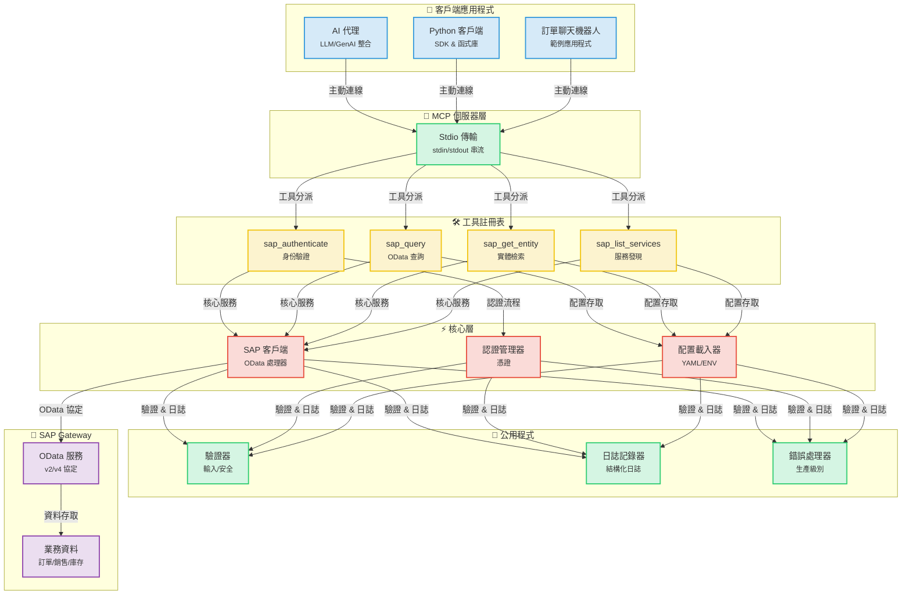
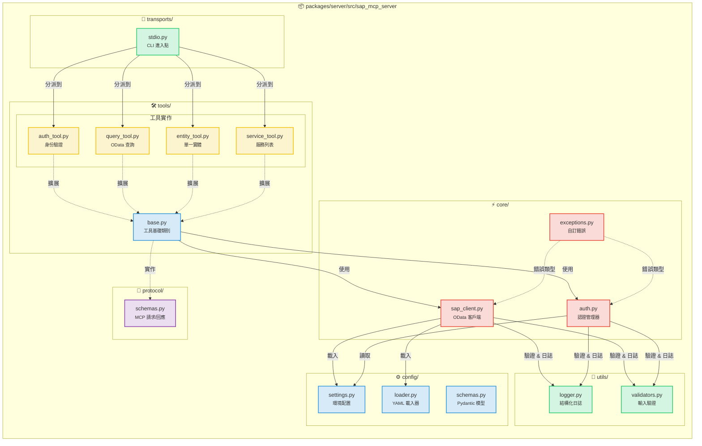
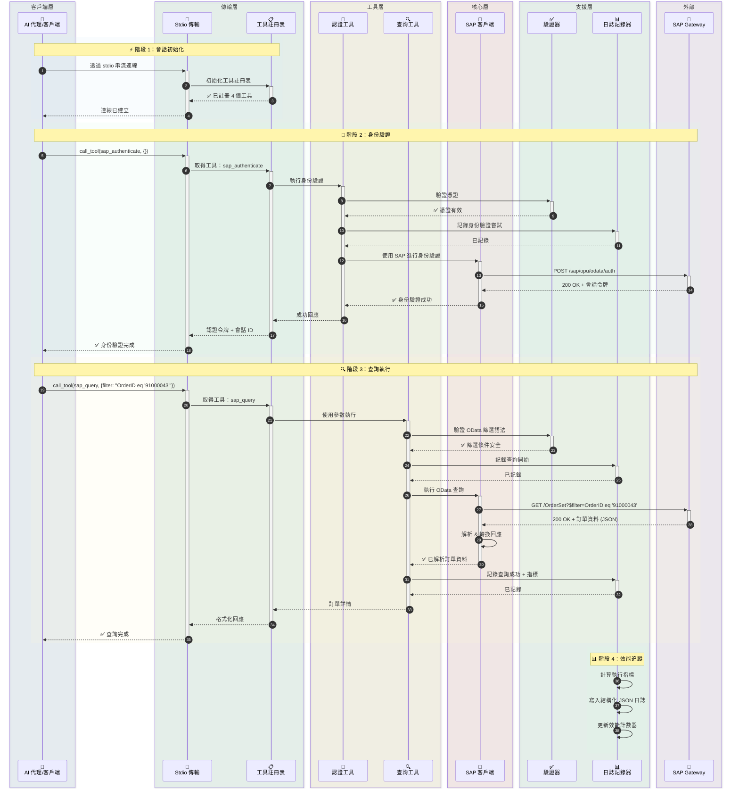
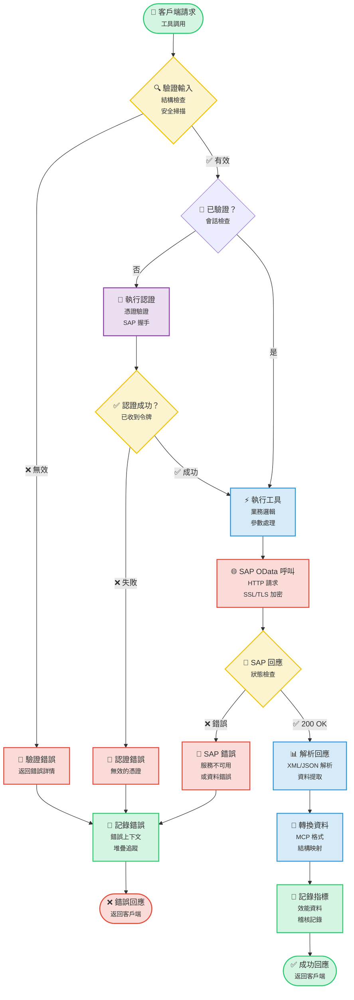
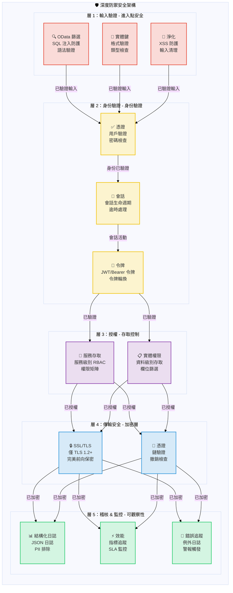

# SAP MCP - 透過模型上下文協定整合 SAP Gateway

完整的 MCP 伺服器，用於 SAP Gateway 整合，為 AI 代理提供模組化工具進行 SAP OData 操作。

<div align="center">

[](https://www.python.org/downloads/)
[](LICENSE)
[]()
[]()
[]()

</div>

---

## 🎯 專案概述

生產就緒的 MCP（模型上下文協定）伺服器，使 AI 代理和應用程式能夠透過乾淨、模組化的架構與 SAP Gateway 系統互動。專為可靠性、安全性和開發者體驗而構建。

**目前狀態**：✅ **生產就緒**（所有 5 個階段已完成）

### 主要亮點

- 🔐 **安全的 SAP 整合**：企業級身份驗證和 SSL/TLS 支援
- 🛠️ **4 個模組化工具**：身份驗證、查詢、實體檢索、服務發現
- 🚀 **Stdio 傳輸**：生產就緒的 MCP 伺服器
- 📊 **結構化日誌**：JSON 和控制台格式，含效能指標
- ✅ **已驗證的輸入**：全面的 OData 和安全驗證
- 🧪 **經過良好測試**：56% 覆蓋率，44/45 測試通過（98% 成功率）

---

## 📐 架構

### 系統概述



### 元件詳情



### 資料流：訂單查詢範例



### 工具執行流程



### 安全架構



---

## 📦 儲存庫結構

```
sap-mcp/
├── packages/
│   └── server/                          ✅ 生產就緒 MCP 伺服器
│       ├── src/sap_mcp_server/
│       │   ├── core/                    # SAP 客戶端 & 認證（3 個檔案）
│       │   │   ├── sap_client.py        # OData 操作
│       │   │   ├── auth.py              # 憑證管理
│       │   │   └── exceptions.py        # 自訂例外
│       │   ├── config/                  # 配置（4 個檔案）
│       │   │   ├── settings.py          # 環境配置
│       │   │   ├── loader.py            # YAML 載入器
│       │   │   └── schemas.py           # Pydantic 模型
│       │   ├── protocol/                # MCP 協定（2 個檔案）
│       │   │   └── schemas.py           # 請求/回應結構
│       │   ├── tools/                   # 4 個模組化 SAP 工具
│       │   │   ├── base.py              # 工具基礎類別
│       │   │   ├── auth_tool.py         # 身份驗證
│       │   │   ├── query_tool.py        # OData 查詢
│       │   │   ├── entity_tool.py       # 實體檢索
│       │   │   └── service_tool.py      # 服務發現
│       │   ├── transports/              # 傳輸層
│       │   │   └── stdio.py             # Stdio 傳輸 ✅
│       │   └── utils/                   # 公用程式（3 個檔案）
│       │       ├── logger.py            # 結構化日誌
│       │       └── validators.py        # 輸入驗證
│       ├── config/                      # 伺服器配置
│       │   ├── services.yaml            # SAP 服務配置
│       │   └── services.yaml.example    # 配置範本
│       ├── tests/                       # 45 個測試（56% 覆蓋率）
│       │   ├── conftest.py              # 8 個夾具
│       │   ├── unit/                    # 快速隔離測試
│       │   └── integration/             # 整合測試
│       └── pyproject.toml               # 套件配置
│
├── docs/                                # 文件
│   ├── guides/                          # 使用者指南
│   └── api/                             # API 參考
├── scripts/                             # 開發腳本
├── .env.server                          # 伺服器配置
├── .env.server.example                  # 配置範本
└── README.md                            # 本檔案
```

---

## ✨ 功能

### 核心功能

<table>
<tr>
<td width="50%">

#### 🛠️ 工具
- ✅ **sap_authenticate**：安全的 SAP 身份驗證
- ✅ **sap_query**：帶篩選的 OData 查詢
- ✅ **sap_get_entity**：單一實體檢索
- ✅ **sap_list_services**：服務發現

</td>
<td width="50%">

#### 🚀 傳輸
- ✅ **Stdio**：生產就緒的 stdin/stdout

</td>
</tr>
<tr>
<td>

#### 📊 日誌 & 監控
- ✅ **結構化日誌**：JSON + 控制台
- ✅ **效能指標**：請求計時
- ✅ **錯誤追蹤**：完整上下文
- ✅ **稽核記錄**：安全事件

</td>
<td>

#### 🔒 安全
- ✅ **輸入驗證**：OData & 安全
- ✅ **SSL/TLS 支援**：安全連線
- ✅ **憑證管理**：.env.server
- ✅ **錯誤處理**：生產級別

</td>
</tr>
</table>

### 品質 & 測試

| 指標 | 值 | 狀態 |
|--------|-------|--------|
| **測試覆蓋率** | 56% | 🟡 良好 |
| **通過測試** | 44/45 (98%) | 🟢 優秀 |
| **測試速度** | <0.2s | 🟢 快速 |
| **夾具** | 8 個全面 | 🟢 完整 |
| **測試類別** | 單元 + 整合 | 🟢 完整 |

### 開發者體驗

- ✅ **模組化架構**：每個檔案一個工具
- ✅ **類型安全**：完整類型提示
- ✅ **文件**：全面指南
- ✅ **簡易設定**：`pip install -e .`
- ✅ **熱重載**：開發模式
- ✅ **範例應用**：3 個工作範例

---

## 🚀 快速入門

### 前置要求

#### 系統需求

- **Python 3.11 或更高版本**
- **pip**（Python 套件安裝程式）
- **Git**（用於複製儲存庫）
- SAP Gateway 存取憑證
- 虛擬環境支援

#### 安裝 Python

<details>
<summary><b>🪟 Windows</b></summary>

**選項 1：Microsoft Store（Windows 10/11 推薦）**
```powershell
# 在 Microsoft Store 中搜尋 "Python 3.11" 或 "Python 3.12"
# 或從 python.org 下載
```

**選項 2：Python.org 安裝程式**
1. 從 [python.org/downloads](https://www.python.org/downloads/) 下載
2. 執行安裝程式
3. ✅ **勾選「Add Python to PATH」**
4. 點擊「Install Now」

**驗證安裝：**
```powershell
python --version
# 應顯示：Python 3.11.x 或更高版本

pip --version
# 應顯示：pip 23.x.x 或更高版本
```

**常見問題：**
- 如果找不到 `python` 指令，請使用 `python3` 或 `py`
- 如果找不到 `pip`，請安裝：`python -m ensurepip --upgrade`

</details>

<details>
<summary><b>🍎 macOS</b></summary>

**選項 1：Homebrew（推薦）**
```bash
# 如果未安裝 Homebrew，請先安裝
/bin/bash -c "$(curl -fsSL https://raw.githubusercontent.com/Homebrew/install/HEAD/install.sh)"

# 安裝 Python
brew install python@3.11
# 或
brew install python@3.12
```

**選項 2：Python.org 安裝程式**
1. 從 [python.org/downloads/macos](https://www.python.org/downloads/macos/) 下載
2. 開啟 `.pkg` 檔案
3. 遵循安裝精靈

**驗證安裝：**
```bash
python3 --version
# 應顯示：Python 3.11.x 或更高版本

pip3 --version
# 應顯示：pip 23.x.x 或更高版本
```

**注意：** macOS 可能預裝了 Python 2.7。請始終使用 `python3` 和 `pip3` 指令。

</details>

<details>
<summary><b>🐧 Linux</b></summary>

**Ubuntu/Debian：**
```bash
# 更新套件列表
sudo apt update

# 安裝 Python 3.11+
sudo apt install python3.11 python3.11-venv python3-pip

# 或安裝最新 Python
sudo apt install python3 python3-venv python3-pip
```

**Fedora/RHEL/CentOS：**
```bash
# 安裝 Python 3.11+
sudo dnf install python3.11 python3-pip

# 或
sudo yum install python3 python3-pip
```

**Arch Linux：**
```bash
sudo pacman -S python python-pip
```

**驗證安裝：**
```bash
python3 --version
# 應顯示：Python 3.11.x 或更高版本

pip3 --version
# 應顯示：pip 23.x.x 或更高版本
```

</details>

---

### 1. 安裝

#### 逐步安裝

<details open>
<summary><b>🪟 Windows（PowerShell/命令提示字元）</b></summary>

```powershell
# 複製儲存庫
git clone <repository-url>
cd sap-mcp

# 建立虛擬環境
python -m venv .venv

# 啟動虛擬環境
.venv\Scripts\activate
# 或在 PowerShell 中：
# .venv\Scripts\Activate.ps1

# 如果在 PowerShell 中收到執行政策錯誤：
# Set-ExecutionPolicy -ExecutionPolicy RemoteSigned -Scope CurrentUser

# 驗證啟動（提示符中應顯示 (.venv)）
# (.venv) PS C:\path\to\sap-mcp>

# 安裝伺服器套件
cd packages\server
pip install -e .

# 安裝開發相依性（選用）
pip install -e ".[dev]"

# 驗證安裝
sap-mcp-server-stdio --help
```

**Windows 常見問題：**
- **找不到 `python`**：嘗試 `python3` 或 `py`
- **權限被拒絕**：以系統管理員身份執行 PowerShell
- **執行政策**：執行 `Set-ExecutionPolicy -ExecutionPolicy RemoteSigned -Scope CurrentUser`
- **長路徑支援**：在 Windows 中啟用長路徑（設定 > 系統 > 關於 > 進階系統設定）

</details>

<details>
<summary><b>🍎 macOS（終端機）</b></summary>

```bash
# 複製儲存庫
git clone <repository-url>
cd sap-mcp

# 建立虛擬環境
python3 -m venv .venv

# 啟動虛擬環境
source .venv/bin/activate

# 驗證啟動（提示符中應顯示 (.venv)）
# (.venv) user@macbook sap-mcp %

# 安裝伺服器套件
cd packages/server
pip install -e .

# 安裝開發相依性（選用）
pip install -e ".[dev]"

# 驗證安裝
sap-mcp-server-stdio --help

# 檢查安裝路徑（對 Gemini CLI 設定有用）
which sap-mcp-server-stdio
# 範例輸出：/Users/username/sap-mcp/.venv/bin/sap-mcp-server-stdio
```

**macOS 常見問題：**
- **找不到 `python`**：請改用 `python3`
- **找不到 `pip`**：請改用 `pip3`
- **權限被拒絕**：不要在虛擬環境中使用 `sudo`
- **安裝後找不到指令**：確保虛擬環境已啟動

</details>

<details>
<summary><b>🐧 Linux（Bash/Zsh）</b></summary>

```bash
# 複製儲存庫
git clone <repository-url>
cd sap-mcp

# 建立虛擬環境
python3 -m venv .venv

# 啟動虛擬環境
source .venv/bin/activate

# 驗證啟動（提示符中應顯示 (.venv)）
# (.venv) user@linux:~/sap-mcp$

# 安裝伺服器套件
cd packages/server
pip install -e .

# 安裝開發相依性（選用）
pip install -e ".[dev]"

# 驗證安裝
sap-mcp-server-stdio --help

# 檢查安裝路徑（對 Gemini CLI 設定有用）
which sap-mcp-server-stdio
# 範例輸出：/home/username/sap-mcp/.venv/bin/sap-mcp-server-stdio
```

**Linux 常見問題：**
- **找不到 `python3-venv`**：使用 `sudo apt install python3-venv` 安裝
- **權限被拒絕**：不要在虛擬環境中使用 `sudo`
- **SSL 錯誤**：安裝憑證：`sudo apt install ca-certificates`
- **缺少建置相依性**：使用 `sudo apt install build-essential python3-dev` 安裝

</details>

---

### 2. 配置

SAP MCP 伺服器需要兩個配置檔案：
1. **`.env.server`**：SAP 連線憑證（一個 SAP 系統）
2. **`services.yaml`**：SAP Gateway 服務和身份驗證設定

#### 2.1. SAP 連線配置（`.env.server`）

> **⚠️ 重要**：自 v0.2.0 起，`.env.server` 已整合到**專案根目錄**。不再支援之前的 `packages/server/.env.server` 位置。

**檔案位置**：`.env.server` 必須位於**專案根目錄**。

```
sap-mcp/
├── .env.server              ← 配置檔案（唯一位置 - 在此建立）
├── .env.server.example      ← 範例範本
├── packages/
│   └── server/
└── README.md
```

**設定步驟**：

<details open>
<summary><b>🪟 Windows（PowerShell/命令提示字元）</b></summary>

```powershell
# 導航到專案根目錄
cd C:\path\to\sap-mcp

# 複製環境範本
copy .env.server.example .env.server

# 使用記事本編輯配置，填入您的 SAP 憑證
notepad .env.server

# 或使用您偏好的編輯器：
# code .env.server (VS Code)
# notepad++ .env.server (Notepad++)

# 注意：Windows 上的檔案權限管理方式不同
# 確保檔案不在公用資料夾中
# 右鍵 .env.server > 內容 > 安全性 以限制存取
```

**Windows 特定注意事項：**
- 在 Windows 中使用反斜線（`\`）作為路徑
- PowerShell 執行政策可能會阻止腳本（請參閱安裝部分）
- 將 `.env.server` 儲存在具有受限存取權的使用者資料夾中
- 如果防毒軟體阻止檔案，請使用 Windows Defender 排除項目

</details>

<details>
<summary><b>🍎 macOS（終端機）</b></summary>

```bash
# 導航到專案根目錄
cd /path/to/sap-mcp

# 複製環境範本
cp .env.server.example .env.server

# 使用您的 SAP 憑證編輯配置
nano .env.server
# 或使用您偏好的編輯器：
# vim .env.server
# code .env.server (VS Code)
# open -a TextEdit .env.server

# 設定適當的權限（建議用於安全性）
chmod 600 .env.server

# 驗證權限
ls -la .env.server
# 應顯示：-rw-------（僅所有者可讀/寫）
```

**macOS 特定注意事項：**
- 檔案權限基於 Unix（與 Linux 相同）
- `chmod 600` 確保只有您的使用者可以讀/寫檔案
- macOS 可能對首次存取有額外的安全提示
- 為獲得最佳安全性，請儲存在您的主目錄中

</details>

<details>
<summary><b>🐧 Linux（Bash/Zsh）</b></summary>

```bash
# 導航到專案根目錄
cd /path/to/sap-mcp

# 複製環境範本
cp .env.server.example .env.server

# 使用您的 SAP 憑證編輯配置
nano .env.server
# 或使用您偏好的編輯器：
# vim .env.server
# code .env.server (VS Code)
# gedit .env.server (GNOME)

# 設定適當的權限（安全性必需）
chmod 600 .env.server

# 驗證權限
ls -la .env.server
# 應顯示：-rw-------（僅所有者可讀/寫）

# 選用：驗證檔案不可全域讀取
stat .env.server
```

**Linux 特定注意事項：**
- `chmod 600` 對安全性至關重要（僅所有者可存取）
- SELinux/AppArmor 可能需要額外配置
- 檔案必須由執行伺服器的使用者擁有
- 切勿使用 `sudo` 編輯或執行此檔案

</details>

---

**必需的環境變數**：
```bash
# SAP 系統連線（單一 SAP 系統）
SAP_HOST=your-sap-host.com          # SAP Gateway 主機名稱
SAP_PORT=443                         # HTTPS 連接埠（通常為 443 或 8443）
SAP_USERNAME=your-username           # SAP 使用者 ID
SAP_PASSWORD=your-password           # SAP 密碼
SAP_CLIENT=100                       # SAP 用戶端編號（例如：100、800）

# 安全設定
SAP_VERIFY_SSL=true                  # 啟用 SSL 憑證驗證（建議）
SAP_TIMEOUT=30                       # 請求逾時（秒）

# 選用：連線池
SAP_MAX_CONNECTIONS=10               # 最大並行連線數（選用）
SAP_RETRY_ATTEMPTS=3                 # 失敗時的重試次數（選用）
```

**安全最佳實踐**：
- ✅ 切勿將 `.env.server` 提交到版本控制（已在 `.gitignore` 中）
- ✅ 使用強而唯一的密碼
- ✅ 在生產環境中啟用 SSL 驗證（`SAP_VERIFY_SSL=true`）
- ✅ 限制檔案權限：`chmod 600 .env.server`

#### 2.2. SAP Gateway 服務配置（`services.yaml`）

配置 MCP 伺服器可存取的 SAP Gateway 服務（OData 服務）。

**位置**：`packages/server/config/services.yaml`

```bash
# 複製範例配置
cp packages/server/config/services.yaml.example packages/server/config/services.yaml

# 編輯服務配置
vim packages/server/config/services.yaml
```

**基本配置範例**：

```yaml
# Gateway URL 配置
gateway:
  # OData 服務的基礎 URL 模式
  base_url_pattern: "https://{host}:{port}/sap/opu/odata"

  # 中繼資料端點後綴
  metadata_suffix: "/$metadata"

  # 服務目錄路徑
  service_catalog_path: "/sap/opu/odata/IWFND/CATALOGSERVICE;v=2/ServiceCollection"

  # 身份驗證端點配置
  auth_endpoint:
    # 建議：使用目錄中繼資料（無需特定服務即可運作）
    use_catalog_metadata: true

    # 選用：使用特定服務進行身份驗證（如果目錄不可用）
    # use_catalog_metadata: false
    # service_id: Z_SALES_ORDER_GENAI_SRV
    # entity_name: zsd004Set

# SAP OData 服務
services:
  # 範例：銷售訂單服務
  - id: Z_SALES_ORDER_GENAI_SRV          # 唯一服務識別符
    name: "Sales Order GenAI Service"     # 人類可讀名稱
    path: "/SAP/Z_SALES_ORDER_GENAI_SRV"  # 服務路徑
    version: v2                            # OData 版本（v2 或 v4）
    description: "Sales order management service"

    # 此服務中的實體集
    entities:
      - name: zsd004Set                    # 實體集名稱
        key_field: Vbeln                   # 主鍵欄位
        description: "Sales orders"
        default_select:                    # 要選擇的預設欄位
          - Vbeln      # 銷售訂單編號
          - Erdat      # 建立日期
          - Ernam      # 建立者
          - Netwr      # 淨值
          - Waerk      # 貨幣

    # 選用：此服務的自訂標頭
    custom_headers: {}
```

**新增多個服務**：

```yaml
services:
  # 銷售訂單服務
  - id: Z_SALES_ORDER_GENAI_SRV
    name: "Sales Order Service"
    path: "/SAP/Z_SALES_ORDER_GENAI_SRV"
    version: v2
    entities:
      - name: zsd004Set
        key_field: Vbeln
        description: "Sales orders"

  # 客戶主資料服務
  - id: Z_CUSTOMER_SRV
    name: "Customer Master Service"
    path: "/SAP/Z_CUSTOMER_SRV"
    version: v2
    entities:
      - name: CustomerSet
        key_field: Kunnr
        description: "Customer master records"
        default_select:
          - Kunnr      # 客戶編號
          - Name1      # 名稱
          - Land1      # 國家

  # 物料主資料服務
  - id: Z_MATERIAL_SRV
    name: "Material Master Service"
    path: "/SAP/Z_MATERIAL_SRV"
    version: v2
    entities:
      - name: MaterialSet
        key_field: Matnr
        description: "Material master"
```

#### 2.3. 身份驗證端點選項

`auth_endpoint` 配置控制 MCP 伺服器如何與 SAP 進行身份驗證。

**選項 1：目錄中繼資料（建議）**

```yaml
gateway:
  auth_endpoint:
    use_catalog_metadata: true
```

**優點**：
- ✅ 無需特定 SAP Gateway 服務即可運作
- ✅ 更靈活，可在不同 SAP 系統間移植
- ✅ 與服務無關的身份驗證
- ✅ 不依賴自訂服務部署

**身份驗證流程**：
- CSRF 令牌：`/sap/opu/odata/IWFND/CATALOGSERVICE;v=2/ServiceCollection`
- 驗證：`/sap/opu/odata/IWFND/CATALOGSERVICE;v=2/$metadata`

---

**選項 2：特定服務身份驗證**

```yaml
gateway:
  auth_endpoint:
    use_catalog_metadata: false
    service_id: Z_SALES_ORDER_GENAI_SRV    # 必須匹配下面的服務 ID
    entity_name: zsd004Set                  # 必須是該服務中的實體
```

**優點**：
- ✅ 明確的基於服務的身份驗證
- ✅ 當目錄服務不可用時運作（罕見）

**缺點**：
- ❌ 需要部署指定的服務
- ❌ 如果服務變更則較不靈活
- ❌ 如果服務名稱變更必須更新配置

**身份驗證流程**：
- CSRF 令牌：`/SAP/Z_SALES_ORDER_GENAI_SRV/zsd004Set`
- 驗證：`/sap/opu/odata/IWFND/CATALOGSERVICE;v=2/$metadata`

---

**建議**：除非您有特定原因使用特定服務進行身份驗證，否則使用**選項 1（目錄中繼資料）**。

### 3. 執行伺服器

<details open>
<summary><b>🪟 Windows（PowerShell/命令提示字元）</b></summary>

```powershell
# 啟動虛擬環境
.venv\Scripts\activate
# 或在 PowerShell 中：
# .venv\Scripts\Activate.ps1

# 執行 stdio 伺服器（建議）
sap-mcp-server-stdio

# 或直接使用 Python
python -m sap_mcp_server.transports.stdio

# 完成時停用
deactivate
```

**Windows 特定注意事項：**
- 路徑使用反斜線（`\`）
- PowerShell 可能需要變更執行政策
- 伺服器在目前終端視窗中執行
- 按 `Ctrl+C` 停止伺服器

</details>

<details>
<summary><b>🍎 macOS（終端機）</b></summary>

```bash
# 啟動虛擬環境
source .venv/bin/activate

# 執行 stdio 伺服器（建議）
sap-mcp-server-stdio

# 或直接使用 Python
python3 -m sap_mcp_server.transports.stdio

# 完成時停用
deactivate
```

**macOS 特定注意事項：**
- 使用 `python3` 而非 `python`
- 伺服器在目前終端會話中執行
- 按 `Cmd+C` 或 `Ctrl+C` 停止伺服器
- 伺服器執行時終端必須保持開啟

</details>

<details>
<summary><b>🐧 Linux（Bash/Zsh）</b></summary>

```bash
# 啟動虛擬環境
source .venv/bin/activate

# 執行 stdio 伺服器（建議）
sap-mcp-server-stdio

# 或直接使用 Python
python3 -m sap_mcp_server.transports.stdio

# 完成時停用
deactivate
```

**Linux 特定注意事項：**
- 使用 `python3` 而非 `python`
- 伺服器在目前終端會話中執行
- 按 `Ctrl+C` 停止伺服器
- 可使用 `nohup` 或 `systemd` 服務在背景執行

</details>

---

### 4. 驗證安裝

```bash
# 執行測試
cd packages/server
python -m pytest -v

# 含覆蓋率報告
python -m pytest --cov=sap_mcp_server --cov-report=term-missing

# 特定測試類別
python -m pytest -m unit          # 僅單元測試
python -m pytest -m integration   # 僅整合測試
```

---

## 🤖 與 Gemini CLI 整合

> **📖 官方文件**：有關 Gemini CLI 的更多資訊，請造訪 <a href="https://geminicli.com/" target="_blank">https://geminicli.com/</a>

### 前置要求

- 已安裝 Node.js 18+ 和 npm
- 已安裝 SAP MCP Server（請參閱上面的快速入門）
- 用於 Gemini API 存取的 Google 帳戶

### 1. 安裝 Gemini CLI

```bash
# 全域安裝 Gemini CLI
npm install -g @google/gemini-cli

# 驗證安裝
gemini --version
```

### 2. 驗證 Gemini CLI

**選項 A：使用 Gemini API 金鑰（建議入門使用）**

1. 從 [Google AI Studio](https://aistudio.google.com/apikey) 取得您的 API 金鑰
2. 設定環境變數：

```bash
export GEMINI_API_KEY="your-api-key-here"
```

**選項 B：使用 Google Cloud（用於生產）**

```bash
# 首先安裝 Google Cloud CLI
gcloud auth application-default login

# 設定您的專案
export GOOGLE_CLOUD_PROJECT="your-project-id"
export GOOGLE_CLOUD_LOCATION="us-central1"
```

### 3. 註冊 SAP MCP Server

**方法 A：使用絕對路徑（建議用於虛擬環境）**

如果您在虛擬環境中安裝了伺服器，請使用可執行檔的絕對路徑：

1. **尋找絕對路徑**：
```bash
# 導航到您的 SAP MCP 目錄
cd /path/to/sap-mcp

# 取得絕對路徑
pwd
# 範例輸出：/Users/sanggyulee/my-project/python-project/sap-mcp
```

2. **編輯 `~/.gemini/settings.json`**：
```json
{
  "mcpServers": {
    "sap-server": {
      "command": "/Users/sanggyulee/my-project/python-project/sap-mcp/.venv/bin/sap-mcp-server-stdio",
      "cwd": "/Users/sanggyulee/my-project/python-project/sap-mcp",
      "description": "SAP Gateway MCP Server for OData integration",
      "timeout": 30000,
      "trust": false
    }
  }
}
```

**將 `/Users/sanggyulee/my-project/python-project/sap-mcp` 替換為您的實際專案路徑。**

> **📝 注意**：`cwd`（目前工作目錄）參數對於 `.env.server` 檔案發現是**必需的**。它確保伺服器從配置檔案所在的專案根目錄執行。

3. **驗證路徑**：
```bash
# 測試指令是否運作
/path/to/your/sap-mcp/.venv/bin/sap-mcp-server-stdio --help

# 驗證註冊
gemini mcp list
# 預期：✓ sap-server: ... (stdio) - Connected
```

---

**方法 B：使用 CLI 指令（如果全域安裝）**

如果 `sap-mcp-server-stdio` 在您的系統 PATH 中：

```bash
# 註冊伺服器
gemini mcp add sap-server sap-mcp-server-stdio

# 驗證註冊
gemini mcp list
```

**注意**：此方法僅在您將虛擬環境新增到 PATH 或全域安裝套件時運作。

---

**方法 C：使用 Python 模組路徑**

使用 Python 模組的替代方法：

```json
{
  "mcpServers": {
    "sap-server": {
      "command": "/path/to/sap-mcp/.venv/bin/python",
      "args": ["-m", "sap_mcp_server.transports.stdio"],
      "cwd": "/path/to/sap-mcp/packages/server",
      "description": "SAP Gateway MCP Server",
      "timeout": 30000,
      "trust": false
    }
  }
}
```

### 4. 開始使用 SAP MCP 與 Gemini CLI

```bash
# 啟動 Gemini CLI
gemini

# 檢查 MCP 伺服器狀態
> /mcp

# 查看可用的 SAP 工具
> /mcp desc

# 範例：查詢 SAP 訂單
> Use the SAP tools to authenticate and query order number 91000043

# 範例：列出可用的 SAP 服務
> What SAP services are available?

# 範例：取得客戶詳情
> Retrieve details for customer CUST001 from SAP
```

### 進階配置

**為信任的伺服器啟用自動核准**

```json
{
  "mcpServers": {
    "sap-server": {
      "command": "/path/to/sap-mcp/.venv/bin/sap-mcp-server-stdio",
      "trust": true,
      "timeout": 30000
    }
  }
}
```

**注意**：設定 `"trust": true` 以跳過每次工具呼叫的核准提示。僅對信任的伺服器啟用。

---

**篩選特定工具**

```json
{
  "mcpServers": {
    "sap-server": {
      "command": "/path/to/sap-mcp/.venv/bin/sap-mcp-server-stdio",
      "includeTools": ["sap_authenticate", "sap_query"],
      "excludeTools": ["sap_list_services"],
      "timeout": 30000
    }
  }
}
```

**使用案例**：
- `includeTools`：僅允許特定工具（白名單）
- `excludeTools`：封鎖特定工具（黑名單）
- 不能同時使用兩者

---

**新增環境變數（選用）**

```json
{
  "mcpServers": {
    "sap-server": {
      "command": "/path/to/sap-mcp/.venv/bin/sap-mcp-server-stdio",
      "env": {
        "SAP_HOST": "${SAP_HOST}",
        "SAP_USERNAME": "${SAP_USERNAME}",
        "SAP_PASSWORD": "${SAP_PASSWORD
"       },
      "timeout": 30000
    }
  }
}
```

**注意**：`settings.json` 中的環境變數會覆蓋 `.env.server` 中的值。出於安全考量，不建議這樣做 - 建議改用 `.env.server` 檔案。

---

**為慢速網路增加逾時時間**

```json
{
  "mcpServers": {
    "sap-server": {
      "command": "/path/to/sap-mcp/.venv/bin/sap-mcp-server-stdio",
      "timeout": 60000,  // 60 秒（預設值：30000）
      "trust": false
    }
  }
}
```

**何時增加**：
- 慢速網路連線
- 大量資料查詢
- 複雜的 SAP 操作
- 頻繁的逾時錯誤

### 疑難排解

**問題：伺服器顯示「已中斷連線」狀態**

```bash
# 檢查 MCP 伺服器狀態
gemini mcp list
# 如果您看到：✗ sap-server: sap-mcp-server-stdio (stdio) - 已中斷連線
```

**解決方案 1：使用絕對路徑（最常見）**

指令可能位於虛擬環境中。更新 `~/.gemini/settings.json`：

```json
{
  "mcpServers": {
    "sap-server": {
      "command": "/full/path/to/sap-mcp/.venv/bin/sap-mcp-server-stdio",
      "description": "SAP Gateway MCP Server",
      "timeout": 30000,
      "trust": false
    }
  }
}
```

**尋找您的絕對路徑**：
```bash
# 導覽至 SAP MCP 目錄
cd /path/to/sap-mcp

# 取得完整路徑
pwd
# 範例：/Users/sanggyulee/my-project/python-project/sap-mcp

# 驗證指令是否存在
ls -la .venv/bin/sap-mcp-server-stdio
```

---

**問題：在 PATH 中找不到指令**

```bash
# 直接測試伺服器
sap-mcp-server-stdio
# 錯誤：找不到指令

# 檢查指令是否存在
which sap-mcp-server-stdio
# 傳回：找不到指令
```

**解決方案 2：檢查虛擬環境**

```bash
# 檢查虛擬環境是否存在
ls -la .venv/bin/sap-mcp-server-stdio

# 如果存在，請在 settings.json 中使用絕對路徑
# 如果不存在，請重新安裝：
cd packages/server
pip install -e .
```

---

**問題：驗證錯誤或找不到 `.env.server`**

```bash
# 驗證 .env.server 是否存在於專案根目錄（而非 packages/server/）
cat .env.server

# 必要欄位：
# SAP_HOST=your-host
# SAP_PORT=443
# SAP_USERNAME=your-username
# SAP_PASSWORD=your-password
# SAP_CLIENT=100
```

**解決方案 3：驗證檔案位置和憑證**

```bash
# 1. 檢查 .env.server 是否在專案根目錄
ls -la .env.server
# 應存在於：/path/to/sap-mcp/.env.server

# 2. 確保 Gemini CLI settings.json 具有 "cwd" 參數
cat ~/.gemini/settings.json
# 必須包含："cwd": "/path/to/sap-mcp"

# 3. 手動測試驗證
source .venv/bin/activate
python -c "from sap_mcp_server.config.settings import get_connection_config; print(get_connection_config())"
```

**常見問題**：

1. **「欄位為必填」錯誤**：`.env.server` 未載入。請驗證：
   - 檔案存在於專案根目錄：`/path/to/sap-mcp/.env.server`
   - Gemini CLI `settings.json` 具有正確的 `cwd` 參數
   - 檔案具有適當的權限：`chmod 600 .env.server`

2. **401 未經授權錯誤**：已於 v0.2.1 (2025-01-22) 中修正
   - **先前的問題**：SAP Gateway 拒絕沒有 `sap-client` 參數的要求
   - **目前狀態**：自動處理 - 所有要求皆包含 `sap-client` 參數
   - **驗證**：確保您已更新至 v0.2.1 或更新版本
   - **手動檢查**：現在使用有效的憑證應可成功驗證

---

**問題：需要重新註冊伺服器**

```bash
# 移除現有的伺服器組態
rm ~/.gemini/settings.json

# 或手動編輯以移除 sap-server 項目
```

**解決方案 4：全新重新註冊**

```bash
# 方法 1：直接編輯設定
vim ~/.gemini/settings.json

# 方法 2：使用絕對路徑（建議）
# 遵循上述第 3 節中的「方法 A：使用絕對路徑」
```

---

**快速診斷步驟**

1. **檢查伺服器可執行檔**：
```bash
/path/to/sap-mcp/.venv/bin/sap-mcp-server-stdio --help
# 應顯示伺服器啟動訊息
```

2. **檢查 Gemini CLI 設定**：
```bash
cat ~/.gemini/settings.json | grep -A 5 "sap-server"
# 驗證 "command" 路徑是否正確
```

3. **測試連線**：
```bash
gemini mcp list
# 應顯示：✓ sap-server: ... - 已連線
```

4. **在 Gemini CLI 中測試**：
```bash
gemini
> /mcp
> /mcp desc
# 應列出 SAP 工具
```

### Gemini CLI 中可用的 SAP 工具

註冊後，您可以使用自然語言使用這些 SAP 工具：

| 工具 | 說明 | 範例提示 |
|------|-------------|----------------|
| **sap_authenticate** | 使用 SAP Gateway 進行驗證 | 「使用 SAP 進行驗證」 |
| **sap_query** | 使用 OData 篩選器查詢 SAP 實體 | 「查詢客戶 CUST001 的所有訂單」 |
| **sap_get_entity** | 依索引鍵擷取特定實體 | 「取得訂單 91000043 的詳細資料」 |
| **sap_list_services** | 列出可用的 SAP 服務 | 「有哪些可用的 SAP 服務？」 |

### 範例工作流程

**1. 訂單查詢工作流程**

```bash
gemini

> 連線至 SAP 並尋找客戶 CUST001 在過去一週內下的所有訂單
# Gemini 將會：
# 1. 呼叫 sap_authenticate
# 2. 使用適當的篩選器呼叫 sap_query
# 3. 格式化並呈現結果
```

**2. 客戶分析**

```bash
> 使用 SAP 資料依訂單量分析前 5 大客戶
# Gemini 將會：
# 1. 進行驗證
# 2. 查詢客戶訂單
# 3. 彙總並分析資料
# 4. 呈現深入解析
```

**3. 服務探索**

```bash
> 系統中有哪些可用的 SAP 服務和實體集？
# Gemini 將會：
# 1. 呼叫 sap_list_services
# 2. 格式化服務目錄
```

---

## 🔧 可用工具

### 1. SAP 驗證

使用 `.env.server` 中的憑證向 SAP Gateway 系統進行驗證。

**要求**：
```json
{
  "name": "sap_authenticate",
  "arguments": {}
}
```

**回應**：
```json
{
  "success": true,
  "session_id": "abc123...",
  "message": "已成功向 SAP 進行驗證"
}
```

---

### 2. SAP 查詢

使用 OData 篩選器、選取、分頁查詢 SAP 實體。

**要求**：
```json
{
  "name": "sap_query",
  "arguments": {
    "service": "Z_SALES_ORDER_GENAI_SRV",
    "entity_set": "zsd004Set",
    "filter": "OrderID eq '91000043'",
    "select": "OrderID,Bstnk,Kunnr,Matnr",
    "top": 10,
    "skip": 0
  }
}
```

**回應**：
```json
{
  "data": {
    "d": {
      "results": [
        {
          "OrderID": "91000043",
          "Bstnk": "PO-2024-001",
          "Kunnr": "CUST001",
          "Matnr": "MAT-12345"
        }
      ]
    }
  },
  "count": 1
}
```

---

### 3. SAP 取得實體

依索引鍵擷取特定實體。

**要求**：
```json
{
  "name": "sap_get_entity",
  "arguments": {
    "service": "Z_SALES_ORDER_GENAI_SRV",
    "entity_set": "zsd004Set",
    "entity_key": "91000043"
  }
}
```

**回應**：
```json
{
  "data": {
    "d": {
      "OrderID": "91000043",
      "Bstnk": "PO-2024-001",
      "Kunnr": "CUST001",
      "Matnr": "MAT-12345",
      "Wmeng": "100",
      "Vkorg": "1000"
    }
  }
}
```

---

### 4. SAP 列出服務

列出組態中所有可用的 SAP 服務。

**要求**：
```json
{
  "name": "sap_list_services",
  "arguments": {}
}
```

**回應**：
```json
{
  "services": [
    {
      "name": "Z_SALES_ORDER_GENAI_SRV",
      "description": "適用於 GenAI 的銷售訂單服務",
      "entity_sets": ["zsd004Set", "OrderHeaderSet"]
    }
  ],
  "count": 1
}
```

---

## 📚 使用範例

### 使用工具登錄

```python
from sap_mcp_server.tools import tool_registry
from sap_mcp_server.protocol.schemas import ToolCallRequest

# 列出可用工具
tools = tool_registry.list_tools()
for tool in tools:
    print(f"- {tool.name}: {tool.description}")

# 呼叫工具
request = ToolCallRequest(
    name="sap_list_services",
    arguments={}
)
result = await tool_registry.call_tool(request)
print(result)
```

### MCP 用戶端範例

```python
from mcp import StdioServerParameters
from mcp.client.session import ClientSession
from mcp.client.stdio import stdio_client

async def main():
    # 連線至 MCP 伺服器
    server_params = StdioServerParameters(
        command="python",
        args=["-m", "sap_mcp_server.transports.stdio"]
    )

    async with stdio_client(server_params) as (read, write):
        async with ClientSession(read, write) as session:
            # 初始化工作階段
            await session.initialize()

            # 驗證
            auth_result = await session.call_tool("sap_authenticate", {})

            # 查詢訂單
            entity_result = await session.call_tool(
                "sap_get_entity",
                {
                    "service": "Z_SALES_ORDER_GENAI_SRV",
                    "entity_set": "zsd004Set",
                    "entity_key": "91000043"
                }
            )
            print(entity_result)
```

### 結構化記錄

```python
from sap_mcp_server.utils.logger import setup_logging, get_logger

# 生產環境（JSON 記錄）
setup_logging(level="INFO", json_logs=True)

# 開發環境（彩色主控台）
setup_logging(level="DEBUG", json_logs=False)

# 使用記錄器
logger = get_logger(__name__)
logger.info("伺服器已啟動", port=8080, transport="stdio")
logger.error("查詢失敗", error=str(e), query=params)
```

### 輸入驗證

```python
from sap_mcp_server.utils.validators import (
    validate_odata_filter,
    validate_entity_key,
    sanitize_input
)

# 驗證 OData 篩選器
if validate_odata_filter("OrderID eq '12345'"):
    # 可安全執行
    pass

# 清理使用者輸入
safe_input = sanitize_input(user_data, max_length=1000)

# 驗證實體金鑰
if validate_entity_key(key):
    # 擷取實體
    pass
```

---

## 🔒 安全性

### 深度防禦

| 層級 | 實作 | 狀態 |
|-------|---------------|--------|
| **輸入驗證** | OData 語法、SQL 注入防護 | ✅ |
| **驗證** | 憑證驗證、工作階段管理 | ✅ |
| **授權** | 服務存取控制 | ✅ |
| **傳輸安全性** | SSL/TLS、憑證驗證 | ✅ |
| **稽核記錄** | 結構化記錄、無敏感資料 | ✅ |

### 最佳做法

1. **憑證**：儲存在 `.env.server` 中，切勿提交至 git
2. **SSL/TLS**：一律在生產環境中啟用 (`SAP_VERIFY_SSL=true`)
3. **驗證**：在 SAP 呼叫前驗證所有輸入
4. **記錄**：從記錄中排除敏感資料
5. **錯誤處理**：向用戶端提供一般錯誤訊息

---

## 🧪 測試

### 測試結構

```
tests/
├── conftest.py              # 8 個綜合測試固件
├── unit/                    # 快速、隔離的測試（40 個測試）
│   ├── test_base.py        # 工具登錄（16 個測試）
│   └── test_validators.py  # 驗證器（24 個測試）
└── integration/             # 整合測試（5 個測試）
    └── test_tool_integration.py  # 工具系統測試
```

### 執行測試

```bash
# 所有測試的詳細輸出
python -m pytest -v

# 包含覆蓋率報告
python -m pytest --cov=sap_mcp_server --cov-report=term-missing

# HTML 覆蓋率報告
python -m pytest --cov=sap_mcp_server --cov-report=html
open htmlcov/index.html

# 特定測試類別
python -m pytest -m unit          # 僅單元測試
python -m pytest -m integration   # 僅整合測試
python -m pytest -m sap           # SAP 整合測試

# 特定測試檔案
python -m pytest tests/unit/test_validators.py -v

# 監看模式（需要 pytest-watch）
ptw -- -v
```

### 覆蓋率報告

**目前：56%**（目標：70% 以上）

| 模組 | 覆蓋率 | 狀態 |
|--------|----------|--------|
| `tools/base.py` | 100% | 🟢 絕佳 |
| `protocol/schemas.py` | 100% | 🟢 絕佳 |
| `tools/service_tool.py` | 88% | 🟢 良好 |
| `config/settings.py` | 82% | 🟢 良好 |
| `utils/validators.py` | 80% | 🟢 良好 |
| `core/sap_client.py` | 45% | 🟡 需要改善 |
| `transports/stdio.py` | 30% | 🟡 需要改善 |

---

## 🛠️ 開發

### 專案設定

```bash
# 複製並設定
git clone <repository-url>
cd sap-mcp

# 建立虛擬環境
python3 -m venv .venv
source .venv/bin/activate

# 以開發模式安裝
cd packages/server
pip install -e ".[dev]"
```

### 新增工具

1. **建立工具檔案**：`packages/server/src/sap_mcp_server/tools/my_tool.py`

```python
from .base import MCPTool

class MyNewTool(MCPTool):
    @property
    def name(self) -> str:
        return "my_new_tool"

    @property
    def description(self) -> str:
        return "我的新工具說明"

    @property
    def input_schema(self) -> dict:
        return {
            "type": "object",
            "properties": {
                "param": {"type": "string"}
            },
            "required": ["param"]
        }

    async def execute(self, params: dict) -> dict:
        # 實作
        return {"result": "success"}
```

2. **註冊工具**：更新 `packages/server/src/sap_mcp_server/tools/__init__.py`

```python
from .my_tool import MyNewTool

# 新增至登錄
tool_registry.register(MyNewTool())
```

3. **新增測試**：`tests/unit/test_my_tool.py`

```python
import pytest
from sap_mcp_server.tools.my_tool import MyNewTool

@pytest.mark.asyncio
async def test_my_tool():
    tool = MyNewTool()
    result = await tool.execute({"param": "value"})
    assert result["result"] == "success"
```

### 程式碼品質

```bash
# 格式化程式碼
black packages/server/src

# 排序匯入
isort packages/server/src

# 檢查程式碼風格
flake8 packages/server/src

# 類型檢查
mypy packages/server/src

# 安全性掃描
bandit -r packages/server/src

# 所有品質檢查
black . && isort . && flake8 . && mypy . && bandit -r src/
```

---

## 🗺️ 藍圖

### ✅ 已完成 (v0.2.0)

- [x] 第 1 階段：結構與程式碼遷移
- [x] 第 2 階段：工具分割（4 個模組化工具）
- [x] 第 3 階段：傳輸層（Stdio）
- [x] 第 4 階段：公用程式與測試（56% 覆蓋率）
- [x] 第 5 階段：清理與文件

### 📝 規劃中 (v0.3.0)

**高優先順序**：
- [ ] 將測試覆蓋率提高至 70% 以上
- [ ] 效能基準測試
- [ ] API 文件（Sphinx）

**中優先順序**：
- [ ] Docker 部署指南
- [ ] Kubernetes 資訊清單
- [ ] Prometheus 指標
- [ ] OpenTelemetry 整合

**低優先順序**：
- [ ] 速率限制
- [ ] 快取層
- [ ] GraphQL 支援
- [ ] WebSocket 傳輸
- [ ] HTTP/REST 傳輸

---

## 🤝 貢獻

### 入門

1. 複製儲存庫
2. 建立功能分支 (`git checkout -b feature/amazing-feature`)
3. 進行變更並新增測試
4. 執行測試：`python -m pytest -v`
5. 執行程式碼品質檢查：`black . && isort . && flake8 .`
6. 提交變更 (`git commit -m '新增驚人的功能'`)
7. 推送至分支 (`git push origin feature/amazing-feature`)
8. 開啟提取要求

### 編碼標準

- **樣式**：遵循 PEP 8 樣式指南
- **類型**：為所有函式新增類型提示
- **文件**：撰寫詳盡的文件字串
- **測試**：維持 50% 以上的覆蓋率
- **提交**：使用傳統提交訊息

### 提取要求檢查清單

- [ ] 已新增/更新測試並通過
- [ ] 已更新文件
- [ ] 已使用 `black` 格式化程式碼
- [ ] 已使用 `isort` 排序匯入
- [ ] 已新增類型提示
- [ ] 已維持/改善覆蓋率
- [ ] 已更新變更記錄

---

## 📊 專案指標

| 指標 | 值 |
|--------|-------|
| **程式碼行數** | 927（生產程式碼） |
| **測試覆蓋率** | 56% |
| **測試** | 45（44 個通過，98% 成功率） |
| **Python 模組** | 24 |
| **SAP 工具** | 4 |
| **傳輸層** | 1 (Stdio) |
| **開發時間** | 約 3 小時（所有 5 個階段） |
| **Python 版本** | 3.11+ |
| **相依性** | 11 個核心，9 個開發 |

---

## 📖 文件

- **[伺服器套件 README](./packages/server/README.md)**：詳細的伺服器文件
- **[組態指南](./docs/guides/configuration.md)**：YAML 和環境設定
- **[部署指南](./docs/guides/deployment.md)**：生產部署
- **[架構文件](./docs/architecture/server.md)**：系統架構詳細資料
- **[API 參考](./docs/api/)**：工具和通訊協定文件

---

## 📝 授權

MIT 授權 - 詳情請參閱 [LICENSE](LICENSE) 檔案。

---

## 🆘 支援

- **問題**：[建立問題](https://github.com/midasol/SAP-MCP-GCP/issues)
- **文件**：請參閱 `docs/` 目錄
- **伺服器套件**：實作詳細資料請參閱 `packages/server/`
- **社群**：加入我們的討論

---

## 📜 版本歷史

### v0.2.2 (目前) - 2025-11-10

**文件更新**：
- 📚 **增強的 README**：新增了詳盡的作業系統特定（Windows、macOS、Linux）安裝和組態指南
  - 為每個作業系統新增了詳細的 Python 安裝說明
  - 新增了作業系統特定的虛擬環境設定和啟用指令
  - 新增了具有適當檔案權限的作業系統特定 `.env.server` 組態指南
  - 新增了作業系統特定的伺服器執行說明
  - 新增了 Gemini CLI 官方文件連結
- 🔧 **提高清晰度**：移除了已棄用的檔案路徑參考
- ✨ **更佳的使用者體驗**：新增了可折疊區段以改善文件導覽

### v0.2.1 - 2025-01-22

**錯誤修正**：
- 🐛 **重大修正**：在所有 SAP Gateway API 要求中新增了遺失的 `sap-client` 參數
  - **問題**：驗證失敗，出現 401 未經授權錯誤
  - **根本原因**：SAP Gateway 需要 `sap-client` 參數才能將要求路由至正確的 SAP 用戶端
  - **解決方案**：
    - 修改 `auth.py` 以在 CSRF 權杖和驗證 URL 中包含 `sap-client`
    - 修改 `sap_client.py` 以在所有 API 要求中自動插入 `sap-client` 參數
  - **影響**：所有 SAP Gateway 操作現在都能透過適當的用戶端路由正常運作

**技術詳細資料**：
- 更新 `SAPAuthenticator._get_csrf_token()` 以將 `?sap-client={client}` 附加至 URL
- 更新 `SAPAuthenticator._authenticate_session()` 以將 `?sap-client={client}` 附加至 URL
- 更新 `SAPClient._make_request()` 以自動將 `sap-client` 新增至要求參數
- 無需變更組態 - 使用 `.env.server` 中現有的 `SAP_CLIENT`

### v0.2.0 - 2025-01-15

**主要功能**：
- ✅ 完整的模組化架構
- ✅ 4 個生產就緒的 SAP 工具
- ✅ 具有 MCP 伺服器的 Stdio 傳輸
- ✅ 結構化記錄和驗證
- ✅ 56% 的測試覆蓋率（45 個測試）
- ✅ 詳盡的文件

**改善項目**：
- 修正了非同步進入點問題
- 更新了模組路徑
- 增強了錯誤處理
- 改善了安全性驗證

**組態變更**：
- ⚠️ **重大變更**：`.env.server` 檔案位置已整合至**僅限專案根目錄**
  - 不再支援先前的位置 `packages/server/.env.server`
  - 改善了以優先順序為基礎的檔案探索邏輯
  - 增強了組態檔案位置的記錄
- Gemini CLI 整合現在需要在 `settings.json` 中使用 `cwd` 參數
- 更新了 README，其中包含有關組態問題的詳細疑難排解

### v0.1.0 (初始) - 2024-12-01

- 基本的 SAP Gateway 整合
- 單體式結構
- 有限的測試
- 僅限 Stdio 伺服器

---

## 🙏 致謝

- **MCP 通訊協定**：Anthropic 的模型內容通訊協定
- **SAP Gateway**：OData v2/v4 整合
- **社群**：貢獻者和測試人員

---

<div align="center">

**以 ❤️ 為模型內容通訊協定打造的 SAP 整合**

[]()
[]()
[]()

**生產就緒** | **56% 覆蓋率** | **98% 測試成功率**

</div>