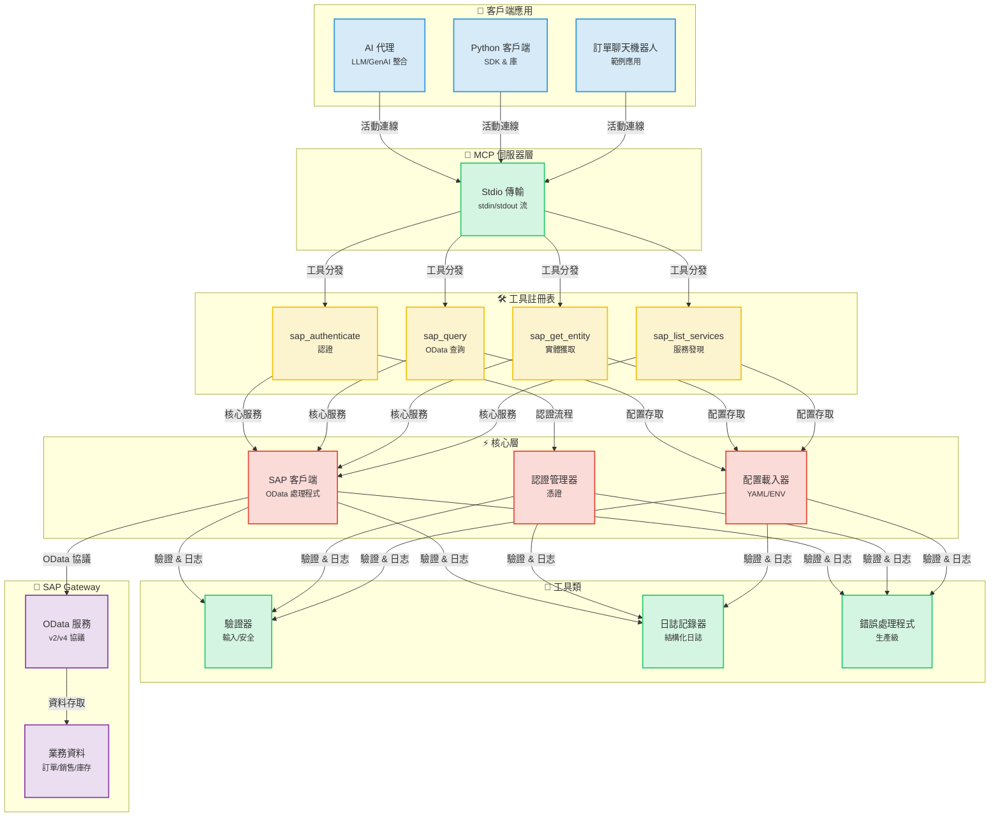
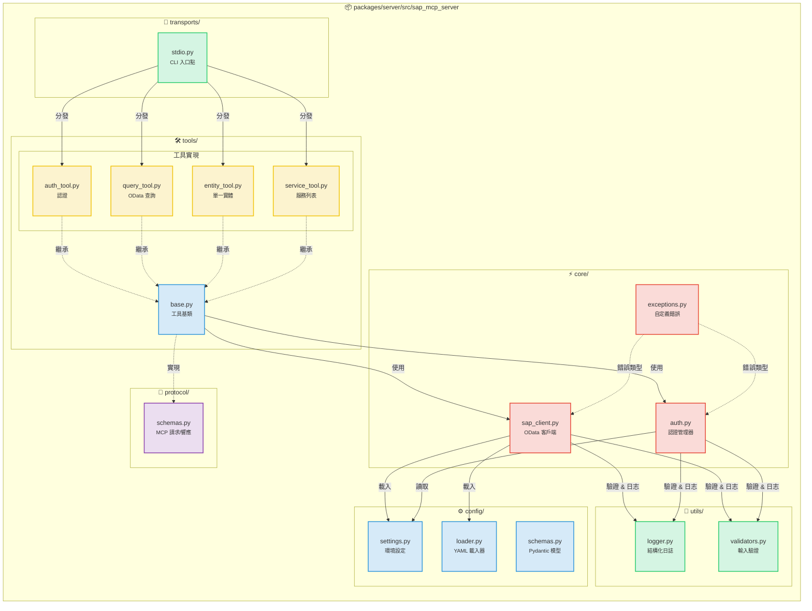
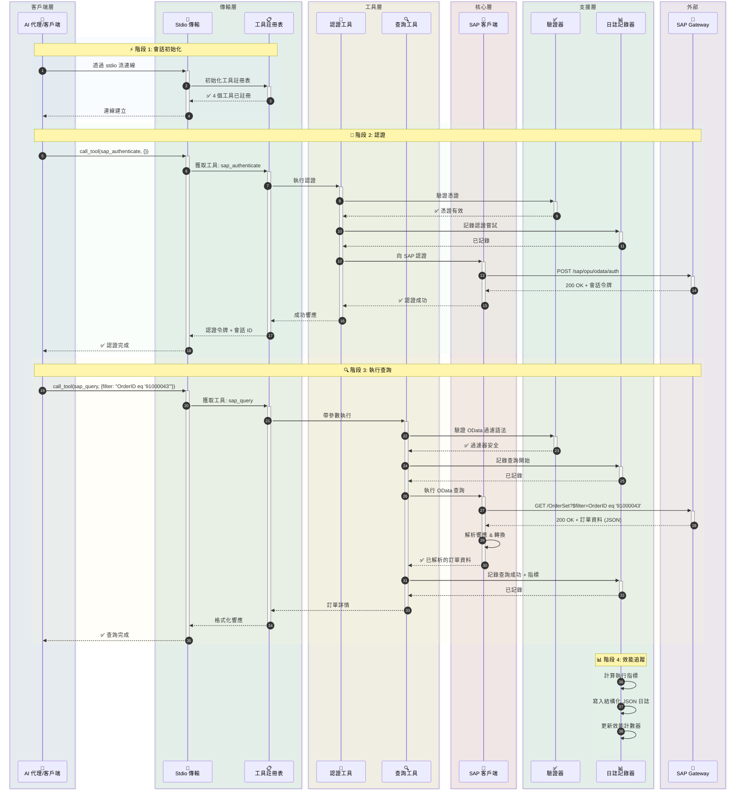
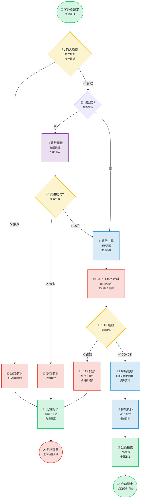
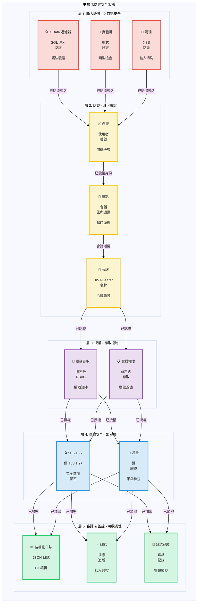

# SAP MCP - 透過模型上下文協議 (MCP) 整合 SAP Gateway

用於 SAP Gateway 整合的完整 MCP 伺服器，為 AI 代理和 SAP OData 操作提供模組化工具。

<div align="center">

[](https://www.python.org/downloads/)
[](LICENSE)
[]()
[]()
[]()

</div>

---
## 📑 目錄

- [🎯 專案概述](#-專案概述)
- [📋 準備工作](#-準備工作)
- [📐 架構](#-架構)
  - [系統概覽](#系統概覽)
  - [組件詳情](#組件詳情)
  - [資料流](#資料流-訂單查詢範例)
  - [工具執行流](#工具執行流)
  - [安全架構](#安全架構)
- [📦 倉庫結構](#-倉庫結構)
- [✨ 功能](#-功能)
- [🎓 SAP SFLIGHT 演示場景](#-sap-sflight-演示場景)
  - [場景概覽](#場景概覽)
  - [OData 服務建立指南](#odata-服務建立指南)
- [🚀 快速開始](#-快速開始)
  - [MCP 伺服器前提條件](#mcp-伺服器前提條件)
  - [安裝](#1-安裝)
  - [配置](#2-配置)
  - [執行伺服器](#3-執行伺服器)
- [🤖 與 Gemini CLI 整合](#-與-gemini-cli-整合)
  - [前提條件](#前提條件)
  - [安裝 Gemini CLI](#1-安裝-gemini-cli)
  - [Gemini CLI 認證](#2-gemini-cli-認證)
  - [註冊 SAP MCP 伺服器](#3-註冊-sap-mcp-伺服器)
  - [開始使用](#4-開始在-gemini-cli-中使用-sap-mcp)
  - [進階配置](#進階配置)
  - [故障排除](#故障排除)
  - [可用工具](#gemini-cli-中可用的-sap-工具)
  - [工作流範例](#工作流範例)
- [🔧 可用工具](#-可用工具)
  - [SAP 認證 (sap_authenticate)](#1-sap-認證-sap_authenticate)
  - [SAP 查詢 (sap_query)](#2-sap-查詢-sap_query)
  - [SAP 實體獲取 (sap_get_entity)](#3-sap-實體獲取-sap_get_entity)
  - [SAP 服務列表 (sap_list_services)](#4-sap-服務列表-sap_list_services)
  - [新增新工具](#5-新增新工具)
- [📚 使用範例](#-使用範例)
- [🔒 安全](#-安全)
- [📖 文件](#-文件)
- [📝 許可證](#-許可證)
- [🙏 致謝](#-致謝)

---


## 🎯 專案概述

這是一個生產就緒的模型上下文協議 (MCP) 伺服器，旨在透過清晰、模組化的架構使 AI 代理和應用程式能夠與 SAP Gateway 系統進行互動。專為可靠性、安全性和開發者體驗而構建。

**當前狀態**: ✅ **生產就緒** (所有 5 個階段已完成)

### 主要特性

- 🔐 **安全的 SAP 整合**: 企業級認證和 SSL/TLS 支援
- 🛠️ **4 個模組化工具**: 認證、查詢、實體獲取和服務發現
- 🚀 **Stdio 傳輸**: 生產級 MCP 伺服器
- 📊 **結構化日誌**: JSON 和控制台格式，包含效能指標
- ✅ **驗證輸入**: 全面的 OData 和安全驗證
- 🧪 **充分測試**: 56% 覆蓋率，44/45 測試通過 (98% 成功率)

---

---

## 📋 準備工作

在 5 分鐘內開始使用 SAP MCP：

```bash
# 1. 複製並進入專案
git clone <repository-url>
cd sap-mcp

# 2. 建立虛擬環境並安裝
python3 -m venv .venv
source .venv/bin/activate  # Windows: .venv\Scripts\activate
cd packages/server
pip install -e .

# 3. 配置 SAP 連線
cd ../..
cp .env.server.example .env.server
# 編輯 .env.server 填入您的 SAP 憑證

# 4. 配置服務
cp packages/server/config/services.yaml.example packages/server/config/services.yaml
# 編輯 services.yaml 配置您的 SAP 服務

# 5. 執行伺服器
sap-mcp-server-stdio
```

**下一步：**
- 📖 詳細安裝說明，請參閱 [快速開始](#-快速開始)。
- 🤖 連線 AI 代理，請檢視 [與 Gemini CLI 整合](#-與-gemini-cli-整合)。
- 🔧 API 文件，請瀏覽 [可用工具](#-可用工具)。

## 📐 架構

### 系統概覽

<details>
<summary>📊 檢視系統概覽圖（點選展開）</summary>



</details>

### 組件詳情

<details>
<summary>🔧 檢視組件詳情圖（點選展開）</summary>



</details>

### 資料流: 訂單查詢範例

<details>
<summary>🔄 檢視資料流圖（點選展開）</summary>



</details>

### 工具執行流

<details>
<summary>⚡ 檢視工具執行流圖（點選展開）</summary>



</details>

### 安全架構

<details>
<summary>🔒 檢視安全架構圖（點選展開）</summary>



</details>

---

## 📦 倉庫結構

```
sap-mcp/
├── packages/
│   └── server/                          ✅ 生產就緒 MCP 伺服器
│       ├── src/sap_mcp_server/
│       │   ├── core/                    # SAP 客戶端 & 認證 (4 檔案)
│       │   │   ├── __init__.py          # 模組初始化
│       │   │   ├── sap_client.py        # OData 操作
│       │   │   ├── auth.py              # 憑證管理
│       │   │   └── exceptions.py        # 自定義異常
│       │   ├── config/                  # 配置 (4 檔案)
│       │   │   ├── __init__.py          # 模組初始化
│       │   │   ├── settings.py          # 環境設定
│       │   │   ├── loader.py            # YAML 載入器
│       │   │   └── schemas.py           # Pydantic 模型
│       │   ├── protocol/                # MCP 協議 (2 檔案)
│       │   │   ├── __init__.py          # 模組初始化
│       │   │   └── schemas.py           # 請求/響應模式
│       │   ├── tools/                   # 4 個模組化 SAP 工具 (6 檔案)
│       │   │   ├── __init__.py          # 工具註冊表
│       │   │   ├── base.py              # 工具基類
│       │   │   ├── auth_tool.py         # 認證
│       │   │   ├── query_tool.py        # OData 查詢
│       │   │   ├── entity_tool.py       # 實體獲取
│       │   │   └── service_tool.py      # 服務發現
│       │   ├── transports/              # 傳輸層 (2 檔案)
│       │   │   ├── __init__.py          # 模組初始化
│       │   │   └── stdio.py             # Stdio 傳輸 ✅
│       │   ├── utils/                   # 工具類 (3 檔案)
│       │   │   ├── __init__.py          # 模組初始化
│       │   │   ├── logger.py            # 結構化日誌
│       │   │   └── validators.py        # 輸入驗證
│       │   └── __init__.py              # 包初始化
│       ├── config/                      # 伺服器配置
│       │   ├── services.yaml            # SAP 服務配置
│       │   └── services.yaml.example    # 配置模板
│       ├── tests/                       # 測試套件 (7 檔案, 56% 覆蓋率)
│       │   ├── __init__.py              # 測試包初始化
│       │   ├── conftest.py              # Pytest fixtures
│       │   ├── unit/                    # 單元測試
│       │   │   ├── __init__.py          # 單元測試包
│       │   │   ├── test_base.py         # 基礎工具測試
│       │   │   └── test_validators.py   # 驗證器測試
│       │   └── integration/             # 整合測試
│       │       ├── __init__.py          # 整合測試包
│       │       └── test_tool_integration.py  # 工具整合測試
│       ├── pyproject.toml               # 包配置
│       └── README.md                    # 伺服器包文件
│
├── docs/                                # 文件
│   ├── architecture/                    # 架構文件
│   │   └── server.md                    # 伺服器架構
│   └── guides/                          # 使用者指南
│       ├── configuration.md             # 配置指南
│       ├── deployment.md                # 部署指南
│       ├── troubleshooting.md           # 故障排除指南
│       ├── odata-service-creation-flight-demo.md  # OData 服務建立
│       └── sfight-demo-guide.md         # SFLIGHT 演示指南
│
├── examples/                            # 範例應用
│   ├── basic/                           # 基礎範例
│   │   └── stdio_client.py              # Stdio 客戶端範例
│   ├── chatbot/                         # 聊天機器人範例
│   │   └── order_inquiry_chatbot.py     # 訂單查詢聊天機器人
│   └── README.md                        # 範例文件
│
├── scripts/                             # 開發指令碼
│   ├── create_structure.sh              # 專案結構建立
│   ├── migrate_code.sh                  # 程式碼遷移指令碼
│   └── update_imports.py                # 匯入更新指令碼
│
├── .env.server.example                  # 環境模板
├── README.md                            # 主文件 (英語)
├── README.ja.md                         # 日語文件
├── README.ko.md                         # 韓語文件
├── README.th.md                         # 泰語文件
├── README.zh-TW.md                      # 繁體中文文件
└── README.zh-CN.md                      # 簡體中文文件
```

---

## ✨ 功能

### 核心功能

<table>
<tr>
<td width="50%">

#### 🛠️ 工具
- ✅ **sap_authenticate**: 安全的 SAP 認證
- ✅ **sap_query**: 帶過濾器的 OData 查詢
- ✅ **sap_get_entity**: 單一實體獲取
- ✅ **sap_list_services**: 服務發現

</td>
<td width="50%">

#### 🚀 傳輸
- ✅ **Stdio**: 生產就緒 stdin/stdout

</td>
</tr>
<tr>
<td>

#### 📊 日誌 & 監控
- ✅ **結構化日誌**: JSON + 控制台
- ✅ **效能指標**: 請求計時
- ✅ **錯誤追蹤**: 完整上下文
- ✅ **審計跟蹤**: 安全事件

</td>
<td>

#### 🔒 安全
- ✅ **輸入驗證**: OData & 安全
- ✅ **SSL/TLS 支援**: 安全連線
- ✅ **憑證管理**: .env.server
- ✅ **錯誤處理**: 生產級

</td>
</tr>
</table>

### 開發者體驗

- ✅ **模組化架構**: 每個工具一個檔案
- ✅ **類型安全**: 完整的類型提示
- ✅ **文件**: 全面的指南
- ✅ **輕鬆設定**: `pip install -e .`
- ✅ **熱過載**: 開發模式
- ✅ **範例應用**: 3 個工作範例

---

## 🎓 SAP SFLIGHT 演示場景

### 場景概覽

為方便起見，本專案基於 SAP SFLIGHT 演示資料集。

SFLIGHT 資料集是 SAP 提供的標準範例資料庫，包含航班時刻表、航空公司、機場和預訂資料。它是測試和演示資料建模及服務建立的絕佳資源。

本指南假設您有一個公開此資料集的 OData 服務。目標是將 SAP MCP 伺服器連線到此服務，並使用 AI 代理或其他客戶端與其互動。

**SAP 官方文件:**
- [SAP 文件 - Flight Model](https://help.sap.com/SAPhelp_nw73/helpdata/en/cf/21f304446011d189700000e8322d00/frameset.htm)
- [SAP Help Portal - Flight Model](https://help.sap.com/docs/SAP_NETWEAVER_702/ff5206fc6c551014a1d28b076487e7df/cf21f304446011d189700000e8322d00.html)

---

### OData 服務建立指南

本指南將引導您使用 SAP Gateway Service Builder (`SEGW`) 在 SAP 系統中建立一個 OData 服務，以公開 Flight 場景資料，這些資料通常在 SAP S/4HANA Fully Activated Appliance (FAA) 版本中可用。

#### 場景概覽

* **目標:** 透過 OData 服務公開航班時刻表、預訂和相關主資料。
* **場景資料要求:** 航班時刻表、日期、時間、機場詳情、航空公司詳情、乘客詳情、價格等。
* **相關 SAP 表:** `SFLIGHT`, `SPFLI`, `SCARR`, `SAIRPORT`, `SBOOK`, `SCUSTOM`.

---

#### 在 SEGW 中建立 OData 服務的步驟

##### 1. 存取 SAP Gateway Service Builder

轉到 SAP 事務代碼 `SEGW`。

##### 2. 建立新專案

1. 點選 "Create Project" 按鈕。
2. **Project Name:** 分配一個名稱 (例如 `Z_TRAVEL_RECOMMENDATIONS_SRV`)。
3. **Description:** 輸入有意義的描述。
4. **Package:** 分配到一個包 (例如 `$TMP` 用於本地開發或可傳輸的包)。

##### 3. 從 DDIC 結構匯入資料模型

此步驟根據底層 SAP 表定義 OData 實體。

1. 右鍵點選專案中的 "Data Model" 資料夾。
2. 選擇 **"Import" -> "DDIC Structure"**。
3. 對每個所需的表重複匯入過程，指定 **Entity Type Name** 並選擇所需欄位。

***所需操作:*** 確保在匯入過程中正確標記鍵欄位。

| DDIC 結構 | 實體類型名稱 | 建議鍵欄位 | 相關負載欄位 (範例) |
| :---- | :---- | :---- | :---- |
| `SFLIGHT` | **Flight** | `CARRID`, `CONNID`, `FLDATE` | `PRICE`, `CURRENCY`, `PLANETYPE`, `SEATSMAX`, `SEATSOCC` |
| `SPFLI` | **Connection** | `CARRID`, `CONNID` | `COUNTRYFR`, `CITYFROM`, `AIRPFROM`, `COUNTRYTO`, `CITYTO`, `AIRPTO`, `DEPTIME`, `ARRTIME`, `DISTANCE` |
| `SCARR` | **Airline** | `CARRID` | `CARRNAME`, `CURRCODE`, `URL` |
| `SAIRPORT` | **Airport** | `ID` | `NAME`, `CITY`, `COUNTRY` |
| `SBOOK` | **Booking** | `CARRID`, `CONNID`, `FLDATE`, `BOOKID` | `CUSTOMID`, `CUSTTYPE`, `SMOKER`, `LUGGWEIGHT`, `WUNIT`, `INVOICE`, `CLASS`, `FORCURAM`, `ORDER_DATE` |
| `SCUSTOM` | **Passenger** | `ID` | `NAME`, `FORM`, `STREET`, `POSTCODE`, `CITY`, `COUNTRY`, `PHONE` |

##### 4. 定義關聯和導航屬性

關聯基於鍵欄位連結實體。導航屬性允許客戶端應用程式輕鬆遍歷這些關係 (例如，使用 `$expand`)。

**邏輯關係:**

* **1:N:** 航空公司 <-> 航班, 航空公司 <-> 連線, 連線 <-> 航班, 航班 <-> 預訂, 乘客 <-> 預訂.
* **N:1:** 連線 <-> 出發機場, 連線 <-> 到達機場.

**建立關聯的步驟:**

1. 右鍵點選 "Data Model" -> **"Create" -> "Association"**。
2. 定義 **Association Name**, **Principal Entity** ('1' 端), **Dependent Entity** ('多' 端), 和 **Cardinality** (例如 1:N)。
3. 在下一個螢幕中，透過匹配 Principal 和 Dependent 實體之間的鍵欄位來進行 **Specify Key Mapping**。

**要建立的具體關聯:**

| 序號 | 關聯名稱 | Principal:Dependent | 基數 | 鍵對映 |
| :---- | :---- | :---- | :---- | :---- |
| 1 | `Assoc_Airline_Flights` | `Airline` : `Flight` | 1:N | `Airline.CARRID` <-> `Flight.CARRID` |
| 2 | `Assoc_Airline_Connections` | `Airline` : `Connection` | 1:N | `Airline.CARRID` <-> `Connection.CARRID` |
| 3 | `Assoc_Connection_Flights` | `Connection` : `Flight` | 1:N | `CARRID` & `CONNID` (雙向) |
| 4 | `Assoc_Flight_Bookings` | `Flight` : `Booking` | 1:N | `CARRID`, `CONNID`, `FLDATE` (全部 3 個) |
| 5 | `Assoc_Passenger_Bookings` | `Passenger` : `Booking` | 1:N | `Passenger.ID` <-> `Booking.CUSTOMID` |
| 6 | `Assoc_Connection_OriginAirport` | `Connection` : `Airport` | N:1 | `Connection.AIRPFROM` <-> `Airport.ID` |
| 7 | `Assoc_Connection_DestAirport` | `Connection` : `Airport` | N:1 | `Connection.AIRPTO` <-> `Airport.ID` |

**要建立的導航屬性:**

| 實體 | 導航屬性名稱 | 目標實體 | 使用的關聯 |
| :---- | :---- | :---- | :---- |
| **Airline** | `ToFlights`, `ToConnections` | `Flight`, `Connection` | `Assoc_Airline_Flights`, `Assoc_Airline_Connections` |
| **Flight** | `ToAirline`, `ToConnection`, `ToBookings` | `Airline`, `Connection`, `Booking` | `Assoc_Airline_Flights`, `Assoc_Connection_Flights`, `Assoc_Flight_Bookings` |
| **Connection** | `ToAirline`, `ToFlights`, `ToOriginAirport`, `ToDestinationAirport` | `Airline`, `Flight`, `Airport`, `Airport` | `Assoc_Airline_Connections`, `Assoc_Connection_Flights`, `Assoc_Connection_OriginAirport`, `Assoc_Connection_DestAirport` |
| **Booking** | `ToFlight`, `ToPassenger` | `Flight`, `Passenger` | `Assoc_Flight_Bookings`, `Assoc_Passenger_Bookings` |
| **Passenger** | `ToBookings` | `Booking` | `Assoc_Passenger_Bookings` |

##### 5. 生成執行時物件

1. 點選 **"Generate Runtime Objects"** 按鈕 (魔術棒圖示)。
2. 這將生成模型提供者類 (MPC) 和資料提供者類 (DPC)，它們是 ABAP 類。
3. 接受預設類名或進行調整。

##### 6. 實現資料提供者類 (DPC) 方法

生成的 DPC 擴充套件類 (例如 `ZCL_Z_TRAVEL_RECOM_DPC_EXT`) 用於您的自定義邏輯。

* 如果直接表對映足夠，基本實現可能就足夠了。
* 對於自定義過濾、連線、計算或複雜的讀取/建立/更新/刪除 (CRUD) 操作，您需要在 DPC 擴充套件類中重新定義方法，如 `*_GET_ENTITY` (單條記錄) 和 `*_GET_ENTITYSET` (集合)。

AIRLINESET_GET_ENTITYSET 方法範例:

```abap
METHOD airlineset_get_entityset.
  DATA: lt_airlines TYPE TABLE OF scarr,
        ls_airline TYPE scarr,
        lv_filter_string TYPE string.

  TRY.
      lv_filter_string = io_tech_request_context->get_filter( )->get_filter_string( ).
    CATCH cx_sy_itab_line_not_found.
      CLEAR lv_filter_string.
  ENDTRY.

  " TODO: Apply filtering based on lv_filter_string"
  IF lv_filter_string IS NOT INITIAL.
    SELECT * FROM scarr INTO TABLE lt_airlines WHERE (lv_filter_string).
  ELSE.
    SELECT * FROM scarr INTO TABLE lt_airlines.
  ENDIF.

  LOOP AT lt_airlines INTO ls_airline.
    APPEND ls_airline TO et_entityset.
  ENDLOOP.
ENDMETHOD.
```

##### 7. 註冊服務

1. 轉到事務 `/IWFND/MAINT_SERVICE`。
2. 點選 **"Add Service"**。
3. 輸入後端系統的 **System Alias** (例如 `LOCAL`)。
4. 搜尋 **Technical Service Name** (例如 `Z_TRAVEL_RECOMMENDATIONS_SRV`)。
5. 選擇服務並點選 **"Add Selected Services"**。
6. 分配包並確認。

##### 8. 啟用並測試服務

1. 在 `/IWFND/MAINT_SERVICE` 中，找到新註冊的服務。
2. 確保 **ICF Node is Active** (綠燈)。如果不是，選擇服務並轉到 **"ICF Node" -> "Activate"**。
3. 選擇服務並點選 **"SAP Gateway Client"** 按鈕。
4. **在 Gateway Client 中測試:**
   * 測試實體集合獲取: 點選 **"EntitySets"**，選擇一個 EntitySet (例如 `AirlineCollection`) 並點選 **"Execute"**。
   * 測試 OData 功能: 嘗試查詢選項如 `$filter`，特別是驗證導航屬性是否工作，使用 **`$expand`** (例如 `/FlightSet(key)?$expand=ToAirline`)。

##### 9. 驗證服務 URL

最終的 OData 服務 URL 可以在 Gateway Client 中看到。它通常遵循以下結構:

`/sap/opu/odata/sap/Z_TRAVEL_RECOMMENDATIONS_SRV/.` 這是您的客戶端應用程式 (如 Fiori 或自定義移動應用) 將用於使用 SFLIGHT 資料的 URL。

---

## 🚀 快速開始

### MCP 伺服器前提條件

#### 系統要求

- **Python 3.11 或更高版本**
- **pip** (Python 包安裝程式)
- **Git** (用於複製倉庫)
- SAP Gateway 存取憑證
- 虛擬環境支援

#### 安裝 Python

<details>
<summary><b>🪟 Windows</b></summary>

**選項 1: Microsoft Store (推薦 Windows 10/11)**
```powershell
# 在 Microsoft Store 中搜尋 "Python 3.11" 或 "Python 3.12"
# 或者從 python.org 下載
```

**選項 2: Python.org 安裝程式**
1. 從 [python.org/downloads](https://www.python.org/downloads/) 下載
2. 執行安裝程式
3. ✅ **勾選 "Add Python to PATH"**
4. 點選 "Install Now"

**驗證安裝:**
```powershell
python --version
# 輸出: Python 3.11.x 或更高

pip --version
# 輸出: pip 23.x.x 或更高
```

**常見問題:**
- 如果找不到 `python` 命令，嘗試 `python3` 或 `py`
- 如果找不到 `pip`，安裝它: `python -m ensurepip --upgrade`

</details>

<details>
<summary><b>🍎 macOS</b></summary>

**選項 1: Homebrew (推薦)**
```bash
# 如果未安裝 Homebrew，請先安裝
/bin/bash -c "$(curl -fsSL https://raw.githubusercontent.com/Homebrew/install/HEAD/install.sh)"

# 安裝 Python
brew install python@3.11
# 或者
brew install python@3.12
```

**選項 2: Python.org 安裝程式**
1. 從 [python.org/downloads/macos](https://www.python.org/downloads/macos/) 下載
2. 開啟 `.pkg` 檔案
3. 按照安裝嚮導操作

**驗證安裝:**
```bash
python3 --version
# 輸出: Python 3.11.x 或更高

pip3 --version
# 輸出: pip 23.x.x 或更高
```

**注意:** macOS 可能預裝了 Python 2.7。請始終使用 `python3` 和 `pip3` 命令。

</details>

<details>
<summary><b>🐧 Linux</b></summary>

**Ubuntu/Debian:**
```bash
# 更新包列表
sudo apt update

# 安裝 Python 3.11+
sudo apt install python3.11 python3.11-venv python3-pip

# 或者對於最新的 Python
sudo apt install python3 python3-venv python3-pip
```

**Fedora/RHEL/CentOS:**
```bash
# 安裝 Python 3.11+
sudo dnf install python3.11 python3-pip

# 或者
sudo yum install python3 python3-pip
```

**Arch Linux:**
```bash
sudo pacman -S python python-pip
```

**驗證安裝:**
```bash
python3 --version
# 輸出: Python 3.11.x 或更高

pip3 --version
# 輸出: pip 23.x.x 或更高
```

</details>

---

### 1. 安裝

#### 分步安裝

<details open>
<summary><b>🪟 Windows (PowerShell/命令提示符)</b></summary>

```powershell
# 複製倉庫
git clone <repository-url>
cd sap-mcp

# 建立虛擬環境
python -m venv .venv

# 啟用虛擬環境
.venv\Scripts\activate
# 或者在 PowerShell 中:
# .venv\Scripts\Activate.ps1

# 如果 PowerShell 出現執行策略錯誤:
# Set-ExecutionPolicy -ExecutionPolicy RemoteSigned -Scope CurrentUser

# 驗證啟用 (提示符中應顯示 (.venv))
# (.venv) PS C:\path\to\sap-mcp>

# 安裝伺服器包
cd packages\server
pip install -e .

# 安裝開發依賴 (可選)
pip install -e ".[dev]"

# 驗證安裝
sap-mcp-server-stdio --help
```

**常見 Windows 問題:**
- **找不到 `python`**: 嘗試 `python3` 或 `py`
- **權限被拒絕**: 以管理員身份執行 PowerShell
- **執行策略**: 執行 `Set-ExecutionPolicy -ExecutionPolicy RemoteSigned -Scope CurrentUser`
- **長路徑支援**: 在 Windows 中啟用長路徑 (設定 > 系統 > 關於 > 進階系統設定)

</details>

<details>
<summary><b>🍎 macOS (終端)</b></summary>

```bash
# 複製倉庫
git clone <repository-url>
cd sap-mcp

# 建立虛擬環境
python3 -m venv .venv

# 啟用虛擬環境
source .venv/bin/activate

# 驗證啟用 (提示符中應顯示 (.venv))
# (.venv) user@macbook sap-mcp %

# 安裝伺服器包
cd packages/server
pip install -e .

# 安裝開發依賴 (可選)
pip install -e ".[dev]"

# 驗證安裝
sap-mcp-server-stdio --help

# 檢查安裝路徑 (對 Gemini CLI 配置很有用)
which sap-mcp-server-stdio
# 範例輸出: /Users/username/sap-mcp/.venv/bin/sap-mcp-server-stdio
```

**常見 macOS 問題:**
- **找不到 `python`**: 改用 `python3`
- **找不到 `pip`**: 改用 `pip3`
- **權限被拒絕**: 不要在虛擬環境中使用 `sudo`
- **安裝後找不到命令**: 確保虛擬環境已啟用

</details>

<details>
<summary><b>🐧 Linux (Bash/Zsh)</b></summary>

```bash
# 複製倉庫
git clone <repository-url>
cd sap-mcp

# 建立虛擬環境
python3 -m venv .venv

# 啟用虛擬環境
source .venv/bin/activate

# 驗證啟用 (提示符中應顯示 (.venv))
# (.venv) user@linux:~/sap-mcp$

# 安裝伺服器包
cd packages/server
pip install -e .

# 安裝開發依賴 (可選)
pip install -e ".[dev]"

# 驗證安裝
sap-mcp-server-stdio --help

# 檢查安裝路徑 (對 Gemini CLI 配置很有用)
which sap-mcp-server-stdio
# 範例輸出: /home/username/sap-mcp/.venv/bin/sap-mcp-server-stdio
```

**常見 Linux 問題:**
- **找不到 `python3-venv`**: 安裝它 `sudo apt install python3-venv`
- **權限被拒絕**: 不要在虛擬環境中使用 `sudo`
- **SSL 錯誤**: 安裝證書: `sudo apt install ca-certificates`
- **缺少構建依賴**: 安裝 `sudo apt install build-essential python3-dev`

</details>

---

### 2. 配置

SAP MCP 伺服器需要兩個配置檔案：
1. **`.env.server`**: SAP 連線憑證 (單一 SAP 系統)
2. **`services.yaml`**: SAP Gateway 服務和認證配置

#### 2.1. SAP 連線配置 (`.env.server`)

> **⚠️ 重要**: 從 v0.2.0 開始，`.env.server` 已整合到 **專案根目錄**。不再支援之前的 `packages/server/.env.server` 位置。

**檔案位置**: `.env.server` 必須位於 **專案根目錄**。

```
sap-mcp/
├── .env.server              ← 配置檔案 (唯一位置 - 在此建立)
├── .env.server.example      ← 配置模板
├── packages/
│   └── server/
└── README.md
```

**配置步驟**:

<details open>
<summary><b>🪟 Windows (PowerShell/命令提示符)</b></summary>

```powershell
# 進入專案根目錄
cd C:\path\to\sap-mcp

# 複製環境模板
copy .env.server.example .env.server

# 用記事本編輯 SAP 憑證
notepad .env.server

# 或者使用您喜歡的編輯器:
# code .env.server (VS Code)
# notepad++ .env.server (Notepad++)

# 注意: Windows 的檔案權限管理不同
# 確保檔案不在公共資料夾中
# 右鍵點選 .env.server > 屬性 > 安全 以限制存取
```

**Windows 特定說明:**
- 路徑使用反斜槓 (`\`)
- PowerShell 執行策略可能會阻止指令碼 (見安裝部分)
- 將 `.env.server` 儲存在受限的使用者資料夾中
- 如果防毒軟體阻止檔案，請使用 Windows Defender 排除項

</details>

<details>
<summary><b>🍎 macOS (終端)</b></summary>

```bash
# 進入專案根目錄
cd /path/to/your/sap-mcp

# 複製環境模板
cp .env.server.example .env.server

# 編輯配置填入 SAP 憑證
nano .env.server
# 或者使用您喜歡的編輯器:
# vim .env.server
# code .env.server (VS Code)
# open -a TextEdit .env.server

# 設定適當的權限 (安全推薦)
chmod 600 .env.server

# 驗證權限
ls -la .env.server
# 結果: -rw------- (僅所有者可讀寫)
```

**macOS 特定說明:**
- 檔案權限基於 Unix (與 Linux 相同)
- `chmod 600` 確保只有您的使用者可以讀寫該檔案
- macOS 可能會在首次存取時提示額外的安全提示
- 儲存在您的主目錄中以獲得最佳安全性

</details>

<details>
<summary><b>🐧 Linux (Bash/Zsh)</b></summary>

```bash
# 進入專案根目錄
cd /path/to/your/sap-mcp

# 複製環境模板
cp .env.server.example .env.server

# 編輯配置填入 SAP 憑證
nano .env.server
# 或者使用您喜歡的編輯器:
# vim .env.server
# code .env.server (VS Code)
# gedit .env.server (GNOME)

# 設定適當的權限 (安全必須)
chmod 600 .env.server

# 驗證權限
ls -la .env.server
# 結果: -rw------- (僅所有者可讀寫)

# 可選: 確保檔案不可被所有人讀取
stat .env.server
```

**Linux 特定說明:**
- `chmod 600` 對安全性至關重要 (僅所有者可存取)
- SELinux/AppArmor 可能需要額外配置
- 檔案應由執行伺服器的使用者擁有
- 編輯或執行此檔案時不要使用 `sudo`

</details>

---

**必需的環境變數**:
```bash
# SAP 系統連線 (單一 SAP 系統)
SAP_HOST=your-sap-host.com          # SAP Gateway 主機名
SAP_PORT=443                         # HTTPS 埠 (通常為 443 或 8443)
SAP_USERNAME=your-username           # SAP 使用者 ID
SAP_PASSWORD=your-password           # SAP 密碼
SAP_CLIENT=100                       # SAP 客戶端編號 (例如 100, 800)

# 安全設定
SAP_VERIFY_SSL=false                 # 啟用 SSL 證書驗證 (推薦)
SAP_TIMEOUT=30                       # 請求超時 (秒)

# 可選: 連線池
SAP_MAX_CONNECTIONS=10               # 最大併發連線數 (可選)
SAP_RETRY_ATTEMPTS=3                 # 失敗重試次數 (可選)
```

**安全最佳實踐**:
- ✅ 不要將 `.env.server` 提交到版本控制 (已在 `.gitignore` 中)
- ✅ 使用強且唯一的密碼
- ✅ 在生產環境中啟用 SSL 驗證 (`SAP_VERIFY_SSL=true`)
- ✅ 限制檔案權限: `chmod 600 .env.server`

#### 2.2. SAP Gateway 服務配置 (`services.yaml`)

配置 MCP 伺服器可以存取哪些 SAP Gateway 服務 (OData 服務)。

**位置**: `packages/server/config/services.yaml`

```bash
# 複製範例配置
cp packages/server/config/services.yaml.example packages/server/config/services.yaml

# 編輯服務配置
vim packages/server/config/services.yaml
```

**基本配置範例**:

```yaml
# Gateway URL 配置
gateway:
  # OData 服務的基礎 URL 模式
  base_url_pattern: "https://{host}:{port}/sap/opu/odata"

  # 元資料端點字尾
  metadata_suffix: "/$metadata"

  # 服務目錄路徑
  service_catalog_path: "/sap/opu/odata/IWFND/CATALOGSERVICE;v=2/ServiceCollection"

  # 認證端點配置
  auth_endpoint:
    # 推薦: 使用目錄元資料 (無需特定服務即可工作)
    use_catalog_metadata: true

    # 可選: 使用特定服務進行認證 (如果目錄不可用)
    # use_catalog_metadata: false
    # service_id: Z_TRAVEL_RECOMMENDATIONS_SRV
    # entity_name: AirlineSet

# SAP OData 服務
services:
  # SFLIGHT 演示服務 (旅行推薦)
  - id: Z_TRAVEL_RECOMMENDATIONS_SRV
    name: "Travel Recommendations Service (SFLIGHT)"
    path: "/SAP/Z_TRAVEL_RECOMMENDATIONS_SRV"
    version: v2
    description: "OData service for the SFLIGHT demo dataset."
    entities:
      - name: AirlineSet
        key_field: CARRID
        description: "Airlines (e.g., LH, AA)"
        default_select:
          - CARRID
          - CARRNAME
          - CURRCODE
          - URL
      - name: AirportSet
        key_field: ID
        description: "Airports (e.g., FRA, JFK)"
        default_select:
          - ID
          - NAME
          - CITY
          - COUNTRY
      - name: FlightSet
        key_field: "CARRID='{CARRID}',CONNID='{CONNID}',FLDATE=datetime'{FLDATE}'"
        description: "Specific flights on a given date"
      - name: BookingSet
        key_field: "CARRID='{CARRID}',CONNID='{CONNID}',FLDATE=datetime'{FLDATE}',BOOKID='{BOOKID}'"
        description: "Individual flight bookings"

    # 可選: 此服務的自定義標頭
    custom_headers: {}
```

#### 2.3. 認證端點選項

`auth_endpoint` 設定控制 MCP 伺服器如何向 SAP 進行認證。

**選項 1: 目錄元資料 (推薦)**

```yaml
gateway:
  auth_endpoint:
    use_catalog_metadata: true
```

**優點**:
- ✅ 無需特定 SAP Gateway 服務即可工作
- ✅ 跨 SAP 系統高度靈活和可移植
- ✅ 認證不依賴於服務
- ✅ 不依賴於自定義服務的部署

**認證流程**:
- CSRF 令牌: `/sap/opu/odata/IWFND/CATALOGSERVICE;v=2/ServiceCollection`
- 驗證: `/sap/opu/odata/IWFND/CATALOGSERVICE;v=2/$metadata`

> **注意**: `/sap/opu/odata/IWFND/CATALOGSERVICE` 應在 Tcode SICF 中啟用

---

**選項 2: 特定服務認證**

```yaml
gateway:
  auth_endpoint:
    use_catalog_metadata: false
    service_id: Z_TRAVEL_RECOMMENDATIONS_SRV    # 必須匹配下面的服務 ID
    entity_name: AirlineSet                     # 必須是該服務的實體
```

**優點**:
- ✅ 明確的基於服務的認證
- ✅ 如果目錄服務不可用 (罕見) 可以工作

**缺點**:
- ❌ 需要部署指定的服務
- ❌ 服務更改時靈活性較低
- ❌ 如果服務名稱更改需要更新配置

**認證流程**:
- CSRF 令牌: `/SAP/Z_TRAVEL_RECOMMENDATIONS_SRV/AirlineSet`
- 驗證: `/sap/opu/odata/IWFND/CATALOGSERVICE;v=2/$metadata`

---

**建議**: 除非有特定原因需要使用特定服務進行認證，否則請使用 **選項 1 (目錄元資料)**。

### 3. 執行伺服器

<details open>
<summary><b>🪟 Windows (PowerShell/命令提示符)</b></summary>

```powershell
# 啟用虛擬環境
.venv\Scripts\activate
# 或者在 PowerShell 中:
# .venv\Scripts\Activate.ps1

# 執行 stdio 伺服器 (推薦)
sap-mcp-server-stdio

# 或者直接用 python 執行
python -m sap_mcp_server.transports.stdio

# 完成後停用
deactivate
```

**Windows 特定說明:**
- 路徑使用反斜槓 (`\`)
- 可能需要更改 PowerShell 執行策略
- 伺服器在當前終端視窗中執行
- 按 `Ctrl+C` 停止伺服器

</details>

<details>
<summary><b>🍎 macOS (終端)</b></summary>

```bash
# 啟用虛擬環境
source .venv/bin/activate

# 執行 stdio 伺服器 (推薦)
sap-mcp-server-stdio

# 或者直接用 python 執行
python3 -m sap_mcp_server.transports.stdio

# 完成後停用
deactivate
```

**macOS 特定說明:**
- 使用 `python3` 而不是 `python`
- 伺服器在當前終端會話中執行
- 按 `Cmd+C` 或 `Ctrl+C` 停止伺服器
- 伺服器執行時必須保持終端開啟

</details>

<details>
<summary><b>🐧 Linux (Bash/Zsh)</b></summary>

```bash
# 啟用虛擬環境
source .venv/bin/activate

# 執行 stdio 伺服器 (推薦)
sap-mcp-server-stdio

# 或者直接用 python 執行
python3 -m sap_mcp_server.transports.stdio

# 完成後停用
deactivate
```

**Linux 特定說明:**
- 使用 `python3` 而不是 `python`
- 伺服器在當前終端會話中執行
- 按 `Ctrl+C` 停止伺服器
- 可以使用 `nohup` 或 `systemd` 服務在後台執行

</details>

---

## 🤖 與 Gemini CLI 整合

> **📖 官方文件**: 有關 Gemini CLI 的更多資訊，請存取 <a href="https://geminicli.com/" target="_blank">https://geminicli.com/</a>。

### 前提條件

- 已安裝 Node.js 18+ 和 npm
- 已安裝 SAP MCP 伺服器 (見上文安裝部分)
- 用於 Gemini API 存取的 Google 帳戶

### 1. 安裝 Gemini CLI

```bash
# 全域性安裝 Gemini CLI
npm install -g @google/gemini-cli

# 驗證安裝
gemini --version
```

### 2. Gemini CLI 認證

**選項 A: 使用 Gemini API 金鑰 (推薦用於入門)**

1. 從 [Google AI Studio](https://aistudio.google.com/apikey) 獲取 API 金鑰
2. 設定環境變數:

```bash
export GEMINI_API_KEY="your-api-key-here"
```

**選項 B: 使用 Google Cloud (用於生產)**

```bash
# 首先安裝 Google Cloud CLI
gcloud auth application-default login

# 設定專案
export GOOGLE_CLOUD_PROJECT="your-project-id"
export GOOGLE_CLOUD_LOCATION="us-central1"
```

### 3. 註冊 SAP MCP 伺服器

**方法 A: 使用絕對路徑 (推薦用於虛擬環境)**

如果您在虛擬環境中安裝了伺服器，請使用可執行檔案的絕對路徑:

1. **查詢絕對路徑**:
```bash
# 進入 SAP MCP 目錄
cd /path/to/your/sap-mcp

# 獲取完整路徑
pwd
# 範例輸出: /path/to/your/sap-mcp
```

2. **編輯 `~/.gemini/settings.json`**:
```json
{
  "mcpServers": {
    "sap-server": {
      "command": "/path/to/your/sap-mcp/.venv/bin/sap-mcp-server-stdio",
      "cwd": "/path/to/your/sap-mcp",
      "description": "SAP Gateway MCP Server for OData integration",
      "timeout": 30000,
      "trust": false
    }
  }
}
```

**將 `/path/to/your/sap-mcp` 替換為您的實際專案路徑。**

> **📝 注意**: `cwd` (當前工作目錄) 參數對於定位 `.env.server` 檔案 **至關重要**。您 **必須** 將其設定為專案根目錄 (例如 `/Users/username/projects/sap-mcp`)。如果省略或錯誤，伺服器將無法載入憑證。

3. **驗證路徑**:
```bash
# 測試命令是否工作
/path/to/your/sap-mcp/.venv/bin/sap-mcp-server-stdio --help

# 驗證註冊
gemini mcp list
# 預期結果: ✓ sap-server: ... (stdio) - Connected
```

---

**方法 B: 使用 CLI 命令 (如果全域性安裝)**

如果 `sap-mcp-server-stdio` 在您的系統 PATH 中:

```bash
# 註冊伺服器
gemini mcp add sap-server sap-mcp-server-stdio

# 驗證註冊
gemini mcp list
```

**注意**: 僅當您已將虛擬環境新增到 PATH 或全域性安裝了包時，此方法才有效。

---

**方法 C: 使用 Python 模組路徑**

使用 Python 模組的替代方法:

```json
{
  "mcpServers": {
    "sap-server": {
      "command": "/path/to/your/sap-mcp/.venv/bin/python",
      "args": ["-m", "sap_mcp_server.transports.stdio"],
      "cwd": "/path/to/your/sap-mcp/packages/server",
      "description": "SAP Gateway MCP Server",
      "timeout": 30000,
      "trust": false
    }
  }
}
```

### 4. 開始在 Gemini CLI 中使用 SAP MCP

```bash
# 啟動 Gemini CLI
gemini

# 檢查 MCP 伺服器狀態
> /mcp

# 列出可用 SAP 工具
> /mcp desc

# 範例: 查詢 SAP 航空公司
> Use the SAP tools to authenticate and show me all airlines

# 範例: 列出可用 SAP 服務
> What SAP services are available?

# 範例: 獲取機場詳情
> Retrieve details for Frankfurt airport (FRA)
```

### 進階配置

**啟用受信任伺服器的自動批准**

```json
{
  "mcpServers": {
    "sap-server": {
      "command": "/path/to/your/sap-mcp/.venv/bin/sap-mcp-server-stdio",
      "trust": true,
      "timeout": 30000
    }
  }
}
```

**注意**: 設定 `"trust": true` 以跳過每個工具呼叫的批准提示。僅對受信任的伺服器啟用。

---

**過濾特定工具**

```json
{
  "mcpServers": {
    "sap-server": {
      "command": "/path/to/your/sap-mcp/.venv/bin/sap-mcp-server-stdio",
      "includeTools": ["sap_authenticate", "sap_query"],
      "excludeTools": ["sap_list_services"],
      "timeout": 30000
    }
  }
}
```

**用例**:
- `includeTools`: 僅允許特定工具 (白名單)
- `excludeTools`: 阻止特定工具 (黑名單)
- 不能同時使用

---

**新增環境變數 (可選)**

```json
{
  "mcpServers": {
    "sap-server": {
      "command": "/path/to/your/sap-mcp/.venv/bin/sap-mcp-server-stdio",
      "env": {
        "SAP_HOST": "${SAP_HOST}",
        "SAP_USERNAME": "${SAP_USERNAME}",
        "SAP_PASSWORD": "${SAP_PASSWORD}"
      },
      "timeout": 30000
    }
  }
}
```

**注意**: `settings.json` 中的環境變數會覆蓋 `.env.server` 中的值。出於安全原因不推薦 - 建議使用 `.env.server` 檔案。

---

**增加慢速網路的超時時間**

```json
{
  "mcpServers": {
    "sap-server": {
      "command": "/path/to/your/sap-mcp/.venv/bin/sap-mcp-server-stdio",
      "timeout": 60000,  // 60 秒 (預設: 30000)
      "trust": false
    }
  }
}
```

**何時增加**:
- 慢速網路連線
- 大型資料查詢
- 複雜的 SAP 操作
- 頻繁的超時錯誤

### 故障排除

**問題: 伺服器顯示 "Disconnected" 狀態**

```bash
# 檢查 MCP 伺服器狀態
gemini mcp list
# 顯示: ✗ sap-server: sap-mcp-server-stdio (stdio) - Disconnected
```

**解決方案 1: 使用絕對路徑 (最常見)**

命令可能在虛擬環境中。更新 `~/.gemini/settings.json`:

```json
{
  "mcpServers": {
    "sap-server": {
      "command": "/path/to/your/sap-mcp/.venv/bin/sap-mcp-server-stdio",
      "description": "SAP Gateway MCP Server",
      "timeout": 30000,
      "trust": false
    }
  }
}
```

**查詢絕對路徑**:
```bash
# 進入 SAP MCP 目錄
cd /path/to/your/sap-mcp

# 獲取完整路徑
pwd
# 範例: /path/to/your/sap-mcp

# 驗證命令存在
ls -la .venv/bin/sap-mcp-server-stdio
```

---

**問題: PATH 中找不到命令**

```bash
# 直接測試伺服器
sap-mcp-server-stdio
# 錯誤: command not found

# 檢查命令位置
which sap-mcp-server-stdio
# 返回: command not found
```

**解決方案 2: 檢查虛擬環境**

```bash
# 檢查虛擬環境是否存在
ls -la .venv/bin/sap-mcp-server-stdio

# 如果存在，在 settings.json 中使用絕對路徑
# 如果不存在，重新安裝:
cd packages/server
pip install -e .
```

---

**問題: 認證錯誤或找不到 `.env.server`**

```bash
# 檢查 .env.server 是否在專案根目錄 (不是 packages/server/)
cat .env.server

# 必需欄位:
# SAP_HOST=your-host
# SAP_PORT=443
# SAP_USERNAME=your-username
# SAP_PASSWORD=your-password
# SAP_CLIENT=100
```

**解決方案 3: 驗證檔案位置和憑證**

```bash
# 1. 驗證 .env.server 在專案根目錄
ls -la .env.server
# 應該在: /path/to/sap-mcp/.env.server

# 2. 檢查 Gemini CLI settings.json 是否有 "cwd" 參數
cat ~/.gemini/settings.json
# 應該包含: "cwd": "/path/to/sap-mcp"

# 3. 手動測試認證
source .venv/bin/activate
python -c "from sap_mcp_server.config.settings import get_connection_config; print(get_connection_config())"
```

**常見問題**:

1. **"Field required" 錯誤**: `.env.server` 未載入。檢查:
   - 檔案在專案根目錄: `/path/to/your/sap-mcp/.env.server`
   - Gemini CLI `settings.json` 有正確的 `cwd` 參數
   - 檔案有適當的權限: `chmod 600 .env.server`

2. **401 Unauthorized 錯誤**: v0.2.1 (2025-01-22) 已修復
   - **以前的問題**: SAP Gateway 拒絕沒有 `sap-client` 參數的請求
   - **當前狀態**: 自動處理 - 所有請求都包含 `sap-client` 參數
   - **驗證**: 確保您已更新到 v0.2.1 或更高版本
   - **手動檢查**: 憑證有效時認證應該成功

---

**問題: 需要重新註冊伺服器**

```bash
# 刪除現有伺服器配置
rm ~/.gemini/settings.json

# 或者手動編輯並刪除 sap-server 條目
```

**解決方案 4: 全新重新註冊**

```bash
# 方法 1: 直接編輯設定
vim ~/.gemini/settings.json

# 方法 2: 使用絕對路徑 (推薦)
# 遵循上面第 3 節 "方法 A: 使用絕對路徑"
```

---

**快速診斷步驟**

1. **檢查伺服器可執行檔案**:
```bash
/path/to/sap-mcp/.venv/bin/sap-mcp-server-stdio --help
# 應該顯示伺服器啟動訊息
```

2. **檢查 Gemini CLI 設定**:
```bash
cat ~/.gemini/settings.json | grep -A 5 "sap-server"
# 驗證 "command" 路徑是否正確
```

3. **測試連線**:
```bash
gemini mcp list
# 顯示: ✓ sap-server: ... - Connected
```

4. **在 Gemini CLI 中測試**:
```bash
gemini
> /mcp
> /mcp desc
# 應該列出 SAP 工具
```

### Gemini CLI 中可用的 SAP 工具

註冊後，您可以透過自然語言使用以下 SAP 工具：

| 工具 | 描述 | 範例提示 |
|------|-------------|----------------|
| **sap_authenticate** | 在 SAP Gateway 系統中認證 | "Authenticate with SAP" |
| **sap_query** | 使用 OData 過濾器查詢 SAP 實體 | "Use the travel recommendations service to show me all airlines" |
| **sap_get_entity** | 透過鍵獲取特定實體 | "Retrieve details for Frankfurt airport (FRA)" |
| **sap_list_services** | 列出可用 SAP 服務 | "What SAP services are available?" |

### 工作流範例

**1. 航班查詢工作流**

```bash
gemini

> Connect to SAP and find all Lufthansa flights
# Gemini 將執行:
# 1. 呼叫 sap_authenticate
# 2. 呼叫 sap_query 查詢 FlightSet，過濾器為 "CARRID eq 'LH'"
# 3. 格式化並顯示結果
```

**2. 機場分析**

```bash
> Get details for Frankfurt airport and show me available connections
# Gemini 將執行:
# 1. 認證
# 2. 呼叫 sap_get_entity 查詢 AirportSet，鍵為 'FRA'
# 3. 呼叫 sap_query 查詢 ConnectionSet
# 4. 呈現見解
```

**3. 服務發現**

```bash
> What SAP services and entity sets are available in the system?
# Gemini 將執行:
# 1. 呼叫 sap_list_services
# 2. 格式化服務目錄
```

---

## 🔧 可用工具

### 1. SAP 認證 (sap_authenticate)

使用 `.env.server` 中的憑證在 SAP Gateway 系統中進行認證。

**請求**:
```json
{
  "name": "sap_authenticate",
  "arguments": {}
}
```

**響應**:
```json
{
  "success": true,
  "session_id": "abc123...",
  "message": "Successfully authenticated with SAP Gateway",
  "host": "example.sap.corp",
  "client": "100"
}
```

---

### 2. SAP 查詢 (sap_query)

使用 OData 過濾器、選擇和分頁查詢 SAP 實體。

**請求**:
```json
{
  "name": "sap_query",
  "arguments": {
    "service": "Z_TRAVEL_RECOMMENDATIONS_SRV",
    "entity_set": "AirlineSet",
    "filter": "CARRID eq 'LH'",
    "select": "CARRID,CARRNAME,CURRCODE",
    "top": 10,
    "skip": 0
  }
}
```

**響應**:
```json
{
  "d": {
    "results": [
      {
        "CARRID": "LH",
        "CARRNAME": "Lufthansa",
        "CURRCODE": "EUR"
      }
    ]
  }
}
```

---

### 3. SAP 實體獲取 (sap_get_entity)

透過鍵獲取特定實體。

**請求**:
```json
{
  "name": "sap_get_entity",
  "arguments": {
    "service": "Z_TRAVEL_RECOMMENDATIONS_SRV",
    "entity_set": "AirportSet",
    "entity_key": "'FRA'"
  }
}
```

**響應**:
```json
{
  "success": true,
  "service": "Z_TRAVEL_RECOMMENDATIONS_SRV",
  "entity_set": "AirportSet",
  "entity_key": "'FRA'",
  "key_field": "ID",
  "data": {
    "d": {
      "ID": "FRA",
      "NAME": "Frankfurt International",
      "CITY": "Frankfurt",
      "COUNTRY": "DE",
      "TIME_ZONE": "CET"
    }
  }
}
```

---

### 4. SAP 服務列表 (sap_list_services)

列出配置中所有可用的 SAP 服務。

**請求**:
```json
{
  "name": "sap_list_services",
  "arguments": {}
}
```

**響應**:
```json
{
  "success": true,
  "count": 1,
  "services": [
    {
      "id": "Z_TRAVEL_RECOMMENDATIONS_SRV",
      "name": "Travel Recommendations Service (SFLIGHT)",
      "path": "/SAP/Z_TRAVEL_RECOMMENDATIONS_SRV",
      "version": "v2",
      "description": "OData service for the SFLIGHT demo dataset.",
      "entities": [
        {
          "name": "AirlineSet",
          "key_field": "CARRID",
          "description": "Airlines (e.g., LH, AA)"
        },
        {
          "name": "AirportSet",
          "key_field": "ID",
          "description": "Airports (e.g., FRA, JFK)"
        }
      ]
    }
  ],
  "source": "services.yaml configuration"
}
```

---

### 5. 新增新工具

1. **建立工具檔案**: `packages/server/src/sap_mcp_server/tools/my_tool.py`

```python
from .base import MCPTool

class MyNewTool(MCPTool):
    @property
    def name(self) -> str:
        return "my_new_tool"

    @property
    def description(self) -> str:
        return "Description of my new tool"

    @property
    def input_schema(self) -> dict:
        return {
            "type": "object",
            "properties": {
                "param": {"type": "string"}
            },
            "required": ["param"]
        }

    async def execute(self, params: dict) -> dict:
        # Implementation
        return {"result": "success"}
```

2. **註冊工具**: 更新 `packages/server/src/sap_mcp_server/tools/__init__.py`

```python
from .my_tool import MyNewTool

# Add to registry
tool_registry.register(MyNewTool())
```

3. **新增測試**: `tests/unit/test_my_tool.py`

```python
import pytest
from sap_mcp_server.tools.my_tool import MyNewTool

@pytest.mark.asyncio
async def test_my_tool():
    tool = MyNewTool()
    result = await tool.execute({"param": "value"})
    assert result["result"] == "success"
```

---

## 📚 使用範例

### 使用工具註冊表

```python
from sap_mcp_server.tools import tool_registry
from sap_mcp_server.protocol.schemas import ToolCallRequest

# 列出可用工具
tools = tool_registry.list_tools()
for tool in tools:
    print(f"- {tool.name}: {tool.description}")

# 呼叫工具
request = ToolCallRequest(
    name="sap_list_services",
    arguments={}
)
result = await tool_registry.call_tool(request)
print(result)
```

### MCP 客戶端範例

```python
from mcp import StdioServerParameters
from mcp.client.session import ClientSession
from mcp.client.stdio import stdio_client

async def main():
    # 連線到 MCP 伺服器
    server_params = StdioServerParameters(
        command="python",
        args=["-m", "sap_mcp_server.transports.stdio"]
    )

    async with stdio_client(server_params) as (read, write):
        async with ClientSession(read, write) as session:
            # 初始化會話
            await session.initialize()

            # 認證
            auth_result = await session.call_tool("sap_authenticate", {})

            # 查詢航空公司
            entity_result = await session.call_tool(
                "sap_query",
                {
                    "service": "Z_TRAVEL_RECOMMENDATIONS_SRV",
                    "entity_set": "AirlineSet",
                    "filter": "CARRID eq 'LH'"
                }
            )
            print(entity_result)
```

### 結構化日誌

```python
from sap_mcp_server.utils.logger import setup_logging, get_logger

# 生產環境 (JSON 日誌)
setup_logging(level="INFO", json_logs=True)

# 開發環境 (彩色控制台)
setup_logging(level="DEBUG", json_logs=False)

# 使用日誌記錄器
logger = get_logger(__name__)
logger.info("Server started", port=8080, transport="stdio")
logger.error("Query failed", error=str(e), query=params)
```

### 輸入驗證

```python
from sap_mcp_server.utils.validators import (
    validate_odata_filter,
    validate_entity_key,
    sanitize_input
)

# 驗證 OData 過濾器
if validate_odata_filter("CARRID eq 'LH'"):
    # 執行安全
    pass

# 清理使用者輸入
safe_input = sanitize_input(user_data, max_length=1000)

# 驗證實體鍵
if validate_entity_key(key):
    # 獲取實體
    pass
```

---

## 🔒 安全

### 縱深防禦

| 層 | 實現 | 狀態 |
|-------|---------------|--------|
| **輸入驗證** | OData 語法, SQL 注入防護 | ✅ |
| **認證** | 憑證驗證, 會話管理 | ✅ |
| **授權** | 服務存取控制 | ✅ |
| **傳輸安全** | SSL/TLS, 證書驗證 | ✅ |
| **審計日誌** | 結構化日誌, 無敏感資料 | ✅ |

### 最佳實踐

1. **憑證**: 儲存在 `.env.server` 中，不要提交到 git
2. **SSL/TLS**: 在生產環境中始終啟用 (`SAP_VERIFY_SSL=true`)
3. **驗證**: 在 SAP 呼叫之前驗證所有輸入
4. **日誌**: 從日誌中排除敏感資料
5. **錯誤處理**: 向客戶端提供通用錯誤訊息

---

---

## 📖 文件

### 📚 指南

- **[配置指南](./docs/guides/configuration.md)**: YAML 和環境配置的完整指南
- **[部署指南](./docs/guides/deployment.md)**: 生產部署最佳實踐
- **[故障排除指南](./docs/guides/troubleshooting.md)**: 常見問題和解決方案
- **[OData 服務建立指南](./docs/guides/odata-service-creation-flight-demo.md)**: SFLIGHT OData 服務建立分步指南
- **[SFLIGHT 演示指南](./docs/guides/sfight-demo-guide.md)**: 使用 SFLIGHT 演示場景

### 🏗️ 架構

- **[伺服器架構](./docs/architecture/server.md)**: 詳細的系統架構和設計模式

### 📦 包文件

- **[伺服器包 README](./packages/server/README.md)**: 伺服器包特定文件

### 🌐 多語言支援

- **[English](./README.md)**: 主文件 (本文件)
- **[日本語 (Japanese)](./README.ja.md)**: 日語文件
- **[한국어 (Korean)](./README.ko.md)**: 韓語文件
- **[ไทย (Thai)](./README.th.md)**: 泰語文件
- **[繁體中文 (Traditional Chinese)](./README.zh-TW.md)**: 繁體中文文件
- **[简体中文 (Simplified Chinese)](./README.zh-CN.md)**: 簡體中文文件
- **[Español (Spanish)](./README.es.md)**: 西班牙語文件

---

## 📝 許可證

MIT 許可證 - 詳情請參閱 [LICENSE](LICENSE) 檔案。

---

## 🙏 致謝

- **MCP 協議**: Anthropic 的模型上下文協議
- **SAP Gateway**: OData v2/v4 整合
- **社群**: 貢獻者和測試者

---

<div align="center">

**Built with ❤️ for SAP integration via Model Context Protocol**

[]()
[]()
[]()

**Production Ready** | **56% Coverage** | **98% Test Success**

</div>