# SAP Gateway MCP Server - Architecture Documentation

## Overview

The SAP Gateway MCP Server provides a Model Context Protocol (MCP) compliant interface for AI agents and applications to interact with SAP systems through OData v2 services. The architecture follows a layered approach with clear separation of concerns.

## System Architecture

### High-Level Architecture

```mermaid
graph TB
    subgraph "Client Layer"
        A1["🖥️ Claude Desktop<br/>(MCP Client)"]
        A2["🤖 Interactive Chatbot<br/>(Gemini AI + MCP)"]
        A3["⚙️ Custom MCP Client<br/>(Python/TypeScript)"]
    end

    subgraph "Transport Layer"
        B1["📡 stdio Transport"]
        B2["🌐 HTTP Transport"]
    end

    subgraph "MCP Server Layer"
        C1["🔧 stdio_server.py<br/>(MCP SDK)"]
        C2["🌐 protocol/server.py<br/>(FastAPI)"]
        C3["📋 Tool Registry<br/>(Discovery & Validation)"]
    end

    subgraph "Business Logic Layer"
        D1["🛠️ SAP Tools<br/>(sap/tools.py)"]
        D2["⚙️ Configuration<br/>(config/settings.py)"]
    end

    subgraph "Integration Layer"
        E1["🔐 SAP Client<br/>(sap/client.py)"]
        E2["🔑 Authentication<br/>(sap/auth.py)"]
    end

    subgraph "SAP Gateway"
        F1["📦 OData v2 Services"]
        F2["🔒 CSRF Authentication"]
    end

    A1 -->|stdio| B1
    A2 -->|stdio| B1
    A3 -->|stdio| B1
    A3 -.->|HTTP| B2

    B1 --> C1
    B2 --> C2

    C1 --> C3
    C2 --> C3

    C3 --> D1
    D1 --> D2
    D1 --> E1

    E1 --> E2
    E2 -->|HTTPS| F2
    F2 --> F1

    style A1 fill:#FF6B6B,stroke:#C92A2A,color:#FFF
    style A2 fill:#FF6B6B,stroke:#C92A2A,color:#FFF
    style A3 fill:#FF6B6B,stroke:#C92A2A,color:#FFF
    style B1 fill:#4ECDC4,stroke:#0A9396,color:#000
    style B2 fill:#4ECDC4,stroke:#0A9396,color:#000
    style C1 fill:#95E1D3,stroke:#38B2AC,color:#000
    style C2 fill:#95E1D3,stroke:#38B2AC,color:#000
    style C3 fill:#95E1D3,stroke:#38B2AC,color:#000
    style D1 fill:#FFD93D,stroke:#F4A261,color:#000
    style D2 fill:#FFD93D,stroke:#F4A261,color:#000
    style E1 fill:#A8DADC,stroke:#457B9D,color:#000
    style E2 fill:#A8DADC,stroke:#457B9D,color:#000
    style F1 fill:#F1FAEE,stroke:#1D3557,color:#000
    style F2 fill:#F1FAEE,stroke:#1D3557,color:#000
```



## Component Architecture

### MCP Server Components


### SAP Integration Components

```mermaid
graph TB
    subgraph "SAP Tools Layer"
        A1["🔐 SAPAuthenticateTool"]
        A2["📊 SAPGetEntityTool"]
        A3["🔍 SAPQueryTool"]
        A4["📋 SAPListServicesTool"]
    end

    subgraph "SAP Client Layer"
        B1["🔗 Connection Management"]
        B2["🔑 CSRF Token Handling"]
        B3["🍪 Session Cookies"]
        B4["🔒 SSL/TLS Context"]
    end

    subgraph "Configuration Layer"
        C1["🌍 Environment Variables<br/>(.env.server)"]
        C2["⚙️ SAPConnectionConfig<br/>(Pydantic)"]
        C3["📋 YAML Service Config<br/>(services.yaml)"]
        C4["🔧 Service Loader<br/>(services_loader.py)"]
    end

    A1 --> B1
    A2 --> B1
    A3 --> B1
    A4 --> B1

    B1 --> B2
    B2 --> B3
    B3 --> B4

    C1 --> C2
    C2 --> C3
    C3 --> B1

    style A1 fill:#FF6B6B,stroke:#C92A2A,color:#FFF
    style A2 fill:#FF6B6B,stroke:#C92A2A,color:#FFF
    style A3 fill:#FF6B6B,stroke:#C92A2A,color:#FFF
    style A4 fill:#FF6B6B,stroke:#C92A2A,color:#FFF
    style B1 fill:#4ECDC4,stroke:#0A9396,color:#000
    style B2 fill:#4ECDC4,stroke:#0A9396,color:#000
    style B3 fill:#4ECDC4,stroke:#0A9396,color:#000
    style B4 fill:#4ECDC4,stroke:#0A9396,color:#000
    style C1 fill:#FFD93D,stroke:#F4A261,color:#000
    style C2 fill:#FFD93D,stroke:#F4A261,color:#000
    style C3 fill:#FFD93D,stroke:#F4A261,color:#000
```



## Data Flow Architecture

### Request Processing Flow


### Authentication Flow


## AI Chatbot Architecture

```mermaid
graph TB
    subgraph "User Interface"
        A1["👤 User Input<br/>(CLI)"]
        A2["💬 Interactive Commands<br/>(help, history, clear)"]
    end

    subgraph "Chatbot Application"
        B1["🤖 InteractiveChatbot<br/>(interactive_chatbot.py)"]
        B2["🧠 OrderInquiryChatbot<br/>(order_inquiry_chatbot.py)"]
    end

    subgraph "AI Processing"
        C1["🌟 Google Gemini AI<br/>(NLP + Order ID Extraction)"]
    end

    subgraph "MCP Integration"
        D1["📡 MCP stdio Client"]
        D2["🔧 SAP MCP Server"]
    end

    subgraph "Data Source"
        E1["📦 SAP Gateway<br/>(OData v2)"]
    end

    A1 --> B1
    A2 --> B1
    B1 --> B2

    B2 --> C1
    C1 --> B2

    B2 --> D1
    D1 --> D2
    D2 --> E1
    E1 --> D2
    D2 --> D1
    D1 --> B2

    B2 --> B1
    B1 --> A1

    style A1 fill:#FF6B6B,stroke:#C92A2A,color:#FFF
    style A2 fill:#FF6B6B,stroke:#C92A2A,color:#FFF
    style B1 fill:#4ECDC4,stroke:#0A9396,color:#000
    style B2 fill:#4ECDC4,stroke:#0A9396,color:#000
    style C1 fill:#FFD93D,stroke:#F4A261,color:#000
    style D1 fill:#95E1D3,stroke:#38B2AC,color:#000
    style D2 fill:#95E1D3,stroke:#38B2AC,color:#000
    style E1 fill:#A8DADC,stroke:#457B9D,color:#000
```



### Chatbot Workflow


## Configuration Architecture

### Environment Configuration


### YAML Service Configuration

The server uses a YAML-based configuration system to define SAP services and entities, making it generic and service-agnostic.

**Configuration Flow**:


**Key Features**:
- **Generic Design**: No hardcoded services or entities in code
- **Pydantic Validation**: Type-safe configuration with automatic validation
- **Service Discovery**: `sap_list_services` tool returns actual configured services
- **Flexible URL Patterns**: Support for different SAP Gateway URL structures
- **Runtime Validation**: Tools validate service/entity existence with helpful error messages

**Example Configuration** (`config/services.yaml`):
```yaml
gateway:
  base_url_pattern: "https://{host}:{port}/sap/opu/odata"

services:
  - id: Z_SALES_ORDER_SRV
    name: "Sales Order Service"
    path: "/SAP/Z_SALES_ORDER_SRV"
    version: v2
    entities:
      - name: SalesOrderSet
        key_field: Vbeln
        description: "Sales orders"
```

See [CONFIGURATION_GUIDE.md](./CONFIGURATION_GUIDE.md) for complete YAML configuration documentation.

## Security Architecture

### Security Layers

```mermaid
graph TB
    subgraph "Network Security"
        A1["🔒 HTTPS/TLS<br/>(Transport Encryption)"]
        A2["🛡️ SSL Certificate Validation<br/>(Configurable)"]
    end

    subgraph "Authentication Security"
        B1["🔑 CSRF Token<br/>(Anti-CSRF Protection)"]
        B2["🍪 Session Cookies<br/>(SAP_SESSIONID)"]
        B3["🔐 Basic Auth<br/>(Base64 Credentials)"]
    end

    subgraph "Configuration Security"
        C1["🌍 Environment Variables<br/>(Secrets Management)"]
        C2["🚫 No Hardcoded Credentials<br/>(Code Review)"]
        C3["📝 .gitignore Protection<br/>(Prevent Commits)"]
    end

    subgraph "Runtime Security"
        D1["✅ Input Validation<br/>(Pydantic Schemas)"]
        D2["🔍 Error Handling<br/>(No Information Leakage)"]
        D3["📊 Audit Logging<br/>(Security Events)"]
    end

    A1 --> B1
    A2 --> B1
    B1 --> B2
    B2 --> B3

    C1 --> D1
    C2 --> D1
    C3 --> D1

    B3 --> D1
    D1 --> D2
    D2 --> D3

    style A1 fill:#FF6B6B,stroke:#C92A2A,color:#FFF
    style A2 fill:#FF6B6B,stroke:#C92A2A,color:#FFF
    style B1 fill:#4ECDC4,stroke:#0A9396,color:#000
    style B2 fill:#4ECDC4,stroke:#0A9396,color:#000
    style B3 fill:#4ECDC4,stroke:#0A9396,color:#000
    style C1 fill:#FFD93D,stroke:#F4A261,color:#000
    style C2 fill:#FFD93D,stroke:#F4A261,color:#000
    style C3 fill:#FFD93D,stroke:#F4A261,color:#000
    style D1 fill:#95E1D3,stroke:#38B2AC,color:#000
    style D2 fill:#95E1D3,stroke:#38B2AC,color:#000
    style D3 fill:#95E1D3,stroke:#38B2AC,color:#000
```



## Deployment Architecture

### Multi-Platform Deployment

```mermaid
graph TB
    subgraph "Source Code"
        A1["📦 Git Repository"]
    end

    subgraph "Build Process"
        B1["🐳 Docker Build"]
        B2["📋 Dependency Installation"]
        B3["🔧 Configuration Validation"]
    end

    subgraph "Deployment Targets"
        C1["☁️ Google Cloud Run<br/>(Serverless)"]
        C2["🖥️ VM/Bare Metal<br/>(systemd service)"]
        C3["🐳 Docker Compose<br/>(Multi-container)"]
    end

    subgraph "Runtime Environment"
        D1["🌍 Environment Variables"]
        D2["📝 Logging & Monitoring"]
        D3["🔄 Health Checks"]
    end

    A1 --> B1
    A1 --> B2
    B1 --> B3
    B2 --> B3

    B3 --> C1
    B3 --> C2
    B3 --> C3

    C1 --> D1
    C2 --> D1
    C3 --> D1

    D1 --> D2
    D2 --> D3

    style A1 fill:#FF6B6B,stroke:#C92A2A,color:#FFF
    style B1 fill:#4ECDC4,stroke:#0A9396,color:#000
    style B2 fill:#4ECDC4,stroke:#0A9396,color:#000
    style B3 fill:#4ECDC4,stroke:#0A9396,color:#000
    style C1 fill:#FFD93D,stroke:#F4A261,color:#000
    style C2 fill:#FFD93D,stroke:#F4A261,color:#000
    style C3 fill:#FFD93D,stroke:#F4A261,color:#000
    style D1 fill:#95E1D3,stroke:#38B2AC,color:#000
    style D2 fill:#95E1D3,stroke:#38B2AC,color:#000
    style D3 fill:#95E1D3,stroke:#38B2AC,color:#000
```



## Technology Stack

### Core Technologies

| Layer | Technology | Purpose |
|-------|-----------|---------|
| **Transport** | MCP stdio | Native MCP protocol support |
| **Web Framework** | FastAPI | HTTP server and API endpoints |
| **Async Runtime** | asyncio | Asynchronous I/O operations |
| **HTTP Client** | aiohttp | Async HTTP requests to SAP |
| **Configuration** | Pydantic | Type-safe configuration management |
| **Environment** | python-dotenv | Environment variable loading |
| **AI/NLP** | Google Gemini | Natural language processing |
| **Authentication** | Basic Auth + CSRF | SAP Gateway authentication |

### Development Technologies

| Category | Tools |
|----------|-------|
| **Testing** | pytest, pytest-asyncio, httpx |
| **Code Quality** | black, isort, flake8, mypy |
| **Deployment** | Docker, docker-compose, systemd |
| **Monitoring** | Prometheus, Grafana (planned) |

## Implementation Status

### ✅ Completed Components

- **MCP stdio Server**: Full implementation with MCP SDK
- **HTTP Server**: FastAPI-based REST API
- **SAP Client**: OData v2 client with authentication
- **Tool Registry**: Tool discovery and execution
- **3 Core Tools**: authenticate, get_entity, query, list_services
- **Configuration**: Environment-based configuration with Pydantic
- **AI Chatbot**: Interactive chatbot with Gemini AI integration

### 🚧 In Progress

- Comprehensive testing suite
- Production deployment configurations
- Performance optimization

### 📋 Planned

- Additional SAP tools (create_order, get_metadata)
- Caching layer (Redis)
- Advanced monitoring (Prometheus/Grafana)
- Multi-tenant support
- Additional SAP modules

## Design Principles

### 1. Separation of Concerns
- **Clear Layer Boundaries**: Each layer has well-defined responsibilities
- **Interface Abstraction**: Tools interact through defined interfaces
- **Configuration Isolation**: Business logic separated from configuration

### 2. Security First
- **No Hardcoded Credentials**: All credentials in environment variables
- **Server-Side Authentication**: Credentials never passed in tool calls
- **Secure Communication**: HTTPS/TLS for all SAP connections
- **Input Validation**: Pydantic schemas validate all inputs

### 3. Scalability
- **Async I/O**: Non-blocking operations for high concurrency
- **Connection Pooling**: Efficient SAP connection management
- **Stateless Design**: Horizontal scaling capability
- **Resource Management**: Proper cleanup and connection handling

### 4. Maintainability
- **Type Safety**: Full type annotations with Pydantic and mypy
- **Error Handling**: Comprehensive error handling and logging
- **Documentation**: Clear code documentation and architecture docs
- **Testing**: High test coverage for reliability

## Performance Considerations

### Optimization Strategies

1. **Connection Reuse**: SAP client maintains connection pool
2. **Token Caching**: CSRF tokens reused until expiration
3. **Session Management**: Persistent session cookies
4. **Async Operations**: Non-blocking I/O throughout stack
5. **Response Streaming**: Large responses handled efficiently

### Performance Targets

| Metric | Target | Status |
|--------|--------|--------|
| Server Startup | <3s | ✅ Achieved |
| Authentication | <1s | ✅ Achieved |
| Query Response | <2s | ✅ Achieved |
| Entity Retrieval | <1s | ✅ Achieved |
| Concurrent Requests | 100+ | 🚧 Testing |
| Memory Usage | <512MB | ✅ Achieved |

## Error Handling Strategy

### Error Categories


## Monitoring and Observability

### Monitoring Stack (Planned)


## Future Enhancements

### Roadmap

1. **Enhanced Security**
   - OAuth2/SAML authentication
   - API key management
   - Role-based access control

2. **Performance Optimization**
   - Redis caching layer
   - Connection pooling optimization
   - Response compression

3. **Feature Expansion**
   - Additional SAP modules (HR, Finance, MM)
   - Batch operation support
   - WebSocket support for real-time updates

4. **Enterprise Features**
   - Multi-tenant support
   - Advanced monitoring and analytics
   - SLA management and reporting

## References

- [Model Context Protocol Specification](https://github.com/anthropics/mcp)
- [SAP OData v2 Documentation](https://www.sap.com/products/technology-platform/netweaver/odata.html)
- [FastAPI Documentation](https://fastapi.tiangolo.com/)
- [Pydantic Documentation](https://docs.pydantic.dev/)
