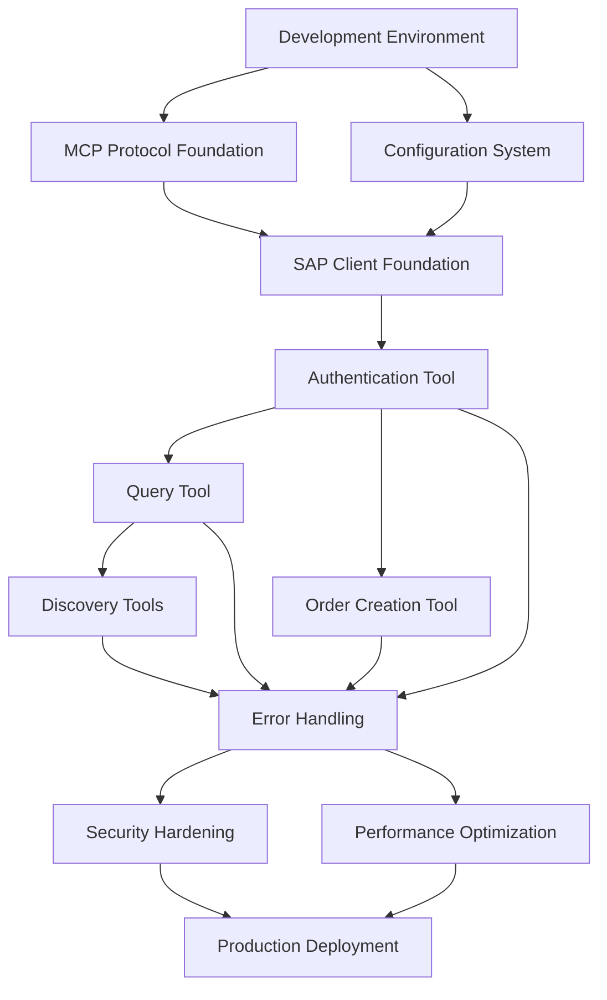

# SAP Gateway MCP Server - Implementation Workflow

## 🎯 Executive Summary

This workflow provides a comprehensive, step-by-step implementation guide for the SAP Gateway MCP Server based on the PRD requirements. The project is structured into 4 phases over 6 weeks, with parallel work streams to maximize efficiency.

**Key Deliverables**: Production-ready MCP server with 5 core tools, comprehensive testing, and multi-platform deployment support.

## 📊 Project Overview

### Success Metrics
- **Technical**: <2s response time, <1% error rate, 99.9% uptime
- **Business**: 70% reduction in SAP integration time, 5+ teams adoption
- **Quality**: 90%+ test coverage, zero security incidents

### Technology Stack
- **Backend**: Python 3.11+, FastAPI, Uvicorn
- **MCP**: Native MCP SDK (stdio + HTTP transport)
- **SAP Integration**: aiohttp for async OData calls
- **Testing**: pytest, pytest-asyncio, httpx
- **Deployment**: Docker, Cloud Run, systemd

### Current Implementation Status

✅ **Phase 1: Foundation Complete**
- MCP stdio server implementation (`stdio_server.py`)
  - Environment variable loading from `.env.server`
  - MCP SDK integration with tool registration
  - Session lifecycle management
- HTTP server implementation (`protocol/server.py`)
  - FastAPI-based REST API
  - CORS middleware and error handling
- SAP client with authentication and OData support
  - CSRF token management
  - Session cookie handling
  - SSL/TLS context configuration
- Tool registry and base tool infrastructure
  - Tool discovery and validation
  - Execution orchestration
- Configuration management with Pydantic
  - Environment-based configuration loading
  - Separate `.env.server` and `.env.client` files
  - Backward compatibility with `.env`
- 4 core SAP tools implemented
  - `sap_authenticate`: Session establishment (no credentials in tool call)
  - `sap_get_entity`: Single entity retrieval by key
  - `sap_query`: OData query execution
  - `sap_list_services`: Service discovery

✅ **Phase 2: MCP Client Design Pattern**
- Server-side authentication model
  - Credentials loaded from `.env.server` at startup
  - Tool calls require only business parameters
  - No credentials passed in MCP tool calls
- Environment configuration separation
  - `.env.server`: SAP MCP server credentials (REQUIRED)
  - `.env.client`: Client application config (OPTIONAL)
  - `.env`: Legacy fallback for backward compatibility

✅ **AI Chatbot Application**
- Interactive chatbot implementation
  - `interactive_chatbot.py`: CLI interface with commands
  - `order_inquiry_chatbot.py`: Core chatbot logic
- Google Gemini AI integration
  - Natural language processing
  - Order ID extraction from conversation
  - Multilingual support (Korean/English)
- MCP client pattern demonstration
  - stdio-based MCP client
  - Server-side SAP authentication
  - Business parameters only in tool calls
- Features
  - Interactive CLI with history and help
  - Conversation history management (max 50 entries)
  - Error handling and user-friendly messages

---

## 🏗️ Phase 1: Foundation & Core Setup (Week 1-2)

### 🎯 Phase Objectives
- Establish solid foundation for MCP protocol implementation
- Create basic SAP connectivity and authentication
- Set up development infrastructure and testing framework

### 📋 Task Breakdown

#### 1.1 Development Environment Setup (Day 1-2)
**Owner**: DevOps/Lead Developer
**Estimated Time**: 8 hours
**Dependencies**: None

**Tasks**:
- [ ] **Virtual Environment Setup** (1h)
  ```bash
  python -m venv venv
  source venv/bin/activate  # Linux/Mac
  pip install -r requirements-dev.txt
  ```
- [ ] **IDE Configuration** (1h)
  - Configure VS Code/PyCharm with Python 3.11+
  - Install Python extensions (Black, isort, mypy)
  - Set up debugging configuration
- [ ] **Git Hooks Setup** (1h)
  ```bash
  pre-commit install
  git config --local commit.template .gitmessage
  ```
- [ ] **Testing Infrastructure** (2h)
  - Configure pytest with async support
  - Set up coverage reporting (target: 90%+)
  - Create test data fixtures
- [ ] **CI/CD Pipeline** (3h)
  - GitHub Actions workflow for testing
  - Automated code quality checks
  - Docker image build automation

**Acceptance Criteria**:
✅ Development environment runs FastAPI hello world
✅ All code quality tools (black, isort, mypy) pass
✅ CI/CD pipeline passes on sample commit
✅ Test coverage reporting configured

---

#### 1.2 MCP Protocol Foundation (Day 3-5)
**Owner**: Backend Specialist
**Estimated Time**: 16 hours
**Dependencies**: Development environment

**Tasks**:
- [ ] **FastAPI Application Bootstrap** (3h)
  ```python
  # src/sap_mcp/server.py
  from fastapi import FastAPI
  from fastapi.middleware.cors import CORSMiddleware

  app = FastAPI(
      title="SAP Gateway MCP Server",
      description="MCP server for SAP Gateway integration",
      version="0.1.0"
  )
  ```
- [ ] **MCP Protocol Schema Definition** (4h)
  - Tool registration schemas (JSON Schema)
  - Request/response models with Pydantic
  - Error handling models
- [ ] **Base Tool Interface** (3h)
  ```python
  # src/sap_mcp/tools/base.py
  from abc import ABC, abstractmethod
  from typing import Dict, Any

  class SAPTool(ABC):
      @property
      @abstractmethod
      def name(self) -> str: ...

      @property
      @abstractmethod
      def input_schema(self) -> Dict[str, Any]: ...

      @abstractmethod
      async def execute(self, params: Dict[str, Any]) -> Dict[str, Any]: ...
  ```
- [ ] **Tool Registry System** (3h)
  - Dynamic tool discovery
  - Tool validation and registration
  - OpenAPI schema generation
- [ ] **HTTP Middleware Stack** (3h)
  - CORS configuration
  - Request logging with correlation IDs
  - Error handling middleware
  - Response time tracking

**Acceptance Criteria**:
✅ FastAPI server starts and serves OpenAPI docs
✅ MCP tool registration endpoint functional
✅ Basic error handling returns proper JSON
✅ Middleware logs requests with correlation IDs

---

#### 1.3 Configuration Management (Day 4-6)
**Owner**: Backend Developer
**Estimated Time**: 12 hours
**Dependencies**: FastAPI bootstrap
**Parallel**: Can work alongside MCP Protocol Foundation

**Tasks**:
- [ ] **Pydantic Settings Models** (4h)
  ```python
  # src/sap_mcp/config/settings.py
  from pydantic import BaseSettings, Field

  class SAPConnectionConfig(BaseSettings):
      host: str = Field(..., description="SAP server hostname")
      port: int = Field(44300, description="SAP server port")
      username: str = Field(..., description="SAP username")
      password: str = Field(..., description="SAP password")

      class Config:
          env_prefix = "SAP_"
  ```
- [ ] **Environment Variable Validation** (2h)
  - Required vs optional variables
  - Type validation and conversion
  - Default value handling
- [ ] **Configuration Loading System** (3h)
  - Environment-specific configs
  - Configuration validation on startup
  - Secure credential handling
- [ ] **Service Configuration Templates** (3h)
  - SAP service definitions (Z_SALES_ORDER_GENAI_SRV)
  - OData endpoint mappings
  - Custom header configurations

**Acceptance Criteria**:
✅ Server starts with valid environment variables
✅ Configuration validation fails gracefully with clear errors
✅ SAP connection parameters properly loaded
✅ Service configurations accessible to tools

---

#### 1.4 Basic SAP Connectivity (Day 6-8)
**Owner**: SAP Integration Specialist
**Estimated Time**: 16 hours
**Dependencies**: Configuration system

**Tasks**:
- [ ] **SAP Client Foundation** (4h)
  ```python
  # src/sap_mcp/sap/client.py
  import aiohttp
  from typing import Optional

  class SAPClient:
      def __init__(self, config: SAPConnectionConfig):
          self.config = config
          self.session: Optional[aiohttp.ClientSession] = None

      async def connect(self) -> bool:
          # Basic connectivity test
          pass
  ```
- [ ] **CSRF Token Management** (5h)
  - Token acquisition via GET request
  - Token storage and refresh logic
  - Session cookie handling
- [ ] **SSL/TLS Configuration** (2h)
  - Certificate validation options
  - Security context setup
  - Connection timeout handling
- [ ] **Connection Pool Management** (3h)
  - aiohttp session management
  - Connection reuse and cleanup
  - Health check implementation
- [ ] **Basic Error Handling** (2h)
  - SAP-specific error codes
  - Network error handling
  - Retry logic with exponential backoff

**Acceptance Criteria**:
✅ SAP connectivity test passes
✅ CSRF token successfully acquired and stored
✅ SSL verification configurable (dev vs prod)
✅ Connection errors properly categorized

---

#### 1.5 Testing Framework Setup (Day 7-9)
**Owner**: QA Specialist
**Estimated Time**: 12 hours
**Dependencies**: Basic infrastructure
**Parallel**: Can work alongside SAP connectivity

**Tasks**:
- [ ] **Test Structure Setup** (2h)
  ```
  tests/
  ├── unit/
  │   ├── test_config/
  │   ├── test_tools/
  │   └── test_sap/
  ├── integration/
  ├── e2e/
  └── fixtures/
  ```
- [ ] **Mock SAP Server** (4h)
  - aioresponses for HTTP mocking
  - SAP OData response fixtures
  - CSRF token simulation
- [ ] **Test Utilities** (3h)
  - Test client factory
  - Configuration fixtures
  - Common assertion helpers
- [ ] **Coverage Configuration** (1h)
  - Coverage.py setup with exclusions
  - HTML and XML report generation
  - Coverage failure thresholds
- [ ] **Performance Test Setup** (2h)
  - Basic load testing with pytest-benchmark
  - Response time assertions
  - Memory usage monitoring

**Acceptance Criteria**:
✅ Unit tests run and pass
✅ Mock SAP server responds to test requests
✅ Test coverage reports generated
✅ Performance benchmarks baseline established

---

### 🔄 Phase 1 Integration & Validation (Day 10)
**Owner**: Technical Lead
**Estimated Time**: 4 hours

**Tasks**:
- [ ] **End-to-End Connectivity Test** (2h)
  - FastAPI server → Configuration → SAP Client → Mock SAP
  - Validate entire request flow
- [ ] **Performance Baseline** (1h)
  - Measure startup time (<3s target)
  - Basic request/response timing
- [ ] **Security Validation** (1h)
  - Configuration secrets not in logs
  - HTTPS enforcement verification

**Phase 1 Success Criteria**:
✅ **Technical**: FastAPI server running with MCP protocol support
✅ **Integration**: SAP client successfully connects and authenticates
✅ **Quality**: >80% test coverage, all CI/CD checks passing
✅ **Performance**: <3s startup time, <500ms basic responses

---

## 🛠️ Phase 2: Core Tools Implementation (Week 3-4)

### 🎯 Phase Objectives
- Implement all 5 core MCP tools
- Establish robust SAP OData integration
- Achieve comprehensive error handling and logging

### 📋 Task Breakdown

#### 2.1 SAP Authentication Tool (Day 11-12)
**Owner**: SAP Integration Developer
**Estimated Time**: 10 hours
**Dependencies**: Phase 1 complete

**Tasks**:
- [ ] **Tool Implementation** (6h)
  ```python
  # src/sap_mcp/tools/auth.py
  class SAPAuthenticateTool(SAPTool):
      name = "sap_authenticate"

      async def execute(self, params: Dict[str, Any]) -> Dict[str, Any]:
          # Implement authentication logic
          pass
  ```
- [ ] **Input Validation** (2h)
  - Host, username, password validation
  - SSL verification option handling
  - Timeout configuration
- [ ] **Session Management** (2h)
  - Session creation and storage
  - Session cleanup and timeout
  - Concurrent session handling

**Acceptance Criteria**:
✅ Tool authenticates with real SAP system
✅ Returns session token and expiry information
✅ Handles authentication failures gracefully
✅ Validates all input parameters correctly

---

#### 2.2 SAP Query Tool (Day 13-15)
**Owner**: Backend Developer
**Estimated Time**: 14 hours
**Dependencies**: Authentication tool

**Tasks**:
- [ ] **OData Query Builder** (6h)
  ```python
  # src/sap_mcp/sap/odata.py
  class ODataQueryBuilder:
      def build_query_url(self, service: str, entity_set: str,
                         filters: Dict, select: List[str]) -> str:
          # Build OData query URL
          pass
  ```
- [ ] **Query Execution Engine** (4h)
  - HTTP GET request with authentication
  - Response parsing (XML → JSON)
  - Pagination handling
- [ ] **Response Transformation** (2h)
  - XML to JSON conversion
  - Field mapping and normalization
  - Error response handling
- [ ] **Tool Implementation** (2h)
  - Parameter validation
  - Query result formatting
  - Performance logging

**Acceptance Criteria**:
✅ Successfully queries SAP OData services
✅ Returns properly formatted JSON responses
✅ Handles pagination for large result sets
✅ Supports OData filter expressions

---

#### 2.3 SAP Order Creation Tool (Day 16-18)
**Owner**: SAP Integration Specialist
**Estimated Time**: 16 hours
**Dependencies**: Query tool (for validation)

**Tasks**:
- [ ] **Order Data Validation** (4h)
  ```python
  # src/sap_mcp/tools/orders.py
  class SAPCreateOrderTool(SAPTool):
      def validate_order_data(self, order_data: Dict) -> Dict:
          # Validate required SAP fields
          # Check business logic constraints
          pass
  ```
- [ ] **SAP Field Mapping** (6h)
  - Map MCP fields to SAP field names
  - Handle optional vs required fields
  - Data type conversion and validation
- [ ] **Order Creation Logic** (4h)
  - HTTP POST to SAP OData service
  - Handle SAP business logic errors
  - Transaction rollback on failure
- [ ] **Response Processing** (2h)
  - Parse SAP creation response
  - Extract order ID and status
  - Format success/error messages

**Acceptance Criteria**:
✅ Creates sales orders in SAP successfully
✅ Validates all required business fields
✅ Returns order ID and creation status
✅ Handles SAP business logic errors appropriately

---

#### 2.4 Service Discovery Tools (Day 17-19)
**Owner**: Backend Developer
**Estimated Time**: 12 hours
**Dependencies**: Query tool
**Parallel**: Can work alongside order creation

**Tasks**:
- [ ] **Service List Tool** (6h)
  ```python
  # src/sap_mcp/tools/discovery.py
  class SAPListServicesTool(SAPTool):
      async def execute(self, params: Dict[str, Any]) -> Dict[str, Any]:
          # Discover available OData services
          pass
  ```
- [ ] **Metadata Retrieval Tool** (6h)
  ```python
  class SAPGetMetadataTool(SAPTool):
      async def execute(self, params: Dict[str, Any]) -> Dict[str, Any]:
          # Get service metadata and schema
          pass
  ```

**Acceptance Criteria**:
✅ Lists available SAP OData services
✅ Retrieves service metadata and entity schemas
✅ Supports service filtering by pattern
✅ Returns structured, usable metadata information

---

#### 2.5 Error Handling & Logging Enhancement (Day 19-20)
**Owner**: Backend Developer + QA
**Estimated Time**: 10 hours
**Dependencies**: All tools implemented

**Tasks**:
- [ ] **Structured Error Responses** (4h)
  ```python
  # src/sap_mcp/exceptions.py
  class SAPError(Exception):
      def __init__(self, code: str, message: str, details: Dict = None):
          self.code = code
          self.message = message
          self.details = details or {}
  ```
- [ ] **Correlation ID System** (2h)
  - Generate unique IDs for each request
  - Pass through entire request lifecycle
  - Include in all log messages
- [ ] **Performance Monitoring** (2h)
  - Request/response time tracking
  - SAP call duration monitoring
  - Tool execution metrics
- [ ] **Audit Logging** (2h)
  - Log all SAP operations (without sensitive data)
  - Track authentication events
  - Monitor error patterns

**Acceptance Criteria**:
✅ All errors return consistent JSON format
✅ Correlation IDs tracked through request lifecycle
✅ Performance metrics collected and logged
✅ Audit trail captures all SAP operations

---

### 🔄 Phase 2 Integration & Testing (Day 20)
**Owner**: Technical Lead + QA
**Estimated Time**: 6 hours

**Tasks**:
- [ ] **Integration Testing** (3h)
  - Test all tools against real SAP system
  - Validate end-to-end workflows
  - Performance testing under load
- [ ] **Error Scenario Testing** (2h)
  - Network failures, timeouts
  - SAP system unavailable
  - Invalid authentication
- [ ] **Documentation Update** (1h)
  - API documentation generation
  - Usage examples for each tool
  - Error code reference

**Phase 2 Success Criteria**:
✅ **Functional**: All 5 tools working with real SAP system
✅ **Performance**: <2s for queries, <5s for order creation
✅ **Quality**: >85% test coverage, comprehensive error handling
✅ **Monitoring**: Complete audit trail and performance metrics

---

## 🔒 Phase 3: Security & Performance (Week 5)

### 🎯 Phase Objectives
- Implement enterprise-grade security measures
- Optimize performance for production workloads
- Establish comprehensive monitoring and alerting

### 📋 Task Breakdown

#### 3.1 Security Hardening (Day 21-23)
**Owner**: Security Specialist + Backend Lead
**Estimated Time**: 18 hours

**Tasks**:
- [ ] **Authentication & Authorization** (6h)
  ```python
  # src/sap_mcp/security/auth.py
  from fastapi.security import HTTPBearer

  security = HTTPBearer()

  async def verify_token(token: str = Depends(security)):
      # Implement token validation
      pass
  ```
- [ ] **Rate Limiting** (4h)
  - Per-client rate limiting
  - Tool-specific rate limits
  - Burst handling with token bucket
- [ ] **Input Sanitization** (4h)
  - SQL injection prevention
  - XML/JSON payload validation
  - Path traversal protection
- [ ] **Secrets Management** (4h)
  - Environment variable encryption
  - Integration with cloud secret managers
  - Credential rotation support

**Acceptance Criteria**:
✅ Authentication required for all endpoints
✅ Rate limiting prevents abuse
✅ All inputs properly sanitized
✅ Secrets encrypted at rest

---

#### 3.2 Performance Optimization (Day 24-25)
**Owner**: Performance Engineer
**Estimated Time**: 12 hours

**Tasks**:
- [ ] **Connection Pooling** (4h)
  ```python
  # src/sap_mcp/sap/pool.py
  class SAPConnectionPool:
      def __init__(self, min_size: int = 1, max_size: int = 10):
          self.min_size = min_size
          self.max_size = max_size
          self.pool: List[SAPConnection] = []
  ```
- [ ] **Caching Strategy** (4h)
  - Redis integration for session caching
  - Metadata caching with TTL
  - Query result caching
- [ ] **Async Optimization** (2h)
  - Optimize async/await usage
  - Minimize blocking operations
  - Concurrent request handling
- [ ] **Memory Management** (2h)
  - Connection cleanup
  - Memory leak detection
  - Garbage collection optimization

**Acceptance Criteria**:
✅ Connection pool maintains optimal performance
✅ Frequently accessed data cached appropriately
✅ Memory usage stays below 512MB target
✅ 100+ concurrent requests handled smoothly

---

#### 3.3 Monitoring & Observability (Day 25-26)
**Owner**: DevOps Engineer
**Estimated Time**: 10 hours

**Tasks**:
- [ ] **Prometheus Metrics** (4h)
  ```python
  # src/sap_mcp/monitoring/metrics.py
  from prometheus_client import Counter, Histogram

  request_count = Counter("sap_mcp_requests_total", "Total requests")
  request_duration = Histogram("sap_mcp_request_duration_seconds")
  ```
- [ ] **Health Check Endpoints** (2h)
  - Basic health check (`/health`)
  - Detailed health with dependencies (`/health/detailed`)
  - Readiness check (`/ready`)
- [ ] **Structured Logging** (2h)
  - JSON log format
  - Log levels configuration
  - Log aggregation preparation
- [ ] **Alerting Rules** (2h)
  - High error rate alerts
  - Performance degradation alerts
  - SAP connectivity alerts

**Acceptance Criteria**:
✅ Prometheus metrics exported successfully
✅ Health checks validate all dependencies
✅ Structured logs ready for aggregation
✅ Alert rules trigger on performance issues

---

### 🔄 Phase 3 Validation (Day 27)
**Owner**: Security + Performance Teams
**Estimated Time**: 6 hours

**Tasks**:
- [ ] **Security Testing** (3h)
  - Penetration testing simulation
  - Vulnerability scanning
  - Authentication bypass attempts
- [ ] **Load Testing** (2h)
  - 100+ concurrent users
  - Sustained load over 30 minutes
  - Memory and CPU monitoring
- [ ] **Monitoring Validation** (1h)
  - Verify all metrics collected
  - Test alerting mechanisms
  - Validate log aggregation

**Phase 3 Success Criteria**:
✅ **Security**: No critical vulnerabilities, proper authentication
✅ **Performance**: Meets all performance targets under load
✅ **Monitoring**: Complete observability with working alerts
✅ **Quality**: >90% test coverage including security tests

---

## 🚀 Phase 4: Production Deployment (Week 6)

### 🎯 Phase Objectives
- Prepare production-ready deployment packages
- Establish CI/CD pipeline for automated deployments
- Create comprehensive operational documentation

### 📋 Task Breakdown

#### 4.1 Docker & Containerization (Day 28-29)
**Owner**: DevOps Engineer
**Estimated Time**: 12 hours

**Tasks**:
- [ ] **Production Dockerfile** (4h)
  ```dockerfile
  FROM python:3.11-slim as builder
  # Multi-stage build optimization
  WORKDIR /app
  COPY requirements.txt .
  RUN pip install --user --no-cache-dir -r requirements.txt

  FROM python:3.11-slim
  COPY --from=builder /root/.local /root/.local
  # Security and optimization configurations
  ```
- [ ] **Docker Compose Configuration** (3h)
  - Production docker-compose.yml
  - Environment variable management
  - Volume mounting for logs
- [ ] **Health Check Implementation** (2h)
  - Docker health check commands
  - Graceful shutdown handling
  - Container restart policies
- [ ] **Image Optimization** (3h)
  - Multi-stage build refinement
  - Security scanning integration
  - Image size optimization

**Acceptance Criteria**:
✅ Docker image builds successfully
✅ Container starts and passes health checks
✅ Image size optimized (<500MB target)
✅ Security vulnerabilities addressed

---

#### 4.2 Cloud Run Deployment (Day 29-30)
**Owner**: Cloud Specialist
**Estimated Time**: 10 hours
**Parallel**: Can work alongside Docker optimization

**Tasks**:
- [ ] **Cloud Run Configuration** (4h)
  ```yaml
  # cloudrun.yaml
  apiVersion: serving.knative.dev/v1
  kind: Service
  metadata:
    name: sap-mcp-server
  spec:
    template:
      metadata:
        annotations:
          autoscaling.knative.dev/maxScale: "10"
          run.googleapis.com/memory: "1Gi"
  ```
- [ ] **Secret Manager Integration** (3h)
  - SAP credentials management
  - Secret rotation policies
  - Environment-specific secrets
- [ ] **Deployment Pipeline** (2h)
  - GitHub Actions for Cloud Run
  - Automated testing before deploy
  - Rollback procedures
- [ ] **Monitoring Setup** (1h)
  - Cloud Monitoring integration
  - Custom metrics configuration
  - Alerting policies

**Acceptance Criteria**:
✅ Application deploys successfully to Cloud Run
✅ Auto-scaling works under load
✅ Secrets properly managed and encrypted
✅ Monitoring and alerting operational

---

#### 4.3 VM Deployment Support (Day 30-31)
**Owner**: System Administrator
**Estimated Time**: 8 hours
**Parallel**: Can work alongside Cloud Run deployment

**Tasks**:
- [ ] **Systemd Service Configuration** (3h)
  ```ini
  # /etc/systemd/system/sap-mcp.service
  [Unit]
  Description=SAP Gateway MCP Server
  After=network.target

  [Service]
  Type=simple
  User=sapmcp
  WorkingDirectory=/opt/sap-mcp
  ExecStart=/opt/sap-mcp/venv/bin/python -m sap_mcp.server
  ```
- [ ] **Installation Scripts** (3h)
  - Automated installation script
  - Dependency management
  - User and permission setup
- [ ] **Nginx Configuration** (1h)
  - Reverse proxy setup
  - SSL termination
  - Load balancing configuration
- [ ] **Backup & Recovery** (1h)
  - Configuration backup procedures
  - Log rotation setup
  - Recovery documentation

**Acceptance Criteria**:
✅ Service installs and starts automatically
✅ Nginx reverse proxy configured correctly
✅ Backup and recovery procedures documented
✅ SSL certificates properly configured

---

#### 4.4 Documentation & Operations (Day 31-32)
**Owner**: Technical Writer + DevOps
**Estimated Time**: 10 hours

**Tasks**:
- [ ] **API Documentation** (3h)
  - OpenAPI specification completion
  - Interactive documentation
  - Code examples for each tool
- [ ] **Deployment Guides** (3h)
  - Cloud Run deployment guide
  - VM deployment guide
  - Kubernetes deployment guide
- [ ] **Operations Manual** (2h)
  - Troubleshooting guide
  - Performance tuning guide
  - Monitoring playbook
- [ ] **Security Documentation** (2h)
  - Security configuration guide
  - Compliance checklist
  - Incident response procedures

**Acceptance Criteria**:
✅ Complete API documentation with examples
✅ Deployment guides tested and validated
✅ Operations manual covers common scenarios
✅ Security documentation audit-ready

---

### 🔄 Phase 4 Final Validation (Day 32)
**Owner**: Technical Lead + QA
**Estimated Time**: 8 hours

**Tasks**:
- [ ] **End-to-End Testing** (4h)
  - Production deployment testing
  - Load testing in production environment
  - Disaster recovery testing
- [ ] **User Acceptance Testing** (2h)
  - Stakeholder demonstration
  - Feature validation against PRD
  - Performance validation
- [ ] **Go-Live Preparation** (2h)
  - Production cutover checklist
  - Monitoring dashboard setup
  - Support team training

**Phase 4 Success Criteria**:
✅ **Deployment**: Successfully deployed to all target environments
✅ **Performance**: Meets all SLA requirements in production
✅ **Documentation**: Complete operational documentation
✅ **Readiness**: Team trained and ready for production support

---

## 🔄 Dependency Mapping

### Critical Path Dependencies


### Parallel Work Streams

#### Stream 1: Core Infrastructure (Week 1-2)
- **Lead**: Backend Architect
- **Team**: 2-3 developers
- **Focus**: MCP protocol, configuration, basic SAP connectivity

#### Stream 2: Tool Implementation (Week 3-4)
- **Lead**: SAP Integration Specialist
- **Team**: 2-3 developers
- **Focus**: 5 core tools, error handling, testing

#### Stream 3: Security & Performance (Week 5)
- **Lead**: Security Engineer
- **Team**: 2 developers + QA
- **Focus**: Security hardening, performance optimization

#### Stream 4: Deployment & Operations (Week 6)
- **Lead**: DevOps Engineer
- **Team**: 1-2 engineers + technical writer
- **Focus**: Containerization, deployment automation, documentation

---

## ⚠️ Risk Assessment & Mitigation

### Technical Risks

#### 🔴 High Risk: SAP API Changes
**Probability**: Medium | **Impact**: High
**Mitigation**:
- Implement version negotiation in SAP client
- Create abstraction layer for SAP-specific logic
- Maintain backward compatibility testing
- Monitor SAP release notes and documentation

#### 🟡 Medium Risk: Performance Under Load
**Probability**: Medium | **Impact**: Medium
**Mitigation**:
- Implement connection pooling from day 1
- Continuous performance monitoring
- Load testing in each phase
- Circuit breaker pattern for SAP calls

#### 🟡 Medium Risk: Security Vulnerabilities
**Probability**: Low | **Impact**: High
**Mitigation**:
- Security review in each phase
- Automated vulnerability scanning
- Penetration testing before production
- Regular dependency updates

### Timeline Risks

#### 🔴 High Risk: SAP Connectivity Issues
**Probability**: Medium | **Impact**: High
**Mitigation**:
- Early SAP connectivity validation
- Mock SAP server for development
- Dedicated SAP environment for testing
- SAP administrator involvement from day 1

#### 🟡 Medium Risk: Integration Complexity
**Probability**: Medium | **Impact**: Medium
**Mitigation**:
- Incremental integration approach
- Comprehensive integration testing
- Regular stakeholder demos
- Clear interface definitions

---

## 📊 Success Metrics & KPIs

### Development Metrics
- **Code Quality**: >90% test coverage, 0 critical security vulnerabilities
- **Performance**: <3s startup, <2s queries, <5s order creation
- **Reliability**: <1% error rate, >99.9% uptime SLA

### Business Metrics
- **Adoption**: 5+ teams using within 3 months
- **Efficiency**: 70% reduction in SAP integration development time
- **Satisfaction**: 4.5/5 developer satisfaction rating

### Operational Metrics
- **Deployment**: Successful deployment to 3 environments
- **Documentation**: 100% API coverage, complete operational guides
- **Support**: <4 hour response time for critical issues

---

## 🎯 Final Deliverables

### Technical Artifacts
✅ **Production-Ready MCP Server** with 5 core tools
✅ **Comprehensive Test Suite** (>90% coverage)
✅ **Docker Images** optimized for production
✅ **Deployment Automation** for multiple platforms

### Documentation Package
✅ **API Documentation** with interactive examples
✅ **Deployment Guides** for Cloud Run, VM, Kubernetes
✅ **Operations Manual** with troubleshooting guides
✅ **Security Documentation** for compliance

### Infrastructure Assets
✅ **CI/CD Pipeline** with automated testing and deployment
✅ **Monitoring & Alerting** with Prometheus and Grafana
✅ **Security Scanning** integrated into development workflow
✅ **Performance Monitoring** with custom metrics

---

## 🚀 Next Steps After Implementation

1. **Monitoring & Optimization** (Ongoing)
   - Performance tuning based on production metrics
   - Security updates and vulnerability management
   - Feature usage analysis and optimization

2. **Feature Expansion** (Month 2-3)
   - Additional SAP modules (HR, Finance)
   - Enhanced query capabilities
   - Bulk operation support

3. **Enterprise Features** (Month 3-6)
   - Multi-tenant support
   - Advanced authentication (OAuth2, SAML)
   - Enhanced monitoring and analytics

4. **Community & Ecosystem** (Month 6+)
   - Open source community building
   - Plugin ecosystem development
   - Integration with other enterprise systems

This comprehensive implementation workflow provides a clear roadmap for delivering a production-ready SAP Gateway MCP Server that meets all requirements outlined in the PRD while maintaining high standards for security, performance, and maintainability.
